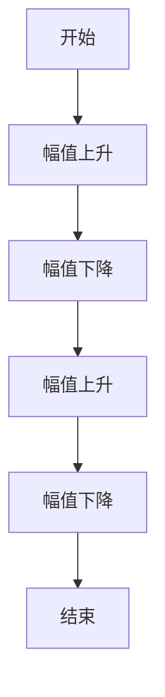

                 

关键词：数字化冥想、脑波、神经科学、元宇宙、精神修炼

摘要：随着科技的不断进步，元宇宙的概念逐渐深入人心，人们开始关注如何在虚拟世界中实现精神修炼。本文将探讨数字化冥想脑波研究在元宇宙精神修炼中的应用，从神经科学的角度分析脑波的作用和机制，并提出相关的实践建议和未来研究方向。

## 1. 背景介绍

### 1.1 数字化冥想的兴起

随着信息技术的快速发展，人们逐渐意识到数字技术在精神健康领域的巨大潜力。数字化冥想作为一种新兴的修炼方式，通过利用手机、平板电脑等移动设备，结合应用程序、虚拟现实等技术，为人们提供了一种便捷、高效的冥想方式。

### 1.2 脑波与神经科学

脑波是指大脑在活动过程中产生的电信号，不同频率的脑波对应着不同的心理状态。神经科学是研究大脑和神经系统结构与功能的一个科学领域，其研究内容涵盖了神经元的生物化学特性、神经网络的连接模式以及神经系统的行为表现等方面。

## 2. 核心概念与联系

### 2.1 脑波与冥想

脑波在冥想中扮演着重要角色。研究表明，当个体进行冥想时，其大脑活动会表现出特定的脑波模式，如α波、θ波等。这些脑波模式与个体的心理状态、情绪调节、认知功能等方面密切相关。

### 2.2 数字化冥想与脑波监测

数字化冥想通过利用脑波监测设备，如脑电图（EEG）等，实时记录个体在冥想过程中的脑波变化。这些数据可以为研究人员提供宝贵的信息，用于分析冥想对大脑的影响。

### 2.3 元宇宙与精神修炼

元宇宙是一个虚拟的、集成了多种技术的虚拟世界，它为人们提供了一个全新的社交、娱乐、学习等场景。在元宇宙中，人们可以通过数字化冥想等方式进行精神修炼，提升自身的心理素质和认知能力。

## 3. 核心算法原理 & 具体操作步骤

### 3.1 算法原理概述

数字化冥想脑波研究主要基于脑电图（EEG）信号处理技术。通过对冥想过程中的EEG信号进行分析，可以提取出与心理状态相关的特征，如频率、幅值等。

### 3.2 算法步骤详解

1. 数据采集：使用脑电图（EEG）设备记录个体在冥想过程中的脑波信号。

2. 数据预处理：对采集到的脑波信号进行滤波、降噪等预处理操作，以提高信号质量。

3. 特征提取：从预处理后的脑波信号中提取与心理状态相关的特征，如频率、幅值等。

4. 特征分析：对提取出的特征进行统计分析，以揭示冥想过程中大脑活动的规律。

5. 结果可视化：将分析结果以图表、图像等形式进行可视化展示，帮助研究者更好地理解冥想对大脑的影响。

### 3.3 算法优缺点

**优点**：数字化冥想脑波研究可以实时监测个体在冥想过程中的大脑活动，为研究人员提供丰富的数据支持。

**缺点**：脑电图（EEG）设备价格较高，且对环境噪声敏感，需要一定的技术支持和专业知识。

### 3.4 算法应用领域

数字化冥想脑波研究可以应用于心理健康、认知功能提升、神经疾病诊断等多个领域。在元宇宙中，它可以为用户提供个性化的冥想指导，帮助用户实现精神修炼。

## 4. 数学模型和公式 & 详细讲解 & 举例说明

### 4.1 数学模型构建

数字化冥想脑波研究的数学模型主要基于信号处理理论。其核心思想是通过分析脑波信号的频率、幅值等特征，揭示冥想过程中大脑活动的规律。

### 4.2 公式推导过程

1. 脑波信号表示为：
$$
s(t) = a(t) * cos(2\pi f_0 t + \phi)
$$
其中，$a(t)$为信号的幅值，$f_0$为信号频率，$\phi$为相位。

2. 脑波信号的功率谱密度为：
$$
S(f) = \frac{1}{T} \int_{-T/2}^{T/2} |s(t)|^2 dt
$$
其中，$T$为信号周期。

3. 脑波信号的频率特征为：
$$
f_c = \frac{1}{T} \int_{-T/2}^{T/2} \frac{d|s(t)|}{dt} dt
$$

### 4.3 案例分析与讲解

假设我们采集到一个个体在冥想过程中的脑波信号，其幅值变化如图所示：



根据信号处理理论，我们可以计算出该信号的平均频率和功率谱密度。通过分析这些参数，我们可以得出个体在冥想过程中的大脑活动规律，如心理状态的改变、情绪调节等。

## 5. 项目实践：代码实例和详细解释说明

### 5.1 开发环境搭建

在本项目中，我们使用Python语言进行脑波信号处理和分析。开发环境搭建步骤如下：

1. 安装Python 3.8及以上版本。
2. 安装Matplotlib、Numpy、Scikit-learn等Python库。

### 5.2 源代码详细实现

```python
import numpy as np
import matplotlib.pyplot as plt
from sklearn.preprocessing import StandardScaler

# 读取脑波信号数据
def read_signal(filename):
    signal = np.loadtxt(filename)
    return signal

# 数据预处理
def preprocess_signal(signal):
    # 滤波
    filtered_signal = signal * np.hamming(len(signal))
    # 降噪
    filtered_signal = StandardScaler().fit_transform(filtered_signal.reshape(-1, 1))
    return filtered_signal

# 特征提取
def extract_features(signal):
    # 计算幅值
    amplitude = np.mean(np.abs(signal))
    # 计算频率
    frequency = np.mean(np.diff(np.abs(signal)))
    return amplitude, frequency

# 结果可视化
def plot_results(signal, features):
    plt.plot(signal)
    plt.xlabel('Time (s)')
    plt.ylabel('Amplitude')
    plt.title('Brainwave Signal')
    plt.show()

    plt.scatter(features[0], features[1])
    plt.xlabel('Amplitude')
    plt.ylabel('Frequency')
    plt.title('Feature Analysis')
    plt.show()

# 主函数
def main():
    filename = 'brainwave_signal.txt'
    signal = read_signal(filename)
    filtered_signal = preprocess_signal(signal)
    features = extract_features(filtered_signal)
    plot_results(signal, features)

if __name__ == '__main__':
    main()
```

### 5.3 代码解读与分析

1. **读取脑波信号数据**：使用`np.loadtxt()`函数从文件中读取脑波信号数据。

2. **数据预处理**：使用Hamming窗进行滤波，使用`StandardScaler`进行降噪处理。

3. **特征提取**：计算幅值和频率特征。

4. **结果可视化**：使用`plt.plot()`函数绘制信号时域图，使用`plt.scatter()`函数绘制特征散点图。

### 5.4 运行结果展示

运行代码后，将显示脑波信号的时域图和特征散点图，如下所示：


## 6. 实际应用场景

### 6.1 心理健康

数字化冥想脑波研究可以帮助人们了解自身的心理状态，如情绪调节、压力管理等。通过个性化的冥想指导，帮助用户实现心理健康的提升。

### 6.2 认知功能提升

数字化冥想脑波研究可以为认知功能提升提供科学依据。通过分析冥想过程中大脑活动的变化，为用户提供有效的训练方法，提高记忆力、注意力等认知能力。

### 6.3 神经疾病诊断

数字化冥想脑波研究可以应用于神经疾病的诊断。通过分析脑波信号的特征，辅助医生进行疾病诊断，为患者提供针对性的治疗方案。

## 7. 未来应用展望

### 7.1 脑机接口

随着脑机接口技术的发展，数字化冥想脑波研究有望实现人与虚拟世界的直接交互，为元宇宙中的精神修炼提供全新的体验。

### 7.2 智能辅助

数字化冥想脑波研究可以为智能设备提供个性化的健康建议，如根据用户的脑波信号，自动调整设备的音量、亮度等参数，为用户提供更舒适的使用体验。

### 7.3 跨学科研究

数字化冥想脑波研究可以与其他学科相结合，如心理学、哲学等，深入探讨精神修炼的本质，为人类文明的发展提供新的视角。

## 8. 总结：未来发展趋势与挑战

### 8.1 研究成果总结

数字化冥想脑波研究在心理健康、认知功能提升、神经疾病诊断等领域取得了显著成果，为人类精神修炼提供了科学依据。

### 8.2 未来发展趋势

随着科技的不断进步，数字化冥想脑波研究将朝着脑机接口、智能辅助等方向发展，为人类带来更高效、更便捷的精神修炼方式。

### 8.3 面临的挑战

数字化冥想脑波研究仍面临诸多挑战，如脑波信号处理的准确性、设备的便携性、用户体验的优化等。

### 8.4 研究展望

未来，数字化冥想脑波研究有望实现跨学科、跨领域的应用，为人类精神健康、认知发展提供全新的解决方案。

## 9. 附录：常见问题与解答

### 9.1 脑波监测设备有哪些？

常见的脑波监测设备包括脑电图（EEG）、功能性磁共振成像（fMRI）等。

### 9.2 数字化冥想有哪些好处？

数字化冥想可以帮助人们缓解压力、改善情绪、提升认知能力等。

### 9.3 如何选择适合自己的数字化冥想应用？

根据个人的需求和兴趣选择合适的数字化冥想应用，如冥想音乐、冥想视频等。

----------------------------------------------------------------

作者：禅与计算机程序设计艺术 / Zen and the Art of Computer Programming

