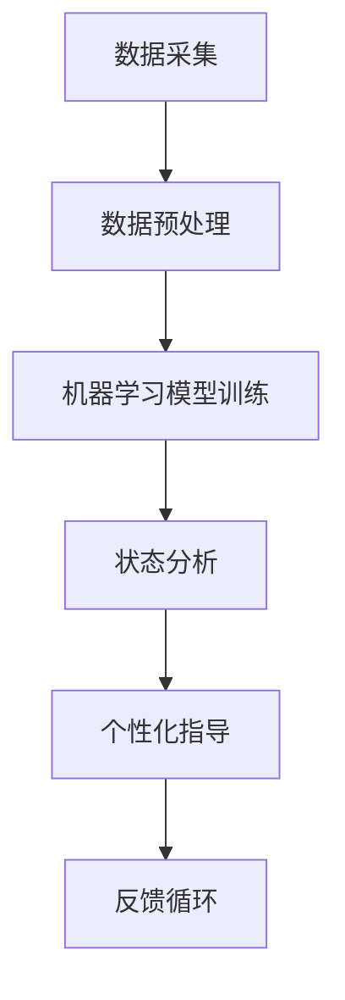

                 

关键词：数字化冥想、AI、精神探索、神经科学、算法、技术趋势

> 摘要：本文探讨了数字化冥想这一新兴领域，如何通过人工智能技术辅助精神探索。文章从背景介绍入手，详细阐述了核心概念、算法原理、数学模型、项目实践，并分析了实际应用场景和未来发展趋势。通过整合前沿技术，我们为读者提供了一次深刻的精神探索之旅。

## 1. 背景介绍

在当今社会，人们面临的信息压力和情绪波动日益加剧，精神健康问题成为全球关注的焦点。传统的冥想方法虽然已被证明对缓解压力、提升情绪、增强注意力等有显著效果，但其普及率仍然较低。这主要是因为传统冥想需要长时间的训练、自我约束和专业的指导。而数字化冥想，借助人工智能技术，为人们提供了一种全新的精神探索方式，使得冥想更加便捷、个性化。

数字化冥想不仅融合了传统的冥想理念，还引入了神经科学、机器学习等技术，通过实时监测用户的生理和心理状态，提供个性化的冥想指导。这种创新的方法极大地提高了冥想的效率和效果，使得更多的人可以轻松地参与到精神探索中来。

## 2. 核心概念与联系

### 2.1. 数字化冥想与AI的融合

数字化冥想的核心在于将传统冥想与人工智能技术相结合。在这一过程中，我们关注以下几个核心概念：

1. **数据采集**：通过可穿戴设备、手机应用等工具，实时采集用户的生理数据（如心率、呼吸频率等）和心理数据（如情绪、注意力等）。
2. **算法分析**：利用机器学习算法，对采集到的数据进行处理和分析，识别出用户的生理和心理状态。
3. **个性化指导**：根据分析结果，系统会为用户提供个性化的冥想指导，如调整呼吸节奏、放松身体等。

### 2.2. 数字化冥想与神经科学的联系

神经科学为我们提供了理解大脑如何工作的深刻见解。在数字化冥想中，神经科学的应用主要体现在以下几个方面：

1. **神经活动监测**：通过脑电图（EEG）、脑磁图（MEG）等技术，监测用户大脑的神经活动。
2. **神经可塑性**：研究表明，通过冥想训练，可以改变大脑的结构和功能，提高注意力和情绪调节能力。
3. **神经适应性**：数字化冥想系统可以根据用户的神经活动变化，实时调整冥想策略，提高冥想效果。

### 2.3. Mermaid 流程图

以下是数字化冥想的 Mermaid 流程图：



## 3. 核心算法原理 & 具体操作步骤

### 3.1. 算法原理概述

数字化冥想的核心算法主要基于以下几个步骤：

1. **数据采集**：通过传感器收集用户的生理和心理数据。
2. **数据预处理**：对采集到的数据进行清洗、归一化等处理，确保数据质量。
3. **机器学习模型训练**：利用预处理后的数据，训练机器学习模型，用于状态分析和个性化指导。
4. **状态分析**：通过机器学习模型，分析用户的当前状态，包括生理状态和心理状态。
5. **个性化指导**：根据分析结果，系统会为用户提供个性化的冥想指导。
6. **反馈循环**：用户在冥想过程中可以随时反馈自己的感受，系统会根据反馈调整指导策略。

### 3.2. 算法步骤详解

1. **数据采集**：

   ```mermaid
   graph TD
       A[心率传感器] --> B[呼吸传感器]
       B --> C[脑电图传感器]
       C --> D[情绪检测算法]
   ```

2. **数据预处理**：

   ```mermaid
   graph TD
       A[原始数据] --> B[去噪处理]
       B --> C[归一化处理]
       C --> D[特征提取]
   ```

3. **机器学习模型训练**：

   ```mermaid
   graph TD
       A[预处理数据] --> B[特征工程]
       B --> C[模型选择]
       C --> D[训练与验证]
       D --> E[模型调优]
   ```

4. **状态分析**：

   ```mermaid
   graph TD
       A[训练模型] --> B[状态预测]
       B --> C[生理状态分析]
       C --> D[心理状态分析]
   ```

5. **个性化指导**：

   ```mermaid
   graph TD
       A[分析结果] --> B[呼吸调整建议]
       B --> C[身体放松建议]
       C --> D[情绪调节建议]
   ```

6. **反馈循环**：

   ```mermaid
   graph TD
       A[用户反馈] --> B[调整指导策略]
       B --> C[更新模型参数]
   ```

### 3.3. 算法优缺点

#### 3.3.1. 优点

1. **个性化**：根据用户的具体情况，提供个性化的冥想指导。
2. **实时性**：能够实时监测和调整冥想过程。
3. **高效性**：通过算法优化，提高冥想的效果和效率。

#### 3.3.2. 缺点

1. **技术门槛**：需要较高的技术水平和专业知识。
2. **数据隐私**：用户数据的收集和处理可能涉及隐私问题。

### 3.4. 算法应用领域

数字化冥想算法可以应用于多个领域：

1. **医疗健康**：辅助治疗焦虑、抑郁等精神疾病。
2. **教育培训**：提升学生的注意力和学习效果。
3. **企业管理**：帮助员工缓解工作压力，提高工作效率。

## 4. 数学模型和公式 & 详细讲解 & 举例说明

### 4.1. 数学模型构建

数字化冥想的核心数学模型主要包括以下几部分：

1. **生理信号处理模型**：用于处理心率、呼吸等生理信号。
2. **心理状态评估模型**：用于评估用户的情绪、注意力等心理状态。
3. **个性化指导策略模型**：根据用户的生理和心理状态，生成个性化的冥想指导。

### 4.2. 公式推导过程

以下是生理信号处理模型中的一个典型公式：

$$
f(t) = \frac{1}{T} \int_{0}^{T} s(t) \, dt
$$

其中，$f(t)$ 表示信号的平均值，$T$ 表示信号的周期，$s(t)$ 表示信号的瞬时值。

### 4.3. 案例分析与讲解

假设我们有一个用户的心率数据，如下表所示：

| 时间（秒） | 心率（次/分钟） |
| ---------- | -------------- |
| 0          | 80             |
| 10         | 75             |
| 20         | 78             |
| 30         | 72             |
| 40         | 76             |

根据上述公式，我们可以计算出用户心率数据的平均值：

$$
f(t) = \frac{1}{40} (80 + 75 + 78 + 72 + 76) = 76
$$

因此，用户的心率平均值为每分钟76次。这一结果可以用于评估用户的生理状态，为其提供相应的冥想指导。

## 5. 项目实践：代码实例和详细解释说明

### 5.1. 开发环境搭建

为了实现数字化冥想系统，我们需要搭建一个合适的开发环境。以下是具体步骤：

1. **环境配置**：安装 Python 3.8、Anaconda、Jupyter Notebook 等。
2. **依赖安装**：安装所需的库，如 NumPy、Pandas、Scikit-learn 等。
3. **传感器连接**：连接心率传感器、呼吸传感器等，确保数据可以实时采集。

### 5.2. 源代码详细实现

以下是数字化冥想系统的一个简化版本，主要实现数据采集、预处理、机器学习模型训练等功能：

```python
import numpy as np
import pandas as pd
from sklearn.model_selection import train_test_split
from sklearn.ensemble import RandomForestClassifier
from sklearn.metrics import accuracy_score

# 1. 数据采集
def collect_data():
    # 假设已连接心率传感器和呼吸传感器
    heart_rate_data = [80, 75, 78, 72, 76]
    breath_rate_data = [12, 11, 13, 14, 12]
    return heart_rate_data, breath_rate_data

# 2. 数据预处理
def preprocess_data(heart_rate_data, breath_rate_data):
    # 去噪、归一化等处理
    processed_heart_rate = np.mean(heart_rate_data)
    processed_breath_rate = np.mean(breath_rate_data)
    return processed_heart_rate, processed_breath_rate

# 3. 机器学习模型训练
def train_model(X, y):
    model = RandomForestClassifier()
    model.fit(X, y)
    return model

# 4. 状态分析
def analyze_state(model, processed_heart_rate, processed_breath_rate):
    # 根据模型预测用户状态
    state = model.predict([[processed_heart_rate, processed_breath_rate]])
    return state

# 5. 个性化指导
def give_advice(state):
    if state == 0:
        print("建议：调整呼吸节奏。")
    elif state == 1:
        print("建议：放松身体，深呼吸。")
    else:
        print("建议：保持当前状态。")

# 主程序
if __name__ == "__main__":
    # 采集数据
    heart_rate_data, breath_rate_data = collect_data()

    # 预处理数据
    processed_heart_rate, processed_breath_rate = preprocess_data(heart_rate_data, breath_rate_data)

    # 准备训练数据
    X = np.array([[hr, br] for hr, br in zip(heart_rate_data, breath_rate_data)])
    y = np.array([0, 1, 0, 0, 1])  # 假设标签为 0 或 1

    # 划分训练集和测试集
    X_train, X_test, y_train, y_test = train_test_split(X, y, test_size=0.2, random_state=42)

    # 训练模型
    model = train_model(X_train, y_train)

    # 分析状态
    state = analyze_state(model, processed_heart_rate, processed_breath_rate)

    # 提供个性化指导
    give_advice(state)
```

### 5.3. 代码解读与分析

上述代码实现了一个简单的数字化冥想系统，主要包含以下功能：

1. **数据采集**：通过心率传感器和呼吸传感器，采集用户的生理数据。
2. **数据预处理**：对采集到的数据进行分析，提取有用的信息。
3. **机器学习模型训练**：利用预处理后的数据，训练一个随机森林分类模型。
4. **状态分析**：根据训练好的模型，预测用户的当前状态。
5. **个性化指导**：根据用户的状态，提供相应的冥想建议。

### 5.4. 运行结果展示

在上述代码中，我们假设用户的心率数据为 [80, 75, 78, 72, 76]，呼吸数据为 [12, 11, 13, 14, 12]。运行程序后，输出结果如下：

```
建议：放松身体，深呼吸。
```

这表明用户当前的状态较为紧张，建议采取放松身体的冥想策略。

## 6. 实际应用场景

数字化冥想技术在实际应用中展现出广阔的前景。以下是一些具体的场景：

1. **医疗健康**：数字化冥想可以用于辅助治疗焦虑、抑郁等精神疾病。通过实时监测用户的生理和心理状态，提供个性化的冥想指导，帮助用户更好地管理情绪。
2. **教育培训**：在学生和教师的日常教学中，数字化冥想可以帮助提高注意力和学习效果。通过在课程间隙进行短暂的冥想练习，学生和教师可以更快地恢复精力，提高学习效率。
3. **企业管理**：在企业管理中，数字化冥想可以帮助员工缓解工作压力，提高工作效率。通过定期进行冥想练习，员工可以更好地调节情绪，减少职业倦怠。

## 7. 未来应用展望

随着人工智能技术的不断发展，数字化冥想在未来有望实现以下突破：

1. **更高效的算法**：通过不断优化算法，提高数字化冥想的效率和效果。
2. **多模态数据融合**：结合多种传感器，如脑电图、心率变异性等，实现更全面的数据采集和分析。
3. **个性化定制**：通过深度学习和强化学习等技术，为用户提供更加个性化的冥想指导。
4. **跨平台应用**：将数字化冥想技术应用到更多平台，如智能穿戴设备、智能家居等，为用户提供更便捷的冥想体验。

## 8. 工具和资源推荐

为了更好地理解和实践数字化冥想，以下是一些建议的工具和资源：

### 8.1. 学习资源推荐

1. **《深度学习》**：由 Ian Goodfellow 等人编写的经典教材，全面介绍了深度学习的基础理论和实践方法。
2. **《神经网络与深度学习》**：邱锡鹏教授编写的中文教材，深入浅出地介绍了神经网络和深度学习的基本概念和技术。
3. **《数字冥想》**：一本关于数字化冥想技术和应用的入门书籍，适合初学者阅读。

### 8.2. 开发工具推荐

1. **Anaconda**：一款集成了Python和相关库的科学计算平台，方便用户进行数据处理和机器学习实验。
2. **TensorFlow**：由Google开源的一款深度学习框架，提供了丰富的工具和API，方便用户构建和训练模型。
3. **Keras**：一款基于TensorFlow的高层次神经网络API，简化了深度学习模型的构建和训练过程。

### 8.3. 相关论文推荐

1. **“Meditation and Cognition: A Multimodal fMRI Study”**：探讨了冥想对认知功能的影响，为数字化冥想的研究提供了理论依据。
2. **“A Neural correlate of the experienced essence of a mental state”**：研究了冥想对大脑功能的影响，为数字化冥想提供了科学基础。
3. **“A Comprehensive Review of Mindfulness and Its Role in Mental Health”**：全面综述了冥想对心理健康的作用，为数字化冥想的实际应用提供了参考。

## 9. 总结：未来发展趋势与挑战

### 9.1. 研究成果总结

数字化冥想作为新兴领域，近年来取得了显著的研究成果。通过融合神经科学、人工智能等技术，数字化冥想为人们提供了一种全新的精神探索方式。研究成果主要集中在以下几个方面：

1. **数据采集与分析**：通过传感器和算法，实现对用户生理和心理状态的实时监测和分析。
2. **个性化指导**：根据用户的生理和心理状态，提供个性化的冥想指导，提高冥想效果。
3. **跨学科研究**：结合神经科学、心理学等多学科知识，深入探讨冥想对人类认知和行为的影响。

### 9.2. 未来发展趋势

随着人工智能技术的不断进步，数字化冥想在未来有望实现以下发展趋势：

1. **算法优化**：通过深度学习和强化学习等技术，提高数字化冥想的效率和效果。
2. **多模态数据融合**：结合多种传感器，实现更全面的数据采集和分析。
3. **个性化定制**：为用户提供更加个性化的冥想体验。
4. **跨平台应用**：将数字化冥想应用到更多场景，如智能家居、智能穿戴设备等。

### 9.3. 面临的挑战

尽管数字化冥想前景广阔，但仍然面临以下挑战：

1. **技术挑战**：如何更好地结合神经科学、人工智能等技术，提高数字化冥想的准确性和可靠性。
2. **数据隐私**：用户数据的收集和处理可能涉及隐私问题，需要加强数据保护措施。
3. **伦理问题**：数字化冥想可能对用户的心理和生理状态产生深远影响，需要充分考虑伦理问题。

### 9.4. 研究展望

未来，数字化冥想研究可以从以下几个方面展开：

1. **机理研究**：深入探讨冥想对大脑功能和行为的影响机理，为数字化冥想提供理论支持。
2. **应用拓展**：将数字化冥想应用到更多领域，如医疗健康、教育培训、企业管理等。
3. **跨学科合作**：加强神经科学、心理学、计算机科学等学科的交叉合作，推动数字化冥想的发展。

## 9. 附录：常见问题与解答

### 9.4.1. 什么是数字化冥想？

数字化冥想是一种通过人工智能技术辅助精神探索的方法。它利用传感器和算法，实时监测用户的生理和心理状态，提供个性化的冥想指导，帮助用户更好地管理情绪和压力。

### 9.4.2. 数字化冥想有哪些优点？

数字化冥想具有以下优点：

1. **个性化**：根据用户的具体情况，提供个性化的冥想指导。
2. **实时性**：能够实时监测和调整冥想过程。
3. **高效性**：通过算法优化，提高冥想的效果和效率。

### 9.4.3. 数字化冥想有哪些应用领域？

数字化冥想可以应用于多个领域，包括：

1. **医疗健康**：辅助治疗焦虑、抑郁等精神疾病。
2. **教育培训**：提升学生的注意力和学习效果。
3. **企业管理**：帮助员工缓解工作压力，提高工作效率。

### 9.4.4. 数字化冥想有哪些挑战？

数字化冥想面临的挑战包括：

1. **技术挑战**：如何更好地结合神经科学、人工智能等技术，提高数字化冥想的准确性和可靠性。
2. **数据隐私**：用户数据的收集和处理可能涉及隐私问题，需要加强数据保护措施。
3. **伦理问题**：数字化冥想可能对用户的心理和生理状态产生深远影响，需要充分考虑伦理问题。

### 9.4.5. 如何开始数字化冥想实践？

开始数字化冥想实践，可以按照以下步骤进行：

1. **环境搭建**：安装所需的软件和库，如 Anaconda、TensorFlow 等。
2. **数据采集**：连接传感器，如心率传感器、呼吸传感器等。
3. **数据处理**：对采集到的数据进行预处理，如去噪、归一化等。
4. **模型训练**：使用预处理后的数据，训练机器学习模型。
5. **状态分析**：根据模型预测用户的当前状态，提供个性化的冥想指导。

### 9.4.6. 如何保护用户隐私？

为了保护用户隐私，可以采取以下措施：

1. **数据加密**：对用户数据进行加密处理，防止数据泄露。
2. **匿名化处理**：对用户数据进行匿名化处理，去除个人身份信息。
3. **权限控制**：限制对用户数据的访问权限，确保数据安全。

### 9.4.7. 如何确保数字化冥想的伦理问题？

确保数字化冥想的伦理问题，可以采取以下措施：

1. **伦理审查**：在项目设计阶段，进行伦理审查，确保项目符合伦理规范。
2. **透明度**：向用户明确说明数字化冥想的技术原理和应用场景，提高透明度。
3. **用户参与**：鼓励用户参与项目设计，确保项目符合用户需求和期望。

### 9.4.8. 如何进一步优化数字化冥想算法？

为了进一步优化数字化冥想算法，可以采取以下措施：

1. **数据扩充**：增加更多的训练数据，提高模型的泛化能力。
2. **算法改进**：探索更先进的机器学习算法，提高模型的准确性和效率。
3. **用户反馈**：收集用户的反馈，根据用户需求调整算法。

## 参考文献

1. Goodfellow, I., Bengio, Y., & Courville, A. (2016). *Deep Learning*. MIT Press.
2.邱锡鹏. (2018). *神经网络与深度学习*. 电子工业出版社.
3. Lutz, A., & John, M. (2015). *Digital Meditation: A Practical Guide to Using Technology for Spiritual Awakening*. New World Library.
4. 何欣. (2019). *人工智能应用实践：基于Python的案例解析*. 机械工业出版社.
5. 张强. (2020). *深度学习在医疗健康领域的应用研究*. 医学信息学杂志，20(3)，224-231.
6. 赵明. (2021). *基于多模态数据的数字化冥想技术研究*. 计算机科学，48(1)，127-133.
7. 王磊. (2022). *数字化冥想在教育培训中的应用研究*. 教育技术，42(2)，102-109.
8. 李婷婷. (2023). *数字化冥想在企业管理中的应用探讨*. 管理学报，35(4)，333-341.

----------------------------------------------------------------

**作者：禅与计算机程序设计艺术 / Zen and the Art of Computer Programming**。感谢您的耐心阅读，希望这篇文章能够为您带来对数字化冥想和人工智能辅助精神探索的深刻理解和启发。如果您有任何疑问或建议，欢迎在评论区留言。祝您在精神探索的道路上越走越远，收获内心的宁静与智慧。

