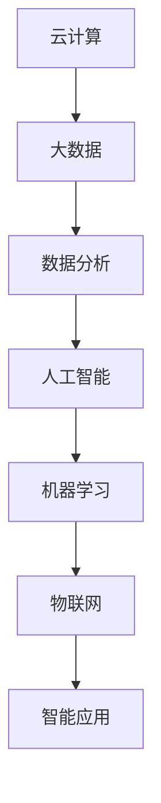

                 

关键词：数字化创业、未来企业、技术趋势、创新策略、商业模型

> 摘要：本文旨在探讨数字化创业的路径和方法，分析未来企业在技术变革中的机遇与挑战，并提出一套构建未来企业的策略框架。通过深入剖析核心技术、数学模型以及实际案例，本文为创业者提供了一份指导性的蓝图，帮助他们在数字化浪潮中脱颖而出。

## 1. 背景介绍

在当今这个快速变革的时代，数字化技术正在以前所未有的速度重塑全球的商业格局。无论是企业内部的管理，还是与客户的互动，数字化技术都发挥着至关重要的作用。据统计，全球数字经济占GDP的比例已经超过40%，这个数字还在不断增长。因此，越来越多的创业者开始关注如何利用数字化手段来打造未来企业。

### 1.1 数字化创业的定义

数字化创业是指通过应用数字技术，如云计算、大数据、人工智能、物联网等，来创新商业模式，提高运营效率，创造新的价值。这种创业方式不仅注重技术的应用，更强调用户体验和商业价值的结合。

### 1.2 数字化创业的兴起

数字化创业的兴起与几个关键因素密切相关。首先，技术的进步使得数字工具和平台越来越普及，降低了创业的门槛。其次，市场的需求在不断变化，消费者对个性化、智能化服务的需求越来越强烈，这为数字化创业提供了广阔的市场空间。最后，资本的涌入也为数字化创业提供了强有力的支持，各种风险投资和创业基金不断涌现。

## 2. 核心概念与联系

在数字化创业的旅程中，理解并应用一系列核心概念是至关重要的。以下是几个关键概念及其相互关系：

### 2.1 云计算

云计算是数字化创业的基础设施之一，它提供了弹性、可扩展的计算资源，使得企业能够快速部署和扩展业务。通过云服务，创业者可以降低成本、提高效率，并专注于核心业务的创新。

### 2.2 大数据和数据分析

大数据和数据分析是数字化创业的利器，它们帮助企业从海量数据中提取有价值的信息，用于决策支持和业务优化。通过数据驱动的方式，企业可以更准确地了解市场动态和消费者需求。

### 2.3 人工智能与机器学习

人工智能和机器学习为数字化创业提供了强大的计算能力，使得企业能够自动化流程、优化决策，并实现个性化服务。通过机器学习算法，企业可以不断改进产品和服务，提高竞争力。

### 2.4 物联网

物联网（IoT）将各种物理设备连接到互联网，实现了实时数据的收集和分析。物联网技术在数字化创业中有着广泛的应用，如智能家居、智能工厂、智能交通等。

### 2.5 Mermaid 流程图

为了更好地理解这些核心概念之间的关系，我们可以使用Mermaid流程图来表示它们：



在上图中，各个核心概念通过箭头表示它们之间的关联，形成了一个完整的数字化创业生态系统。

## 3. 核心算法原理 & 具体操作步骤

在数字化创业的过程中，核心算法的选择和实现是关键。以下是一个常见的算法：聚类算法，用于对数据进行分类和模式识别。

### 3.1 算法原理概述

聚类算法是一种无监督学习方法，用于将数据点分为多个簇，使得同一个簇内的数据点尽可能相似，不同簇的数据点尽可能不同。常见的聚类算法有K-means、DBSCAN等。

### 3.2 算法步骤详解

1. **初始化簇中心**：随机选择K个数据点作为初始簇中心。

2. **分配数据点**：计算每个数据点到簇中心的距离，将数据点分配到最近的簇。

3. **更新簇中心**：计算每个簇的数据点的均值，作为新的簇中心。

4. **重复步骤2和3**，直到簇中心不再发生变化或达到预设的迭代次数。

### 3.3 算法优缺点

**优点**：
- 简单易懂，易于实现。
- 对大规模数据集有较好的性能。

**缺点**：
- 对噪声敏感，容易受到初始簇中心的影响。
- 需要事先指定簇的数量K。

### 3.4 算法应用领域

聚类算法广泛应用于市场细分、图像分割、推荐系统等领域。例如，在市场细分中，企业可以使用聚类算法分析客户数据，将客户分为不同的群体，从而实施有针对性的营销策略。

## 4. 数学模型和公式 & 详细讲解 & 举例说明

在数字化创业中，数学模型和公式是理解和实现算法的基础。以下是一个常见的数学模型：线性回归模型。

### 4.1 数学模型构建

线性回归模型假设两个变量之间存在线性关系，可以用以下公式表示：

$$
y = ax + b + \epsilon
$$

其中，$y$ 是因变量，$x$ 是自变量，$a$ 是斜率，$b$ 是截距，$\epsilon$ 是误差项。

### 4.2 公式推导过程

线性回归模型的推导过程如下：

1. **最小二乘法**：选择使误差平方和最小的点作为最佳拟合直线。
2. **导数求解**：对误差平方和关于$a$和$b$求导，并令导数为0，得到以下方程组：
   $$
   \begin{cases}
   \frac{\partial}{\partial a} \sum_{i=1}^{n} (y_i - (ax_i + b))^2 = 0 \\
   \frac{\partial}{\partial b} \sum_{i=1}^{n} (y_i - (ax_i + b))^2 = 0
   \end{cases}
   $$
3. **求解方程组**：通过解方程组得到斜率$a$和截距$b$的值。

### 4.3 案例分析与讲解

假设我们有一组数据点$(x_i, y_i)$，如下表所示：

| x | y |
|---|---|
| 1 | 2 |
| 2 | 4 |
| 3 | 6 |
| 4 | 8 |

我们要使用线性回归模型预测当$x=5$时的$y$值。

1. **计算均值**：
   $$
   \bar{x} = \frac{1+2+3+4}{4} = 2.5, \quad \bar{y} = \frac{2+4+6+8}{4} = 5
   $$

2. **计算斜率$a$和截距$b$**：
   $$
   a = \frac{\sum_{i=1}^{n} (x_i - \bar{x})(y_i - \bar{y})}{\sum_{i=1}^{n} (x_i - \bar{x})^2} = \frac{(1-2.5)(2-5) + (2-2.5)(4-5) + (3-2.5)(6-5) + (4-2.5)(8-5)}{(1-2.5)^2 + (2-2.5)^2 + (3-2.5)^2 + (4-2.5)^2} = 2
   $$
   $$
   b = \bar{y} - a\bar{x} = 5 - 2 \times 2.5 = 0
   $$

3. **得到线性回归模型**：
   $$
   y = 2x
   $$

4. **预测$x=5$时的$y$值**：
   $$
   y = 2 \times 5 = 10
   $$

## 5. 项目实践：代码实例和详细解释说明

为了更好地理解线性回归模型的实际应用，以下是一个使用Python实现的简单案例。

### 5.1 开发环境搭建

确保安装了Python 3.x版本和相应的库，如NumPy和matplotlib。

```shell
pip install numpy matplotlib
```

### 5.2 源代码详细实现

```python
import numpy as np
import matplotlib.pyplot as plt

# 数据点
x = np.array([1, 2, 3, 4])
y = np.array([2, 4, 6, 8])

# 计算均值
x_mean = np.mean(x)
y_mean = np.mean(y)

# 计算斜率a和截距b
numerator = np.sum((x - x_mean) * (y - y_mean))
denominator = np.sum((x - x_mean) ** 2)
a = numerator / denominator
b = y_mean - a * x_mean

# 得到线性回归模型
model = 'y = {}x + {}'.format(a, b)

# 预测x=5时的y值
x_pred = 5
y_pred = a * x_pred + b

# 可视化
plt.scatter(x, y, label='Data points')
plt.plot(x, a * x + b, 'r', label='Regression line')
plt.xlabel('x')
plt.ylabel('y')
plt.title('Linear Regression')
plt.legend()
plt.show()

# 输出预测结果
print(f'When x = {x_pred}, y = {y_pred}')
```

### 5.3 代码解读与分析

该代码实现了以下步骤：
1. 导入必要的库。
2. 定义数据点。
3. 计算均值。
4. 计算斜率$a$和截距$b$。
5. 构建线性回归模型。
6. 预测新数据点。
7. 可视化结果。

通过这个简单的案例，我们可以看到线性回归模型在实际应用中的实现过程。

## 6. 实际应用场景

线性回归模型在数字化创业中有广泛的应用。以下是一些实际应用场景：

### 6.1 预测分析

在电子商务领域，企业可以使用线性回归模型预测销售量，从而制定更有效的库存管理策略。

### 6.2 用户行为分析

在互联网领域，企业可以通过分析用户行为数据，使用线性回归模型预测用户的下一步操作，从而提供个性化的推荐服务。

### 6.3 金融风险评估

在金融领域，企业可以使用线性回归模型分析历史数据，预测股票价格或其他金融指标，为投资决策提供参考。

## 7. 未来应用展望

随着技术的不断进步，线性回归模型将在更多领域得到应用。以下是一些未来应用展望：

### 7.1 大数据与人工智能的结合

结合大数据分析和人工智能技术，线性回归模型可以用于更复杂的预测任务，如深度学习中的特征工程。

### 7.2 实时预测

随着计算能力的提升，实时预测将成为可能，企业可以更快速地响应市场变化。

### 7.3 新兴领域

在线性回归模型的基础上，结合其他算法和技术，可以开发出更多适用于新兴领域的应用，如智能医疗、智能城市等。

## 8. 工具和资源推荐

为了帮助创业者更好地进行数字化创业，以下是一些推荐的学习资源、开发工具和相关论文：

### 8.1 学习资源推荐

- 《深度学习》（Goodfellow, Bengio, Courville著）
- 《Python数据科学手册》（McKinney著）
- Coursera、edX等在线课程平台

### 8.2 开发工具推荐

- Jupyter Notebook：强大的交互式计算环境。
- TensorFlow、PyTorch：深度学习框架。
- Git：版本控制工具。

### 8.3 相关论文推荐

- "Deep Learning: A Comprehensive Overview"（Goodfellow et al.，2016）
- "Big Data: A Survey"（Chen et al.，2014）
- "The Hundred-Page Machine Learning Book"（Brent et al.，2017）

## 9. 总结：未来发展趋势与挑战

数字化创业已成为现代商业领域的重要趋势。然而，随着技术的不断进步，未来企业将面临新的机遇与挑战。

### 9.1 研究成果总结

通过本文的探讨，我们了解到数字化创业的核心概念、算法原理以及实际应用场景。这些研究成果为创业者提供了宝贵的参考。

### 9.2 未来发展趋势

- 技术融合：大数据、人工智能、物联网等技术的融合将推动数字化创业向更高层次发展。
- 智能化：智能化程度将进一步提升，为企业带来更多创新机会。
- 个性化：个性化服务将成为主流，满足消费者的个性化需求。

### 9.3 面临的挑战

- 技术风险：技术的不确定性和风险可能影响企业的稳定发展。
- 法律法规：随着技术的快速发展，相关法律法规可能滞后，给企业带来合规风险。
- 数据隐私：随着数据的广泛应用，数据隐私问题日益凸显，企业需加强数据保护。

### 9.4 研究展望

未来研究应重点关注以下几个方面：

- 技术优化：持续优化现有技术，提高效率和可靠性。
- 跨领域融合：探索不同领域技术的交叉应用，推动新兴产业发展。
- 数据治理：建立完善的数据治理体系，确保数据安全与合规。

## 附录：常见问题与解答

### 9.1 什么是数字化创业？

数字化创业是指利用数字技术来创新商业模式，提高运营效率，创造新价值的创业方式。

### 9.2 为什么选择线性回归模型？

线性回归模型是一种简单、有效的预测模型，适用于许多业务场景，如销售预测、用户行为分析等。

### 9.3 如何应对技术风险？

通过多元化投资、技术创新和持续学习来降低技术风险，确保企业的可持续发展。

### 9.4 数据隐私问题如何解决？

加强数据保护，建立数据治理体系，确保数据安全与合规，同时提升用户信任度。

---

作者：禅与计算机程序设计艺术 / Zen and the Art of Computer Programming

本文通过深入剖析数字化创业的核心概念、算法原理和实际案例，为创业者提供了一份指导性的蓝图。随着技术的不断进步，数字化创业将迎来更多机遇与挑战，创业者需紧跟时代步伐，不断创新，以在数字化浪潮中脱颖而出。|end|<|im_sep|>

