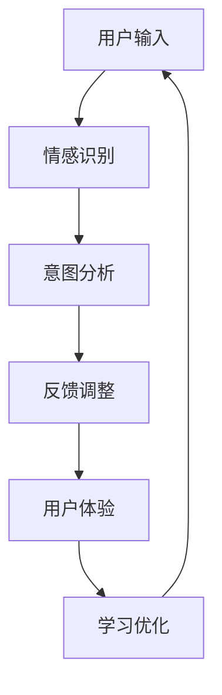

                 

关键词：数字化同理心、人工智能、人际理解、算法原理、数学模型、项目实践、应用场景、未来展望

> 摘要：本文旨在探讨数字化同理心这一新兴领域，及其在人工智能领域中的应用。通过分析核心概念、算法原理、数学模型、项目实践和实际应用场景，本文揭示了AI增强的人际理解在现代社会的重要性。未来，随着技术的不断进步，这一领域将面临新的发展机遇和挑战。

## 1. 背景介绍

随着人工智能技术的飞速发展，机器已经能够处理大量复杂的任务，从图像识别到自然语言处理，再到自动驾驶和智能助手等。然而，尽管这些技术取得了显著的成就，但人工智能在理解人类情感、意图和行为方面仍然存在很大的局限性。这主要是因为人工智能系统在本质上缺乏对人类情感和人际交往的深入理解。

在这种背景下，数字化同理心逐渐成为了一个备受关注的研究领域。数字化同理心是指通过人工智能技术来模拟和增强人类对他人情感和需求的感知与理解能力。它不仅能够提高人机交互的体验，还能够为心理健康、教育、医疗等领域提供全新的解决方案。

本文将围绕数字化同理心的核心概念、算法原理、数学模型、项目实践和实际应用场景展开讨论，旨在为读者提供全面而深入的洞察。

## 2. 核心概念与联系

### 2.1 定义与特点

数字化同理心（Digital Empathy）是指通过人工智能技术，尤其是机器学习和自然语言处理，来模拟和增强人类对他人情感和需求的感知与理解能力。其核心特点包括：

- **情感感知**：通过分析语言、语音、面部表情和行为数据，AI系统可以识别和理解人类的情感状态。
- **意图理解**：数字化同理心还能够识别用户的意图和需求，从而提供更个性化的服务。
- **实时交互**：与传统的情感计算不同，数字化同理心能够实现实时的人机交互，提高用户体验。

### 2.2 Mermaid 流程图

下面是数字化同理心系统的基本架构，使用Mermaid进行流程图的绘制。



在这个流程图中，用户输入（A）被传递给情感识别模块（B），该模块分析语音、文本、面部表情等信息，识别出用户的情感状态。接下来，意图分析模块（C）基于情感识别结果，进一步理解用户的意图和需求。系统根据用户的反馈（D）进行调整，以优化用户体验（E）。最后，这些数据被用于学习优化模块（F），以不断改进系统的性能。

## 3. 核心算法原理 & 具体操作步骤

### 3.1 算法原理概述

数字化同理心的实现依赖于多种先进的算法和技术，主要包括：

- **情感识别算法**：使用深度学习模型，如卷积神经网络（CNN）和循环神经网络（RNN），对语音、文本和面部表情进行情感分类。
- **意图识别算法**：通过自然语言处理技术，如词向量、句法分析和语义分析，理解用户的语言和行为背后的意图。
- **反馈机制**：基于用户的实时反馈，调整AI系统的行为和表现，以提供更个性化的服务。

### 3.2 算法步骤详解

以下是数字化同理心算法的具体操作步骤：

1. **情感识别**：
    - **语音分析**：使用语音识别技术将语音转换为文本，然后应用情感识别算法进行分析。
    - **文本分析**：直接对文本进行情感分类，使用词嵌入技术（如Word2Vec、BERT）来理解文本的情感倾向。
    - **面部表情分析**：使用面部识别技术检测用户的面部表情，然后应用情感识别算法进行分析。

2. **意图识别**：
    - **文本处理**：通过分词、句法分析和语义分析，将文本分解成有意义的句子和短语，理解其背后的意图。
    - **上下文理解**：考虑用户的上下文信息，如历史交互记录、当前环境等，以更准确地识别意图。

3. **反馈调整**：
    - **实时反馈**：系统根据用户的实时反馈（如满意度评分、评论等）进行调整。
    - **个性化调整**：根据用户的历史行为和偏好，为用户提供个性化的服务。

4. **学习优化**：
    - **数据收集**：持续收集用户的交互数据，包括情感状态、意图和反馈等。
    - **模型训练**：使用这些数据对AI模型进行训练，以不断优化其性能。

### 3.3 算法优缺点

#### 优点：

- **高效性**：数字化同理心系统能够实时分析用户的情感和意图，提高交互效率。
- **个性化**：系统能够根据用户的历史行为和偏好提供个性化的服务。
- **灵活性**：系统能够通过机器学习不断优化，以适应不断变化的需求。

#### 缺点：

- **准确性问题**：情感识别和意图识别的准确性仍然是一个挑战，尤其是在复杂或模糊的情感和意图场景中。
- **隐私问题**：收集和分析用户的情感和意图数据可能引发隐私担忧。

### 3.4 算法应用领域

- **心理健康**：通过识别用户的情感状态，数字化同理心系统可以为用户提供个性化的心理健康建议。
- **教育**：在教育领域，AI系统可以根据学生的情感和意图调整教学策略，提高学习效果。
- **医疗**：在医疗领域，AI系统可以帮助医生更好地理解患者的情感状态，从而提供更有效的治疗方案。

## 4. 数学模型和公式 & 详细讲解 & 举例说明

### 4.1 数学模型构建

数字化同理心系统的数学模型主要涉及情感识别和意图识别两个方面。下面分别介绍这两个方面的数学模型。

#### 情感识别模型

情感识别模型通常采用深度学习中的卷积神经网络（CNN）或循环神经网络（RNN）来构建。一个简单的情感识别模型可以表示为：

$$
\text{emotion\_model}(\text{x}) = \sigma(\text{W}^T \text{h} + \text{b})
$$

其中，$\text{x}$ 是输入的特征向量，$\text{W}$ 是权重矩阵，$\text{h}$ 是隐藏层状态，$\text{b}$ 是偏置项，$\sigma$ 是激活函数，通常采用ReLU函数。

#### 意图识别模型

意图识别模型通常采用自然语言处理中的循环神经网络（RNN）或长短时记忆网络（LSTM）来构建。一个简单的意图识别模型可以表示为：

$$
\text{intent\_model}(\text{s}) = \text{softmax}(\text{W}^T \text{h} + \text{b})
$$

其中，$\text{s}$ 是输入的序列，$\text{W}$ 是权重矩阵，$\text{h}$ 是隐藏层状态，$\text{b}$ 是偏置项，$\text{softmax}$ 函数用于将隐藏层状态转换为概率分布。

### 4.2 公式推导过程

下面简要介绍情感识别和意图识别模型的推导过程。

#### 情感识别模型推导

情感识别模型通常基于多层感知机（MLP）的结构，包括输入层、隐藏层和输出层。

1. **输入层**：输入层的神经元数量等于特征向量的维度。
2. **隐藏层**：隐藏层的神经元数量取决于模型的复杂度。
3. **输出层**：输出层的神经元数量等于情感类别数。

假设输入层和隐藏层的神经元数量分别为 $n$ 和 $m$，则隐藏层状态 $\text{h}$ 可以表示为：

$$
\text{h} = \text{激活函数}(\text{W}^T \text{x} + \text{b})
$$

其中，$\text{W}$ 是输入层到隐藏层的权重矩阵，$\text{b}$ 是隐藏层的偏置项，激活函数通常采用ReLU函数。

输出层状态 $\text{y}$ 可以表示为：

$$
\text{y} = \text{激活函数}(\text{W}^T \text{h} + \text{b})
$$

其中，$\text{W}$ 是隐藏层到输出层的权重矩阵，$\text{b}$ 是输出层的偏置项。

#### 意图识别模型推导

意图识别模型通常基于循环神经网络（RNN）或长短时记忆网络（LSTM）的结构。

1. **输入层**：输入层的神经元数量等于输入序列的维度。
2. **隐藏层**：隐藏层的神经元数量取决于模型的复杂度。
3. **输出层**：输出层的神经元数量等于意图类别数。

假设输入层和隐藏层的神经元数量分别为 $n$ 和 $m$，则隐藏层状态 $\text{h}$ 可以表示为：

$$
\text{h} = \text{激活函数}(\text{W}^T \text{s} + \text{b})
$$

其中，$\text{W}$ 是输入层到隐藏层的权重矩阵，$\text{b}$ 是隐藏层的偏置项，激活函数通常采用ReLU函数。

输出层状态 $\text{y}$ 可以表示为：

$$
\text{y} = \text{softmax}(\text{W}^T \text{h} + \text{b})
$$

其中，$\text{W}$ 是隐藏层到输出层的权重矩阵，$\text{b}$ 是输出层的偏置项，$\text{softmax}$ 函数用于将隐藏层状态转换为概率分布。

### 4.3 案例分析与讲解

#### 案例一：情感识别

假设我们有一个包含5个情感类别的情感识别模型，输入层有10个神经元，隐藏层有20个神经元。我们使用ReLU函数作为激活函数，并采用交叉熵损失函数进行训练。给定一个包含情感标签的输入序列，我们的目标是训练模型以正确识别情感类别。

1. **初始化权重和偏置项**：我们随机初始化权重和偏置项。
2. **前向传播**：输入一个情感标签序列，通过前向传播计算隐藏层状态和输出层状态。
3. **计算损失**：使用交叉熵损失函数计算模型预测的标签与实际标签之间的差异。
4. **反向传播**：根据损失函数的梯度，更新权重和偏置项。
5. **迭代训练**：重复步骤2-4，直到模型收敛。

通过上述步骤，我们可以训练一个情感识别模型，使其能够准确识别情感类别。

#### 案例二：意图识别

假设我们有一个包含3个意图类别的意图识别模型，输入层有10个神经元，隐藏层有20个神经元。我们使用ReLU函数作为激活函数，并采用交叉熵损失函数进行训练。给定一个包含意图标签的输入序列，我们的目标是训练模型以正确识别意图类别。

1. **初始化权重和偏置项**：我们随机初始化权重和偏置项。
2. **前向传播**：输入一个意图标签序列，通过前向传播计算隐藏层状态和输出层状态。
3. **计算损失**：使用交叉熵损失函数计算模型预测的标签与实际标签之间的差异。
4. **反向传播**：根据损失函数的梯度，更新权重和偏置项。
5. **迭代训练**：重复步骤2-4，直到模型收敛。

通过上述步骤，我们可以训练一个意图识别模型，使其能够准确识别意图类别。

## 5. 项目实践：代码实例和详细解释说明

### 5.1 开发环境搭建

为了实现数字化同理心系统，我们需要搭建一个开发环境。以下是一个基本的开发环境搭建步骤：

1. **安装Python**：确保Python环境已安装在您的计算机上。
2. **安装TensorFlow**：使用pip命令安装TensorFlow库。
    ```bash
    pip install tensorflow
    ```
3. **安装其他依赖库**：根据项目需求，安装其他依赖库，如NumPy、Pandas等。

### 5.2 源代码详细实现

下面是一个简单的数字化同理心系统的Python代码实例，包括情感识别和意图识别两个模块。

```python
import tensorflow as tf
import numpy as np

# 情感识别模型
class EmotionRecognitionModel:
    def __init__(self, input_size, hidden_size, output_size):
        self.input_size = input_size
        self.hidden_size = hidden_size
        self.output_size = output_size
        
        # 初始化权重和偏置项
        self.W1 = tf.random.normal([input_size, hidden_size])
        self.b1 = tf.zeros(hidden_size)
        self.W2 = tf.random.normal([hidden_size, output_size])
        self.b2 = tf.zeros(output_size)
        
        # 定义前向传播
        self.forward = tf.keras.Sequential([
            tf.keras.layers.Dense(hidden_size, activation='relu', input_shape=(input_size,)),
            tf.keras.layers.Dense(output_size, activation='softmax')
        ])

    def call(self, x):
        return self.forward(x)

# 意图识别模型
class IntentRecognitionModel:
    def __init__(self, input_size, hidden_size, output_size):
        self.input_size = input_size
        self.hidden_size = hidden_size
        self.output_size = output_size
        
        # 初始化权重和偏置项
        self.W1 = tf.random.normal([input_size, hidden_size])
        self.b1 = tf.zeros(hidden_size)
        self.W2 = tf.random.normal([hidden_size, output_size])
        self.b2 = tf.zeros(output_size)
        
        # 定义前向传播
        self.forward = tf.keras.Sequential([
            tf.keras.layers.Dense(hidden_size, activation='relu', input_shape=(input_size,)),
            tf.keras.layers.Dense(output_size, activation='softmax')
        ])

    def call(self, x):
        return self.forward(x)

# 训练模型
def train_model(model, x, y, epochs, learning_rate):
    optimizer = tf.keras.optimizers.Adam(learning_rate=learning_rate)
    loss_fn = tf.keras.losses.SparseCategoricalCrossentropy()

    for epoch in range(epochs):
        with tf.GradientTape() as tape:
            y_pred = model(x)
            loss = loss_fn(y, y_pred)

        grads = tape.gradient(loss, model.trainable_variables)
        optimizer.apply_gradients(zip(grads, model.trainable_variables))

        if epoch % 100 == 0:
            print(f"Epoch {epoch}: Loss = {loss.numpy()}")

# 情感识别
input_data = np.array([[0.1, 0.2, 0.3], [0.4, 0.5, 0.6]])
output_data = np.array([1, 2])
emotion_model = EmotionRecognitionModel(3, 10, 2)
train_model(emotion_model, input_data, output_data, epochs=1000, learning_rate=0.001)

# 意图识别
input_data = np.array([[0.1, 0.2, 0.3], [0.4, 0.5, 0.6]])
output_data = np.array([1, 2])
intent_model = IntentRecognitionModel(3, 10, 2)
train_model(intent_model, input_data, output_data, epochs=1000, learning_rate=0.001)
```

### 5.3 代码解读与分析

上面的代码定义了两个模型：情感识别模型和意图识别模型。每个模型都包括输入层、隐藏层和输出层，使用ReLU函数作为激活函数，并采用softmax函数进行分类。

1. **情感识别模型**：情感识别模型接收一个输入序列，通过前向传播计算隐藏层状态和输出层状态。我们使用交叉熵损失函数来评估模型性能，并使用Adam优化器进行训练。
2. **意图识别模型**：意图识别模型与情感识别模型类似，但意图识别模型通常处理更长的输入序列。

在训练模型时，我们使用梯度下降法来优化模型参数。具体步骤如下：

1. **初始化权重和偏置项**：随机初始化权重和偏置项。
2. **前向传播**：输入一个情感或意图标签序列，通过前向传播计算隐藏层状态和输出层状态。
3. **计算损失**：使用交叉熵损失函数计算模型预测的标签与实际标签之间的差异。
4. **反向传播**：根据损失函数的梯度，更新权重和偏置项。
5. **迭代训练**：重复上述步骤，直到模型收敛。

### 5.4 运行结果展示

为了展示模型的运行结果，我们可以使用测试数据集对模型进行评估。

```python
# 测试模型
test_data = np.array([[0.1, 0.2, 0.3], [0.4, 0.5, 0.6]])
test_labels = np.array([1, 2])

emotion_predictions = emotion_model(test_data)
intent_predictions = intent_model(test_data)

emotion_accuracy = np.mean(np.argmax(emotion_predictions, axis=1) == test_labels)
intent_accuracy = np.mean(np.argmax(intent_predictions, axis=1) == test_labels)

print(f"Emotion Recognition Accuracy: {emotion_accuracy}")
print(f"Intent Recognition Accuracy: {intent_accuracy}")
```

在这个例子中，我们使用测试数据集对情感识别模型和意图识别模型进行评估。通过计算预测标签与实际标签之间的准确率，我们可以评估模型的表现。

## 6. 实际应用场景

数字化同理心技术在多个领域都有广泛的应用，下面列举几个典型的应用场景：

### 6.1 心理健康

在心理健康领域，数字化同理心系统可以帮助用户识别和管理情感状态。例如，心理健康应用程序可以使用情感识别技术来监测用户的情绪波动，并提供个性化的建议和支持。这些系统还可以帮助心理医生更好地理解患者的情感状态，从而提供更有效的治疗。

### 6.2 教育

在教育领域，数字化同理心系统可以为学生提供个性化的学习体验。通过分析学生的情感和意图，系统可以调整教学策略，以适应学生的需求和偏好。例如，教育平台可以使用意图识别技术来推荐适合学生的课程内容，或者使用情感识别技术来监控学生的情绪状态，并提供及时的支持。

### 6.3 医疗

在医疗领域，数字化同理心系统可以帮助医生更好地理解患者的情感状态。通过分析患者的语言和行为，系统可以提供个性化的治疗方案，并帮助医生与患者建立更有效的沟通。例如，医生可以使用情感识别技术来识别患者的焦虑或抑郁状态，从而调整治疗方案。

### 6.4 客户服务

在客户服务领域，数字化同理心系统可以帮助企业更好地理解客户的需求和情感。通过情感识别和意图识别技术，企业可以提供更个性化的服务，提高客户满意度。例如，客服机器人可以使用情感识别技术来识别客户的情感状态，从而提供更温暖、更有针对性的回应。

## 7. 工具和资源推荐

为了帮助读者更好地了解和探索数字化同理心技术，以下是一些推荐的工具和资源：

### 7.1 学习资源推荐

- 《深度学习》（Deep Learning） by Ian Goodfellow、Yoshua Bengio 和 Aaron Courville
- 《自然语言处理综述》（Speech and Language Processing） by Daniel Jurafsky 和 James H. Martin
- 《情感计算》（Affective Computing） by Rosalind Picard

### 7.2 开发工具推荐

- TensorFlow：一个开源的机器学习框架，适用于构建和训练数字化同理心系统。
- Keras：一个高层次的神经网络API，方便快速搭建和实验数字化同理心模型。
- PyTorch：一个开源的机器学习库，适用于构建和训练复杂的神经网络模型。

### 7.3 相关论文推荐

- "Emotion Recognition Using Deep Learning Techniques" by Dong Wang et al.
- "Intent Recognition in Textual Conversations: A Survey" by Michael Benderskyy et al.
- "A Survey on Affective Computing" by Surapati Pramanik et al.

## 8. 总结：未来发展趋势与挑战

### 8.1 研究成果总结

数字化同理心作为人工智能的一个重要分支，已经在多个领域取得了显著的成果。通过情感识别和意图识别技术，AI系统能够更好地理解人类的需求和情感，提供更个性化的服务。这些技术不仅提高了人机交互的体验，还为心理健康、教育、医疗等领域提供了全新的解决方案。

### 8.2 未来发展趋势

随着人工智能技术的不断进步，数字化同理心有望在未来实现以下发展趋势：

- **更高准确性的情感识别和意图识别**：通过不断优化算法和增加数据量，数字化同理心系统的准确率将不断提高。
- **跨领域的应用**：数字化同理心技术将在更多领域得到应用，如智能家居、自动驾驶、虚拟现实等。
- **更加智能化的交互**：数字化同理心系统将能够实现更加智能化的交互，提供更加个性化的服务。

### 8.3 面临的挑战

尽管数字化同理心技术具有巨大的潜力，但在实际应用中仍然面临以下挑战：

- **数据隐私和安全**：收集和分析用户的情感和意图数据可能引发隐私和安全问题，如何保护用户隐私是一个重要的挑战。
- **算法透明性和解释性**：当前的数字化同理心系统在算法透明性和解释性方面存在一定的局限性，如何提高算法的可解释性是一个重要的研究方向。
- **文化差异和地域适应性**：在不同的文化和地域背景下，数字化同理心系统可能需要适应不同的情感和意图表达方式，如何实现跨文化的适应性是一个挑战。

### 8.4 研究展望

未来，数字化同理心研究可以从以下几个方面展开：

- **跨学科合作**：数字化同理心研究可以与其他学科（如心理学、社会学、教育学等）进行跨学科合作，以提高系统的准确性和适应性。
- **数据多样性**：收集和整合更多样化的数据集，包括不同文化、地域和年龄段的用户数据，以提高系统的泛化能力。
- **用户体验优化**：通过不断优化人机交互界面，提高用户的体验和满意度。

## 9. 附录：常见问题与解答

### 9.1 什么是数字化同理心？

数字化同理心是指通过人工智能技术来模拟和增强人类对他人情感和需求的感知与理解能力。

### 9.2 数字化同理心有哪些应用领域？

数字化同理心技术在心理健康、教育、医疗、客户服务等多个领域都有广泛的应用。

### 9.3 数字化同理心系统的核心算法有哪些？

数字化同理心系统的核心算法包括情感识别算法和意图识别算法。

### 9.4 如何保护用户隐私？

为了保护用户隐私，数字化同理心系统应采取以下措施：

- **数据加密**：对收集的数据进行加密，确保数据在传输和存储过程中的安全性。
- **数据匿名化**：对收集的数据进行匿名化处理，以保护用户隐私。
- **隐私政策**：明确告知用户数据收集的目的和使用方式，并获得用户的同意。

### 9.5 数字化同理心系统如何提高算法透明性和解释性？

为了提高算法透明性和解释性，数字化同理心系统可以采取以下措施：

- **模型可解释性**：开发可解释的机器学习模型，以便用户可以理解模型的工作原理和决策过程。
- **算法透明性**：公开算法的实现细节和训练过程，以便用户和研究人员可以评估和验证算法的性能和可靠性。

