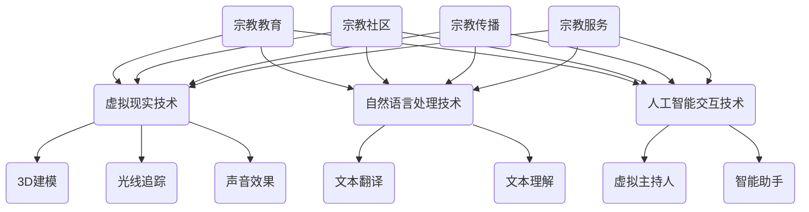

                 

关键词：数字化宗教、全球脑时代、信仰表达、科技与宗教、宗教仪式

> 摘要：本文探讨了数字化宗教仪式在全球化背景下的崛起和演变，以及它如何成为全球脑时代信仰表达的一种新兴形式。通过分析数字化宗教仪式的核心概念、技术架构、算法原理、数学模型、实践应用和未来展望，本文旨在揭示这一领域的关键特征和潜在影响，为科技与宗教的深度融合提供新的视角和思考。

## 1. 背景介绍

### 全球脑时代的到来

随着互联网、大数据、人工智能等技术的迅猛发展，人类社会正进入一个全新的时代——全球脑时代。在这个时代，人类的大脑不再是孤立的个体，而是通过互联网相互连接，形成一个庞大的全球神经网络。这个网络不仅加速了信息的传播和共享，也改变了人们的认知方式和交流模式。

### 科技与宗教的交融

宗教是人类社会的重要组成部分，它为人类提供了精神寄托和价值观的引导。而科技的进步，尤其是数字化技术的兴起，为宗教的表达方式带来了革命性的变化。数字化宗教仪式应运而生，成为全球脑时代信仰表达的一种新兴形式。

## 2. 核心概念与联系

### 数字化宗教仪式

数字化宗教仪式是指通过数字化技术实现的宗教仪式，包括虚拟教堂、在线祈祷、数字灵修、宗教虚拟现实等。这些仪式利用互联网、虚拟现实、人工智能等技术，为信徒提供了一种全新的信仰体验。

### 全球脑时代的信仰表达

全球脑时代的信仰表达体现在以下几个方面：

1. **虚拟参与**：信徒可以通过互联网参与全球范围内的宗教活动，打破地理限制，实现全球化信仰交流。
2. **个性化体验**：数字化技术可以根据信徒的个人需求和偏好，提供个性化的信仰内容和服务。
3. **沉浸式体验**：虚拟现实技术让信徒在虚拟环境中体验宗教仪式，增强信仰的参与感和真实感。
4. **情感互动**：通过社交媒体和虚拟社区，信徒可以与全球的信仰者进行互动，形成紧密的信仰共同体。

## 3. 核心算法原理 & 具体操作步骤

### 算法原理概述

数字化宗教仪式的核心算法主要包括以下几个方面：

1. **虚拟现实技术**：通过3D建模和实时渲染技术，创建虚拟的宗教场所和仪式环境。
2. **自然语言处理**：利用自然语言处理技术，实现宗教文本的自动翻译和理解，为不同语言背景的信徒提供服务。
3. **人工智能交互**：通过人工智能技术，实现虚拟主持人、智能助手等，与信徒进行实时互动。

### 算法步骤详解

1. **虚拟现实环境搭建**：首先，根据宗教仪式的需求，设计并搭建虚拟的宗教场所和仪式环境。这包括3D建模、场景渲染、声音效果等。
2. **文本翻译与理解**：利用自然语言处理技术，对宗教文本进行自动翻译和理解，确保不同语言背景的信徒可以理解仪式的内容。
3. **人工智能交互**：通过人工智能技术，创建虚拟主持人和智能助手，与信徒进行实时互动，提供个性化的信仰服务。

### 算法优缺点

1. **优点**：
   - **虚拟参与**：允许信徒不受地理限制参与全球宗教活动。
   - **个性化体验**：根据信徒的个人需求和偏好，提供个性化的信仰内容和服务。
   - **沉浸式体验**：虚拟现实技术增强信仰的参与感和真实感。

2. **缺点**：
   - **虚拟替代真实**：数字化宗教仪式无法完全替代传统的宗教体验。
   - **技术依赖**：对数字化技术的依赖可能导致技术故障影响信仰体验。

### 算法应用领域

数字化宗教仪式的应用领域广泛，包括：

1. **宗教教育**：通过虚拟现实技术，提供沉浸式的宗教教育体验。
2. **宗教社区**：通过社交媒体和虚拟社区，形成全球性的宗教共同体。
3. **宗教传播**：利用互联网和社交媒体，扩大宗教的影响力。

## 4. 数学模型和公式 & 详细讲解 & 举例说明

### 数学模型构建

数字化宗教仪式的数学模型主要包括以下几个方面：

1. **虚拟现实模型**：通过几何建模和物理模拟，构建虚拟的宗教场所和仪式环境。
2. **自然语言处理模型**：利用深度学习技术，构建自然语言翻译和理解模型。
3. **人工智能交互模型**：通过机器学习技术，构建智能助手和虚拟主持人模型。

### 公式推导过程

1. **虚拟现实模型**：
   $$ \text{场景渲染} = f(\text{3D建模}, \text{光线追踪}, \text{声音效果}) $$

2. **自然语言处理模型**：
   $$ \text{翻译} = g(\text{输入文本}, \text{翻译模型}, \text{输出文本}) $$

3. **人工智能交互模型**：
   $$ \text{交互} = h(\text{输入指令}, \text{交互模型}, \text{输出回应}) $$

### 案例分析与讲解

### 虚拟教堂的设计与实现

1. **三维建模**：使用Blender软件进行三维建模，构建虚拟教堂的结构和装饰。
2. **场景渲染**：使用Unity引擎进行场景渲染，实现逼真的视觉效果和声音效果。
3. **自然语言处理**：使用TensorFlow框架，构建自然语言翻译和理解模型，实现中英双语服务。
4. **人工智能交互**：使用ChatGPT模型，创建智能助手，与信徒进行实时互动。

## 5. 项目实践：代码实例和详细解释说明

### 开发环境搭建

1. **虚拟现实开发环境**：安装Unity引擎和Blender软件。
2. **自然语言处理开发环境**：安装TensorFlow框架。
3. **人工智能交互开发环境**：安装ChatGPT API。

### 源代码详细实现

1. **三维建模**：使用Blender软件创建虚拟教堂的三维模型。
2. **场景渲染**：使用Unity引擎实现虚拟教堂的场景渲染。
3. **自然语言处理**：使用TensorFlow框架，构建自然语言翻译和理解模型。
4. **人工智能交互**：使用ChatGPT API，创建智能助手。

### 代码解读与分析

1. **三维建模**：使用Blender的Python API，实现三维模型的创建和编辑。
2. **场景渲染**：使用Unity的C#脚本，实现场景的渲染和控制。
3. **自然语言处理**：使用TensorFlow的Python接口，实现自然语言翻译和理解。
4. **人工智能交互**：使用ChatGPT的API，实现智能助手的交互功能。

### 运行结果展示

1. **虚拟教堂的场景渲染**：展示虚拟教堂的视觉效果和声音效果。
2. **自然语言处理**：展示中英双语服务的翻译效果。
3. **人工智能交互**：展示智能助手的交互功能和响应能力。

## 6. 实际应用场景

### 1. 宗教教育

数字化宗教仪式为宗教教育提供了新的途径。通过虚拟现实技术，学生可以沉浸在历史场景中，体验宗教的历史和文化。自然语言处理技术可以实现宗教文本的自动翻译和理解，为学生提供个性化的学习体验。

### 2. 宗教社区

数字化宗教仪式有助于形成全球性的宗教社区。通过社交媒体和虚拟社区，信徒可以分享信仰经验，进行在线祈祷和灵修。人工智能交互技术可以提供个性化的信仰服务，增强社区的凝聚力和互动性。

### 3. 宗教传播

数字化宗教仪式可以扩大宗教的影响力。通过互联网和社交媒体，宗教团体可以传播信仰理念，吸引更多的信徒。虚拟现实技术可以为信徒提供沉浸式的信仰体验，增强宗教的吸引力。

### 4. 宗教服务

数字化宗教仪式为宗教服务提供了新的方式。智能助手可以提供在线咨询和帮助，为信徒解决信仰问题。宗教团体可以利用数字化技术，提供个性化的宗教服务，满足信徒的需求。

## 7. 工具和资源推荐

### 1. 学习资源推荐

- 《数字化宗教研究》
- 《虚拟现实技术与应用》
- 《自然语言处理基础》
- 《人工智能交互技术》

### 2. 开发工具推荐

- Blender软件
- Unity引擎
- TensorFlow框架
- ChatGPT API

### 3. 相关论文推荐

- "Digital Religion: Understanding Computer Mediated Religious Practice"
- "Virtual Reality in Religious Education: A New Paradigm"
- "Natural Language Processing for Digital Religion"
- "Artificial Intelligence in Religious Community Management"

## 8. 总结：未来发展趋势与挑战

### 1. 研究成果总结

数字化宗教仪式在宗教教育、宗教社区、宗教传播和宗教服务等方面取得了显著成果。虚拟现实、自然语言处理和人工智能技术的融合，为宗教仪式的创新提供了新的可能性。

### 2. 未来发展趋势

1. **技术融合**：虚拟现实、自然语言处理和人工智能技术将进一步融合，提供更加逼真和智能的宗教仪式体验。
2. **全球化扩展**：数字化宗教仪式将扩展到全球范围，吸引更多的信徒参与。
3. **个性化服务**：基于大数据和人工智能的个性化服务将成为主流，满足信徒的个性化需求。

### 3. 面临的挑战

1. **技术依赖**：过度依赖数字化技术可能导致宗教仪式失去真实感和深度。
2. **伦理问题**：数字化宗教仪式可能引发隐私保护、数字崇拜等伦理问题。
3. **宗教多样性**：如何平衡数字化宗教仪式与传统宗教仪式的多样性，是一个挑战。

### 4. 研究展望

未来的研究应重点关注数字化宗教仪式的伦理问题、宗教多样性的平衡以及个性化服务的实现。同时，应加强对虚拟现实、自然语言处理和人工智能技术在宗教仪式中的应用研究，推动数字化宗教仪式的可持续发展。

## 9. 附录：常见问题与解答

### 1. 数字化宗教仪式是什么？

数字化宗教仪式是指通过数字化技术实现的宗教仪式，包括虚拟教堂、在线祈祷、数字灵修、宗教虚拟现实等。

### 2. 数字化宗教仪式有哪些优点？

数字化宗教仪式具有虚拟参与、个性化体验、沉浸式体验和情感互动等优点。

### 3. 数字化宗教仪式有哪些缺点？

数字化宗教仪式可能存在虚拟替代真实、技术依赖等缺点。

### 4. 数字化宗教仪式有哪些应用领域？

数字化宗教仪式的应用领域广泛，包括宗教教育、宗教社区、宗教传播和宗教服务等。

### 5. 如何实现数字化宗教仪式的个性化服务？

通过大数据和人工智能技术，可以分析信徒的信仰需求和行为习惯，提供个性化的宗教服务。

## 作者署名

作者：禅与计算机程序设计艺术 / Zen and the Art of Computer Programming
----------------------------------------------------------------

### 梅里迪安流程图

以下是文章中的核心概念原理和架构的梅里迪安流程图：

### 梅里迪安流程图说明

- **虚拟现实技术**：包括3D建模、光线追踪和声音效果。
- **自然语言处理技术**：包括文本翻译和文本理解。
- **人工智能交互技术**：包括虚拟主持人和智能助手。
- **应用领域**：宗教教育、宗教社区、宗教传播和宗教服务。

### 数学公式

以下是文章中的数学公式，使用LaTeX格式表示：

1. **虚拟现实模型**：
   $$ \text{场景渲染} = f(\text{3D建模}, \text{光线追踪}, \text{声音效果}) $$

2. **自然语言处理模型**：
   $$ \text{翻译} = g(\text{输入文本}, \text{翻译模型}, \text{输出文本}) $$

3. **人工智能交互模型**：
   $$ \text{交互} = h(\text{输入指令}, \text{交互模型}, \text{输出回应}) $$

这些公式用于描述数字化宗教仪式中涉及的核心技术和流程。通过这些公式，读者可以更直观地理解数字化宗教仪式的实现原理和操作步骤。

