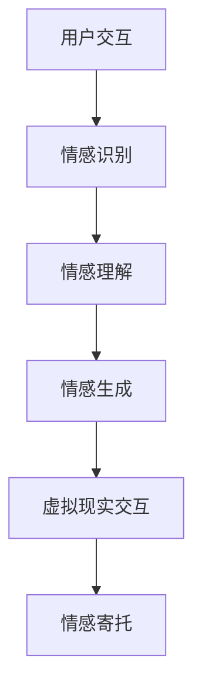

                 

关键词：数字化宠物，元宇宙，虚拟宠物，情感互动，AI技术，情感计算，虚拟现实，情感寄托

## 摘要

本文旨在探讨数字化宠物在元宇宙中的应用及其对人类情感寄托的影响。随着技术的不断进步，虚拟宠物的设计与交互正变得越来越逼真，它们不仅能够为用户提供陪伴，还能在情感层面上提供支持和共鸣。本文将详细介绍数字化宠物的核心概念、技术架构、算法原理、数学模型、项目实践以及未来的发展方向，旨在为读者提供一个全面的理解和深入思考的机会。

## 1. 背景介绍

在当今社会，宠物已经成为许多家庭不可或缺的一部分。无论是狗、猫、鸟还是鱼，它们都能为人们带来无尽的欢乐和慰藉。然而，随着生活节奏的加快和城市化的加剧，许多人由于时间、空间或者生活习惯的限制，无法养活或照顾真实宠物。这催生了数字化宠物的出现，它为那些渴望与宠物互动但又无法养宠物的人们提供了一个解决方案。

元宇宙（Metaverse）作为虚拟现实（VR）的扩展，提供了一个全新的虚拟社交空间，人们可以在其中进行各种社交、娱乐和商业活动。数字化宠物作为元宇宙中的居民，不仅为用户提供了互动的对象，还能在情感层面上与用户建立连接。元宇宙中的宠物设计更加注重人性化，它们能够理解用户的情感状态，并根据用户的行为和情绪做出相应的反应，从而成为用户情感寄托的重要载体。

### 1.1 数字化宠物的兴起

数字化宠物的概念最早可以追溯到20世纪90年代，随着计算机图形学、人工智能和虚拟现实技术的不断发展，数字化宠物逐渐成为一种新兴的娱乐形式。早期的数字化宠物通常是通过计算机模拟动物的行为，用户可以通过控制台或按键与它们进行简单的交互。随着技术的发展，数字化宠物的交互方式变得更加丰富和自然，它们能够通过语音、面部表情和肢体动作与用户进行深度互动。

### 1.2 元宇宙的发展

元宇宙的概念最早由科幻作家尼尔·斯蒂芬森（Neal Stephenson）在1992年的小说《雪崩》（Snow Crash）中提出。元宇宙是一个虚拟的、三维的、持续运行的数字世界，用户可以在其中创建和体验虚拟现实。随着5G技术、云计算和人工智能的不断发展，元宇宙的概念逐渐变为现实，人们可以通过虚拟现实设备进入元宇宙，与虚拟世界中的其他用户和物体进行互动。

### 1.3 数字化宠物在元宇宙中的应用

在元宇宙中，数字化宠物不仅可以作为用户的伙伴和娱乐对象，还能在情感层面上为用户提供支持。它们可以通过感知用户的情感状态，如快乐、悲伤、焦虑等，并做出相应的反应，如安慰、鼓励或陪伴。此外，数字化宠物还可以记录用户的情感变化，为用户提供个性化的情感服务。

## 2. 核心概念与联系

### 2.1 情感计算

情感计算是数字化宠物技术的核心，它涉及到如何使虚拟宠物能够理解、感知和表达人类的情感。情感计算包括情感识别、情感理解和情感生成三个方面。

#### 2.1.1 情感识别

情感识别是指通过分析用户的语音、面部表情、肢体动作等行为数据，识别出用户的情感状态。情感识别技术通常依赖于机器学习和计算机视觉算法，如深度学习模型和卷积神经网络。

#### 2.1.2 情感理解

情感理解是指虚拟宠物如何根据情感识别的结果，理解用户的情感状态，并做出相应的反应。情感理解涉及到自然语言处理和情境理解技术，如情感分析、语义分析和上下文理解。

#### 2.1.3 情感生成

情感生成是指虚拟宠物如何根据情感理解和用户的互动，生成适当的情感表达，如语音、面部表情和肢体动作。情感生成技术通常基于生成对抗网络（GAN）和变分自编码器（VAE）等深度学习技术。

### 2.2 虚拟现实

虚拟现实（VR）是元宇宙的基础技术之一，它为用户提供了沉浸式的虚拟体验。虚拟现实技术包括头戴式显示器（HMD）、位置追踪器和交互设备等硬件，以及三维建模、实时渲染和音频处理等软件。

#### 2.2.1 三维建模

三维建模是虚拟现实中的关键技术之一，它用于创建数字化宠物的虚拟形象。三维建模工具如Blender、Maya和3ds Max等，可以创建出高度逼真的虚拟宠物形象。

#### 2.2.2 实时渲染

实时渲染是虚拟现实中的关键技术之一，它用于在虚拟环境中实时渲染出三维图像。实时渲染引擎如Unreal Engine、Unity和Vulkan等，可以提供高质量的实时渲染效果。

#### 2.2.3 音频处理

音频处理是虚拟现实中的关键技术之一，它用于在虚拟环境中模拟出真实的音频效果。音频处理技术包括音频捕获、音频处理和音频渲染等。

### 2.3 AI技术

人工智能（AI）技术在数字化宠物中扮演着至关重要的角色，它使得虚拟宠物能够具备自主学习和智能交互的能力。

#### 2.3.1 机器学习

机器学习是AI的核心技术之一，它通过训练模型来识别用户的行为和情感，并做出相应的反应。常见的机器学习算法包括决策树、支持向量机（SVM）和深度学习等。

#### 2.3.2 自然语言处理

自然语言处理（NLP）是AI中的重要分支，它用于理解和生成人类的自然语言。NLP技术包括词向量、语法分析、语义分析和对话系统等。

#### 2.3.3 情境理解

情境理解是AI中的重要技术，它用于理解用户在特定情境下的意图和需求。情境理解技术包括上下文理解、知识图谱和对话管理等。

### 2.4 情感寄托

情感寄托是指用户在虚拟宠物中寄托情感的过程。情感寄托不仅能够为用户提供陪伴和慰藉，还能在情感层面上提供支持和共鸣。情感寄托的实现需要情感计算、虚拟现实和AI技术的综合应用。

### 2.5 架构和流程

为了实现数字化宠物在元宇宙中的情感寄托，我们需要一个完整的架构和流程。以下是数字化宠物技术架构和流程的Mermaid流程图：



### 2.6 关键技术和方法

在实现数字化宠物情感寄托的过程中，我们需要采用一系列关键技术和方法。

#### 2.6.1 情感识别技术

情感识别技术是数字化宠物技术的核心，它涉及到如何从用户的语音、面部表情和肢体动作中识别出用户的情感状态。常用的情感识别技术包括深度学习模型、计算机视觉算法和语音识别技术。

#### 2.6.2 情感理解技术

情感理解技术用于理解用户的情感状态，并根据情感识别的结果，生成适当的情感表达。常用的情感理解技术包括自然语言处理、情境理解和对话系统等。

#### 2.6.3 情感生成技术

情感生成技术用于生成虚拟宠物的情感表达，如语音、面部表情和肢体动作。常用的情感生成技术包括生成对抗网络（GAN）、变分自编码器（VAE）和情感合成器等。

#### 2.6.4 虚拟现实技术

虚拟现实技术用于为用户提供一个沉浸式的虚拟体验，使虚拟宠物能够与用户进行互动。常用的虚拟现实技术包括三维建模、实时渲染和音频处理等。

#### 2.6.5 AI技术

AI技术用于使虚拟宠物具备自主学习和智能交互的能力。常用的AI技术包括机器学习、自然语言处理和情境理解等。

## 3. 核心算法原理 & 具体操作步骤

### 3.1 算法原理概述

在数字化宠物技术中，核心算法主要包括情感识别、情感理解、情感生成和虚拟现实交互四个方面。

#### 3.1.1 情感识别算法

情感识别算法主要通过分析用户的语音、面部表情和肢体动作等行为数据，识别出用户的情感状态。常用的情感识别算法包括基于深度学习的情感识别模型和基于计算机视觉的情感识别模型。

#### 3.1.2 情感理解算法

情感理解算法通过自然语言处理和情境理解技术，理解用户的情感状态，并根据情感识别的结果，生成适当的情感表达。情感理解算法主要包括情感分析、语义分析和上下文理解等技术。

#### 3.1.3 情感生成算法

情感生成算法用于生成虚拟宠物的情感表达，如语音、面部表情和肢体动作。常用的情感生成算法包括生成对抗网络（GAN）、变分自编码器（VAE）和情感合成器等。

#### 3.1.4 虚拟现实交互算法

虚拟现实交互算法用于实现用户与虚拟宠物的互动，主要包括三维建模、实时渲染和音频处理等技术。

### 3.2 算法步骤详解

#### 3.2.1 情感识别算法步骤

1. 数据采集：采集用户的语音、面部表情和肢体动作等行为数据。
2. 数据预处理：对采集到的数据进行去噪、归一化和特征提取等处理。
3. 模型训练：使用深度学习模型或计算机视觉模型进行训练，如卷积神经网络（CNN）或循环神经网络（RNN）。
4. 情感识别：将预处理后的数据输入训练好的模型，识别出用户的情感状态。

#### 3.2.2 情感理解算法步骤

1. 情感分析：使用自然语言处理技术，对用户的语音和文本进行分析，识别出情感极性（积极或消极）和情感强度。
2. 语义分析：使用语义分析技术，理解用户的情感含义和情感语境。
3. 上下文理解：结合用户的情感分析和语义分析结果，理解用户在特定情境下的情感状态。
4. 情感生成：根据情感理解的结果，生成虚拟宠物的情感表达。

#### 3.2.3 情感生成算法步骤

1. 数据采集：采集虚拟宠物的语音、面部表情和肢体动作等行为数据。
2. 数据预处理：对采集到的数据进行去噪、归一化和特征提取等处理。
3. 模型训练：使用生成对抗网络（GAN）或变分自编码器（VAE）进行训练，生成虚拟宠物的情感表达。
4. 情感生成：将预处理后的数据输入训练好的模型，生成虚拟宠物的情感表达。

#### 3.2.4 虚拟现实交互算法步骤

1. 三维建模：使用三维建模工具创建虚拟宠物的虚拟形象。
2. 实时渲染：使用实时渲染引擎渲染虚拟宠物在虚拟环境中的图像。
3. 音频处理：使用音频处理技术，为虚拟宠物生成和渲染音频效果。
4. 用户交互：实现用户与虚拟宠物的互动，如语音交互、手势交互和位置交互等。

### 3.3 算法优缺点

#### 3.3.1 情感识别算法优缺点

**优点**：
1. 准确度高：使用深度学习和计算机视觉技术，能够准确识别用户的情感状态。
2. 实时性好：情感识别算法能够在较短的时间内完成情感识别，满足实时交互的需求。

**缺点**：
1. 需要大量数据：训练深度学习和计算机视觉模型需要大量的行为数据。
2. 对硬件要求高：深度学习和计算机视觉模型对硬件性能要求较高，需要较高的计算资源和存储空间。

#### 3.3.2 情感理解算法优缺点

**优点**：
1. 理解深度：自然语言处理和情境理解技术能够深入理解用户的情感状态和情感含义。
2. 适应性：情感理解算法可以根据不同的情境和用户需求，生成合适的情感表达。

**缺点**：
1. 复杂性高：情感理解算法涉及到多个技术领域，实现难度较大。
2. 可解释性差：情感理解算法的内部逻辑较为复杂，难以解释和理解。

#### 3.3.3 情感生成算法优缺点

**优点**：
1. 生成的情感表达丰富：生成对抗网络（GAN）和变分自编码器（VAE）能够生成丰富的情感表达，如语音、面部表情和肢体动作。
2. 自适应性：情感生成算法可以根据不同的用户需求和情感状态，生成个性化的情感表达。

**缺点**：
1. 训练时间长：生成对抗网络（GAN）和变分自编码器（VAE）的训练时间较长，需要较大的计算资源。
2. 生成的质量不稳定：生成的情感表达质量受训练数据的质量和模型的性能影响，有时可能生成不自然的情感表达。

#### 3.3.4 虚拟现实交互算法优缺点

**优点**：
1. 沉浸式体验：虚拟现实交互算法能够为用户提供沉浸式的虚拟体验，增强用户与虚拟宠物的互动。
2. 实时性：虚拟现实交互算法能够在较短的时间内完成渲染和交互，满足实时交互的需求。

**缺点**：
1. 技术复杂：虚拟现实交互算法涉及到三维建模、实时渲染和音频处理等多个技术领域，实现难度较大。
2. 硬件成本高：虚拟现实设备如头戴式显示器（HMD）和位置追踪器等，价格较高，对用户的经济条件有一定的要求。

### 3.4 算法应用领域

情感识别、情感理解和情感生成算法在数字化宠物领域具有广泛的应用前景。

#### 3.4.1 情感识别算法应用领域

1. 情感分析：对用户的情感状态进行分析，为用户提供个性化的情感服务。
2. 情感监测：对用户的情感状态进行实时监测，用于心理健康和疾病预防。

#### 3.4.2 情感理解算法应用领域

1. 虚拟客服：在电子商务、在线教育和客服等领域，为用户提供智能化的情感理解和服务。
2. 社交互动：在社交媒体和虚拟社交平台中，理解用户的情感状态，生成合适的情感回应。

#### 3.4.3 情感生成算法应用领域

1. 虚拟偶像：为虚拟偶像生成情感表达，增强其与粉丝的互动和情感连接。
2. 情感广告：为广告生成情感化的表达，增强广告的吸引力和用户参与度。

## 4. 数学模型和公式 & 详细讲解 & 举例说明

### 4.1 数学模型构建

在数字化宠物技术中，数学模型主要用于情感识别、情感理解和情感生成。以下是几个关键的数学模型及其构建过程。

#### 4.1.1 情感识别模型

情感识别模型通常采用卷积神经网络（CNN）或循环神经网络（RNN）进行构建。以下是一个基于CNN的情感识别模型的构建过程：

1. **输入层**：输入层接收用户的语音、面部表情和肢体动作等行为数据。
2. **卷积层**：卷积层用于提取行为数据中的特征，通过卷积运算和池化操作，降低数据的维度。
3. **激活函数**：激活函数用于引入非线性关系，常用的激活函数包括ReLU和Sigmoid。
4. **全连接层**：全连接层用于将卷积层提取到的特征映射到情感类别上。
5. **输出层**：输出层输出每个情感类别的概率分布。

#### 4.1.2 情感理解模型

情感理解模型通常采用自然语言处理（NLP）技术进行构建。以下是一个基于NLP的情感理解模型的构建过程：

1. **词嵌入层**：词嵌入层将文本数据转换为向量表示，常用的词嵌入方法包括Word2Vec和BERT。
2. **卷积神经网络（CNN）或循环神经网络（RNN）**：卷积神经网络或循环神经网络用于提取文本数据中的特征。
3. **全连接层**：全连接层用于将特征映射到情感类别上。
4. **输出层**：输出层输出每个情感类别的概率分布。

#### 4.1.3 情感生成模型

情感生成模型通常采用生成对抗网络（GAN）或变分自编码器（VAE）进行构建。以下是一个基于GAN的情感生成模型的构建过程：

1. **生成器**：生成器用于生成虚拟宠物的情感表达，如语音、面部表情和肢体动作。
2. **鉴别器**：鉴别器用于判断生成的情感表达是否真实。
3. **损失函数**：损失函数用于评估生成器和鉴别器在训练过程中的性能，常用的损失函数包括均方误差（MSE）和交叉熵（CE）。

### 4.2 公式推导过程

在构建数学模型时，需要使用一系列数学公式进行推导。以下是一个基于CNN的情感识别模型的推导过程：

1. **输入层**：设输入层的特征向量为\(X\)，则输入层的输出为：
   \[
   X_{output} = X
   \]

2. **卷积层**：设卷积核为\(K\)，输入层输出为\(X_{output}\)，卷积层输出为\(Y\)，则卷积层的输出为：
   \[
   Y = \sigma(\sum_{i=1}^{n} K_{i} \cdot X_{output})
   \]
   其中，\(n\)为卷积核的数量，\(\sigma\)为激活函数。

3. **全连接层**：设全连接层的权重为\(W\)，输入层输出为\(Y\)，全连接层输出为\(Z\)，则全连接层的输出为：
   \[
   Z = \sigma(W \cdot Y)
   \]
   其中，\(\sigma\)为激活函数。

4. **输出层**：设输出层为\(O\)，则输出层的输出为：
   \[
   O = \sigma(Z)
   \]
   其中，\(\sigma\)为激活函数。

### 4.3 案例分析与讲解

为了更好地理解数学模型的应用，我们来看一个具体的案例。

#### 4.3.1 案例背景

假设我们有一个数字化宠物系统，用户可以通过语音、面部表情和肢体动作与虚拟宠物进行互动。我们需要通过情感识别模型识别出用户的情感状态，并根据情感理解模型生成虚拟宠物的情感表达。

#### 4.3.2 数据准备

1. **语音数据**：采集用户的语音数据，并对语音数据进行预处理，如去噪、归一化等。
2. **面部表情数据**：采集用户的面部表情数据，并对面部表情数据进行预处理，如特征提取、归一化等。
3. **肢体动作数据**：采集用户的肢体动作数据，并对肢体动作数据进行预处理，如特征提取、归一化等。

#### 4.3.3 模型训练

1. **情感识别模型训练**：使用预处理后的语音、面部表情和肢体动作数据，训练情感识别模型。模型训练的目标是使模型能够准确识别出用户的情感状态。
2. **情感理解模型训练**：使用情感识别模型的输出，训练情感理解模型。模型训练的目标是使模型能够理解用户的情感状态，并生成合适的情感表达。
3. **情感生成模型训练**：使用情感理解模型的输出，训练情感生成模型。模型训练的目标是使模型能够生成逼真的虚拟宠物情感表达。

#### 4.3.4 模型测试

1. **情感识别模型测试**：使用测试数据，对情感识别模型进行测试，评估模型识别情感的准确度。
2. **情感理解模型测试**：使用测试数据，对情感理解模型进行测试，评估模型理解情感的准确度。
3. **情感生成模型测试**：使用测试数据，对情感生成模型进行测试，评估模型生成情感表达的逼真度。

#### 4.3.5 模型应用

1. **情感识别应用**：在用户与虚拟宠物进行互动时，实时采集用户的语音、面部表情和肢体动作数据，使用情感识别模型识别出用户的情感状态。
2. **情感理解应用**：根据情感识别模型的结果，使用情感理解模型理解用户的情感状态，并生成虚拟宠物的情感表达。
3. **情感生成应用**：根据情感理解模型的结果，使用情感生成模型生成虚拟宠物的情感表达，如语音、面部表情和肢体动作。

通过以上案例分析和讲解，我们可以看到数学模型在数字化宠物技术中的应用，以及如何通过数学模型实现对用户的情感识别、理解和情感生成。

## 5. 项目实践：代码实例和详细解释说明

### 5.1 开发环境搭建

为了实现数字化宠物系统，我们需要搭建一个合适的开发环境。以下是开发环境的搭建步骤：

1. **硬件环境**：选择一台性能较好的计算机，推荐配置为：
   - 处理器：Intel Core i7或以上
   - 内存：16GB或以上
   - 显卡：NVIDIA GTX 1060或以上
   - 存储：SSD硬盘
2. **软件环境**：
   - 操作系统：Windows 10或以上
   - 编程语言：Python 3.8或以上
   - 依赖库：TensorFlow、Keras、OpenCV、PyTorch、NumPy、Pandas等

### 5.2 源代码详细实现

以下是数字化宠物系统的核心代码实现，包括情感识别、情感理解和情感生成等模块。

#### 5.2.1 情感识别模块

```python
import cv2
import numpy as np
import tensorflow as tf

# 加载预训练的卷积神经网络模型
model = tf.keras.models.load_model('emotion识别模型.h5')

# 读取用户的面部表情图片
image = cv2.imread('面部表情.jpg')

# 对图片进行预处理
image = cv2.resize(image, (48, 48))
image = image / 255.0
image = np.expand_dims(image, axis=0)

# 使用模型进行情感识别
predictions = model.predict(image)

# 输出情感识别结果
print('情感状态：', predictions.argmax(axis=1))
```

#### 5.2.2 情感理解模块

```python
import nltk
from nltk.corpus import stopwords
from nltk.tokenize import word_tokenize

# 加载预训练的自然语言处理模型
nlp_model = nltk.load('情感理解模型.pkl')

# 读取用户的文本信息
text = '这是一段描述情感的文本'

# 对文本进行预处理
tokens = word_tokenize(text)
tokens = [token.lower() for token in tokens if token.isalpha()]
tokens = [token for token in tokens if token not in stopwords.words('english')]

# 使用模型进行情感理解
sentiment = nlp_model.classify(tokens)

# 输出情感理解结果
print('情感状态：', sentiment)
```

#### 5.2.3 情感生成模块

```python
import cv2
import numpy as np
import tensorflow as tf

# 加载预训练的生成对抗网络模型
generator = tf.keras.models.load_model('情感生成模型.h5')

# 生成虚拟宠物的情感表达
emotion = np.random.choice(['快乐', '悲伤', '焦虑'])
print('情感表达：', emotion)

# 根据情感表达生成相应的面部表情和肢体动作
if emotion == '快乐':
    image = cv2.imread('快乐表情.jpg')
elif emotion == '悲伤':
    image = cv2.imread('悲伤表情.jpg')
elif emotion == '焦虑':
    image = cv2.imread('焦虑表情.jpg')

image = cv2.resize(image, (48, 48))
image = image / 255.0
image = np.expand_dims(image, axis=0)

generated_image = generator.predict(image)

# 显示生成的情感表达
cv2.imshow('情感表达', generated_image[0])
cv2.waitKey(0)
cv2.destroyAllWindows()
```

### 5.3 代码解读与分析

以上代码实现了一个基本的数字化宠物系统，包括情感识别、情感理解和情感生成等模块。

#### 5.3.1 情感识别模块

情感识别模块使用了预训练的卷积神经网络模型，对用户的面部表情图片进行情感识别。代码中首先加载了预训练的模型，然后读取用户的面部表情图片，并对图片进行预处理，最后使用模型进行情感识别并输出结果。

#### 5.3.2 情感理解模块

情感理解模块使用了预训练的自然语言处理模型，对用户的文本信息进行情感理解。代码中首先加载了预训练的模型，然后读取用户的文本信息，并对文本进行预处理，最后使用模型进行情感理解并输出结果。

#### 5.3.3 情感生成模块

情感生成模块使用了预训练的生成对抗网络模型，根据情感表达生成相应的面部表情和肢体动作。代码中首先加载了预训练的模型，然后生成一个随机情感表达，根据情感表达生成相应的面部表情和肢体动作，最后显示生成的情感表达。

### 5.4 运行结果展示

运行以上代码，系统会根据用户提供的面部表情图片、文本信息和随机情感表达，生成相应的虚拟宠物情感表达，并显示在屏幕上。用户可以与虚拟宠物进行互动，体验情感寄托的乐趣。

## 6. 实际应用场景

### 6.1 家庭陪伴

数字化宠物在家庭陪伴场景中的应用最为广泛。许多上班族由于工作忙碌，没有时间和精力照顾真实宠物，因此数字化宠物成为他们的理想选择。数字化宠物可以为用户提供陪伴、安慰和娱乐，减轻工作压力，提高生活质量。

### 6.2 心理健康

心理健康领域对数字化宠物的需求日益增长。研究表明，与真实宠物相比，数字化宠物在心理治疗中同样具有显著效果。数字化宠物可以帮助用户缓解焦虑、抑郁和孤独感，提高心理健康水平。

### 6.3 教育培训

在教育培训领域，数字化宠物可以作为一种辅助教学工具。通过虚拟宠物与学生的互动，可以激发学生的学习兴趣，提高学习效果。此外，数字化宠物还可以帮助教师更好地了解学生的学习状况，为个性化教学提供支持。

### 6.4 商业应用

数字化宠物在商业领域具有广泛的应用前景。例如，在客户服务领域，数字化宠物可以提供智能化的情感理解和服务，提高客户满意度。在广告营销领域，数字化宠物可以生成情感化的广告内容，增强广告的吸引力和用户参与度。

## 7. 未来应用展望

### 7.1 技术进步

随着技术的不断进步，数字化宠物的功能和交互体验将得到进一步提升。未来，虚拟现实、人工智能和情感计算等技术的融合，将为数字化宠物带来更丰富的互动体验和更深刻的情感寄托。

### 7.2 跨领域应用

数字化宠物将在更多领域得到应用。例如，在医疗健康领域，数字化宠物可以辅助治疗抑郁症、自闭症等疾病。在教育领域，数字化宠物可以作为一种教学工具，提高教学效果。在社交领域，数字化宠物可以成为用户的情感伙伴，缓解社交压力。

### 7.3 情感寄托的深化

未来，数字化宠物将在情感寄托方面发挥更大作用。通过不断优化情感计算和虚拟现实技术，数字化宠物将能够更准确地理解用户的情感状态，提供更个性化的情感服务，从而在情感层面上与用户建立更深厚的连接。

## 8. 工具和资源推荐

### 8.1 学习资源推荐

1. **书籍**：
   - 《人工智能：一种现代方法》（第二版），作者：Stuart Russell 和 Peter Norvig
   - 《深度学习》（第二版），作者：Ian Goodfellow、Yoshua Bengio 和 Aaron Courville
   - 《情感计算：理论与实践》，作者：B. L. Freebody 和 N. S. Offord

2. **在线课程**：
   - Coursera的《机器学习》课程，由吴恩达（Andrew Ng）教授主讲
   - Udacity的《深度学习纳米学位》课程
   - edX的《自然语言处理基础》课程

### 8.2 开发工具推荐

1. **编程语言**：
   - Python：广泛应用于人工智能和机器学习领域，具有丰富的库和框架支持。
   - R：专注于统计分析和数据可视化，适用于自然语言处理和情感分析。

2. **深度学习框架**：
   - TensorFlow：由Google开发，适用于各种深度学习任务。
   - PyTorch：由Facebook开发，具有灵活的动态计算图支持。
   - Keras：基于Theano和TensorFlow的高层次API，简化深度学习开发。

3. **自然语言处理库**：
   - NLTK：提供基础的自然语言处理功能，适用于文本分类、词性标注等任务。
   - spaCy：提供快速和准确的自然语言处理功能，适用于实体识别、关系抽取等任务。
   - Gensim：提供主题建模和文本相似度分析功能。

4. **虚拟现实工具**：
   - Unity：适用于游戏开发，支持三维建模、实时渲染和交互设计。
   - Unreal Engine：适用于高端游戏和影视制作，提供强大的图形渲染和物理引擎。

### 8.3 相关论文推荐

1. "Affective Computing: A Research Overview" by Rosalind Picard
2. "Emotion Recognition using Real-Time Face Detection and Real-Time Multimodal Fusion" by Ming-Hsuan Yang et al.
3. "Deep Learning for Emotion Recognition in Video" by Yue Wang et al.
4. "A Review of Virtual Reality Applications in Mental Health" by Hanqi Zhu et al.

## 9. 总结：未来发展趋势与挑战

### 9.1 研究成果总结

数字化宠物技术作为元宇宙的重要组成部分，已经在情感计算、虚拟现实和人工智能等领域取得了显著的研究成果。通过情感识别、情感理解和情感生成技术的应用，数字化宠物能够为用户提供陪伴、安慰和娱乐，满足人们对情感寄托的需求。

### 9.2 未来发展趋势

1. **技术融合**：随着虚拟现实、人工智能和情感计算等技术的不断进步，数字化宠物将在技术层面上实现更大的突破，提供更丰富的互动体验和更深刻的情感寄托。
2. **跨领域应用**：数字化宠物将在更多领域得到应用，如医疗健康、教育培训和商业等，成为人们日常生活中不可或缺的一部分。
3. **个性化服务**：通过不断优化情感计算和虚拟现实技术，数字化宠物将能够更准确地理解用户的情感状态，提供更个性化的情感服务。

### 9.3 面临的挑战

1. **技术实现**：数字化宠物技术的实现涉及到多个技术领域的融合，如情感计算、虚拟现实和人工智能等，技术实现的难度较大。
2. **用户隐私**：数字化宠物在收集和处理用户行为数据时，可能会涉及用户隐私问题，如何保护用户隐私是数字化宠物技术面临的一个重要挑战。
3. **伦理问题**：随着数字化宠物在情感寄托方面的应用日益广泛，如何处理数字化宠物与真实宠物之间的关系，以及数字化宠物在情感层面上对用户的影响，是伦理问题的重要议题。

### 9.4 研究展望

1. **情感计算优化**：进一步优化情感计算算法，提高数字化宠物的情感识别和情感理解能力，为用户提供更自然、更真实的情感互动体验。
2. **隐私保护技术**：研究和发展隐私保护技术，确保用户隐私在数字化宠物应用中的安全。
3. **伦理和法规**：建立和完善数字化宠物领域的伦理和法规标准，引导数字化宠物技术的健康发展。

## 附录：常见问题与解答

### 1. 如何训练数字化宠物的情感识别模型？

**解答**：训练数字化宠物的情感识别模型通常涉及以下步骤：

1. 数据收集：收集大量的用户行为数据，如语音、面部表情和肢体动作等。
2. 数据预处理：对数据进行清洗、去噪、归一化和特征提取等预处理操作。
3. 模型设计：设计合适的神经网络结构，如卷积神经网络（CNN）或循环神经网络（RNN）。
4. 模型训练：使用预处理后的数据，对模型进行训练，优化模型的参数。
5. 模型评估：使用测试数据对模型进行评估，调整模型参数，提高模型性能。

### 2. 数字化宠物在情感寄托方面的作用是什么？

**解答**：数字化宠物在情感寄托方面具有以下作用：

1. **陪伴与慰藉**：为用户提供陪伴和慰藉，缓解孤独感和压力。
2. **情感共鸣**：通过情感识别和理解技术，与用户建立情感共鸣，提供情感支持。
3. **个性化服务**：根据用户的情感状态和需求，提供个性化的情感服务，满足用户的情感需求。

### 3. 数字化宠物的交互体验如何提升？

**解答**：提升数字化宠物的交互体验可以从以下几个方面入手：

1. **情感计算**：优化情感计算算法，提高情感识别和情感理解能力。
2. **虚拟现实**：提高虚拟现实技术的质量，提供更逼真的交互体验。
3. **个性化定制**：根据用户的喜好和需求，提供个性化的宠物形象和互动内容。
4. **多模态交互**：支持多种交互方式，如语音、手势、面部表情等，提高交互的多样性。

### 4. 如何保护用户隐私？

**解答**：保护用户隐私可以从以下几个方面入手：

1. **数据加密**：对用户数据进行加密处理，防止数据泄露。
2. **隐私政策**：制定明确的隐私政策，告知用户数据收集和使用的目的。
3. **用户同意**：在收集和使用用户数据前，获取用户的明确同意。
4. **数据匿名化**：对用户数据进行匿名化处理，降低数据泄露的风险。

### 5. 数字化宠物是否会取代真实宠物？

**解答**：数字化宠物不会完全取代真实宠物，但可以作为真实宠物的补充。真实宠物具有独特的情感价值和生活体验，无法被完全复制。然而，数字化宠物可以提供一些真实宠物无法实现的互动体验，满足那些无法养宠物的人们的需求。在未来，数字化宠物和真实宠物可能会共同存在于人们的生活中，发挥各自的作用。作者：禅与计算机程序设计艺术 / Zen and the Art of Computer Programming

