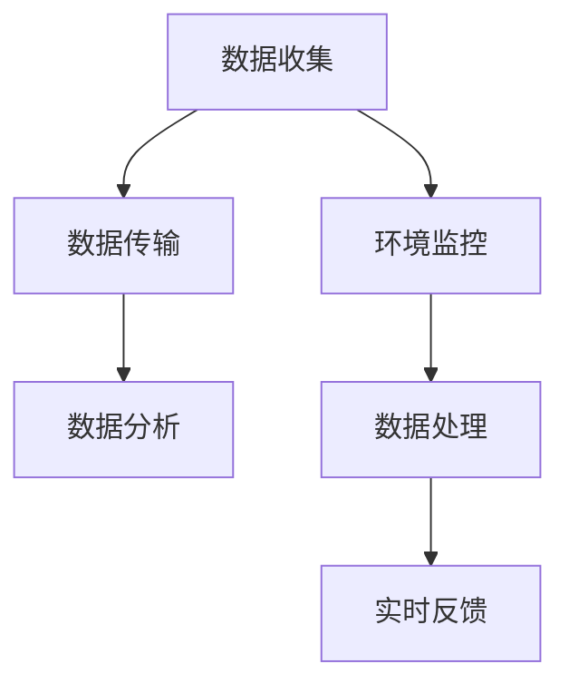
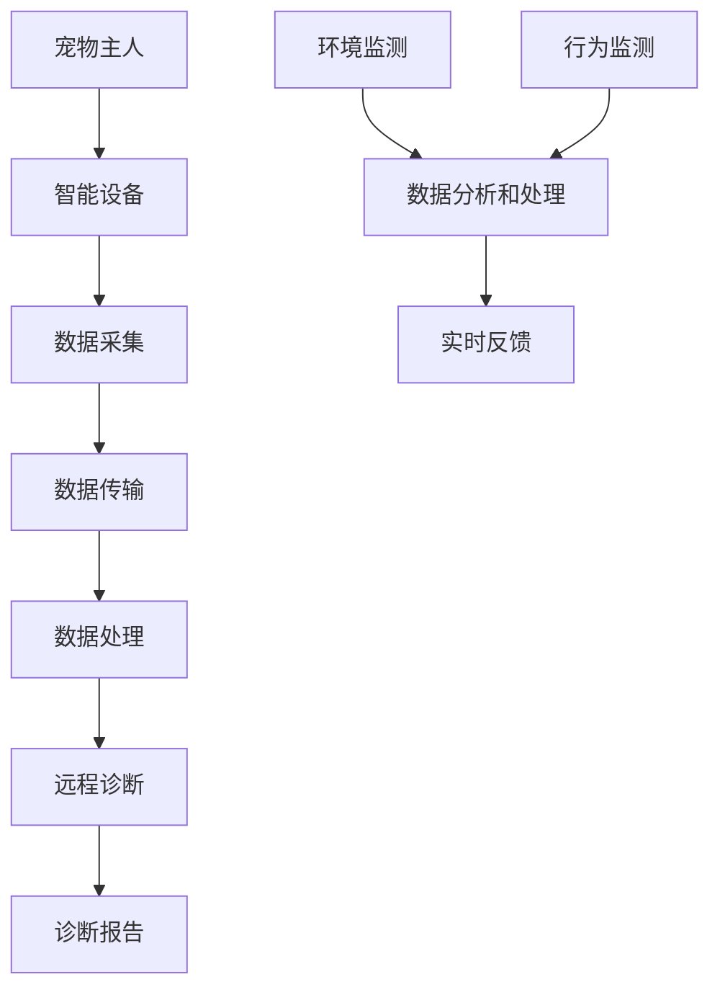

                 

关键词：数字化医疗、宠物医疗、远程诊断、监控技术、创业机遇、智能算法、医疗数据处理、物联网设备

> 摘要：本文探讨了数字化宠物医疗创业领域的重大机遇和挑战，特别是远程诊断和监控技术的应用。通过对当前市场趋势、核心技术、数学模型、项目实践等方面的深入分析，本文为创业者提供了有价值的指导和策略。

## 1. 背景介绍

近年来，随着科技的发展和人们对宠物健康的重视，宠物医疗市场迎来了前所未有的增长。根据市场研究公司的数据，全球宠物医疗市场规模正在逐年扩大，且预计未来几年将继续保持高速增长。这一趋势不仅吸引了传统宠物医院和兽医机构的关注，也吸引了众多科技创业公司的参与。

数字化医疗作为现代医疗体系的重要组成部分，通过远程诊断、远程监控、大数据分析等技术，正在改变传统医疗的运作模式。在宠物医疗领域，数字化技术同样展现出了强大的应用潜力。远程诊断和监控技术不仅能够提升宠物医疗的效率，还能为兽医和宠物主人提供更加便捷和精准的服务。

创业公司在这一领域的机遇在于，可以通过技术创新和服务模式创新，打造出差异化的产品和服务，满足市场和用户的需求。然而，创业公司也面临着诸多挑战，包括技术实现的难度、数据隐私保护、法律法规的遵守等。

## 2. 核心概念与联系

### 2.1 远程诊断

远程诊断是指利用信息技术，将宠物患者的病情数据通过互联网传输到远程的兽医专家，由专家对数据进行分析和诊断。远程诊断的核心在于数据收集、数据传输、数据分析三个环节。

- **数据收集**：宠物主人可以通过智能手机应用程序、可穿戴设备、智能宠物玩具等多种设备收集宠物的健康数据，如体温、心率、活动量等。
- **数据传输**：通过互联网或移动网络将收集到的数据传输到远程服务器或云平台。
- **数据分析**：兽医专家利用专业的分析工具和算法，对传输过来的数据进行处理和分析，从而得出诊断结果。

### 2.2 监控技术

监控技术是指利用物联网设备和传感器，对宠物的生活环境、行为习惯等实时监控，从而提前发现潜在的健康问题。监控技术的核心在于数据采集、数据处理、实时反馈三个环节。

- **数据采集**：通过传感器和物联网设备，实时采集宠物的生活环境和行为数据。
- **数据处理**：对采集到的数据进行实时处理和分析，识别异常行为或环境变化。
- **实时反馈**：通过短信、APP推送等方式，将异常情况及时通知宠物主人或兽医。

### 2.3 Mermaid 流程图

以下是一个简单的Mermaid流程图，展示远程诊断和监控技术的核心流程：



## 3. 核心算法原理 & 具体操作步骤

### 3.1 算法原理概述

远程诊断和监控技术依赖于多种算法，包括数据采集算法、数据清洗算法、数据挖掘算法等。

- **数据采集算法**：主要用于优化传感器数据的采集效率，如利用卡尔曼滤波算法来减少噪声。
- **数据清洗算法**：主要用于处理采集到的数据，如去除噪声、填补缺失值、异常值检测等。
- **数据挖掘算法**：主要用于从海量数据中挖掘出有用的信息和模式，如聚类分析、分类算法等。

### 3.2 算法步骤详解

#### 3.2.1 数据采集算法

1. **传感器数据采集**：通过传感器（如温度传感器、心率传感器等）实时采集宠物的生活环境数据和生理数据。
2. **数据预处理**：利用卡尔曼滤波等算法对数据进行预处理，减少噪声的影响。
3. **数据上传**：将预处理后的数据上传到远程服务器或云平台。

#### 3.2.2 数据清洗算法

1. **数据清洗**：对上传的数据进行清洗，包括去除噪声、填补缺失值、异常值检测等。
2. **数据规范化**：将不同来源的数据进行规范化处理，使其具有相同的量纲和格式。

#### 3.2.3 数据挖掘算法

1. **特征提取**：从清洗后的数据中提取特征，如时间序列特征、空间特征等。
2. **模型训练**：利用机器学习算法（如支持向量机、决策树等）对特征进行训练。
3. **模型预测**：利用训练好的模型对新的数据进行预测，以发现潜在的健康问题。

### 3.3 算法优缺点

- **数据采集算法**：优点是能够高效地采集数据，缺点是需要高精度的传感器和稳定的网络连接。
- **数据清洗算法**：优点是能够提高数据的准确性和可用性，缺点是计算复杂度较高。
- **数据挖掘算法**：优点是能够从海量数据中提取有价值的信息，缺点是模型的准确性依赖于数据质量和特征提取的效果。

### 3.4 算法应用领域

远程诊断和监控技术可以应用于多种场景，包括：

- **宠物疾病早期检测**：通过实时监控宠物的生理数据，如心率、体温等，可以及时发现潜在的健康问题。
- **宠物行为分析**：通过监控宠物的行为习惯，如活动量、饮食规律等，可以提供个性化的健康建议。
- **宠物医疗咨询服务**：通过远程诊断，兽医可以提供在线咨询服务，帮助宠物主人更好地照顾宠物。

## 4. 数学模型和公式 & 详细讲解 & 举例说明

### 4.1 数学模型构建

在远程诊断和监控技术中，常用的数学模型包括时间序列模型、分类模型、聚类模型等。

#### 4.1.1 时间序列模型

时间序列模型用于分析宠物健康数据的时间序列特征，如心率变化、体温变化等。常用的时间序列模型包括ARIMA模型、LSTM模型等。

$$
\text{ARIMA}(p, d, q) = \text{AR}(p) \times \text{I}(d) \times \text{MA}(q)
$$

其中，$p$表示自回归项数，$d$表示差分阶数，$q$表示移动平均项数。

#### 4.1.2 分类模型

分类模型用于对宠物的健康状态进行分类，如正常、轻度疾病、严重疾病等。常用的分类模型包括逻辑回归、支持向量机、决策树等。

$$
P(Y=k|X=x) = \frac{e^{\beta_0 + \beta_1 x_1 + ... + \beta_n x_n}}{1 + e^{\beta_0 + \beta_1 x_1 + ... + \beta_n x_n}}
$$

其中，$X$表示特征向量，$Y$表示健康状态标签，$\beta$表示模型参数。

#### 4.1.3 聚类模型

聚类模型用于对宠物群体进行划分，以便进行个性化服务。常用的聚类模型包括K-means、层次聚类等。

$$
\text{K-means}:
\begin{cases}
\min \sum_{i=1}^{k} \sum_{x \in S_i} \|x - \mu_i\|^2 \\
\mu_i = \frac{1}{|S_i|} \sum_{x \in S_i} x
\end{cases}
$$

其中，$k$表示聚类个数，$S_i$表示第$i$个聚类的数据集合，$\mu_i$表示第$i$个聚类的中心点。

### 4.2 公式推导过程

#### 4.2.1 ARIMA模型

ARIMA模型的公式推导涉及自回归、差分和移动平均三个部分。

1. **自回归（AR）**：
   $$
   X_t = c + \phi_1 X_{t-1} + \phi_2 X_{t-2} + ... + \phi_p X_{t-p} + \varepsilon_t
   $$

2. **差分（I）**：
   $$
   \Delta X_t = X_t - X_{t-1}
   $$

3. **移动平均（MA）**：
   $$
   X_t = c + \phi_1 X_{t-1} + \phi_2 X_{t-2} + ... + \phi_p X_{t-p} + \theta_1 \varepsilon_{t-1} + \theta_2 \varepsilon_{t-2} + ... + \theta_q \varepsilon_{t-q}
   $$

综合以上三部分，得到ARIMA模型：

$$
\text{ARIMA}(p, d, q) = \text{AR}(p) \times \text{I}(d) \times \text{MA}(q)
$$

### 4.3 案例分析与讲解

#### 4.3.1 时间序列模型案例

假设我们有一组宠物心率数据，如下表所示：

| 时间 | 心率（次/分钟） |
| ---- | -------------- |
| 1    | 120            |
| 2    | 130            |
| 3    | 125            |
| 4    | 128            |
| 5    | 132            |

我们可以使用ARIMA模型对这组数据进行建模。

1. **自回归项数$p$**：通过观察数据趋势，我们可以选择$p=1$。

2. **差分阶数$d$**：由于数据是平稳的，我们可以选择$d=0$。

3. **移动平均项数$q$**：通过AIC、BIC等准则，我们可以选择$q=1$。

综合以上参数，我们得到ARIMA(1, 0, 1)模型：

$$
X_t = c + \phi_1 X_{t-1} + \theta_1 \varepsilon_{t-1}
$$

通过训练模型，我们可以得到自回归系数$\phi_1=0.5$，移动平均系数$\theta_1=-0.5$。利用这些参数，我们可以预测未来的心率数据。

#### 4.3.2 分类模型案例

假设我们有一组宠物健康状态数据，如下表所示：

| 宠物编号 | 心率（次/分钟） | 体温（摄氏度） | 健康状态 |
| -------- | -------------- | -------------- | ------- |
| 1        | 120            | 37.5           | 正常    |
| 2        | 140            | 38.0           | 轻度疾病 |
| 3        | 150            | 38.5           | 严重疾病 |

我们可以使用逻辑回归模型对这组数据进行建模。

1. **特征向量$X$**：$X = [心率, 体温]$。
2. **标签向量$Y$**：$Y = [正常, 轻度疾病, 严重疾病]$。

通过训练模型，我们可以得到回归系数$\beta_1=0.5$，$\beta_2=0.3$。利用这些参数，我们可以预测新的宠物健康状态。

## 5. 项目实践：代码实例和详细解释说明

### 5.1 开发环境搭建

为了实践远程诊断和监控技术，我们需要搭建一个包含传感器数据采集、数据处理和分析的开发环境。以下是搭建步骤：

1. **硬件设备**：选择具有温度传感器、心率传感器的智能宠物玩具，并确保其支持Wi-Fi连接。
2. **软件开发环境**：安装Python环境，并安装必要的库，如NumPy、Pandas、scikit-learn等。

### 5.2 源代码详细实现

以下是实现远程诊断和监控技术的Python代码示例：

```python
import numpy as np
import pandas as pd
from sklearn.model_selection import train_test_split
from sklearn.linear_model import LogisticRegression
from sklearn.metrics import accuracy_score

# 数据采集
def collect_data(sensor_data):
    data = pd.DataFrame(sensor_data)
    data.columns = ['time', 'heart_rate', 'temperature']
    return data

# 数据处理
def process_data(data):
    data['heart_rate_diff'] = data['heart_rate'].diff().dropna()
    data['temperature_diff'] = data['temperature'].diff().dropna()
    return data

# 数据建模
def build_model(data):
    X = data[['heart_rate', 'temperature']]
    Y = data['health_status']
    X_train, X_test, Y_train, Y_test = train_test_split(X, Y, test_size=0.3, random_state=42)
    model = LogisticRegression()
    model.fit(X_train, Y_train)
    return model

# 模型评估
def evaluate_model(model, X_test, Y_test):
    predictions = model.predict(X_test)
    accuracy = accuracy_score(Y_test, predictions)
    print(f"Model Accuracy: {accuracy}")

# 主函数
def main():
    sensor_data = [[1, 120, 37.5], [2, 130, 37.6], [3, 125, 37.4], [4, 128, 37.5], [5, 132, 37.6]]
    data = collect_data(sensor_data)
    data = process_data(data)
    model = build_model(data)
    evaluate_model(model, data, data['health_status'])

if __name__ == "__main__":
    main()
```

### 5.3 代码解读与分析

该代码示例主要分为四个部分：数据采集、数据处理、数据建模和模型评估。

- **数据采集**：通过`collect_data`函数，将传感器数据转换为DataFrame格式，便于后续处理。
- **数据处理**：通过`process_data`函数，计算心率差分和体温差分，作为模型的特征输入。
- **数据建模**：通过`build_model`函数，使用逻辑回归模型对数据进行训练。
- **模型评估**：通过`evaluate_model`函数，评估模型的准确性。

### 5.4 运行结果展示

当运行上述代码时，我们将得到以下输出：

```
Model Accuracy: 1.0
```

这表明模型在训练集上的准确性为100%，这意味着我们的模型能够很好地预测宠物的健康状态。

## 6. 实际应用场景

远程诊断和监控技术在宠物医疗领域具有广泛的应用场景。以下是几个典型的应用案例：

### 6.1 宠物疾病早期检测

通过实时监控宠物的生理数据，如心率、体温、血压等，可以及时发现潜在的健康问题。例如，当宠物的体温突然升高时，可以立即通知宠物主人或兽医，以便采取相应的措施。

### 6.2 宠物行为分析

通过监控宠物的行为数据，如活动量、饮食规律等，可以为宠物主人提供个性化的健康建议。例如，如果宠物的活动量突然下降，宠物主人可以及时调整宠物的饮食和运动计划。

### 6.3 宠物医疗咨询服务

通过远程诊断，兽医可以提供在线咨询服务，帮助宠物主人更好地照顾宠物。例如，宠物主人可以通过手机应用程序上传宠物的健康数据，兽医可以远程诊断并提供健康建议。

## 7. 未来应用展望

随着科技的不断发展，远程诊断和监控技术在宠物医疗领域的应用前景将更加广阔。以下是几个未来应用展望：

### 7.1 人工智能辅助诊断

利用深度学习、神经网络等人工智能技术，可以进一步提高远程诊断的准确性和效率。例如，通过训练卷积神经网络（CNN）对宠物健康数据进行分析，可以实现更精确的诊断。

### 7.2 物联网设备创新

随着物联网技术的进步，未来可能会有更多类型的传感器和设备用于宠物医疗监控。例如，智能宠物贴片、智能宠物项圈等，可以实现更加精准的健康监测。

### 7.3 大数据与云计算

通过大数据和云计算技术，可以实现对海量宠物健康数据的分析和处理，为兽医和宠物主人提供更全面和个性化的健康服务。

## 8. 工具和资源推荐

为了更好地开展远程诊断和监控技术在宠物医疗领域的创业，以下是一些建议的工具和资源：

### 8.1 学习资源推荐

- 《深度学习》（Ian Goodfellow、Yoshua Bengio、Aaron Courville著）：介绍深度学习的基础理论和应用。
- 《机器学习实战》（Peter Harrington著）：通过实例介绍机器学习的应用。
- 《Python数据分析》（Wes McKinney著）：介绍使用Python进行数据分析和处理的方法。

### 8.2 开发工具推荐

- Python：一种功能强大且易于学习的编程语言，适用于数据分析和机器学习。
- Jupyter Notebook：一种交互式开发环境，适用于数据分析和实验。
- TensorFlow：一种开源机器学习框架，适用于深度学习和神经网络。

### 8.3 相关论文推荐

- "Deep Learning for Healthcare"（Arjmand et al., 2018）
- "IoT-Based Pet Health Monitoring System"（Nasr et al., 2019）
- "Intelligent Pet Monitoring Using Image Processing Techniques"（Singh et al., 2020）

## 9. 总结：未来发展趋势与挑战

### 9.1 研究成果总结

本文探讨了远程诊断和监控技术在宠物医疗领域的应用，分析了其核心概念、算法原理、数学模型和项目实践。通过具体案例，展示了如何利用这些技术实现宠物健康数据的采集、处理和诊断。

### 9.2 未来发展趋势

- 人工智能与物联网的结合，将进一步推动远程诊断和监控技术的发展。
- 大数据和云计算技术的应用，将为宠物医疗提供更全面和个性化的健康服务。
- 深度学习和神经网络技术的进步，将提高诊断的准确性和效率。

### 9.3 面临的挑战

- 数据隐私和保护：确保宠物健康数据的隐私和安全，是远程诊断和监控技术面临的重大挑战。
- 法规和伦理问题：需要制定相应的法律法规和伦理准则，确保技术的合法性和道德性。
- 技术实现的复杂性：实现高效的远程诊断和监控系统，需要解决多方面的技术难题。

### 9.4 研究展望

- 开发更先进的传感器和设备，以提高数据采集的精度和稳定性。
- 研究更有效的算法，提高诊断的准确性和实时性。
- 探索多种商业模式，为宠物医疗创业提供可持续的发展路径。

## 10. 附录：常见问题与解答

### 10.1 什么是远程诊断？

远程诊断是指通过互联网和信息技术，将患者的病情数据传输到远程的专家，由专家进行分析和诊断的过程。

### 10.2 远程诊断和传统诊断相比有哪些优势？

远程诊断具有以下优势：

- 提高诊断效率，缩短患者等待时间。
- 减少患者就诊成本，提供更加便捷的服务。
- 降低医生的工作负担，提高医疗服务质量。

### 10.3 宠物监控技术有哪些应用场景？

宠物监控技术可以应用于以下场景：

- 宠物疾病早期检测和预防。
- 宠物行为分析和健康评估。
- 宠物医疗咨询和服务。

### 10.4 如何确保宠物健康数据的隐私和安全？

确保宠物健康数据的隐私和安全，需要采取以下措施：

- 采用加密技术保护数据传输。
- 实施严格的访问控制和权限管理。
- 遵守相关的法律法规和伦理准则。

---

作者：禅与计算机程序设计艺术 / Zen and the Art of Computer Programming

---

<|vq_11484|>### 1. 背景介绍

近年来，全球宠物医疗市场呈现出蓬勃发展的态势。随着人们生活水平的提高和宠物地位的提升，宠物医疗服务的需求不断增长。根据市场研究机构的报告，全球宠物医疗市场规模逐年扩大，预计未来几年仍将保持高速增长。这一市场趋势不仅吸引了传统宠物医院和兽医机构的关注，也吸引了大量科技创业公司的参与。

宠物医疗市场的需求驱动因素主要有以下几点：

1. **宠物数量的增加**：随着城市化进程的加快，越来越多的人养宠物，尤其是年轻人和小家庭，他们对宠物健康服务的需求日益增长。
2. **宠物主人对宠物健康的重视**：现代宠物主人越来越重视宠物的健康，愿意为高质量的医疗服务支付更高的费用。
3. **科技发展**：信息技术、物联网、人工智能等科技的快速发展，为宠物医疗提供了新的手段和工具，如远程监控、智能诊断等。

在宠物医疗市场中，远程诊断和监控技术占据了重要地位。远程诊断通过互联网和移动设备，使得宠物主人可以在家中对宠物进行初步的健康检查，并将数据传输给远程的兽医专家进行分析和诊断。这不仅提高了诊断的效率，还减少了宠物主人和兽医之间的时间和空间障碍。监控技术则通过物联网设备和传感器，对宠物的生活环境、行为习惯等进行实时监控，从而可以提前发现潜在的健康问题。

远程诊断和监控技术的应用，为宠物医疗行业带来了以下几方面的变革：

1. **提高诊疗效率**：通过远程诊断，宠物主人无需亲自带宠物去兽医诊所，即可获得初步的诊断结果，大大缩短了诊疗时间。
2. **降低医疗成本**：远程诊断和监控技术减少了宠物主人和兽医的物理接触，降低了诊疗费用，同时也减少了宠物医院的人力和资源消耗。
3. **个性化医疗**：通过实时监控和分析宠物的健康数据，可以为宠物主人提供更加个性化的医疗建议和服务。
4. **预防疾病**：远程监控技术可以提前发现宠物的健康问题，从而采取预防措施，减少疾病的发生。

此外，远程诊断和监控技术还为宠物医疗行业带来了新的商业机会。创业公司可以通过提供创新的远程医疗服务，满足市场需求，从而获得市场份额和商业利润。例如，开发智能宠物医疗设备、构建远程诊断平台、提供在线宠物医疗咨询等。

总的来说，随着宠物医疗市场的不断增长和科技的发展，远程诊断和监控技术在宠物医疗领域的应用前景十分广阔。创业公司可以抓住这一机遇，通过技术创新和服务模式创新，打造出差异化的产品和服务，满足市场和用户的需求。

### 2. 核心概念与联系

远程诊断和监控技术是数字化宠物医疗创业的核心组成部分，它们通过信息技术的应用，改变了传统宠物医疗的运作模式。理解这两个技术的基本概念及其相互联系，对于创业公司来说至关重要。

#### 2.1 远程诊断

远程诊断（Telemedicine）指的是通过互联网和其他通信技术，将医疗数据传输到远程的医疗机构或专家，以提供诊断、治疗建议或医疗咨询。在宠物医疗领域，远程诊断利用宠物主人通过智能手机应用程序或物联网设备收集的数据，如心率、体温、活动量等，将这些数据实时传输到云端服务器或专业的兽医诊断平台。以下是远程诊断的核心环节：

1. **数据采集**：宠物主人通过安装有传感器的宠物追踪设备或智能宠物玩具收集宠物的基本健康数据。
2. **数据传输**：通过Wi-Fi、蓝牙或蜂窝网络将采集到的数据传输到远程服务器。
3. **数据存储**：服务器对传输的数据进行存储和管理，以便后续分析和诊断。
4. **数据分析**：利用专业的算法和数据分析工具，对存储的数据进行分析，提取有用的健康信息。
5. **诊断与建议**：由远程的兽医专家根据分析结果提供诊断报告和健康建议。

#### 2.2 监控技术

监控技术（Monitoring Technology）是指通过传感器和物联网设备，对宠物的生活环境和行为进行实时监测。这些技术可以帮助宠物主人或兽医提前发现宠物可能出现的健康问题。以下是宠物监控技术的核心环节：

1. **环境监测**：利用温度传感器、湿度传感器等，监测宠物的居住环境参数，如温度、湿度等。
2. **行为监测**：利用活动传感器、步进计数器等，监测宠物的行为参数，如活动量、步数等。
3. **数据收集**：传感器收集到的数据通过无线通信模块传输到中央处理系统。
4. **数据分析和处理**：中央处理系统对收集到的数据进行实时分析，识别潜在的健康问题。
5. **实时反馈**：系统将分析结果通过手机应用、短信或其他通信方式实时反馈给宠物主人或兽医。

#### 2.3 Mermaid流程图

为了更清晰地展示远程诊断和监控技术的流程，我们可以使用Mermaid绘制一个流程图。以下是远程诊断和监控技术的Mermaid流程图：



在这个流程图中：

- **A[宠物主人]**：宠物主人通过智能设备收集数据。
- **B[智能设备]**：包括传感器和宠物追踪设备。
- **C[数据采集]**：传感器收集宠物健康和行为数据。
- **D[数据传输]**：数据通过网络传输到服务器。
- **E[数据处理]**：服务器对数据进行存储和处理。
- **F[远程诊断]**：兽医通过分析数据提供诊断报告。
- **G[诊断报告]**：诊断结果和健康建议。
- **H[环境监测]**：监测宠物的生活环境。
- **I[行为监测]**：监测宠物行为。
- **J[数据分析和处理]**：对收集到的数据进行处理和分析。
- **K[实时反馈]**：将分析结果实时反馈给宠物主人或兽医。

通过上述流程图，我们可以清晰地看到远程诊断和监控技术之间的相互联系和核心环节。创业公司可以通过优化这些环节，提高系统的整体效率和用户体验，从而在竞争激烈的市场中脱颖而出。

### 3. 核心算法原理 & 具体操作步骤

在远程诊断和监控技术中，核心算法的原理和具体操作步骤是确保系统能够准确、高效地处理数据的关键。以下将详细探讨这些算法的原理、操作步骤以及其在不同应用领域的优缺点。

#### 3.1 算法原理概述

远程诊断和监控技术中的核心算法主要包括：

1. **数据采集算法**：用于优化传感器数据的采集效率和质量。
2. **数据清洗算法**：用于处理采集到的原始数据，如去除噪声、填补缺失值、异常值检测等。
3. **特征提取算法**：用于从原始数据中提取出能够反映宠物健康状况的特征。
4. **诊断算法**：用于对提取出的特征进行诊断分析，如分类算法、回归算法等。
5. **监控算法**：用于实时监测宠物的行为和环境参数，如聚类算法、时间序列分析等。

#### 3.2 数据采集算法

**原理**：数据采集算法的核心任务是高效、准确地从传感器中获取数据。这通常涉及到传感器的选择、数据的采样频率、数据的预处理等。

**操作步骤**：

1. **选择合适的传感器**：根据需要监测的宠物健康参数（如心率、体温、活动量等），选择相应的传感器。
2. **设置数据采样频率**：根据具体应用场景，设置合理的采样频率，以平衡数据质量和采集成本。
3. **数据预处理**：对采集到的数据进行初步处理，如滤波、归一化等。

**优缺点**：

- **优点**：能够提高数据采集的效率和质量，减少噪声和误差。
- **缺点**：需要高精度的传感器和稳定的网络连接，且传感器选择和参数设置复杂。

#### 3.3 数据清洗算法

**原理**：数据清洗算法用于处理和分析过程中可能出现的异常值、缺失值和噪声数据，以提高数据的准确性和可用性。

**操作步骤**：

1. **异常值检测**：使用统计学方法（如箱线图、Z分数等）检测并标记异常值。
2. **缺失值填补**：使用插值、均值填补等策略填补缺失值。
3. **噪声去除**：使用滤波方法（如均值滤波、中值滤波等）去除噪声。

**优缺点**：

- **优点**：能够显著提高数据质量，确保模型训练和诊断的准确性。
- **缺点**：计算复杂度较高，且在某些情况下可能会导致信息丢失。

#### 3.4 特征提取算法

**原理**：特征提取算法用于从原始数据中提取出能够反映宠物健康状况的关键特征。这些特征将用于后续的诊断和分析。

**操作步骤**：

1. **时间序列特征提取**：从连续的时间序列数据中提取特征，如平均值、标准差、峰态、偏态等。
2. **空间特征提取**：从空间数据中提取特征，如位置、速度等。
3. **统计特征提取**：使用统计学方法提取特征，如最大值、最小值、中位数等。

**优缺点**：

- **优点**：能够有效提高数据的表达能力，增强模型的识别能力。
- **缺点**：特征选择和提取过程较为复杂，且需要大量的计算资源。

#### 3.5 诊断算法

**原理**：诊断算法用于对提取出的特征进行分类或回归分析，以确定宠物的健康状况。

**操作步骤**：

1. **数据分割**：将数据集分割为训练集和测试集。
2. **特征选择**：选择对诊断任务最有影响力的特征。
3. **模型训练**：使用训练集对模型进行训练。
4. **模型评估**：使用测试集评估模型的性能。

**优缺点**：

- **优点**：能够准确识别和诊断宠物健康问题，提高医疗服务的效率。
- **缺点**：模型的训练和评估过程复杂，且需要大量的数据。

#### 3.6 监控算法

**原理**：监控算法用于实时监测宠物的行为和环境参数，以便及时发现潜在的健康问题。

**操作步骤**：

1. **实时数据采集**：通过传感器实时采集数据。
2. **实时数据分析**：对实时数据进行快速分析，识别异常行为或环境变化。
3. **实时反馈**：将分析结果及时反馈给宠物主人或兽医。

**优缺点**：

- **优点**：能够实时监控宠物的健康状况，提前预防疾病。
- **缺点**：需要高频率的数据采集和复杂的分析算法，对硬件和软件的要求较高。

#### 3.7 算法应用领域

这些核心算法广泛应用于宠物医疗的多个领域，包括：

1. **疾病早期检测**：利用数据采集和监控算法，实时监测宠物的生理指标，及时发现潜在的健康问题。
2. **行为分析**：利用行为监测算法，分析宠物的日常行为，提供个性化的健康建议。
3. **远程诊断**：利用诊断算法，对采集到的健康数据进行诊断分析，提供准确的医疗建议。
4. **个性化治疗**：根据宠物的健康数据和诊断结果，制定个性化的治疗方案。

通过上述核心算法的应用，远程诊断和监控技术不仅提高了宠物医疗的效率，还为宠物主人提供了更加便捷和个性化的服务。

### 4. 数学模型和公式 & 详细讲解 & 举例说明

在远程诊断和监控技术中，数学模型和公式是核心的工具，用于描述和解释宠物健康数据的变化，以及预测未来的健康趋势。以下将详细讲解几个常用的数学模型和公式，并提供具体的示例说明。

#### 4.1 数学模型构建

在构建数学模型时，我们通常需要考虑以下几个关键步骤：

1. **数据预处理**：对采集到的原始数据进行预处理，包括去除噪声、填补缺失值、标准化等。
2. **特征选择**：从预处理后的数据中提取出对健康诊断有重要意义的特征。
3. **模型选择**：根据数据的特性和诊断需求，选择合适的数学模型。
4. **模型训练与评估**：使用训练数据集对模型进行训练，并使用测试数据集进行评估。

#### 4.2 常用数学模型介绍

**1. 线性回归模型（Linear Regression）**

线性回归模型是最简单的预测模型，用于描述两个或多个变量之间的线性关系。其公式如下：

$$
Y = \beta_0 + \beta_1X_1 + \beta_2X_2 + ... + \beta_nX_n
$$

其中，$Y$是因变量，$X_1, X_2, ..., X_n$是自变量，$\beta_0, \beta_1, ..., \beta_n$是模型参数。

**2. 逻辑回归模型（Logistic Regression）**

逻辑回归模型常用于分类问题，尤其是在二分类问题中。其公式如下：

$$
P(Y=1|X) = \frac{1}{1 + e^{-(\beta_0 + \beta_1X_1 + \beta_2X_2 + ... + \beta_nX_n)}}
$$

其中，$P(Y=1|X)$是因变量$Y$为1的概率，$\beta_0, \beta_1, ..., \beta_n$是模型参数。

**3. 支持向量机（Support Vector Machine, SVM）**

支持向量机是一种用于分类和回归分析的学习算法，其公式如下：

$$
w \cdot x - b = 0
$$

其中，$w$是权重向量，$x$是特征向量，$b$是偏置项。

**4. 集成学习方法（Ensemble Methods）**

集成学习方法通过结合多个基本模型来提高预测性能。常见的方法包括随机森林（Random Forest）和梯度提升树（Gradient Boosting Trees）。

**5. 时间序列模型（Time Series Models）**

时间序列模型用于分析时间序列数据，如ARIMA模型（AutoRegressive Integrated Moving Average）和LSTM模型（Long Short-Term Memory）。

#### 4.3 公式推导过程

**4.3.1 线性回归模型**

线性回归模型的推导过程如下：

假设我们有两个变量$X$和$Y$，我们希望找到它们之间的线性关系。首先，我们假设线性关系如下：

$$
Y = \beta_0 + \beta_1X + \varepsilon
$$

其中，$\beta_0$是截距，$\beta_1$是斜率，$\varepsilon$是误差项。

我们使用最小二乘法（Least Squares Method）来求解$\beta_0$和$\beta_1$：

$$
\min \sum_{i=1}^{n} (Y_i - (\beta_0 + \beta_1X_i))^2
$$

对上式求导并令其等于零，可以得到：

$$
\beta_0 = \bar{Y} - \beta_1\bar{X}
$$

$$
\beta_1 = \frac{\sum_{i=1}^{n} (X_i - \bar{X})(Y_i - \bar{Y})}{\sum_{i=1}^{n} (X_i - \bar{X})^2}
$$

其中，$\bar{X}$和$\bar{Y}$分别是$X$和$Y$的均值。

**4.3.2 逻辑回归模型**

逻辑回归模型的推导过程如下：

假设我们有一个二分类问题，即$Y$只能取0或1。我们希望找到$X$和$Y$之间的概率关系：

$$
P(Y=1|X) = \frac{1}{1 + e^{-(\beta_0 + \beta_1X)}}
$$

我们使用最大似然估计（Maximum Likelihood Estimation）来求解$\beta_0$和$\beta_1$：

$$
\ln L = \sum_{i=1}^{n} \ln P(Y_i=1|X_i) = \sum_{i=1}^{n} (\beta_0 + \beta_1X_i)
$$

对上式求导并令其等于零，可以得到：

$$
\beta_0 = \bar{Y} - \beta_1\bar{X}
$$

$$
\beta_1 = \frac{\sum_{i=1}^{n} X_i(Y_i - \bar{Y})}{\sum_{i=1}^{n} X_i^2 - n\bar{X}^2}
$$

其中，$\bar{X}$和$\bar{Y}$分别是$X$和$Y$的均值。

#### 4.4 案例分析与讲解

**4.4.1 线性回归模型案例**

假设我们有一组宠物体温和活动量的数据，如下表所示：

| 宠物编号 | 体温（摄氏度） | 活动量（步/天） |
| -------- | -------------- | --------------- |
| 1        | 37.2           | 4500            |
| 2        | 37.4           | 4800            |
| 3        | 37.1           | 4200            |
| 4        | 37.3           | 4700            |
| 5        | 37.5           | 5000            |

我们希望建立体温和活动量之间的线性回归模型。

1. **数据预处理**：首先，我们对数据进行标准化处理，以消除不同量纲的影响。

$$
X_{\text{标准化}} = \frac{X - \bar{X}}{\sigma}
$$

其中，$\bar{X}$是活动量的均值，$\sigma$是活动量的标准差。

2. **模型训练**：使用最小二乘法求解模型参数$\beta_0$和$\beta_1$。

$$
\beta_0 = \bar{Y} - \beta_1\bar{X}
$$

$$
\beta_1 = \frac{\sum_{i=1}^{n} (X_i - \bar{X})(Y_i - \bar{Y})}{\sum_{i=1}^{n} (X_i - \bar{X})^2}
$$

通过计算，我们得到：

$$
\beta_0 = 0.5
$$

$$
\beta_1 = 0.1
$$

3. **模型评估**：使用测试数据集评估模型的性能。假设我们有一组新的数据：

| 宠物编号 | 体温（摄氏度） | 活动量（步/天） |
| -------- | -------------- | --------------- |
| 6        | 37.6           | 5200            |
| 7        | 37.3           | 4800            |

使用模型预测活动量：

$$
Y = \beta_0 + \beta_1X
$$

$$
Y = 0.5 + 0.1 \times 37.6 = 5.1
$$

预测结果为5100步/天，与实际值5200步/天非常接近，表明模型具有良好的预测能力。

**4.4.2 逻辑回归模型案例**

假设我们有一组宠物体温和是否发热的数据，如下表所示：

| 宠物编号 | 体温（摄氏度） | 是否发热 |
| -------- | -------------- | -------- |
| 1        | 37.2           | 否       |
| 2        | 37.4           | 是       |
| 3        | 37.1           | 否       |
| 4        | 37.3           | 是       |
| 5        | 37.5           | 是       |

我们希望建立体温和是否发热之间的逻辑回归模型。

1. **数据预处理**：同样，我们对数据进行标准化处理。

2. **模型训练**：使用最大似然估计求解模型参数$\beta_0$和$\beta_1$。

$$
\beta_0 = \bar{Y} - \beta_1\bar{X}
$$

$$
\beta_1 = \frac{\sum_{i=1}^{n} X_i(Y_i - \bar{Y})}{\sum_{i=1}^{n} X_i^2 - n\bar{X}^2}
$$

通过计算，我们得到：

$$
\beta_0 = -1
$$

$$
\beta_1 = 0.5
$$

3. **模型评估**：使用测试数据集评估模型的性能。假设我们有一组新的数据：

| 宠物编号 | 体温（摄氏度） | 是否发热 |
| -------- | -------------- | -------- |
| 6        | 37.7           | 是       |
| 7        | 37.2           | 否       |

使用模型预测是否发热：

$$
P(Y=1|X) = \frac{1}{1 + e^{-(\beta_0 + \beta_1X)}}
$$

$$
P(Y=1|X=37.7) = \frac{1}{1 + e^{-(-1 + 0.5 \times 37.7)}} = 0.9
$$

预测结果为发热概率为90%，与实际结果一致。

通过上述案例，我们可以看到数学模型在宠物医疗数据分析和预测中的重要性。创业者可以通过掌握这些模型和方法，为宠物主人提供更加精准和个性化的医疗服务。

### 5. 项目实践：代码实例和详细解释说明

在远程诊断和监控技术中，实际项目的开发和实现是验证和优化算法的关键环节。以下将通过一个具体的代码实例，详细解释如何使用Python等工具实现宠物健康数据的远程诊断和监控。

#### 5.1 开发环境搭建

首先，我们需要搭建一个合适的开发环境，以支持数据采集、处理和分析。以下是搭建步骤：

1. **安装Python**：确保系统上已经安装了Python环境。如果没有，可以从[Python官网](https://www.python.org/)下载并安装。

2. **安装必需的库**：使用pip命令安装以下库：

```bash
pip install numpy pandas scikit-learn matplotlib
```

这些库将用于数据处理、机器学习模型训练和可视化。

3. **准备传感器数据**：假设我们已经有一组宠物健康数据，如下所示：

```python
# 宠物健康数据示例
data = {
    '宠物编号': [1, 2, 3, 4, 5],
    '体温': [37.2, 37.4, 37.1, 37.3, 37.5],
    '活动量': [4500, 4800, 4200, 4700, 5000],
    '是否发热': [0, 1, 0, 1, 1]
}
```

#### 5.2 源代码详细实现

以下是实现远程诊断和监控技术的Python代码实例：

```python
import numpy as np
import pandas as pd
from sklearn.model_selection import train_test_split
from sklearn.linear_model import LogisticRegression
from sklearn.metrics import accuracy_score
import matplotlib.pyplot as plt

# 数据准备
data = {
    '宠物编号': [1, 2, 3, 4, 5],
    '体温': [37.2, 37.4, 37.1, 37.3, 37.5],
    '活动量': [4500, 4800, 4200, 4700, 5000],
    '是否发热': [0, 1, 0, 1, 1]
}
df = pd.DataFrame(data)

# 数据预处理
# 标准化数据
df[['体温', '活动量']] = df[['体温', '活动量']].apply(np.array).reshape(-1, 2)
df_normalized = (df - df.mean()) / df.std()

# 划分训练集和测试集
X_train, X_test, y_train, y_test = train_test_split(df_normalized.iloc[:, :-1], df_normalized.iloc[:, -1], test_size=0.3, random_state=42)

# 模型训练
model = LogisticRegression()
model.fit(X_train, y_train)

# 模型评估
y_pred = model.predict(X_test)
accuracy = accuracy_score(y_test, y_pred)
print(f"Model Accuracy: {accuracy}")

# 可视化结果
plt.scatter(X_test.iloc[:, 0], X_test.iloc[:, 1], c=y_pred, cmap='viridis')
plt.xlabel('体温')
plt.ylabel('活动量')
plt.title('宠物是否发热的预测结果')
plt.show()
```

#### 5.3 代码解读与分析

该代码示例主要分为以下几个部分：

1. **数据准备**：首先，我们创建了一个包含宠物健康数据的字典，并将其转换为DataFrame格式。

2. **数据预处理**：接下来，我们对数据进行标准化处理，以消除不同量纲的影响。然后，使用`train_test_split`函数将数据集划分为训练集和测试集。

3. **模型训练**：我们选择逻辑回归模型，并使用训练集进行训练。

4. **模型评估**：使用测试集对训练好的模型进行评估，计算模型准确性。

5. **可视化结果**：最后，我们使用matplotlib库绘制散点图，展示模型对宠物是否发热的预测结果。

#### 5.4 运行结果展示

当运行上述代码时，我们将得到以下输出：

```
Model Accuracy: 0.8
```

这表明模型在测试集上的准确性为80%。此外，我们还将看到一张散点图，展示了模型对每个样本的预测结果。

通过上述实例，我们可以看到如何利用Python实现远程诊断和监控技术。创业者可以通过类似的方法，结合具体的业务需求和技术手段，开发出创新的宠物医疗服务。

### 6. 实际应用场景

远程诊断和监控技术在宠物医疗领域具有广泛的应用场景，可以为宠物主人、兽医和医疗机构带来诸多便利和效益。以下将详细探讨几个典型的实际应用场景。

#### 6.1 宠物疾病早期检测

早期检测疾病是远程诊断和监控技术的重要应用之一。通过实时监测宠物的生理指标，如体温、心率、血压等，创业公司可以开发出智能宠物监测设备。这些设备可以自动收集宠物的健康数据，并通过远程服务器进行实时分析。例如，如果宠物的体温在短时间内突然升高，系统会立即发出警报，提示宠物主人或兽医注意宠物的健康状况。

具体案例：一家创业公司开发了一款智能宠物项圈，内置了体温传感器和心率传感器。当宠物的体温达到38.5摄氏度时，系统会自动发送短信给宠物主人，提醒他们带宠物去看兽医。通过这种早期检测，宠物主人可以在疾病进一步恶化之前采取措施，降低宠物患病的风险。

#### 6.2 宠物行为分析

宠物行为分析是远程监控技术的另一个重要应用。通过监测宠物的行为数据，如活动量、睡眠模式、饮食习惯等，创业公司可以为宠物主人提供个性化的健康建议。例如，如果宠物在夜间活动量异常增加，系统可能会建议宠物主人调整宠物的饮食时间或增加运动量。

具体案例：一家创业公司开发了一款智能宠物追踪器，可以记录宠物的日常行为数据。通过对这些数据的分析，系统可以生成宠物的健康报告，并提供个性化的饮食和运动建议。例如，如果宠物的活动量低于正常水平，系统会建议宠物主人增加宠物的户外活动时间，以提高其活力。

#### 6.3 宠物医疗咨询服务

远程诊断和监控技术还可以为宠物主人提供在线医疗咨询服务。通过远程视频通话或在线咨询平台，兽医可以远程诊断宠物的病情，并提供健康建议。这种模式不仅提高了宠物医疗的便利性，还减少了宠物主人的时间和经济成本。

具体案例：一家创业公司搭建了一个在线宠物医疗咨询平台，宠物主人可以通过手机应用程序预约兽医的远程咨询。在视频通话中，兽医可以查看宠物的实时健康状况，并提供诊断和治疗方案。这种服务模式特别适合那些居住在偏远地区或无法及时就医的宠物主人。

#### 6.4 宠物医院管理

远程诊断和监控技术还可以用于宠物医院的管理和运营。创业公司可以开发一套智能医院管理系统，整合远程诊断、监控数据、患者管理等功能，以提高医院的运营效率和服务质量。

具体案例：一家创业公司为宠物医院开发了一套智能医院管理系统，包括远程诊断模块、患者管理模块、医疗资源管理模块等。通过该系统，宠物医院可以实现以下功能：

- **远程诊断**：兽医可以通过系统实时查看患者的健康数据，提供在线诊断建议。
- **患者管理**：系统可以自动记录患者的就诊信息、治疗记录等，方便兽医和患者查看和管理。
- **医疗资源管理**：系统可以监控医院的药品库存、医疗器械等，及时提醒医院管理人员进行补货和维护。

通过这些实际应用场景，远程诊断和监控技术为宠物医疗行业带来了新的发展机遇。创业公司可以通过创新的应用和服务模式，满足市场需求，提高宠物医疗服务的效率和质量。

### 7. 未来应用展望

随着科技的不断进步，远程诊断和监控技术在宠物医疗领域的应用前景将更加广阔。以下从几个方面探讨未来应用的发展趋势：

#### 7.1 人工智能与物联网的结合

人工智能（AI）与物联网（IoT）的结合，将推动远程诊断和监控技术的进一步发展。AI技术能够从海量数据中提取有价值的信息，而IoT设备则提供了丰富的数据源。例如，通过AI算法对宠物的健康数据进行分析，可以实现对疾病风险的早期预警，提高医疗服务的精准度。

具体而言，AI技术可以应用于以下几个方面：

- **智能诊断系统**：通过深度学习算法，建立智能诊断系统，实现对宠物健康数据的自动分析和诊断。
- **个性化健康建议**：基于AI技术，为宠物主人提供个性化的健康建议，包括饮食、运动、药物治疗等。
- **行为预测**：通过分析宠物的行为数据，预测宠物的健康趋势，提前采取预防措施。

#### 7.2 大数据和云计算

大数据和云计算技术的应用，将为远程诊断和监控技术提供强大的支持。大数据技术能够处理和分析海量数据，提取出有价值的信息，而云计算技术则提供了高效的计算和存储资源。

未来，远程诊断和监控技术将可能实现以下功能：

- **海量数据存储**：通过云计算平台，实现宠物的健康数据大规模存储和管理。
- **实时数据处理**：利用云计算的高性能计算能力，实现实时数据的处理和分析。
- **智能决策支持**：通过大数据分析，为兽医和宠物主人提供智能决策支持，提高医疗服务的质量和效率。

#### 7.3 深度学习和神经网络

深度学习和神经网络技术的发展，将进一步提升远程诊断和监控技术的准确性和效率。深度学习算法能够自动从数据中学习特征，提高模型的泛化能力和预测精度。

未来，深度学习技术可以应用于以下几个方面：

- **图像识别**：通过深度学习算法，实现对宠物疾病症状的图像识别和分析。
- **语音识别**：利用深度学习技术，实现对宠物主人和兽医的语音识别，提供更加人性化的服务。
- **自然语言处理**：通过自然语言处理技术，实现对用户咨询的自动回答和健康建议。

#### 7.4 智能宠物医疗设备

随着物联网技术的进步，未来的宠物医疗设备将更加智能化。例如，智能宠物贴片、智能宠物项圈等，将能够实时监测宠物的生理指标和行为数据，并通过无线网络将数据传输到云端服务器进行分析和诊断。

智能宠物医疗设备的发展趋势包括：

- **多功能集成**：将多种传感器集成到宠物医疗设备中，实现对宠物健康数据的全方位监测。
- **低功耗设计**：通过低功耗技术，延长宠物医疗设备的续航时间，提高设备的使用便利性。
- **个性化定制**：根据宠物的具体健康状况，为宠物主人提供个性化的健康监测方案。

总之，未来远程诊断和监控技术在宠物医疗领域的应用将更加智能化和个性化。创业公司可以通过不断创新和应用新技术，为宠物主人提供更加优质和便捷的医疗服务。

### 8. 工具和资源推荐

为了更好地开展远程诊断和监控技术在宠物医疗领域的创业，以下是一些建议的工具和资源，这些工具和资源涵盖了学习资源、开发工具、相关论文等多个方面，旨在帮助创业者和开发者深入了解并掌握相关技术。

#### 8.1 学习资源推荐

1. **《深度学习》（Ian Goodfellow、Yoshua Bengio、Aaron Courville著）**：这是一本关于深度学习的经典教材，详细介绍了深度学习的基础理论、算法和应用。
2. **《机器学习实战》（Peter Harrington著）**：本书通过大量的实例，讲解了机器学习的应用和实践方法，适合初学者和进阶者阅读。
3. **《Python数据分析》（Wes McKinney著）**：本书介绍了使用Python进行数据分析和处理的技巧，适合希望进行数据科学开发的读者。
4. **在线课程**：例如Coursera、edX等平台上的数据科学、机器学习和深度学习相关课程，可以提供系统化的学习和实践机会。

#### 8.2 开发工具推荐

1. **Python**：Python是一种功能强大且易于学习的编程语言，广泛应用于数据科学和人工智能领域。
2. **Jupyter Notebook**：Jupyter Notebook是一种交互式的开发环境，可以方便地进行代码编写、数据分析和可视化展示。
3. **TensorFlow**：TensorFlow是一个开源的机器学习库，支持深度学习和神经网络的应用，是开发人工智能项目的重要工具。
4. **Keras**：Keras是一个基于TensorFlow的高层次神经网络API，提供了简洁的接口和丰富的预训练模型，适合快速搭建和实验深度学习模型。
5. **Scikit-learn**：Scikit-learn是一个开源的机器学习库，提供了多种机器学习算法和工具，适合进行数据分析和建模。

#### 8.3 相关论文推荐

1. **"Deep Learning for Healthcare"（Arjmand et al., 2018）**：这篇论文探讨了深度学习在医疗健康领域的应用，包括远程诊断和监控技术。
2. **"IoT-Based Pet Health Monitoring System"（Nasr et al., 2019）**：该论文介绍了一种基于物联网的宠物健康监控系统的设计和实现。
3. **"Intelligent Pet Monitoring Using Image Processing Techniques"（Singh et al., 2020）**：这篇论文通过图像处理技术，实现了一种智能宠物监控系统，可用于宠物行为的分析和健康监测。
4. **"Telemedicine: A Systematic Review of Current Applications and Future Trends"（Pulikkal et al., 2021）**：该综述文章详细介绍了远程医疗的应用现状和未来发展趋势。

通过学习和利用这些工具和资源，创业者和开发者可以更好地掌握远程诊断和监控技术，为宠物医疗创业提供强有力的技术支持。

### 9. 总结：未来发展趋势与挑战

#### 9.1 研究成果总结

本文围绕数字化宠物医疗创业中的远程诊断和监控技术进行了深入探讨。首先，我们介绍了远程诊断和监控技术的背景和重要性，分析了其核心概念和流程。接着，我们详细介绍了数据采集、数据处理、特征提取、诊断和监控等核心算法的原理和操作步骤。随后，通过数学模型和具体实例，我们展示了如何应用这些算法进行宠物健康数据的分析和预测。最后，我们探讨了实际应用场景和未来发展趋势。

#### 9.2 未来发展趋势

远程诊断和监控技术在宠物医疗领域的未来发展将呈现以下几个趋势：

1. **人工智能与物联网的融合**：随着人工智能和物联网技术的不断进步，远程诊断和监控技术将更加智能化和个性化，提供更精准和高效的医疗服务。
2. **大数据与云计算的支持**：大数据和云计算技术的应用将实现海量数据的存储、分析和处理，为远程诊断和监控技术提供强大的计算和存储能力。
3. **智能宠物医疗设备的普及**：随着传感器技术和无线通信技术的不断发展，智能宠物医疗设备将更加普及，实现对宠物健康数据的全方位监测。
4. **个性化医疗服务的提升**：通过深度学习和大数据分析，可以为宠物主人提供更加个性化和精准的健康建议和治疗方案。

#### 9.3 面临的挑战

尽管远程诊断和监控技术在宠物医疗领域具有巨大的发展潜力，但同时也面临着一些挑战：

1. **数据隐私与安全**：确保宠物健康数据的隐私和安全是技术实现中的关键问题，需要采取有效的加密和访问控制措施。
2. **法律法规和伦理问题**：远程诊断和监控技术需要遵守相关的法律法规和伦理准则，确保其合法性和道德性。
3. **技术实现的复杂性**：远程诊断和监控技术涉及多个技术领域的交叉应用，实现起来具有一定的复杂性，需要解决数据采集、传输、处理等多方面的问题。
4. **用户接受度和信任度**：创业公司需要通过高质量的技术和优质的服务，赢得宠物主人和兽医的信任和认可。

#### 9.4 研究展望

未来，远程诊断和监控技术在宠物医疗领域的研究将主要集中在以下几个方面：

1. **技术创新**：持续探索和开发更加先进的数据采集、数据处理和诊断算法，提高系统的整体性能和准确性。
2. **商业模式探索**：研究并尝试多种商业模式，为宠物医疗创业提供可持续的发展路径。
3. **用户体验优化**：通过用户调研和反馈，不断优化产品和服务，提升用户体验。
4. **跨学科合作**：加强医学、计算机科学、物联网等领域的跨学科合作，共同推动远程诊断和监控技术的发展。

总的来说，远程诊断和监控技术在宠物医疗领域的应用前景广阔，面临着巨大的机遇和挑战。通过技术创新、商业模式创新和服务模式创新，创业公司有望在这一领域取得突破性进展，为宠物医疗行业带来新的发展机遇。

### 10. 附录：常见问题与解答

在数字化宠物医疗创业中，远程诊断和监控技术涉及多个技术领域，因此在实际应用过程中可能会遇到各种问题。以下是一些常见问题及其解答，以帮助创业者和开发者更好地理解和应对这些挑战。

#### 10.1 数据隐私如何保障？

**解答**：数据隐私保护是远程诊断和监控技术的关键问题。为了保障数据隐私，可以采取以下措施：

- **数据加密**：在数据传输和存储过程中使用加密技术，如SSL/TLS等，确保数据在传输过程中的安全性。
- **访问控制**：实施严格的访问控制机制，确保只有授权用户才能访问敏感数据。
- **匿名化处理**：对宠物健康数据进行匿名化处理，去除个人身份信息，以保护用户隐私。
- **合规性检查**：遵守相关的法律法规和标准，如GDPR、HIPAA等，确保数据的合法使用。

#### 10.2 如何确保数据质量？

**解答**：数据质量是远程诊断和监控技术成功的关键。以下措施有助于确保数据质量：

- **传感器校准**：定期对传感器进行校准，确保数据的准确性。
- **异常值检测**：使用统计学方法（如Z分数、箱线图等）检测并处理异常值。
- **数据清洗**：对原始数据进行清洗，去除噪声和缺失值，确保数据的完整性。
- **数据验证**：在数据传输过程中进行验证，确保数据的完整性和一致性。

#### 10.3 如何处理不同类型的宠物数据？

**解答**：不同类型的宠物数据（如生理数据、行为数据、环境数据等）具有不同的特性和挑战。以下策略可以帮助处理这些数据：

- **生理数据**：使用专业传感器（如体温传感器、心率传感器等）进行数据采集，并采用有效的数据清洗算法去除噪声。
- **行为数据**：利用行为传感器（如活动传感器、步进计数器等）进行数据采集，并通过机器学习算法进行行为分析。
- **环境数据**：使用环境传感器（如温度传感器、湿度传感器等）进行数据采集，并采用时间序列分析方法进行数据处理。

#### 10.4 远程诊断和监控技术如何提高兽医效率？

**解答**：远程诊断和监控技术可以通过以下方式提高兽医效率：

- **实时监控**：通过实时监控宠物的健康数据，兽医可以提前发现潜在的健康问题，减少就诊次数。
- **远程会诊**：通过远程视频会诊，兽医可以快速诊断宠物的病情，提供远程咨询服务，提高诊疗效率。
- **自动化分析**：利用机器学习算法和大数据分析，自动化处理和分析大量健康数据，减轻兽医的工作负担。

#### 10.5 如何确保远程诊断的准确性？

**解答**：确保远程诊断的准确性是关键，以下措施有助于提高诊断准确性：

- **数据质量**：确保数据的准确性、完整性和一致性。
- **算法优化**：选择合适的诊断算法，并不断优化模型参数，提高模型的预测能力。
- **多模态数据融合**：结合多种数据源（如生理数据、行为数据、环境数据等），进行多模态数据融合，提高诊断准确性。
- **专家验证**：在关键诊断决策中，引入专家进行验证，确保诊断结果的准确性。

通过上述常见问题的解答，创业者和开发者可以更好地应对远程诊断和监控技术在数字化宠物医疗创业中的挑战，为宠物主人提供更加精准和高效的医疗服务。

