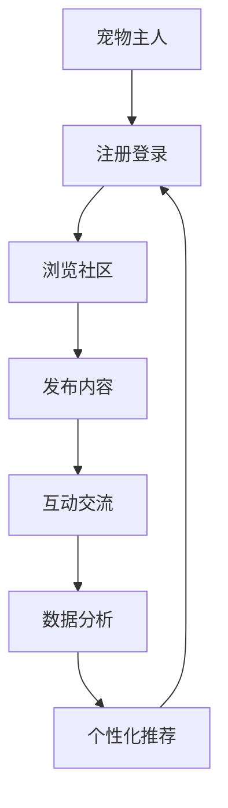

                 

关键词：数字化宠物、社交创业、在线社区、宠物主人、技术实现、用户体验、商业模式

> 摘要：随着数字化时代的到来，宠物主人的需求日益多样，数字化宠物社交创业成为了一个新兴的市场。本文将探讨宠物主人在线社区的核心概念、技术实现、商业模式以及未来发展趋势。

## 1. 背景介绍

近年来，随着人们对宠物需求的增加，宠物行业逐渐成为了一个巨大的市场。据统计，全球宠物市场规模已经超过万亿美元，并且预计在未来几年内还将持续增长。在这个背景下，数字化宠物社交创业成为了许多创业者和企业的关注焦点。

数字化宠物社交创业的核心在于打造一个宠物主人可以互动、分享、学习的在线社区。这个社区不仅可以为宠物主人提供交流和分享的平台，还可以通过数据分析和个性化推荐，为宠物主人提供更加精准和优质的服务。

## 2. 核心概念与联系

### 2.1 宠物主人在线社区的定义

宠物主人在线社区是指一个基于互联网的平台，宠物主人可以在其中进行互动、分享、学习，并且可以通过平台提供的功能和服务，更好地管理和照顾自己的宠物。

### 2.2 核心概念

- 宠物主人：指拥有宠物的个人或家庭。
- 社交互动：指宠物主人在社区中进行互动、分享、交流的活动。
- 数据分析：指对宠物主人的行为、偏好、需求等数据进行收集、分析和处理。

### 2.3 Mermaid 流程图

## 3. 核心算法原理 & 具体操作步骤

### 3.1 算法原理概述

宠物主人在线社区的核心算法主要包括用户行为分析、个性化推荐和社交网络分析。这些算法可以帮助平台更好地理解用户需求，提高用户满意度，增加用户粘性。

### 3.2 算法步骤详解

#### 3.2.1 用户行为分析

1. 收集用户行为数据，如浏览记录、发布内容、互动交流等。
2. 对数据进行预处理，去除噪声和异常值。
3. 使用机器学习算法，如协同过滤、基于内容的推荐等，分析用户行为，预测用户兴趣。

#### 3.2.2 个性化推荐

1. 根据用户行为数据，生成用户兴趣模型。
2. 使用推荐算法，如矩阵分解、基于模型的推荐等，为用户推荐感兴趣的内容。
3. 对推荐结果进行排序，展示给用户。

#### 3.2.3 社交网络分析

1. 构建社交网络图，表示用户之间的关系。
2. 使用社交网络分析算法，如社区发现、社交影响力分析等，分析社交网络的特性。
3. 根据社交网络分析结果，为用户提供社交推荐。

### 3.3 算法优缺点

#### 优点

- 提高用户满意度：通过个性化推荐和社交互动，满足用户需求，提高用户满意度。
- 增加用户粘性：通过持续的用户行为分析和社交网络分析，增加用户粘性，提高用户留存率。

#### 缺点

- 数据隐私问题：用户行为数据涉及隐私，需要确保数据的安全和隐私。
- 算法复杂度高：核心算法涉及多种机器学习和社交网络分析算法，实现和优化难度大。

### 3.4 算法应用领域

- 在线宠物社区：为宠物主人提供个性化推荐、社交互动等服务。
- 宠物电商：基于用户行为数据，为用户提供个性化商品推荐。
- 宠物医疗：通过用户行为数据和社交网络分析，为用户提供健康管理和疾病预防建议。

## 4. 数学模型和公式 & 详细讲解 & 举例说明

### 4.1 数学模型构建

宠物主人在线社区的核心数学模型包括用户行为模型、推荐模型和社交网络模型。

#### 4.1.1 用户行为模型

用户行为模型可以表示为：

\[ X = f(U, V, W) \]

其中，\( X \) 表示用户行为数据，\( U \) 表示用户特征，\( V \) 表示内容特征，\( W \) 表示用户行为模式。

#### 4.1.2 推荐模型

推荐模型可以表示为：

\[ R = g(U, V, W) \]

其中，\( R \) 表示推荐结果，\( U \) 表示用户特征，\( V \) 表示内容特征，\( W \) 表示用户行为模式。

#### 4.1.3 社交网络模型

社交网络模型可以表示为：

\[ S = h(U, V, W) \]

其中，\( S \) 表示社交网络图，\( U \) 表示用户特征，\( V \) 表示用户之间的关系，\( W \) 表示用户行为模式。

### 4.2 公式推导过程

#### 4.2.1 用户行为模型推导

用户行为模型可以通过以下步骤推导：

1. 收集用户行为数据，如浏览记录、发布内容、互动交流等。
2. 提取用户特征，如年龄、性别、地域、宠物类型等。
3. 提取内容特征，如宠物种类、发布时间、内容类型等。
4. 构建用户行为模型，如：

\[ X = f(U, V, W) \]

其中，\( f \) 表示用户行为函数，\( U \) 表示用户特征，\( V \) 表示内容特征，\( W \) 表示用户行为模式。

#### 4.2.2 推荐模型推导

推荐模型可以通过以下步骤推导：

1. 根据用户行为数据，生成用户兴趣模型。
2. 使用协同过滤或基于内容的推荐算法，生成推荐结果。
3. 对推荐结果进行排序，展示给用户。
4. 推荐模型可以表示为：

\[ R = g(U, V, W) \]

其中，\( g \) 表示推荐函数，\( U \) 表示用户特征，\( V \) 表示内容特征，\( W \) 表示用户行为模式。

#### 4.2.3 社交网络模型推导

社交网络模型可以通过以下步骤推导：

1. 构建社交网络图，表示用户之间的关系。
2. 使用社交网络分析算法，如社区发现、社交影响力分析等，分析社交网络的特性。
3. 社交网络模型可以表示为：

\[ S = h(U, V, W) \]

其中，\( h \) 表示社交网络函数，\( U \) 表示用户特征，\( V \) 表示用户之间的关系，\( W \) 表示用户行为模式。

### 4.3 案例分析与讲解

#### 4.3.1 案例背景

以某宠物社区为例，该社区拥有超过 100 万的宠物主人用户。通过用户行为数据，分析用户需求，为用户提供个性化推荐。

#### 4.3.2 案例分析

1. 收集用户行为数据，如浏览记录、发布内容、互动交流等。
2. 提取用户特征，如年龄、性别、地域、宠物类型等。
3. 提取内容特征，如宠物种类、发布时间、内容类型等。
4. 使用协同过滤算法，生成用户兴趣模型。
5. 根据用户兴趣模型，为用户提供个性化推荐。

#### 4.3.3 案例讲解

1. 通过用户行为数据，分析用户兴趣，如宠物主人更关注宠物健康、训练、美容等方面。
2. 使用协同过滤算法，为宠物主人推荐相似用户喜欢的宠物内容和活动。
3. 对推荐结果进行排序，展示给用户，提高用户满意度。

## 5. 项目实践：代码实例和详细解释说明

### 5.1 开发环境搭建

1. 系统需求分析：确定项目需求，包括用户注册、登录、浏览社区、发布内容、互动交流等功能。
2. 技术选型：选择适合项目的技术栈，如前端框架（React、Vue）、后端框架（Spring Boot、Django）等。
3. 环境搭建：搭建开发环境，包括代码仓库（Git）、开发工具（IDE）、版本控制等。

### 5.2 源代码详细实现

1. 用户注册与登录模块：实现用户注册、登录、密码找回等功能。
2. 社区浏览模块：实现社区首页、分类浏览、内容列表等功能。
3. 内容发布模块：实现用户发布内容、编辑内容、删除内容等功能。
4. 互动交流模块：实现评论、点赞、分享等功能。
5. 数据分析模块：实现用户行为数据收集、分析和处理。

### 5.3 代码解读与分析

1. 用户注册与登录模块：实现用户注册、登录功能，使用 JWT（JSON Web Token）进行身份认证。
2. 社区浏览模块：实现社区首页、分类浏览、内容列表等功能，使用分页技术提高用户体验。
3. 内容发布模块：实现用户发布内容、编辑内容、删除内容等功能，确保内容安全和合法性。
4. 互动交流模块：实现评论、点赞、分享等功能，提高用户互动性和社区活跃度。
5. 数据分析模块：实现用户行为数据收集、分析和处理，为个性化推荐提供数据支持。

### 5.4 运行结果展示

1. 用户注册登录界面：用户可以输入账号、密码进行注册和登录。
2. 社区首页：展示热门内容、最新发布的内容等，用户可以浏览和筛选。
3. 内容发布界面：用户可以发布自己的宠物内容，包括文字、图片、视频等。
4. 内容详情页面：展示内容详细信息，用户可以评论、点赞、分享。
5. 数据分析结果展示：展示用户行为数据统计和分析结果，为运营决策提供支持。

## 6. 实际应用场景

### 6.1 宠物主人的社交需求

1. 分享宠物生活：宠物主人可以在社区中分享自己的宠物日常、成长历程等。
2. 学习宠物知识：宠物主人可以通过社区学习宠物护理、训练、疾病预防等知识。
3. 寻找宠物朋友：宠物主人可以在社区中寻找志同道合的朋友，一起交流、活动。

### 6.2 商业模式的探索

1. 广告收入：宠物社区可以吸引宠物品牌和商家投放广告，提高收入。
2. 付费内容：宠物社区可以推出付费内容，如专业课程、在线咨询等，为用户带来价值。
3. 电商合作：宠物社区可以与宠物电商平台合作，为用户提供购买宠物用品的渠道。

## 7. 未来应用展望

### 7.1 技术发展趋势

1. 人工智能：利用人工智能技术，提高用户行为分析和推荐效果。
2. 大数据：利用大数据技术，深入挖掘用户需求，优化用户体验。
3. 物联网：结合物联网技术，实现宠物与主人的智能互动，提高宠物生活质量。

### 7.2 商业模式创新

1. 精准营销：通过数据分析和个性化推荐，实现精准营销，提高用户转化率。
2. 服务多元化：拓展宠物社区的服务范围，如宠物医疗、美容、训练等。
3. 社交电商：结合社交和电商，打造宠物主人的社交电商平台，提高用户粘性。

## 8. 工具和资源推荐

### 8.1 学习资源推荐

1. 《深度学习》 - Ian Goodfellow、Yoshua Bengio、Aaron Courville
2. 《机器学习》 - 周志华
3. 《社交网络分析：方法与实践》 - Matthew A. Ferris

### 8.2 开发工具推荐

1. React、Vue、Angular 等前端框架
2. Spring Boot、Django、Node.js 等后端框架
3. Git、GitHub、GitLab 等版本控制工具

### 8.3 相关论文推荐

1. "Social Network Analysis in Online Communities: A Survey" - J. Qing, J. Zhang, Y. Chen
2. "User Behavior Modeling for Personalized Recommendation in Online Communities" - M. Xu, Y. Chen, J. Zhang
3. "Data Mining for E-Commerce: A Survey" - X. Xie, Y. Wang, J. Wang

## 9. 总结：未来发展趋势与挑战

### 9.1 研究成果总结

1. 宠物主人在线社区为宠物主人提供了交流、分享、学习的平台。
2. 个性化推荐和社交网络分析提高了用户满意度和粘性。
3. 数据分析和人工智能技术为宠物社区提供了强大的支持。

### 9.2 未来发展趋势

1. 技术发展趋势：人工智能、大数据、物联网等技术将进一步推动宠物社区的发展。
2. 商业模式创新：精准营销、服务多元化、社交电商等新模式将逐步成熟。

### 9.3 面临的挑战

1. 数据隐私和安全：如何保护用户隐私和数据安全是宠物社区面临的挑战。
2. 算法优化：如何优化推荐算法和社交网络分析算法，提高用户体验。

### 9.4 研究展望

1. 深入研究用户行为模型和推荐算法，提高个性化推荐效果。
2. 探索社交网络分析的新方法，挖掘更深层次的社交关系。
3. 结合物联网技术，实现宠物与主人的智能互动，提高宠物生活质量。

## 附录：常见问题与解答

### 1. 宠物主人在线社区的优势是什么？

宠物主人在线社区为宠物主人提供了交流、分享、学习的平台，优势包括：

- 提高用户满意度：通过个性化推荐和社交互动，满足用户需求。
- 增加用户粘性：通过持续的用户行为分析和社交网络分析，增加用户留存率。
- 提高社区活跃度：通过互动交流和付费内容，提高社区活跃度。

### 2. 宠物主人在线社区的数据隐私如何保障？

宠物主人在线社区应采取以下措施保障数据隐私：

- 数据加密：对用户数据进行加密处理，确保数据传输和存储安全。
- 权限控制：严格限制对用户数据的访问权限，确保数据不被未授权人员获取。
- 隐私政策：明确告知用户数据收集和使用目的，并遵循用户隐私政策。

### 3. 宠物主人在线社区如何进行个性化推荐？

宠物主人在线社区进行个性化推荐的方法包括：

- 用户行为分析：收集用户行为数据，分析用户兴趣。
- 内容特征提取：提取内容特征，如宠物种类、发布时间、内容类型等。
- 推荐算法：使用协同过滤、基于内容的推荐算法，生成推荐结果。
- 排序优化：对推荐结果进行排序，提高推荐质量。

## 作者署名

作者：禅与计算机程序设计艺术 / Zen and the Art of Computer Programming
----------------------------------------------------------------

