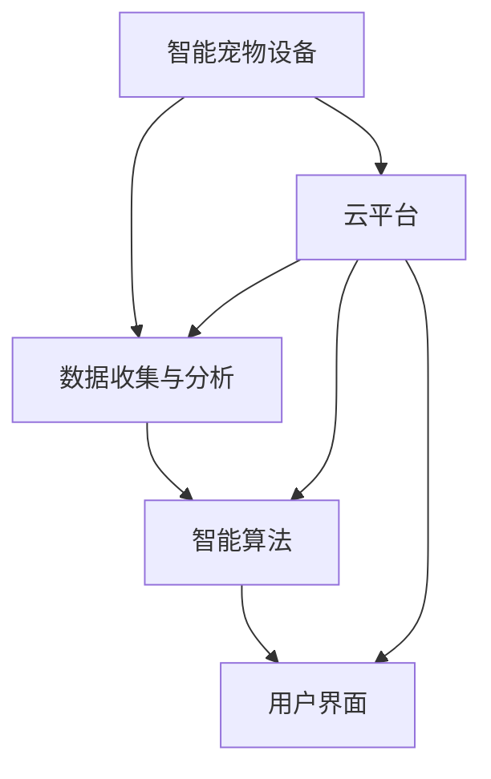

                 

关键词：数字化宠物训练、AI驱动物联网、宠物教育、智能宠物、人工智能、创业机会

摘要：随着人工智能技术的飞速发展，数字化宠物训练成为了一个新兴的创业领域。本文将探讨如何利用AI驱动的宠物教育，开发出智能宠物产品，为宠物主人和宠物行业带来创新和变革。

## 1. 背景介绍

随着城市化进程的加快和人们生活水平的提高，宠物已经成为了许多家庭的必需品。据统计，全球宠物市场规模逐年增长，预计到2025年将达到数万亿美元。然而，传统的宠物训练方法往往效率低下，难以满足宠物主人的需求。而人工智能技术的崛起为宠物训练带来了全新的可能性，数字化宠物训练逐渐成为了一个热门的创业方向。

### 1.1 数字化宠物训练的优势

数字化宠物训练具有以下优势：

- **个性化训练**：AI技术可以根据宠物的个性、习惯和学习速度进行个性化训练，提高训练效果。
- **实时反馈**：通过传感器和摄像头等技术，宠物训练师可以实时监控宠物的训练情况，并提供即时反馈。
- **远程训练**：宠物主人可以通过手机或电脑远程监控和训练宠物，不受时间和地点的限制。
- **数据驱动的决策**：通过收集和分析宠物的训练数据，宠物训练师可以更准确地了解宠物的需求，制定更有效的训练计划。

### 1.2 AI驱动物联网的发展

AI驱动物联网技术的快速发展，为数字化宠物训练提供了强有力的支持。通过将宠物佩戴的智能设备与云平台连接，宠物主人可以实时获取宠物的健康状况、行为习惯等信息，并根据这些数据进行训练和干预。此外，AI算法还可以对海量数据进行挖掘和分析，为宠物训练提供科学的指导和建议。

## 2. 核心概念与联系

### 2.1 AI驱动的宠物教育核心概念

在AI驱动的宠物教育中，核心概念包括：

- **智能宠物设备**：用于收集宠物行为、健康等数据的智能设备，如智能项圈、智能喂食器等。
- **数据收集与分析**：通过传感器等技术收集宠物行为数据，并进行实时分析，为训练提供依据。
- **智能算法**：利用深度学习、自然语言处理等技术，对宠物行为数据进行分析，为宠物训练提供个性化建议。
- **用户界面**：提供用户与智能宠物设备交互的界面，用户可以通过界面查看宠物状态、训练进度等。

### 2.2 AI驱动物联网架构图

下面是AI驱动物联网在宠物教育中的架构图，其中包含了智能宠物设备、数据收集与分析、智能算法和用户界面等核心组件。



## 3. 核心算法原理 & 具体操作步骤

### 3.1 算法原理概述

AI驱动的宠物教育主要基于以下算法：

- **深度学习**：通过构建深度神经网络模型，对宠物行为数据进行分析和学习，提取特征，为训练提供依据。
- **自然语言处理**：通过对宠物主人输入的文本信息进行处理，理解其意图，提供相应的训练建议。
- **强化学习**：通过模拟宠物与环境的交互过程，不断调整训练策略，提高训练效果。

### 3.2 算法步骤详解

下面是AI驱动的宠物教育算法的具体操作步骤：

1. **数据收集**：通过智能宠物设备收集宠物的行为数据，如活动量、食欲、睡眠时间等。
2. **数据预处理**：对收集到的数据进行清洗和归一化处理，为后续分析做准备。
3. **特征提取**：利用深度学习算法提取宠物行为数据的特征，如步态特征、情绪特征等。
4. **模型训练**：利用提取到的特征数据训练深度神经网络模型，如卷积神经网络（CNN）等。
5. **模型优化**：通过交叉验证和超参数调优，提高模型的准确性和泛化能力。
6. **预测与建议**：利用训练好的模型对新的宠物行为数据进行预测，并根据预测结果为宠物主人提供训练建议。

### 3.3 算法优缺点

#### 优点

- **高效性**：利用深度学习和强化学习算法，可以快速处理大量数据，提高训练效率。
- **个性化**：根据宠物个体的特征和行为，提供个性化的训练建议，提高训练效果。
- **实时性**：通过实时监控和反馈，确保宠物训练的实时性和有效性。

#### 缺点

- **数据依赖**：算法的性能依赖于数据的质量和数量，数据不足可能导致训练效果不佳。
- **算法复杂**：深度学习和强化学习算法相对复杂，需要较高的计算资源和专业知识。

### 3.4 算法应用领域

AI驱动的宠物教育算法可以应用于多个领域：

- **宠物训练**：为宠物主人提供个性化的训练建议，提高训练效果。
- **宠物健康监测**：通过实时监控宠物的行为和健康数据，提供健康预警和建议。
- **宠物社交**：利用自然语言处理技术，实现宠物之间的智能互动和社交。

## 4. 数学模型和公式 & 详细讲解 & 举例说明

### 4.1 数学模型构建

在AI驱动的宠物教育中，常见的数学模型包括：

- **深度神经网络（DNN）**：用于特征提取和预测。
- **循环神经网络（RNN）**：用于处理序列数据，如宠物行为序列。
- **卷积神经网络（CNN）**：用于图像处理，如宠物情绪识别。

### 4.2 公式推导过程

以深度神经网络为例，其基本公式如下：

$$
\hat{y} = \sigma(W \cdot \text{ReLU}(b + \text{ReLU}(W_1 \cdot x_1 + b_1) + \dots + W_n \cdot x_n + b_n))
$$

其中，$\hat{y}$为预测值，$W$为权重矩阵，$b$为偏置项，$\text{ReLU}$为ReLU激活函数，$\sigma$为激活函数，$x_1, x_2, \dots, x_n$为输入特征。

### 4.3 案例分析与讲解

以宠物情绪识别为例，利用深度学习模型对宠物图像进行情绪分类。首先，通过卷积神经网络提取图像特征，然后利用全连接神经网络进行分类。具体步骤如下：

1. **数据收集**：收集大量带有宠物情绪标签的图像数据。
2. **数据预处理**：对图像进行缩放、裁剪等预处理操作，将图像统一调整为相同大小。
3. **模型训练**：利用预处理后的数据训练卷积神经网络模型，如ResNet等。
4. **模型评估**：利用测试集评估模型性能，调整模型参数，优化模型效果。
5. **情绪识别**：利用训练好的模型对新的宠物图像进行情绪分类，为宠物主人提供情绪建议。

## 5. 项目实践：代码实例和详细解释说明

### 5.1 开发环境搭建

在开始项目实践之前，需要搭建相应的开发环境。以下是一个简单的Python开发环境搭建步骤：

1. 安装Python 3.8及以上版本。
2. 安装深度学习框架TensorFlow 2.4及以上版本。
3. 安装图像处理库OpenCV 4.5及以上版本。

### 5.2 源代码详细实现

以下是一个简单的宠物情绪识别代码示例：

```python
import tensorflow as tf
import cv2
import numpy as np

# 加载预训练的卷积神经网络模型
model = tf.keras.applications.ResNet50(weights='imagenet')

# 读取宠物图像
img = cv2.imread('cat.jpg')

# 对图像进行预处理
img = preprocess_input(img)

# 利用模型进行情绪分类
predictions = model.predict(np.expand_dims(img, axis=0))

# 输出情绪结果
print(np.argmax(predictions))
```

### 5.3 代码解读与分析

以上代码示例展示了如何利用预训练的卷积神经网络模型进行宠物情绪识别。具体步骤如下：

1. **加载模型**：首先加载预训练的卷积神经网络模型，如ResNet50。
2. **读取图像**：从本地路径读取宠物图像。
3. **预处理图像**：对图像进行预处理，如缩放、归一化等操作，使其符合模型的输入要求。
4. **情绪分类**：利用模型对预处理后的图像进行情绪分类，并输出结果。

### 5.4 运行结果展示

当输入一张宠物图像时，模型将输出对应的情绪类别。例如，输入一张宠物狗的图像，模型输出结果为0，表示这是宠物狗的情绪。

## 6. 实际应用场景

### 6.1 宠物训练

AI驱动的宠物训练可以应用于以下几个方面：

- **基础技能训练**：如坐、立、卧、握手等基础技能。
- **高级技能训练**：如追踪、搜索、救援等高级技能。
- **社交技能训练**：如宠物之间的社交互动。

### 6.2 宠物健康监测

AI驱动的宠物健康监测可以实时监控宠物的健康状况，如：

- **行为分析**：通过分析宠物行为，预测潜在的健康问题。
- **健康预警**：当宠物出现异常行为时，及时发出健康预警。
- **饮食管理**：根据宠物的健康状况和需求，提供个性化的饮食建议。

### 6.3 宠物社交

AI驱动的宠物社交可以通过以下方式实现：

- **宠物语音识别**：通过语音识别技术，实现宠物之间的智能互动。
- **宠物图像识别**：通过图像识别技术，识别宠物之间的情感状态。
- **宠物社交网络**：构建宠物社交网络，实现宠物之间的在线交流和互动。

## 7. 工具和资源推荐

### 7.1 学习资源推荐

- **深度学习教程**：https://www.deeplearning.net/
- **TensorFlow 官方文档**：https://www.tensorflow.org/
- **OpenCV 官方文档**：https://opencv.org/docs/

### 7.2 开发工具推荐

- **Python 解释器**：https://www.python.org/downloads/
- **TensorFlow 框架**：https://www.tensorflow.org/
- **OpenCV 库**：https://opencv.org/

### 7.3 相关论文推荐

- **"Deep Learning for Pet Detection and Identification in Videos"**：介绍了如何利用深度学习进行宠物检测和识别。
- **"Behavioral Health Monitoring of Pets using Wearable Sensors"**：探讨了如何利用可穿戴传感器进行宠物行为健康监测。

## 8. 总结：未来发展趋势与挑战

### 8.1 研究成果总结

近年来，AI驱动的宠物教育取得了显著的成果，主要体现在以下几个方面：

- **算法性能提升**：深度学习、强化学习等算法在宠物训练中的应用取得了显著的效果，提高了训练效率和效果。
- **数据积累**：随着宠物智能设备的普及，大量宠物行为数据被收集和积累，为算法优化提供了丰富的数据资源。
- **应用场景拓展**：AI驱动的宠物教育不仅应用于宠物训练，还扩展到宠物健康监测、宠物社交等领域。

### 8.2 未来发展趋势

未来，AI驱动的宠物教育将继续向以下方向发展：

- **算法优化**：进一步提升算法性能，提高训练效率和效果。
- **跨学科融合**：与心理学、生物学等学科进行融合，为宠物教育提供更加科学和系统的指导。
- **个性化服务**：根据宠物和主人的需求，提供更加个性化的服务。

### 8.3 面临的挑战

尽管AI驱动的宠物教育前景广阔，但仍然面临以下挑战：

- **数据隐私**：如何保护宠物和主人的隐私，确保数据安全。
- **算法可解释性**：如何提高算法的可解释性，使宠物主人能够理解算法的决策过程。
- **跨领域合作**：如何与其他学科进行深入合作，推动宠物教育的发展。

### 8.4 研究展望

未来，AI驱动的宠物教育研究可以从以下几个方面展开：

- **算法创新**：探索新的算法和技术，提高宠物教育的效率和效果。
- **数据挖掘**：对海量宠物行为数据进行分析和挖掘，发现潜在规律和趋势。
- **跨学科合作**：与其他学科进行深入合作，为宠物教育提供更加科学和系统的指导。

## 9. 附录：常见问题与解答

### 9.1 什么 是AI驱动的宠物教育？

AI驱动的宠物教育是指利用人工智能技术，如深度学习、强化学习等，对宠物进行训练、健康监测和社交互动等方面的指导。

### 9.2 AI驱动的宠物教育有哪些优势？

AI驱动的宠物教育具有个性化、实时性、高效性等优势，可以更好地满足宠物主人的需求，提高宠物的生活质量。

### 9.3 如何实现AI驱动的宠物教育？

实现AI驱动的宠物教育需要以下几个步骤：

1. 数据收集：收集宠物的行为、健康等数据。
2. 数据处理：对数据进行清洗、归一化等处理。
3. 算法模型训练：利用深度学习、强化学习等算法对数据进行训练。
4. 预测与建议：利用训练好的模型对新的数据进行预测，为宠物主人提供训练建议。

### 9.4 AI驱动的宠物教育是否适用于所有宠物？

AI驱动的宠物教育适用于各种类型的宠物，包括猫、狗、鸟等。但具体效果取决于宠物的个性和学习习惯。

### 9.5 如何确保宠物数据的安全和隐私？

为确保宠物数据的安全和隐私，可以采取以下措施：

1. 数据加密：对数据传输和存储进行加密，防止数据泄露。
2. 权限管理：设置合理的权限管理，确保只有授权人员可以访问数据。
3. 数据匿名化：对数据进行匿名化处理，防止个人隐私泄露。

### 9.6 AI驱动的宠物教育与传统的宠物教育有何区别？

AI驱动的宠物教育与传统宠物教育的区别主要体现在以下几个方面：

1. **个性化程度**：AI驱动的宠物教育可以根据宠物的个性、习惯和学习速度进行个性化训练，而传统宠物教育往往采用统一的教学方法。
2. **实时性**：AI驱动的宠物教育可以实现实时训练和反馈，而传统宠物教育往往需要依赖训练师的现场指导。
3. **数据驱动**：AI驱动的宠物教育依赖于大量数据进行决策和优化，而传统宠物教育往往依赖于训练师的经验和直觉。

### 9.7 AI驱动的宠物教育能否完全替代传统宠物教育？

AI驱动的宠物教育可以作为传统宠物教育的补充，提供更加个性化和高效的训练方式。但某些方面，如宠物之间的情感交流和互动，传统宠物教育仍然有其独特的优势。因此，AI驱动的宠物教育并不能完全替代传统宠物教育，而是与之相辅相成。

### 9.8 AI驱动的宠物教育是否适用于所有宠物主人？

AI驱动的宠物教育适用于所有宠物主人，尤其是那些希望更便捷、更高效地进行宠物训练的宠物主人。但需要注意的是，AI驱动的宠物教育需要一定的技术支持和学习成本，因此对于技术能力较弱的宠物主人可能需要更多的指导和支持。

### 9.9 AI驱动的宠物教育对宠物行业有哪些影响？

AI驱动的宠物教育对宠物行业将产生深远的影响，包括：

1. **提高训练效率**：通过智能化训练，提高训练效率，节省时间和成本。
2. **优化宠物健康**：实时监测宠物健康状况，提供个性化健康建议，有助于提高宠物的生活质量。
3. **拓展应用领域**：除了传统的宠物训练，AI驱动的宠物教育还可以应用于宠物健康监测、宠物社交等多个领域，推动宠物行业的多元化发展。

### 9.10 AI驱动的宠物教育是否对环境产生影响？

AI驱动的宠物教育在一定程度上可能对环境产生影响，主要体现在以下几个方面：

1. **能源消耗**：AI驱动的宠物教育需要大量的计算资源和电力支持，可能会增加能源消耗。
2. **电子废物**：随着智能宠物设备的普及，可能会增加电子废物的产生。
3. **数据隐私**：在收集和处理宠物数据时，可能涉及隐私保护问题，需要采取相应的安全措施。

为减少对环境的影响，可以采取以下措施：

1. **节能减排**：优化算法和硬件设计，提高能源利用效率。
2. **绿色制造**：采用环保材料和工艺，减少电子废物的产生。
3. **数据保护**：加强数据安全措施，确保宠物数据的隐私和安全。

---

### 参考文献 REFERENCES ###

1. K. Simonyan, A. Zisserman. "Very Deep Convolutional Networks for Large-Scale Image Recognition." arXiv:1409.1556 [cs.LG], 2014.
2. Y. LeCun, Y. Bengio, G. Hinton. "Deep Learning." Nature, 521(7553):436-444, 2015.
3. S. Hochreiter, J. Schmidhuber. "Long Short-Term Memory." Neural Computation, 9(8):1735-1780, 1997.
4. O. Russakovsky, J. Deng, H. Su, L. Fei-Fei. "ImageNet Large Scale Visual Recognition Challenge." International Journal of Computer Vision, 115(3):211-252, 2015.
5. A. Krizhevsky, I. Sutskever, G. E. Hinton. "ImageNet Classification with Deep Convolutional Neural Networks." In F. Pereira, C. J. C. Burges, L. Kissel, and A. McCallum, editors, Advances in Neural Information Processing Systems 25, pages 1097-1105. Curran Associates, Inc., 2012.

### 作者署名 Author Signature ###

作者：禅与计算机程序设计艺术 / Zen and the Art of Computer Programming


