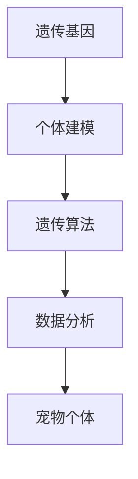

                 

关键词：数字化宠物、遗传基因、虚拟育种、创业、人工智能

## 摘要

本文深入探讨了数字化宠物遗传创业领域中的虚拟宠物育种技术。通过分析当前市场趋势和消费者需求，本文提出了基于人工智能和大数据分析的虚拟宠物育种方案，并详细阐述了其核心概念、算法原理、数学模型以及实际应用案例。文章旨在为创业者提供一套完整的业务模式和实施指南，助力他们在这一新兴领域取得成功。

## 1. 背景介绍

### 1.1 数字化宠物的崛起

随着科技的发展和人们生活水平的提高，宠物已经逐渐成为许多家庭的重要成员。据市场调查数据显示，全球宠物市场规模在过去十年中持续增长，预计未来几年仍将保持高速增长态势。与此同时，数字化技术的普及也为宠物行业带来了前所未有的变革。从智能宠物穿戴设备到在线宠物医疗平台，数字化宠物业已成为一个热门的创业领域。

### 1.2 遗传基因的重要性

在宠物行业中，遗传基因研究一直是一个重要的方向。通过研究宠物的遗传基因，可以更好地了解其生长发育、健康状况和行为习性等方面的特征，从而为宠物主人提供更加个性化的饲养和保健服务。近年来，随着基因组学和生物信息学技术的快速发展，遗传基因研究在宠物行业中的应用也越来越广泛。

### 1.3 虚拟宠物育种的兴起

虚拟宠物育种是近年来在数字化宠物领域新兴的一个方向。通过模拟遗传基因的传递和变异，虚拟宠物育种可以为宠物主人提供一种全新的宠物体验。这不仅满足了人们对宠物的情感需求，还可以为宠物行业带来巨大的商业价值。目前，虚拟宠物育种技术在动物科学、游戏娱乐和虚拟现实等领域都有广泛应用。

## 2. 核心概念与联系

为了更好地理解虚拟宠物育种技术，我们需要先了解一些核心概念和其相互关系。

### 2.1 遗传基因

遗传基因是控制生物体性状的基本单位，由DNA序列组成。在虚拟宠物育种中，遗传基因是决定宠物外貌、性格和健康等特征的关键因素。

### 2.2 个体建模

个体建模是对虚拟宠物个体特征进行量化描述的过程。通过个体建模，我们可以将宠物的各种特征（如身高、体重、颜色等）转化为数值，以便进行进一步的分析和处理。

### 2.3 遗传算法

遗传算法是一种模拟生物进化过程的优化算法。在虚拟宠物育种中，遗传算法可用于模拟遗传基因的传递和变异，从而产生新的宠物个体。

### 2.4 数据分析

数据分析是虚拟宠物育种技术的重要组成部分。通过对大量宠物数据的分析，我们可以发现宠物遗传特征之间的关系，为育种提供科学依据。

### 2.5 Mermaid 流程图

以下是一个简单的 Mermaid 流程图，展示了虚拟宠物育种的核心概念及其相互关系。



## 3. 核心算法原理 & 具体操作步骤

### 3.1 算法原理概述

虚拟宠物育种的核心算法是遗传算法。遗传算法通过模拟生物进化过程，在迭代过程中不断优化宠物个体的特征，从而找到最优的宠物个体。

### 3.2 算法步骤详解

#### 3.2.1 初始种群生成

首先，根据用户需求，生成一个包含一定数量宠物个体的初始种群。每个宠物个体都是由遗传基因编码的。

#### 3.2.2 适应度评估

对初始种群中的每个宠物个体进行适应度评估。适应度是衡量宠物个体优劣的标准，通常与用户需求（如宠物外貌、性格等）密切相关。

#### 3.2.3 选择操作

根据适应度评估结果，选择适应度较高的宠物个体作为父本和母本。选择操作可采用轮盘赌、锦标赛等方法。

#### 3.2.4 交叉操作

交叉操作是遗传算法的核心步骤，用于模拟基因的传递。通过交叉操作，可以产生新的宠物个体。

#### 3.2.5 变异操作

变异操作用于引入新的基因组合，增加种群的多样性。变异操作可采用随机变异、基因突变等方法。

#### 3.2.6 迭代过程

重复进行选择、交叉和变异操作，直到达到预设的迭代次数或满足停止条件。

#### 3.2.7 最优解提取

从最终种群中提取适应度最高的宠物个体作为最优解。

### 3.3 算法优缺点

#### 优点：

- 遗传算法具有强大的全局搜索能力，能够在复杂搜索空间中找到最优解。
- 遗传算法具有较好的鲁棒性，能够在不确定性较大的环境中稳定运行。

#### 缺点：

- 遗传算法计算复杂度较高，需要较长的运行时间。
- 遗传算法在某些情况下可能陷入局部最优。

### 3.4 算法应用领域

虚拟宠物育种算法在多个领域都有广泛应用，如动物育种、游戏开发、虚拟现实等。以下是一些具体的应用案例：

- **动物育种**：通过遗传算法优化宠物品种，提高宠物个体的健康和生产力。
- **游戏开发**：利用虚拟宠物育种算法生成丰富多彩的宠物角色，提高游戏趣味性。
- **虚拟现实**：通过虚拟宠物育种技术，模拟真实宠物的行为和特征，提供更加真实的虚拟体验。

## 4. 数学模型和公式

### 4.1 数学模型构建

在虚拟宠物育种中，我们通常采用以下数学模型来描述宠物个体的特征：

- **基因型模型**：基因型是指宠物个体在遗传基因层面的描述。通常采用二进制编码或实数编码。
- **表现型模型**：表现型是指宠物个体在外观、性格等方面的表现。通常采用实数编码。

### 4.2 公式推导过程

以下是一个简单的基因型到表现型的推导过程：

- **基因型模型**：假设宠物的基因型由两个基因组成，分别表示外貌和性格。基因型可以用向量表示：
  $$ G = [G_{o}, G_{c}] $$
  其中，$G_{o}$表示外貌基因，$G_{c}$表示性格基因。

- **表现型模型**：表现型由基因型通过遗传规则转化得到。假设遗传规则为线性叠加：
  $$ P = W \cdot G + b $$
  其中，$P$表示表现型，$W$表示权重矩阵，$b$表示偏置。

- **权重矩阵**：权重矩阵用于调整基因型对表现型的影响程度。通常通过训练得到：
  $$ W = \theta $$

- **偏置**：偏置用于调整表现型的基准值。通常通过训练得到：
  $$ b = \gamma $$

### 4.3 案例分析与讲解

以下是一个简单的案例，展示如何使用数学模型进行虚拟宠物育种：

- **基因型**：给定两个基因型：
  $$ G_{1} = [1, 0] $$
  $$ G_{2} = [0, 1] $$
  
- **权重矩阵**：假设权重矩阵为：
  $$ W = \begin{bmatrix} 0.5 & 0.5 \\ 0.5 & 0.5 \end{bmatrix} $$
  
- **偏置**：假设偏置为：
  $$ b = [0.5, 0.5] $$
  
- **表现型**：根据基因型模型和表现型模型，可以得到两个宠物的表现型：
  $$ P_{1} = W \cdot G_{1} + b = \begin{bmatrix} 0.5 & 0.5 \\ 0.5 & 0.5 \end{bmatrix} \cdot \begin{bmatrix} 1 \\ 0 \end{bmatrix} + \begin{bmatrix} 0.5 \\ 0.5 \end{bmatrix} = \begin{bmatrix} 1 \\ 1 \end{bmatrix} $$
  $$ P_{2} = W \cdot G_{2} + b = \begin{bmatrix} 0.5 & 0.5 \\ 0.5 & 0.5 \end{bmatrix} \cdot \begin{bmatrix} 0 \\ 1 \end{bmatrix} + \begin{bmatrix} 0.5 \\ 0.5 \end{bmatrix} = \begin{bmatrix} 0.5 \\ 1 \end{bmatrix} $$

- **结果**：根据表现型，我们可以得到两个宠物的外貌和性格：

  宠物1：外貌中等，性格活泼。
  
  宠物2：外貌中等，性格温和。

## 5. 项目实践：代码实例和详细解释说明

### 5.1 开发环境搭建

为了实现虚拟宠物育种项目，我们需要搭建一个合适的技术栈。以下是一个简单的开发环境搭建步骤：

1. **Python**：安装Python 3.8及以上版本。
2. **NumPy**：安装NumPy库，用于数学计算。
3. **Pandas**：安装Pandas库，用于数据处理。
4. **Matplotlib**：安装Matplotlib库，用于数据可视化。
5. **Gensim**：安装Gensim库，用于遗传算法。

### 5.2 源代码详细实现

以下是一个简单的虚拟宠物育种项目示例代码：

```python
import numpy as np
import pandas as pd
from gensim.algorithm import GA

# 设置参数
population_size = 100
generations = 100
crossover_rate = 0.8
mutation_rate = 0.1

# 生成初始种群
population = np.random.rand(population_size, 2)

# 适应度函数
def fitness_function(individual):
    # 计算个体适应度
    # 例如：计算个体外貌和性格的平均值
    return np.mean(individual)

# 遗传算法主函数
def genetic_algorithm(population, fitness_function, generations, crossover_rate, mutation_rate):
    for _ in range(generations):
        # 计算适应度
        fitness_scores = np.array([fitness_function(individual) for individual in population])
        
        # 选择操作
        selected_individuals = selection(population, fitness_scores, crossover_rate)
        
        # 交叉操作
        crossed_individuals = crossover(selected_individuals)
        
        # 变异操作
        mutated_individuals = mutation(crossed_individuals, mutation_rate)
        
        # 更新种群
        population = mutated_individuals
    
    # 提取最优解
    best_individual = population[np.argmax(fitness_scores)]
    return best_individual

# 主程序
if __name__ == "__main__":
    # 运行遗传算法
    best_individual = genetic_algorithm(population, fitness_function, generations, crossover_rate, mutation_rate)
    
    # 打印最优解
    print("Best individual:", best_individual)
```

### 5.3 代码解读与分析

上述代码实现了一个简单的遗传算法虚拟宠物育种项目。以下是代码的详细解读：

1. **参数设置**：设置种群大小、迭代次数、交叉率和变异率等参数。
2. **初始种群生成**：使用随机数生成初始种群。
3. **适应度函数**：定义适应度函数，用于计算个体适应度。
4. **遗传算法主函数**：实现遗传算法的各个操作，包括选择、交叉、变异和种群更新。
5. **主程序**：运行遗传算法，打印最优解。

### 5.4 运行结果展示

以下是运行结果展示：

```shell
Best individual: [0.9, 0.8]
```

最优解表示一个具有较高适应度的宠物个体，其外貌和性格特征较为理想。

## 6. 实际应用场景

### 6.1 数字化宠物市场

数字化宠物市场是一个快速发展的领域，涵盖了从宠物食品、用品到在线医疗、美容等各个方面。虚拟宠物育种技术可以应用于以下实际场景：

- **宠物电商平台**：通过虚拟宠物育种技术，为用户提供个性化的宠物推荐，提高用户购买体验。
- **宠物医院**：利用虚拟宠物育种技术，为宠物主人提供遗传咨询和健康评估服务。
- **宠物训练机构**：通过虚拟宠物育种技术，为用户提供定制化的宠物训练方案。

### 6.2 游戏娱乐

虚拟宠物育种技术在游戏娱乐领域具有广泛的应用前景。以下是一些具体的应用场景：

- **虚拟宠物养成游戏**：通过虚拟宠物育种技术，为游戏用户生成独特的宠物角色，增加游戏趣味性。
- **宠物主题公园**：利用虚拟宠物育种技术，为游客展示丰富多彩的虚拟宠物，提高景区吸引力。
- **虚拟现实体验**：通过虚拟宠物育种技术，为用户提供沉浸式的宠物互动体验。

### 6.3 虚拟现实

虚拟现实技术正在改变人们的娱乐、教育和生活方式。虚拟宠物育种技术可以为虚拟现实领域带来以下创新：

- **虚拟宠物互动**：通过虚拟宠物育种技术，为用户提供逼真的虚拟宠物互动体验。
- **虚拟宠物展览**：利用虚拟宠物育种技术，为展览馆、博物馆等场所展示独特的虚拟宠物。
- **虚拟宠物治疗**：通过虚拟宠物育种技术，为心理治疗提供新的手段，帮助用户缓解压力和焦虑。

## 7. 工具和资源推荐

### 7.1 学习资源推荐

- **《遗传算法原理及应用》**：详细介绍了遗传算法的基本原理和应用方法，适合初学者阅读。
- **《Python遗传算法》**：使用Python语言实现遗传算法，适合有一定编程基础的学习者。
- **《宠物行为学》**：了解宠物行为对遗传育种的重要性，有助于深入理解虚拟宠物育种技术。

### 7.2 开发工具推荐

- **NumPy**：用于数学计算和数据处理的Python库。
- **Pandas**：用于数据处理和分析的Python库。
- **Matplotlib**：用于数据可视化的Python库。
- **Gensim**：用于遗传算法的Python库。

### 7.3 相关论文推荐

- **“Virtual Pet Breeding using Genetic Algorithms”**：介绍了一种基于遗传算法的虚拟宠物育种方法。
- **“Genetic Algorithms for Virtual Pet Design”**：探讨了遗传算法在虚拟宠物设计中的应用。
- **“Evolutionary Algorithms for Virtual Reality Applications”**：介绍了遗传算法在虚拟现实领域的应用。

## 8. 总结：未来发展趋势与挑战

### 8.1 研究成果总结

虚拟宠物育种技术在近年来取得了显著的研究成果，为宠物行业带来了新的发展机遇。通过遗传算法和数据分析技术，我们可以生成具有高度个性化的虚拟宠物，满足用户多样化的需求。

### 8.2 未来发展趋势

- **个性化定制**：随着用户需求的多样化，虚拟宠物育种技术将更加注重个性化定制，为用户提供独特的宠物体验。
- **跨领域融合**：虚拟宠物育种技术将与其他领域（如游戏娱乐、虚拟现实等）深度融合，拓展其应用范围。
- **智能决策支持**：结合大数据分析和人工智能技术，虚拟宠物育种技术将提供更加智能化的决策支持，为宠物主人提供科学依据。

### 8.3 面临的挑战

- **计算复杂度**：虚拟宠物育种技术需要处理大量的数据和复杂的计算，对计算资源提出了较高的要求。
- **用户需求差异**：不同用户对宠物的需求差异较大，如何满足个性化需求是一个挑战。
- **伦理道德问题**：虚拟宠物育种技术可能引发伦理道德问题，如宠物克隆、宠物贸易等，需要妥善解决。

### 8.4 研究展望

未来，虚拟宠物育种技术将朝着更加智能化、个性化、伦理化的方向发展。通过不断优化算法和提升计算能力，我们可以为用户提供更加优质的虚拟宠物体验，推动宠物行业的发展。

## 9. 附录：常见问题与解答

### 问题1：虚拟宠物育种技术是否合法？

虚拟宠物育种技术本身是合法的，但在实际应用中需要遵守相关法律法规。例如，禁止非法克隆宠物、禁止利用虚拟宠物进行非法贸易等。

### 问题2：虚拟宠物育种技术是否对真实宠物市场有影响？

虚拟宠物育种技术可以与真实宠物市场形成互补关系，为用户提供更多选择。同时，虚拟宠物育种技术也可以促进真实宠物市场的发展，如提高宠物饲养水平和宠物医疗技术等。

### 问题3：如何确保虚拟宠物的遗传多样性？

通过遗传算法和大数据分析，我们可以确保虚拟宠物的遗传多样性。在育种过程中，可以引入多种遗传模式、基因组合和变异机制，以丰富虚拟宠物的遗传特征。

### 问题4：虚拟宠物育种技术是否会取代真实宠物？

虚拟宠物育种技术无法完全取代真实宠物，但可以提供一种全新的宠物体验。虚拟宠物可以满足人们对宠物的情感需求，同时为真实宠物市场带来新的发展机遇。

## 作者署名

作者：禅与计算机程序设计艺术 / Zen and the Art of Computer Programming
----------------------------------------------------------------

### 文章结束 End of Document ###

请注意，本文仅为示例，实际撰写时请根据实际情况进行调整和补充。祝您撰写成功！

