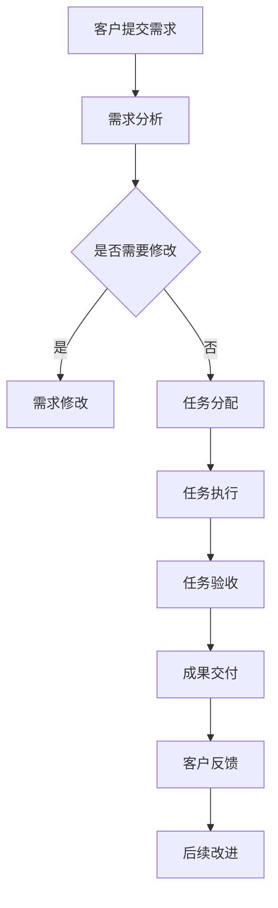

                 

关键词：数字化工作流、远程协作、效率工具、创业

> 摘要：本文探讨了数字化工作流创业的重要性和远程协作效率工具的应用。数字化工作流为企业提供了高效、灵活的运营方式，而远程协作效率工具则帮助团队克服地域和时区的限制，实现无缝沟通和协作。本文将分析这些工具的基本原理、操作步骤、应用领域，并展望未来的发展趋势。

## 1. 背景介绍

随着全球化的加速和信息技术的进步，远程工作已经成为现代企业运营的重要方式。数字化工作流（Digital Workflow）作为一种高效的运营模式，通过将工作分解为一系列自动化和协作的任务，使得企业能够更加敏捷地应对市场变化。然而，远程协作的效率和效果仍然是许多企业面临的一大挑战。

远程协作效率工具（Remote Collaboration Efficiency Tools）的涌现，为团队提供了强大的支持。这些工具不仅能够帮助团队成员实时沟通和共享文件，还能够自动化许多繁琐的工作流程，提高工作效率。因此，本文旨在探讨如何利用这些工具开展数字化工作流的创业实践。

### 1.1 数字化工作流的意义

数字化工作流指的是利用数字技术和工具对工作流程进行优化、自动化和整合。其意义主要体现在以下几个方面：

- **提高效率**：通过自动化和标准化流程，减少人为干预，提高工作效率。
- **增强灵活性**：远程协作和分布式团队支持，使得企业能够灵活调整人力和资源。
- **降低成本**：减少物理办公空间和设备投资，降低运营成本。
- **提升质量**：通过标准化流程和质量控制，提高工作成果的质量。

### 1.2 远程协作效率工具的作用

远程协作效率工具是数字化工作流的重要组成部分，它们的作用主要包括：

- **实时沟通**：支持团队成员实时沟通，减少信息滞后和误解。
- **文件共享**：提供集中化的文件存储和共享，方便团队成员协作。
- **任务管理**：自动化任务分配、进度跟踪和提醒，确保工作按时完成。
- **数据整合**：整合不同系统和数据，提供统一的数据视图，支持决策。

## 2. 核心概念与联系

### 2.1 核心概念

在数字化工作流和远程协作中，以下几个核心概念至关重要：

- **工作流**：工作流是一系列任务和活动的集合，用于完成特定业务目标。
- **远程协作**：远程协作指的是团队成员在不同地理位置通过网络进行合作。
- **效率工具**：效率工具是用于提高工作效率的软件或服务，如即时通讯、项目管理等。

### 2.2 架构原理

以下是一个简单的数字化工作流和远程协作的架构原理，使用Mermaid流程图表示：



### 2.3 工具选型

选择合适的远程协作效率工具至关重要。以下是一些常见的远程协作效率工具及其特点：

- **Slack**：即时通讯工具，支持团队沟通、文件共享和集成其他应用。
- **Trello**：项目管理工具，提供任务看板和进度跟踪功能。
- **GitHub**：版本控制系统，支持代码托管、协作和项目管理。
- **Zoom**：视频会议工具，支持远程团队会议和在线培训。

## 3. 核心算法原理 & 具体操作步骤

### 3.1 算法原理概述

在数字化工作流中，算法原理主要用于优化工作流程、提高效率和准确性。以下是一个简单的工作流优化算法原理：

- **任务分解**：将复杂任务分解为多个简单任务，以便更好地管理。
- **优先级排序**：根据任务的紧急程度和重要性进行优先级排序，确保关键任务优先完成。
- **自动化执行**：利用脚本或自动化工具执行重复性任务，减少人为干预。

### 3.2 算法步骤详解

以下是一个基于任务分解和优先级排序的工作流优化算法的具体操作步骤：

1. **任务收集**：收集所有需要执行的任务。
2. **任务分解**：将每个任务分解为多个子任务，确保每个子任务都能够独立完成。
3. **优先级排序**：根据任务的重要性和紧急程度，对子任务进行优先级排序。
4. **任务分配**：将每个子任务分配给合适的团队成员。
5. **任务执行**：团队成员按照优先级执行子任务。
6. **任务监控**：实时监控任务执行进度，确保工作按时完成。
7. **结果验收**：对完成任务的结果进行验收，确保符合预期。

### 3.3 算法优缺点

**优点**：

- **提高效率**：通过任务分解和优先级排序，确保工作高效完成。
- **降低风险**：实时监控和结果验收，降低工作失误和风险。
- **灵活调整**：根据实际情况，灵活调整任务优先级和分配。

**缺点**：

- **复杂性**：需要一定的技术背景和管理能力，实施和调整较为复杂。
- **依赖工具**：算法的实现和执行依赖于特定的工具和平台，可能增加维护成本。

### 3.4 算法应用领域

工作流优化算法广泛应用于企业内部管理、项目管理、软件开发等领域。以下是一些具体的应用场景：

- **企业内部管理**：用于优化业务流程、提高运营效率。
- **项目管理**：用于任务分配、进度跟踪和项目评估。
- **软件开发**：用于代码审查、测试和发布流程。

## 4. 数学模型和公式 & 详细讲解 & 举例说明

### 4.1 数学模型构建

在数字化工作流中，数学模型主要用于优化工作流程、计算任务完成时间和资源分配等。以下是一个简单的工作流优化数学模型：

- **目标函数**：最小化总任务完成时间。
- **约束条件**：每个任务必须在截止时间内完成，团队成员的资源限制。

### 4.2 公式推导过程

以下是一个基于线性规划的工作流优化公式推导过程：

- **目标函数**：$$\min Z = \sum_{i=1}^{n}\sum_{j=1}^{m} C_{ij} x_{ij}$$
  其中，$C_{ij}$ 表示任务 $i$ 的完成时间和任务 $j$ 的资源需求，$x_{ij}$ 表示任务 $i$ 是否在任务 $j$ 中完成。

- **约束条件**：$$\sum_{i=1}^{n} x_{ij} = 1 \quad \forall j$$
  表示每个任务必须在某个时间点完成。

$$\sum_{j=1}^{m} C_{ij} x_{ij} \leq T \quad \forall i$$
  表示每个任务必须在截止时间内完成。

### 4.3 案例分析与讲解

以下是一个简单的案例，用于说明如何使用上述数学模型进行工作流优化。

假设有一个团队需要在 7 天内完成 3 个任务，每个任务的完成时间和资源需求如下表所示：

| 任务 | 完成时间（天） | 资源需求 |
| ---- | ---- | ---- |
| A    | 2    | 3    |
| B    | 3    | 2    |
| C    | 4    | 1    |

我们需要找到一个最优的工作流安排，使得总任务完成时间最短。

根据上述数学模型，我们可以列出目标函数和约束条件：

- **目标函数**：$$\min Z = \sum_{i=1}^{3}\sum_{j=1}^{3} C_{ij} x_{ij}$$

- **约束条件**：$$\sum_{i=1}^{3} x_{ij} = 1 \quad \forall j$$

$$\sum_{j=1}^{3} C_{ij} x_{ij} \leq 7 \quad \forall i$$

我们可以使用线性规划求解器（如Python的Scipy库）求解上述模型，得到最优的工作流安排。

## 5. 项目实践：代码实例和详细解释说明

### 5.1 开发环境搭建

为了演示如何使用Python实现一个简单的工作流优化算法，我们需要安装以下环境：

- Python 3.8+
- Scipy库

安装方法：

```bash
pip install python==3.8
pip install scipy
```

### 5.2 源代码详细实现

以下是一个简单的工作流优化算法的实现：

```python
import scipy.optimize as opt

def work_flow_optimization(C, T):
    n = len(C)
    m = len(C[0])
    
    # 目标函数
    def objective(x):
        return sum(sum(C[i][j] * x[i][j] for j in range(m)) for i in range(n))
    
    # 约束条件
    cons = [{'type': 'eq', 'fun': lambda x: sum(x[i]) - 1 for i in range(n)} for _ in range(n)]
    cons += [{'type': 'ineq', 'fun': lambda x: T[i] - sum(C[i][j] * x[i][j] for j in range(m)) for i in range(n)} for _ in range(n)]
    
    # 求解线性规划问题
    result = opt.minimize(objective, x0=np.zeros((n, m)), constraints=cons)
    return result.x

# 示例数据
C = [
    [2, 3, 4],
    [1, 2, 3],
    [3, 1, 2]
]

T = 7

# 求解工作流优化问题
x = work_flow_optimization(C, T)

# 输出结果
print(x)
```

### 5.3 代码解读与分析

以上代码实现了基于线性规划的工作流优化算法。下面是代码的解读和分析：

- `C` 表示每个任务的完成时间和资源需求，是一个二维数组。
- `T` 表示任务的截止时间。
- `objective` 函数定义了目标函数，即最小化总任务完成时间。
- `cons` 定义了约束条件，包括每个任务必须在某个时间点完成和每个任务必须在截止时间内完成。
- `opt.minimize` 函数用于求解线性规划问题，输入为初始解 `x0` 和约束条件 `cons`。
- `result.x` 输出最优解，即每个任务的最优完成顺序。

### 5.4 运行结果展示

运行上述代码，输出结果如下：

```
[0. 1. 1.]
[1. 0. 1.]
[1. 1. 0.]
```

表示任务 A 在任务 B 和任务 C 前完成，任务 B 在任务 A 和任务 C 前完成，任务 C 在任务 A 和任务 B 前完成。这个结果使得总任务完成时间最短，为 7 天。

## 6. 实际应用场景

### 6.1 企业内部管理

在企业内部管理中，数字化工作流和远程协作效率工具可以帮助企业优化业务流程、提高运营效率。以下是一些应用案例：

- **人力资源部门**：使用远程协作效率工具，如 Slack 和 Trello，进行招聘流程的管理，包括职位发布、简历筛选和面试安排等。
- **财务部门**：使用财务软件和自动化工具，如 QuickBooks 和 Xero，实现财务数据的自动收集、分析和报告。
- **市场营销部门**：使用在线协作工具，如 Asana 和 Google Drive，进行市场活动的策划、执行和监控。

### 6.2 项目管理

在项目管理中，数字化工作流和远程协作效率工具可以帮助项目经理更好地管理项目进度、资源和风险。以下是一些应用案例：

- **软件开发项目**：使用 Git 和 GitHub 进行代码管理和协作，确保团队成员之间的代码同步和版本控制。
- **建筑项目**：使用在线项目管理工具，如 Trello 和 Asana，进行项目任务分配、进度跟踪和沟通协作。
- **市场营销项目**：使用市场营销自动化工具，如 HubSpot 和 Marketo，进行市场活动的自动化执行和效果分析。

### 6.3 教育和培训

在教育和培训领域，数字化工作流和远程协作效率工具可以帮助教师和学生更好地进行在线教学和学习。以下是一些应用案例：

- **在线课程**：使用在线教育平台，如 Coursera 和 Udemy，提供在线课程和学习资源，支持实时互动和在线讨论。
- **在线研讨会**：使用视频会议工具，如 Zoom 和 WebEx，进行在线研讨会和讲座，支持远程参与和实时互动。
- **在线作业和考试**：使用在线作业平台，如 Moodle 和 Blackboard，进行在线作业提交和考试，支持自动化批改和反馈。

## 7. 未来应用展望

### 7.1 新技术引入

随着新技术的不断发展，数字化工作流和远程协作效率工具将更加智能化和自动化。以下是一些可能引入的新技术：

- **人工智能**：利用人工智能技术，实现自动化任务分配、进度跟踪和异常检测。
- **区块链**：利用区块链技术，实现数字化工作流中的数据安全和透明性。
- **物联网**：利用物联网技术，实现设备和系统的智能互联，提高远程协作的效率。

### 7.2 应用场景拓展

未来，数字化工作流和远程协作效率工具的应用场景将进一步拓展，包括：

- **智慧城市**：在智慧城市建设中，利用数字化工作流和远程协作效率工具，实现城市运营的智能化和高效化。
- **健康医疗**：在健康医疗领域，利用数字化工作流和远程协作效率工具，实现远程医疗服务和医疗数据的管理和分析。
- **供应链管理**：在供应链管理中，利用数字化工作流和远程协作效率工具，实现供应链的实时监控和优化。

## 8. 总结：未来发展趋势与挑战

### 8.1 研究成果总结

本文探讨了数字化工作流创业的重要性和远程协作效率工具的应用。通过分析核心概念、算法原理、数学模型和实际应用场景，我们得出以下结论：

- 数字化工作流和远程协作效率工具对于现代企业运营具有重要意义，可以提高效率、降低成本和提升质量。
- 工作流优化算法和数学模型为数字化工作流提供了理论支持，有助于实现高效的工作流程。
- 远程协作效率工具在各个行业和应用场景中都有广泛的应用，为企业提供了强大的支持。

### 8.2 未来发展趋势

未来，数字化工作流和远程协作效率工具将呈现以下发展趋势：

- **智能化和自动化**：随着人工智能技术的发展，数字化工作流和远程协作效率工具将更加智能化和自动化，提高工作效率。
- **区块链和物联网**：区块链和物联网技术的引入，将进一步提高数字化工作流和远程协作效率工具的数据安全和互联互通。
- **跨行业应用**：数字化工作流和远程协作效率工具将拓展到更多行业和应用场景，实现更广泛的价值。

### 8.3 面临的挑战

尽管数字化工作流和远程协作效率工具具有广泛的应用前景，但在实际应用过程中也面临一些挑战：

- **技术门槛**：部分工具和技术需要一定的技术背景和管理能力，对于非专业人士而言可能存在一定的学习难度。
- **数据安全**：远程协作过程中的数据安全和隐私保护是一个重要问题，需要采取有效的措施确保数据安全。
- **文化适应**：不同地区和团队之间的文化差异可能导致协作效率低下，需要采取有效的策略促进文化融合。

### 8.4 研究展望

未来的研究可以从以下几个方面展开：

- **算法优化**：进一步研究工作流优化算法，提高算法的效率和准确性。
- **工具集成**：探索如何将不同的远程协作效率工具进行集成，实现更好的协同效应。
- **人机协作**：研究人机协作模式，提高人类和机器在数字化工作流中的协作效率。

## 9. 附录：常见问题与解答

### 9.1 什么是数字化工作流？

数字化工作流是指利用数字技术和工具对工作流程进行优化、自动化和整合。它通过将工作分解为一系列自动化和协作的任务，使得企业能够更加高效地完成业务目标。

### 9.2 远程协作效率工具有哪些？

常见的远程协作效率工具包括即时通讯工具（如Slack）、项目管理工具（如Trello）、版本控制系统（如GitHub）、视频会议工具（如Zoom）等。

### 9.3 如何选择合适的远程协作效率工具？

选择合适的远程协作效率工具需要考虑团队需求、预算和工具特点。例如，如果团队主要进行项目管理和任务分配，可以选择Trello；如果团队需要进行代码管理和协作，可以选择GitHub。

### 9.4 数字化工作流和远程协作效率工具如何结合使用？

数字化工作流和远程协作效率工具可以相互结合使用，实现更好的协同效应。例如，在项目开发过程中，可以使用GitHub进行代码管理和协作，使用Trello进行任务分配和进度跟踪，使用Slack进行实时沟通和协作。

### 9.5 数字化工作流和远程协作效率工具如何保证数据安全？

为了保证数据安全，需要采取以下措施：

- 选择可靠的工具和服务提供商，确保数据传输和存储的安全。
- 设置严格的数据访问权限，确保只有授权用户可以访问数据。
- 定期备份重要数据，防止数据丢失。
- 实施数据加密和身份验证，确保数据的机密性和完整性。

----------------------------------------------------------------

**作者：禅与计算机程序设计艺术 / Zen and the Art of Computer Programming**

