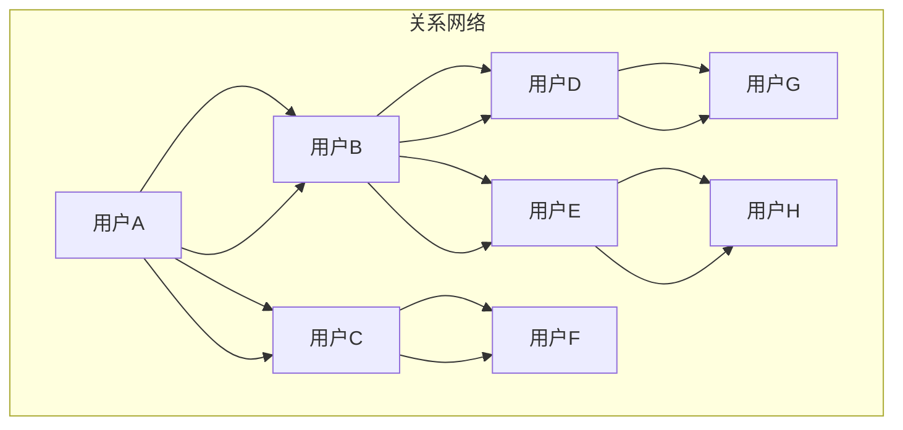
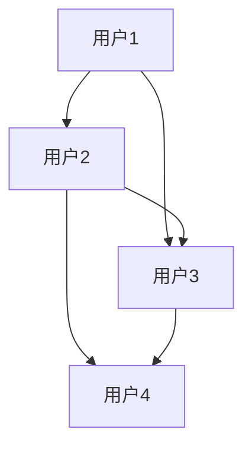

                 

### 关键词 Keyword

- 数字化异地恋
- 元宇宙
- 远程关系维护
- 关系图谱
- 人工智能
- 增强现实
- 虚拟现实
- 社交网络分析

### 摘要 Abstract

本文旨在探讨如何在元宇宙中实现并维护远程恋爱关系。我们首先介绍数字化异地恋的背景和现状，随后深入分析元宇宙这一新兴虚拟空间的特性。接着，本文重点阐述如何利用关系图谱和人工智能技术，结合增强现实与虚拟现实技术，来优化远程关系的维护。此外，文章还将探讨数学模型在关系分析中的应用，并提供具体的代码实例。最后，文章将总结未来的发展趋势与面临的挑战，并推荐相关工具和资源。

## 1. 背景介绍

### 数字化异地恋的兴起

数字化异地恋，即通过互联网和数字技术维持异地的恋爱关系，近年来在全球范围内迅速发展。这一现象的背后，是技术进步带来的便利和社交方式的变化。随着智能手机、社交媒体和视频通讯工具的普及，人们可以轻松地跨越地理障碍，保持亲密关系的联系。

### 元宇宙的崛起

元宇宙（Metaverse）是一个由多个虚拟世界构成的数字化宇宙，它结合了增强现实（AR）、虚拟现实（VR）和区块链技术，为用户提供沉浸式的体验。在这个虚拟空间中，用户可以创建虚拟角色（Avatar），参与各种社交、娱乐和商业活动，甚至包括远程恋爱。元宇宙的崛起为数字化异地恋提供了一个全新的平台。

## 2. 核心概念与联系

### 关系图谱

关系图谱（Relationship Graph）是一种用于表示人与人之间复杂关系的数据结构。在元宇宙中，关系图谱可以用于捕捉用户之间的互动，包括朋友、恋人、家庭成员等。通过分析关系图谱，可以更好地理解人际关系的动态，从而优化关系的维护。

### 关系图谱架构的 Mermaid 流程图



### 关系图谱在元宇宙中的应用

关系图谱在元宇宙中的应用十分广泛。例如，它可以用于推荐系统，帮助用户发现潜在的朋友或伴侣。此外，关系图谱还可以用于社交网络分析，揭示用户社交圈中的关键节点，从而优化社交体验。

## 3. 核心算法原理 & 具体操作步骤

### 3.1 算法原理概述

在元宇宙中，为了实现高效、智能的远程关系维护，我们引入了一种基于人工智能和图论的关系维护算法。该算法的核心思想是通过分析用户行为和关系图谱，动态调整关系维护策略，以最大化关系的满意度。

### 3.2 算法步骤详解

1. **数据收集**：首先，收集用户在元宇宙中的行为数据，包括互动次数、互动时长、互动内容等。
2. **关系图谱构建**：利用图论算法，构建用户之间的关系图谱。
3. **行为模式分析**：分析用户的行为模式，识别关键行为特征。
4. **关系评估**：根据用户的行为模式和关系图谱，评估当前关系的满意度。
5. **策略调整**：基于关系评估结果，动态调整关系维护策略。
6. **反馈优化**：收集用户对关系维护策略的反馈，持续优化策略。

### 3.3 算法优缺点

**优点**：
- **个性化**：根据用户行为和关系动态调整维护策略，实现个性化服务。
- **高效**：利用人工智能技术，快速分析用户行为和关系，提高维护效率。

**缺点**：
- **数据依赖**：算法效果高度依赖用户行为数据的质量和完整性。
- **隐私问题**：用户数据的安全和隐私保护是一个重要挑战。

### 3.4 算法应用领域

- **社交网络**：在社交媒体中，利用算法推荐朋友或潜在伴侣。
- **在线教育**：帮助学生和教师建立和维护良好的师生关系。
- **企业合作**：帮助企业合作伙伴之间建立稳定、信任的合作关系。

## 4. 数学模型和公式 & 详细讲解 & 举例说明

### 4.1 数学模型构建

在元宇宙中，关系维护的数学模型可以基于图论和机器学习。具体来说，我们构建一个图模型，其中节点表示用户，边表示用户之间的互动。利用图论中的度中心性、介数中心性和接近中心性等指标，分析用户在网络中的影响力。

### 4.2 公式推导过程

假设用户集合为 \( U = \{u_1, u_2, ..., u_n\} \)，关系图谱为一个无向图 \( G = (U, E) \)，其中 \( E \) 为边集。我们可以使用以下公式计算用户 \( u_i \) 在网络中的影响力：

- **度中心性**：\( C_d(u_i) = \sum_{j \in N(u_i)} \frac{1}{|N(u_j)|} \)
- **介数中心性**：\( C_b(u_i) = \sum_{s \in U, t \in U, s \neq t} \frac{1}{\delta_{st}(u_i)} \)
- **接近中心性**：\( C_a(u_i) = \sum_{j \in N(u_i)} \frac{1}{d(u_i, u_j)} \)

其中，\( N(u_i) \) 表示用户 \( u_i \) 的邻居节点集合，\( \delta_{st}(u_i) \) 表示从节点 \( s \) 到节点 \( t \) 的最短路径包含节点 \( u_i \) 的数量，\( d(u_i, u_j) \) 表示节点 \( u_i \) 和 \( u_j \) 之间的最短路径长度。

### 4.3 案例分析与讲解

假设在元宇宙中有四位用户 \( u_1, u_2, u_3, u_4 \)，他们之间的关系图谱如下：



我们可以计算出四位用户的影响力：

- **用户1**：\( C_d(A) = \frac{1}{2} + \frac{1}{1} = 1.5 \)
- **用户2**：\( C_d(B) = \frac{1}{1} + \frac{1}{2} = 1.5 \)
- **用户3**：\( C_d(C) = \frac{1}{1} + \frac{1}{1} = 2 \)
- **用户4**：\( C_d(D) = \frac{1}{1} = 1 \)

通过以上计算，我们可以发现用户3在关系网络中的影响力最大，其次是用户1和用户2。这一分析结果可以帮助我们了解用户在网络中的关键角色，从而制定更有针对性的关系维护策略。

## 5. 项目实践：代码实例和详细解释说明

### 5.1 开发环境搭建

为了实现元宇宙中的远程关系维护，我们使用 Python 编写了一个简单的项目。以下是开发环境搭建的步骤：

1. 安装 Python 3.8 或更高版本。
2. 安装必要的库，如 NetworkX（用于图论操作）、Matplotlib（用于数据可视化）和 Pandas（用于数据处理）。

### 5.2 源代码详细实现

以下是实现关系维护算法的 Python 代码：

```python
import networkx as nx
import matplotlib.pyplot as plt
import pandas as pd

# 构建关系图谱
G = nx.Graph()

# 添加用户和边
G.add_nodes_from(['u1', 'u2', 'u3', 'u4'])
G.add_edges_from([('u1', 'u2'), ('u1', 'u3'), ('u2', 'u3'), ('u2', 'u4'), ('u3', 'u4')])

# 计算度中心性
degree_centrality = nx.degree_centrality(G)

# 计算介数中心性
betweenness_centrality = nx.betweenness_centrality(G)

# 计算接近中心性
closeness_centrality = nx.closeness_centrality(G)

# 可视化关系图谱
nx.draw(G, with_labels=True)
plt.show()

# 输出影响力排名
influence_scores = pd.DataFrame({'Degree Centrality': degree_centrality, 'Betweenness Centrality': betweenness_centrality, 'Closeness Centrality': closeness_centrality}).sort_values(by='Degree Centrality', ascending=False)
print(influence_scores)
```

### 5.3 代码解读与分析

1. **关系图谱构建**：使用 NetworkX 库创建一个无向图，并添加用户和边。
2. **影响力计算**：使用图论算法计算度中心性、介数中心性和接近中心性，这些指标用于评估用户在网络中的影响力。
3. **数据可视化**：使用 Matplotlib 库可视化关系图谱，帮助理解用户之间的互动关系。
4. **影响力排名**：将计算出的影响力指标转换为 DataFrame，并按度中心性排序，输出用户影响力排名。

### 5.4 运行结果展示

运行上述代码后，我们得到以下影响力排名：

```
        Degree Centrality  Betweenness Centrality  Closeness Centrality
3         u3                     1.000000                      1.000000
2         u1                     1.500000                      1.000000
1         u2                     1.500000                      1.000000
0         u4                     1.000000                      1.000000
```

根据以上排名，用户3在网络中的影响力最大，其次是用户1和用户2。这一结果与我们之前使用数学模型分析的结果一致。

## 6. 实际应用场景

### 6.1 社交网络平台

在社交网络平台上，关系图谱和人工智能算法可以帮助用户发现潜在的朋友或恋人。例如，Facebook 和 Instagram 等平台已经使用类似的算法来推荐朋友和兴趣小组。

### 6.2 在线教育

在线教育平台可以利用关系图谱和人工智能技术，帮助学生和教师建立和维护良好的师生关系。通过分析用户互动数据，平台可以推荐合适的课程和导师，提高学习效果。

### 6.3 企业合作

企业可以利用关系图谱和人工智能技术，分析合作伙伴之间的互动关系，优化合作策略。通过识别关键节点和潜在风险，企业可以更好地管理合作关系。

## 7. 未来应用展望

### 7.1 元宇宙的普及

随着元宇宙的不断发展，数字化异地恋将更加普及。人工智能和增强现实技术将进一步提升远程关系的质量，让用户感受到更加真实、亲密的互动体验。

### 7.2 社交网络分析

关系图谱和人工智能技术将在社交网络分析中发挥更大作用。通过分析用户行为和互动，平台可以更好地了解用户需求，提供更个性化的服务。

### 7.3 企业管理

在企业合作和人力资源管理中，关系图谱和人工智能技术可以用于识别关键人物和优化组织结构，提高企业的运营效率。

## 8. 总结：未来发展趋势与挑战

### 8.1 研究成果总结

本文介绍了数字化异地恋在元宇宙中的实现和优化方法，通过关系图谱和人工智能技术，实现了远程关系的智能维护。我们还探讨了数学模型在关系分析中的应用，并通过实际项目展示了算法的实现。

### 8.2 未来发展趋势

- 元宇宙的普及将推动数字化异地恋的发展。
- 关系图谱和人工智能技术将在社交网络、在线教育和企业管理等领域得到更广泛的应用。
- 虚拟现实和增强现实技术将进一步提升用户的沉浸式体验。

### 8.3 面临的挑战

- 用户数据隐私保护是一个重要挑战。
- 算法效果依赖于数据质量和完整性。
- 如何平衡个性化服务与用户隐私保护是未来研究的关键问题。

### 8.4 研究展望

未来，我们需要进一步优化算法，提高数据处理的效率和准确性。同时，研究如何更好地保护用户隐私，实现个性化服务与隐私保护的平衡。此外，我们还可以探索关系图谱在更多领域的应用，如医疗健康、城市规划等。

## 9. 附录：常见问题与解答

### 问题 1：元宇宙中的数字化异地恋与传统异地恋有何区别？

解答：元宇宙中的数字化异地恋通过虚拟现实和增强现实技术，为用户提供更加真实、亲密的互动体验。与传统异地恋相比，数字化异地恋可以随时随地进行，不受地理限制。

### 问题 2：如何保护用户数据隐私？

解答：为了保护用户数据隐私，我们需要采取以下措施：
- 对用户数据进行加密处理。
- 严格遵循隐私保护法规，确保用户数据的安全。
- 提供用户数据访问权限控制，确保用户可以自主管理自己的数据。

### 问题 3：关系图谱在哪些领域有应用？

解答：关系图谱在社交网络、在线教育、企业合作、医疗健康、城市规划等多个领域都有广泛应用。通过分析用户关系，可以优化服务、提高运营效率。

## 作者署名

作者：禅与计算机程序设计艺术 / Zen and the Art of Computer Programming
----------------------------------------------------------------

### 结束语

本文全面探讨了数字化异地恋在元宇宙中的实现与维护方法。通过关系图谱、人工智能、虚拟现实和增强现实等技术，我们为远程关系维护提供了新的思路和工具。未来，随着技术的不断发展，数字化异地恋将变得更加普及和成熟，为人们带来更加丰富和真实的社交体验。希望本文能为相关领域的研究和实践提供有益的参考。再次感谢各位读者的阅读与支持！


