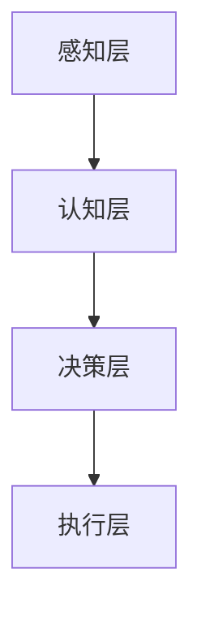

                 

关键词：数字化思维，全球脑时代，人工智能，技术趋势，生存技能

> 摘要：本文将探讨在数字化时代，如何培养和运用数字化思维，以适应全球脑时代的需求。通过深入分析数字化思维的核心概念和原理，介绍其在人工智能、技术趋势、生存技能等方面的应用，旨在为读者提供一套实用的数字化生存指南。

## 1. 背景介绍

随着互联网、大数据、云计算、物联网等技术的迅猛发展，人类社会正进入一个全新的时代——全球脑时代。在这个时代，信息传递的速度和广度达到了前所未有的高度，人们的生活方式、工作模式和学习方式都发生了深刻变革。数字化思维作为一种应对时代变化的思维方式，成为了全球脑时代不可或缺的生存技能。

数字化思维，是指在面对复杂问题时，能够运用数字化工具和算法，从海量数据中提取有价值的信息，进而做出科学决策的思维方式。它不仅要求个体具备良好的数学和计算机科学素养，更需要具备创新精神和批判性思维。

## 2. 核心概念与联系

### 2.1 数字化思维的核心概念

数字化思维的核心概念包括数据思维、算法思维和系统思维。数据思维强调对数据的敏感性和洞察力，能够从海量数据中发现有价值的信息。算法思维则关注如何运用算法解决实际问题，提高效率和精度。系统思维则是从整体上看待问题，寻求最优解决方案。

### 2.2 数字化思维的架构

数字化思维的架构可以分为四个层次：感知层、认知层、决策层和执行层。感知层是数据收集和输入的环节，认知层是数据处理和分析的环节，决策层是做出决策和规划的环节，执行层是执行决策和实现目标的环节。

### 2.3 数字化思维的Mermaid流程图



## 3. 核心算法原理 & 具体操作步骤

### 3.1 算法原理概述

数字化思维的核心算法包括数据挖掘、机器学习和深度学习。数据挖掘是从海量数据中提取有价值信息的过程，机器学习是通过训练模型实现数据预测和分类的过程，深度学习则是通过多层神经网络实现更加复杂的数据处理。

### 3.2 算法步骤详解

1. 数据预处理：清洗、归一化和编码数据，使其符合模型训练的要求。
2. 模型选择：根据问题特点选择合适的模型，如决策树、支持向量机、神经网络等。
3. 模型训练：使用训练数据集对模型进行训练，调整模型参数。
4. 模型评估：使用测试数据集对模型进行评估，判断模型性能。
5. 模型部署：将训练好的模型部署到实际应用场景中。

### 3.3 算法优缺点

数据挖掘和机器学习的优点在于能够处理大规模数据，提高决策效率；缺点在于对数据质量和特征工程要求较高。深度学习在处理复杂数据和任务时具有显著优势，但训练过程复杂、计算资源消耗大。

### 3.4 算法应用领域

数字化思维算法广泛应用于金融、医疗、零售、制造等领域，如风险控制、疾病预测、个性化推荐、智能制造等。

## 4. 数学模型和公式 & 详细讲解 & 举例说明

### 4.1 数学模型构建

数字化思维涉及多种数学模型，如线性回归、逻辑回归、支持向量机、神经网络等。这些模型通常基于概率论、线性代数、微积分等数学知识。

### 4.2 公式推导过程

以线性回归为例，假设我们要预测房价，自变量为面积、位置等因素。线性回归模型可以表示为：

$$y = \beta_0 + \beta_1 x_1 + \beta_2 x_2 + ... + \beta_n x_n$$

其中，$y$ 为因变量（房价），$x_1, x_2, ..., x_n$ 为自变量（特征），$\beta_0, \beta_1, ..., \beta_n$ 为模型参数。

### 4.3 案例分析与讲解

以股票价格预测为例，我们可以使用时间序列模型进行预测。假设我们使用移动平均模型，公式如下：

$$\hat{y}_t = \frac{1}{n} \sum_{i=1}^{n} y_{t-i}$$

其中，$\hat{y}_t$ 为预测的下一期股票价格，$y_{t-i}$ 为第 $t-i$ 期的股票价格，$n$ 为移动平均的期数。

## 5. 项目实践：代码实例和详细解释说明

### 5.1 开发环境搭建

本文使用 Python 编写代码，需要安装以下库：NumPy、Pandas、Scikit-learn、Matplotlib。

### 5.2 源代码详细实现

```python
import numpy as np
import pandas as pd
from sklearn.linear_model import LinearRegression
from sklearn.metrics import mean_squared_error
import matplotlib.pyplot as plt

# 数据预处理
data = pd.read_csv('house_price.csv')
X = data[['area', 'location']]
y = data['price']

# 模型训练
model = LinearRegression()
model.fit(X, y)

# 模型评估
y_pred = model.predict(X)
mse = mean_squared_error(y, y_pred)
print('Mean Squared Error:', mse)

# 画图展示
plt.scatter(X['area'], y, color='red', label='Actual')
plt.plot(X['area'], y_pred, color='blue', label='Predicted')
plt.xlabel('Area')
plt.ylabel('Price')
plt.legend()
plt.show()
```

### 5.3 代码解读与分析

上述代码首先导入所需的库，然后读取数据并进行预处理。接下来使用线性回归模型进行训练，评估模型性能并画出实际价格与预测价格的对比图。

## 6. 实际应用场景

### 6.1 金融领域

在金融领域，数字化思维可以帮助金融机构进行风险管理、投资组合优化、客户需求分析等。例如，通过大数据分析，银行可以精准预测贷款客户的违约风险，从而降低坏账率。

### 6.2 医疗领域

在医疗领域，数字化思维可以应用于疾病预测、个性化治疗、健康管理等。例如，通过分析患者的电子健康记录，医生可以更准确地预测疾病发展趋势，为患者制定个性化的治疗方案。

### 6.3 零售领域

在零售领域，数字化思维可以帮助商家进行需求预测、库存管理、营销策略制定等。例如，通过大数据分析，零售商可以了解消费者的购物偏好，从而优化库存配置，提高销售额。

## 7. 工具和资源推荐

### 7.1 学习资源推荐

- 《Python编程：从入门到实践》
- 《机器学习实战》
- 《深度学习》

### 7.2 开发工具推荐

- Jupyter Notebook
- PyCharm
- TensorFlow

### 7.3 相关论文推荐

- “Deep Learning for Natural Language Processing”
- “Recurrent Neural Networks for Language Modeling”
- “Big Data: A Revolution That Will Transform How We Live, Work, and Think”

## 8. 总结：未来发展趋势与挑战

### 8.1 研究成果总结

数字化思维在人工智能、大数据、云计算等领域取得了显著成果，为各行各业的发展提供了有力支持。

### 8.2 未来发展趋势

随着技术的不断进步，数字化思维将在更多领域得到应用，如智能制造、智慧城市、生物技术等。

### 8.3 面临的挑战

数字化思维的发展面临数据隐私、算法透明度、伦理道德等方面的挑战，需要全社会共同努力解决。

### 8.4 研究展望

未来，数字化思维将朝着更加智能化、自动化、人机协同的方向发展，为人类社会的进步做出更大贡献。

## 9. 附录：常见问题与解答

### 9.1 什么是数字化思维？

数字化思维是指运用数字化工具和算法，从海量数据中提取有价值的信息，并做出科学决策的思维方式。

### 9.2 数字化思维在哪些领域有应用？

数字化思维广泛应用于金融、医疗、零售、制造、教育等领域，如风险管理、疾病预测、个性化推荐、智能制造等。

### 9.3 如何培养数字化思维？

培养数字化思维需要掌握数学和计算机科学知识，具备创新精神和批判性思维，并不断学习和实践。

## 参考文献

- 吴恩达，《深度学习》
- Goodfellow, I., Bengio, Y., & Courville, A. (2016). *Deep Learning*. MIT Press.
- Murphy, K. P. (2012). *Machine Learning: A Probabilistic Perspective*. MIT Press.
- Russell, S., & Norvig, P. (2016). *Artificial Intelligence: A Modern Approach*. Prentice Hall.

作者：禅与计算机程序设计艺术 / Zen and the Art of Computer Programming
----------------------------------------------------------------

