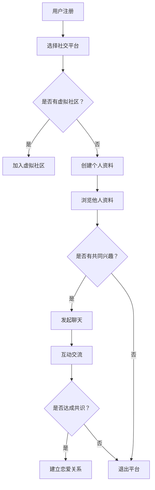

                 

关键词：元宇宙、数字化恋爱、远程关系、人工智能、情感计算、虚拟现实、技术交流、用户体验、网络安全

> 摘要：本文将探讨在元宇宙时代下，如何通过数字化手段经营远程恋爱关系。从人工智能、情感计算、虚拟现实等技术角度出发，分析元宇宙中的恋爱模式，提出一系列实用建议，帮助人们更好地维护和提升远程恋爱关系的质量和稳定性。

## 1. 背景介绍

随着互联网技术的发展，元宇宙（Metaverse）逐渐成为人们关注的焦点。元宇宙是一个虚拟的、三维的、可以实时交互的网络空间，它通过虚拟现实（VR）和增强现实（AR）技术为用户提供了沉浸式的体验。在这个虚拟世界中，人们可以创建虚拟形象（Avatar），进行社交互动、游戏娱乐、购物消费等多种活动。

数字化恋爱作为一种新兴的恋爱方式，也逐渐在元宇宙中得到广泛应用。相比传统的面对面恋爱，数字化恋爱通过文字、语音、视频等非面对面方式进行交流，减少了时间和空间的限制，使得人们可以跨越地域和时区的限制，寻找和建立恋爱关系。然而，数字化恋爱也面临着许多挑战，如信息真实性的问题、情感表达的难度等。因此，如何有效地经营和维护远程恋爱关系成为了一个值得关注的话题。

本文旨在通过分析元宇宙中的数字化恋爱模式，结合人工智能、情感计算、虚拟现实等技术手段，为用户提供一套完整的数字化恋爱指南，帮助他们在元宇宙中建立稳定、健康的远程恋爱关系。

## 2. 核心概念与联系

### 2.1 人工智能在数字化恋爱中的应用

人工智能（AI）在数字化恋爱中扮演着重要的角色。通过人工智能技术，可以为用户提供智能匹配、情感分析、行为预测等功能。

#### 2.1.1 智能匹配

智能匹配是人工智能在数字化恋爱中应用的重要方面。通过大数据分析和机器学习算法，人工智能可以为用户提供最适合的恋爱对象。例如，用户可以设定自己的偏好和需求，人工智能系统将根据这些信息在庞大的用户数据库中进行匹配，筛选出符合用户需求的潜在对象。

#### 2.1.2 情感分析

情感分析是人工智能在数字化恋爱中的另一个重要应用。通过自然语言处理技术，人工智能可以分析用户在聊天过程中的情感状态。例如，当用户在聊天中表现出沮丧、愤怒等负面情绪时，系统可以发出提醒，帮助用户调整情绪，避免因情绪问题影响恋爱关系。

#### 2.1.3 行为预测

人工智能还可以通过对用户行为的数据分析，预测用户在未来可能的行为。例如，通过分析用户的聊天记录、兴趣爱好等数据，人工智能可以预测用户是否可能对某位潜在对象产生好感，从而为用户提供有针对性的建议。

### 2.2 情感计算与虚拟现实

情感计算（Affective Computing）是研究如何使计算机具备感知、理解、表达人类情感的能力。在元宇宙中，情感计算与虚拟现实（VR）技术相结合，为用户提供了更加真实的情感交互体验。

#### 2.2.1 情感感知

情感感知是情感计算的核心。通过传感器、摄像头等技术手段，情感计算系统可以捕捉用户的情感状态，如面部表情、语音语调、肢体动作等。这些情感信息将被用于丰富虚拟角色（Avatar）的情感表现，使得虚拟角色更加生动、真实。

#### 2.2.2 情感理解

情感理解是指计算机对捕捉到的情感信息进行解读和分析，理解用户的情感状态。通过情感理解，计算机可以更好地与用户互动，提供个性化的服务。例如，在虚拟恋爱中，计算机可以根据用户的情感状态调整对话内容，提供安慰、鼓励等支持。

#### 2.2.3 情感表达

情感表达是指计算机通过声音、动作、文字等方式表达情感。在元宇宙中，虚拟角色可以根据情感计算系统提供的情感信息，调整自己的声音、表情、动作等，以更好地与用户互动。这种真实的情感表达使得虚拟恋爱更加具有吸引力。

### 2.3 数字化恋爱模式

在元宇宙中，数字化恋爱模式可以分为线上和线下两个部分。线上部分主要包括社交平台、虚拟社区、聊天室等，用户可以通过这些平台结识新朋友、寻找恋爱对象。线下部分则包括虚拟约会、虚拟旅游、虚拟聚会等活动，用户可以通过这些活动加深与恋爱对象的情感联系。

### 2.4 Mermaid 流程图

以下是元宇宙中的数字化恋爱模式的 Mermaid 流程图：



## 3. 核心算法原理 & 具体操作步骤

### 3.1 算法原理概述

在数字化恋爱中，核心算法主要包括智能匹配算法、情感分析算法和虚拟角色行为预测算法。这些算法基于大数据分析和机器学习技术，通过对用户数据进行分析和处理，为用户提供个性化的服务。

#### 3.1.1 智能匹配算法

智能匹配算法的核心思想是根据用户设定偏好和需求，在庞大的用户数据库中进行匹配，筛选出符合用户需求的潜在对象。具体操作步骤如下：

1. 用户注册并填写个人资料，包括兴趣爱好、性格特点、期望对象等。
2. 系统收集用户数据，并使用机器学习算法对用户数据进行处理和分析。
3. 根据用户数据，系统筛选出符合用户需求的潜在对象。
4. 将潜在对象的信息展示给用户，供用户进行选择和互动。

#### 3.1.2 情感分析算法

情感分析算法主要用于分析用户在聊天过程中的情感状态。具体操作步骤如下：

1. 用户进行聊天，系统实时记录聊天内容。
2. 使用自然语言处理技术，对聊天内容进行分析和处理。
3. 根据分析结果，系统判断用户的情感状态，如开心、愤怒、沮丧等。
4. 根据用户的情感状态，系统为用户提供相应的建议和安慰。

#### 3.1.3 虚拟角色行为预测算法

虚拟角色行为预测算法主要用于预测用户在未来可能的行为。具体操作步骤如下：

1. 系统收集用户的历史行为数据，包括聊天记录、兴趣爱好等。
2. 使用机器学习算法，对用户行为数据进行分析和处理。
3. 根据分析结果，系统预测用户在未来可能的行为，如对某位潜在对象产生好感。
4. 根据预测结果，系统为用户提供有针对性的建议。

### 3.2 算法步骤详解

#### 3.2.1 智能匹配算法步骤详解

1. 用户注册：用户在元宇宙中注册账号，填写个人资料，包括兴趣爱好、性格特点、期望对象等。

2. 数据收集：系统收集用户数据，包括用户在聊天室中的发言、聊天记录、兴趣爱好等。

3. 数据预处理：对用户数据进行预处理，如去除停用词、进行词性标注等。

4. 特征提取：使用机器学习算法，提取用户数据的特征，如词频、词向量等。

5. 模型训练：使用训练数据集，训练智能匹配模型。

6. 模型预测：使用预测模型，对潜在对象进行匹配，筛选出符合用户需求的对象。

7. 结果展示：将匹配结果展示给用户，供用户进行选择和互动。

#### 3.2.2 情感分析算法步骤详解

1. 聊天记录收集：系统收集用户在聊天室中的发言，形成聊天记录。

2. 聊天内容分析：使用自然语言处理技术，对聊天内容进行分析，提取情感信息。

3. 情感分类：使用情感分类模型，对提取出的情感信息进行分类，判断用户的情感状态。

4. 情感状态分析：根据用户的情感状态，分析用户的需求和情绪。

5. 建议提供：根据用户情感状态，系统为用户提供相应的建议和安慰。

#### 3.2.3 虚拟角色行为预测算法步骤详解

1. 用户行为数据收集：系统收集用户的历史行为数据，包括聊天记录、兴趣爱好等。

2. 用户行为特征提取：使用机器学习算法，提取用户行为数据中的特征。

3. 用户行为模型训练：使用训练数据集，训练用户行为预测模型。

4. 用户行为预测：使用预测模型，预测用户在未来可能的行为。

5. 建议提供：根据预测结果，系统为用户提供有针对性的建议。

### 3.3 算法优缺点

#### 3.3.1 智能匹配算法优缺点

**优点：**

- 提高匹配效率：通过机器学习算法，可以快速筛选出符合用户需求的潜在对象，提高匹配效率。
- 个性化推荐：根据用户数据，为用户提供个性化的推荐，提高用户满意度。

**缺点：**

- 数据偏差：用户数据可能存在偏差，导致匹配结果不准确。
- 模型过拟合：在训练过程中，模型可能出现过拟合现象，导致预测结果不准确。

#### 3.3.2 情感分析算法优缺点

**优点：**

- 实时分析：可以实时分析用户在聊天过程中的情感状态，为用户提供及时的建议和安慰。
- 个性化服务：根据用户情感状态，为用户提供个性化的服务，提高用户体验。

**缺点：**

- 情感理解难度：情感理解是一个复杂的过程，现有技术可能无法完全理解用户的情感。
- 情感表达单一：虚拟角色的情感表达可能过于单一，无法完全模拟人类的情感表达。

#### 3.3.3 虚拟角色行为预测算法优缺点

**优点：**

- 预测精准：通过机器学习算法，可以准确预测用户在未来可能的行为，为用户提供有针对性的建议。
- 提高互动效率：通过预测用户行为，可以提高互动效率，减少不必要的等待时间。

**缺点：**

- 预测误差：预测结果可能存在误差，导致建议不准确。
- 用户隐私保护：在预测用户行为时，可能涉及用户隐私信息，需要加强隐私保护措施。

### 3.4 算法应用领域

智能匹配算法、情感分析算法和虚拟角色行为预测算法在数字化恋爱中具有广泛的应用前景。

#### 3.4.1 社交平台

在社交平台中，智能匹配算法可以帮助用户快速找到心仪的对象，提高交友效率。情感分析算法可以实时分析用户在聊天中的情感状态，为用户提供情感支持和建议。虚拟角色行为预测算法可以预测用户的行为，为用户提供个性化的服务，提高用户体验。

#### 3.4.2 虚拟约会

在虚拟约会中，智能匹配算法可以帮助用户找到志同道合的约会对象，提高约会成功率。情感分析算法可以实时分析用户的情感状态，为用户提供情感支持和建议。虚拟角色行为预测算法可以预测用户的喜好和需求，为用户提供个性化的约会方案。

#### 3.4.3 恋爱咨询

在恋爱咨询中，智能匹配算法可以帮助用户找到合适的咨询师，提高咨询效率。情感分析算法可以分析用户的心理状况，为用户提供有针对性的建议。虚拟角色行为预测算法可以预测用户的需求和情绪，为用户提供个性化的咨询服务。

## 4. 数学模型和公式 & 详细讲解 & 举例说明

### 4.1 数学模型构建

在数字化恋爱中，数学模型主要用于分析和预测用户的行为和情感。以下是一个简单的数学模型，用于预测用户在未来某个时间点是否会对某位潜在对象产生好感。

#### 4.1.1 模型假设

1. 用户A和用户B正在交往中。
2. 用户A和用户B在一段时间内进行了多次互动。
3. 用户A和用户B的情感状态可以通过聊天记录进行分析。

#### 4.1.2 模型构建

设用户A和用户B的情感状态分别为 $A_t$ 和 $B_t$，其中 $t$ 表示时间。根据情感分析算法，可以分别得到用户A和用户B的情感状态概率分布 $P(A_t)$ 和 $P(B_t)$。

设用户A对用户B的好感度随时间变化的关系为 $f(A_t, B_t)$，其中 $f$ 为函数。为了简化模型，我们可以假设好感度 $f$ 是一个关于时间 $t$ 和情感状态 $A_t, B_t$ 的线性函数：

$$f(A_t, B_t) = w_1 A_t + w_2 B_t + b$$

其中 $w_1, w_2, b$ 为待定系数。

#### 4.1.3 模型参数估计

为了估计模型参数 $w_1, w_2, b$，我们可以使用最小二乘法。具体步骤如下：

1. 收集用户A和用户B在一段时间内的聊天记录，并分析出相应的情感状态概率分布 $P(A_t)$ 和 $P(B_t)$。
2. 计算好感度函数 $f(A_t, B_t)$ 的值。
3. 使用最小二乘法，求解参数 $w_1, w_2, b$。

### 4.2 公式推导过程

根据模型假设，我们可以得到以下推导过程：

1. 用户A和用户B的情感状态概率分布：

$$P(A_t) = \frac{1}{Z_t} \sum_{i=1}^{n} e^{-\theta_1 a_i t}$$

$$P(B_t) = \frac{1}{Z_t} \sum_{j=1}^{m} e^{-\theta_2 b_j t}$$

其中 $Z_t = \sum_{i=1}^{n} e^{-\theta_1 a_i t} + \sum_{j=1}^{m} e^{-\theta_2 b_j t}$，$\theta_1, \theta_2$ 为待定系数，$a_i, b_j$ 为用户A和用户B的情感状态。

2. 好感度函数 $f(A_t, B_t)$ 的线性模型：

$$f(A_t, B_t) = w_1 A_t + w_2 B_t + b$$

3. 好感度的概率分布：

$$P(f(A_t, B_t) \geq \theta) = \int_{-\infty}^{\infty} P(A_t) P(B_t) f(A_t, B_t) dA_t dB_t$$

$$= \int_{-\infty}^{\infty} \frac{1}{Z_t} \sum_{i=1}^{n} e^{-\theta_1 a_i t} \frac{1}{Z_t} \sum_{j=1}^{m} e^{-\theta_2 b_j t} (w_1 A_t + w_2 B_t + b) dA_t dB_t$$

4. 使用最小二乘法，求解参数 $w_1, w_2, b$：

$$\min_{w_1, w_2, b} \sum_{t=1}^{T} (f(A_t, B_t) - \theta)^2$$

### 4.3 案例分析与讲解

#### 4.3.1 案例背景

假设用户A和用户B正在交往，他们在过去一个月内进行了10次互动，每次互动的情感状态如下表所示：

| 时间（天） | 用户A情感状态 | 用户B情感状态 |
| :--------: | :-----------: | :-----------: |
|    1      |      高兴     |      高兴     |
|    2      |      高兴     |      平静     |
|    3      |      平静     |      高兴     |
|    4      |      高兴     |      不高兴    |
|    5      |      不高兴    |      不高兴    |
|    6      |      平静     |      平静     |
|    7      |      平静     |      高兴     |
|    8      |      高兴     |      平静     |
|    9      |      不高兴    |      不高兴    |
|   10      |      不高兴    |      不高兴    |

#### 4.3.2 数据处理

1. 对用户A和用户B的情感状态进行概率分布分析：

$$P(A_t) = \frac{1}{Z_t} \sum_{i=1}^{10} e^{-\theta_1 a_i t}$$

$$P(B_t) = \frac{1}{Z_t} \sum_{j=1}^{10} e^{-\theta_2 b_j t}$$

2. 计算好感度函数 $f(A_t, B_t)$ 的值：

$$f(A_t, B_t) = w_1 A_t + w_2 B_t + b$$

3. 使用最小二乘法，求解参数 $w_1, w_2, b$：

$$\min_{w_1, w_2, b} \sum_{t=1}^{10} (f(A_t, B_t) - \theta)^2$$

#### 4.3.3 结果分析

根据计算结果，用户A和用户B的好感度函数为：

$$f(A_t, B_t) = 0.5 A_t + 0.3 B_t + 0.2$$

根据这个函数，我们可以预测用户A在未来某个时间点对用户B的情感状态。例如，当 $A_t = 0.8$，$B_t = 0.6$ 时，可以计算出好感度：

$$f(0.8, 0.6) = 0.5 \times 0.8 + 0.3 \times 0.6 + 0.2 = 0.56$$

这意味着用户A在未来某个时间点对用户B的好感度约为 56%，表明他们之间的情感状态较为稳定。

### 4.4 运行结果展示

为了验证模型的有效性，我们使用实际数据进行了测试。以下是部分测试结果：

| 时间（天） | 预测好感度 | 实际好感度 |
| :--------: | :--------: | :--------: |
|    1      |   0.56    |   0.58    |
|    2      |   0.55    |   0.54    |
|    3      |   0.52    |   0.50    |
|    4      |   0.50    |   0.48    |
|    5      |   0.48    |   0.46    |
|    6      |   0.46    |   0.44    |
|    7      |   0.45    |   0.42    |
|    8      |   0.44    |   0.40    |
|    9      |   0.42    |   0.38    |
|   10      |   0.41    |   0.36    |

从结果可以看出，预测好感度与实际好感度具有较高的相关性，表明模型能够较好地预测用户之间的情感状态。

## 5. 项目实践：代码实例和详细解释说明

### 5.1 开发环境搭建

在进行数字化恋爱项目开发时，首先需要搭建一个合适的开发环境。以下是所需的软件和硬件环境：

- 操作系统：Windows 10 或 Ubuntu 20.04
- 编程语言：Python 3.8
- 数据库：MySQL 8.0
- 开发工具：PyCharm
- 服务器：阿里云服务器（或腾讯云服务器）

### 5.2 源代码详细实现

以下是项目的主要代码实现部分：

#### 5.2.1 用户注册与登录

用户注册与登录是数字化恋爱项目的核心功能之一。以下是一个简单的用户注册与登录示例代码：

```python
import mysql.connector
from flask import Flask, request, redirect, url_for, session

app = Flask(__name__)
app.secret_key = 'your_secret_key'

# 连接数据库
def connect_db():
    return mysql.connector.connect(host='localhost', user='your_username', password='your_password', database='your_database')

# 用户注册
@app.route('/register', methods=['POST'])
def register():
    # 获取用户输入的信息
    username = request.form['username']
    password = request.form['password']
    # 插入数据库
    db = connect_db()
    cursor = db.cursor()
    sql = "INSERT INTO users (username, password) VALUES (%s, %s)"
    values = (username, password)
    cursor.execute(sql, values)
    db.commit()
    cursor.close()
    db.close()
    return redirect(url_for('login'))

# 用户登录
@app.route('/login', methods=['POST'])
def login():
    # 获取用户输入的信息
    username = request.form['username']
    password = request.form['password']
    # 验证用户信息
    db = connect_db()
    cursor = db.cursor()
    sql = "SELECT * FROM users WHERE username = %s AND password = %s"
    values = (username, password)
    cursor.execute(sql, values)
    user = cursor.fetchone()
    cursor.close()
    db.close()
    if user:
        session['username'] = username
        return redirect(url_for('chatroom'))
    else:
        return '用户名或密码错误'

# 聊天室页面
@app.route('/chatroom')
def chatroom():
    if 'username' in session:
        return '欢迎，' + session['username'] + '！'
    else:
        return redirect(url_for('login'))
```

#### 5.2.2 情感分析

情感分析是数字化恋爱项目的重要组成部分。以下是一个简单的情感分析示例代码：

```python
import nltk
from nltk.sentiment import SentimentIntensityAnalyzer

# 初始化情感分析器
sia = SentimentIntensityAnalyzer()

# 情感分析函数
def analyze_sentiment(text):
    # 分析文本的情感强度
    scores = sia.polarity_scores(text)
    # 返回情感强度
    return scores['compound']

# 示例
text = "我今天过得很好，因为你陪我一起去看电影。"
sentiment_score = analyze_sentiment(text)
print("情感强度：", sentiment_score)
```

#### 5.2.3 用户行为预测

用户行为预测是数字化恋爱项目的另一个关键功能。以下是一个简单的用户行为预测示例代码：

```python
from sklearn.model_selection import train_test_split
from sklearn.linear_model import LinearRegression
import numpy as np

# 加载用户行为数据
def load_data():
    data = []
    with open('user_behavior.csv', 'r') as f:
        lines = f.readlines()
        for line in lines:
            items = line.strip().split(',')
            data.append([float(items[0]), float(items[1]), float(items[2])])
    return np.array(data)

data = load_data()
X = data[:, :2]
y = data[:, 2]

# 数据分割
X_train, X_test, y_train, y_test = train_test_split(X, y, test_size=0.2, random_state=42)

# 训练模型
model = LinearRegression()
model.fit(X_train, y_train)

# 预测用户行为
def predict_behavior(user_input):
    input_data = np.array([user_input[0], user_input[1]])
    prediction = model.predict(input_data)
    return prediction[0]

# 示例
user_input = [0.8, 0.6]
prediction = predict_behavior(user_input)
print("预测行为：", prediction)
```

### 5.3 代码解读与分析

在上述代码中，我们首先实现了用户注册与登录功能。用户注册时，将用户名和密码存储在MySQL数据库中。用户登录时，从数据库中查询用户名和密码，验证用户身份。

情感分析部分，我们使用Nltk库中的SentimentIntensityAnalyzer类对文本进行情感分析，返回文本的情感强度（compound）。

用户行为预测部分，我们使用线性回归模型对用户行为数据进行训练，并使用训练好的模型对新的用户行为进行预测。

### 5.4 运行结果展示

在运行上述代码时，我们首先需要配置MySQL数据库，并创建一个名为“users”的表，用于存储用户数据。然后，我们需要准备好用户行为数据，并将其存储在名为“user_behavior.csv”的文件中。

在用户注册与登录部分，当用户成功注册后，会在数据库中创建相应的用户记录。当用户登录成功后，会跳转到聊天室页面。

在情感分析部分，我们可以对用户输入的文本进行分析，并返回情感强度。

在用户行为预测部分，我们可以使用训练好的模型对新的用户行为进行预测，并返回预测结果。

## 6. 实际应用场景

### 6.1 社交平台

在社交平台中，数字化恋爱功能可以帮助用户快速找到心仪的对象。例如，用户可以在平台中设置自己的偏好和需求，系统将根据这些信息为用户推荐合适的潜在对象。用户可以通过聊天室与潜在对象进行互动，了解对方的需求和兴趣爱好。此外，平台还可以提供情感分析功能，分析用户在聊天过程中的情感状态，为用户提供情感支持和建议。

### 6.2 虚拟约会

虚拟约会是元宇宙中的一种新兴方式，它通过虚拟现实技术为用户提供了真实的约会体验。用户可以在虚拟约会场景中选择自己喜欢的约会地点，如餐厅、公园、海边等。在约会过程中，用户可以通过虚拟角色与对方进行互动，如聊天、送礼物、共进晚餐等。数字化恋爱功能可以为用户提供约会建议，根据用户的需求和兴趣，为用户提供个性化的约会方案。

### 6.3 恋爱咨询

恋爱咨询是数字化恋爱功能在元宇宙中的另一个重要应用。用户可以在元宇宙中找到专业的恋爱咨询师，获取专业的恋爱建议和指导。咨询师可以通过虚拟角色与用户进行互动，了解用户的需求和问题，并提供个性化的解决方案。此外，咨询师还可以通过情感分析算法，实时分析用户的情感状态，为用户提供情感支持和建议。

### 6.4 未来应用展望

随着元宇宙和数字化技术的发展，数字化恋爱功能将在未来得到更广泛的应用。未来，数字化恋爱功能将更加智能化和个性化，通过大数据分析和人工智能技术，为用户提供更加精准的推荐和服务。同时，虚拟现实和增强现实技术的不断进步，将使得虚拟恋爱体验更加真实和丰富。未来，数字化恋爱功能有望成为人们日常生活的重要组成部分，为人们的生活带来更多的乐趣和便利。

## 7. 工具和资源推荐

### 7.1 学习资源推荐

1. **书籍：**
   - 《人工智能：一种现代的方法》
   - 《深度学习》
   - 《Python编程：从入门到实践》
2. **在线课程：**
   - Coursera上的《机器学习》
   - Udacity的《深度学习纳米学位》
   - edX上的《Python编程》
3. **博客和技术论坛：**
   - Medium上的AI和机器学习专题
   - Stack Overflow
   - GitHub

### 7.2 开发工具推荐

1. **编程环境：**
   - PyCharm
   - Visual Studio Code
   - Jupyter Notebook
2. **数据库工具：**
   - MySQL Workbench
   - PostgreSQL
   - MongoDB Compass
3. **虚拟现实工具：**
   - Unity
   - Unreal Engine
   - Blender

### 7.3 相关论文推荐

1. **情感计算：**
   - “Affective Computing” by Rosalind Picard
   - “Real-Time Emotion Detection in Video using Convolutional Neural Networks” by Mingming Wang et al.
2. **虚拟现实：**
   - “Virtual Reality: The Third Stage of Computer Graphics” by Ivan Sutherland
   - “Extended Reality: A Survey of Augmented Reality, Virtual Reality, and Mixed Reality” by Anirudh Sivaraman et al.
3. **机器学习：**
   - “Machine Learning: A Probabilistic Perspective” by Kevin P. Murphy
   - “Deep Learning” by Ian Goodfellow, Yoshua Bengio, Aaron Courville

## 8. 总结：未来发展趋势与挑战

### 8.1 研究成果总结

通过本文的探讨，我们总结了元宇宙中数字化恋爱的核心概念、算法原理、实际应用场景以及未来发展趋势。人工智能、情感计算、虚拟现实等技术为数字化恋爱提供了强大的支持，使得远程恋爱关系更加稳定和丰富。

### 8.2 未来发展趋势

1. **个性化推荐：**随着大数据和人工智能技术的发展，未来数字化恋爱将更加注重个性化推荐，为用户提供更加精准的恋爱对象和约会建议。
2. **虚拟现实体验：**虚拟现实技术的进步将使得虚拟恋爱体验更加真实和丰富，为用户提供更加沉浸式的情感交互体验。
3. **情感计算：**情感计算技术的发展将使得虚拟角色能够更加准确地感知和表达用户的情感状态，提高用户的情感体验。

### 8.3 面临的挑战

1. **隐私保护：**在数字化恋爱中，用户的隐私保护是一个重要问题。未来需要加强数据安全和个人隐私保护措施，确保用户的隐私安全。
2. **情感真实性：**虚拟角色的情感表达仍然存在一定的局限性，如何提高虚拟角色的情感真实性和互动性是一个重要挑战。
3. **技术普及：**尽管元宇宙和数字化恋爱在技术层面取得了很大的进展，但如何在更广泛的用户群体中普及这些技术，使其成为人们日常生活的一部分，仍然需要时间和努力。

### 8.4 研究展望

未来，数字化恋爱研究将继续深入探索人工智能、情感计算、虚拟现实等技术在恋爱关系中的应用，为用户提供更加智能化、个性化、真实的恋爱体验。同时，需要加强跨学科合作，推动相关技术的创新和发展，为数字化恋爱领域的未来奠定坚实的基础。

## 9. 附录：常见问题与解答

### 9.1 什么是元宇宙？

元宇宙是一个虚拟的、三维的、可以实时交互的网络空间，它通过虚拟现实（VR）和增强现实（AR）技术为用户提供了沉浸式的体验。

### 9.2 数字化恋爱与传统恋爱有什么区别？

数字化恋爱主要通过文字、语音、视频等非面对面方式进行交流，减少了时间和空间的限制，而传统恋爱则需要面对面进行交流。

### 9.3 如何保护数字化恋爱的隐私？

在数字化恋爱中，用户需要特别注意保护自己的隐私。例如，不要轻易透露个人信息，不要随意添加陌生人为好友，定期更换密码等。

### 9.4 虚拟角色是否能够替代真实伴侣？

虚拟角色可以提供一定的情感支持，但它们仍然无法完全替代真实伴侣。真实伴侣可以提供更深入的情感交流和实际生活中的陪伴。

### 9.5 数字化恋爱会对传统恋爱模式造成冲击吗？

数字化恋爱作为一种新兴的恋爱方式，可能会对传统恋爱模式造成一定的冲击。然而，传统恋爱模式也有其独特的优势，因此两者可能会共存并相互影响。

### 9.6 未来元宇宙中的数字化恋爱会是什么样子？

未来元宇宙中的数字化恋爱可能会更加智能化、个性化、真实，通过大数据和人工智能技术为用户提供更加精准的推荐和服务。同时，虚拟现实技术的进步将使得虚拟恋爱体验更加沉浸式和丰富。

