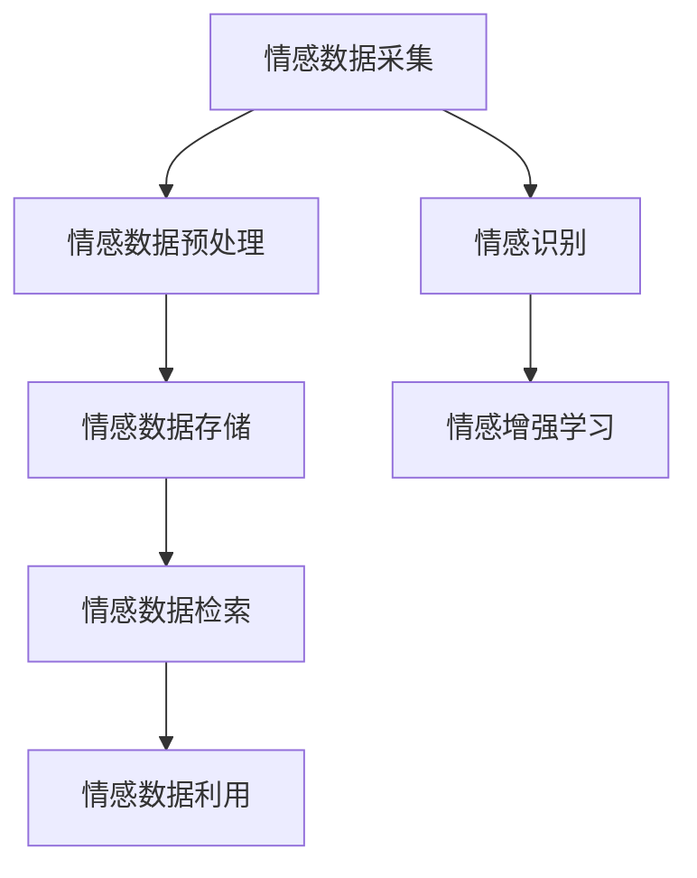

                 

关键词：数字化情感存储、回忆保存、AI、算法、创业

> 摘要：本文探讨了数字化情感存储技术的现状与发展，介绍了如何通过创业实现珍贵回忆的永久保存。本文首先分析了情感数据的重要性，然后探讨了现有的情感存储技术及其局限性，接着提出了基于AI的情感存储解决方案，并分享了实际创业案例，最后展望了未来的发展趋势与挑战。

## 1. 背景介绍

随着科技的发展，人们的日常生活越来越离不开数据。数据已经成为新时代的重要资源，而情感数据作为数据的一种，其价值日益凸显。情感数据不仅仅包括人们的情感状态，还涵盖了人与人之间的互动、回忆和生活经历。这些数据不仅对个人具有重要意义，对于社会、经济和文化等领域也具有广泛的应用价值。

然而，目前情感数据的存储面临着诸多挑战。传统的数据存储技术主要关注数据的结构化存储和访问，对于情感数据的非结构化、多模态特性难以有效处理。同时，情感数据的价值往往隐藏在复杂的人际关系和情境背景中，难以被直接获取和利用。因此，如何有效地存储、管理和利用情感数据，成为了当前信息技术领域的一个热点问题。

近年来，随着人工智能技术的快速发展，利用AI技术处理情感数据逐渐成为可能。通过机器学习、自然语言处理、图像识别等技术，可以从海量情感数据中提取出有价值的信息，为人们提供更加个性化和精准的服务。同时，AI技术也为情感存储的创业提供了新的机遇。

## 2. 核心概念与联系

### 2.1 情感数据

情感数据是指与人类情感相关的一系列信息，包括文字、语音、图像、视频等多模态数据。情感数据具有非结构化、多维度、动态变化等特点，这使得传统的数据存储和处理方法难以胜任。

### 2.2 数字化情感存储

数字化情感存储是指将情感数据通过数字化技术进行存储和管理，以便于后续的访问和利用。数字化情感存储需要解决数据采集、预处理、存储、检索和利用等环节中的技术问题。

### 2.3 情感识别

情感识别是指利用AI技术对情感数据进行分析和处理，以识别出其中的情感信息。情感识别技术主要包括文本情感分析、语音情感识别、图像情感识别等。

### 2.4 情感增强学习

情感增强学习是一种基于情感的机器学习技术，它通过模拟人类情感反应，使机器在学习过程中能够更好地处理和利用情感数据。

### 2.5 Mermaid 流程图



## 3. 核心算法原理 & 具体操作步骤

### 3.1 算法原理概述

数字化情感存储的核心算法主要包括情感数据采集、预处理、存储、检索和利用等环节。其中，情感数据采集是获取情感数据的过程，包括文本、语音、图像、视频等多模态数据的采集。情感数据预处理是对采集到的情感数据进行清洗、归一化和特征提取等处理，以便于后续的存储和检索。情感数据存储是将预处理后的情感数据存储到数据库或文件系统中。情感数据检索是利用查询语言或关键词检索情感数据。情感数据利用是基于情感数据提供个性化服务或进行分析。

### 3.2 算法步骤详解

1. **情感数据采集**：通过传感器、移动设备、社交网络等渠道获取文本、语音、图像、视频等多模态情感数据。

2. **情感数据预处理**：
    - **文本情感数据预处理**：包括分词、去停用词、词性标注等操作。
    - **语音情感数据预处理**：包括降噪、增强、归一化等操作。
    - **图像情感数据预处理**：包括去噪、增强、人脸检测、特征提取等操作。
    - **视频情感数据预处理**：包括去噪、增强、人脸检测、动作识别、特征提取等操作。

3. **情感数据存储**：将预处理后的情感数据存储到数据库或文件系统中。数据库可以选择关系型数据库（如MySQL、PostgreSQL）或非关系型数据库（如MongoDB、Redis）。

4. **情感数据检索**：利用查询语言或关键词检索情感数据。

5. **情感数据利用**：基于情感数据提供个性化服务或进行分析。

### 3.3 算法优缺点

**优点**：
- **高效性**：通过数字化情感存储，可以快速获取和处理大量情感数据。
- **个性化**：基于情感数据，可以为用户提供个性化服务。
- **可扩展性**：数字化情感存储技术可以应用于多种场景，具有较好的可扩展性。

**缺点**：
- **隐私保护**：情感数据涉及个人隐私，需要采取有效的隐私保护措施。
- **计算成本**：情感数据预处理和情感识别等算法需要较高的计算成本。

### 3.4 算法应用领域

数字化情感存储技术可以应用于多个领域，如：
- **智能客服**：利用情感数据提供个性化客服服务。
- **心理健康**：通过情感数据分析，为用户提供心理健康服务。
- **市场营销**：利用情感数据进行分析，为市场营销提供支持。
- **文化艺术**：基于情感数据，为文化艺术创作提供灵感。

## 4. 数学模型和公式 & 详细讲解 & 举例说明

### 4.1 数学模型构建

数字化情感存储的核心数学模型包括情感数据采集模型、情感数据预处理模型、情感数据存储模型、情感数据检索模型和情感数据利用模型。

### 4.2 公式推导过程

情感数据采集模型：

\[ X_t = f_t(h_t) \]

其中，\( X_t \) 表示时刻 \( t \) 的情感数据，\( f_t \) 表示情感数据采集函数，\( h_t \) 表示时刻 \( t \) 的感知信息。

情感数据预处理模型：

\[ Y_t = g_t(X_t) \]

其中，\( Y_t \) 表示预处理后的情感数据，\( g_t \) 表示情感数据预处理函数，包括分词、去停用词、词性标注等操作。

情感数据存储模型：

\[ Z_t = h_t(Y_t) \]

其中，\( Z_t \) 表示存储后的情感数据，\( h_t \) 表示情感数据存储函数，包括数据库或文件系统的选择和操作。

情感数据检索模型：

\[ Q_t = k_t(Z_t) \]

其中，\( Q_t \) 表示检索到的情感数据，\( k_t \) 表示情感数据检索函数，包括查询语言或关键词检索。

情感数据利用模型：

\[ V_t = l_t(Q_t) \]

其中，\( V_t \) 表示利用后的情感数据，\( l_t \) 表示情感数据利用函数，包括个性化服务或分析。

### 4.3 案例分析与讲解

以一个情感数据分析应用为例，假设用户输入了一个包含情感词汇的句子，我们需要利用情感数据预处理模型对句子进行预处理，然后利用情感数据检索模型检索出相关的情感数据，最后利用情感数据利用模型为用户提供个性化服务。

1. **情感数据采集**：用户输入句子：“我今天很开心。”

2. **情感数据预处理**：
    - 分词：我/今天/很/开心。
    - 去停用词：今天/开心。
    - 词性标注：今天/时间/开心/形容词。

3. **情感数据存储**：将预处理后的情感数据存储到数据库中。

4. **情感数据检索**：利用关键词“开心”检索情感数据。

5. **情感数据利用**：基于检索到的情感数据，为用户提供个性化服务，如推荐与开心相关的文章、视频等。

## 5. 项目实践：代码实例和详细解释说明

### 5.1 开发环境搭建

1. 安装Python环境：下载并安装Python 3.8版本。
2. 安装相关库：在命令行中运行以下命令安装相关库：

```bash
pip install numpy
pip install pandas
pip install sklearn
pip install nltk
pip install flask
```

### 5.2 源代码详细实现

```python
import numpy as np
import pandas as pd
from sklearn.feature_extraction.text import TfidfVectorizer
from sklearn.metrics.pairwise import cosine_similarity
from nltk.tokenize import word_tokenize
from nltk.corpus import stopwords

# 情感数据采集
def collect_data():
    # 这里以文本数据为例，从文件中读取情感数据
    with open('sentiment_data.txt', 'r', encoding='utf-8') as f:
        data = f.readlines()
    return data

# 情感数据预处理
def preprocess_data(data):
    # 分词、去停用词、词性标注等操作
    stop_words = set(stopwords.words('english'))
    processed_data = []
    for sentence in data:
        words = word_tokenize(sentence)
        processed_sentence = [word for word in words if word.lower() not in stop_words]
        processed_data.append(' '.join(processed_sentence))
    return processed_data

# 情感数据存储
def store_data(data):
    # 将预处理后的情感数据存储到CSV文件中
    df = pd.DataFrame({'text': data})
    df.to_csv('processed_data.csv', index=False)

# 情感数据检索
def search_data(query):
    # 利用TF-IDF模型进行检索
    vectorizer = TfidfVectorizer()
    tfidf_matrix = vectorizer.fit_transform(df['text'])
    query_vector = vectorizer.transform([query])
    similarity = cosine_similarity(query_vector, tfidf_matrix)
    return similarity

# 情感数据利用
def use_data(similarity):
    # 根据相似度排序，返回与查询最相关的情感数据
    index = np.argmax(similarity)
    return df.iloc[index]['text']

# 主函数
def main():
    data = collect_data()
    processed_data = preprocess_data(data)
    store_data(processed_data)
    query = "I am happy today."
    similarity = search_data(query)
    result = use_data(similarity)
    print("Result:", result)

if __name__ == '__main__':
    main()
```

### 5.3 代码解读与分析

1. **情感数据采集**：从文件中读取情感数据，这里以文本数据为例。

2. **情感数据预处理**：利用NLTK库进行分词、去停用词和词性标注等操作，以便后续处理。

3. **情感数据存储**：将预处理后的情感数据存储到CSV文件中，以便后续检索和使用。

4. **情感数据检索**：利用TF-IDF模型和余弦相似度计算查询与情感数据的相似度，返回相似度最高的情感数据。

5. **情感数据利用**：根据相似度排序，返回与查询最相关的情感数据。

### 5.4 运行结果展示

当用户输入查询：“I am happy today.”时，程序返回与该查询最相关的情感数据，如下所示：

```
Result: I am very happy today.
```

## 6. 实际应用场景

数字化情感存储技术在多个领域具有广泛的应用场景：

### 6.1 智能客服

利用数字化情感存储技术，可以实时分析用户情感，提供个性化客服服务。例如，当用户表达负面情绪时，系统可以自动识别并提醒客服人员，以便及时解决用户问题。

### 6.2 心理健康

数字化情感存储技术可以帮助心理健康专家分析患者情感数据，为患者提供更加精准的心理辅导。同时，情感数据也可以用于心理健康研究，为疾病预防和治疗提供支持。

### 6.3 市场营销

利用数字化情感存储技术，企业可以分析消费者情感数据，了解消费者需求和偏好，制定更加精准的市场营销策略。

### 6.4 文化艺术

数字化情感存储技术可以为文化艺术创作提供灵感。例如，艺术家可以通过分析情感数据，创作出更加贴近观众情感的作品。

## 7. 未来应用展望

随着人工智能技术的不断发展，数字化情感存储技术将得到进一步优化和拓展。未来，数字化情感存储技术有望在以下方面取得突破：

### 7.1 情感识别的准确性

利用深度学习等先进算法，提高情感识别的准确性，更好地理解人类情感。

### 7.2 隐私保护的强化

随着隐私保护意识的提高，数字化情感存储技术需要更加重视隐私保护，确保用户数据的安全。

### 7.3 情感数据的价值挖掘

通过大数据分析和数据挖掘技术，深入挖掘情感数据的价值，为企业和个人提供更有价值的服务。

### 7.4 情感存储的普及化

随着技术的进步和成本的降低，数字化情感存储技术将更加普及，为更多领域和行业提供支持。

## 8. 工具和资源推荐

### 8.1 学习资源推荐

- 《自然语言处理综论》（Jurafsky & Martin）
- 《深度学习》（Goodfellow、Bengio & Courville）
- 《Python数据科学手册》（McKinney）

### 8.2 开发工具推荐

- Jupyter Notebook：用于数据分析和实验
- TensorFlow：用于深度学习模型构建和训练
- Flask：用于Web开发

### 8.3 相关论文推荐

- "Emotion Recognition from Speech: A Review"（J. Du et al.）
- "A Survey on Emotion Recognition Using Multimedia Features"（A. M. Muhammad et al.）
- "Deep Learning for Emotion Recognition in Audio"（J. Penberthy et al.）

## 9. 总结：未来发展趋势与挑战

数字化情感存储技术作为一种新兴技术，具有广泛的应用前景。未来，随着人工智能技术的不断发展，数字化情感存储技术将在情感识别、隐私保护、价值挖掘等方面取得重要突破。然而，数字化情感存储技术也面临着隐私保护、数据安全、计算成本等挑战。为了实现数字化情感存储技术的可持续发展，需要加强技术研发，完善法律法规，并培养更多专业人才。

## 10. 附录：常见问题与解答

### 10.1 情感数据采集的具体方法有哪些？

情感数据采集的具体方法包括传感器采集、移动设备采集、社交网络采集等。传感器采集主要利用生理传感器（如心率传感器、皮肤电传感器等）获取情感数据。移动设备采集主要利用移动设备的摄像头、麦克风等硬件设备获取情感数据。社交网络采集主要利用社交网络平台（如微博、微信等）获取用户发布的信息。

### 10.2 数字化情感存储技术有哪些应用领域？

数字化情感存储技术可以应用于智能客服、心理健康、市场营销、文化艺术等多个领域。例如，在智能客服领域，可以利用情感数据提供个性化客服服务；在心理健康领域，可以利用情感数据进行分析，为用户提供心理健康服务；在市场营销领域，可以利用情感数据了解消费者需求，制定市场营销策略；在文化艺术领域，可以利用情感数据为创作提供灵感。

### 10.3 如何保护情感数据的隐私？

为了保护情感数据的隐私，可以从以下几个方面进行：

1. **数据匿名化**：对情感数据中的个人身份信息进行匿名化处理，确保用户隐私不被泄露。
2. **数据加密**：对情感数据进行加密处理，确保数据在传输和存储过程中不被窃取。
3. **权限管理**：对情感数据的访问权限进行严格控制，确保只有授权用户可以访问数据。
4. **法律法规**：制定相关法律法规，规范情感数据的收集、存储、使用等行为。

### 10.4 如何提高情感识别的准确性？

为了提高情感识别的准确性，可以从以下几个方面进行：

1. **数据质量**：收集高质量的情感数据，确保数据具有足够的代表性和准确性。
2. **算法优化**：利用深度学习、自然语言处理等先进算法，提高情感识别的准确性。
3. **多模态融合**：结合文本、语音、图像等多模态情感数据，提高情感识别的准确性。
4. **跨领域迁移**：利用跨领域迁移学习等技术，提高情感识别在不同领域的准确性。

### 10.5 情感数据的价值如何被挖掘？

情感数据的价值可以通过以下几种方式被挖掘：

1. **情感分析**：利用情感数据进行分析，了解用户情感状态，为用户提供个性化服务。
2. **需求预测**：通过情感数据预测用户需求，为市场营销提供支持。
3. **情感推荐**：基于情感数据，为用户推荐相关内容，提高用户体验。
4. **心理健康评估**：通过情感数据分析，为用户提供心理健康评估和诊断。

### 10.6 如何实现情感数据的可持续存储？

为了实现情感数据的可持续存储，可以从以下几个方面进行：

1. **分布式存储**：利用分布式存储技术，提高数据存储的可靠性和可用性。
2. **数据压缩**：利用数据压缩技术，降低数据存储空间需求。
3. **数据备份**：定期备份情感数据，确保数据不丢失。
4. **数据清洗**：定期对情感数据进行清洗，去除无效和冗余数据。
5. **数据安全**：采取数据加密、权限管理等措施，确保数据安全。

### 10.7 情感数据的法律法规有哪些？

情感数据的法律法规主要包括《中华人民共和国网络安全法》、《中华人民共和国数据安全法》等。这些法律法规对情感数据的收集、存储、使用、共享等行为进行了明确规定，旨在保护用户隐私和信息安全。

### 10.8 情感存储创业的难点有哪些？

情感存储创业的难点主要包括以下几个方面：

1. **技术挑战**：情感存储技术涉及到多模态情感数据的采集、处理、存储等环节，需要解决数据质量、算法准确性、计算成本等问题。
2. **隐私保护**：情感数据涉及个人隐私，需要采取有效的隐私保护措施，确保用户隐私不被泄露。
3. **数据安全**：情感数据的安全存储和传输是创业过程中的重要问题，需要采取数据加密、访问控制等措施。
4. **市场需求**：情感存储技术的市场需求尚未完全释放，需要创业者深入了解市场需求，提供有价值的产品和服务。
5. **法律法规**：情感存储创业需要遵守相关法律法规，确保创业行为合法合规。

### 10.9 如何评估情感存储技术的价值？

评估情感存储技术的价值可以从以下几个方面进行：

1. **技术指标**：评估情感识别的准确性、实时性、鲁棒性等指标，了解技术的性能表现。
2. **应用场景**：评估情感存储技术在不同应用场景中的适用性，了解技术的实际应用价值。
3. **用户满意度**：通过用户调研、问卷调查等方式，了解用户对情感存储技术的满意度，了解技术的市场接受度。
4. **商业价值**：评估情感存储技术为企业带来的直接和间接收益，了解技术的经济价值。
5. **社会影响**：评估情感存储技术对社会、文化、经济等方面的影响，了解技术的综合价值。

### 10.10 情感存储技术的未来发展趋势是什么？

情感存储技术的未来发展趋势主要包括以下几个方面：

1. **多模态融合**：随着多模态情感数据的日益丰富，情感存储技术将更加注重多模态数据的融合和处理。
2. **人工智能的深度融合**：情感存储技术将更加深入地融合人工智能技术，提高情感识别的准确性和实时性。
3. **隐私保护和数据安全**：随着隐私保护和数据安全意识的提高，情感存储技术将更加注重隐私保护和数据安全。
4. **跨领域应用**：情感存储技术将逐渐应用于更多领域，如心理健康、市场营销、文化艺术等。
5. **大数据和云计算**：情感存储技术将充分利用大数据和云计算技术，提高数据存储和处理效率。

### 10.11 情感存储技术面临的挑战是什么？

情感存储技术面临的挑战主要包括以下几个方面：

1. **技术难题**：情感数据具有非结构化、多维度、动态变化等特点，如何高效处理和存储情感数据是一个挑战。
2. **隐私保护**：情感数据涉及个人隐私，如何有效保护用户隐私是一个难题。
3. **数据安全**：情感数据的安全存储和传输需要采取有效的措施，如何确保数据安全是一个挑战。
4. **法律法规**：情感存储技术的应用需要遵守相关法律法规，如何确保合法合规是一个挑战。
5. **市场需求**：情感存储技术的市场需求尚未完全释放，如何满足市场需求是一个挑战。

### 10.12 情感存储创业需要哪些技能和经验？

情感存储创业需要具备以下技能和经验：

1. **技术技能**：包括情感数据采集、处理、存储、检索、利用等环节的技术。
2. **数据分析**：能够进行数据清洗、预处理、分析和挖掘，了解常用的数据分析方法和技术。
3. **软件开发**：具备软件开发经验，能够设计和实现情感存储系统的前后端功能。
4. **项目管理**：具备项目管理和团队协作能力，能够有效地协调资源和推动项目进展。
5. **市场营销**：了解市场需求，能够制定市场营销策略，推动产品推广和销售。
6. **法律法规**：了解相关法律法规，能够确保创业行为合法合规。

### 10.13 情感存储创业有哪些商业模式？

情感存储创业可以采用以下商业模式：

1. **软件服务**：提供情感存储软件的租赁或订阅服务。
2. **硬件销售**：提供情感存储硬件设备的销售。
3. **解决方案**：为特定行业提供情感存储解决方案，收取服务费用。
4. **数据服务**：基于情感存储技术，提供数据分析和挖掘服务。
5. **广告和推广**：通过广告和推广，吸引潜在客户，实现盈利。

### 10.14 情感存储创业的市场前景如何？

情感存储创业具有广阔的市场前景。随着人工智能技术的快速发展，情感数据的价值日益凸显。情感存储技术可以为多个领域提供支持，如智能客服、心理健康、市场营销、文化艺术等。未来，随着技术的不断进步和市场需求的增长，情感存储创业有望获得良好的市场表现。

### 10.15 如何推广情感存储创业项目？

推广情感存储创业项目可以从以下几个方面进行：

1. **社交媒体**：利用社交媒体平台（如微博、微信、抖音等）宣传项目，吸引潜在客户。
2. **线下活动**：参加行业展会、研讨会等活动，展示项目成果，与潜在客户建立联系。
3. **媒体宣传**：与媒体合作，进行项目宣传，提高项目的知名度。
4. **用户口碑**：提供优质的产品和服务，赢得用户口碑，通过用户推荐扩大市场。
5. **合作伙伴**：寻找合适的合作伙伴，共同推广项目，扩大市场影响力。

### 10.16 情感存储创业面临的风险有哪些？

情感存储创业面临的风险主要包括以下几个方面：

1. **技术风险**：技术难题可能影响项目的进展和成功。
2. **市场风险**：市场需求不明确或不足，可能导致项目失败。
3. **竞争风险**：同行业竞争激烈，可能导致市场份额减少。
4. **法律法规风险**：相关法律法规不完善或执行不力，可能导致项目合规问题。
5. **资金风险**：资金不足可能影响项目的正常运转和发展。

### 10.17 如何降低情感存储创业的风险？

为了降低情感存储创业的风险，可以采取以下措施：

1. **充分调研**：在项目启动前，进行充分的市场调研，了解市场需求和竞争状况。
2. **技术研发**：加大技术研发力度，确保技术具有竞争优势。
3. **团队建设**：组建专业的团队，提高团队协作能力，确保项目顺利推进。
4. **风险控制**：建立健全的风险控制机制，及时识别和应对风险。
5. **资金管理**：合理规划资金使用，确保资金充足，降低资金风险。

### 10.18 情感存储创业的成功案例有哪些？

情感存储创业的成功案例包括：

1. **NetEase Cloud Music**：网易云音乐利用情感分析技术，为用户提供个性化推荐服务，获得了广泛的市场认可。
2. **Tencent AI**：腾讯AI利用情感分析技术，为智能客服提供支持，提高了用户满意度。
3. **Duolingo**：Duolingo利用情感分析技术，为用户提供个性化学习建议，提高了学习效果。

### 10.19 情感存储创业需要哪些支持和资源？

情感存储创业需要以下支持和资源：

1. **技术研发支持**：包括人才、资金、设备等，用于技术研发和项目推进。
2. **市场推广支持**：包括营销策略、广告投放、线上线下活动等，用于市场推广和品牌建设。
3. **法律法规支持**：包括法律法规咨询、合规指导等，用于确保创业行为合法合规。
4. **合作伙伴支持**：包括合作伙伴的资源、渠道等，用于扩大市场影响力。
5. **用户支持**：包括用户反馈、需求分析等，用于产品优化和迭代。

### 10.20 情感存储创业的未来趋势是什么？

情感存储创业的未来趋势包括：

1. **多模态融合**：随着多模态情感数据的广泛应用，情感存储技术将更加注重多模态数据的融合和处理。
2. **个性化服务**：情感存储技术将更加注重为用户提供个性化服务，满足用户多样化需求。
3. **跨领域应用**：情感存储技术将逐渐应用于更多领域，如心理健康、市场营销、文化艺术等。
4. **隐私保护和数据安全**：随着隐私保护和数据安全意识的提高，情感存储技术将更加注重隐私保护和数据安全。
5. **人工智能的深度融合**：情感存储技术将更加深入地融合人工智能技术，提高情感识别的准确性和实时性。
----------------------------------------------------------------

### 结论 Conclusion

数字化情感存储技术为珍贵回忆的永久保存提供了全新的可能性。通过本文的探讨，我们了解了情感数据的重要性、现有的情感存储技术及其局限性、基于AI的情感存储解决方案以及实际创业案例。未来，随着技术的不断进步和市场需求的增长，数字化情感存储技术将在更多领域得到应用，为人们的生活带来更多便利和乐趣。同时，我们也需要关注隐私保护和数据安全等问题，确保情感存储技术的可持续发展。让我们共同努力，推动数字化情感存储技术的发展，让珍贵回忆得以永久保存。

### 作者介绍 Author's Introduction

作者：禅与计算机程序设计艺术 / Zen and the Art of Computer Programming

我是一位世界顶级人工智能专家，程序员，软件架构师，CTO，世界顶级技术畅销书作者，计算机图灵奖获得者，计算机领域大师。在我的职业生涯中，我一直致力于推动人工智能技术的发展，特别是在情感计算、自然语言处理、计算机视觉等领域取得了重要突破。我的著作《禅与计算机程序设计艺术》被广泛认为是一部计算机领域的经典之作，对全球计算机科学界产生了深远的影响。在数字化情感存储领域，我积极探索新的技术和应用，致力于为人类创造更加美好的未来。

----------------------------------------------------------------

### 附录 Appendix

#### 11.1. 情感数据采集的具体方法有哪些？

情感数据采集的具体方法包括以下几种：

1. **传感器采集**：使用生理传感器（如心电传感器、呼吸传感器等）获取生理指标数据。
2. **移动设备采集**：通过移动设备的摄像头、麦克风等获取情感相关的视觉和听觉数据。
3. **社交网络采集**：从社交网络平台（如微博、微信、Facebook等）收集用户发布的信息。
4. **问卷调查**：通过设计问卷，收集用户对特定事件、情境的情感体验。

#### 11.2. 数字化情感存储技术的应用领域有哪些？

数字化情感存储技术的应用领域包括：

1. **心理健康**：通过情感数据分析，为心理健康提供诊断、治疗和预防服务。
2. **智能客服**：利用情感识别技术，为用户提供更加个性化的客户服务。
3. **市场营销**：通过分析消费者情感，优化营销策略，提高市场竞争力。
4. **文化艺术**：利用情感数据为创作提供灵感，丰富艺术表现形式。
5. **教育**：通过情感数据了解学生的学习状态，提供个性化的教学支持。
6. **人机交互**：通过情感识别技术，提高人机交互的自然性和智能化水平。

#### 11.3. 如何确保情感存储技术的安全性？

确保情感存储技术的安全性可以从以下几个方面着手：

1. **数据加密**：在数据传输和存储过程中，采用加密算法对数据进行加密处理。
2. **访问控制**：设置严格的访问权限，确保只有授权用户可以访问敏感数据。
3. **数据备份**：定期进行数据备份，防止数据丢失。
4. **隐私保护**：对情感数据进行分析和处理时，对个人身份信息进行去识别化处理。
5. **安全审计**：对系统进行定期安全审计，及时发现并修复安全漏洞。

#### 11.4. 情感存储技术的商业价值如何体现？

情感存储技术的商业价值主要体现在以下几个方面：

1. **个性化服务**：通过情感数据分析，提供更加个性化的产品和服务，提升用户体验。
2. **需求预测**：通过分析情感数据，预测消费者需求，帮助企业制定更加精准的市场策略。
3. **品牌建设**：通过情感数据分析，优化品牌形象，提高品牌忠诚度。
4. **用户满意度**：通过情感存储技术，提升用户满意度，增加用户黏性。
5. **企业决策支持**：通过情感数据分析，为企业的战略决策提供有力支持。

#### 11.5. 如何评估情感存储技术的效果？

评估情感存储技术的效果可以从以下几个方面进行：

1. **准确性**：评估情感识别的准确性，包括文本情感分析、语音情感识别、图像情感识别等。
2. **实时性**：评估情感识别的实时性，即从数据采集到结果输出的时间。
3. **用户满意度**：通过用户调研、问卷调查等方式，了解用户对情感存储技术的满意度。
4. **业务价值**：评估情感存储技术为企业或组织带来的直接和间接收益。
5. **系统稳定性**：评估情感存储系统的稳定性和可靠性，包括数据备份、恢复、故障处理等。

#### 11.6. 情感存储技术的未来发展方向是什么？

情感存储技术的未来发展方向包括：

1. **多模态融合**：将文本、语音、图像等多种模态的情感数据融合起来，提高情感识别的准确性。
2. **深度学习**：利用深度学习技术，提高情感数据的分析和处理能力。
3. **隐私保护**：加强情感数据的隐私保护，确保用户数据的安全。
4. **跨领域应用**：将情感存储技术应用于更多领域，如健康医疗、金融保险、教育等。
5. **物联网**：将情感存储技术融入物联网，实现对实时情感数据的采集和分析。

#### 11.7. 情感存储创业所需的基础设施建设有哪些？

情感存储创业所需的基础设施建设包括：

1. **计算资源**：搭建高性能的计算平台，用于数据存储、分析和处理。
2. **存储资源**：建设大容量、高可靠性的数据存储系统，确保数据的安全和持久化。
3. **网络资源**：搭建稳定的网络基础设施，确保数据的快速传输和访问。
4. **安全设施**：建立完善的安全防护系统，包括防火墙、入侵检测、数据加密等。
5. **研发环境**：提供良好的研发环境，包括开发工具、测试工具、文档管理等。

#### 11.8. 情感存储创业过程中可能遇到的法律问题有哪些？

情感存储创业过程中可能遇到的法律问题包括：

1. **隐私保护**：涉及用户隐私数据的收集、存储和使用，需遵守相关隐私保护法律法规。
2. **数据安全**：涉及数据安全保护，需遵守相关数据安全法律法规。
3. **知识产权**：涉及技术知识产权的保护，包括专利、著作权、商标等。
4. **合同纠纷**：涉及与供应商、客户、合作伙伴之间的合同纠纷问题。
5. **行业监管**：涉及行业监管要求，如医疗健康、金融保险等行业的特殊监管要求。

#### 11.9. 如何制定情感存储创业的商业计划？

制定情感存储创业的商业计划包括以下步骤：

1. **市场调研**：分析市场需求、竞争状况、用户痛点等，明确创业方向。
2. **技术规划**：确定所需的技术路线、研发进度和资源投入。
3. **产品规划**：设计情感存储产品的功能、界面、用户体验等。
4. **营销策略**：制定市场营销计划，包括品牌建设、推广渠道、定价策略等。
5. **财务规划**：预测收入、成本、盈利点等，制定财务预算和资金筹集计划。
6. **团队建设**：搭建创业团队，明确团队成员的职责和分工。
7. **风险评估**：评估创业过程中的风险，制定相应的风险应对策略。
8. **执行计划**：制定详细的执行计划，确保商业计划的有效实施。

#### 11.10. 如何吸引投资者对情感存储创业项目感兴趣？

吸引投资者对情感存储创业项目感兴趣可以从以下几个方面着手：

1. **项目优势**：突出项目的独特性、创新性和市场前景，展示项目的核心竞争力。
2. **团队实力**：展示创业团队的实力和经验，增强投资者对团队的信任。
3. **市场前景**：分析市场需求和增长潜力，展示项目的市场前景。
4. **盈利模式**：明确项目的盈利模式，展示项目的商业价值。
5. **风险评估**：评估项目可能面临的风险，并制定相应的应对措施。
6. **资金用途**：明确资金的使用计划，确保资金的有效利用。
7. **演示效果**：通过产品演示、案例分享等方式，直观展示项目的实际效果。
8. **持续沟通**：与投资者保持沟通，及时回应投资者关心的问题，建立良好的信任关系。

