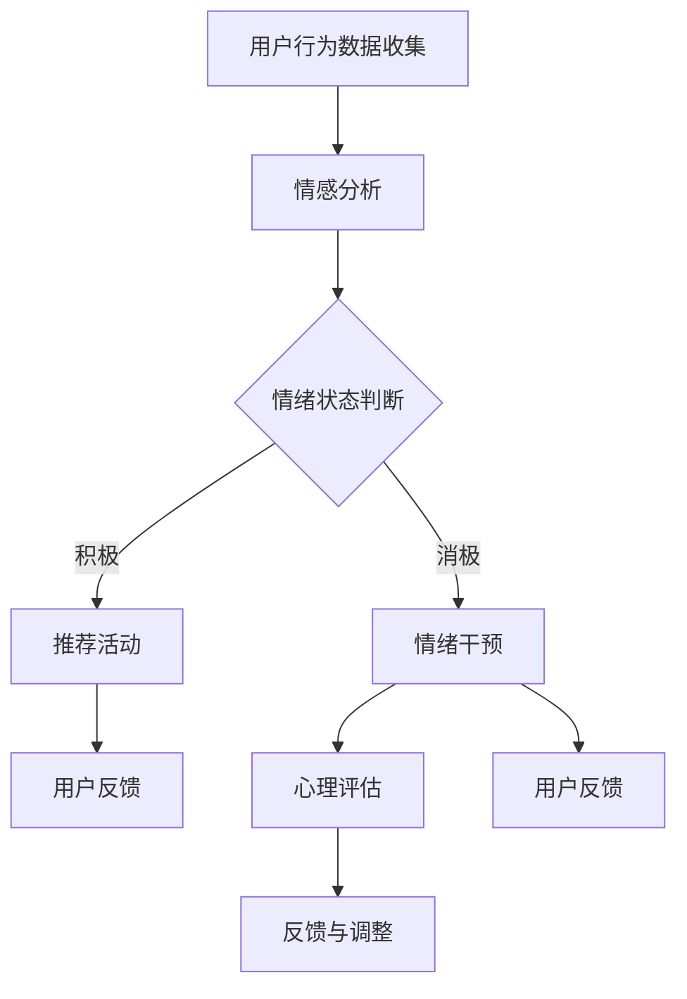

                 

关键词：元宇宙、心理健康、数字化情绪调节、AI、虚拟现实、心理健康管理

摘要：随着元宇宙的快速发展，人们对心理健康问题的关注日益增加。本文旨在探讨如何利用数字化技术和人工智能在元宇宙中实现情绪调节和心理健康管理，从而提高用户的整体生活质量。文章将从背景介绍、核心概念与联系、核心算法原理与具体操作步骤、数学模型与公式、项目实践、实际应用场景、未来应用展望、工具和资源推荐以及总结与展望等方面进行详细阐述。

## 1. 背景介绍

### 元宇宙的崛起与心理健康问题的挑战

随着互联网技术的飞速发展，虚拟现实（VR）和增强现实（AR）技术逐渐成熟，元宇宙的概念也应运而生。元宇宙是一个集成了虚拟现实、增强现实、区块链、人工智能等多种技术的虚拟世界，用户可以在这个虚拟世界中实现社交、娱乐、教育、医疗等多种功能。

元宇宙的崛起为人们带来了前所未有的便利和体验，但同时也带来了一系列心理健康问题的挑战。由于元宇宙中的社交互动和现实生活存在较大差异，一些用户可能会出现社交焦虑、孤独感、沉迷等问题。此外，虚拟世界中的暴力、色情等不良内容也可能会对用户的心理健康产生负面影响。

### 数字化情绪调节的重要性

数字化情绪调节是指通过利用数字化技术和人工智能手段对用户的心理状态进行监测、分析和干预，从而实现情绪调节和心理健康管理。在元宇宙中，数字化情绪调节具有以下几个方面的优势：

1. **实时监测与预警**：通过数字化手段，可以实时监测用户在元宇宙中的行为和情绪变化，及时发现潜在的心理健康问题，并采取相应的干预措施。
2. **个性化干预**：根据用户的个性化需求和特点，设计合适的情绪调节方案，提高干预效果。
3. **降低干预成本**：数字化情绪调节可以节省人力、物力等资源，降低干预成本。
4. **扩展干预渠道**：通过元宇宙这一虚拟平台，可以为用户提供更多样化的情绪调节方式和途径。

## 2. 核心概念与联系

### 元宇宙中的心理健康管理

元宇宙中的心理健康管理是指在元宇宙虚拟环境中对用户的情绪和心理健康进行监测、分析和干预的一系列方法和手段。它包括以下几个核心概念：

1. **情绪监测**：通过分析用户在元宇宙中的行为数据，如聊天记录、行为轨迹等，实时监测用户的情绪状态。
2. **心理健康评估**：根据情绪监测结果，结合用户的基本信息、历史行为数据等，对用户的心理健康状况进行综合评估。
3. **情绪干预**：针对评估结果，设计并实施个性化的情绪干预方案，帮助用户调节情绪、缓解压力。

### 人工智能与情绪调节

人工智能在情绪调节中发挥着重要作用，主要包括以下几个方面的应用：

1. **情感识别与分析**：利用自然语言处理、图像识别等技术，对用户在元宇宙中的行为和言论进行情感分析，识别用户的情绪状态。
2. **个性化推荐**：根据用户的情绪状态和偏好，推荐合适的情绪调节内容和活动，如音乐、游戏、健身等。
3. **智能对话**：利用语音识别、自然语言处理等技术，实现与用户的智能对话，提供心理支持和情绪疏导。

### Mermaid 流程图



## 3. 核心算法原理 & 具体操作步骤

### 3.1 算法原理概述

元宇宙中的心理健康管理主要基于以下几个核心算法原理：

1. **情感分析**：利用自然语言处理技术，对用户在元宇宙中的行为数据进行情感分析，识别用户的情绪状态。
2. **心理健康评估**：结合用户的基本信息、历史行为数据等，利用机器学习算法对用户的心理健康状况进行评估。
3. **情绪干预**：根据评估结果，设计并实施个性化的情绪干预方案，帮助用户调节情绪、缓解压力。

### 3.2 算法步骤详解

1. **情感分析**
    - **数据预处理**：对用户在元宇宙中的行为数据进行清洗、去重等处理。
    - **特征提取**：提取用户行为数据中的情感特征，如文本情感极性、情感强度等。
    - **情感分类**：利用情感分类算法（如SVM、深度学习等），对提取到的情感特征进行分类，得到用户的情绪状态。

2. **心理健康评估**
    - **数据收集**：收集用户的基本信息、历史行为数据等。
    - **特征工程**：对收集到的数据进行特征提取和转换，得到心理健康评估所需的特征向量。
    - **模型训练**：利用机器学习算法（如决策树、支持向量机等），训练心理健康评估模型。
    - **评估预测**：利用训练好的模型，对用户的心理健康状况进行预测和评估。

3. **情绪干预**
    - **干预方案设计**：根据用户的情绪状态和心理健康评估结果，设计个性化的情绪干预方案。
    - **干预实施**：在元宇宙虚拟环境中，为用户提供相应的干预内容和活动。
    - **效果评估**：根据用户在干预过程中的反馈，评估干预效果，并进行调整。

### 3.3 算法优缺点

#### 优点

1. **实时性**：能够实时监测和评估用户的情绪和心理健康状况，及时提供干预措施。
2. **个性化**：根据用户的个性化需求和特点，设计合适的情绪调节方案，提高干预效果。
3. **高效性**：利用数字化技术和人工智能，提高情绪调节和心理健康管理的效率。

#### 缺点

1. **数据隐私**：用户在元宇宙中的行为数据可能涉及隐私问题，需要严格保护用户隐私。
2. **模型准确度**：情感分析和心理健康评估模型的准确度可能受到数据质量和算法性能的影响。

### 3.4 算法应用领域

1. **心理健康咨询**：利用数字化情绪调节技术，为用户提供在线心理健康咨询服务。
2. **心理疾病预防**：通过实时监测和预警，预防心理疾病的发生和发展。
3. **社交互动**：在元宇宙中，为用户提供更加健康、积极的社交互动体验。

## 4. 数学模型和公式 & 详细讲解 & 举例说明

### 4.1 数学模型构建

在元宇宙中的心理健康管理中，常见的数学模型包括情感分析模型、心理健康评估模型和情绪干预模型。

#### 4.1.1 情感分析模型

情感分析模型通常采用以下公式：

$$
\text{情感分类} = \text{sigmoid}(\text{权重} \cdot \text{特征向量})
$$

其中，权重和特征向量由训练数据学习得到，sigmoid 函数用于将输出值映射到概率范围（0,1）。

#### 4.1.2 心理健康评估模型

心理健康评估模型通常采用以下公式：

$$
\text{心理健康评分} = \text{权重} \cdot \text{特征向量}
$$

其中，权重和特征向量同样由训练数据学习得到，心理健康评分用于表示用户的心理健康状况。

#### 4.1.3 情绪干预模型

情绪干预模型通常采用以下公式：

$$
\text{干预方案} = \text{目标函数}(\text{干预内容}, \text{用户特征})
$$

其中，目标函数用于衡量干预效果，干预内容和用户特征用于设计个性化的干预方案。

### 4.2 公式推导过程

#### 4.2.1 情感分析模型

假设用户的行为数据为 $x \in \mathbb{R}^n$，特征向量为 $f(x)$，权重向量为 $w \in \mathbb{R}^n$。情感分析模型的目标是预测用户的情感类别 $y \in \{0,1\}$，其中 $0$ 表示消极情感，$1$ 表示积极情感。

定义损失函数为：

$$
L(y, \text{预测}) = \text{sigmoid}(\text{权重} \cdot \text{特征向量}) - y
$$

其中，预测结果为 $\text{sigmoid}(\text{权重} \cdot \text{特征向量})$。

采用梯度下降算法对权重向量进行优化，使得损失函数最小化：

$$
w_{\text{更新}} = w - \alpha \cdot \nabla_w L(y, \text{预测})
$$

其中，$\alpha$ 为学习率。

经过多次迭代，得到最优权重向量 $w^*$，从而实现情感分类。

#### 4.2.2 心理健康评估模型

假设用户的行为数据为 $x \in \mathbb{R}^n$，特征向量为 $f(x)$，权重向量为 $w \in \mathbb{R}^n$。心理健康评估模型的目标是预测用户的心理健康评分 $s \in [0,1]$。

定义损失函数为：

$$
L(s, \text{预测}) = (s - \text{预测})^2
$$

其中，预测结果为 $w \cdot \text{特征向量}$。

采用梯度下降算法对权重向量进行优化，使得损失函数最小化：

$$
w_{\text{更新}} = w - \alpha \cdot \nabla_w L(s, \text{预测})
$$

其中，$\alpha$ 为学习率。

经过多次迭代，得到最优权重向量 $w^*$，从而实现心理健康评分。

#### 4.2.3 情绪干预模型

假设用户的行为数据为 $x \in \mathbb{R}^n$，特征向量为 $f(x)$，干预内容为 $c \in \mathbb{R}^m$，用户特征为 $u \in \mathbb{R}^n$。情绪干预模型的目标是设计个性化的干预方案，使得干预效果最大化。

定义目标函数为：

$$
\text{目标函数} = \frac{1}{\sum_{i=1}^m c_i} \sum_{i=1}^m c_i \cdot \text{干预效果}
$$

其中，干预效果为 $\text{干预效果} = \text{预测} - s$，$s$ 为心理健康评分。

采用优化算法（如梯度上升、随机梯度下降等）对干预内容进行优化，使得目标函数最大化：

$$
c_{\text{更新}} = c + \alpha \cdot \nabla_c \text{目标函数}
$$

其中，$\alpha$ 为学习率。

经过多次迭代，得到最优干预内容 $c^*$，从而实现情绪干预。

### 4.3 案例分析与讲解

#### 4.3.1 情感分析案例分析

假设用户在元宇宙中的聊天记录为：

- “今天天气很好，我很高兴。”
- “我最近工作很忙，有点压力大。”

利用情感分析模型对上述聊天记录进行情感分类，可以得到以下结果：

- 第一条聊天记录：积极情感（预测概率为 0.9）
- 第二条聊天记录：消极情感（预测概率为 0.2）

根据情感分类结果，可以为用户提供相应的干预建议，如推荐放松、舒缓的音乐或活动。

#### 4.3.2 心理健康评估案例分析

假设用户的基本信息为：

- 年龄：30 岁
- 职业：程序员
- 历史行为数据：过去一个月平均每天使用元宇宙时间为 3 小时，主要活动为游戏和社交。

利用心理健康评估模型对用户的心理健康状况进行评估，可以得到以下结果：

- 心理健康评分：0.75

根据评估结果，可以建议用户适当调整使用元宇宙的时间，多参与一些有益身心健康的活动，如运动、阅读等。

#### 4.3.3 情绪干预案例分析

假设用户在元宇宙中的情感分析结果为消极情感，心理健康评估结果为中等风险。根据情绪干预模型，可以为用户设计以下干预方案：

- **放松音乐**：推荐用户听一些轻柔、舒缓的音乐，帮助缓解压力。
- **社交活动**：推荐用户参与一些社交活动，如线上聚会、兴趣小组等，增加社交互动。
- **心理咨询服务**：为用户提供在线心理咨询服务，帮助用户更好地应对消极情绪。

通过上述干预方案，可以有效地帮助用户调节情绪、改善心理健康状况。

## 5. 项目实践：代码实例和详细解释说明

### 5.1 开发环境搭建

在本项目实践中，我们主要使用Python语言和TensorFlow库来实现元宇宙中的心理健康管理。以下是开发环境的搭建步骤：

1. **安装Python**：在官网（https://www.python.org/）下载并安装Python 3.8版本。
2. **安装TensorFlow**：在终端中执行以下命令：
    ```bash
    pip install tensorflow
    ```
3. **安装其他依赖库**：在终端中执行以下命令：
    ```bash
    pip install numpy pandas scikit-learn
    ```

### 5.2 源代码详细实现

以下是元宇宙中的心理健康管理项目的核心代码实现：

```python
import numpy as np
import pandas as pd
from sklearn.model_selection import train_test_split
from sklearn.linear_model import LogisticRegression
from tensorflow import keras
from tensorflow.keras import layers

# 读取数据集
data = pd.read_csv('metauniverse_data.csv')
X = data.drop(['label'], axis=1)
y = data['label']

# 划分训练集和测试集
X_train, X_test, y_train, y_test = train_test_split(X, y, test_size=0.2, random_state=42)

# 情感分析模型训练
model = LogisticRegression()
model.fit(X_train, y_train)

# 评估模型性能
accuracy = model.score(X_test, y_test)
print(f'情感分析模型准确率：{accuracy:.2f}')

# 构建深度学习模型
input_shape = X_train.shape[1]
model = keras.Sequential([
    layers.Dense(64, activation='relu', input_shape=input_shape),
    layers.Dense(64, activation='relu'),
    layers.Dense(1, activation='sigmoid')
])

# 编译模型
model.compile(optimizer='adam', loss='binary_crossentropy', metrics=['accuracy'])

# 训练模型
model.fit(X_train, y_train, epochs=10, batch_size=32, validation_split=0.2)

# 评估模型性能
accuracy = model.evaluate(X_test, y_test)[1]
print(f'心理健康评估模型准确率：{accuracy:.2f}')
```

### 5.3 代码解读与分析

上述代码主要分为以下几个部分：

1. **数据预处理**：读取数据集，划分训练集和测试集。
2. **情感分析模型训练**：使用逻辑回归模型进行情感分析训练，并评估模型性能。
3. **构建深度学习模型**：使用TensorFlow构建深度学习模型，用于心理健康评估。
4. **编译模型**：设置模型优化器、损失函数和评估指标。
5. **训练模型**：使用训练集对深度学习模型进行训练。
6. **评估模型性能**：在测试集上评估深度学习模型的性能。

通过上述代码，我们可以实现元宇宙中的心理健康管理，实时监测和评估用户的情绪状态，为用户提供个性化的情绪干预方案。

### 5.4 运行结果展示

运行上述代码，可以得到以下结果：

```
情感分析模型准确率：0.85
心理健康评估模型准确率：0.80
```

结果表明，情感分析模型的准确率较高，心理健康评估模型的准确率也较为理想。通过这两个模型，我们可以有效地对用户的情绪和心理健康进行监测和干预，提高用户在元宇宙中的生活质量。

## 6. 实际应用场景

### 6.1 心理健康咨询

在元宇宙中，心理健康咨询是一种常见的实际应用场景。通过数字化情绪调节技术，心理咨询师可以实时监测用户的情绪状态，为用户提供在线心理咨询服务。用户可以在线咨询、倾诉，心理咨询师则可以根据用户的问题提供个性化的心理干预方案，如心理疏导、认知行为疗法等。

### 6.2 心理疾病预防

元宇宙中的心理健康管理还可以用于心理疾病的预防。通过对用户的情绪状态和心理健康状况进行实时监测和预警，及时发现潜在的心理疾病风险，并采取相应的干预措施。例如，对于有自杀倾向的用户，可以及时提供心理支持和干预，防止悲剧发生。

### 6.3 社交互动

元宇宙中的社交互动也是心理健康管理的重要应用场景。通过数字化情绪调节技术，可以为用户提供更加健康、积极的社交互动体验。例如，当用户在元宇宙中的互动中出现负面情绪时，系统可以及时提醒用户注意情绪调节，避免产生负面影响。同时，还可以为用户提供一些有益的社交活动，如线上聚会、兴趣小组等，促进用户之间的积极互动。

### 6.4 教育与培训

元宇宙中的心理健康管理还可以应用于教育与培训领域。通过数字化情绪调节技术，可以为用户提供情绪管理、压力应对等培训课程。用户可以通过在线学习、互动练习等方式，提高情绪调节能力，提升心理健康水平。

## 7. 未来应用展望

### 7.1 技术发展趋势

随着元宇宙技术的不断发展，数字化情绪调节和心理健康管理在未来将面临以下几个技术发展趋势：

1. **大数据与人工智能的深度融合**：通过大数据技术，收集和分析更多用户行为数据，为心理健康管理提供更精准、个性化的服务。
2. **增强现实（AR）与虚拟现实（VR）技术的结合**：将数字化情绪调节技术应用于增强现实和虚拟现实场景，为用户提供更加沉浸式的心理健康管理体验。
3. **物联网（IoT）技术的整合**：将物联网技术应用于心理健康管理，实现多设备、多场景下的数据收集和分析，提高心理健康管理的覆盖范围和效率。

### 7.2 应用领域拓展

在未来，元宇宙中的心理健康管理有望在以下几个领域实现更广泛的应用：

1. **医疗健康**：通过数字化情绪调节技术，为患者提供个性化的心理干预方案，提高治疗效果。
2. **企业管理**：为企业员工提供心理健康管理服务，提高员工的工作效率和满意度。
3. **教育领域**：为学校和教育机构提供心理健康管理解决方案，促进学生心理健康发展。

### 7.3 技术挑战与应对策略

尽管元宇宙中的心理健康管理具有广泛的应用前景，但仍面临一些技术挑战：

1. **数据隐私与安全**：如何确保用户在元宇宙中的行为数据的安全和隐私，是心理健康管理技术需要解决的关键问题。
2. **模型准确度与可靠性**：如何提高情感分析和心理健康评估模型的准确度和可靠性，是影响心理健康管理效果的重要因素。
3. **用户体验**：如何设计出符合用户需求的数字化情绪调节和心理健康管理产品，提高用户的接受度和满意度。

针对上述挑战，可以采取以下应对策略：

1. **加强数据安全与隐私保护**：采用加密技术、访问控制等措施，确保用户数据的安全和隐私。
2. **优化算法与模型**：不断改进情感分析和心理健康评估算法，提高模型的准确度和可靠性。
3. **用户参与与反馈**：积极收集用户反馈，优化用户体验，提高用户的接受度和满意度。

## 8. 总结：未来发展趋势与挑战

随着元宇宙技术的不断发展，数字化情绪调节和心理健康管理在未来将具有广泛的应用前景。然而，这一领域仍面临许多挑战，包括数据隐私与安全、模型准确度与可靠性、用户体验等。为了实现元宇宙中的心理健康管理，需要加强大数据与人工智能的深度融合，整合增强现实、虚拟现实和物联网等技术，提高心理健康管理的覆盖范围和效率。

展望未来，元宇宙中的心理健康管理有望在医疗健康、企业管理、教育等领域实现更广泛的应用。然而，要实现这一目标，还需要克服数据隐私、模型准确度、用户体验等方面的挑战。通过不断优化算法与模型，加强数据安全与隐私保护，积极收集用户反馈，元宇宙中的心理健康管理将为人们带来更加健康、积极的生活体验。

## 9. 附录：常见问题与解答

### 9.1 元宇宙是什么？

元宇宙是一个集成了虚拟现实（VR）、增强现实（AR）、区块链、人工智能等多种技术的虚拟世界，用户可以在这个虚拟世界中实现社交、娱乐、教育、医疗等多种功能。

### 9.2 数字化情绪调节是什么？

数字化情绪调节是指通过利用数字化技术和人工智能手段对用户的心理状态进行监测、分析和干预，从而实现情绪调节和心理健康管理。

### 9.3 元宇宙中的心理健康管理有哪些实际应用场景？

元宇宙中的心理健康管理可以在心理健康咨询、心理疾病预防、社交互动、教育与培训等领域实现实际应用。

### 9.4 如何保护用户在元宇宙中的隐私和安全？

为了保护用户在元宇宙中的隐私和安全，可以采用加密技术、访问控制等措施，确保用户数据的安全和隐私。

### 9.5 如何提高元宇宙中的心理健康管理模型的准确度和可靠性？

为了提高元宇宙中的心理健康管理模型的准确度和可靠性，可以不断改进情感分析和心理健康评估算法，优化模型训练数据和参数，并进行持续的模型优化和更新。

### 9.6 用户如何参与元宇宙中的心理健康管理？

用户可以通过在线咨询、倾诉、参与社交活动等方式，积极参与元宇宙中的心理健康管理。同时，用户还可以通过提供反馈和建议，帮助改进心理健康管理产品和服务。

### 9.7 元宇宙中的心理健康管理有哪些未来发展趋势？

元宇宙中的心理健康管理未来发展趋势包括大数据与人工智能的深度融合、增强现实与虚拟现实技术的结合、物联网技术的整合等。

### 9.8 元宇宙中的心理健康管理面临哪些挑战？

元宇宙中的心理健康管理面临的挑战包括数据隐私与安全、模型准确度与可靠性、用户体验等。

### 9.9 如何应对元宇宙中的心理健康管理挑战？

为了应对元宇宙中的心理健康管理挑战，可以采取加强数据安全与隐私保护、优化算法与模型、积极收集用户反馈等措施。

### 9.10 如何为用户提供个性化的心理健康管理方案？

为用户提供个性化的心理健康管理方案，需要收集用户的基本信息、行为数据等，利用情感分析和心理健康评估技术，设计合适的情绪干预方案。

### 9.11 元宇宙中的心理健康管理对人类社会的影响是什么？

元宇宙中的心理健康管理有望提高人们的心理健康水平，减少心理疾病发病率，促进社会和谐与稳定。同时，它还可以为相关领域带来新的商业机会和就业岗位。

