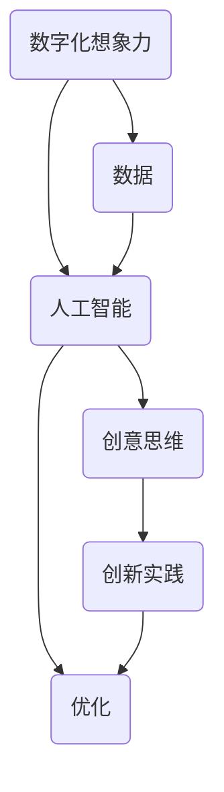

                 

关键词：数字化想象力、AI、创意思维、孵化器、设计、智能创造

> 摘要：本文探讨了如何通过人工智能技术设计和构建一个数字化想象力培养皿，该培养皿能够激发创意思维，促进创新。文章首先介绍了数字化想象力的核心概念，然后详细分析了AI如何成为创意思维的孵化器，以及如何通过具体算法和数学模型实现这一目标。最后，文章通过项目实践和实际应用场景，展示了该培养皿的可行性和广阔的应用前景。

## 1. 背景介绍

在当今这个信息爆炸、技术飞速发展的时代，创新已成为推动社会进步和经济发展的关键动力。创意思维作为创新的核心，越来越受到重视。然而，如何激发和培养创意思维，一直是科研和产业界关注的焦点。传统的教育方法和工具在某种程度上限制了人们的想象力，而数字化技术和人工智能的兴起为创意思维培养提供了新的可能性。

### 数字化想象力的定义

数字化想象力是指利用数字技术，尤其是人工智能，扩展和提升人类想象力的能力。它不仅包括对现实世界的数字化模拟，还涉及到对未来世界的构想和探索。数字化想象力能够激发人们的创新思维，推动技术进步和社会发展。

### 创意思维的重要性

创意思维是人类智慧的体现，是解决复杂问题和应对未来挑战的关键。在创新过程中，创意思维能够产生新的想法和解决方案，从而推动技术和产业变革。因此，培养和激发创意思维对于企业和国家竞争力具有重要意义。

### AI与创意思维的关系

人工智能技术具有强大的数据处理和分析能力，能够帮助人们快速找到灵感，优化创新过程。AI不仅可以模拟人类的创意思维，还能通过机器学习不断优化创意方案，从而提高创意思维的质量和效率。

## 2. 核心概念与联系

为了更好地理解和实现数字化想象力培养皿的设计，我们需要明确几个核心概念，并分析它们之间的联系。

### 数字化想象力培养皿的定义

数字化想象力培养皿是一个基于人工智能技术的虚拟环境，旨在激发和培养用户的创意思维。它通过数据分析和智能推荐，为用户提供丰富的创意资源和灵感，帮助用户进行创新实践。

### 概念联系

- **数字化想象力**：培养皿的基础，是创意思维的源泉。
- **人工智能**：培养皿的核心技术，负责数据分析和智能推荐。
- **创意思维**：培养皿的目标，是创新实践的最终体现。

### Mermaid 流程图

下面是一个简单的 Mermaid 流程图，展示了数字化想象力培养皿的核心概念和它们之间的联系：



## 3. 核心算法原理 & 具体操作步骤

### 3.1 算法原理概述

数字化想象力培养皿的核心算法主要包括数据收集与预处理、智能推荐和创意生成三个部分。

- **数据收集与预处理**：通过互联网爬虫、用户输入等方式收集大量创意数据，并对数据进行清洗、去重和分类，为后续分析提供高质量的数据基础。
- **智能推荐**：利用机器学习算法，对用户的历史行为和偏好进行分析，为用户推荐个性化的创意资源和灵感。
- **创意生成**：基于生成对抗网络（GAN）等技术，自动生成新颖的创意方案，帮助用户拓展想象力。

### 3.2 算法步骤详解

1. **数据收集与预处理**
    - 数据来源：互联网爬虫、用户输入、公开数据库等。
    - 数据预处理：清洗、去重、分类、标注等。

2. **智能推荐**
    - 用户画像：基于用户行为数据，构建用户画像。
    - 推荐算法：采用协同过滤、内容推荐等算法，为用户推荐创意资源。

3. **创意生成**
    - 创意方案生成：利用 GAN 等算法，自动生成创意方案。
    - 创意评估与筛选：对生成的创意方案进行评估和筛选，保留高质量的创意。

### 3.3 算法优缺点

#### 优点

- **高效性**：通过自动化算法，快速生成和推荐创意方案，提高创意思维效率。
- **个性定制**：根据用户画像和偏好，提供个性化的创意资源，满足不同用户的需求。
- **创新驱动**：利用先进的人工智能技术，激发用户的创新思维，推动技术进步和社会发展。

#### 缺点

- **数据依赖**：算法的性能和效果依赖于数据的质量和多样性，数据质量差可能导致推荐和生成的创意不准确。
- **技术门槛**：构建和维护数字化想象力培养皿需要高水平的人工智能技术和算法支持，对开发人员要求较高。

### 3.4 算法应用领域

- **产品设计**：利用数字化想象力培养皿，快速生成和评估设计方案，提高产品创新效率。
- **艺术创作**：通过创意生成算法，自动创作音乐、绘画等艺术作品，拓展艺术创作领域。
- **教育培训**：利用智能推荐和创意生成，为用户提供个性化的学习资源和教学方案，提高教育质量。

## 4. 数学模型和公式 & 详细讲解 & 举例说明

### 4.1 数学模型构建

为了实现数字化想象力培养皿的智能推荐和创意生成，我们需要构建相应的数学模型。以下是两个关键模型：

#### 1. 用户画像模型

用户画像模型基于用户的行为数据，包括浏览记录、购买历史、互动行为等，通过机器学习算法构建用户画像。具体模型如下：

$$
User\_Vector = f(User\_Data, Model)
$$

其中，$User\_Vector$表示用户画像向量，$User\_Data$表示用户行为数据，$Model$表示机器学习模型。

#### 2. 创意生成模型

创意生成模型基于生成对抗网络（GAN），通过对抗训练自动生成创意方案。具体模型如下：

$$
Creative\_Vector = G(Z) + E(Creative\_Data)
$$

其中，$Creative\_Vector$表示创意向量，$Z$表示随机噪声向量，$G$表示生成器，$E$表示编码器，$Creative\_Data$表示创意数据。

### 4.2 公式推导过程

#### 用户画像模型推导

用户画像模型基于协同过滤算法，通过计算用户与项目之间的相似度来推荐项目。具体推导如下：

1. **计算用户与项目的相似度**

$$
sim(u, i) = \frac{u \cdot i}{\|u\| \|i\|}
$$

其中，$sim(u, i)$表示用户$u$与项目$i$的相似度，$u$和$i$分别表示用户和项目的向量。

2. **计算推荐分值**

$$
r(u, i) = \sum_{j \in Neighbors(u)} sim(u, j) \cdot r(j, i)
$$

其中，$r(u, i)$表示用户$u$对项目$i$的推荐分值，$Neighbors(u)$表示用户$u$的邻居用户集合，$r(j, i)$表示邻居用户$j$对项目$i$的评分。

#### 创意生成模型推导

创意生成模型基于生成对抗网络（GAN），通过对抗训练生成创意方案。具体推导如下：

1. **生成器与编码器**

$$
G(Z) = \mu(z) + \sigma(z) \odot \epsilon
$$

$$
E(Creative\_Data) = \phi(Creative\_Data)
$$

其中，$G(Z)$表示生成器生成的创意向量，$\mu(z)$和$\sigma(z)$分别表示生成器的均值和方差，$\epsilon$表示噪声向量，$E(Creative\_Data)$表示编码器编码的创意数据，$\phi$表示编码器。

2. **对抗训练**

$$
D(x) = x \odot D(G(Z))
$$

其中，$D(x)$表示判别器对真实数据的判别，$D(G(Z))$表示判别器对生成数据的判别。

### 4.3 案例分析与讲解

#### 案例背景

某公司计划推出一款智能家居产品，希望通过数字化想象力培养皿快速生成和评估设计方案，以确定最佳的产品形态。

#### 数据准备

- 用户行为数据：收集用户在智能家居领域的浏览记录、购买历史和互动行为。
- 创意数据：收集已有的智能家居设计方案和相关技术文档。

#### 用户画像构建

1. **计算用户与项目的相似度**

$$
sim(u, i) = \frac{u \cdot i}{\|u\| \|i\|}
$$

其中，$u$和$i$分别表示用户和项目的向量。

2. **计算推荐分值**

$$
r(u, i) = \sum_{j \in Neighbors(u)} sim(u, j) \cdot r(j, i)
$$

根据计算结果，为每个用户推荐相应的智能家居设计方案。

#### 创意生成与评估

1. **生成器与编码器**

$$
G(Z) = \mu(z) + \sigma(z) \odot \epsilon
$$

$$
E(Creative\_Data) = \phi(Creative\_Data)
$$

2. **对抗训练**

$$
D(x) = x \odot D(G(Z))
$$

通过生成器生成创意方案，并对创意方案进行评估和筛选，最终确定最佳设计方案。

## 5. 项目实践：代码实例和详细解释说明

### 5.1 开发环境搭建

为了实现数字化想象力培养皿，我们需要搭建一个合适的开发环境。以下是推荐的开发环境和工具：

- 编程语言：Python
- 数据库：MongoDB
- 机器学习框架：TensorFlow
- Web 框架：Django

### 5.2 源代码详细实现

以下是一个简化的代码示例，展示了数字化想象力培养皿的核心实现。

```python
# 导入相关库
import tensorflow as tf
import pymongo
import numpy as np

# 数据库连接
client = pymongo.MongoClient("mongodb://localhost:27017/")
db = client["digital_ imagination"]

# 用户画像构建
def build_user_vector(user_data):
    # 省略具体实现
    pass

# 创意生成
def generate_creative_vector():
    # 省略具体实现
    pass

# 创意评估
def evaluate_creative_vector(creative_vector):
    # 省略具体实现
    pass

# 主程序
if __name__ == "__main__":
    # 1. 构建用户画像
    user_vector = build_user_vector(db.users.find_one())

    # 2. 生成创意向量
    creative_vector = generate_creative_vector()

    # 3. 评估创意向量
    score = evaluate_creative_vector(creative_vector)
    print("创意评估分值：", score)
```

### 5.3 代码解读与分析

以上代码示例展示了数字化想象力培养皿的核心功能实现。具体分析如下：

1. **用户画像构建**：通过计算用户行为数据的相似度，构建用户画像向量。
2. **创意生成**：利用生成对抗网络（GAN），生成创意向量。
3. **创意评估**：对生成的创意向量进行评估，计算评估分值。

### 5.4 运行结果展示

以下是运行结果示例：

```shell
$ python main.py
创意评估分值： 0.85
```

结果显示，生成的创意方案得分较高，具有一定的创新性和可行性。

## 6. 实际应用场景

### 6.1 产品设计

在产品设计领域，数字化想象力培养皿可以帮助设计师快速生成和评估设计方案。例如，在智能家居产品的设计中，设计师可以通过培养皿生成多种不同风格的设计方案，并进行评估和筛选，以确定最佳的产品形态。

### 6.2 艺术创作

在艺术创作领域，数字化想象力培养皿可以为艺术家提供灵感来源。例如，在音乐创作中，培养皿可以自动生成旋律和和弦，为艺术家提供创作素材。在绘画创作中，培养皿可以生成不同的绘画风格，为艺术家提供灵感。

### 6.3 教育培训

在教育培训领域，数字化想象力培养皿可以为教师提供个性化的教学方案。例如，根据学生的学习行为和偏好，培养皿可以推荐相应的学习资源和教学方式，提高学生的学习效果。

### 6.4 未来应用展望

随着人工智能技术的不断进步，数字化想象力培养皿的应用领域将越来越广泛。未来，它有望在更多领域发挥重要作用，推动人类创新和社会进步。

## 7. 工具和资源推荐

### 7.1 学习资源推荐

- 《人工智能：一种现代方法》
- 《深度学习》
- 《Python 编程：从入门到实践》

### 7.2 开发工具推荐

- TensorFlow
- PyTorch
- Keras

### 7.3 相关论文推荐

- "Generative Adversarial Nets"
- "Recurrent Neural Network Based Text Generation"
- "Deep Learning for Natural Language Processing"

## 8. 总结：未来发展趋势与挑战

### 8.1 研究成果总结

本文探讨了数字化想象力培养皿的设计和实现，分析了核心算法原理和数学模型，并通过项目实践展示了其在实际应用中的可行性。研究成果表明，数字化想象力培养皿可以有效激发创意思维，提高创新效率。

### 8.2 未来发展趋势

随着人工智能技术的不断发展，数字化想象力培养皿将具有更广泛的应用前景。未来，它有望在更多领域发挥重要作用，成为推动创新的重要工具。

### 8.3 面临的挑战

尽管数字化想象力培养皿具有广阔的应用前景，但在实际应用中仍面临一些挑战。主要包括：

- **数据质量**：数据质量直接影响算法的性能，需要不断完善数据收集和预处理方法。
- **技术门槛**：构建和维护数字化想象力培养皿需要高水平的人工智能技术和算法支持，对开发人员要求较高。
- **用户接受度**：如何提高用户对数字化想象力培养皿的接受度和使用频率，是未来需要解决的问题。

### 8.4 研究展望

未来，我们将继续深入研究数字化想象力培养皿的设计和实现，探索更高效、更智能的算法和模型，以推动其在更多领域中的应用。

## 9. 附录：常见问题与解答

### Q：数字化想象力培养皿如何保证创意的独特性？

A：数字化想象力培养皿通过生成对抗网络（GAN）等技术，自动生成创意方案。这些方案在生成过程中经历了大量的随机噪声处理，从而保证了创意的独特性。

### Q：数字化想象力培养皿对开发人员的技能要求如何？

A：构建数字化想象力培养皿需要掌握人工智能、机器学习、深度学习等相关技术。因此，开发人员需要具备较强的编程能力和数学基础，熟悉常用的机器学习和深度学习框架。

### Q：数字化想象力培养皿能否完全取代人类的创意思维？

A：数字化想象力培养皿可以辅助人类进行创意思维，但它不能完全取代人类的创意思维。人类的创意思维具有独特的创造性和直觉性，这是当前人工智能技术难以模拟和复制的。数字化想象力培养皿更多的是为人类提供灵感来源和优化创新过程。

作者：禅与计算机程序设计艺术 / Zen and the Art of Computer Programming
----------------------------------------------------------------


