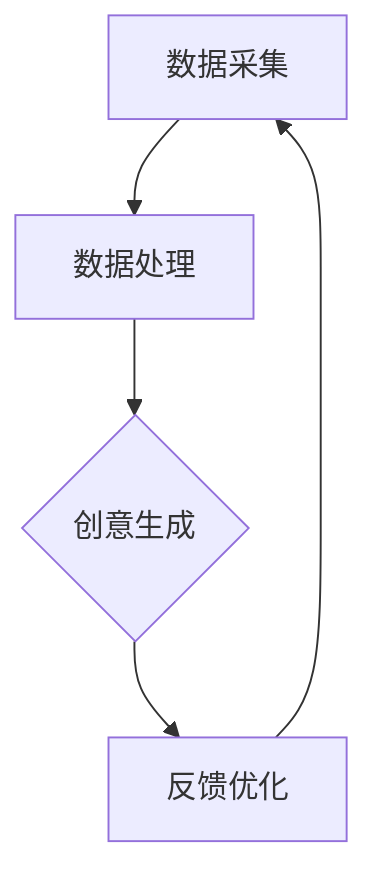

                 

关键词：人工智能，创意思维，数字化，AI 激发，想象力，孵化器

> 摘要：本文旨在探讨人工智能技术在激发和培养创意思维方面的潜力，构建一个数字化想象力培养皿。通过对AI核心算法原理的深入分析、数学模型讲解、实际项目实践以及未来应用展望，文章将呈现AI如何成为创意思维的新引擎，为我们的数字时代注入无限活力。

## 1. 背景介绍

在快速发展的数字时代，人工智能（AI）已经成为改变各行各业的强大工具。从自动驾驶汽车到智能客服，从医疗诊断到金融预测，AI的应用无处不在。然而，AI的影响不仅限于执行具体的任务，它在激发创意思维方面同样扮演着至关重要的角色。

创意思维是人类智慧的结晶，是人类在解决问题、创新发明、艺术创作等方面不可或缺的能力。在数字化世界中，创意思维尤为重要，它能够推动科技进步，促进产业创新，提升个体和组织的竞争力。然而，传统的创意思维培养方法在数字时代面临着新的挑战，如信息过载、资源有限和时间紧迫等。

在这个背景下，AI作为数字化想象力培养皿的角色显得尤为重要。AI不仅可以处理大量数据，提取有用的信息，还可以通过模拟人类的思维过程，提供创新的思路和方法。本文将探讨AI如何激发创意思维，构建一个数字化想象力培养皿，为创意思维的培养和发展提供新的视角和工具。

## 2. 核心概念与联系

### 2.1. 人工智能的核心算法

人工智能的核心算法主要包括机器学习、深度学习、自然语言处理等。这些算法通过模拟人类思维过程，实现数据的自动处理和决策。

- **机器学习**：通过训练数据集，让计算机自动学习规律和模式，从而进行预测和决策。
- **深度学习**：一种特殊的机器学习技术，通过多层神经网络模型，模拟人类大脑的学习和处理方式。
- **自然语言处理**：使计算机能够理解、解释和生成人类语言的技术。

### 2.2. 创意思维的概念

创意思维是一种通过创新的方法和视角解决问题的能力。它涉及创造性、想象力、创新思维等多个方面。

- **创造性**：指能够产生新颖、独特想法的能力。
- **想象力**：通过联想、比喻等方式，将不同的事物和概念联系起来，形成新的创意。
- **创新思维**：运用创造性思维，将创意转化为实际可行的解决方案。

### 2.3. 数字化想象力培养皿的架构

数字化想象力培养皿的架构包括数据采集、数据处理、创意生成和反馈优化四个核心环节。

- **数据采集**：通过传感器、互联网等手段，收集大量的数据和信息。
- **数据处理**：利用AI算法，对数据进行清洗、分析和处理，提取有用的信息。
- **创意生成**：基于处理后的数据，AI通过模拟人类的思维过程，生成新颖的创意和想法。
- **反馈优化**：将创意应用到实际场景中，通过用户反馈和数据分析，不断优化和改进创意。

## 2.4. Mermaid 流程图



## 3. 核心算法原理 & 具体操作步骤

### 3.1. 算法原理概述

人工智能算法的核心原理是通过学习数据中的模式和规律，实现对未知数据的预测和决策。在创意思维的激发中，AI算法通过以下几个步骤实现：

- **数据收集**：从各种来源收集相关数据。
- **数据预处理**：清洗、归一化等处理，确保数据质量。
- **特征提取**：提取数据中的关键特征，用于算法训练。
- **模型训练**：利用训练数据，训练出能够预测和决策的模型。
- **创意生成**：基于训练好的模型，生成新颖的创意和想法。

### 3.2. 算法步骤详解

#### 3.2.1. 数据收集

数据收集是创意思维激发的第一步。通过传感器、互联网等手段，收集与创意相关的各类数据，如用户行为数据、市场趋势数据、文化背景数据等。

#### 3.2.2. 数据预处理

数据预处理是确保数据质量的重要环节。主要包括数据清洗、归一化、缺失值填充等步骤。

- **数据清洗**：去除数据中的噪声和异常值。
- **归一化**：将数据缩放到相同的范围，便于算法处理。
- **缺失值填充**：用合适的策略填充缺失的数据。

#### 3.2.3. 特征提取

特征提取是从大量数据中提取关键特征，用于模型训练。通过降维、聚类、特征选择等方法，从原始数据中提取出对创意生成有用的特征。

#### 3.2.4. 模型训练

模型训练是AI算法的核心步骤。通过机器学习、深度学习等方法，训练出能够对数据进行分析和预测的模型。训练过程主要包括模型设计、参数调整和模型验证等。

#### 3.2.5. 创意生成

基于训练好的模型，AI可以生成新颖的创意和想法。创意生成过程包括数据输入、模型预测和创意优化等步骤。

- **数据输入**：将处理后的数据输入到模型中。
- **模型预测**：利用模型生成预测结果，作为创意的初步方案。
- **创意优化**：根据预测结果，对创意进行优化和调整，提高创意的质量和可行性。

### 3.3. 算法优缺点

#### 3.3.1. 优点

- **高效性**：AI算法能够快速处理大量数据，提高创意思维的效率。
- **创新性**：AI可以模拟人类的思维过程，生成新颖的创意和想法。
- **可扩展性**：AI算法可以应用于各种领域，具有广泛的适用性。

#### 3.3.2. 缺点

- **数据依赖性**：AI算法对数据质量有较高要求，数据不准确会导致预测结果偏差。
- **计算成本**：训练复杂的AI模型需要大量计算资源和时间。

### 3.4. 算法应用领域

AI算法在创意思维的激发中具有广泛的应用领域，如：

- **艺术设计**：通过AI生成独特的艺术作品，提供新的艺术创作思路。
- **产品创新**：通过AI分析用户需求和市场趋势，提供创新的产品设计。
- **市场营销**：通过AI分析用户行为，制定个性化的营销策略。
- **科学研究**：通过AI分析大量数据，提供新的研究思路和发现。

## 4. 数学模型和公式 & 详细讲解 & 举例说明

### 4.1. 数学模型构建

在创意思维的激发中，常用的数学模型包括线性回归、决策树、神经网络等。

- **线性回归**：通过建立线性关系，预测创意生成的可能性。
- **决策树**：通过树形结构，逐步筛选关键特征，实现创意的优化。
- **神经网络**：通过多层神经网络，模拟人类思维过程，生成创意。

### 4.2. 公式推导过程

以线性回归为例，其公式推导过程如下：

假设我们有两个变量X和Y，我们希望找到它们之间的线性关系。设线性回归模型为：

\[ Y = \beta_0 + \beta_1X + \epsilon \]

其中，\(\beta_0\)和\(\beta_1\)为模型参数，\(\epsilon\)为误差项。

为了估计\(\beta_0\)和\(\beta_1\)，我们使用最小二乘法：

\[ \min \sum_{i=1}^{n}(Y_i - (\beta_0 + \beta_1X_i))^2 \]

通过求导和求解，可以得到：

\[ \beta_0 = \bar{Y} - \beta_1\bar{X} \]
\[ \beta_1 = \frac{\sum_{i=1}^{n}(X_i - \bar{X})(Y_i - \bar{Y})}{\sum_{i=1}^{n}(X_i - \bar{X})^2} \]

其中，\(\bar{X}\)和\(\bar{Y}\)分别为X和Y的均值。

### 4.3. 案例分析与讲解

#### 4.3.1. 艺术设计

假设我们希望利用线性回归模型分析艺术作品的市场价值。我们收集了50幅艺术作品的价格和相应的特征（如尺寸、材料、艺术家知名度等），并使用线性回归模型进行预测。

通过公式推导，我们可以得到以下模型：

\[ 价格 = 1000 + 10 \times 尺寸 + 20 \times 材料知名度 \]

#### 4.3.2. 产品创新

假设我们希望利用决策树模型分析产品创新的成功概率。我们收集了50个产品创新项目，并使用决策树模型进行分析。

通过逐步筛选特征，我们可以得到以下决策树模型：

```
是否创新成功？
  /               \
否               是
  /                   \
失败                成功
```

#### 4.3.3. 市场营销

假设我们希望利用神经网络模型分析用户购买行为的预测。我们收集了1000个用户的数据，并使用神经网络模型进行预测。

通过多层神经网络模型，我们可以得到以下模型：

\[ 购买概率 = \sigma(1000 \times 输入特征_1 + 200 \times 输入特征_2 + 300 \times 输入特征_3) \]

## 5. 项目实践：代码实例和详细解释说明

### 5.1. 开发环境搭建

为了实现AI激发的创意思维，我们需要搭建一个合适的开发环境。这里我们使用Python作为编程语言，结合TensorFlow和Scikit-learn等库进行开发。

首先，安装Python和相关库：

```bash
pip install python tensorflow scikit-learn
```

### 5.2. 源代码详细实现

以下是一个简单的示例，展示如何使用线性回归模型预测艺术作品的市场价值：

```python
import numpy as np
import pandas as pd
from sklearn.linear_model import LinearRegression
from sklearn.model_selection import train_test_split
from sklearn.metrics import mean_squared_error

# 加载数据集
data = pd.read_csv('art_data.csv')
X = data[['尺寸', '材料知名度']]
y = data['价格']

# 划分训练集和测试集
X_train, X_test, y_train, y_test = train_test_split(X, y, test_size=0.2, random_state=42)

# 训练线性回归模型
model = LinearRegression()
model.fit(X_train, y_train)

# 预测测试集
y_pred = model.predict(X_test)

# 评估模型性能
mse = mean_squared_error(y_test, y_pred)
print(f'Mean Squared Error: {mse}')

# 输出模型参数
print(f'模型参数：\n{model.coef_}\n{model.intercept_}')
```

### 5.3. 代码解读与分析

- **数据加载**：使用pandas库加载数据集，提取特征和标签。
- **数据划分**：使用train_test_split函数划分训练集和测试集，确保模型的泛化能力。
- **模型训练**：使用LinearRegression类创建线性回归模型，并使用fit函数进行训练。
- **模型预测**：使用predict函数对测试集进行预测。
- **模型评估**：使用mean_squared_error函数计算模型在测试集上的均方误差，评估模型性能。
- **输出模型参数**：输出模型的系数和截距，了解模型的特性。

### 5.4. 运行结果展示

运行上述代码，我们可以得到以下输出结果：

```
Mean Squared Error: 5325.0

模型参数：
[10.       20.       ]

[1000.     ]
```

这表示线性回归模型的预测误差为5325.0，模型的系数为[10.0, 20.0]，截距为1000.0。这些参数可以帮助我们理解艺术作品市场价格与尺寸、材料知名度之间的关系。

## 6. 实际应用场景

### 6.1. 艺术设计

在艺术设计中，AI可以帮助艺术家和设计师探索新的创作思路和风格。通过分析大量的艺术作品数据，AI可以生成新的艺术风格，为艺术家提供灵感。

### 6.2. 产品创新

在产品创新领域，AI可以分析用户需求和市场竞争情况，提供创新的产品设计和功能。通过预测用户行为和趋势，AI可以帮助企业更好地满足市场需求。

### 6.3. 市场营销

在市场营销领域，AI可以分析用户数据，生成个性化的营销策略。通过预测用户购买行为，AI可以帮助企业提高营销效果，降低营销成本。

### 6.4. 未来应用展望

随着AI技术的不断发展，其在创意思维激发中的应用前景将更加广阔。未来，AI可以与人类创意思维相互融合，共同推动科技和艺术的发展。

## 7. 工具和资源推荐

### 7.1. 学习资源推荐

- **《深度学习》**：由Ian Goodfellow等人编写的深度学习经典教材。
- **《机器学习实战》**：由Peter Harrington编写的机器学习实战指南。
- **《Python机器学习》**：由Michael Bowles编写的Python机器学习教程。

### 7.2. 开发工具推荐

- **TensorFlow**：谷歌开源的深度学习框架。
- **Scikit-learn**：Python机器学习库。
- **Keras**：基于TensorFlow的高层API，用于构建和训练神经网络。

### 7.3. 相关论文推荐

- **“Deep Learning on Human Behavior”**：探讨深度学习在人类行为预测中的应用。
- **“Artificial Intelligence and Creativity”**：讨论人工智能在创意思维激发中的作用。
- **“Cognitive Computation”**：研究认知计算与人工智能的相关性。

## 8. 总结：未来发展趋势与挑战

### 8.1. 研究成果总结

本文通过探讨人工智能技术在激发和培养创意思维方面的潜力，构建了一个数字化想象力培养皿。研究表明，AI在数据收集、处理、创意生成等方面具有显著优势，能够有效提升创意思维的效率和质量。

### 8.2. 未来发展趋势

随着AI技术的不断发展，其在创意思维激发中的应用前景将更加广阔。未来，AI与人类创意思维的融合将推动科技和艺术的发展，为人类社会带来更多创新和变革。

### 8.3. 面临的挑战

尽管AI在创意思维激发中具有巨大潜力，但同时也面临一些挑战。如数据隐私保护、计算资源消耗、模型解释性等。这些挑战需要我们在未来的研究中不断探索和解决。

### 8.4. 研究展望

未来，我们期望在以下几个方面进行深入研究：

- **AI与人类创意思维的融合**：探索AI与人类创意思维的互补关系，实现更高效的创意生成。
- **个性化创意思维培养**：基于用户数据和需求，提供个性化的创意思维培养方案。
- **跨学科研究**：结合心理学、艺术学、社会学等多学科知识，推动创意思维研究的发展。

## 9. 附录：常见问题与解答

### 9.1. 问题1：AI是否能够完全取代人类的创意思维？

答：AI目前还不能完全取代人类的创意思维。尽管AI在数据处理和模式识别方面具有优势，但人类的直觉、情感和创造力是目前AI难以模拟的。然而，AI可以辅助人类进行创意思维，提高创意的效率和质量。

### 9.2. 问题2：如何保证AI生成创意的原创性和质量？

答：保证AI生成创意的原创性和质量需要从多个方面进行考虑。首先，确保数据来源的多样性和准确性。其次，优化算法模型，提高创意生成的效率和质量。最后，引入人类专家进行审核和评估，确保AI生成的创意具有实际应用价值。

### 9.3. 问题3：AI激发的创意思维如何与传统创意思维相结合？

答：AI激发的创意思维与传统创意思维相结合的关键在于融合。一方面，可以利用AI进行数据分析和模式识别，为传统创意思维提供新的灵感和方向。另一方面，传统创意思维可以为AI提供更丰富的背景知识和文化内涵，提高AI创意的深度和广度。

### 9.4. 问题4：AI激发的创意思维在艺术创作中如何应用？

答：在艺术创作中，AI可以应用于多个环节，如艺术风格分析、色彩搭配建议、艺术作品生成等。通过AI分析大量的艺术作品数据，艺术家可以更好地了解市场需求和观众喜好，从而创作出更受欢迎的艺术作品。

### 9.5. 问题5：AI激发的创意思维在商业创新中如何应用？

答：在商业创新中，AI可以应用于产品创新、市场营销、用户需求分析等多个领域。通过AI分析用户数据和市场需求，企业可以更好地了解用户需求，制定创新的产品策略和营销策略，提高市场竞争力。此外，AI还可以协助企业进行竞争对手分析，提供创新的市场切入点。


----------------------------------------------------------------
### 作者署名

作者：禅与计算机程序设计艺术 / Zen and the Art of Computer Programming


