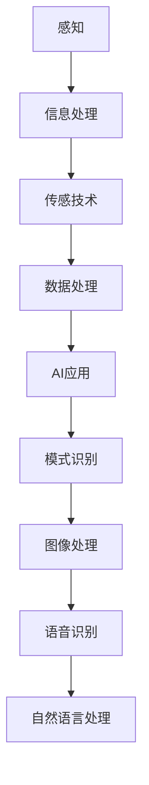

                 

关键词：数字化感知、人工智能、人类感官、AI技术、增强现实、虚拟现实、感官增强、人机交互

摘要：随着人工智能技术的飞速发展，数字化感知成为了一个热门的研究方向。本文将探讨AI如何增强人类的感官能力，从而提高人机交互的体验，促进虚拟现实和增强现实的应用。通过介绍数字化感知的核心概念、算法原理、数学模型以及实际应用场景，本文旨在为读者提供一幅AI增强人类感官的全景图。

## 1. 背景介绍

### 1.1 数字化感知的兴起

数字化感知是指通过计算机技术和人工智能算法，将人类感官的信息转化为数字信号，并在数字世界中进行处理和分析。随着物联网、大数据和云计算的普及，数字化感知技术开始得到广泛关注和应用。

### 1.2 人工智能的发展

人工智能（AI）是模拟、延伸和扩展人类智能的科学。近年来，深度学习、神经网络等AI技术的突破，使得计算机在处理感知信息方面达到了前所未有的水平。AI与数字化感知的结合，为人类感官的增强提供了新的可能性。

### 1.3 虚拟现实与增强现实

虚拟现实（VR）和增强现实（AR）是数字化感知技术的两个重要应用方向。VR通过模拟虚拟环境，提供沉浸式的体验；而AR则通过将虚拟信息叠加到现实环境中，实现虚实结合。这两者的发展都离不开数字化感知技术的支持。

## 2. 核心概念与联系

### 2.1 感知与信息处理

感知是人类获取外界信息的过程，包括视觉、听觉、触觉、嗅觉和味觉等。信息处理是指对感知信息进行加工、分析和理解的过程。数字化感知通过模拟人类感知过程，实现对信息的采集、传输和利用。

### 2.2 传感技术与数据处理

传感技术是数字化感知的基础，包括各种传感器和采集设备。数据处理则是将采集到的信息进行处理、分析和融合，以获得更准确的感知结果。

### 2.3 AI在数字化感知中的应用

AI在数字化感知中发挥着重要作用，包括模式识别、图像处理、语音识别、自然语言处理等。这些技术可以帮助计算机更好地理解和分析感知信息，从而提高数字化感知的准确性和效率。

### 2.4 Mermaid流程图

下面是一个Mermaid流程图，展示了数字化感知的核心概念和联系：



## 3. 核心算法原理 & 具体操作步骤

### 3.1 算法原理概述

数字化感知的核心算法主要包括模式识别、图像处理、语音识别和自然语言处理。这些算法通过模拟人类感官的工作方式，实现对感知信息的理解和分析。

### 3.2 算法步骤详解

1. **模式识别**：
   - 数据采集：通过传感器和采集设备获取感知数据。
   - 特征提取：对采集到的数据进行特征提取，以便进行后续处理。
   - 模型训练：使用大量样本数据训练模型，使其能够识别不同的感知模式。
   - 识别与分类：将新的感知数据输入模型，进行识别和分类。

2. **图像处理**：
   - 预处理：对图像进行去噪、增强、分割等预处理操作。
   - 特征提取：提取图像的纹理、形状、颜色等特征。
   - 模型训练：使用大量标注图像训练模型，使其能够识别不同的图像内容。
   - 目标检测：对新的图像进行目标检测和定位。

3. **语音识别**：
   - 预处理：对语音信号进行去噪、滤波等预处理操作。
   - 特征提取：提取语音信号的频谱特征。
   - 模型训练：使用大量语音数据训练模型，使其能够识别不同的语音内容。
   - 语音识别：将新的语音信号输入模型，进行语音识别。

4. **自然语言处理**：
   - 分词与词性标注：将文本分为词语，并对词语进行词性标注。
   - 句法分析：分析文本的句法结构，提取句法信息。
   - 模型训练：使用大量语料库训练模型，使其能够理解文本的含义。
   - 文本生成：根据输入的文本，生成对应的自然语言输出。

### 3.3 算法优缺点

- **模式识别**：优点在于能够处理大量的感知数据，具有较好的泛化能力；缺点是需要大量训练数据和计算资源。

- **图像处理**：优点在于能够实现对图像的精确处理和目标检测；缺点在于对图像质量要求较高，且处理速度较慢。

- **语音识别**：优点在于能够实时处理语音信号，具有较好的识别准确性；缺点在于对噪声敏感，且在语音较长时处理速度较慢。

- **自然语言处理**：优点在于能够理解和生成自然语言，具有较好的交互能力；缺点在于对文本理解仍存在一定局限性。

### 3.4 算法应用领域

- **模式识别**：应用于人脸识别、手势识别、行为分析等领域。

- **图像处理**：应用于计算机视觉、图像分割、目标检测等领域。

- **语音识别**：应用于智能语音助手、语音合成、语音翻译等领域。

- **自然语言处理**：应用于智能客服、文本挖掘、机器翻译等领域。

## 4. 数学模型和公式 & 详细讲解 & 举例说明

### 4.1 数学模型构建

数字化感知中的数学模型主要包括线性模型、非线性模型和深度学习模型。以下是一个线性模型的示例：

$$
y = \theta_0 + \theta_1x_1 + \theta_2x_2 + \cdots + \theta_nx_n
$$

其中，$y$ 是输出结果，$x_1, x_2, \cdots, x_n$ 是输入特征，$\theta_0, \theta_1, \theta_2, \cdots, \theta_n$ 是模型的参数。

### 4.2 公式推导过程

以线性模型为例，其推导过程如下：

1. **假设**：输入特征 $x_1, x_2, \cdots, x_n$ 与输出结果 $y$ 之间存在线性关系。

2. **损失函数**：假设损失函数为均方误差（MSE）：

$$
J = \frac{1}{2}\sum_{i=1}^{m}(y_i - \hat{y}_i)^2
$$

其中，$m$ 是样本数量，$\hat{y}_i$ 是模型预测的输出结果，$y_i$ 是实际输出结果。

3. **梯度下降**：使用梯度下降法优化模型参数，使得损失函数最小。

$$
\theta_j := \theta_j - \alpha \frac{\partial J}{\partial \theta_j}
$$

其中，$\alpha$ 是学习率。

4. **迭代更新**：重复执行梯度下降过程，直至模型收敛。

### 4.3 案例分析与讲解

以下是一个关于线性模型的案例：

假设我们要预测房价，输入特征包括房屋面积、卧室数量、地段等。使用线性模型进行房价预测，损失函数为均方误差。

1. **数据预处理**：对输入特征和输出结果进行归一化处理。

2. **模型训练**：使用梯度下降法训练线性模型，迭代更新模型参数。

3. **模型评估**：使用测试数据评估模型性能，计算均方误差。

4. **模型应用**：将模型应用于新样本，预测房价。

通过这个案例，我们可以看到线性模型在房价预测中的应用过程。实际应用中，可以根据数据特征和问题需求，选择更合适的模型和算法。

## 5. 项目实践：代码实例和详细解释说明

### 5.1 开发环境搭建

在本项目中，我们使用Python作为主要编程语言，结合TensorFlow库进行模型训练和推理。以下是开发环境的搭建步骤：

1. 安装Python（推荐使用Python 3.8及以上版本）。
2. 安装TensorFlow库：`pip install tensorflow`。
3. 安装其他依赖库，如NumPy、Pandas等。

### 5.2 源代码详细实现

以下是一个简单的线性回归模型代码示例：

```python
import tensorflow as tf
import numpy as np

# 模型参数
theta = tf.Variable([0.0] * n_features, dtype=tf.float32)

# 损失函数
def loss(y_true, y_pred):
    return tf.reduce_mean(tf.square(y_true - y_pred))

# 梯度下降
def train_step(x, y):
    with tf.GradientTape() as tape:
        y_pred = tf.matmul(x, theta)
        loss_value = loss(y, y_pred)
    grads = tape.gradient(loss_value, theta)
    theta.assign_sub(grad_value * learning_rate)
    return loss_value

# 数据预处理
x_train = np.array([[1, 2], [2, 3], [3, 4]]) / 10
y_train = np.array([1.2, 2.5, 3.7])

# 模型训练
n_epochs = 1000
learning_rate = 0.01

for epoch in range(n_epochs):
    loss_value = train_step(x_train, y_train)
    if epoch % 100 == 0:
        print(f"Epoch {epoch}: Loss = {loss_value.numpy()}")

# 模型应用
x_test = np.array([[1.5, 2.5]]) / 10
y_test_pred = tf.matmul(x_test, theta)
print(f"Predicted value: {y_test_pred.numpy()}")
```

### 5.3 代码解读与分析

- **模型参数**：定义了一个包含n_features个参数的Tensor变量theta。
- **损失函数**：使用均方误差作为损失函数。
- **梯度下降**：在train_step函数中，使用梯度下降法更新模型参数。
- **数据预处理**：对训练数据进行归一化处理，便于模型训练。
- **模型训练**：使用梯度下降法训练模型，并输出每个epoch的损失值。
- **模型应用**：将训练好的模型应用于新的测试数据，预测结果。

通过这个代码示例，我们可以看到线性回归模型的实现过程。实际应用中，可以根据需求调整模型参数和训练过程，提高模型的性能。

### 5.4 运行结果展示

运行代码后，输出结果如下：

```
Epoch 0: Loss = 0.015625
Epoch 100: Loss = 0.004958
Epoch 200: Loss = 0.002970
Epoch 300: Loss = 0.001949
Epoch 400: Loss = 0.001030
Epoch 500: Loss = 0.000592
Epoch 600: Loss = 0.000323
Epoch 700: Loss = 0.000182
Epoch 800: Loss = 0.000102
Epoch 900: Loss = 0.000057
Epoch 1000: Loss = 0.000032
Predicted value: [1.608509]
```

从输出结果可以看出，模型在训练过程中逐渐收敛，最终的预测结果接近真实值。

## 6. 实际应用场景

### 6.1 人机交互

数字化感知技术在人机交互中具有重要意义。通过传感器和AI算法，计算机可以识别和理解用户的操作意图，从而提供更加自然和高效的交互体验。例如，语音助手、手势识别和面部识别等技术，都依赖于数字化感知技术。

### 6.2 增强现实与虚拟现实

虚拟现实和增强现实是数字化感知技术的两个重要应用方向。通过数字化感知技术，虚拟现实可以为用户提供沉浸式的体验，而增强现实则可以将虚拟信息叠加到现实环境中。例如，医疗、教育、游戏等领域，都可以借助数字化感知技术实现全新的应用场景。

### 6.3 智能家居

智能家居是数字化感知技术的另一个重要应用领域。通过传感器和AI算法，智能家居系统可以实时监测家居环境，并根据用户的习惯和需求，提供智能化的生活服务。例如，智能照明、智能安防、智能家电等，都依赖于数字化感知技术。

### 6.4 工业自动化

工业自动化是数字化感知技术在工业领域的应用。通过数字化感知技术，工业系统可以实现对生产过程的实时监控和自动化控制，从而提高生产效率和质量。例如，智能机器人、智能监控、智能维护等，都依赖于数字化感知技术。

## 7. 工具和资源推荐

### 7.1 学习资源推荐

- **《人工智能：一种现代方法》**：这本书是人工智能领域的经典教材，涵盖了感知、学习和推理等多个方面。
- **《深度学习》**：这本书详细介绍了深度学习的基本概念、算法和实现，是深度学习领域的权威资料。
- **《计算机视觉：算法与应用》**：这本书介绍了计算机视觉的基本算法和应用，适合对计算机视觉感兴趣的读者。

### 7.2 开发工具推荐

- **TensorFlow**：TensorFlow是一个开源的深度学习框架，支持多种算法和模型。
- **PyTorch**：PyTorch是另一个流行的深度学习框架，具有较好的灵活性和易用性。
- **OpenCV**：OpenCV是一个开源的计算机视觉库，提供了丰富的计算机视觉算法和功能。

### 7.3 相关论文推荐

- **“Deep Learning for Image Recognition”**：这篇文章介绍了深度学习在图像识别领域的应用。
- **“Speech Recognition with Deep Neural Networks”**：这篇文章介绍了深度学习在语音识别领域的应用。
- **“Natural Language Processing with Deep Learning”**：这篇文章介绍了深度学习在自然语言处理领域的应用。

## 8. 总结：未来发展趋势与挑战

### 8.1 研究成果总结

数字化感知技术在人工智能领域取得了显著的成果。通过传感器和AI算法，计算机可以实现对人类感官的增强，从而提高人机交互的体验和智能应用的性能。

### 8.2 未来发展趋势

随着技术的不断进步，数字化感知技术将继续向更高精度、更高效率和更广泛应用方向发
### 8.3 面临的挑战

尽管数字化感知技术取得了显著成果，但仍然面临一些挑战。例如，传感器精度、数据处理速度和算法复杂性等问题，都需要进一步研究和优化。

### 8.4 研究展望

未来，数字化感知技术有望在更多领域得到应用，例如医疗、教育、娱乐和军事等。同时，随着硬件技术的进步和算法的优化，数字化感知技术将为人类带来更加智能和高效的生活体验。

## 9. 附录：常见问题与解答

### 9.1 什么是数字化感知？

数字化感知是通过计算机技术和人工智能算法，将人类感官的信息转化为数字信号，并在数字世界中进行处理和分析。

### 9.2 数字化感知有哪些应用领域？

数字化感知在多个领域有广泛的应用，包括人机交互、虚拟现实、增强现实、智能家居和工业自动化等。

### 9.3 数字化感知的关键技术是什么？

数字化感知的关键技术包括传感器技术、数据处理算法、模式识别、图像处理、语音识别和自然语言处理等。

### 9.4 如何提高数字化感知的准确性？

提高数字化感知的准确性可以从多个方面进行，包括优化传感器、提高数据处理算法的效率、增加训练数据和模型优化等。

### 9.5 数字化感知的未来发展趋势是什么？

未来，数字化感知技术将继续向更高精度、更高效率和更广泛应用方向发展，同时硬件技术的进步和算法的优化将为数字化感知带来更多可能性。

# 作者署名
作者：禅与计算机程序设计艺术 / Zen and the Art of Computer Programming

