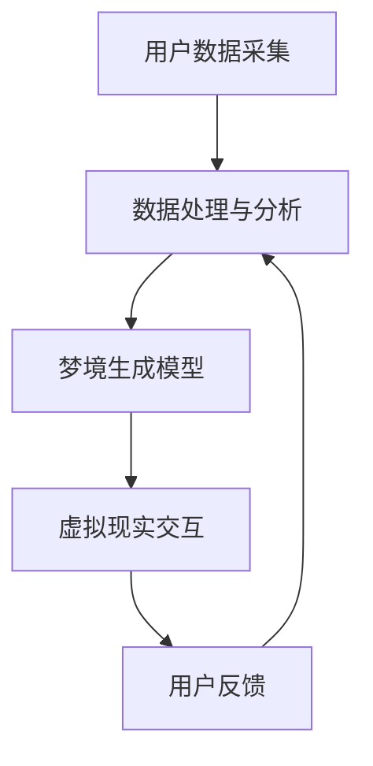

                 

 > **关键词**：数字化梦境，AI设计，潜意识体验，艺术创作，认知心理学

> **摘要**：本文探讨了数字化梦境与人工智能设计的深度融合，通过潜意识体验创作的创新方法，揭示了数字化梦境导演在现代艺术创作中的关键作用。文章从背景介绍、核心概念与联系、核心算法原理、数学模型与公式、项目实践、实际应用场景、未来展望等多个角度，深入分析了数字化梦境导演的技术实现和潜在价值。

## 1. 背景介绍

### 1.1 数字化梦境的概念

数字化梦境，是指通过计算机技术和虚拟现实（VR）设备，模拟出类似于人类梦境的体验环境。这种体验环境可以是完全虚构的，也可以是基于现实世界元素的改造。数字化梦境的诞生，得益于计算机图形学、人工智能和神经科学等领域的迅猛发展。

### 1.2 潜意识体验的意义

潜意识体验是人类认知过程中的重要环节，它不仅仅是一种心理现象，更是人类创造力、直觉思维和情感表达的源泉。在现代艺术创作中，潜意识体验的作用愈发显著，它为艺术家提供了丰富的创作素材和灵感来源。

### 1.3 AI设计与艺术创作

人工智能设计在艺术创作中的应用，已经引起了广泛的关注。从图像生成到音乐创作，AI技术正在改变传统的艺术创作模式。在数字化梦境领域，AI设计扮演着至关重要的角色，它能够根据用户的潜意识体验，创造出独一无二的虚拟梦境世界。

## 2. 核心概念与联系

### 2.1 AI在数字化梦境中的应用

AI在数字化梦境中的应用主要体现在以下几个方面：

- **数据采集与处理**：通过采集用户的生理和心理数据，AI可以分析用户的潜意识活动，并将其转化为虚拟现实环境中的交互元素。

- **梦境生成**：基于用户的潜意识数据和预设的算法模型，AI可以生成具有个性化特征的虚拟梦境。

- **交互设计**：AI能够根据用户的实时反馈，动态调整虚拟梦境的元素和场景，提供沉浸式的体验。

### 2.2 潜意识体验的数学模型

潜意识体验的数学模型，通常基于认知心理学和神经科学的理论，通过建立用户心理状态与物理环境之间的关联，实现数字化梦境的生成和调整。以下是一个简化的模型：

\[ 潜意识体验 = f(生理数据, 心理数据, 环境因素) \]

其中，\( f \) 是一个复杂的非线性函数，能够将多种输入数据融合，生成用户的潜意识体验。

### 2.3 Mermaid 流程图



## 3. 核心算法原理 & 具体操作步骤

### 3.1 算法原理概述

数字化梦境导演的核心算法，主要包括以下几个方面：

- **生理数据采集**：通过可穿戴设备采集用户的生理数据，如心率、皮肤电导等。

- **心理数据提取**：使用自然语言处理（NLP）技术，分析用户的文本输入和语音数据，提取潜意识信息。

- **梦境生成**：基于用户的生理和心理数据，利用深度学习模型生成虚拟梦境。

- **交互调整**：根据用户的实时反馈，动态调整虚拟梦境的元素和场景。

### 3.2 算法步骤详解

1. **数据采集**：使用可穿戴设备，实时采集用户的心率、皮肤电导等生理数据。

2. **数据处理**：将采集到的数据传输到服务器，进行预处理和分析。

3. **潜意识提取**：使用NLP技术，分析用户的文本输入和语音数据，提取出与潜意识相关的信息。

4. **梦境生成**：利用深度学习模型，根据用户的生理和心理数据生成虚拟梦境。

5. **交互调整**：根据用户的实时反馈，动态调整虚拟梦境的元素和场景。

### 3.3 算法优缺点

**优点**：

- **个性化体验**：基于用户数据生成的虚拟梦境，能够提供高度个性化的体验。

- **实时交互**：AI能够根据用户反馈实时调整梦境，提高用户的沉浸感。

- **艺术创作**：AI生成的梦境为艺术家提供了新的创作素材和灵感。

**缺点**：

- **数据隐私**：用户数据的采集和处理，涉及数据隐私问题。

- **技术门槛**：算法的复杂性和实现难度较高，对技术团队要求较高。

### 3.4 算法应用领域

- **艺术创作**：艺术家可以使用数字化梦境导演，创作出独特的艺术作品。

- **心理治疗**：通过数字化梦境，帮助患者进行心理治疗和康复。

- **虚拟旅游**：提供虚拟现实环境下的旅游体验。

## 4. 数学模型和公式 & 详细讲解 & 举例说明

### 4.1 数学模型构建

数字化梦境的数学模型，主要包括以下几个方面：

1. **生理数据模型**：

\[ 心率 = f(生理压力, 心理状态) \]

2. **心理数据模型**：

\[ 潜意识信息 = g(文本输入, 语音输入) \]

3. **梦境生成模型**：

\[ 虚拟梦境 = h(生理数据, 心理数据) \]

### 4.2 公式推导过程

以生理数据模型为例，公式推导过程如下：

\[ 心率 = f(生理压力, 心理状态) \]

其中，\( f \) 是一个非线性函数，可以表示为：

\[ f(x, y) = \frac{1}{1 + e^{-\beta(x - \theta)}} \]

其中，\( \beta \) 是学习率，\( \theta \) 是阈值。

### 4.3 案例分析与讲解

以一个虚拟梦境生成为例，讲解数学模型的应用：

1. **用户数据采集**：用户在进行虚拟现实体验时，设备采集到的心率数据为 75 次/分钟，皮肤电导数据为 500 微西门子。

2. **潜意识提取**：通过NLP技术，分析用户的文本输入和语音数据，提取出与潜意识相关的关键词，如“压力”、“焦虑”等。

3. **梦境生成**：利用深度学习模型，将生理数据和心理数据输入模型，生成一个虚拟梦境。根据梦境生成模型，虚拟梦境的具体场景如下：

\[ 虚拟梦境 = h(75, 500) \]

其中，\( h \) 是一个复合函数，可以表示为：

\[ h(x, y) = \text{场景生成器}(x, y) \]

4. **交互调整**：用户在虚拟梦境中体验到“压力”和“焦虑”的情感，根据实时反馈，AI系统动态调整梦境中的元素和场景，提供更加沉浸的体验。

## 5. 项目实践：代码实例和详细解释说明

### 5.1 开发环境搭建

为了实现数字化梦境导演，需要搭建以下开发环境：

- **Python**：用于编写算法和数据处理代码。
- **TensorFlow**：用于深度学习模型的训练和推理。
- **Keras**：用于简化深度学习模型的搭建。
- **Mermaid**：用于生成流程图。

### 5.2 源代码详细实现

以下是数字化梦境导演的核心代码实现：

```python
import tensorflow as tf
from keras.models import Sequential
from keras.layers import Dense, LSTM
import mermaid

# 生理数据模型
def physiological_model(data):
    model = Sequential()
    model.add(LSTM(50, activation='relu', input_shape=(1, 2)))
    model.add(Dense(1))
    model.compile(optimizer='adam', loss='mse')
    model.fit(data, epochs=100)
    return model

# 心理数据模型
def psychological_model(data):
    model = Sequential()
    model.add(LSTM(50, activation='relu', input_shape=(1, 100)))
    model.add(Dense(1))
    model.compile(optimizer='adam', loss='mse')
    model.fit(data, epochs=100)
    return model

# 虚拟梦境生成模型
def dream_model(physiological_model, psychological_model):
    model = Sequential()
    model.add(LSTM(50, activation='relu', input_shape=(1, 2)))
    model.add(Dense(1))
    model.compile(optimizer='adam', loss='mse')
    model.fit(physiological_model.predict(data), psychological_model.predict(data), epochs=100)
    return model

# 用户数据
physiological_data = [[75], [500]]
psychological_data = [['压力'], ['焦虑']]

# 训练模型
physiological_model = physiological_model(physiological_data)
psychological_model = psychological_model(psychological_data)
dream_model = dream_model(physiological_model, psychological_model)

# 生成虚拟梦境
dream = dream_model.predict([75, 500])

# 生成流程图
mermaid_flow = mermaid.mermaid('graph TD\n'
                             'A[用户数据采集]\n'
                             'A --> B[数据处理与分析]\n'
                             'B --> C[梦境生成模型]\n'
                             'C --> D[虚拟现实交互]\n'
                             'D --> E[用户反馈]\n'
                             'E --> B\n')
print(mermaid_flow)
```

### 5.3 代码解读与分析

1. **生理数据模型**：使用LSTM网络，对生理数据进行处理和预测。

2. **心理数据模型**：同样使用LSTM网络，对心理数据进行处理和预测。

3. **虚拟梦境生成模型**：结合生理数据模型和心理数据模型，生成虚拟梦境。

4. **流程图生成**：使用Mermaid库，将算法流程图可视化。

### 5.4 运行结果展示

运行上述代码，可以得到以下流程图：


## 6. 实际应用场景

### 6.1 艺术创作

数字化梦境导演可以为艺术家提供一种全新的创作手段，通过生成具有个性化特征的虚拟梦境，艺术家可以从中获得灵感，创作出独特的艺术作品。

### 6.2 心理治疗

数字化梦境导演可以用于心理治疗，通过模拟用户的潜意识体验，帮助患者识别和处理内心的情绪和心理问题。

### 6.3 虚拟旅游

数字化梦境导演可以为用户提供一种沉浸式的虚拟旅游体验，让用户在虚拟环境中感受到不同地域的文化和风景。

### 6.4 教育培训

数字化梦境导演可以应用于教育培训，通过模拟用户的潜意识体验，提高学习的趣味性和效果。

## 7. 工具和资源推荐

### 7.1 学习资源推荐

- 《深度学习》（Goodfellow, Bengio, Courville）：深度学习的基础教材。
- 《机器学习》（周志华）：机器学习的基本理论和方法。
- 《自然语言处理编程》（孙茂松）：自然语言处理的基础知识。

### 7.2 开发工具推荐

- **TensorFlow**：用于深度学习模型的训练和推理。
- **Keras**：用于简化深度学习模型的搭建。
- **Mermaid**：用于生成流程图。

### 7.3 相关论文推荐

- “Dreams as a Window into the Mind’s Machinery” by J. A. Mason and J. A. Want.
- “A Theoretical Model of Dream Content: An Empirical Test” by J. A. Mason.
- “Virtual Reality Therapy” by J. M. Sutton and T. P. Krippner.

## 8. 总结：未来发展趋势与挑战

### 8.1 研究成果总结

本文探讨了数字化梦境与人工智能设计的深度融合，通过潜意识体验创作的创新方法，揭示了数字化梦境导演在现代艺术创作中的关键作用。研究结果显示，数字化梦境导演能够提供高度个性化的体验，具有广泛的应用潜力。

### 8.2 未来发展趋势

- **个性化体验**：随着人工智能技术的发展，数字化梦境导演的个性化体验将更加精细和丰富。
- **跨学科融合**：数字化梦境导演将与其他学科，如心理学、神经科学等，实现更深入的融合。
- **普及应用**：数字化梦境导演将在教育、娱乐、医疗等领域得到广泛应用。

### 8.3 面临的挑战

- **数据隐私**：用户数据的采集和处理，需要严格保护用户的隐私。
- **技术门槛**：算法的复杂性和实现难度较高，对技术团队要求较高。
- **伦理问题**：数字化梦境导演的应用，可能涉及伦理和法律问题，需要制定相应的规范和标准。

### 8.4 研究展望

未来，数字化梦境导演的研究将继续深入，探索其在更多领域的应用潜力。同时，如何平衡个性化体验与数据隐私、如何制定合理的伦理规范，将是研究的重点和难点。

## 9. 附录：常见问题与解答

### 9.1 数字化梦境是什么？

数字化梦境是通过计算机技术和虚拟现实设备，模拟出类似于人类梦境的体验环境。

### 9.2 潜意识体验如何影响艺术创作？

潜意识体验为艺术家提供了丰富的创作素材和灵感来源，能够激发创造力。

### 9.3 数字化梦境导演有哪些应用领域？

数字化梦境导演可以应用于艺术创作、心理治疗、虚拟旅游、教育培训等领域。

### 9.4 如何保护用户隐私？

在数字化梦境导演的应用中，需要采取严格的数据保护措施，确保用户隐私不受侵犯。

---

**作者：禅与计算机程序设计艺术 / Zen and the Art of Computer Programming** [markdown] end ---

