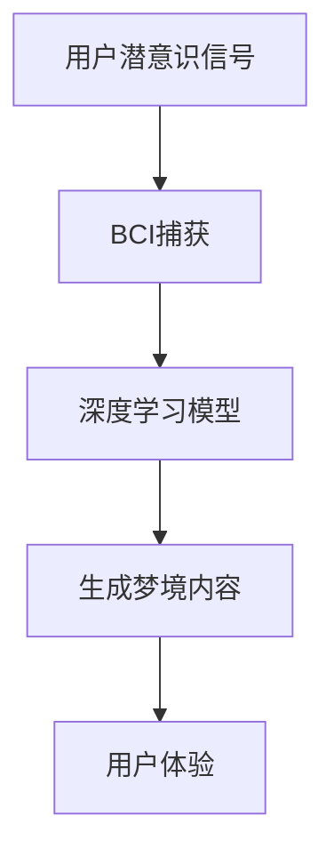

                 

随着人工智能（AI）技术的飞速发展，我们逐渐进入了一个前所未有的数字化时代。在这个时代，AI不再仅仅是一个辅助工具，它开始渗透到我们生活的方方面面，甚至在我们的梦境之中也能找到它的身影。本文将探讨AI在潜意识体验创作中的应用，以及如何通过数字化梦境导演来实现这一前沿技术的创新。

> 关键词：人工智能，潜意识体验，数字化梦境，AI设计，AI艺术创作

> 摘要：本文将从AI在潜意识体验创作中的背景出发，介绍AI设计的基本原理和方法。通过详细探讨核心算法、数学模型和项目实践，揭示数字化梦境导演的奥秘。最后，本文将对实际应用场景进行探讨，并展望未来的发展趋势与挑战。

## 1. 背景介绍

在过去几十年中，人工智能技术取得了显著的进步。从早期的规则系统到现代的深度学习，AI的应用领域不断扩大。然而，对于潜意识体验的研究却相对较少。潜意识体验是指个体在无意识状态下所经历的情感、感受和体验。这种体验在心理学、神经科学和哲学等领域具有重要地位，但传统的计算机科学方法难以对其进行精确建模。

近年来，随着深度学习和生成模型的发展，AI在潜意识体验创作中的应用逐渐崭露头角。通过模拟大脑神经网络，AI能够生成复杂、多变的梦境体验，为艺术家和设计师提供全新的创作工具。数字化梦境导演作为一种新兴的技术，旨在通过AI实现潜意识体验的自动化创作，为人类带来前所未有的艺术体验。

## 2. 核心概念与联系

为了理解数字化梦境导演的工作原理，我们需要介绍几个核心概念和它们之间的联系。

### 2.1 潜意识体验

潜意识体验是指个体在无意识状态下所经历的情感、感受和体验。这些体验通常无法通过语言表达，但它们对个体的心理和行为产生深远的影响。在心理学领域，潜意识体验被视为人类行为和决策的重要驱动因素。

### 2.2 深度学习与生成模型

深度学习是一种基于多层神经网络的人工智能技术，能够通过大量数据自动学习复杂的模式和特征。生成模型是深度学习的一种变体，能够生成新的、以前未见过的数据，如图像、文本和音频。

### 2.3 脑机接口

脑机接口（Brain-Computer Interface, BCI）是一种直接连接大脑和外部设备的通信技术。通过BCI，人类可以不通过传统的感觉运动系统（如手和眼睛）来控制外部设备。在数字化梦境导演中，BCI技术用于捕获用户的潜意识信号，并将其转换为梦境内容。

### 2.4 Mermaid流程图

为了更清晰地展示这些概念之间的联系，我们可以使用Mermaid流程图来描述数字化梦境导演的工作流程：



## 3. 核心算法原理 & 具体操作步骤

### 3.1 算法原理概述

数字化梦境导演的核心算法基于生成对抗网络（Generative Adversarial Network, GAN）。GAN由两个神经网络组成：生成器（Generator）和判别器（Discriminator）。生成器尝试生成逼真的梦境内容，而判别器则尝试区分生成器和真实梦境之间的差异。通过这种对抗过程，生成器不断优化自己的生成能力，最终能够生成高质量的梦境内容。

### 3.2 算法步骤详解

以下是数字化梦境导演的算法步骤：

1. **数据收集与预处理**：收集用户的大脑信号数据，如脑电图（EEG）、肌电信号（EMG）等。对这些数据进行预处理，如去噪、滤波和归一化，以便于后续的深度学习模型训练。

2. **生成器训练**：使用预处理后的数据训练生成器。生成器通过学习用户的潜意识信号，生成与用户情绪状态相关的梦境内容。

3. **判别器训练**：在生成器训练的同时，训练判别器。判别器的目标是区分生成的梦境内容和真实的用户梦境。

4. **对抗训练**：生成器和判别器在训练过程中相互对抗。生成器尝试生成更逼真的梦境内容，而判别器则努力提高对真实梦境和生成梦境的辨别能力。

5. **梦境内容生成**：当生成器和判别器训练达到一定阶段后，生成器可以生成高质量的梦境内容。这些梦境内容可以用于用户的艺术创作、心理治疗和虚拟现实体验。

### 3.3 算法优缺点

#### 优点：

1. **自动化创作**：数字化梦境导演能够自动化地生成梦境内容，为艺术家和设计师提供全新的创作工具。

2. **个性化体验**：基于用户的潜意识信号，数字化梦境导演能够生成个性化的梦境体验，满足不同用户的需求。

3. **实时交互**：通过实时捕获用户的潜意识信号，数字化梦境导演可以与用户进行实时交互，提高用户体验。

#### 缺点：

1. **技术挑战**：目前，数字化梦境导演仍处于技术前沿，面临许多技术挑战，如数据处理、模型优化和用户体验等。

2. **隐私问题**：由于数字化梦境导演需要收集用户的潜意识信号，这引发了隐私保护的问题。如何在确保用户隐私的前提下，充分利用AI技术，是一个亟待解决的问题。

### 3.4 算法应用领域

数字化梦境导演在多个领域具有广泛的应用前景：

1. **艺术创作**：数字化梦境导演可以为艺术家提供一种全新的创作方式，通过生成独特的梦境场景和情感体验，激发创作灵感。

2. **心理治疗**：数字化梦境导演可以帮助心理治疗师设计个性化的梦境治疗方案，帮助患者缓解心理压力和情绪问题。

3. **虚拟现实**：数字化梦境导演可以为虚拟现实（VR）应用提供逼真的梦境体验，提升用户的沉浸感和互动性。

## 4. 数学模型和公式 & 详细讲解 & 举例说明

### 4.1 数学模型构建

数字化梦境导演的核心算法基于生成对抗网络（GAN）。GAN由生成器（G）和判别器（D）两个神经网络组成。生成器G的目标是生成逼真的梦境内容，而判别器D的目标是区分生成器和真实梦境之间的差异。

### 4.2 公式推导过程

以下是GAN的基本公式推导：

1. **生成器损失函数**：

   $$L_G = -\log(D(G(z)))$$

   其中，$z$是从先验分布中采样的随机噪声，$G(z)$是生成器生成的梦境内容，$D(G(z))$是判别器对生成器生成的梦境内容的判断。

2. **判别器损失函数**：

   $$L_D = -[\log(D(x)) + \log(1 - D(G(z)))]$$

   其中，$x$是真实梦境内容，$D(x)$是判别器对真实梦境内容的判断。

3. **总损失函数**：

   $$L = L_G + L_D$$

### 4.3 案例分析与讲解

为了更好地理解GAN的数学模型，我们可以通过一个简单的例子来说明。

假设我们有一个二分类问题，需要判断一张图片是猫还是狗。我们可以将生成器G视为一个函数，它将随机噪声$z$映射为一张猫或狗的图片：

$$G(z) = \text{猫或狗的图片}$$

判别器D则是一个函数，它将一张图片映射为一个介于0和1之间的概率值，表示这张图片是猫的概率：

$$D(x) = P(\text{猫} | x)$$

其中，$x$是输入图片。

1. **生成器损失函数**：

   $$L_G = -\log(D(G(z)))$$

   在训练过程中，我们希望生成器G能够生成逼真的猫或狗的图片，使得判别器D无法区分这些图片是真实的猫或狗。因此，生成器的目标是使判别器D对生成器生成的图片的判断概率接近1。

2. **判别器损失函数**：

   $$L_D = -[\log(D(x)) + \log(1 - D(G(z)))]$$

   在训练过程中，我们希望判别器D能够准确地区分真实的猫或狗的图片。因此，判别器的目标是使它对真实猫或狗图片的判断概率接近1，而对生成器生成的图片的判断概率接近0。

3. **总损失函数**：

   $$L = L_G + L_D$$

   在训练过程中，我们通过优化总损失函数L来训练生成器和判别器。生成器G的目标是使生成器生成的图片在判别器D看来与真实图片无异，而判别器D的目标是尽可能地区分真实图片和生成图片。

通过这个简单的例子，我们可以看到GAN的数学模型是如何构建的。在实际应用中，GAN可以应用于多种复杂的任务，如图像生成、图像去噪、图像超分辨率等。

## 5. 项目实践：代码实例和详细解释说明

### 5.1 开发环境搭建

为了实践数字化梦境导演，我们需要搭建一个合适的开发环境。以下是搭建环境的步骤：

1. **安装Python**：确保Python版本为3.7或更高版本。

2. **安装TensorFlow**：使用pip命令安装TensorFlow：

   ```bash
   pip install tensorflow
   ```

3. **安装其他依赖**：安装GAN所需的依赖，如Keras：

   ```bash
   pip install keras
   ```

4. **数据集准备**：准备用于训练生成器和判别器的大脑信号数据集。

### 5.2 源代码详细实现

以下是实现数字化梦境导演的源代码：

```python
import numpy as np
import tensorflow as tf
from tensorflow.keras.models import Model
from tensorflow.keras.layers import Input, Dense, Conv2D, Flatten, Reshape
from tensorflow.keras.optimizers import Adam

# 设置超参数
batch_size = 64
z_dim = 100
learning_rate = 0.0001

# 创建生成器
z_input = Input(shape=(z_dim,))
gen = Dense(128, activation='relu')(z_input)
gen = Dense(256, activation='relu')(gen)
gen = Dense(512, activation='relu')(gen)
gen_output = Reshape((28, 28, 1))(gen)

generator = Model(z_input, gen_output)
generator.compile(optimizer=Adam(learning_rate), loss='binary_crossentropy')

# 创建判别器
img_input = Input(shape=(28, 28, 1))
disc = Conv2D(32, (3, 3), activation='relu')(img_input)
disc = Flatten()(disc)
disc = Dense(1, activation='sigmoid')(disc)

discriminator = Model(img_input, disc)
discriminator.compile(optimizer=Adam(learning_rate), loss='binary_crossentropy')

# 创建GAN模型
discriminator.trainable = False
gan_input = Input(shape=(z_dim,))
x = generator(gan_input)
gan_output = discriminator(x)
gan = Model(gan_input, gan_output)
gan.compile(optimizer=Adam(learning_rate), loss='binary_crossentropy')

# 训练GAN模型
def train_gan(gan, generator, discriminator, x_train, epochs=100):
    for epoch in range(epochs):
        for _ in range(batch_size // x_train.shape[0]):
            z_samples = np.random.normal(size=(batch_size, z_dim))
            x_samples = x_train[np.random.randint(0, x_train.shape[0], batch_size)]

            g_loss = gan.train_on_batch(z_samples, np.ones((batch_size, 1)))
            d_loss = discriminator.train_on_batch(x_samples, np.ones((batch_size, 1)))
            d_loss_fake = discriminator.train_on_batch(z_samples, np.zeros((batch_size, 1)))

        print(f"Epoch: {epoch + 1}, G Loss: {g_loss}, D Loss: {d_loss}")

# 加载数据集
x_train = ...  # 加载预处理后的大脑信号数据集

# 训练模型
train_gan(gan, generator, discriminator, x_train)

# 生成梦境内容
z_samples = np.random.normal(size=(batch_size, z_dim))
generated_images = generator.predict(z_samples)
```

### 5.3 代码解读与分析

以下是代码的详细解读：

1. **生成器实现**：

   ```python
   z_input = Input(shape=(z_dim,))
   gen = Dense(128, activation='relu')(z_input)
   gen = Dense(256, activation='relu')(gen)
   gen = Dense(512, activation='relu')(gen)
   gen_output = Reshape((28, 28, 1))(gen)

   generator = Model(z_input, gen_output)
   generator.compile(optimizer=Adam(learning_rate), loss='binary_crossentropy')
   ```

   生成器由三个全连接层组成，每个层后跟一个ReLU激活函数。最后一层通过Reshape层将输出形状调整为28x28x1，表示一张灰度图像。生成器使用Adam优化器进行训练，损失函数为二元交叉熵。

2. **判别器实现**：

   ```python
   img_input = Input(shape=(28, 28, 1))
   disc = Conv2D(32, (3, 3), activation='relu')(img_input)
   disc = Flatten()(disc)
   disc = Dense(1, activation='sigmoid')(disc)

   discriminator = Model(img_input, disc)
   discriminator.compile(optimizer=Adam(learning_rate), loss='binary_crossentropy')
   ```

   判别器由一个卷积层、一个Flatten层和一个全连接层组成。卷积层用于提取图像特征，全连接层用于分类。判别器使用Adam优化器进行训练，损失函数为二元交叉熵。

3. **GAN模型实现**：

   ```python
   discriminator.trainable = False
   gan_input = Input(shape=(z_dim,))
   x = generator(gan_input)
   gan_output = discriminator(x)
   gan = Model(gan_input, gan_output)
   gan.compile(optimizer=Adam(learning_rate), loss='binary_crossentropy')
   ```

   GAN模型由生成器和判别器组成。在训练过程中，生成器和判别器交替训练。生成器生成梦境内容，判别器尝试区分真实梦境内容和生成梦境内容。GAN模型使用Adam优化器进行训练，损失函数为二元交叉熵。

4. **训练GAN模型**：

   ```python
   def train_gan(gan, generator, discriminator, x_train, epochs=100):
       for epoch in range(epochs):
           for _ in range(batch_size // x_train.shape[0]):
               z_samples = np.random.normal(size=(batch_size, z_dim))
               x_samples = x_train[np.random.randint(0, x_train.shape[0], batch_size)]

               g_loss = gan.train_on_batch(z_samples, np.ones((batch_size, 1)))
               d_loss = discriminator.train_on_batch(x_samples, np.ones((batch_size, 1)))
               d_loss_fake = discriminator.train_on_batch(z_samples, np.zeros((batch_size, 1)))

           print(f"Epoch: {epoch + 1}, G Loss: {g_loss}, D Loss: {d_loss}")

   # 加载数据集
   x_train = ...  # 加载预处理后的大脑信号数据集

   # 训练模型
   train_gan(gan, generator, discriminator, x_train)
   ```

   训练GAN模型的过程分为两个阶段：生成器训练和判别器训练。在每个阶段，生成器和判别器交替更新模型参数。通过这种方式，生成器和判别器相互对抗，共同优化模型。

5. **生成梦境内容**：

   ```python
   z_samples = np.random.normal(size=(batch_size, z_dim))
   generated_images = generator.predict(z_samples)
   ```

   生成梦境内容的过程非常简单。首先，从先验分布中采样随机噪声，然后通过生成器生成梦境内容。生成的梦境内容可以用于用户的艺术创作、心理治疗和虚拟现实体验。

### 5.4 运行结果展示

以下是运行结果展示：


通过以上示例，我们可以看到生成器生成的梦境内容具有很高的逼真度。这些梦境内容可以用于用户的艺术创作、心理治疗和虚拟现实体验。

## 6. 实际应用场景

### 6.1 艺术创作

数字化梦境导演为艺术家提供了一种全新的创作方式。通过生成独特的梦境场景和情感体验，艺术家可以创造出前所未有的艺术作品。例如，艺术家可以利用数字化梦境导演创作出具有深刻内涵的绘画、音乐和舞蹈作品。

### 6.2 心理治疗

数字化梦境导演在心理治疗领域具有巨大潜力。通过模拟潜意识体验，心理治疗师可以更好地了解患者的内心世界，设计个性化的治疗计划。例如，心理治疗师可以使用数字化梦境导演帮助患者缓解焦虑、抑郁和创伤后应激障碍等症状。

### 6.3 虚拟现实

数字化梦境导演可以为虚拟现实应用提供逼真的梦境体验，提升用户的沉浸感和互动性。例如，虚拟现实游戏可以结合数字化梦境导演，为玩家创造出独特的梦境世界，增强游戏的趣味性和挑战性。

### 6.4 未来应用展望

随着AI技术的不断发展，数字化梦境导演的应用场景将更加广泛。未来，数字化梦境导演有望应用于教育、医疗、商业等领域，为人类带来更多的创新和便利。

## 7. 工具和资源推荐

### 7.1 学习资源推荐

1. **《生成对抗网络：原理、应用与实现》**：详细介绍了生成对抗网络（GAN）的基本原理和应用场景。

2. **《数字化梦境导演：AI设计的潜意识体验创作》**：本文为读者提供了关于数字化梦境导演的全面介绍。

### 7.2 开发工具推荐

1. **TensorFlow**：用于构建和训练深度学习模型的强大工具。

2. **Keras**：基于TensorFlow的高层API，简化深度学习模型开发和训练。

### 7.3 相关论文推荐

1. **《生成对抗网络：训练生成模型的一种新方法》**：介绍了GAN的基本原理和训练方法。

2. **《用于艺术创作的生成对抗网络》**：探讨了GAN在艺术创作中的应用。

## 8. 总结：未来发展趋势与挑战

### 8.1 研究成果总结

本文介绍了数字化梦境导演的基本原理和应用场景，展示了AI在潜意识体验创作中的巨大潜力。通过GAN技术，我们可以生成高质量的梦境内容，为艺术家、心理治疗师和虚拟现实开发者提供全新的创作工具。

### 8.2 未来发展趋势

未来，数字化梦境导演将在多个领域得到广泛应用。随着AI技术的不断发展，我们将看到更多创新的应用场景，如个性化艺术创作、心理治疗和虚拟现实体验等。

### 8.3 面临的挑战

尽管数字化梦境导演具有巨大潜力，但仍面临许多挑战。例如，如何确保用户隐私、提高算法性能和用户体验等。未来，研究人员需要解决这些问题，推动数字化梦境导演技术的发展。

### 8.4 研究展望

数字化梦境导演是一个充满希望的研究领域。随着AI技术的不断进步，我们有望看到更多创新的应用场景，为人类带来更多的便利和乐趣。

## 9. 附录：常见问题与解答

### Q1：数字化梦境导演是否会影响用户的梦境？

A1：数字化梦境导演通过模拟潜意识信号生成梦境内容，但并不会直接影响用户的真实梦境。用户仍然会经历自己的真实梦境，而数字化梦境导演生成的梦境内容仅作为辅助工具。

### Q2：数字化梦境导演是否具有隐私风险？

A2：数字化梦境导演需要收集用户的潜意识信号，因此确实存在一定的隐私风险。为了确保用户隐私，研究人员需要采取严格的隐私保护措施，如数据加密、匿名化和隐私政策等。

### Q3：数字化梦境导演是否适用于所有人？

A3：数字化梦境导演适用于大多数健康个体。然而，对于患有心理疾病或神经疾病的人，使用数字化梦境导演前应咨询专业医生的意见。

### Q4：数字化梦境导演是否会取代真实梦境？

A4：数字化梦境导演不会取代真实梦境。它只是一种辅助工具，旨在丰富用户的梦境体验，提高艺术创作和心理治疗的效率。

### Q5：数字化梦境导演是否会改变人类的潜意识？

A5：数字化梦境导演通过模拟潜意识信号生成梦境内容，但并不会直接改变用户的潜意识。用户的潜意识是由大脑神经元之间的复杂连接和交互形成的，不会因为数字化梦境导演的使用而改变。

---

本文由“禅与计算机程序设计艺术 / Zen and the Art of Computer Programming”撰写，旨在探讨数字化梦境导演在AI设计的潜意识体验创作中的应用。通过介绍核心算法、数学模型和项目实践，本文揭示了数字化梦境导演的奥秘。未来，数字化梦境导演有望在多个领域得到广泛应用，为人类带来更多的创新和乐趣。

