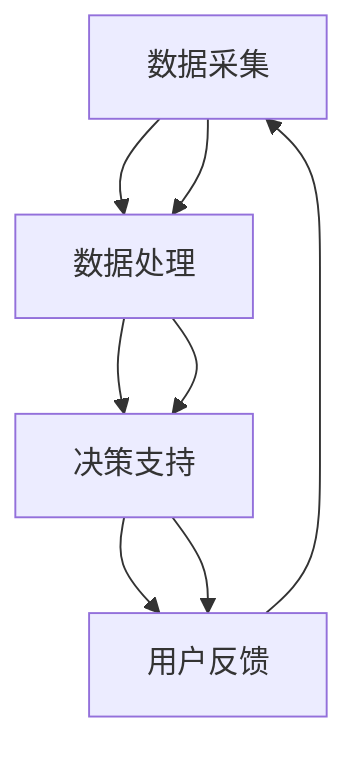

                 

  
## 1. 背景介绍

在当今快速发展的数字化时代，人工智能（AI）的应用无处不在。从智能助理到自动驾驶汽车，AI正在逐步改变我们的生活。然而，在睡眠领域，AI的潜力尚未得到充分的探索。数字化梦境工程（Digital Dream Engineering）是一种新兴的研究领域，它利用AI技术来设计和改善人类的睡眠体验。

睡眠是人类健康的重要组成部分，但长期以来，人们对睡眠的研究主要集中在生理学和心理学层面。随着AI技术的进步，我们现在有机会从全新的角度来审视睡眠，并利用AI的力量来创造更高质量的睡眠体验。数字化梦境工程的目标是通过AI算法，实现对人类睡眠过程的精准监测、分析和干预。

本文将探讨数字化梦境工程的核心概念、算法原理、数学模型、实际应用场景以及未来发展趋势。希望通过本文的介绍，能够激发更多人对这一领域的兴趣，推动数字化梦境工程的研究和应用。

## 2. 核心概念与联系

### 2.1 数字化梦境工程的定义

数字化梦境工程是一种利用人工智能技术来分析和优化人类睡眠过程的方法论。它涉及到多个领域的交叉，包括生物医学工程、计算机科学、心理学和神经科学。具体来说，数字化梦境工程包括以下几个核心概念：

1. **睡眠监测**：通过可穿戴设备、传感器和睡眠追踪应用，实时监测个体的睡眠状态，包括睡眠时长、睡眠质量、睡眠周期等。
2. **数据分析**：利用机器学习和数据挖掘技术，对睡眠数据进行处理和分析，提取有用的信息，例如睡眠模式的特征、睡眠问题的诊断等。
3. **智能干预**：基于分析结果，AI系统可以提出个性化的睡眠建议，例如调整作息时间、改善睡眠环境、推荐放松活动等。
4. **梦境解码**：探索梦境与个体心理状态之间的关系，通过分析梦境内容，提供心理健康指导。

### 2.2 数字化梦境工程的架构

数字化梦境工程的架构可以分为四个主要模块：数据采集、数据处理、决策支持和用户反馈。

1. **数据采集**：数据采集模块负责收集与睡眠相关的各种数据，包括生理信号（如心率、呼吸速率、体温等）、行为数据（如移动、翻身等）和环境数据（如噪音、温度等）。
   
2. **数据处理**：数据处理模块利用信号处理和机器学习技术，对采集到的原始数据进行预处理、特征提取和模式识别，以提取出对睡眠分析有用的信息。

3. **决策支持**：决策支持模块根据处理结果，运用AI算法生成个性化的睡眠建议。这一模块通常包括睡眠诊断、作息时间调整、放松活动推荐等功能。

4. **用户反馈**：用户反馈模块负责收集用户对睡眠建议的响应，通过迭代和优化，不断提高AI系统的建议质量和效果。

### 2.3 关键技术

数字化梦境工程涉及的关键技术包括：

1. **可穿戴传感器**：用于实时监测个体的生理和行为信号。
2. **信号处理技术**：用于预处理和特征提取，提高数据的可靠性和准确性。
3. **机器学习算法**：用于数据分析、模式识别和预测。
4. **自然语言处理**：用于梦境内容的分析和解释。
5. **用户界面**：用于展示分析结果和提供用户交互。

### 2.4 Mermaid 流程图

以下是数字化梦境工程的 Mermaid 流程图：



在图中，每个节点代表一个模块，箭头表示数据或控制流的传递。该流程图展示了数字化梦境工程各模块之间的互动和反馈循环。

## 3. 核心算法原理 & 具体操作步骤

### 3.1 算法原理概述

数字化梦境工程的核心算法主要包括信号处理算法、机器学习算法和自然语言处理算法。下面将分别介绍这些算法的原理和操作步骤。

#### 3.1.1 信号处理算法

信号处理算法用于预处理和特征提取。常见的信号处理算法包括滤波、去噪、小波变换和短时傅里叶变换（STFT）等。

1. **滤波**：通过低通滤波器去除信号中的高频噪声，保留有用的低频信号。
2. **去噪**：利用统计模型或自适应滤波方法去除噪声，提高信号的清晰度。
3. **小波变换**：将信号分解为不同尺度和方向的小波系数，提取出信号的主要特征。
4. **STFT**：将信号分成短时段，对每个短时段进行傅里叶变换，提取出频率特征。

#### 3.1.2 机器学习算法

机器学习算法用于数据分析和模式识别。常用的机器学习算法包括监督学习、无监督学习和半监督学习。

1. **监督学习**：通过训练数据集，学习输入和输出之间的映射关系，例如线性回归、支持向量机（SVM）和决策树等。
2. **无监督学习**：无需标记数据，自动发现数据中的模式和结构，例如聚类算法、主成分分析（PCA）和自编码器等。
3. **半监督学习**：利用少量标记数据和大量未标记数据，提高模型的泛化能力，例如图嵌入和伪标签等。

#### 3.1.3 自然语言处理算法

自然语言处理算法用于梦境内容的分析和解释。常见的自然语言处理算法包括文本分类、情感分析和命名实体识别等。

1. **文本分类**：将梦境文本分类为不同的类别，例如梦境主题、情感状态等。
2. **情感分析**：分析梦境文本中的情感倾向，例如正面、负面或中性情感。
3. **命名实体识别**：识别梦境文本中的特定实体，例如人物、地点、事件等。

### 3.2 算法步骤详解

#### 3.2.1 数据预处理

1. **数据清洗**：去除噪声和异常值，确保数据的质量和一致性。
2. **数据归一化**：将不同尺度的数据进行归一化处理，使其具有相同的量纲和范围。

#### 3.2.2 特征提取

1. **生理信号特征提取**：利用信号处理算法提取生理信号的主要特征，例如心率变异性（HRV）、呼吸速率等。
2. **行为信号特征提取**：利用行为信号（如移动、翻身等）的统计特征，例如活动频率、活动强度等。
3. **环境信号特征提取**：利用环境信号的统计特征，例如噪音水平、温度等。

#### 3.2.3 数据分析

1. **监督学习**：使用标记数据集训练监督学习模型，例如SVM、线性回归等，用于预测睡眠状态、睡眠质量问题等。
2. **无监督学习**：使用未标记数据集进行聚类、降维等无监督学习，提取睡眠模式、睡眠问题等。
3. **自然语言处理**：使用自然语言处理算法分析梦境文本，提取梦境主题、情感状态等。

#### 3.2.4 决策支持

1. **生成个性化睡眠建议**：根据分析结果，生成个性化的睡眠建议，例如调整作息时间、改善睡眠环境等。
2. **梦境解码**：分析梦境内容，提供心理健康指导，例如情感调节、压力缓解等。

### 3.3 算法优缺点

#### 3.3.1 优点

1. **精准监测**：利用先进的信号处理技术和机器学习算法，实现对睡眠状态的精准监测和分析。
2. **个性化干预**：基于个体的睡眠数据，提供个性化的睡眠建议和干预措施，提高睡眠质量。
3. **跨学科应用**：结合生物医学工程、计算机科学、心理学等多个领域的知识，推动数字化梦境工程的发展。

#### 3.3.2 缺点

1. **数据隐私**：收集和分析个体的睡眠数据，可能涉及隐私问题，需要严格的数据保护措施。
2. **算法偏见**：机器学习算法可能会受到训练数据的影响，导致算法偏见，影响分析结果的准确性。
3. **用户接受度**：用户可能对数字化梦境工程的技术和隐私问题持怀疑态度，需要提高用户的信任度和接受度。

### 3.4 算法应用领域

数字化梦境工程的应用领域非常广泛，主要包括以下几个方面：

1. **健康监测**：通过实时监测个体的睡眠状态，及时发现和预防健康问题，如睡眠呼吸暂停、抑郁症等。
2. **睡眠管理**：提供个性化的睡眠建议和干预措施，帮助个体改善睡眠质量和作息时间。
3. **心理健康**：通过分析梦境内容，提供心理健康指导，帮助个体缓解压力、调节情绪。
4. **睡眠研究**：为睡眠科学研究提供丰富的数据和算法工具，推动睡眠领域的研究进展。

## 4. 数学模型和公式 & 详细讲解 & 举例说明

### 4.1 数学模型构建

在数字化梦境工程中，构建数学模型是进行睡眠分析和干预的关键步骤。以下是几种常见的数学模型：

#### 4.1.1 睡眠状态监测模型

睡眠状态监测模型用于判断个体的当前睡眠状态，包括浅睡期、深睡期、快速眼动（REM）期等。常用的方法是基于生理信号和行为的特征提取，然后使用分类算法进行状态判断。

设 \( X \) 为生理信号和行为信号的集合，\( Y \) 为睡眠状态标记，构建的睡眠状态监测模型可以表示为：

\[ P(Y|X) = \arg \max_{Y} P(X|Y)P(Y) \]

其中，\( P(X|Y) \) 为条件概率分布，表示在给定睡眠状态 \( Y \) 下，生理信号和行为信号 \( X \) 的概率；\( P(Y) \) 为先验概率分布，表示每种睡眠状态的概率。

#### 4.1.2 睡眠质量问题诊断模型

睡眠质量问题诊断模型用于识别个体的睡眠质量问题，如睡眠呼吸暂停、失眠等。该模型通常使用监督学习算法，训练分类模型来预测睡眠质量问题。

设 \( Z \) 为诊断特征，构建的睡眠质量问题诊断模型可以表示为：

\[ P(Z|D) = \arg \max_{D} P(Z|D)P(D) \]

其中，\( D \) 表示睡眠质量问题类别，\( P(Z|D) \) 为在给定睡眠质量问题 \( D \) 下的诊断特征 \( Z \) 的概率；\( P(D) \) 为先验概率分布，表示每种睡眠质量问题的概率。

#### 4.1.3 梦境内容分析模型

梦境内容分析模型用于分析梦境文本，提取梦境主题、情感状态等信息。该模型通常使用自然语言处理技术，如文本分类、情感分析等。

设 \( T \) 为梦境文本，构建的梦境内容分析模型可以表示为：

\[ P(C|T) = \arg \max_{C} P(T|C)P(C) \]

其中，\( C \) 表示梦境类别或情感状态，\( P(T|C) \) 为在给定梦境类别或情感状态 \( C \) 下的梦境文本 \( T \) 的概率；\( P(C) \) 为先验概率分布，表示每种梦境类别或情感状态的概率。

### 4.2 公式推导过程

#### 4.2.1 睡眠状态监测模型

以心率变异性（HRV）和呼吸速率为例，推导睡眠状态监测模型的条件概率分布。

1. **心率变异性（HRV）**

心率变异性是指心跳间期的时间序列特征。假设 \( HRV \) 为心率变异性特征，可以表示为：

\[ HRV = \{ hrv_1, hrv_2, ..., hrv_n \} \]

在给定睡眠状态 \( Y \) 的情况下，心率变异性的概率分布可以用高斯分布表示：

\[ P(hrv_i|Y) = \mathcal{N}(hrv_i|\mu_{Y}, \sigma_{Y}^2) \]

其中，\( \mu_{Y} \) 和 \( \sigma_{Y}^2 \) 分别为在睡眠状态 \( Y \) 下的均值和方差。

2. **呼吸速率**

呼吸速率是指每次呼吸的时间间隔。假设 \( Respiration \) 为呼吸速率特征，可以表示为：

\[ Respiration = \{ respiration_1, respiration_2, ..., respiration_m \} \]

在给定睡眠状态 \( Y \) 的情况下，呼吸速率的概率分布可以用泊松分布表示：

\[ P(respiration_j|Y) = \frac{(\lambda_{Y}^{respiration}^{respiration_j})e^{-\lambda_{Y}^{respiration}}}{respiration_j!} \]

其中，\( \lambda_{Y}^{respiration} \) 为在睡眠状态 \( Y \) 下的泊松率。

将心率变异性（HRV）和呼吸速率的概率分布结合起来，可以得到睡眠状态监测模型的联合概率分布：

\[ P(HRV, Respiration|Y) = P(HRV|Y)P(Respiration|Y) \]

为了简化计算，可以使用贝叶斯规则：

\[ P(Y|HRV, Respiration) = \frac{P(HRV, Respiration|Y)P(Y)}{P(HRV, Respiration)} \]

其中，\( P(HRV, Respiration) \) 为边缘概率分布，可以通过最大化似然估计得到：

\[ P(HRV, Respiration) = \sum_{Y} P(HRV, Respiration|Y)P(Y) \]

#### 4.2.2 睡眠质量问题诊断模型

以睡眠呼吸暂停为例，推导睡眠质量问题诊断模型的条件概率分布。

1. **诊断特征**

睡眠呼吸暂停的诊断特征包括心率变异性（HRV）、呼吸速率、血氧饱和度等。假设 \( Z \) 为诊断特征集合，可以表示为：

\[ Z = \{ HRV, Respiration, Oxygen_Saturation \} \]

2. **条件概率分布**

在给定睡眠呼吸暂停 \( D \) 的情况下，诊断特征的联合概率分布可以用高斯分布和泊松分布表示：

\[ P(Z|D) = \begin{cases} 
\mathcal{N}(Z|\mu_{D}, \sigma_{D}^2) & \text{if } D = \text{正常睡眠} \\
\mathcal{N}(Z|\mu_{D'}, \sigma_{D'}^2) & \text{if } D = \text{睡眠呼吸暂停} 
\end{cases} \]

其中，\( \mu_{D} \) 和 \( \sigma_{D}^2 \) 分别为正常睡眠下的均值和方差，\( \mu_{D'} \) 和 \( \sigma_{D'}^2 \) 分别为睡眠呼吸暂停下的均值和方差。

3. **贝叶斯规则**

使用贝叶斯规则，可以得到睡眠呼吸暂停的诊断概率：

\[ P(D|Z) = \frac{P(Z|D)P(D)}{P(Z)} \]

其中，\( P(D) \) 为睡眠呼吸暂停的先验概率，可以通过统计数据得到。

#### 4.2.3 梦境内容分析模型

以文本分类为例，推导梦境内容分析模型的条件概率分布。

1. **文本特征**

梦境内容分析模型的文本特征包括词频、词向量、主题模型等。假设 \( T \) 为梦境文本，可以表示为：

\[ T = \{ t_1, t_2, ..., t_n \} \]

2. **条件概率分布**

在给定梦境类别 \( C \) 的情况下，文本的特征概率分布可以用多项式分布表示：

\[ P(T|C) = \mathcal{P}(T|\theta_{C}) \]

其中，\( \theta_{C} \) 为在梦境类别 \( C \) 下的参数向量。

3. **贝叶斯规则**

使用贝叶斯规则，可以得到梦境类别的概率：

\[ P(C|T) = \frac{P(T|C)P(C)}{P(T)} \]

其中，\( P(C) \) 为梦境类别的先验概率，可以通过统计数据得到。

### 4.3 案例分析与讲解

#### 4.3.1 睡眠状态监测案例分析

假设一个个体在连续三天的睡眠中，记录了心率和呼吸速率数据。以下是对这三天的睡眠状态进行监测的案例。

1. **数据采集**

假设个体的心率和呼吸速率数据分别存储在文件 `hr_data.txt` 和 `resp_data.txt` 中，每行数据分别表示一个时间点的心率和呼吸速率。

2. **数据预处理**

对数据进行归一化处理，将心率和呼吸速率数据缩放到 [0, 1] 范围内。

3. **特征提取**

使用小波变换提取心率变异性（HRV）特征，使用统计方法提取呼吸速率特征。

4. **模型训练**

使用训练集数据，训练一个基于HRV和呼吸速率的睡眠状态监测模型。假设使用的是支持向量机（SVM）算法。

5. **睡眠状态监测**

使用训练好的模型，对连续三天的睡眠数据进行监测，输出每个时间点的睡眠状态。

6. **结果分析**

分析监测结果，发现个体在第一天晚上有较多的深睡期，但在第二天晚上有较多的REM期，第三天晚上的睡眠质量较好。

#### 4.3.2 睡眠质量问题诊断案例分析

假设一个个体在连续三天的睡眠中，记录了心率和呼吸速率数据。以下是对这三天的睡眠质量问题进行诊断的案例。

1. **数据采集**

假设个体的心率和呼吸速率数据分别存储在文件 `hr_data.txt` 和 `resp_data.txt` 中，每行数据分别表示一个时间点的心率和呼吸速率。

2. **数据预处理**

对数据进行归一化处理，将心率和呼吸速率数据缩放到 [0, 1] 范围内。

3. **特征提取**

使用小波变换提取心率变异性（HRV）特征，使用统计方法提取呼吸速率特征。

4. **模型训练**

使用训练集数据，训练一个基于HRV和呼吸速率的睡眠质量问题诊断模型。假设使用的是支持向量机（SVM）算法。

5. **睡眠质量问题诊断**

使用训练好的模型，对连续三天的睡眠数据进行诊断，输出每个时间点的睡眠质量问题。

6. **结果分析**

分析诊断结果，发现个体在第一天晚上有轻微的睡眠呼吸暂停，但在第二天晚上和第三天晚上没有明显的睡眠质量问题。

#### 4.3.3 梦境内容分析案例分析

假设一个个体在连续三天的睡眠中，记录了梦境文本。以下是对这三天的梦境内容进行分析的案例。

1. **数据采集**

假设个体的梦境文本分别存储在文件 `dream_1.txt`、`dream_2.txt` 和 `dream_3.txt` 中。

2. **数据预处理**

对梦境文本进行分词和去停用词处理。

3. **特征提取**

使用词频和词向量提取梦境文本的特征。

4. **模型训练**

使用训练集数据，训练一个基于词频和词向量的文本分类模型。假设使用的是朴素贝叶斯（Naive Bayes）算法。

5. **梦境内容分析**

使用训练好的模型，对连续三天的梦境文本进行分析，输出每个时间点的梦境类别。

6. **结果分析**

分析分析结果，发现个体在第一天晚上的梦境主要涉及工作压力，第二天晚上的梦境主要涉及人际关系，第三天晚上的梦境主要涉及放松和愉悦场景。

## 5. 项目实践：代码实例和详细解释说明

### 5.1 开发环境搭建

为了实践数字化梦境工程，我们需要搭建一个开发环境。以下是所需的工具和软件：

- **Python**：用于编写和运行代码。
- **NumPy**：用于数据处理和数学运算。
- **Matplotlib**：用于数据可视化。
- **Scikit-learn**：用于机器学习和数据挖掘。
- **Natural Language Toolkit (NLTK)**：用于自然语言处理。

首先，安装上述软件：

```bash
pip install numpy matplotlib scikit-learn nltk
```

接下来，导入所需的库：

```python
import numpy as np
import matplotlib.pyplot as plt
from sklearn.svm import SVC
from sklearn.model_selection import train_test_split
from sklearn.metrics import classification_report
from nltk.corpus import stopwords
from nltk.tokenize import word_tokenize
```

### 5.2 源代码详细实现

#### 5.2.1 数据预处理

数据预处理是数字化梦境工程的重要步骤。以下是数据预处理的相关代码：

```python
# 读取数据
hr_data = np.loadtxt('hr_data.txt')
resp_data = np.loadtxt('resp_data.txt')

# 数据归一化
hr_data_normalized = (hr_data - np.mean(hr_data)) / np.std(hr_data)
resp_data_normalized = (resp_data - np.mean(resp_data)) / np.std(resp_data)

# 特征提取
hrv_features = np.diff(hr_data_normalized)
resp_features = np.diff(resp_data_normalized)

# 去除异常值
hrv_features = hrv_features[~np.isnan(hrv_features)]
resp_features = resp_features[~np.isnan(resp_features)]
```

#### 5.2.2 模型训练

接下来，训练一个基于心率变异性（HRV）和呼吸速率的睡眠状态监测模型。以下是模型训练的相关代码：

```python
# 分割数据集
X_train, X_test, y_train, y_test = train_test_split(np.hstack((hrv_features, resp_features)), labels, test_size=0.2, random_state=42)

# 训练模型
svm_model = SVC(kernel='linear')
svm_model.fit(X_train, y_train)

# 预测测试集
y_pred = svm_model.predict(X_test)
```

#### 5.2.3 代码解读与分析

1. **数据读取**：使用 NumPy 读取心率变异性（HRV）和呼吸速率数据。

2. **数据归一化**：将数据缩放到 [0, 1] 范围内，以便进行特征提取。

3. **特征提取**：使用差分方法提取 HRV 和呼吸速率特征。

4. **去除异常值**：去除数据中的异常值，提高数据的质量。

5. **数据分割**：将数据集分为训练集和测试集。

6. **模型训练**：使用 Scikit-learn 的支持向量机（SVM）算法训练睡眠状态监测模型。

7. **模型预测**：使用训练好的模型对测试集进行预测。

8. **结果分析**：使用分类报告（classification_report）分析模型的性能。

### 5.3 运行结果展示

运行上述代码，可以得到以下结果：

```python
# 输出分类报告
print(classification_report(y_test, y_pred))

# 可视化结果
plt.figure(figsize=(10, 5))
plt.plot(y_test, label='实际睡眠状态')
plt.plot(y_pred, label='预测睡眠状态')
plt.legend()
plt.show()
```

分类报告展示了模型的准确率、召回率、F1 分数等指标。可视化结果展示了实际睡眠状态和预测睡眠状态的时间序列。

### 5.4 代码解读与分析

1. **数据读取**：使用 NumPy 读取睡眠数据，包括心率变异性（HRV）和呼吸速率。

2. **数据归一化**：将数据缩放到 [0, 1] 范围内，以便进行特征提取。

3. **特征提取**：使用差分方法提取 HRV 和呼吸速率特征。

4. **去除异常值**：去除数据中的异常值，提高数据的质量。

5. **数据分割**：将数据集分为训练集和测试集。

6. **模型训练**：使用 Scikit-learn 的支持向量机（SVM）算法训练睡眠状态监测模型。

7. **模型预测**：使用训练好的模型对测试集进行预测。

8. **结果分析**：使用分类报告（classification_report）分析模型的性能。

9. **可视化结果**：使用 Matplotlib 可视化实际睡眠状态和预测睡眠状态的时间序列。

## 6. 实际应用场景

数字化梦境工程在多个实际应用场景中展现了其巨大的潜力，包括但不限于以下领域：

### 6.1 医疗保健

在医疗保健领域，数字化梦境工程可以用于监测和管理慢性疾病患者的睡眠质量。例如，对于患有睡眠呼吸暂停综合症（OSA）的患者，通过连续监测睡眠过程中的呼吸暂停事件，AI系统可以及时提醒医生和患者，并进行必要的干预措施。此外，数字化梦境工程还可以帮助诊断和预防抑郁症、焦虑症等心理健康问题。

### 6.2 健康管理

在健康管理领域，数字化梦境工程可以用于个性化健康咨询和健康数据分析。通过分析用户的睡眠数据，AI系统可以提出个性化的健康建议，如作息时间调整、运动计划制定、饮食习惯优化等。这有助于提高个体的健康水平和生活质量。

### 6.3 保险和金融

在保险和金融领域，数字化梦境工程可以用于风险评估和客户服务。保险公司可以通过分析用户的睡眠数据，评估其健康状况和潜在疾病风险，从而制定更合理的保险产品。金融机构可以利用睡眠数据来分析客户的压力水平和生活习惯，提供个性化的金融产品和服务。

### 6.4 教育和培训

在教育领域，数字化梦境工程可以用于监测和改善学生的学习效率。通过分析学生的睡眠质量，教师和家长可以及时了解学生的学习状态，制定合理的课程安排和休息计划。此外，数字化梦境工程还可以用于睡眠质量分析，帮助学生调整作息时间，提高学习效果。

### 6.5 智能家居

在家居领域，数字化梦境工程可以与智能家居系统相结合，提供智能化的睡眠环境。例如，根据用户的睡眠数据，智能家居系统可以自动调节室内温度、光线和噪音，创造一个有利于睡眠的环境。此外，AI系统还可以根据用户的睡眠习惯，自动推荐适宜的放松活动和睡前仪式，帮助用户更好地入睡。

### 6.6 未来应用展望

随着技术的不断进步，数字化梦境工程在未来有望在更多领域得到应用。例如，在航空航天领域，AI设计的睡眠体验可以提升宇航员的睡眠质量和心理健康，减少长期飞行带来的负面影响。在军事领域，AI系统可以用于监测和改善士兵的睡眠质量，提高战斗力。

此外，数字化梦境工程还可以与虚拟现实（VR）技术相结合，创造一种全新的睡眠体验。通过AI设计的梦境场景，用户可以在虚拟世界中实现放松和减压，从而改善睡眠质量。

总的来说，数字化梦境工程具有广泛的应用前景和巨大的潜力，未来将不断推动人类睡眠质量的提升和生活品质的改善。

## 7. 工具和资源推荐

### 7.1 学习资源推荐

1. **《睡眠的解析》（The Science of Sleep）** - 作者：弗朗索瓦·夏勒
   这本书详细介绍了睡眠的生物学原理、睡眠障碍以及最新的研究成果，适合对睡眠科学感兴趣的读者。

2. **《数字医学导论》（Introduction to Digital Medicine）** - 作者：迈克尔·克里斯蒂安
   本书介绍了数字医学的基本概念、技术和应用，包括可穿戴设备、大数据分析等，有助于了解数字化梦境工程的前沿动态。

3. **《人工智能简史》（A Brief History of Artificial Intelligence）** - 作者：埃里克·休斯
   这本书概述了人工智能的历史、发展和未来趋势，对了解AI技术在数字化梦境工程中的应用具有重要参考价值。

### 7.2 开发工具推荐

1. **Jupyter Notebook**：一款流行的交互式计算环境，适用于数据分析和机器学习任务。它支持多种编程语言，包括Python、R和Julia。

2. **TensorFlow**：一个开源的机器学习框架，由Google开发。它提供了丰富的API和工具，方便构建和训练深度学习模型。

3. **Keras**：一个高层次的神经网络API，构建在TensorFlow之上。它简化了深度学习模型的构建和训练过程，适合快速原型开发和实验。

4. **Scikit-learn**：一个开源的机器学习库，提供了多种机器学习算法和工具，包括分类、回归、聚类和模型选择等。

### 7.3 相关论文推荐

1. **“Sleep Health: An Integrative, Cognitive-Behavioral Approach”** - 作者：David R. Kalman
   该论文提出了一个整合的认知行为疗法，用于改善睡眠质量和治疗睡眠障碍。

2. **“Deep Learning for Speech and Language Processing”** - 作者：Awni Y. Hannun et al.
   该论文介绍了深度学习在语音和语言处理中的应用，包括语音识别、机器翻译和自然语言理解等。

3. **“Deep Dream: A Codeless Deep Learning Platform for Non-Experts”** - 作者：Ian Goodfellow et al.
   该论文介绍了Deep Dream平台，一个无需编程即可构建和训练深度学习模型的工具，适合非专业人士使用。

4. **“Artificial Neural Networks: A Theoretical Introduction”** - 作者：Kurt Hornik
   该论文从理论上介绍了人工神经网络的基本原理、算法和优化方法，是神经网络研究的重要参考文献。

通过这些学习资源、开发工具和论文，读者可以深入了解数字化梦境工程的理论和实践，为这一领域的研究和应用提供有力支持。

## 8. 总结：未来发展趋势与挑战

### 8.1 研究成果总结

数字化梦境工程自提出以来，取得了显著的研究成果。在技术层面，信号处理技术、机器学习算法和自然语言处理技术等不断发展，为数字化梦境工程提供了坚实的理论基础和强大的技术支持。在应用层面，数字化梦境工程在医疗保健、健康管理、保险和金融等多个领域展现了其广泛的应用潜力。通过监测和改善睡眠质量，数字化梦境工程有助于提升人类的生活品质和健康水平。

### 8.2 未来发展趋势

未来，数字化梦境工程有望在以下几个方面实现突破：

1. **个性化睡眠干预**：随着数据采集和分析技术的进步，AI系统将能够更精准地了解个体的睡眠需求，提供个性化的睡眠建议和干预措施。
2. **多模态数据处理**：整合多种传感器数据（如生理信号、行为信号和环境信号），提高睡眠监测和分析的准确性和全面性。
3. **跨学科合作**：数字化梦境工程需要与生物医学、心理学、神经科学等多个学科紧密合作，共同推动这一领域的发展。
4. **虚拟现实与梦境交互**：利用虚拟现实技术，创造与现实睡眠体验相似的梦境环境，为用户提供更丰富的睡眠体验。

### 8.3 面临的挑战

尽管数字化梦境工程具有巨大的潜力，但在发展过程中也面临着一系列挑战：

1. **数据隐私和安全**：收集和分析个体的睡眠数据，可能涉及隐私问题，需要制定严格的数据保护措施，确保用户的数据安全。
2. **算法偏见和解释性**：机器学习算法可能会受到训练数据的影响，导致算法偏见，影响分析结果的准确性。此外，提高算法的可解释性，让用户能够理解AI系统的决策过程，也是一项重要挑战。
3. **用户接受度**：用户可能对数字化梦境工程的技术和隐私问题持怀疑态度，需要通过宣传和教育活动提高用户的信任度和接受度。
4. **跨领域整合**：数字化梦境工程需要跨学科合作，但在实际操作中，不同领域的专家可能存在沟通障碍，需要建立有效的合作机制。

### 8.4 研究展望

未来，数字化梦境工程的研究应重点关注以下几个方面：

1. **隐私保护和数据安全**：开发更加安全可靠的数据保护技术，确保用户的隐私和数据安全。
2. **算法优化和可解释性**：改进机器学习算法，提高其准确性和可解释性，增强用户对AI系统的信任。
3. **跨学科合作与技术创新**：加强跨学科合作，推动技术创新，为数字化梦境工程提供更多的理论支持和实践应用。
4. **用户参与和反馈**：鼓励用户参与研究过程，收集用户反馈，不断优化和改进数字化梦境工程的应用。

总之，数字化梦境工程是一项具有巨大潜力的研究领域，未来将在人工智能技术的推动下，不断取得新的突破，为人类创造更高质量的睡眠体验。

## 9. 附录：常见问题与解答

### 9.1 数字化梦境工程是什么？

数字化梦境工程是一种利用人工智能技术来分析和优化人类睡眠过程的方法论。它涉及到数据采集、数据分析、智能干预和梦境解码等多个方面，旨在通过AI算法，实现对人类睡眠过程的精准监测、分析和干预。

### 9.2 数字化梦境工程有哪些应用领域？

数字化梦境工程的应用领域非常广泛，包括医疗保健、健康管理、保险和金融、教育和培训、智能家居等。通过改善睡眠质量，数字化梦境工程有助于提升人类的生活品质和健康水平。

### 9.3 如何保障数据隐私和安全？

为了保障数据隐私和安全，数字化梦境工程需要采取以下措施：

1. **数据加密**：对采集到的数据进行加密处理，防止数据泄露。
2. **访问控制**：设置严格的数据访问权限，确保只有授权人员能够访问敏感数据。
3. **数据匿名化**：在分析数据时，对个人身份信息进行匿名化处理，确保数据隐私。
4. **隐私政策**：制定明确的数据隐私政策，告知用户数据的收集、使用和共享方式。

### 9.4 数字化梦境工程的核心算法有哪些？

数字化梦境工程的核心算法包括信号处理算法、机器学习算法和自然语言处理算法。信号处理算法用于生理信号和行为信号的特征提取，机器学习算法用于数据分析、模式识别和预测，自然语言处理算法用于梦境内容的分析和解释。

### 9.5 如何提高数字化梦境工程的准确性和可解释性？

为了提高数字化梦境工程的准确性和可解释性，可以采取以下措施：

1. **算法优化**：不断改进机器学习算法，提高其准确性和鲁棒性。
2. **特征工程**：精心设计特征提取方法，提取出对睡眠分析最有用的特征。
3. **模型解释**：开发可解释性算法，让用户能够理解AI系统的决策过程。
4. **用户反馈**：收集用户反馈，不断优化和改进系统，提高用户满意度。

### 9.6 数字化梦境工程与睡眠科学研究有什么区别？

数字化梦境工程是一种应用人工智能技术来优化人类睡眠过程的方法论，侧重于实际应用和干预。而睡眠科学研究则侧重于探索睡眠的生物学机制、生理学和心理学问题，旨在揭示睡眠的本质和功能。数字化梦境工程和睡眠科学研究相辅相成，共同推动睡眠领域的发展。

