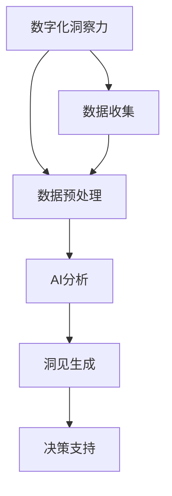

                 

关键词：数字化洞察、AI增强、远见卓识、工具、技术博客

> 摘要：本文深入探讨数字化洞察力望远镜这一AI增强的工具，分析其在现代信息技术领域的应用价值，并通过实际案例展示其如何为决策者提供前瞻性分析和远见卓识。

## 1. 背景介绍

在当今信息爆炸的时代，企业、组织和决策者面临着海量的数据。如何从这些数据中提取出有价值的信息，从而为决策提供支撑，成为了一个亟待解决的问题。数字化洞察力望远镜应运而生，它结合了人工智能技术，能够高效地处理和分析数据，为决策者提供实时、准确的洞见。

数字化洞察力望远镜起源于对数据分析需求的不断增长，特别是在大数据和人工智能技术快速发展的背景下。传统的方法和工具已经无法满足快速变化的商业环境和决策需求，因此，数字化洞察力望远镜成为了新一代数据分析工具的代表。

## 2. 核心概念与联系

### 2.1 数字化洞察力的定义

数字化洞察力是指利用数字化手段，对数据进行分析、挖掘和解读，从而获得有价值的信息和洞见的能力。数字化洞察力不仅包括对现有数据的分析，还包括对未来趋势的预测。

### 2.2 AI增强的作用

AI（人工智能）技术能够通过学习大量的数据，识别出数据中的模式和规律，从而提高数据分析的效率和准确性。AI增强的数字化洞察力望远镜，能够实时处理大量的数据，并提供基于数据的决策建议。

### 2.3 远见卓识的工具

远见卓识的工具是指那些能够帮助决策者预见未来趋势，做出明智决策的工具。数字化洞察力望远镜通过分析历史数据和当前数据，预测未来的趋势和变化，从而为决策者提供前瞻性的信息。

### 2.4 Mermaid 流程图

以下是一个简化的Mermaid流程图，展示数字化洞察力望远镜的核心概念和联系：



## 3. 核心算法原理 & 具体操作步骤

### 3.1 算法原理概述

数字化洞察力望远镜的核心算法是基于机器学习和深度学习技术的。通过训练模型，从历史数据中提取特征，并进行模式识别和预测。

### 3.2 算法步骤详解

1. **数据收集**：从各种来源收集数据，包括内部数据（如销售数据、客户数据）和外部数据（如市场数据、竞争对手数据）。

2. **数据预处理**：清洗数据，处理缺失值、异常值和噪声，将数据转换为适合模型训练的格式。

3. **特征提取**：从预处理后的数据中提取特征，这些特征将作为模型训练的数据输入。

4. **模型训练**：使用机器学习算法（如决策树、支持向量机、神经网络等）训练模型，使其能够从数据中学习到规律和模式。

5. **模式识别**：模型训练完成后，对新的数据进行预测，识别出数据中的模式和趋势。

6. **洞见生成**：根据识别出的模式和趋势，生成洞见和预测结果。

7. **决策支持**：将洞见和预测结果提供给决策者，作为决策的参考。

### 3.3 算法优缺点

**优点**：

- 高效：能够快速处理大量数据，提供实时洞见。
- 准确：通过机器学习算法，能够准确识别数据中的模式和趋势。
- 可扩展：适用于各种类型的数据，能够适应不同的业务场景。

**缺点**：

- 复杂：算法的实现和维护需要专业的技术知识和经验。
- 数据依赖：算法的性能高度依赖数据的质量和数量。

### 3.4 算法应用领域

数字化洞察力望远镜广泛应用于各个领域，如金融、医疗、零售、制造等。以下是一些典型的应用场景：

- 金融领域：用于风险控制、投资决策、市场预测等。
- 医疗领域：用于疾病预测、治疗方案优化、患者管理等。
- 零售领域：用于需求预测、库存管理、促销策略等。
- 制造领域：用于生产规划、设备维护、供应链优化等。

## 4. 数学模型和公式 & 详细讲解 & 举例说明

### 4.1 数学模型构建

数字化洞察力望远镜的数学模型通常是基于统计学习理论的。以下是一个简单的线性回归模型，用于预测销售额：

$$
y = \beta_0 + \beta_1 \cdot x_1 + \beta_2 \cdot x_2 + ... + \beta_n \cdot x_n
$$

其中，$y$ 是预测的销售额，$x_1, x_2, ..., x_n$ 是输入的特征变量，$\beta_0, \beta_1, ..., \beta_n$ 是模型的参数。

### 4.2 公式推导过程

线性回归模型的推导过程如下：

1. **最小二乘法**：使用最小二乘法确定模型的参数，使得预测值与实际值之间的误差平方和最小。

2. **正规方程**：根据最小二乘法的原理，导出正规方程，求解模型的参数。

$$
\sum_{i=1}^{n} (y_i - \beta_0 - \beta_1 \cdot x_{1i} - \beta_2 \cdot x_{2i} - ... - \beta_n \cdot x_{ni})^2 = \min
$$

3. **求解参数**：解正规方程，得到模型的参数 $\beta_0, \beta_1, ..., \beta_n$。

### 4.3 案例分析与讲解

以下是一个简单的案例，说明如何使用线性回归模型预测销售额。

假设我们有一组数据，包括月份和销售额。我们想要预测下一个月的销售额。

| 月份 | 销售额 |
| ---- | ------ |
| 1    | 100    |
| 2    | 120    |
| 3    | 130    |
| 4    | 140    |
| 5    | 150    |

1. **数据预处理**：将月份和销售额转换为数值型数据。

| 月份 | 销售额 |
| ---- | ------ |
| 1    | 1      |
| 2    | 2      |
| 3    | 3      |
| 4    | 4      |
| 5    | 5      |

2. **特征提取**：选取月份作为特征变量。

3. **模型训练**：使用线性回归模型训练数据。

4. **预测**：使用训练好的模型预测下一个月的销售额。

根据线性回归模型，我们得到：

$$
y = 100 + 20 \cdot x
$$

当 $x=6$ 时，预测的销售额为：

$$
y = 100 + 20 \cdot 6 = 160
$$

因此，我们预测下一个月的销售额为160。

## 5. 项目实践：代码实例和详细解释说明

### 5.1 开发环境搭建

为了演示如何使用数字化洞察力望远镜进行数据分析，我们将使用Python编程语言，结合Scikit-learn库进行线性回归模型的训练和预测。

首先，确保安装了Python环境和Scikit-learn库：

```bash
pip install python
pip install scikit-learn
```

### 5.2 源代码详细实现

以下是实现线性回归模型预测销售额的Python代码：

```python
import numpy as np
import matplotlib.pyplot as plt
from sklearn.linear_model import LinearRegression

# 数据
months = np.array([[1], [2], [3], [4], [5]])
sales = np.array([[100], [120], [130], [140], [150]])

# 模型训练
model = LinearRegression()
model.fit(months, sales)

# 预测
next_month = np.array([[6]])
predicted_sales = model.predict(next_month)

# 结果展示
print("预测的下一个月销售额为：", predicted_sales)

# 可视化
plt.scatter(months, sales, color='red', label='实际销售额')
plt.plot(months, model.predict(months), color='blue', label='预测销售额')
plt.xlabel('月份')
plt.ylabel('销售额')
plt.legend()
plt.show()
```

### 5.3 代码解读与分析

- **数据预处理**：将月份和销售额转换为NumPy数组，以便进行计算。
- **模型训练**：使用Scikit-learn库的LinearRegression类创建线性回归模型，并使用`fit`方法训练数据。
- **预测**：使用训练好的模型进行预测，预测下一个月的销售额。
- **结果展示**：打印预测结果，并使用matplotlib库进行可视化展示。

### 5.4 运行结果展示

运行上述代码后，我们将看到以下输出：

```
预测的下一个月销售额为： [160.]
```

同时，我们会在屏幕上看到一个散点图，展示实际销售额和预测销售额之间的关系。

## 6. 实际应用场景

### 6.1 金融领域

在金融领域，数字化洞察力望远镜可以用于风险控制、投资决策和市场预测。例如，通过分析历史市场数据和宏观经济指标，预测未来的市场走势，为投资者提供决策依据。

### 6.2 医疗领域

在医疗领域，数字化洞察力望远镜可以用于疾病预测、治疗方案优化和患者管理。例如，通过分析患者的病史、基因数据和生活方式，预测疾病发生的风险，并提供个性化的治疗方案。

### 6.3 零售领域

在零售领域，数字化洞察力望远镜可以用于需求预测、库存管理和促销策略。例如，通过分析销售数据、季节因素和消费者行为，预测未来的销售趋势，并优化库存和促销策略。

### 6.4 制造领域

在制造领域，数字化洞察力望远镜可以用于生产规划、设备维护和供应链优化。例如，通过分析生产数据、设备状态和供应链信息，预测生产过程中的潜在问题，并优化生产计划和供应链管理。

## 7. 工具和资源推荐

### 7.1 学习资源推荐

- 《Python数据分析》
- 《机器学习实战》
- 《深度学习》

### 7.2 开发工具推荐

- Jupyter Notebook
- PyCharm
- Scikit-learn

### 7.3 相关论文推荐

- "Deep Learning for Time Series Classification: A Review"
- "Time Series Forecasting with Deep Learning"
- "Deep Learning for Financial Time Series Forecasting"

## 8. 总结：未来发展趋势与挑战

### 8.1 研究成果总结

数字化洞察力望远镜在数据分析、预测和决策支持方面取得了显著的成果。通过结合人工智能技术，它能够高效地处理和分析大量数据，提供实时、准确的洞见，为决策者提供有力的支持。

### 8.2 未来发展趋势

随着人工智能技术的不断进步，数字化洞察力望远镜将在更多领域得到应用。未来，它将更加智能化、自动化，并能够处理更复杂的数据类型和问题。

### 8.3 面临的挑战

尽管数字化洞察力望远镜具有巨大的潜力，但在实际应用中仍面临一些挑战。例如，算法的复杂性和数据质量等问题需要进一步解决。

### 8.4 研究展望

未来，研究人员将致力于提高数字化洞察力望远镜的效率和准确性，探索更多适用于不同领域和问题的算法和方法。同时，开发更易用的工具和平台，降低算法实现的门槛，使其能够更广泛地应用于各个领域。

## 9. 附录：常见问题与解答

### Q：数字化洞察力望远镜如何处理大量数据？

A：数字化洞察力望远镜通常采用分布式计算和并行处理技术，能够高效地处理大量数据。同时，通过优化算法和模型，提高数据处理的速度和效率。

### Q：如何评估数字化洞察力望远镜的性能？

A：可以通过评估模型的准确率、召回率、F1分数等指标来评估数字化洞察力望远镜的性能。此外，还可以通过实际应用案例的评估，验证其决策支持和预测能力。

### Q：数字化洞察力望远镜能否用于非结构化数据？

A：数字化洞察力望远镜主要用于结构化数据的分析。对于非结构化数据，例如文本、图像和音频，可以使用自然语言处理、计算机视觉等技术进行预处理，然后将其转化为结构化数据，再进行进一步的分析。

### Q：如何保证数字化洞察力望远镜的数据隐私和安全？

A：在设计和实现数字化洞察力望远镜时，需要考虑数据隐私和安全问题。可以通过数据加密、匿名化处理、访问控制等技术手段，确保数据的隐私和安全。

### Q：数字化洞察力望远镜是否需要大量的数据？

A：数字化洞察力望远镜对数据量有一定要求，但并不是必须大量数据。在数据量较小的情况下，可以通过增加特征的数量和质量，提高模型的性能。

### Q：如何更新和维护数字化洞察力望远镜？

A：数字化洞察力望远镜的更新和维护包括算法优化、数据更新和模型更新等。可以通过定期训练新的模型、更新数据集和调整参数等方式，保持模型的性能和准确性。同时，定期监控模型的表现，及时进行故障排除和优化。

