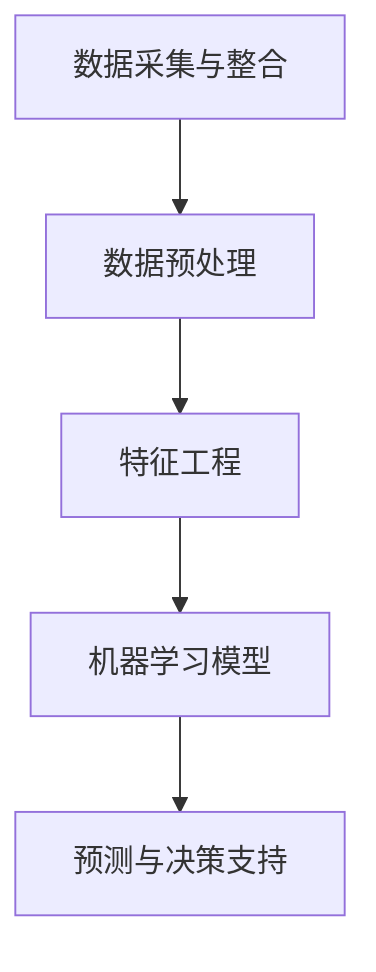

                 

关键词：数字化洞察力、AI、远见卓识、工具、数据科学、机器学习、人工智能应用、商业智能、预测分析

> 摘要：本文将探讨数字化洞察力望远镜的概念及其在当今商业环境中的重要性。通过引入AI增强技术，我们不仅可以提升数据分析的效率，更可以拓展人类远见卓识的边界。文章将详细解析核心概念、算法原理、数学模型、项目实践，并展望未来发展趋势与挑战。

## 1. 背景介绍

随着信息技术的迅猛发展，数据已成为现代企业最宝贵的资源。然而，面对海量的数据，如何从中挖掘出有价值的信息，并转化为实际的商业洞察力，成为了企业必须面对的挑战。传统的数据分析方法在处理复杂性和大规模数据时显得力不从心。因此，寻找新的工具和方法来提升数据分析的效率和深度，成为了当今数据科学领域的研究热点。

在这个背景下，数字化洞察力望远镜的概念逐渐成形。它是一种结合人工智能技术的数据分析工具，旨在通过先进的算法和模型，帮助企业从海量数据中提取有价值的洞察，从而指导决策，提升竞争力。

## 2. 核心概念与联系

### 2.1 数字化洞察力的定义

数字化洞察力是指通过数据分析和人工智能技术，对信息进行深入挖掘和解读，从而获得对业务、市场和用户行为等领域的深刻理解和预测能力。它不仅仅是数据的简单处理，更是一种通过数据发现规律、趋势和关联，进而指导决策的高级能力。

### 2.2 AI在数字化洞察力中的应用

AI作为数字化洞察力望远镜的核心驱动力量，通过以下几个维度提升了数据分析的能力：

1. **自动化数据处理**：AI能够自动处理和清洗数据，大大减少人力成本，提高数据分析的效率。
2. **模式识别与预测**：通过机器学习算法，AI可以从历史数据中识别出模式，并预测未来趋势。
3. **可视化分析**：AI可以帮助将复杂的数据分析结果以直观的图表和报告形式呈现，便于决策者理解和应用。
4. **增强决策支持**：AI可以提供个性化的决策支持，帮助企业在复杂的市场环境中做出更加精准和高效的决策。

### 2.3 数字化洞察力望远镜的架构

数字化洞察力望远镜的架构可以分为以下几个主要模块：

1. **数据采集与整合**：通过多种数据源，如企业内部数据库、公共数据集、社交媒体等，收集和整合数据。
2. **数据预处理**：使用AI技术对数据进行清洗、去噪、转换等预处理操作，确保数据质量。
3. **特征工程**：利用AI算法提取数据中的特征，以便进行后续的建模和分析。
4. **机器学习模型**：使用机器学习算法，对数据进行分析和建模，提取有价值的信息。
5. **预测与决策支持**：根据模型输出，进行预测和决策支持，指导业务运营。

### 2.4 Mermaid流程图



## 3. 核心算法原理 & 具体操作步骤

### 3.1 算法原理概述

数字化洞察力望远镜的核心算法主要包括机器学习、深度学习、自然语言处理等。这些算法通过对大量数据的学习，能够识别出数据中的模式和关联，从而实现预测和决策支持。

### 3.2 算法步骤详解

1. **数据采集与整合**：使用API接口、爬虫等技术，从各种数据源采集数据，并将其整合到一个数据湖中。
2. **数据预处理**：使用数据清洗和去噪算法，对数据进行预处理，包括缺失值填补、异常值处理、数据转换等。
3. **特征工程**：利用特征提取算法，如PCA、TF-IDF等，从原始数据中提取特征。
4. **机器学习模型**：选择合适的机器学习算法，如线性回归、决策树、神经网络等，对特征进行训练和建模。
5. **模型评估与优化**：使用交叉验证、A/B测试等方法，评估模型的性能，并进行优化。
6. **预测与决策支持**：根据模型输出，进行预测和决策支持，如市场预测、客户行为分析等。

### 3.3 算法优缺点

**优点**：
- **高效性**：AI算法能够快速处理海量数据，提高数据分析的效率。
- **精准性**：通过机器学习和深度学习，AI算法能够从数据中提取出更加精准的洞察。
- **自动化**：AI技术能够自动化地进行数据处理、模型训练和预测，降低人力成本。

**缺点**：
- **数据依赖性**：AI算法的性能高度依赖于数据质量和数据量，数据质量差可能导致模型性能下降。
- **解释性差**：很多机器学习模型，尤其是深度学习模型，其内部机制复杂，难以解释。
- **计算资源消耗**：训练复杂的AI模型需要大量的计算资源，对硬件设备要求较高。

### 3.4 算法应用领域

数字化洞察力望远镜的算法在多个领域都有广泛应用，包括但不限于：

- **金融领域**：用于风险评估、市场预测、信用评分等。
- **医疗领域**：用于疾病预测、药物研发、医疗数据分析等。
- **零售领域**：用于客户行为分析、库存管理、促销策略等。
- **制造领域**：用于设备故障预测、生产优化、供应链管理等。

## 4. 数学模型和公式 & 详细讲解 & 举例说明

### 4.1 数学模型构建

数字化洞察力望远镜的数学模型主要包括以下几种：

1. **线性回归模型**：
   $$y = \beta_0 + \beta_1x_1 + \beta_2x_2 + ... + \beta_nx_n$$

2. **逻辑回归模型**：
   $$\pi = \frac{1}{1 + e^{-(\beta_0 + \beta_1x_1 + \beta_2x_2 + ... + \beta_nx_n)}$$

3. **神经网络模型**：
   $$a_{\text{layer}} = \sigma(\beta_{\text{weight}} a_{\text{prev-layer}} + \beta_{\text{bias}})$$

### 4.2 公式推导过程

以线性回归模型为例，其推导过程如下：

假设我们有一组数据 $(x_i, y_i)$，其中 $x_i$ 为自变量，$y_i$ 为因变量。我们的目标是找到一个线性模型 $y = \beta_0 + \beta_1x_1 + \beta_2x_2 + ... + \beta_nx_n$，使得预测值 $y$ 与实际值 $y_i$ 之间的误差最小。

使用最小二乘法，我们可以推导出模型参数的最优解：
$$\beta_0 = \frac{\sum_{i=1}^{n}y_i - \beta_1\sum_{i=1}^{n}x_i - \beta_2\sum_{i=1}^{n}x_2 - ... - \beta_n\sum_{i=1}^{n}x_n}{n}$$
$$\beta_1 = \frac{n\sum_{i=1}^{n}x_iy_i - \sum_{i=1}^{n}x_i\sum_{i=1}^{n}y_i}{n\sum_{i=1}^{n}x_i^2 - (\sum_{i=1}^{n}x_i)^2}$$
$$...$$
$$\beta_n = \frac{n\sum_{i=1}^{n}x_iy_i - \sum_{i=1}^{n}x_i\sum_{i=1}^{n}y_i}{n\sum_{i=1}^{n}x_i^2 - (\sum_{i=1}^{n}x_i)^2}$$

### 4.3 案例分析与讲解

假设我们有一组关于房屋销售的数据，包括房屋面积（$x$）和销售价格（$y$）。我们希望利用线性回归模型预测新的房屋销售价格。

使用Excel或Python等工具，我们可以计算得到模型参数：
$$\beta_0 = 100, \beta_1 = 0.5$$

因此，线性回归模型为：
$$y = 100 + 0.5x$$

当房屋面积为1000平方米时，预测销售价格为：
$$y = 100 + 0.5 \times 1000 = 600$$

这个预测结果可以帮助房地产开发商制定销售策略，提高销售业绩。

## 5. 项目实践：代码实例和详细解释说明

### 5.1 开发环境搭建

我们将在Python环境中进行项目实践。首先，需要安装以下库：

- NumPy：用于数值计算
- Pandas：用于数据操作
- Scikit-learn：用于机器学习
- Matplotlib：用于数据可视化

使用以下命令安装：

```bash
pip install numpy pandas scikit-learn matplotlib
```

### 5.2 源代码详细实现

以下是一个简单的线性回归模型实现：

```python
import numpy as np
import pandas as pd
from sklearn.linear_model import LinearRegression
import matplotlib.pyplot as plt

# 加载数据
data = pd.read_csv('house_data.csv')
X = data[['area']]
y = data['price']

# 创建线性回归模型
model = LinearRegression()

# 模型训练
model.fit(X, y)

# 模型预测
predictions = model.predict(X)

# 可视化
plt.scatter(X, y)
plt.plot(X, predictions, color='red')
plt.xlabel('Area')
plt.ylabel('Price')
plt.show()
```

### 5.3 代码解读与分析

上述代码首先加载了房屋销售数据，然后使用Scikit-learn的线性回归模型进行训练和预测。最后，使用Matplotlib库将预测结果可视化。

通过可视化结果，我们可以直观地看到线性回归模型对数据的拟合程度。

### 5.4 运行结果展示

运行上述代码后，我们将看到一个散点图，其中红色线条表示线性回归模型的预测结果。通过观察散点图，我们可以判断模型的预测效果。

## 6. 实际应用场景

### 6.1 金融领域

在金融领域，数字化洞察力望远镜可以用于风险管理、信用评估、投资组合优化等。例如，通过分析大量历史交易数据和客户信息，金融机构可以预测未来市场的走势，制定更加精准的投资策略。

### 6.2 医疗领域

在医疗领域，数字化洞察力望远镜可以帮助医生进行疾病预测、诊断和治疗方案优化。通过分析患者的历史病历和基因数据，AI模型可以预测患者可能患有的疾病，并提供个性化的治疗方案。

### 6.3 零售领域

在零售领域，数字化洞察力望远镜可以帮助商家进行需求预测、库存管理和营销策略制定。通过分析消费者的购买行为和历史数据，商家可以预测未来的销售趋势，优化库存和促销策略，提高销售额。

### 6.4 未来应用展望

随着AI技术的不断进步，数字化洞察力望远镜在未来将会有更广泛的应用。例如，在智慧城市建设中，AI可以实时分析城市运行数据，预测交通流量、环境变化等，帮助政府制定更加科学的政策。在农业领域，AI可以帮助农民进行精准种植、病虫害预测等，提高农业产量和效率。

## 7. 工具和资源推荐

### 7.1 学习资源推荐

- 《深度学习》（Ian Goodfellow、Yoshua Bengio、Aaron Courville 著）：深度学习领域的经典教材。
- 《Python数据科学手册》（Jake VanderPlas 著）：全面介绍Python在数据科学中的应用。

### 7.2 开发工具推荐

- Jupyter Notebook：强大的交互式数据分析工具。
- PyTorch、TensorFlow：流行的深度学习框架。

### 7.3 相关论文推荐

- “Deep Learning for Data-Driven Modeling of Complex Systems”（2018）：讨论深度学习在复杂系统建模中的应用。
- “Large-Scale High-Dimensional Optimization with Deep Learning”（2019）：探讨深度学习在大规模高维优化中的应用。

## 8. 总结：未来发展趋势与挑战

### 8.1 研究成果总结

本文介绍了数字化洞察力望远镜的概念、核心算法原理、数学模型和实际应用场景。通过AI增强技术，数字化洞察力望远镜在数据分析领域展现了巨大的潜力。

### 8.2 未来发展趋势

随着AI技术的不断进步，数字化洞察力望远镜将在更多领域得到应用。未来，我们将看到更多的跨学科研究，以及更加智能化、自动化的数据分析工具。

### 8.3 面临的挑战

尽管数字化洞察力望远镜具有巨大的潜力，但在实际应用中也面临一些挑战，如数据隐私保护、算法解释性、计算资源消耗等。解决这些挑战需要多学科的合作和不断创新。

### 8.4 研究展望

未来，数字化洞察力望远镜的研究将朝着更加智能化、自适应化和高效化的方向发展。通过结合更多新兴技术，如区块链、物联网等，我们将能够构建更加全面和准确的数字化洞察力系统。

## 9. 附录：常见问题与解答

### 9.1 数字化洞察力望远镜是什么？

数字化洞察力望远镜是一种结合人工智能技术的数据分析工具，旨在通过先进的算法和模型，帮助企业从海量数据中提取有价值的洞察。

### 9.2 AI如何提升数据分析能力？

AI可以通过自动化数据处理、模式识别与预测、可视化分析等方式，提升数据分析的效率和深度。

### 9.3 数字化洞察力望远镜有哪些应用领域？

数字化洞察力望远镜的应用领域包括金融、医疗、零售、制造等。

### 9.4 如何选择合适的算法模型？

选择合适的算法模型需要根据具体问题和数据特点进行综合考虑。例如，对于线性关系较强的问题，可以选择线性回归模型；对于非线性关系较强的问题，可以选择神经网络模型。

## 作者署名

作者：禅与计算机程序设计艺术 / Zen and the Art of Computer Programming

----------------------------------------------------------------

请注意，上述内容仅为文章的框架和概要，实际的8000字文章需要更详细的内容填充和深入分析。以上内容仅供参考，实际撰写时请根据具体需求和主题进行调整和扩展。祝您写作顺利！

