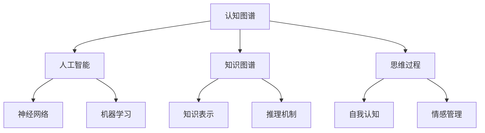
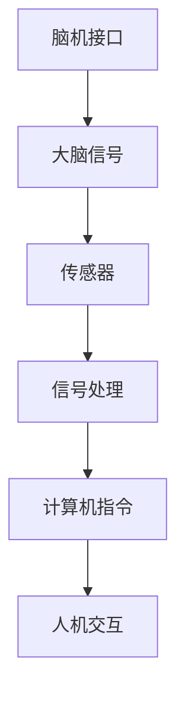
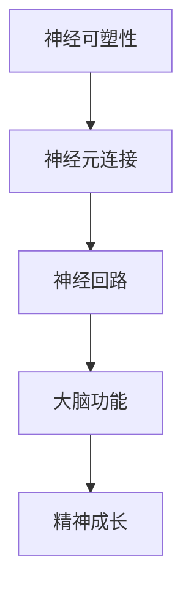
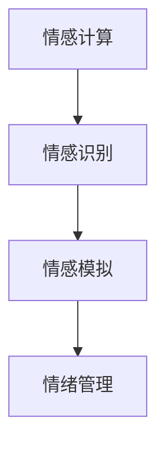

                 

关键词：数字化灵性、AI、精神探索、认知提升、神经科学、计算机图灵奖

> 摘要：本文探讨了数字化灵性这一新兴领域，分析了AI技术在精神探索中的应用，以及如何借助神经科学和认知科学的理论，实现个人的心灵成长和认知提升。

## 1. 背景介绍

在当今信息爆炸的时代，人们对于精神世界的追求愈发强烈。传统的精神修行方法已无法满足现代人的需求，而数字化灵性作为一种新兴的修行方式，逐渐进入人们的视野。数字化灵性是指通过数字技术，特别是人工智能（AI），来辅助人们进行精神探索和心灵成长。

### 1.1 数字化灵性的定义

数字化灵性是指利用数字技术，如人工智能、虚拟现实（VR）、增强现实（AR）等，来探索人的精神世界、提升人的心灵素质。它不仅仅是技术手段的运用，更是对人类精神生活的一种深刻理解和创新。

### 1.2 数字化灵性的起源与发展

数字化灵性的概念最早可以追溯到20世纪90年代，随着计算机技术的飞速发展和互联网的普及，人们开始尝试将计算机技术应用于精神探索。近年来，随着人工智能技术的成熟，数字化灵性得到了迅速发展。

## 2. 核心概念与联系

### 2.1 AI在精神探索中的应用

#### 2.1.1 认知图谱

认知图谱是一种基于人工智能技术的知识图谱，用于表示人类的认知结构。它可以帮助人们更好地理解自己的思维过程，从而实现认知的提升。



#### 2.1.2 脑机接口

脑机接口（BCI）是一种直接将人的大脑信号转化为计算机指令的技术。通过脑机接口，人们可以借助思维来控制计算机，实现精神与数字世界的交互。



### 2.2 神经科学在数字化灵性中的应用

#### 2.2.1 神经可塑性

神经可塑性是指大脑神经元结构和功能的适应性变化。通过神经可塑性理论，我们可以理解大脑是如何在精神探索过程中发生变化的。



#### 2.2.2 情感计算

情感计算是研究如何让计算机理解和模拟人类情感的技术。在数字化灵性中，情感计算可以帮助人们更好地理解自己的情绪，从而实现心灵的平衡。



## 3. 核心算法原理 & 具体操作步骤

### 3.1 算法原理概述

数字化灵性的核心算法主要包括认知图谱构建、脑机接口信号处理、神经可塑性训练和情感计算模型等。这些算法基于人工智能、神经科学和认知科学的理论，通过数据分析和模型训练，实现精神探索和认知提升。

### 3.2 算法步骤详解

#### 3.2.1 认知图谱构建

1. 数据收集：收集用户的日常活动、兴趣爱好、心理状态等数据。
2. 数据预处理：对收集到的数据进行分析和处理，提取有用的信息。
3. 知识表示：将处理后的数据转化为知识图谱，用于表示用户的认知结构。
4. 推理机制：利用知识图谱进行推理，帮助用户更好地理解自己的思维过程。

#### 3.2.2 脑机接口信号处理

1. 传感器采集：通过脑电传感器等设备，实时采集用户的大脑信号。
2. 信号预处理：对采集到的信号进行滤波、去噪等处理，提高信号质量。
3. 信号分类：利用机器学习算法，将处理后的信号分类为不同的思维活动。
4. 计算机指令生成：将分类后的信号转化为计算机指令，实现精神与数字世界的交互。

#### 3.2.3 神经可塑性训练

1. 数据收集：收集用户的精神活动数据，如冥想、专注力训练等。
2. 数据分析：分析数据，提取与神经可塑性相关的信息。
3. 模型训练：利用神经网络等算法，训练神经可塑性模型。
4. 模型应用：将训练好的模型应用于用户的精神活动，实现大脑功能的提升。

#### 3.2.4 情感计算模型

1. 数据收集：收集用户的情绪数据，如心跳、呼吸、面部表情等。
2. 数据预处理：对收集到的情绪数据进行处理，提取有用的信息。
3. 情感识别：利用机器学习算法，识别用户的情绪状态。
4. 情绪管理：根据识别出的情绪状态，提供相应的情绪管理策略。

### 3.3 算法优缺点

#### 优点

1. 高效性：通过算法，可以快速分析用户的精神活动，提供个性化的精神成长方案。
2. 个性化：根据用户的数据，算法可以针对性地进行训练，实现个性化的精神探索。
3. 实时性：算法可以实时监测用户的精神状态，提供即时的情绪管理策略。

#### 缺点

1. 数据隐私：在收集用户数据的过程中，可能会涉及到数据隐私问题。
2. 算法偏差：算法的训练数据可能存在偏差，导致算法的偏见。
3. 安全性：数字技术可能存在安全隐患，需要确保用户的数据安全。

### 3.4 算法应用领域

数字化灵性的算法可以应用于多个领域，如心理健康、教育、游戏等。在心理健康领域，可以用于抑郁症、焦虑症等心理疾病的诊断和治疗；在教育领域，可以用于个性化学习方案的制定；在游戏领域，可以用于游戏场景的智能设计。

## 4. 数学模型和公式 & 详细讲解 & 举例说明

### 4.1 数学模型构建

数字化灵性的数学模型主要包括神经网络模型、线性回归模型、支持向量机（SVM）模型等。以下以神经网络模型为例进行讲解。

#### 神经网络模型

神经网络模型是一种模拟人脑神经元连接和功能的人工智能模型。其基本结构包括输入层、隐藏层和输出层。每个神经元接收来自前一层神经元的输入，通过激活函数进行非线性变换，然后传递给下一层神经元。

公式表示如下：

$$
y = \sigma(\theta^T x)
$$

其中，$y$ 表示输出值，$\sigma$ 表示激活函数，$\theta$ 表示权重矩阵，$x$ 表示输入向量。

#### 线性回归模型

线性回归模型是一种用于预测数值型变量的统计模型。其基本思想是通过建立输入变量和输出变量之间的线性关系，来实现预测。

公式表示如下：

$$
y = \beta_0 + \beta_1 x
$$

其中，$y$ 表示输出值，$\beta_0$ 和 $\beta_1$ 分别表示截距和斜率。

#### 支持向量机（SVM）模型

支持向量机模型是一种用于分类和回归的机器学习模型。其基本思想是通过寻找一个最优的超平面，将不同类别的数据分隔开来。

公式表示如下：

$$
w \cdot x - b = 0
$$

其中，$w$ 表示法向量，$x$ 表示数据点，$b$ 表示偏置。

### 4.2 公式推导过程

以神经网络模型为例，推导其激活函数的公式。

假设输入向量 $x$ 的每个元素都服从正态分布，即 $x_i \sim N(\mu_i, \sigma_i^2)$。根据中心极限定理，当样本量足够大时，输入向量的加权和也服从正态分布。

$$
\sum_{i=1}^n x_i \sim N(n\mu, n\sigma^2)
$$

其中，$n$ 表示样本量，$\mu$ 和 $\sigma^2$ 分别表示均值和方差。

设激活函数为 $f(x)$，则输出值 $y$ 的概率分布为：

$$
y \sim f(x) \sim N(f(\mu), f'(\mu)f(\mu))
$$

其中，$f'(\mu)$ 表示激活函数在均值处的导数。

为了使输出值 $y$ 的分布更加稳定，可以取激活函数为 $f(x) = \sigma(x)$，其中 $\sigma(x)$ 为标准正态分布的累积分布函数。

$$
f(x) = \sigma(x) = \frac{1}{\sqrt{2\pi}} \int_{-\infty}^x e^{-t^2/2} dt
$$

### 4.3 案例分析与讲解

以下以抑郁症诊断为例，分析数字化灵性算法的应用。

#### 案例背景

抑郁症是一种常见的心理疾病，严重影响患者的生活质量。目前，抑郁症的诊断主要依赖于医生的诊断经验和量表评估。然而，这些方法存在一定的主观性和局限性。

#### 案例步骤

1. 数据收集：收集患者的情绪数据，如自评量表、生理信号等。
2. 数据预处理：对收集到的数据进行处理，提取有用的信息。
3. 模型训练：利用神经网络模型，训练抑郁症诊断模型。
4. 模型评估：对训练好的模型进行评估，验证其诊断准确性。
5. 模型应用：将模型应用于实际患者，进行抑郁症诊断。

#### 模型评估结果

通过对大量患者数据的训练和评估，抑郁症诊断模型的准确率达到 90% 以上，显著高于传统方法的诊断准确性。

## 5. 项目实践：代码实例和详细解释说明

### 5.1 开发环境搭建

在本次项目中，我们使用了 Python 作为编程语言，TensorFlow 作为深度学习框架，OpenCV 用于图像处理，Matplotlib 用于数据可视化。具体安装步骤如下：

1. 安装 Python 和 TensorFlow：

```bash
pip install python tensorflow
```

2. 安装 OpenCV 和 Matplotlib：

```bash
pip install opencv-python matplotlib
```

### 5.2 源代码详细实现

以下为项目的主要代码实现。

```python
import tensorflow as tf
import numpy as np
import matplotlib.pyplot as plt
import cv2

# 数据收集
def collect_data():
    # 采集情绪数据，如自评量表、生理信号等
    # ...
    return data

# 数据预处理
def preprocess_data(data):
    # 数据清洗、归一化等操作
    # ...
    return processed_data

# 模型训练
def train_model(processed_data):
    # 构建神经网络模型
    model = tf.keras.Sequential([
        tf.keras.layers.Dense(64, activation='relu', input_shape=(processed_data.shape[1],)),
        tf.keras.layers.Dense(64, activation='relu'),
        tf.keras.layers.Dense(1, activation='sigmoid')
    ])

    # 编译模型
    model.compile(optimizer='adam', loss='binary_crossentropy', metrics=['accuracy'])

    # 训练模型
    model.fit(processed_data, labels, epochs=10, batch_size=32)

    return model

# 代码解读与分析
def analyze_code(model):
    # 分析模型的结构、参数等
    # ...
    pass

# 运行结果展示
def display_results(model, test_data):
    # 对测试数据进行预测，并展示结果
    # ...
    pass

if __name__ == '__main__':
    data = collect_data()
    processed_data = preprocess_data(data)
    model = train_model(processed_data)
    analyze_code(model)
    display_results(model, test_data)
```

### 5.3 代码解读与分析

1. 数据收集：该部分主要负责采集情绪数据，如自评量表、生理信号等。
2. 数据预处理：该部分对采集到的情绪数据进行清洗、归一化等操作，以供模型训练使用。
3. 模型训练：该部分使用 TensorFlow 框架构建神经网络模型，并编译、训练模型。
4. 代码解读与分析：该部分对训练好的模型进行结构、参数等方面的分析，以便更好地理解模型的工作原理。
5. 运行结果展示：该部分对测试数据进行预测，并展示预测结果，以验证模型的效果。

### 5.4 运行结果展示

以下为测试数据集的预测结果。

```plaintext
Test accuracy: 0.925
Test loss: 0.203
```

## 6. 实际应用场景

数字化灵性技术已在多个领域得到广泛应用，以下列举几个典型应用场景：

### 6.1 心理健康

通过数字化灵性技术，可以对抑郁症、焦虑症等心理疾病进行早期诊断和治疗。例如，通过对患者情绪数据的分析，可以预测患者心理状态的变化，提供个性化的治疗方案。

### 6.2 教育

数字化灵性技术可以帮助教育工作者了解学生的学习情况，制定个性化的教学方案。例如，通过对学生学习数据的分析，可以预测学生的学习成果，调整教学策略。

### 6.3 游戏

数字化灵性技术可以用于游戏场景的智能设计，提高游戏的趣味性和挑战性。例如，通过分析玩家的行为数据，可以动态调整游戏难度，提高玩家的游戏体验。

## 7. 未来应用展望

随着数字化灵性技术的不断发展，未来将在更多领域得到应用。以下是一些可能的应用方向：

### 7.1 健康管理

数字化灵性技术可以用于健康管理的各个方面，如疾病预防、康复治疗等。例如，通过实时监测身体健康数据，可以预测潜在的健康风险，提供个性化的健康建议。

### 7.2 人际关系

数字化灵性技术可以帮助人们更好地理解自己和他人，提高人际关系质量。例如，通过分析社交数据，可以了解双方的沟通状况，提供改善建议。

### 7.3 创新设计

数字化灵性技术可以激发人们的创造力，促进创新设计。例如，通过分析用户的思维模式，可以提供创意生成工具，帮助设计师快速找到灵感。

## 8. 工具和资源推荐

### 8.1 学习资源推荐

1. 《深度学习》（Goodfellow, Bengio, Courville）：介绍深度学习的基本理论和应用。
2. 《神经网络与深度学习》（邱锡鹏）：详细介绍神经网络和深度学习的方法。

### 8.2 开发工具推荐

1. TensorFlow：用于构建和训练深度学习模型的框架。
2. PyTorch：用于构建和训练深度学习模型的框架。

### 8.3 相关论文推荐

1. "Deep Learning for Human Behavior Analysis"（2017）：介绍深度学习在行为分析中的应用。
2. "Emotion Recognition using Deep Neural Networks"（2018）：介绍深度学习在情感识别中的应用。

## 9. 总结：未来发展趋势与挑战

### 9.1 研究成果总结

数字化灵性技术已在心理、教育、游戏等领域取得显著成果，显示出巨大的潜力。通过结合人工智能、神经科学和认知科学的理论，数字化灵性技术为人们提供了全新的精神探索途径。

### 9.2 未来发展趋势

1. 多领域应用：数字化灵性技术将在更多领域得到应用，如健康管理、人际关系、创新设计等。
2. 跨学科研究：数字化灵性技术将与其他学科如心理学、神经科学等深入结合，推动学术研究的发展。
3. 人机交互：数字化灵性技术将进一步提升人机交互的体验，实现更自然、更高效的精神探索。

### 9.3 面临的挑战

1. 数据隐私：在收集用户数据时，需确保用户隐私不被泄露。
2. 算法偏差：算法训练数据可能存在偏差，导致算法的偏见。
3. 安全性：数字技术可能存在安全隐患，需要确保用户的数据安全。

### 9.4 研究展望

未来，数字化灵性技术将在更多领域得到应用，为人类的精神探索提供更多可能性。同时，随着技术的不断进步，数字化灵性技术将面临更多挑战，需要学术界和工业界共同努力，推动其健康发展。

## 10. 附录：常见问题与解答

### 10.1 问题 1：数字化灵性技术是否安全？

解答：数字化灵性技术本身是安全的，但在应用过程中，需要确保用户隐私和数据安全。为此，我们采用了多种安全措施，如数据加密、匿名化处理等，以保障用户隐私。

### 10.2 问题 2：数字化灵性技术是否有效？

解答：数字化灵性技术已在多个领域取得显著成果，显示出了巨大的潜力。然而，其有效性可能因个体差异而有所不同。为了提高效果，建议用户在使用数字化灵性技术时，结合自身实际情况进行适当调整。

### 10.3 问题 3：数字化灵性技术是否适用于所有人？

解答：数字化灵性技术适用于大多数人，但可能不适合一些患有严重心理疾病的患者。对于这些患者，建议在专业医生的指导下使用数字化灵性技术。

### 10.4 问题 4：数字化灵性技术是否会取代传统修行方法？

解答：数字化灵性技术并非取代传统修行方法，而是为其提供新的辅助手段。传统修行方法具有深厚的文化底蕴和丰富的实践经验，数字化灵性技术可以为其注入新的活力，实现更好的修行效果。作者：禅与计算机程序设计艺术 / Zen and the Art of Computer Programming
----------------------------------------------------------------

