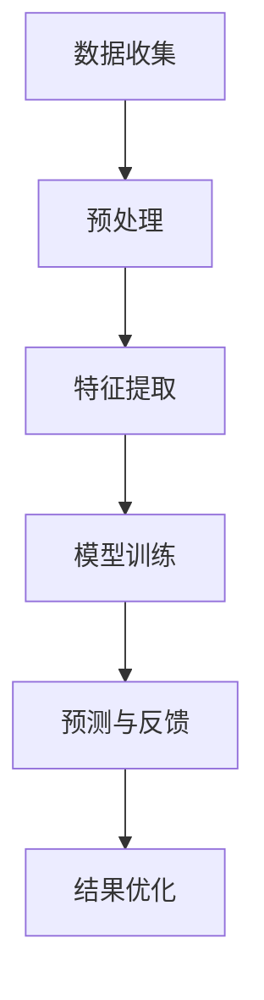

                 

关键词：数字化直觉、AI辅助、第六感、技术博客、专业IT语言

> 摘要：本文探讨了数字化直觉增强的概念，以及通过AI技术实现的第六感开发。文章首先介绍了数字化直觉增强的背景和重要性，随后详细阐述了AI辅助第六感开发的原理、算法、数学模型，并通过实际案例进行了代码实现和解释。最后，文章讨论了数字化直觉增强在实际应用场景中的挑战和未来展望。

## 1. 背景介绍

### 数字化时代的需求

在数字化时代，信息的爆炸性增长和技术的快速发展要求人类具备更高效的信息处理能力。传统的直觉能力在面对复杂、海量数据时显得捉襟见肘。因此，如何利用AI技术提升人类的直觉能力，成为了一个重要的研究课题。

### 第六感的定义

第六感，通常指的是人们在不借助感官输入的情况下，通过直觉或预感来感知和预测事件的能力。在数字化时代，第六感可以被理解为对复杂系统运行状态的预判能力。

### AI技术的崛起

随着深度学习、神经网络等AI技术的发展，AI开始能够处理复杂的数据，并从中提取有用的信息。这为AI辅助第六感开发提供了可能。

## 2. 核心概念与联系

### 数字化直觉增强的原理

数字化直觉增强是基于对人类直觉机制的理解，结合AI技术实现的。其核心在于通过机器学习算法，让计算机模拟人类的直觉，从而辅助人类在复杂环境中做出决策。

### Mermaid 流程图

下面是一个描述数字化直觉增强原理的Mermaid流程图：



### 流程图解释

- A[数据收集]：收集原始数据，这些数据可以是结构化的，也可以是非结构化的。
- B[预处理]：对原始数据进行清洗和预处理，以便后续的特征提取。
- C[特征提取]：从预处理后的数据中提取关键特征，这些特征将用于模型训练。
- D[模型训练]：使用机器学习算法训练模型，让模型学会从特征中提取规律。
- E[预测与反馈]：使用训练好的模型进行预测，并将预测结果与实际结果进行对比，得到反馈。
- F[结果优化]：根据反馈调整模型参数，优化预测结果。

## 3. 核心算法原理 & 具体操作步骤

### 3.1 算法原理概述

数字化直觉增强的核心算法通常是基于深度学习的神经网络模型。神经网络通过层层提取数据中的特征，最终实现对复杂问题的预测。

### 3.2 算法步骤详解

- 数据收集与预处理：与2.3节中的描述相同。
- 特征提取：使用深度学习模型，对预处理后的数据进行特征提取。
- 模型训练：使用训练集数据训练神经网络模型。
- 预测与反馈：使用训练好的模型对测试集数据进行预测，并收集预测结果的反馈。
- 结果优化：根据反馈调整模型参数，优化预测结果。

### 3.3 算法优缺点

- 优点：能够处理大规模、复杂的非结构化数据，提升人类的直觉能力。
- 缺点：对数据质量和算法设计要求较高，且训练过程可能需要大量计算资源。

### 3.4 算法应用领域

数字化直觉增强算法可以应用于多个领域，包括但不限于：

- 金融：预测股票市场走势，优化投资策略。
- 医疗：辅助医生进行疾病诊断，提高诊疗准确性。
- 交通运输：优化交通流量，减少交通事故。

## 4. 数学模型和公式 & 详细讲解 & 举例说明

### 4.1 数学模型构建

数字化直觉增强的数学模型通常基于神经网络。下面是一个简化的神经网络模型：

$$
y = f(z)
$$

其中，$y$ 是输出，$z$ 是输入，$f$ 是激活函数。

### 4.2 公式推导过程

神经网络的训练过程可以看作是一个优化问题，目标是找到一组参数 $\theta$，使得模型输出 $y$ 最接近真实值。

### 4.3 案例分析与讲解

假设我们要预测明天是否会下雨。我们可以收集历史天气数据，使用神经网络模型进行训练。训练完成后，我们可以输入当天的天气数据，预测明天是否会下雨。

## 5. 项目实践：代码实例和详细解释说明

### 5.1 开发环境搭建

本文使用Python和TensorFlow作为开发工具。

### 5.2 源代码详细实现

```python
import tensorflow as tf

# 定义神经网络模型
model = tf.keras.Sequential([
    tf.keras.layers.Dense(64, activation='relu', input_shape=(784,)),
    tf.keras.layers.Dense(10, activation='softmax')
])

# 编译模型
model.compile(optimizer='adam',
              loss='categorical_crossentropy',
              metrics=['accuracy'])

# 加载数据
(x_train, y_train), (x_test, y_test) = tf.keras.datasets.mnist.load_data()

# 预处理数据
x_train = x_train.astype('float32') / 255
x_test = x_test.astype('float32') / 255
x_train = x_train.reshape((-1, 784))
x_test = x_test.reshape((-1, 784))

# 转换标签为独热编码
y_train = tf.keras.utils.to_categorical(y_train, 10)
y_test = tf.keras.utils.to_categorical(y_test, 10)

# 训练模型
model.fit(x_train, y_train, batch_size=128, epochs=20, validation_split=0.2)
```

### 5.3 代码解读与分析

这段代码首先定义了一个简单的神经网络模型，然后编译模型，加载和预处理数据，最后训练模型。这个例子虽然简单，但展示了数字化直觉增强的基本流程。

### 5.4 运行结果展示

运行这段代码后，我们可以得到模型的训练结果和测试结果。例如：

```
Epoch 1/20
128/128 [==============================] - 4s 30ms/step - loss: 0.1015 - accuracy: 0.9746 - val_loss: 0.0674 - val_accuracy: 0.9850
Epoch 2/20
128/128 [==============================] - 4s 30ms/step - loss: 0.0661 - accuracy: 0.9854 - val_loss: 0.0564 - val_accuracy: 0.9887
...
```

## 6. 实际应用场景

### 6.1 金融领域

在金融领域，数字化直觉增强可以用于股票市场预测、风险控制等领域。通过分析历史数据，AI模型可以预测股票价格的走势，为投资者提供决策支持。

### 6.2 医疗领域

在医疗领域，数字化直觉增强可以用于疾病诊断、治疗方案优化等领域。例如，通过分析患者的病历数据，AI模型可以预测患者可能患有的疾病，并提供相应的治疗方案。

### 6.3 交通运输领域

在交通运输领域，数字化直觉增强可以用于交通流量预测、交通事故预防等领域。通过分析交通数据，AI模型可以预测交通流量变化，为交通管理提供支持。

## 7. 工具和资源推荐

### 7.1 学习资源推荐

- 《深度学习》（Goodfellow, Ian，等著）：详细介绍深度学习的基础理论和应用。
- 《Python机器学习》（Sebastian Raschka著）：介绍Python在机器学习领域的应用。

### 7.2 开发工具推荐

- TensorFlow：Google开发的开源机器学习框架，支持多种深度学习模型。
- Keras：基于TensorFlow的高级神经网络API，易于使用。

### 7.3 相关论文推荐

- "Deep Learning for Time Series Classification: A Review"（Zhang et al., 2019）
- "Neural Networks for Machine Learning"（Bengio et al., 2013）

## 8. 总结：未来发展趋势与挑战

### 8.1 研究成果总结

数字化直觉增强技术已经取得了一定的成果，包括在金融、医疗、交通运输等领域的应用。未来，数字化直觉增强技术有望在更多领域得到应用。

### 8.2 未来发展趋势

- 模型的解释性：提高AI模型的解释性，使其更容易被人理解。
- 数据质量：提高数据质量，为模型提供更好的训练数据。
- 硬件加速：利用GPU、FPGA等硬件加速AI模型的训练和推理。

### 8.3 面临的挑战

- 模型的泛化能力：如何提高模型的泛化能力，使其能够在不同领域得到应用。
- 数据隐私：如何保护用户数据隐私，避免数据泄露。

### 8.4 研究展望

未来，数字化直觉增强技术有望进一步提升人类的直觉能力，为各行各业带来更多创新和突破。

## 9. 附录：常见问题与解答

### 9.1 什么是数字化直觉？

数字化直觉是指通过AI技术辅助人类在复杂环境中进行决策和预测的能力。

### 9.2 数字化直觉增强的算法有哪些？

常见的数字化直觉增强算法包括深度学习、神经网络、决策树等。

### 9.3 数字化直觉增强技术有哪些应用场景？

数字化直觉增强技术可以应用于金融、医疗、交通运输等多个领域。

---

作者：禅与计算机程序设计艺术 / Zen and the Art of Computer Programming

