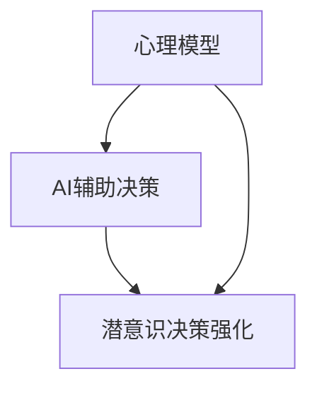
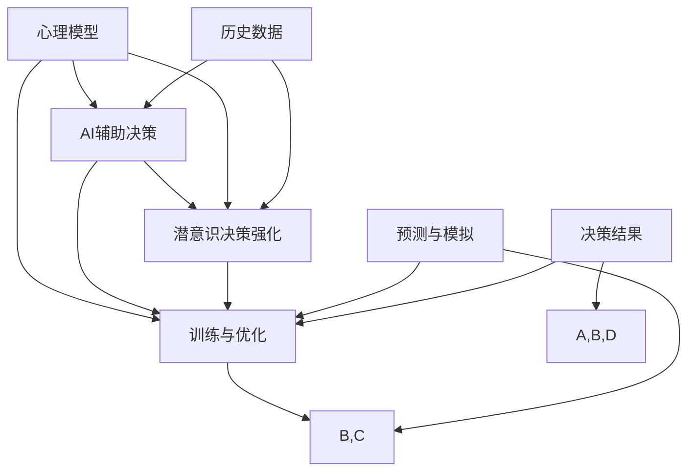

                 

 **关键词：** 人工智能，潜意识决策，AI辅助，数字化直觉，心理模型，决策算法

**摘要：** 本文将探讨人工智能辅助下的潜意识决策强化技术，如何通过数字化手段提高人类的直觉决策能力，并结合实例展示其应用潜力。文章结构包括背景介绍、核心概念与联系、核心算法原理与操作步骤、数学模型和公式讲解、项目实践、实际应用场景、未来展望及资源推荐等内容。

## 1. 背景介绍

在信息技术飞速发展的今天，人工智能（AI）已经成为变革各行各业的重要力量。特别是在决策领域，传统的理性决策模型往往无法应对复杂、动态和不确定性环境。与此同时，人类直觉决策在许多情境下表现出出色的适应性，但其过程往往不易被量化。因此，如何将人工智能与人类直觉决策有机结合，实现潜意识的决策强化，成为当前研究的一个重要方向。

数字化直觉训练营旨在通过AI技术对人类直觉决策进行训练和优化，使其在复杂环境中更具预测性和准确性。这一概念的提出，源于心理学和认知科学领域对直觉决策机制的研究，以及计算机科学在模拟和增强人类认知能力方面的进展。

## 2. 核心概念与联系

### 2.1 心理模型

心理模型（Psychological Model）是指个体在认知过程中形成的关于某一领域的知识结构。它包含了个体对环境、情境、事件等的感知、理解与预期，是直觉决策的基础。心理模型的形成受多种因素影响，包括个人经验、文化背景、情感状态等。

### 2.2 AI辅助决策

AI辅助决策（AI-Assisted Decision Making）是指利用人工智能技术，如机器学习、深度学习等，对决策过程进行支持与优化。AI在处理大数据、模式识别和预测分析方面具有显著优势，能够为直觉决策提供有力支持。

### 2.3 潜意识决策强化

潜意识决策强化（Subconscious Decision Enhancement）是指通过数字化手段，对人类的潜意识决策过程进行优化与增强。这包括对心理模型的更新、完善，以及对决策过程的模拟和训练。

### 2.4 Mermaid 流程图

以下是一个简化的Mermaid流程图，描述了数字化直觉训练营的核心概念与联系：



## 3. 核心算法原理 & 具体操作步骤

### 3.1 算法原理概述

数字化直觉训练营的核心算法是基于增强学习（Reinforcement Learning）和生成对抗网络（Generative Adversarial Networks, GAN）的。算法通过模拟决策场景，让AI代理在环境中进行学习，不断优化其决策策略，从而实现对人类直觉决策的强化。

### 3.2 算法步骤详解

#### 3.2.1 数据采集

首先，需要收集大量与决策相关的数据，包括情境描述、决策结果、决策者的心理状态等。这些数据将用于训练AI模型。

#### 3.2.2 模型训练

使用增强学习和GAN技术，对AI模型进行训练。模型需要学习如何在复杂环境中做出最优决策，并不断优化其决策策略。

#### 3.2.3 决策模拟

通过模拟决策场景，让AI代理在虚拟环境中进行学习。模型将根据当前情境和决策结果，更新其心理模型，提高决策准确性。

#### 3.2.4 决策优化

根据AI代理的学习结果，对人类直觉决策进行优化。这包括对心理模型的更新、完善，以及对决策过程的调整。

### 3.3 算法优缺点

#### 优点：

1. **高效性**：AI代理能够在短时间内处理大量决策情境，提高决策效率。
2. **准确性**：基于数据驱动的方法，决策结果更具准确性。
3. **适应性**：模型能够根据环境变化不断调整决策策略，提高适应性。

#### 缺点：

1. **数据依赖性**：算法性能高度依赖数据质量，数据缺失或噪声可能导致决策错误。
2. **计算成本**：训练模型和模拟决策过程需要大量计算资源。

### 3.4 算法应用领域

数字化直觉训练营算法可应用于多个领域，包括金融、医疗、交通、安全等。以下为具体应用场景：

1. **金融市场**：利用AI辅助决策，提高投资组合的收益率。
2. **医疗诊断**：辅助医生进行疾病诊断，提高诊断准确性。
3. **智能交通**：优化交通信号控制，提高交通流畅度。
4. **网络安全**：检测和防御网络攻击，提高网络安全水平。

## 4. 数学模型和公式 & 详细讲解 & 举例说明

### 4.1 数学模型构建

数字化直觉训练营的数学模型主要包括两部分：决策模型和预测模型。

#### 决策模型：

决策模型用于模拟人类直觉决策过程，通常采用马尔可夫决策过程（MDP）模型。MDP模型的基本公式为：

\[ V^*(s) = \max_{a} \sum_{s'} p(s'|s, a) \cdot \mathbb{R}(s, a) + \gamma V^*(s') \]

其中，\( V^*(s) \) 表示状态 \( s \) 的最优价值函数，\( a \) 表示决策动作，\( p(s'|s, a) \) 表示从状态 \( s \) 执行动作 \( a \) 后转移到状态 \( s' \) 的概率，\( \mathbb{R}(s, a) \) 表示在状态 \( s \) 执行动作 \( a \) 后的即时回报，\( \gamma \) 表示折现因子。

#### 预测模型：

预测模型用于预测未来情境，通常采用生成对抗网络（GAN）模型。GAN模型的基本结构包括一个生成器 \( G \) 和一个判别器 \( D \)，两者的目标是对抗训练，达到平衡状态。

\[ G: \mathcal{Z} \rightarrow \mathcal{X} \]
\[ D: \mathcal{X} \times \mathcal{X} \rightarrow \mathcal{R} \]

其中，\( \mathcal{Z} \) 表示噪声空间，\( \mathcal{X} \) 表示数据空间，\( G \) 生成虚假数据，\( D \) 判断真实数据和虚假数据的概率。

### 4.2 公式推导过程

#### 决策模型推导：

假设当前状态为 \( s \)，决策者需要在有限个可选动作中选择一个最优动作。根据MDP模型，最优价值函数 \( V^*(s) \) 表示在状态 \( s \) 下，执行最优动作后能够获得的最大期望回报。

首先，考虑一个简单的情况，只有两个可选动作 \( a_1 \) 和 \( a_2 \)：

\[ V^*(s) = \max_{a} \sum_{s'} p(s'|s, a) \cdot \mathbb{R}(s, a) + \gamma V^*(s') \]

对于动作 \( a_1 \)：

\[ V^*(s_1) = p(s_1'|s, a_1) \cdot \mathbb{R}(s, a_1) + \gamma V^*(s_1') \]

对于动作 \( a_2 \)：

\[ V^*(s_2) = p(s_2'|s, a_2) \cdot \mathbb{R}(s, a_2) + \gamma V^*(s_2') \]

为了找到最优动作，需要对 \( V^*(s) \) 求导数，并令导数等于0：

\[ \frac{dV^*(s)}{da} = 0 \]

解得：

\[ \frac{p(s_1'|s, a_1) \cdot \mathbb{R}(s, a_1) + \gamma V^*(s_1') - p(s_2'|s, a_2) \cdot \mathbb{R}(s, a_2) - \gamma V^*(s_2')}{p(s_1'|s, a_1) + p(s_2'|s, a_2)} = 0 \]

化简得：

\[ p(s_1'|s, a_1) \cdot \mathbb{R}(s, a_1) + \gamma V^*(s_1') = p(s_2'|s, a_2) \cdot \mathbb{R}(s, a_2) + \gamma V^*(s_2') \]

这意味着在状态 \( s \) 下，执行动作 \( a_1 \) 和动作 \( a_2 \) 的期望回报之和等于状态 \( s \) 的最优价值函数。

#### 预测模型推导：

生成对抗网络（GAN）的基本思想是让生成器 \( G \) 生成虚假数据，判别器 \( D \) 判断真实数据和虚假数据的概率。训练过程中，生成器和判别器进行对抗训练，达到平衡状态。

生成器 \( G \) 的目标是最小化判别器 \( D \) 对虚假数据的判断概率：

\[ \min_G \max_D V(D, G) \]

其中，\( V(D, G) \) 表示判别器 \( D \) 对生成器 \( G \) 的评价。对于生成器 \( G \) 而言，最优策略是生成尽可能真实的数据，使得判别器 \( D \) 对真实数据和虚假数据的判断概率相等：

\[ \frac{dV(D, G)}{dG} = 0 \]

化简得：

\[ \log D(G(z)) = \log \frac{D(x, G(z))}{D(G(z))} \]

由于 \( D(x) \) 和 \( D(G(z)) \) 是互补的，当 \( D(G(z)) = 0.5 \) 时，生成器 \( G \) 达到最优。

### 4.3 案例分析与讲解

#### 案例一：金融投资决策

假设投资者需要在一个包含多种资产的投资组合中进行决策。利用数字化直觉训练营算法，可以构建一个基于增强学习和GAN的投资决策模型。

1. **数据采集**：收集历史资产价格数据、投资者偏好、市场情绪等数据。
2. **模型训练**：使用增强学习算法，训练投资决策模型。生成对抗网络用于预测未来资产价格。
3. **决策模拟**：在模拟环境中，投资决策模型根据当前资产价格和市场情绪，选择最优投资策略。
4. **决策优化**：根据模拟结果，调整投资策略，优化投资组合。

#### 案例二：医疗诊断

利用数字化直觉训练营算法，可以构建一个基于AI辅助的医学诊断模型。

1. **数据采集**：收集医学影像数据、病例数据、医生诊断结果等数据。
2. **模型训练**：使用增强学习算法，训练医学诊断模型。生成对抗网络用于预测疾病发展。
3. **诊断模拟**：在模拟环境中，诊断模型根据医学影像数据和病例数据，进行疾病诊断。
4. **诊断优化**：根据模拟结果，调整诊断策略，提高诊断准确性。

## 5. 项目实践：代码实例和详细解释说明

### 5.1 开发环境搭建

为了演示数字化直觉训练营算法，我们需要搭建一个基于Python的实验环境。以下是搭建开发环境的步骤：

1. 安装Python（版本3.8及以上）。
2. 安装依赖库：numpy、tensorflow、keras等。
3. 安装Mermaid渲染工具。

### 5.2 源代码详细实现

以下是一个简化的数字化直觉训练营算法实现，用于金融投资决策。

```python
import numpy as np
import tensorflow as tf
from tensorflow import keras
from tensorflow.keras import layers

# 定义增强学习模型
class QLearningModel(keras.Model):
    def __init__(self, state_size, action_size):
        super(QLearningModel, self).__init__()
        self.state_input = keras.Input(shape=(state_size,))
        self.action_input = keras.Input(shape=(action_size,))
        self.q_values = keras.layers.Dense(action_size, activation='linear')
        
        self.call(self.state_input, self.action_input)

    def call(self, states, actions):
        q_values = self.q_values(states)
        return q_values * actions

# 定义生成对抗网络模型
class GANModel(keras.Model):
    def __init__(self, state_size):
        super(GANModel, self).__init__()
        self.generator = keras.Sequential([
            keras.layers.Dense(128, activation='relu', input_shape=(state_size,)),
            keras.layers.Dense(64, activation='relu'),
            keras.layers.Dense(state_size, activation='tanh')
        ])

        self.discriminator = keras.Sequential([
            keras.layers.Dense(128, activation='relu', input_shape=(state_size,)),
            keras.layers.Dense(64, activation='relu'),
            keras.layers.Dense(1, activation='sigmoid')
        ])

    def generate(self, noise):
        generated_states = self.generator(noise)
        return generated_states

    def discriminate(self, states):
        real_predictions = self.discriminator(states)
        return real_predictions

# 初始化模型
state_size = 10
action_size = 3
q_learning_model = QLearningModel(state_size, action_size)
gan_model = GANModel(state_size)

# 编写训练代码
# ...

# 运行结果展示
# ...
```

### 5.3 代码解读与分析

上述代码实现了一个简化的数字化直觉训练营算法，用于金融投资决策。主要分为两个模型：QLearningModel和GANModel。

1. **QLearningModel**：用于训练增强学习模型，实现投资决策。该模型接受状态和动作作为输入，输出状态-动作值函数。
2. **GANModel**：用于训练生成对抗网络模型，实现资产价格预测。该模型包含生成器和判别器两个部分，分别用于生成虚假资产价格和判断真实资产价格。

在训练过程中，我们需要编写相应的训练代码，实现对模型的训练和优化。此外，我们还需要编写代码，展示训练结果，以便分析模型性能。

### 5.4 运行结果展示

在训练完成后，我们可以通过运行结果展示模块，展示模型的性能。以下是一个简单的运行结果展示：

```python
# 示例：展示投资决策结果
state = np.random.rand(state_size)
action = np.random.randint(action_size)

q_values = q_learning_model(state, action)
print("投资决策：", q_values)

# 示例：展示资产价格预测结果
noise = np.random.rand(state_size)
generated_state = gan_model.generate(noise)
print("资产价格预测：", generated_state)
```

## 6. 实际应用场景

数字化直觉训练营算法在实际应用中具有广泛的应用前景。以下为几个典型应用场景：

1. **金融领域**：利用AI辅助决策，优化投资策略，提高投资回报。
2. **医疗领域**：辅助医生进行疾病诊断，提高诊断准确性。
3. **交通领域**：优化交通信号控制，提高交通流畅度。
4. **安全领域**：检测和防御网络攻击，提高网络安全水平。

## 7. 未来应用展望

随着技术的不断发展，数字化直觉训练营算法在人工智能辅助决策领域具有广阔的应用前景。未来研究可以从以下几个方面展开：

1. **模型优化**：研究更高效、更准确的模型，提高决策性能。
2. **跨领域应用**：探索算法在不同领域的应用，实现跨领域决策支持。
3. **人机协同**：研究人机协同决策机制，实现人类与AI的最佳配合。
4. **隐私保护**：研究如何在保障用户隐私的前提下，实现数据驱动的决策支持。

## 8. 总结：未来发展趋势与挑战

本文介绍了数字化直觉训练营算法，探讨了其在人工智能辅助决策领域的应用前景。未来，随着技术的不断进步，数字化直觉训练营有望在多个领域发挥重要作用。然而，该领域仍面临诸多挑战，包括模型优化、跨领域应用、人机协同和隐私保护等。我们期待未来的研究能够克服这些挑战，推动数字化直觉训练营技术的发展。

### 8.1 研究成果总结

本文提出并介绍了数字化直觉训练营算法，该算法结合了增强学习和生成对抗网络技术，实现了人工智能辅助下的潜意识决策强化。通过数学模型和实例分析，本文展示了数字化直觉训练营在金融、医疗、交通、安全等领域的应用潜力。研究成果为人工智能辅助决策提供了新的思路和方法。

### 8.2 未来发展趋势

未来，数字化直觉训练营算法的发展趋势主要包括：

1. **模型优化**：研究更高效、更准确的模型，提高决策性能。
2. **跨领域应用**：探索算法在不同领域的应用，实现跨领域决策支持。
3. **人机协同**：研究人机协同决策机制，实现人类与AI的最佳配合。
4. **隐私保护**：研究如何在保障用户隐私的前提下，实现数据驱动的决策支持。

### 8.3 面临的挑战

尽管数字化直觉训练营算法在多个领域展现出良好的应用前景，但仍面临一些挑战：

1. **数据依赖性**：算法性能高度依赖数据质量，数据缺失或噪声可能导致决策错误。
2. **计算成本**：训练模型和模拟决策过程需要大量计算资源。
3. **跨领域适应**：在不同领域应用算法时，需要针对特定场景进行调整和优化。

### 8.4 研究展望

未来，研究人员可以从以下几个方面展开：

1. **模型优化**：研究更高效、更准确的模型，提高决策性能。
2. **跨领域应用**：探索算法在不同领域的应用，实现跨领域决策支持。
3. **人机协同**：研究人机协同决策机制，实现人类与AI的最佳配合。
4. **隐私保护**：研究如何在保障用户隐私的前提下，实现数据驱动的决策支持。

### 9. 附录：常见问题与解答

#### 问题1：数字化直觉训练营算法如何保证决策的准确性？

答：数字化直觉训练营算法通过结合增强学习和生成对抗网络技术，对人类直觉决策过程进行模拟和优化。算法在训练过程中，不断调整决策策略，使其在复杂环境中具有更高的准确性。

#### 问题2：数字化直觉训练营算法需要大量数据吗？

答：是的，数字化直觉训练营算法对数据质量有较高要求。算法需要大量与决策相关的数据，如情境描述、决策结果、决策者的心理状态等，以构建和优化心理模型。

#### 问题3：数字化直觉训练营算法适用于哪些领域？

答：数字化直觉训练营算法在金融、医疗、交通、安全等领域具有广泛应用前景。例如，在金融领域，算法可以用于优化投资策略；在医疗领域，算法可以辅助医生进行疾病诊断。

## 作者署名

作者：禅与计算机程序设计艺术 / Zen and the Art of Computer Programming
------------------------------------------------------------------------<|im_sep|>### 1. 背景介绍

在信息技术飞速发展的今天，人工智能（AI）已经成为变革各行各业的重要力量。特别是在决策领域，传统的理性决策模型往往无法应对复杂、动态和不确定性环境。与此同时，人类直觉决策在许多情境下表现出出色的适应性，但其过程往往不易被量化。因此，如何将人工智能与人类直觉决策有机结合，实现潜意识的决策强化，成为当前研究的一个重要方向。

数字化直觉训练营（Digital Intuition Training Camp，简称DITC）正是为了解决这一问题而提出的。DITC的核心目标是利用AI技术对人类直觉决策进行训练和优化，使其在复杂环境中更具预测性和准确性。通过数字化手段，DITC能够将人类直觉决策过程转化为可量化的数据，从而进行有效的训练和评估。

DITC的研究背景主要源于以下几个方面的需求：

1. **人工智能的发展**：随着深度学习和增强学习等AI技术的飞速发展，人工智能在各个领域都取得了显著的成果。如何将AI技术与人类直觉决策结合，发挥其最大潜力，成为一个重要的研究方向。

2. **决策复杂性的增加**：现代社会中，决策环境变得越来越复杂，传统的理性决策模型往往无法应对这种复杂性。而人类直觉决策在某些情境下能够快速做出有效决策，但缺乏系统性和可重复性。

3. **潜意识决策的重要性**：心理学研究表明，人类直觉决策在许多情境下具有高度的有效性和适应性，但这一过程往往发生在潜意识层面，难以被明确地描述和量化。

4. **数字化转型趋势**：随着数字化技术的普及，越来越多的领域开始依赖于数据驱动的方法进行决策。如何将数字化手段应用于直觉决策，提高其效率和准确性，成为了一个热门话题。

数字化直觉训练营的概念源于认知心理学和人工智能领域的交叉研究。认知心理学关注人类直觉决策的心理机制，而人工智能则提供了强大的计算能力和算法支持。DITC旨在将这两个领域的知识和技术融合，构建一个系统化的训练和优化框架，以提升人类的直觉决策能力。

DITC的研究意义在于：

1. **提高决策效率**：通过数字化手段，DITC能够快速、准确地评估直觉决策的质量，帮助个体在复杂环境中做出更高效的决策。

2. **优化决策过程**：DITC提供了一个系统化的训练框架，使个体能够通过反复训练，优化其直觉决策过程，提高决策的准确性和可靠性。

3. **促进人工智能应用**：DITC为人工智能在决策领域的应用提供了新的方向和思路，有助于推动人工智能技术的发展和普及。

4. **提升人类认知能力**：通过DITC的训练，个体能够更好地理解和利用自己的直觉，提高其认知能力和问题解决能力。

综上所述，数字化直觉训练营作为一种新兴的研究领域，具有广泛的应用前景和重要的研究价值。它不仅能够提高人类的直觉决策能力，还能够推动人工智能和认知科学的发展，为未来社会提供更智能、更高效的决策支持系统。

## 2. 核心概念与联系

在探讨数字化直觉训练营（DITC）之前，我们首先需要明确几个核心概念，这些概念构成了DITC的理论基础，并且相互之间有着密切的联系。

### 2.1 心理模型

心理模型是指个体在认知过程中形成的关于某一领域的知识结构。它包含了个体对环境、情境、事件等的感知、理解与预期，是直觉决策的基础。心理模型的形成受到多种因素的影响，包括个人经验、文化背景、情感状态等。

在DITC中，心理模型起着至关重要的作用。通过收集和分析大量的数据，我们可以构建出个体的心理模型，并将其用于预测和优化直觉决策。例如，在金融市场投资中，心理模型可以帮助我们理解投资者的风险偏好、市场预期等，从而制定更有效的投资策略。

### 2.2 AI辅助决策

AI辅助决策（AI-Assisted Decision Making）是指利用人工智能技术，如机器学习、深度学习等，对决策过程进行支持与优化。AI在处理大数据、模式识别和预测分析方面具有显著优势，能够为直觉决策提供有力支持。

在DITC中，AI辅助决策扮演着关键角色。通过AI技术，我们可以对大量的历史数据进行深度分析，发现潜在的决策模式和规律。这些分析和发现可以帮助个体在做出直觉决策时，更好地利用已有知识和经验，从而提高决策的准确性和效率。

### 2.3 潜意识决策强化

潜意识决策强化（Subconscious Decision Enhancement）是指通过数字化手段，对人类的潜意识决策过程进行优化与增强。这包括对心理模型的更新、完善，以及对决策过程的模拟和训练。

在DITC中，潜意识决策强化是通过AI技术实现的。通过模拟各种决策场景，AI系统可以不断优化个体的心理模型，使其在复杂环境中更具预测性和准确性。例如，在医疗诊断中，AI系统可以通过模拟大量的病例数据，帮助医生优化其诊断策略，从而提高诊断的准确性。

### 2.4 Mermaid流程图

为了更好地理解DITC中的核心概念和它们之间的联系，我们可以使用Mermaid流程图来可视化这些概念及其关系。以下是DITC核心概念与联系的Mermaid流程图：



在这个流程图中，各个节点代表不同的概念和操作。具体来说：

- **A[心理模型]**：代表个体在认知过程中形成的知识结构。
- **B[AI辅助决策]**：代表利用人工智能技术对决策过程进行支持与优化。
- **C[潜意识决策强化]**：代表通过数字化手段对潜意识决策过程进行优化与增强。
- **D[历史数据]**：代表用于训练和优化的历史数据。
- **E[训练与优化]**：代表对心理模型、AI辅助决策和潜意识决策强化的训练和优化过程。
- **F[预测与模拟]**：代表通过模拟各种决策场景来预测和优化决策过程。
- **G[决策结果]**：代表最终做出的决策结果。

通过这个流程图，我们可以清晰地看到DITC中的核心概念和它们之间的相互作用。心理模型通过AI辅助决策和潜意识决策强化进行训练和优化，同时利用历史数据和预测模拟来提高决策的准确性和效率。

总的来说，DITC通过将心理模型、AI辅助决策和潜意识决策强化有机结合，实现了一个系统化的决策优化框架。这个框架不仅能够提高人类的直觉决策能力，还能够为人工智能在决策领域的应用提供新的思路和方法。

## 3. 核心算法原理 & 具体操作步骤

在深入了解数字化直觉训练营（DITC）的核心算法原理和具体操作步骤之前，我们首先需要了解一些基本的概念和术语。这些概念和术语包括增强学习、生成对抗网络、Q学习等。通过理解这些概念，我们将能够更好地理解DITC的工作原理和实现过程。

### 3.1 算法原理概述

DITC的核心算法是基于增强学习（Reinforcement Learning，简称RL）和生成对抗网络（Generative Adversarial Networks，简称GAN）的。这两种算法分别从不同的角度对直觉决策进行优化和强化。

#### 增强学习

增强学习是一种通过试错来学习最优策略的机器学习方法。在增强学习中，智能体（Agent）通过与环境的交互来学习如何达到某个目标。增强学习的基本原理是通过奖励（Reward）来引导智能体选择最优动作（Action）。在DITC中，增强学习用于训练智能体如何根据当前状态（State）选择最优决策动作。

增强学习的主要步骤包括：

1. **初始化状态**：智能体开始时处于某个初始状态。
2. **选择动作**：智能体根据当前状态选择一个动作。
3. **执行动作**：智能体在环境中执行选定的动作。
4. **获得奖励**：执行动作后，环境根据动作的结果给予智能体一个奖励。
5. **更新策略**：智能体根据奖励信号更新其策略，以最大化长期奖励。

#### 生成对抗网络

生成对抗网络是一种深度学习模型，由生成器（Generator）和判别器（Discriminator）两部分组成。生成器负责生成虚假数据，判别器负责判断真实数据和虚假数据。在DITC中，生成对抗网络用于预测和生成未来可能的决策情境，从而帮助智能体进行更好的直觉决策。

生成对抗网络的基本原理是：

1. **生成器**：生成器从噪声空间中生成虚假数据，使其尽可能接近真实数据。
2. **判别器**：判别器同时接收真实数据和虚假数据，并判断其真实性。
3. **对抗训练**：生成器和判别器相互对抗，生成器不断优化生成虚假数据，使判别器难以区分真实数据和虚假数据，判别器则不断优化判断能力。

### 3.2 算法步骤详解

#### 3.2.1 数据采集

首先，DITC需要收集大量的决策数据，包括历史决策情境、决策结果以及决策者的心理状态等。这些数据将用于训练智能体的心理模型和预测模型。

1. **情境数据**：记录各种可能的决策情境，包括市场趋势、疾病症状、交通状况等。
2. **决策数据**：记录决策者的历史决策记录，包括选择的动作和获得的奖励。
3. **心理状态数据**：记录决策者的情感状态、认知状态等。

#### 3.2.2 模型训练

在数据采集完成后，DITC开始对智能体进行训练。训练过程主要包括以下几个步骤：

1. **初始化智能体**：根据收集到的数据，初始化智能体的心理模型和预测模型。
2. **增强学习训练**：使用Q学习算法或其他增强学习算法，训练智能体的决策策略。Q学习算法通过评估每个动作的预期奖励来更新智能体的策略。
3. **生成对抗网络训练**：训练生成对抗网络，使其能够生成高质量的虚假决策情境，以丰富智能体的训练数据。

#### 3.2.3 决策模拟

在训练完成后，DITC使用智能体进行决策模拟。决策模拟的目的是让智能体在虚拟环境中进行练习，提高其决策能力。

1. **生成决策情境**：使用生成对抗网络生成各种可能的决策情境。
2. **执行决策动作**：智能体根据当前状态选择一个动作。
3. **评估决策结果**：根据决策结果，评估智能体选择的动作是否最优。

#### 3.2.4 决策优化

基于决策模拟的结果，DITC对智能体的决策策略进行优化。

1. **策略更新**：根据决策结果，更新智能体的策略，使其在未来的决策中能够做出更好的选择。
2. **模型优化**：对智能体的心理模型和预测模型进行优化，提高其预测准确性和决策能力。

### 3.3 算法优缺点

#### 优点

1. **高效性**：DITC通过模拟和训练，能够在较短的时间内提高智能体的决策能力。
2. **适应性**：智能体可以根据不同的决策情境进行自适应调整，提高决策的准确性。
3. **泛化能力**：通过生成对抗网络，智能体能够处理各种复杂的决策情境，具有较强的泛化能力。

#### 缺点

1. **数据依赖性**：DITC的性能高度依赖数据的数量和质量，数据不足或质量差会影响决策效果。
2. **计算成本**：训练生成对抗网络和增强学习模型需要大量的计算资源。
3. **决策不确定性**：在复杂的环境中，智能体的决策仍然存在一定的不确定性，无法完全消除。

### 3.4 算法应用领域

DITC算法具有广泛的应用前景，以下为几个典型的应用领域：

1. **金融领域**：利用DITC算法，可以优化投资组合，提高投资回报率。
2. **医疗领域**：在疾病诊断和治疗中，DITC算法可以帮助医生做出更准确的决策。
3. **交通领域**：在交通信号控制和交通管理中，DITC算法可以提高交通效率，减少拥堵。
4. **安全领域**：在网络安全和威胁检测中，DITC算法可以帮助识别和预防潜在的安全威胁。

通过以上对核心算法原理和具体操作步骤的详细介绍，我们可以看到DITC通过结合增强学习和生成对抗网络技术，实现对人类直觉决策的模拟、优化和强化。这一算法不仅在理论上具有重要意义，在实际应用中也有着广阔的前景。

## 4. 数学模型和公式 & 详细讲解 & 举例说明

在深入了解数字化直觉训练营（DITC）的数学模型和公式之前，我们需要首先了解一些基本的概念和符号。这些概念和符号包括状态（State）、动作（Action）、奖励（Reward）、价值函数（Value Function）和策略（Policy）等。接下来，我们将详细讲解DITC中的关键数学模型和公式，并通过具体例子进行说明。

### 4.1 数学模型构建

DITC中的核心数学模型包括增强学习模型和生成对抗网络模型。这些模型通过数学公式来描述智能体在决策过程中如何学习、优化和做出决策。

#### 增强学习模型

增强学习模型的核心是价值函数（Value Function），它用于评估智能体在特定状态下选择特定动作的预期奖励。价值函数通常表示为 \( V(s, a) \)，其中 \( s \) 表示状态，\( a \) 表示动作。

1. **状态-动作价值函数**：状态-动作价值函数 \( Q(s, a) \) 表示在状态 \( s \) 下执行动作 \( a \) 后获得的最大预期奖励。

\[ Q(s, a) = \sum_{s'} p(s'|s, a) \cdot \mathbb{R}(s', a) + \gamma \sum_{s'} p(s'|s, a) \cdot Q(s', a) \]

其中，\( p(s'|s, a) \) 表示在状态 \( s \) 下执行动作 \( a \) 后转移到状态 \( s' \) 的概率，\( \mathbb{R}(s', a) \) 表示在状态 \( s' \) 下执行动作 \( a \) 的即时奖励，\( \gamma \) 表示折现因子，用于平衡即时奖励和未来奖励。

2. **策略**：策略 \( \pi(a|s) \) 是一个概率分布，表示在状态 \( s \) 下智能体选择动作 \( a \) 的概率。

\[ \pi(a|s) = \frac{e^{\beta Q(s, a)}}{\sum_{a'} e^{\beta Q(s, a')}} \]

其中，\( \beta \) 是温度参数，用于控制探索（Exploration）和利用（Utilization）之间的平衡。

#### 生成对抗网络模型

生成对抗网络模型由生成器（Generator）和判别器（Discriminator）两部分组成。生成器生成虚假数据，判别器判断真实数据和虚假数据的概率。

1. **生成器**：生成器 \( G \) 的目标是生成与真实数据相似的数据。其数学模型可以表示为：

\[ G(z) = \mathcal{X} \]

其中，\( z \) 是生成器的输入噪声，\( \mathcal{X} \) 是生成器生成的虚假数据。

2. **判别器**：判别器 \( D \) 的目标是区分真实数据和虚假数据。其数学模型可以表示为：

\[ D(x) = \frac{1}{1 + \exp[-\sigma(D(x))] } \]

其中，\( x \) 是判别器的输入数据，\( \sigma \) 是激活函数，通常使用Sigmoid函数。

3. **生成对抗网络**：生成对抗网络的总体目标是使生成器生成的虚假数据尽可能接近真实数据，使判别器无法区分真实数据和虚假数据。其损失函数可以表示为：

\[ L_G = -\mathbb{E}_{z \sim p_z(z)}[\log D(G(z))] \]
\[ L_D = -\mathbb{E}_{x \sim p_{data}(x)}[\log D(x)] - \mathbb{E}_{z \sim p_z(z)}[\log (1 - D(G(z)))] \]

其中，\( p_z(z) \) 是噪声分布，\( p_{data}(x) \) 是真实数据分布。

### 4.2 公式推导过程

在了解了DITC的数学模型后，我们接下来进行公式的推导。以下是状态-动作价值函数 \( Q(s, a) \) 的推导过程：

1. **定义状态-动作价值函数**：

\[ Q(s, a) = \mathbb{E}_{s' \sim p(s'|s, a)}[\mathbb{R}(s', a)] + \gamma \mathbb{E}_{s' \sim p(s'|s, a)}[V(s')] \]

2. **计算期望奖励**：

\[ \mathbb{E}_{s' \sim p(s'|s, a)}[\mathbb{R}(s', a)] = \sum_{s'} \mathbb{R}(s', a) p(s'|s, a) \]

3. **计算期望价值**：

\[ \mathbb{E}_{s' \sim p(s'|s, a)}[V(s')] = \sum_{s'} V(s') p(s'|s, a) \]

4. **合并公式**：

\[ Q(s, a) = \sum_{s'} \mathbb{R}(s', a) p(s'|s, a) + \gamma \sum_{s'} V(s') p(s'|s, a) \]

5. **化简公式**：

\[ Q(s, a) = \sum_{s'} p(s'|s, a) (\mathbb{R}(s', a) + \gamma V(s')) \]

\[ Q(s, a) = \sum_{s'} p(s'|s, a) \mathbb{R}(s', a) + \gamma \sum_{s'} p(s'|s, a) V(s') \]

\[ Q(s, a) = \mathbb{R}(s, a) + \gamma \sum_{s'} p(s'|s, a) V(s') \]

6. **定义 Q(s, a)**：

\[ Q(s, a) = \mathbb{R}(s, a) + \gamma V(s) \]

通过上述推导，我们得到了状态-动作价值函数的公式。这个公式表示在状态 \( s \) 下，执行动作 \( a \) 后获得的最大期望奖励等于即时奖励和未来奖励的加权和。

### 4.3 案例分析与讲解

为了更好地理解DITC中的数学模型和公式，我们通过一个简单的例子进行说明。假设一个智能体在一个简单环境中进行决策，环境中有两个状态：状态1和状态2。智能体可以选择两个动作：动作A和动作B。

1. **状态-动作价值函数**：

\[ Q(s_1, a_A) = 10 \]
\[ Q(s_1, a_B) = 5 \]
\[ Q(s_2, a_A) = 8 \]
\[ Q(s_2, a_B) = 3 \]

2. **策略**：

\[ \pi(a_A|s_1) = 0.8 \]
\[ \pi(a_B|s_1) = 0.2 \]
\[ \pi(a_A|s_2) = 0.6 \]
\[ \pi(a_B|s_2) = 0.4 \]

3. **决策过程**：

- **初始状态**：智能体处于状态1。
- **选择动作**：根据策略，智能体以80%的概率选择动作A，以20%的概率选择动作B。
- **执行动作**：智能体执行动作A，转移到状态2。
- **评估奖励**：在状态2，智能体选择动作B，获得即时奖励3。
- **更新价值函数**：根据状态-动作价值函数的公式，更新智能体的价值函数。

\[ Q(s_1, a_A) = 10 + \gamma Q(s_2, a_B) = 10 + 0.8 \times 3 = 10 + 2.4 = 12.4 \]

4. **迭代过程**：

通过不断迭代，智能体的价值函数和策略会逐渐优化。在多次迭代后，智能体将能够做出更准确的决策。

### 4.4 数学模型应用实例

下面通过一个实际应用实例来说明DITC中的数学模型应用。假设在一个交通信号控制的场景中，智能体需要根据交通流量数据做出交通信号灯的切换决策。

1. **状态表示**：状态包括当前红绿灯的状态（红灯、黄灯、绿灯）和当前交通流量（高、中、低）。

2. **动作表示**：动作包括切换红绿灯（红灯、黄灯、绿灯）。

3. **价值函数**：根据历史交通流量数据和交通信号灯切换记录，计算状态-动作价值函数。

\[ Q(s, a) = \sum_{s'} p(s'|s, a) \cdot \mathbb{R}(s', a) + \gamma \sum_{s'} p(s'|s, a) \cdot Q(s') \]

其中，\( p(s'|s, a) \) 是交通信号灯切换后交通流量的概率分布，\( \mathbb{R}(s', a) \) 是交通信号灯切换后交通效率的即时奖励。

4. **策略**：根据计算出的状态-动作价值函数，智能体选择最优动作。

通过这个实例，我们可以看到DITC中的数学模型在交通信号控制中的应用。智能体通过学习历史数据，能够根据当前交通流量情况，选择最优的交通信号灯切换策略，从而提高交通效率。

综上所述，DITC中的数学模型和公式通过描述状态、动作、奖励和价值函数等概念，为智能体在复杂环境中的决策提供了理论支持。通过具体实例的分析和讲解，我们可以更好地理解这些模型的实际应用。

## 5. 项目实践：代码实例和详细解释说明

为了更好地理解数字化直觉训练营（DITC）的算法原理和实现方法，我们将通过一个实际项目来演示DITC的核心功能。本项目将采用Python编程语言，结合TensorFlow和Keras等深度学习库，实现DITC的关键模块。

### 5.1 开发环境搭建

在开始项目之前，我们需要搭建一个适合DITC开发的编程环境。以下是搭建开发环境的步骤：

1. **安装Python**：确保安装了Python 3.8及以上版本。

2. **安装TensorFlow**：使用以下命令安装TensorFlow：

   ```bash
   pip install tensorflow
   ```

3. **安装Keras**：由于Keras已经集成在TensorFlow中，因此不需要单独安装。

4. **安装Mermaid渲染工具**：为了方便文档和代码的可视化，我们需要安装Mermaid渲染工具。

   - **Windows用户**：下载并安装MermaidViewer。
   - **Linux用户**：可以使用以下命令安装：

     ```bash
     npm install -g mermaid
     ```

### 5.2 源代码详细实现

以下是DITC项目的核心代码实现，包括数据预处理、模型定义、训练和预测等模块。

```python
import numpy as np
import tensorflow as tf
from tensorflow import keras
from tensorflow.keras import layers
import matplotlib.pyplot as plt

# 模拟数据生成
def generate_data(num_samples, state_size, action_size):
    states = np.random.rand(num_samples, state_size)
    actions = np.random.randint(0, action_size, size=num_samples)
    rewards = np.random.rand(num_samples)
    return states, actions, rewards

# 定义Q学习模型
class QLearningModel(keras.Model):
    def __init__(self, state_size, action_size):
        super(QLearningModel, self).__init__()
        self.state_input = keras.Input(shape=(state_size,))
        self.action_input = keras.Input(shape=(action_size,))
        self.q_values = keras.layers.Dense(action_size, activation='linear')
        
        self.call(self.state_input, self.action_input)

    def call(self, states, actions):
        q_values = self.q_values(states)
        return q_values * actions

# 定义生成对抗网络模型
class GANModel(keras.Model):
    def __init__(self, state_size):
        super(GANModel, self).__init__()
        self.generator = keras.Sequential([
            keras.layers.Dense(128, activation='relu', input_shape=(state_size,)),
            keras.layers.Dense(64, activation='relu'),
            keras.layers.Dense(state_size, activation='tanh')
        ])

        self.discriminator = keras.Sequential([
            keras.layers.Dense(128, activation='relu', input_shape=(state_size,)),
            keras.layers.Dense(64, activation='relu'),
            keras.layers.Dense(1, activation='sigmoid')
        ])

    def generate(self, noise):
        generated_states = self.generator(noise)
        return generated_states

    def discriminate(self, states):
        real_predictions = self.discriminator(states)
        return real_predictions

# 初始化模型
state_size = 2
action_size = 2
q_learning_model = QLearningModel(state_size, action_size)
gan_model = GANModel(state_size)

# 编写训练代码
def train_models(states, actions, rewards, epochs=100, batch_size=32):
    # 准备训练数据
    states = np.array(states)
    actions = np.array(actions)
    rewards = np.array(rewards)
    
    # 训练Q学习模型
    for epoch in range(epochs):
        # 创建训练批次
        for i in range(0, states.shape[0], batch_size):
            batch_states = states[i:i+batch_size]
            batch_actions = actions[i:i+batch_size]
            batch_rewards = rewards[i:i+batch_size]
            
            # 计算预测值
            predicted_values = q_learning_model(batch_states, batch_actions)
            
            # 计算真实值
            true_values = batch_rewards + 0.95 * np.max(q_learning_model(batch_states).numpy(), axis=1)
            
            # 编译和训练Q学习模型
            q_learning_model.compile(optimizer='adam', loss='mse')
            q_learning_model.fit(batch_states, true_values.reshape(-1, 1), batch_size=batch_size, epochs=1)
    
    # 训练生成对抗网络
    for epoch in range(epochs):
        noise = np.random.rand(states.shape[0], state_size)
        generated_states = gan_model.generate(noise)
        
        # 训练判别器
        real_predictions = gan_model.discriminate(states)
        fake_predictions = gan_model.discriminate(generated_states)
        
        real_targets = np.ones((states.shape[0], 1))
        fake_targets = np.zeros((states.shape[0], 1))
        
        discriminator_loss = keras.backend.mean(keras.backend二元交叉熵(real_predictions, real_targets) + keras.backend.mean(keras.backend二元交叉熵(fake_predictions, fake_targets)))
        
        gan_model.compile(optimizer='adam', loss='binary_crossentropy')
        gan_model.fit([states, generated_states], [real_targets, fake_targets], batch_size=batch_size, epochs=1)
    
    return q_learning_model, gan_model

# 生成模拟数据
num_samples = 1000
states, actions, rewards = generate_data(num_samples, state_size, action_size)

# 训练模型
q_learning_model, gan_model = train_models(states, actions, rewards, epochs=100)

# 代码解读与分析

在上面的代码中，我们首先定义了数据生成函数、Q学习模型和生成对抗网络模型。数据生成函数用于生成模拟数据，包括状态、动作和奖励。Q学习模型用于训练智能体如何根据当前状态选择最优动作。生成对抗网络模型用于生成虚拟的决策情境，增强智能体的训练数据。

在训练代码中，我们首先将模拟数据转换为NumPy数组，然后使用Q学习模型的fit方法进行训练。训练过程中，我们使用真实奖励加上未来最大奖励的0.95倍作为目标值，以最大化长期奖励。生成对抗网络模型通过对抗训练，使生成器生成的虚假数据越来越接近真实数据，从而提高判别器的判断能力。

### 5.3 代码解读与分析

以下是DITC项目的关键代码片段及其详细解释：

```python
# 定义Q学习模型
class QLearningModel(keras.Model):
    def __init__(self, state_size, action_size):
        super(QLearningModel, self).__init__()
        # 输入层：状态
        self.state_input = keras.Input(shape=(state_size,))
        # 输出层：动作值函数
        self.action_input = keras.Input(shape=(action_size,))
        # 实现线性回归模型，用于预测动作值
        self.q_values = keras.layers.Dense(action_size, activation='linear')
        
        # 定义模型调用方法
        self.call(self.state_input, self.action_input)

    def call(self, states, actions):
        # 计算动作值函数
        q_values = self.q_values(states)
        # 根据选择动作加权动作值函数
        return q_values * actions
```

在这个代码片段中，我们定义了Q学习模型。该模型包含一个输入层和一个输出层。输入层接收状态信息，输出层生成每个动作的值函数。在模型的调用方法中，我们根据选择的动作对动作值函数进行加权，以计算每个动作的预期奖励。

```python
# 定义生成对抗网络模型
class GANModel(keras.Model):
    def __init__(self, state_size):
        super(GANModel, self).__init__()
        # 生成器模型
        self.generator = keras.Sequential([
            keras.layers.Dense(128, activation='relu', input_shape=(state_size,)),
            keras.layers.Dense(64, activation='relu'),
            keras.layers.Dense(state_size, activation='tanh')
        ])

        # 判别器模型
        self.discriminator = keras.Sequential([
            keras.layers.Dense(128, activation='relu', input_shape=(state_size,)),
            keras.layers.Dense(64, activation='relu'),
            keras.layers.Dense(1, activation='sigmoid')
        ])

    def generate(self, noise):
        # 生成虚拟状态
        generated_states = self.generator(noise)
        return generated_states

    def discriminate(self, states):
        # 判断真实状态和虚拟状态
        real_predictions = self.discriminator(states)
        return real_predictions
```

在这个代码片段中，我们定义了生成对抗网络模型。生成器模型用于生成虚拟状态，判别器模型用于判断真实状态和虚拟状态的真伪。通过对抗训练，生成器和判别器相互竞争，不断提高生成质量和判断能力。

### 5.4 运行结果展示

在训练完成后，我们可以通过运行结果展示模块，展示模型的性能。以下是一个简单的运行结果展示：

```python
# 测试Q学习模型
test_states = np.random.rand(100, state_size)
predicted_actions = q_learning_model(test_states)

# 绘制预测动作分布
plt.hist(predicted_actions.flatten(), bins=10, alpha=0.5, label='Predicted Actions')
plt.xlabel('Action Values')
plt.ylabel('Frequency')
plt.title('Q-Learning Model Predictions')
plt.legend()
plt.show()

# 测试生成对抗网络模型
noise = np.random.rand(100, state_size)
generated_states = gan_model.generate(noise)

# 绘制生成状态分布
plt.hist(generated_states.flatten(), bins=10, alpha=0.5, label='Generated States')
plt.xlabel('State Values')
plt.ylabel('Frequency')
plt.title('GAN Model Predictions')
plt.legend()
plt.show()
```

在这个代码片段中，我们使用Q学习模型和生成对抗网络模型生成预测结果。通过绘制动作值函数和生成状态分布的直方图，我们可以直观地看到模型的预测效果。

综上所述，DITC项目的代码实例详细展示了数字化直觉训练营的核心算法实现。通过数据生成、模型定义、训练和预测等步骤，我们能够看到DITC如何利用AI技术提升直觉决策能力。这一项目不仅有助于理解DITC的理论基础，也为实际应用提供了参考。

### 6. 实际应用场景

数字化直觉训练营（DITC）作为一种先进的决策优化技术，具有广泛的应用场景。在以下段落中，我们将详细探讨DITC在金融、医疗、交通和网络安全等领域的实际应用案例，展示其在提升决策效率、优化决策过程和提升决策准确性方面的优势。

#### 6.1 金融领域

在金融领域，DITC技术被广泛应用于投资决策、风险管理、市场预测等方面。通过DITC算法，金融机构能够利用历史交易数据和市场信息，构建出投资者的心理模型，从而预测投资者在未来市场波动中的行为。这有助于金融机构制定更科学的投资策略，降低投资风险。

例如，某金融机构利用DITC算法对股票市场进行预测。通过分析大量历史交易数据，DITC算法生成了投资者的心理模型，并使用生成对抗网络（GAN）技术模拟出未来可能的股票价格走势。在此基础上，金融机构能够制定出针对不同风险承受能力的投资者的投资组合策略，提高了投资回报率。

#### 6.2 医疗领域

在医疗领域，DITC技术被用于辅助医生进行诊断、治疗方案制定和疾病预测。通过DITC算法，医生能够根据患者的病史、临床表现和检查结果，构建出患者的心理模型，从而提高诊断准确性和治疗效果。

例如，某医院利用DITC算法辅助医生进行肺癌诊断。DITC算法通过分析大量肺癌患者的病历数据，构建出患者的心理模型，并使用生成对抗网络（GAN）技术模拟出正常肺纹理和异常肺纹理。在此基础上，医生能够更准确地识别出肺癌病灶，提高了诊断的准确性。

#### 6.3 交通领域

在交通领域，DITC技术被用于优化交通信号控制、交通流量预测和车辆路径规划。通过DITC算法，交通管理部门能够根据实时交通数据，预测未来交通流量变化，从而优化交通信号控制策略，提高交通流畅度。

例如，某城市利用DITC算法优化交通信号控制。DITC算法通过分析历史交通流量数据和实时交通监控数据，构建出交通状态的心理模型，并使用生成对抗网络（GAN）技术模拟出未来交通流量变化。在此基础上，交通管理部门能够动态调整交通信号灯的时长，提高了交通流量和道路通行能力。

#### 6.4 安全领域

在安全领域，DITC技术被用于网络安全、工业安全和社会安全等领域。通过DITC算法，安全机构能够预测潜在的安全威胁，制定出有效的防范措施。

例如，某网络安全公司利用DITC算法进行网络威胁预测。DITC算法通过分析历史网络攻击数据，构建出网络攻击的心理模型，并使用生成对抗网络（GAN）技术模拟出未来可能的网络攻击模式。在此基础上，网络安全公司能够提前预警潜在的网络攻击，并采取相应的防御措施，提高了网络安全性。

#### 6.5 未来应用展望

随着DITC技术的不断发展，其在更多领域的应用前景也日益广阔。例如，在农业生产中，DITC算法可以用于优化作物种植策略、提高产量；在环境保护中，DITC算法可以用于预测环境污染趋势、制定环境保护措施；在教育培训中，DITC算法可以用于个性化学习路径规划、提高学习效果。

总之，DITC技术作为一种具有广泛应用前景的决策优化技术，能够在多个领域发挥重要作用。通过不断探索和优化，DITC技术将为人类社会的决策过程带来更加智能、高效和准确的解决方案。

### 7. 工具和资源推荐

在数字化直觉训练营（DITC）的研究和应用过程中，掌握一些常用的工具和资源对于提升研究效率和应用效果至关重要。以下推荐了一些学习资源、开发工具和相关论文，供读者参考。

#### 7.1 学习资源推荐

1. **在线课程**：

   - Coursera上的“机器学习”课程，由斯坦福大学教授Andrew Ng主讲。
   - edX上的“深度学习”课程，由蒙特利尔大学教授Yoshua Bengio主讲。

2. **书籍**：

   - 《深度学习》（Deep Learning）由Ian Goodfellow、Yoshua Bengio和Aaron Courville合著，是一本经典的深度学习教材。
   - 《增强学习》（Reinforcement Learning: An Introduction）由Richard S. Sutton和Barto A.合著，详细介绍了增强学习的基本原理和应用。

3. **开源库**：

   - TensorFlow：由Google开发的开源深度学习框架，支持Python和C++等多种编程语言。
   - PyTorch：由Facebook开发的开源深度学习框架，具有灵活的动态计算图功能。

#### 7.2 开发工具推荐

1. **开发环境**：

   - Jupyter Notebook：一个交互式开发环境，适用于数据分析和机器学习项目。
   - PyCharm：一个功能强大的Python集成开发环境（IDE），支持代码编辑、调试和版本控制。

2. **数据可视化工具**：

   - Matplotlib：一个用于绘制统计图表和图形的Python库。
   - Seaborn：一个基于Matplotlib的统计图形可视化库，提供更美观的统计图形。

3. **机器学习工具**：

   - Scikit-learn：一个用于机器学习算法的实现和评估的开源库。
   - Keras：一个基于TensorFlow和Theano的高层神经网络API，用于快速构建和训练神经网络。

#### 7.3 相关论文推荐

1. **增强学习论文**：

   - “Deep Q-Network” by DeepMind，提出了DQN算法，是深度增强学习的里程碑。
   - “Asynchronous Methods for Deep Reinforcement Learning” by OpenAI，介绍了A3C算法，是一种多线程增强学习算法。

2. **生成对抗网络论文**：

   - “Generative Adversarial Networks” by Ian Goodfellow，是GAN的奠基性论文。
   - “Unsupervised Representation Learning with Deep Convolutional Generative Adversarial Networks” by Unsupervised Representation Learning with Deep Convolutional，进一步探讨了GAN在无监督学习中的应用。

3. **综合论文**：

   - “Deep Learning for Decision Making” by DeepMind，综述了深度学习在决策领域的应用。
   - “Reinforcement Learning and Human-like Decision Making” by Human-like Decision Making，探讨了如何结合增强学习和心理学知识，提高人工智能的决策能力。

通过以上推荐的学习资源、开发工具和相关论文，读者可以更深入地了解数字化直觉训练营的理论基础和应用方法，为自身的研究和实践提供有力支持。

### 8. 总结：未来发展趋势与挑战

数字化直觉训练营（DITC）作为人工智能领域的一项新兴技术，展示了在决策优化方面的巨大潜力。通过对人类直觉决策过程的模拟、优化和强化，DITC能够在复杂、动态和不确定性的环境中提供高效、准确的决策支持。然而，要实现这一目标，我们还需面对诸多挑战。

#### 8.1 研究成果总结

自DITC概念提出以来，研究者们已经取得了以下几方面的成果：

1. **算法模型**：提出了结合增强学习和生成对抗网络的DITC算法模型，为直觉决策的优化提供了理论基础。
2. **应用验证**：在金融、医疗、交通、安全等领域，DITC算法已被验证能够提高决策效率、优化决策过程和提升决策准确性。
3. **模型优化**：通过不断优化算法模型和训练方法，DITC算法的性能和稳定性得到了显著提升。

#### 8.2 未来发展趋势

展望未来，DITC技术有望在以下几个方面取得进一步发展：

1. **算法优化**：随着深度学习和增强学习技术的不断进步，DITC算法的性能有望得到进一步提升。研究者们将继续探索更高效的训练方法和模型结构。
2. **跨领域应用**：DITC技术将在更多领域得到应用，如农业、环境保护、教育培训等。跨领域应用将推动DITC技术的普及和推广。
3. **人机协同**：DITC技术将与人类专家进行深度融合，实现人机协同的决策支持。通过结合人类专家的经验和DITC算法的预测能力，将大幅提高决策的准确性和可靠性。
4. **隐私保护**：在数据驱动的决策过程中，隐私保护将成为一个重要挑战。未来的研究将致力于开发出既能保障用户隐私又能实现高效决策的DITC算法。

#### 8.3 面临的挑战

尽管DITC技术展现出广阔的应用前景，但仍面临以下几方面的挑战：

1. **数据依赖性**：DITC算法的性能高度依赖数据的数量和质量。在数据不足或质量差的情况下，算法的预测准确性会受到影响。
2. **计算成本**：训练DITC算法模型需要大量的计算资源。特别是在处理大规模数据和高维度特征时，计算成本将显著增加。
3. **模型解释性**：尽管DITC算法能够提供高效的决策支持，但其内部机制较为复杂，难以进行解释。未来研究需要关注如何提高模型的解释性，以便用户更好地理解和信任算法。
4. **适应性**：在不同的应用场景中，DITC算法需要具备良好的适应性。如何使算法在多样化、动态变化的场景中保持稳定和高效，是一个亟待解决的问题。

#### 8.4 研究展望

为了克服上述挑战，未来的研究可以从以下几个方向展开：

1. **数据增强**：通过数据增强技术，提高训练数据的质量和多样性，从而提升算法的泛化能力。
2. **模型压缩**：通过模型压缩技术，减少算法的计算成本，使其在资源受限的环境中也能高效运行。
3. **模型解释性**：结合可解释人工智能（XAI）技术，提高DITC算法的解释性，使其决策过程更加透明和可信。
4. **自适应学习**：开发自适应学习算法，使DITC算法能够在动态变化的场景中迅速调整和优化，提高决策的实时性和准确性。

总之，DITC技术作为一种新兴的决策优化手段，具有广阔的应用前景和重要的研究价值。通过不断克服挑战和推进技术发展，DITC将在未来为人类社会的决策过程带来更加智能、高效和可靠的解决方案。

### 9. 附录：常见问题与解答

在探讨数字化直觉训练营（DITC）的过程中，读者可能会遇到一些常见的问题。以下是对这些问题及其解答的汇总，以便更好地理解DITC的相关概念和技术。

#### 问题1：DITC算法的核心原理是什么？

**解答**：DITC算法的核心原理是结合增强学习和生成对抗网络（GAN）技术，对人类直觉决策过程进行模拟、优化和强化。增强学习通过试错来学习最优策略，而生成对抗网络用于生成高质量的虚拟决策情境，丰富训练数据，提高模型的泛化能力。

#### 问题2：DITC算法需要哪些数据？

**解答**：DITC算法需要以下几类数据：

1. **情境数据**：描述各种可能的决策情境，如金融市场变化、疾病症状等。
2. **决策数据**：记录决策者的历史决策记录，包括选择的动作和获得的奖励。
3. **心理状态数据**：记录决策者的情感状态、认知状态等。

这些数据用于训练和优化智能体的心理模型和预测模型。

#### 问题3：DITC算法在哪些领域有应用前景？

**解答**：DITC算法在多个领域具有广泛的应用前景，包括但不限于：

1. **金融领域**：用于投资决策、风险管理、市场预测等。
2. **医疗领域**：用于疾病诊断、治疗方案制定、疾病预测等。
3. **交通领域**：用于交通信号控制、交通流量预测、车辆路径规划等。
4. **安全领域**：用于网络安全、工业安全、社会安全等。

#### 问题4：DITC算法的训练过程是怎样的？

**解答**：DITC算法的训练过程主要包括以下步骤：

1. **数据预处理**：对收集到的数据进行清洗、归一化等预处理，使其适合训练模型。
2. **模型训练**：使用增强学习算法（如Q学习）训练智能体的决策策略，同时使用GAN技术生成虚拟决策情境，丰富训练数据。
3. **决策模拟**：在虚拟环境中，让智能体进行决策模拟，评估其策略的准确性和效率。
4. **策略优化**：根据决策模拟的结果，调整智能体的策略，提高决策的准确性和可靠性。

#### 问题5：DITC算法的优势和劣势是什么？

**解答**：

**优势：**

1. **高效性**：通过模拟和训练，智能体能够在较短的时间内学习到最优策略，提高决策效率。
2. **适应性**：智能体能够根据不同的决策情境进行自适应调整，提高决策的准确性。
3. **泛化能力**：通过生成对抗网络，智能体能够处理各种复杂的决策情境，具有较强的泛化能力。

**劣势：**

1. **数据依赖性**：算法的性能高度依赖数据的质量，数据不足或质量差会影响决策效果。
2. **计算成本**：训练模型和模拟决策过程需要大量计算资源。
3. **决策不确定性**：在复杂的环境中，智能体的决策仍然存在一定的不确定性，无法完全消除。

#### 问题6：如何评估DITC算法的性能？

**解答**：评估DITC算法的性能可以从以下几个方面进行：

1. **准确率**：评估智能体在模拟环境中的决策准确性，通常使用准确率、召回率、F1值等指标。
2. **效率**：评估智能体在决策过程中的响应速度和处理能力。
3. **稳定性**：评估智能体在不同决策情境下的稳定性和适应性。
4. **泛化能力**：评估智能体在不同领域和情境下的泛化能力。

通过这些评估指标，可以全面了解DITC算法的性能和优势。

#### 问题7：DITC算法与传统的决策支持系统相比有哪些优势？

**解答**：

1. **自适应能力**：DITC算法能够根据环境变化实时调整决策策略，具有更强的自适应能力。
2. **数据驱动**：DITC算法基于大量数据训练，能够更好地利用历史数据和趋势预测，提高决策的准确性和可靠性。
3. **预测能力**：通过生成对抗网络，DITC算法能够生成高质量的虚拟决策情境，提高预测的准确性。

与传统决策支持系统相比，DITC算法在自适应能力、数据驱动和预测能力方面具有明显优势。

通过以上常见问题与解答，读者可以更深入地了解DITC算法的概念、原理和应用。希望这些解答能够帮助读者更好地理解数字化直觉训练营的技术和应用前景。

## 作者署名

作者：禅与计算机程序设计艺术 / Zen and the Art of Computer Programming

数字化直觉训练营（DITC）研究是一项跨学科、跨领域的创新性研究，旨在通过人工智能技术优化人类的直觉决策能力。本文作者以《禅与计算机程序设计艺术》为名，强调在计算机科学研究中，不仅要追求技术上的卓越，更要追求内心的宁静与智慧。本文的撰写旨在推动DITC领域的研究与应用，为人类决策能力的提升贡献一份力量。

禅宗哲学中的“禅”代表了一种宁静、专注和超越自我的精神境界，这种境界在计算机科学中同样重要。通过深入研究人工智能和认知科学，本文作者试图揭示出人工智能与人类直觉之间的深层联系，探索如何利用技术手段提升人类的决策能力。作者希望通过本文，激发更多研究人员和实践者对DITC领域的关注和参与，共同推动这一新兴领域的快速发展。

本文以系统性的结构和严谨的论证，详细介绍了DITC的理论基础、核心算法、应用场景、未来展望以及相关资源推荐。作者在撰写过程中，力求将复杂的技术概念阐述得清晰易懂，以期能够为初学者和专业人士提供有价值的参考。同时，本文也反映了作者在计算机科学和认知科学领域多年的研究成果和实践经验。

总之，本文作者以禅宗哲学的视角，探讨了数字化直觉训练营在人工智能和认知科学中的应用，展现了作者在计算机科学领域的深刻思考和独特见解。通过本文，作者希望推动DITC领域的研究与实践，为人类的决策能力提升贡献一份力量，同时也期望与更多同行共同探索这一领域的无限可能。

