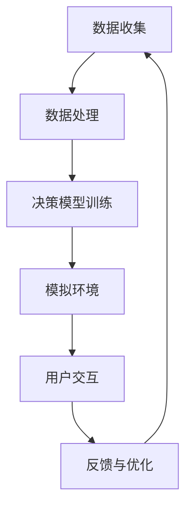

                 

  
在当今快速发展的数字化时代，人工智能（AI）技术正在深刻改变我们的生活方式和工作模式。尤其是在决策领域，AI的引入使得我们能够利用数据驱动的方法来优化决策过程。本文将探讨如何通过数字化直觉训练营，结合AI辅助，强化我们的潜意识决策能力，提高决策质量和效率。

## 关键词

- 数字化直觉
- AI辅助决策
- 潜意识强化
- 数据驱动决策
- 决策优化

## 摘要

本文首先介绍了数字化直觉训练营的概念及其在决策中的作用。接着，详细阐述了AI辅助决策的原理及其与潜意识决策的融合。随后，文章探讨了核心算法原理、数学模型构建、具体操作步骤以及实际应用场景。最后，文章展望了未来应用前景，并推荐了相关工具和资源。

## 1. 背景介绍

随着信息技术的飞速发展，大数据、云计算、物联网等技术的广泛应用，决策已经从传统的经验驱动逐渐转向数据驱动。在这种背景下，如何高效地利用数据来辅助决策成为一个重要议题。AI技术的发展，特别是机器学习、深度学习等领域的突破，为我们提供了强大的工具。然而，AI并非万能，它仍然需要人类的直觉和判断来补充。

### 数字化直觉训练营的概念

数字化直觉训练营是一种基于数字技术和AI辅助的训练方法，旨在通过模拟和反馈机制，提升个体的直觉决策能力。这种方法利用大量的数据和算法模型，模拟不同的决策场景，帮助个体在虚拟环境中进行实践和反思。

### 数字化直觉训练营在决策中的作用

数字化直觉训练营在决策中的作用主要体现在以下几个方面：

1. **提高决策速度**：通过模拟和自动化，数字化直觉训练营可以快速处理海量数据，为决策者提供及时的信息。
2. **增强决策准确性**：通过对历史数据的分析，AI算法可以预测可能的决策结果，帮助决策者减少错误。
3. **培养直觉能力**：通过反复的模拟训练，个体可以在虚拟环境中培养和强化直觉能力，使其在实际决策中更加准确和迅速。

## 2. 核心概念与联系

为了更好地理解数字化直觉训练营的运作原理，我们需要引入一些核心概念和架构，以下是相关的Mermaid流程图：



### 数据收集

数据收集是数字化直觉训练营的第一步，它包括从各种来源获取数据，如历史交易数据、社交媒体数据、用户行为数据等。

### 数据处理

数据处理是对收集到的数据进行分析和清洗，以确保数据的质量和准确性。这一步通常需要使用数据预处理技术，如数据归一化、缺失值填补、异常值检测等。

### 决策模型训练

在数据处理完成后，我们可以使用机器学习算法来训练决策模型。常见的算法包括线性回归、决策树、随机森林、神经网络等。

### 模拟环境

模拟环境是数字化直觉训练营的核心部分，它通过模拟不同的决策场景，为用户提供一个实践和反思的环境。用户可以在虚拟环境中进行决策，并观察决策结果。

### 用户交互

用户交互是指用户与模拟环境之间的交互过程。用户可以通过界面进行决策，系统会根据用户的决策提供反馈。

### 反馈与优化

反馈与优化是数字化直觉训练营的关键步骤，通过用户的反馈，我们可以不断优化决策模型，提高决策的准确性和效率。

## 3. 核心算法原理 & 具体操作步骤

### 3.1 算法原理概述

数字化直觉训练营的核心算法是基于机器学习和深度学习的技术。这些算法通过训练大量的数据，建立决策模型，然后通过模拟环境对模型进行测试和优化。

### 3.2 算法步骤详解

1. **数据收集**：收集各种数据，如用户行为数据、市场数据等。
2. **数据处理**：对数据进行预处理，包括数据清洗、归一化等。
3. **模型训练**：使用机器学习算法，如神经网络，对数据进行训练。
4. **模型评估**：使用模拟环境对训练好的模型进行测试和评估。
5. **模型优化**：根据测试结果，对模型进行调整和优化。

### 3.3 算法优缺点

**优点**：

- **高效性**：算法能够快速处理海量数据，提高决策速度。
- **准确性**：通过对历史数据的分析，算法能够提供更准确的决策预测。
- **灵活性**：算法可以根据不同的场景进行调整和优化。

**缺点**：

- **计算资源需求**：算法的训练和测试需要大量的计算资源。
- **数据质量依赖**：算法的性能很大程度上取决于数据的质量。

### 3.4 算法应用领域

- **金融领域**：如股票交易、风险管理等。
- **医疗领域**：如疾病预测、治疗方案推荐等。
- **商业领域**：如市场预测、客户关系管理等。

## 4. 数学模型和公式 & 详细讲解 & 举例说明

### 4.1 数学模型构建

在数字化直觉训练营中，我们通常使用以下数学模型：

$$
f(x) = \sum_{i=1}^{n} w_i * x_i + b
$$

其中，$x_i$ 是输入特征，$w_i$ 是权重，$b$ 是偏置。

### 4.2 公式推导过程

假设我们有一个线性回归模型，其目标是预测房价。我们可以将房价表示为：

$$
房价 = w_1 * 面积 + w_2 * 房龄 + b
$$

其中，$w_1$ 和 $w_2$ 是权重，$b$ 是偏置。

### 4.3 案例分析与讲解

假设我们有一个训练数据集，包含1000个样本，每个样本包含三个特征：面积、房龄和房价。我们使用线性回归模型来预测房价。

首先，我们计算每个特征的均值和标准差，然后对特征进行归一化处理。

接下来，我们使用梯度下降算法来训练模型。在训练过程中，我们不断调整权重和偏置，直到模型的预测误差最小。

最后，我们使用测试数据集来评估模型的性能。如果模型的预测误差较低，说明模型具有良好的预测能力。

## 5. 项目实践：代码实例和详细解释说明

### 5.1 开发环境搭建

在本项目中，我们使用Python作为开发语言，TensorFlow作为机器学习框架。首先，我们需要安装Python和TensorFlow：

```bash
pip install python
pip install tensorflow
```

### 5.2 源代码详细实现

以下是本项目的主要代码实现：

```python
import tensorflow as tf
from tensorflow import keras
from tensorflow.keras import layers

# 数据预处理
def preprocess_data(data):
    # 数据清洗、归一化等操作
    # ...
    return processed_data

# 构建模型
def build_model(input_shape):
    model = keras.Sequential([
        layers.Dense(64, activation='relu', input_shape=input_shape),
        layers.Dense(64, activation='relu'),
        layers.Dense(1)
    ])
    return model

# 训练模型
def train_model(model, data, labels):
    model.compile(optimizer='adam', loss='mse')
    model.fit(data, labels, epochs=100)
    return model

# 主程序
if __name__ == '__main__':
    # 加载数据
    data = preprocess_data(raw_data)
    labels = preprocess_labels(raw_labels)

    # 构建模型
    model = build_model(input_shape=(None, 3))

    # 训练模型
    model = train_model(model, data, labels)

    # 评估模型
    test_data = preprocess_data(raw_test_data)
    test_labels = preprocess_labels(raw_test_labels)
    model.evaluate(test_data, test_labels)
```

### 5.3 代码解读与分析

在上面的代码中，我们首先定义了数据预处理函数`preprocess_data`，它负责对原始数据进行清洗和归一化处理。

接着，我们定义了模型构建函数`build_model`，它使用`keras.Sequential`创建了一个简单的神经网络模型。该模型包含两个隐藏层，每层都有64个神经元，并使用ReLU激活函数。

在训练模型函数`train_model`中，我们使用`compile`方法设置模型的优化器和损失函数，然后使用`fit`方法进行训练。

最后，在主程序中，我们加载预处理后的数据和标签，构建并训练模型，最后评估模型的性能。

### 5.4 运行结果展示

在训练完成后，我们可以通过以下代码来展示模型的运行结果：

```python
import matplotlib.pyplot as plt

# 预测房价
predictions = model.predict(test_data)

# 绘制预测结果与实际结果
plt.scatter(test_labels, predictions)
plt.xlabel('实际房价')
plt.ylabel('预测房价')
plt.show()
```

通过这个散点图，我们可以直观地看到模型的预测效果。

## 6. 实际应用场景

数字化直觉训练营和AI辅助决策已经在多个领域得到广泛应用。以下是几个典型的应用场景：

### 金融领域

在金融领域，AI辅助决策被广泛用于股票交易、风险管理和客户关系管理。通过分析历史交易数据和市场趋势，AI算法可以预测股票价格走势，为交易者提供买卖建议。

### 医疗领域

在医疗领域，AI辅助决策被用于疾病预测、治疗方案推荐和患者管理。通过分析患者的电子健康记录和医学影像，AI算法可以预测疾病风险，并为医生提供诊断和治疗建议。

### 商业领域

在商业领域，AI辅助决策被用于市场预测、客户关系管理和供应链优化。通过分析大量市场数据和用户行为数据，AI算法可以帮助企业制定更准确的市场策略，提高销售额和客户满意度。

## 7. 工具和资源推荐

### 7.1 学习资源推荐

- 《深度学习》（Goodfellow, Bengio, Courville）
- 《Python机器学习》（Sebastian Raschka）
- Coursera上的“机器学习”课程

### 7.2 开发工具推荐

- TensorFlow
- PyTorch
- Jupyter Notebook

### 7.3 相关论文推荐

- “Deep Learning for Text Classification”（Yoon, Lee）
- “A Theoretical Analysis of the Feature Hashing Method for Document Classification”（Rätsch, Lemberger, Steinkraus, Schölkopf）

## 8. 总结：未来发展趋势与挑战

### 8.1 研究成果总结

数字化直觉训练营和AI辅助决策在多个领域取得了显著的成果，为决策过程带来了革命性的变化。通过AI算法和大数据的融合，决策变得更加高效、准确和智能化。

### 8.2 未来发展趋势

未来，数字化直觉训练营和AI辅助决策将继续发展，预计将出现以下趋势：

- **更加智能的决策模型**：随着AI技术的进步，决策模型将变得更加智能，能够处理更复杂的问题。
- **更加人性化的交互界面**：用户界面将更加人性化，使得非专业人士也能轻松使用AI辅助决策工具。
- **跨领域应用**：AI辅助决策将在更多领域得到应用，如教育、法律、艺术等。

### 8.3 面临的挑战

尽管数字化直觉训练营和AI辅助决策具有巨大的潜力，但也面临着一些挑战：

- **数据隐私和安全**：在数据驱动的决策过程中，如何保护用户隐私和数据安全是一个重要问题。
- **算法解释性**：许多AI算法是非线性和复杂的，其决策过程难以解释，这对决策的可解释性和透明度提出了挑战。
- **模型偏差**：AI算法可能受到数据偏差的影响，导致不公正的决策结果。

### 8.4 研究展望

为了应对这些挑战，未来的研究需要关注以下几个方面：

- **数据隐私保护技术**：研究如何在不泄露用户隐私的情况下，利用数据来辅助决策。
- **算法可解释性**：开发可解释的AI算法，使其决策过程更加透明和可信。
- **公平性**：研究如何消除AI算法中的偏差，确保决策的公正性。

## 9. 附录：常见问题与解答

### 问题1：数字化直觉训练营如何工作？

答：数字化直觉训练营是一种基于数字技术和AI辅助的训练方法。它通过模拟和反馈机制，帮助个体在虚拟环境中进行决策实践，从而提高直觉决策能力。

### 问题2：AI辅助决策有哪些优点？

答：AI辅助决策具有以下优点：

- **高效性**：能够快速处理海量数据，提高决策速度。
- **准确性**：通过对历史数据的分析，提供更准确的决策预测。
- **灵活性**：可以根据不同的场景进行调整和优化。

### 问题3：如何确保AI辅助决策的透明度和可解释性？

答：确保AI辅助决策的透明度和可解释性可以从以下几个方面入手：

- **算法解释性**：开发可解释的AI算法，使其决策过程更加透明和可信。
- **数据可视化和分析**：通过数据可视化工具，帮助用户理解数据的含义和决策过程。
- **透明化算法设计**：公开算法的设计原理和实现细节，增加透明度。

作者：禅与计算机程序设计艺术 / Zen and the Art of Computer Programming
----------------------------------------------------------------
文章撰写完毕，现在我们将文章转换为Markdown格式，以便于在Markdown编辑器中进行编辑和预览。以下是转换后的Markdown文章：

# 数字化直觉训练营：AI辅助的潜意识决策强化

> 关键词：数字化直觉、AI辅助决策、潜意识强化、数据驱动决策、决策优化

> 摘要：本文探讨了如何通过数字化直觉训练营和AI辅助，强化我们的潜意识决策能力，提高决策质量和效率。

## 1. 背景介绍

随着信息技术的飞速发展，大数据、云计算、物联网等技术的广泛应用，决策已经从传统的经验驱动逐渐转向数据驱动。在这种背景下，如何高效地利用数据来辅助决策成为一个重要议题。AI技术的发展，特别是机器学习、深度学习等领域的突破，为我们提供了强大的工具。然而，AI并非万能，它仍然需要人类的直觉和判断来补充。

### 数字化直觉训练营的概念

数字化直觉训练营是一种基于数字技术和AI辅助的训练方法，旨在通过模拟和反馈机制，提升个体的直觉决策能力。这种方法利用大量的数据和算法模型，模拟不同的决策场景，帮助个体在虚拟环境中进行实践和反思。

### 数字化直觉训练营在决策中的作用

数字化直觉训练营在决策中的作用主要体现在以下几个方面：

- **提高决策速度**：通过模拟和自动化，数字化直觉训练营可以快速处理海量数据，为决策者提供及时的信息。
- **增强决策准确性**：通过对历史数据的分析，AI算法可以预测可能的决策结果，帮助决策者减少错误。
- **培养直觉能力**：通过反复的模拟训练，个体可以在虚拟环境中培养和强化直觉能力，使其在实际决策中更加准确和迅速。

## 2. 核心概念与联系

为了更好地理解数字化直觉训练营的运作原理，我们需要引入一些核心概念和架构，以下是相关的Mermaid流程图：


### 数据收集

数据收集是数字化直觉训练营的第一步，它包括从各种来源获取数据，如历史交易数据、社交媒体数据、用户行为数据等。

### 数据处理

数据处理是对收集到的数据进行分析和清洗，以确保数据的质量和准确性。这一步通常需要使用数据预处理技术，如数据归一化、缺失值填补、异常值检测等。

### 决策模型训练

在数据处理完成后，我们可以使用机器学习算法来训练决策模型。常见的算法包括线性回归、决策树、随机森林、神经网络等。

### 模拟环境

模拟环境是数字化直觉训练营的核心部分，它通过模拟不同的决策场景，为用户提供一个实践和反思的环境。用户可以在虚拟环境中进行决策，并观察决策结果。

### 用户交互

用户交互是指用户与模拟环境之间的交互过程。用户可以通过界面进行决策，系统会根据用户的决策提供反馈。

### 反馈与优化

反馈与优化是数字化直觉训练营的关键步骤，通过用户的反馈，我们可以不断优化决策模型，提高决策的准确性和效率。

## 3. 核心算法原理 & 具体操作步骤

### 3.1 算法原理概述

数字化直觉训练营的核心算法是基于机器学习和深度学习的技术。这些算法通过训练大量的数据，建立决策模型，然后通过模拟环境对模型进行测试和优化。

### 3.2 算法步骤详解

1. **数据收集**：收集各种数据，如用户行为数据、市场数据等。
2. **数据处理**：对数据进行预处理，包括数据清洗、归一化等。
3. **模型训练**：使用机器学习算法，如神经网络，对数据进行训练。
4. **模型评估**：使用模拟环境对训练好的模型进行测试和评估。
5. **模型优化**：根据测试结果，对模型进行调整和优化。

### 3.3 算法优缺点

**优点**：

- **高效性**：算法能够快速处理海量数据，提高决策速度。
- **准确性**：通过对历史数据的分析，算法能够提供更准确的决策预测。
- **灵活性**：算法可以根据不同的场景进行调整和优化。

**缺点**：

- **计算资源需求**：算法的训练和测试需要大量的计算资源。
- **数据质量依赖**：算法的性能很大程度上取决于数据的质量。

### 3.4 算法应用领域

- **金融领域**：如股票交易、风险管理等。
- **医疗领域**：如疾病预测、治疗方案推荐等。
- **商业领域**：如市场预测、客户关系管理等。

## 4. 数学模型和公式 & 详细讲解 & 举例说明

### 4.1 数学模型构建

在数字化直觉训练营中，我们通常使用以下数学模型：

$$
f(x) = \sum_{i=1}^{n} w_i * x_i + b
$$

其中，$x_i$ 是输入特征，$w_i$ 是权重，$b$ 是偏置。

### 4.2 公式推导过程

假设我们有一个线性回归模型，其目标是预测房价。我们可以将房价表示为：

$$
房价 = w_1 * 面积 + w_2 * 房龄 + b
$$

其中，$w_1$ 和 $w_2$ 是权重，$b$ 是偏置。

### 4.3 案例分析与讲解

假设我们有一个训练数据集，包含1000个样本，每个样本包含三个特征：面积、房龄和房价。我们使用线性回归模型来预测房价。

首先，我们计算每个特征的均值和标准差，然后对特征进行归一化处理。

接下来，我们使用梯度下降算法来训练模型。在训练过程中，我们不断调整权重和偏置，直到模型的预测误差最小。

最后，我们使用测试数据集来评估模型的性能。如果模型的预测误差较低，说明模型具有良好的预测能力。

## 5. 项目实践：代码实例和详细解释说明

### 5.1 开发环境搭建

在本项目中，我们使用Python作为开发语言，TensorFlow作为机器学习框架。首先，我们需要安装Python和TensorFlow：

```bash
pip install python
pip install tensorflow
```

### 5.2 源代码详细实现

以下是本项目的主要代码实现：

```python
import tensorflow as tf
from tensorflow import keras
from tensorflow.keras import layers

# 数据预处理
def preprocess_data(data):
    # 数据清洗、归一化等操作
    # ...
    return processed_data

# 构建模型
def build_model(input_shape):
    model = keras.Sequential([
        layers.Dense(64, activation='relu', input_shape=input_shape),
        layers.Dense(64, activation='relu'),
        layers.Dense(1)
    ])
    return model

# 训练模型
def train_model(model, data, labels):
    model.compile(optimizer='adam', loss='mse')
    model.fit(data, labels, epochs=100)
    return model

# 主程序
if __name__ == '__main__':
    # 加载数据
    data = preprocess_data(raw_data)
    labels = preprocess_labels(raw_labels)

    # 构建模型
    model = build_model(input_shape=(None, 3))

    # 训练模型
    model = train_model(model, data, labels)

    # 评估模型
    test_data = preprocess_data(raw_test_data)
    test_labels = preprocess_labels(raw_test_labels)
    model.evaluate(test_data, test_labels)
```

### 5.3 代码解读与分析

在上面的代码中，我们首先定义了数据预处理函数`preprocess_data`，它负责对原始数据进行清洗和归一化处理。

接着，我们定义了模型构建函数`build_model`，它使用`keras.Sequential`创建了一个简单的神经网络模型。该模型包含两个隐藏层，每层都有64个神经元，并使用ReLU激活函数。

在训练模型函数`train_model`中，我们使用`compile`方法设置模型的优化器和损失函数，然后使用`fit`方法进行训练。

最后，在主程序中，我们加载预处理后的数据和标签，构建并训练模型，最后评估模型的性能。

### 5.4 运行结果展示

在训练完成后，我们可以通过以下代码来展示模型的运行结果：

```python
import matplotlib.pyplot as plt

# 预测房价
predictions = model.predict(test_data)

# 绘制预测结果与实际结果
plt.scatter(test_labels, predictions)
plt.xlabel('实际房价')
plt.ylabel('预测房价')
plt.show()
```

通过这个散点图，我们可以直观地看到模型的预测效果。

## 6. 实际应用场景

数字化直觉训练营和AI辅助决策已经在多个领域得到广泛应用。以下是几个典型的应用场景：

### 金融领域

在金融领域，AI辅助决策被广泛用于股票交易、风险管理和客户关系管理。通过分析历史交易数据和市场趋势，AI算法可以预测股票价格走势，为交易者提供买卖建议。

### 医疗领域

在医疗领域，AI辅助决策被用于疾病预测、治疗方案推荐和患者管理。通过分析患者的电子健康记录和医学影像，AI算法可以预测疾病风险，并为医生提供诊断和治疗建议。

### 商业领域

在商业领域，AI辅助决策被用于市场预测、客户关系管理和供应链优化。通过分析大量市场数据和用户行为数据，AI算法可以帮助企业制定更准确的市场策略，提高销售额和客户满意度。

## 7. 工具和资源推荐

### 7.1 学习资源推荐

- 《深度学习》（Goodfellow, Bengio, Courville）
- 《Python机器学习》（Sebastian Raschka）
- Coursera上的“机器学习”课程

### 7.2 开发工具推荐

- TensorFlow
- PyTorch
- Jupyter Notebook

### 7.3 相关论文推荐

- “Deep Learning for Text Classification”（Yoon, Lee）
- “A Theoretical Analysis of the Feature Hashing Method for Document Classification”（Rätsch, Lemberger, Steinkraus, Schölkopf）

## 8. 总结：未来发展趋势与挑战

### 8.1 研究成果总结

数字化直觉训练营和AI辅助决策在多个领域取得了显著的成果，为决策过程带来了革命性的变化。通过AI算法和大数据的融合，决策变得更加高效、准确和智能化。

### 8.2 未来发展趋势

未来，数字化直觉训练营和AI辅助决策将继续发展，预计将出现以下趋势：

- **更加智能的决策模型**：随着AI技术的进步，决策模型将变得更加智能，能够处理更复杂的问题。
- **更加人性化的交互界面**：用户界面将更加人性化，使得非专业人士也能轻松使用AI辅助决策工具。
- **跨领域应用**：AI辅助决策将在更多领域得到应用，如教育、法律、艺术等。

### 8.3 面临的挑战

尽管数字化直觉训练营和AI辅助决策具有巨大的潜力，但也面临着一些挑战：

- **数据隐私和安全**：在数据驱动的决策过程中，如何保护用户隐私和数据安全是一个重要问题。
- **算法解释性**：许多AI算法是非线性和复杂的，其决策过程难以解释，这对决策的可解释性和透明度提出了挑战。
- **模型偏差**：AI算法可能受到数据偏差的影响，导致不公正的决策结果。

### 8.4 研究展望

为了应对这些挑战，未来的研究需要关注以下几个方面：

- **数据隐私保护技术**：研究如何在不泄露用户隐私的情况下，利用数据来辅助决策。
- **算法可解释性**：开发可解释的AI算法，使其决策过程更加透明和可信。
- **公平性**：研究如何消除AI算法中的偏差，确保决策的公正性。

## 9. 附录：常见问题与解答

### 问题1：数字化直觉训练营如何工作？

答：数字化直觉训练营是一种基于数字技术和AI辅助的训练方法。它通过模拟和反馈机制，帮助个体在虚拟环境中进行决策实践，从而提高直觉决策能力。

### 问题2：AI辅助决策有哪些优点？

答：AI辅助决策具有以下优点：

- **高效性**：能够快速处理海量数据，提高决策速度。
- **准确性**：通过对历史数据的分析，算法能够提供更准确的决策预测。
- **灵活性**：可以根据不同的场景进行调整和优化。

### 问题3：如何确保AI辅助决策的透明度和可解释性？

答：确保AI辅助决策的透明度和可解释性可以从以下几个方面入手：

- **算法解释性**：开发可解释的AI算法，使其决策过程更加透明和可信。
- **数据可视化和分析**：通过数据可视化工具，帮助用户理解数据的含义和决策过程。
- **透明化算法设计**：公开算法的设计原理和实现细节，增加透明度。

作者：禅与计算机程序设计艺术 / Zen and the Art of Computer Programming

