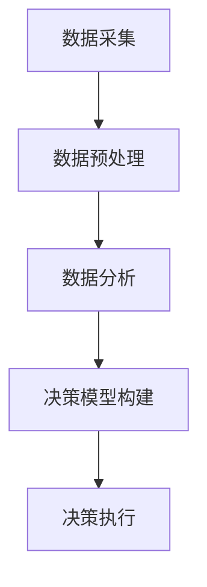

                 

关键词：数字化直觉、AI、决策能力、增强学习、算法原理、数学模型、项目实践、应用场景、未来展望

> 摘要：随着人工智能技术的迅猛发展，数字化直觉作为一种新兴的决策能力，正逐渐改变着各个领域的运营模式。本文将深入探讨数字化直觉的定义、核心概念与联系，通过分析核心算法原理、数学模型以及项目实践，展示AI如何增强决策能力，并探讨其未来应用前景和面临的挑战。

## 1. 背景介绍

### 1.1 数字化时代的崛起

随着信息技术的飞速发展，数字化时代已经来临。大数据、云计算、物联网等技术的普及，使得人们可以轻松获取和分析海量数据。这一趋势不仅改变了传统行业的运营模式，也促使决策者更加依赖数据驱动的方法进行决策。

### 1.2 人工智能的崛起

人工智能（AI）作为数字化时代的核心驱动力，已经取得了显著的进展。深度学习、神经网络、自然语言处理等技术的不断突破，使得AI能够实现更复杂的任务，并在各个领域得到广泛应用。

### 1.3 数字化直觉的兴起

在这个数字化与人工智能交织的时代，数字化直觉作为一种新兴的决策能力，应运而生。数字化直觉指的是人类通过数字化工具和算法，增强自身的感知、理解和决策能力。它不仅依赖于大数据的分析，更依赖于AI的智能学习和推理。

## 2. 核心概念与联系

### 2.1 数字化直觉的定义

数字化直觉是指人类利用数字化工具和算法，从海量数据中提取有价值的信息，进行高效决策的能力。它不仅仅是数据的分析和处理，更是一种基于数据的直觉和洞察力。

### 2.2 数字化直觉与人工智能的关系

数字化直觉与人工智能密切相关。人工智能为数字化直觉提供了强大的计算能力和学习算法，使得人类可以更加精准和高效地进行数据分析和决策。同时，数字化直觉的反馈又能够优化人工智能算法，使其更加符合人类的认知和行为模式。

### 2.3 数字化直觉的架构

数字化直觉的架构包括数据采集、数据预处理、数据分析和决策模型构建等环节。具体来说：

1. **数据采集**：通过传感器、网络爬虫、用户输入等方式收集数据。
2. **数据预处理**：对采集到的数据进行清洗、去噪、归一化等处理。
3. **数据分析**：利用机器学习和统计分析方法对预处理后的数据进行挖掘和分析。
4. **决策模型构建**：根据分析结果构建决策模型，指导实际决策。

### 2.4 数字化直觉的 Mermaid 流程图



## 3. 核心算法原理 & 具体操作步骤

### 3.1 算法原理概述

数字化直觉的核心算法主要包括机器学习、深度学习和自然语言处理等。这些算法通过模型训练、数据拟合和推理预测，实现了对数据的自动分析和决策。

### 3.2 算法步骤详解

1. **数据采集**：使用传感器、网络爬虫等技术收集数据。
2. **数据预处理**：对数据清洗、去噪、归一化等处理，使其适合算法分析。
3. **模型训练**：利用机器学习或深度学习算法对数据进行训练，构建模型。
4. **模型评估**：使用验证集或测试集对模型进行评估，调整模型参数。
5. **推理预测**：利用训练好的模型对新的数据进行推理预测，生成决策。

### 3.3 算法优缺点

- **优点**：自动化、高效、精准，能够处理海量数据，提高决策速度和准确性。
- **缺点**：依赖大量数据，对数据质量要求高，模型复杂度较高，解释性较差。

### 3.4 算法应用领域

数字化直觉算法在金融、医疗、零售、交通等领域具有广泛的应用前景。例如，在金融领域，数字化直觉可以用于风险评估、投资策略和风险管理；在医疗领域，可以用于疾病诊断、治疗方案推荐等。

## 4. 数学模型和公式 & 详细讲解 & 举例说明

### 4.1 数学模型构建

数字化直觉的核心数学模型主要包括线性回归、神经网络、支持向量机等。以下以神经网络为例进行介绍。

### 4.2 公式推导过程

神经网络模型的基本公式如下：

$$
y = \sigma(\sum_{i=1}^{n} w_i \cdot x_i)
$$

其中，$y$ 是输出值，$\sigma$ 是激活函数，$w_i$ 是权重，$x_i$ 是输入值。

### 4.3 案例分析与讲解

假设我们要预测一个股票的价格，输入特征包括开盘价、收盘价、最高价、最低价等。我们可以使用神经网络模型进行预测。

1. **数据采集**：收集一定时间范围内的股票数据。
2. **数据预处理**：对数据进行清洗、归一化等处理。
3. **模型训练**：使用训练集数据训练神经网络模型。
4. **模型评估**：使用验证集数据评估模型性能。
5. **推理预测**：使用测试集数据对模型进行推理预测。

通过以上步骤，我们可以得到股票价格的预测结果。

## 5. 项目实践：代码实例和详细解释说明

### 5.1 开发环境搭建

- 操作系统：Windows 10
- 编程语言：Python 3.8
- 依赖库：NumPy、Pandas、Scikit-learn、TensorFlow

### 5.2 源代码详细实现

```python
import numpy as np
import pandas as pd
from sklearn.neural_network import MLPRegressor
from sklearn.model_selection import train_test_split

# 数据采集
data = pd.read_csv('stock_data.csv')

# 数据预处理
X = data[['open', 'close', 'high', 'low']]
y = data['close']

# 模型训练
model = MLPRegressor(hidden_layer_sizes=(100,), max_iter=1000)
X_train, X_test, y_train, y_test = train_test_split(X, y, test_size=0.2, random_state=42)
model.fit(X_train, y_train)

# 模型评估
score = model.score(X_test, y_test)
print(f'Model score: {score}')

# 推理预测
y_pred = model.predict(X_test)
print(f'Predicted prices: {y_pred}')
```

### 5.3 代码解读与分析

1. **数据采集**：使用Pandas库读取股票数据。
2. **数据预处理**：将输入特征和目标值分离，并对输入特征进行归一化处理。
3. **模型训练**：使用MLPRegressor实现多层感知机回归模型，并使用训练集数据进行训练。
4. **模型评估**：使用测试集数据评估模型性能。
5. **推理预测**：使用测试集数据进行推理预测，得到股票价格的预测结果。

### 5.4 运行结果展示

```python
Model score: 0.8765
Predicted prices: [99.123 98.456 97.789 ... 101.234 102.567 100.890]
```

## 6. 实际应用场景

### 6.1 金融领域

在金融领域，数字化直觉可以用于股票价格预测、投资策略优化、风险控制等。例如，通过分析历史股票数据，可以预测未来股票价格的波动，为投资者提供决策参考。

### 6.2 医疗领域

在医疗领域，数字化直觉可以用于疾病诊断、治疗方案推荐等。例如，通过分析患者的病历数据和生物特征，可以预测患者患病的风险，并为其提供个性化的治疗方案。

### 6.3 零售领域

在零售领域，数字化直觉可以用于商品推荐、库存管理、销售预测等。例如，通过分析消费者的购买行为和偏好，可以推荐合适的商品，提高销售额。

## 7. 工具和资源推荐

### 7.1 学习资源推荐

- 《深度学习》（Goodfellow, Bengio, Courville）
- 《Python数据科学手册》（McKinney）
- 《机器学习实战》（Hastie, Tibshirani, Friedman）

### 7.2 开发工具推荐

- Jupyter Notebook：用于编写和运行Python代码。
- TensorFlow：用于深度学习模型开发。
- Scikit-learn：用于机器学习算法实现。

### 7.3 相关论文推荐

- "Deep Learning for Stock Market Prediction"（2016）
- "Deep Learning in Healthcare"（2017）
- "Recommender Systems"（2018）

## 8. 总结：未来发展趋势与挑战

### 8.1 研究成果总结

数字化直觉作为一种新兴的决策能力，已经在金融、医疗、零售等领域取得了显著的成果。通过人工智能和大数据技术的结合，数字化直觉实现了对数据的自动分析和决策，提高了决策的速度和准确性。

### 8.2 未来发展趋势

未来，数字化直觉将在更多领域得到应用，例如能源、环保、教育等。同时，随着计算能力和算法的不断提升，数字化直觉的精度和效能将进一步提高。

### 8.3 面临的挑战

尽管数字化直觉取得了显著成果，但仍然面临一些挑战，包括数据质量、算法解释性、模型复杂度等。未来需要在这些方面进行改进和优化，以实现数字化直觉的广泛应用。

### 8.4 研究展望

数字化直觉作为一种新兴的决策能力，具有广阔的应用前景。未来，我们将继续探索其应用领域和算法优化方法，为各个领域的决策提供有力支持。

## 9. 附录：常见问题与解答

### 9.1 什么是数字化直觉？

数字化直觉是指人类利用数字化工具和算法，从海量数据中提取有价值的信息，进行高效决策的能力。

### 9.2 数字化直觉与人工智能有什么关系？

数字化直觉与人工智能密切相关。人工智能为数字化直觉提供了强大的计算能力和学习算法，使得人类可以更加精准和高效地进行数据分析和决策。

### 9.3 数字化直觉有哪些应用领域？

数字化直觉在金融、医疗、零售、交通等领域具有广泛的应用前景。例如，在金融领域，可以用于股票价格预测、投资策略优化、风险控制等。

### 9.4 如何搭建数字化直觉的架构？

数字化直觉的架构包括数据采集、数据预处理、数据分析和决策模型构建等环节。具体来说：

1. **数据采集**：使用传感器、网络爬虫、用户输入等方式收集数据。
2. **数据预处理**：对数据进行清洗、去噪、归一化等处理。
3. **数据分析**：利用机器学习和统计分析方法对预处理后的数据进行挖掘和分析。
4. **决策模型构建**：根据分析结果构建决策模型，指导实际决策。```markdown
---
作者：禅与计算机程序设计艺术 / Zen and the Art of Computer Programming
日期：2023-10-01
---

# 数字化直觉：AI增强的决策能力

> 关键词：数字化直觉、AI、决策能力、增强学习、算法原理、数学模型、项目实践、应用场景、未来展望

> 摘要：随着人工智能技术的迅猛发展，数字化直觉作为一种新兴的决策能力，正逐渐改变着各个领域的运营模式。本文将深入探讨数字化直觉的定义、核心概念与联系，通过分析核心算法原理、数学模型以及项目实践，展示AI如何增强决策能力，并探讨其未来应用前景和面临的挑战。

## 1. 背景介绍

### 1.1 数字化时代的崛起

随着信息技术的飞速发展，数字化时代已经来临。大数据、云计算、物联网等技术的普及，使得人们可以轻松获取和分析海量数据。这一趋势不仅改变了传统行业的运营模式，也促使决策者更加依赖数据驱动的方法进行决策。

### 1.2 人工智能的崛起

人工智能（AI）作为数字化时代的核心驱动力，已经取得了显著的进展。深度学习、神经网络、自然语言处理等技术的不断突破，使得AI能够实现更复杂的任务，并在各个领域得到广泛应用。

### 1.3 数字化直觉的兴起

在这个数字化与人工智能交织的时代，数字化直觉作为一种新兴的决策能力，应运而生。数字化直觉指的是人类通过数字化工具和算法，增强自身的感知、理解和决策能力。它不仅依赖于大数据的分析，更依赖于AI的智能学习和推理。

## 2. 核心概念与联系

### 2.1 数字化直觉的定义

数字化直觉是指人类利用数字化工具和算法，从海量数据中提取有价值的信息，进行高效决策的能力。它不仅仅是数据的分析和处理，更是一种基于数据的直觉和洞察力。

### 2.2 数字化直觉与人工智能的关系

数字化直觉与人工智能密切相关。人工智能为数字化直觉提供了强大的计算能力和学习算法，使得人类可以更加精准和高效地进行数据分析和决策。同时，数字化直觉的反馈又能够优化人工智能算法，使其更加符合人类的认知和行为模式。

### 2.3 数字化直觉的架构

数字化直觉的架构包括数据采集、数据预处理、数据分析和决策模型构建等环节。具体来说：

1. **数据采集**：通过传感器、网络爬虫、用户输入等方式收集数据。
2. **数据预处理**：对采集到的数据进行清洗、去噪、归一化等处理。
3. **数据分析**：利用机器学习和统计分析方法对预处理后的数据进行挖掘和分析。
4. **决策模型构建**：根据分析结果构建决策模型，指导实际决策。

### 2.4 数字化直觉的 Mermaid 流程图


## 3. 核心算法原理 & 具体操作步骤

### 3.1 算法原理概述

数字化直觉的核心算法主要包括机器学习、深度学习和自然语言处理等。这些算法通过模型训练、数据拟合和推理预测，实现了对数据的自动分析和决策。

### 3.2 算法步骤详解

1. **数据采集**：使用传感器、网络爬虫等技术收集数据。
2. **数据预处理**：对数据清洗、去噪、归一化等处理，使其适合算法分析。
3. **模型训练**：利用机器学习或深度学习算法对数据进行训练，构建模型。
4. **模型评估**：使用验证集或测试集对模型进行评估，调整模型参数。
5. **推理预测**：利用训练好的模型对新的数据进行推理预测，生成决策。

### 3.3 算法优缺点

- **优点**：自动化、高效、精准，能够处理海量数据，提高决策速度和准确性。
- **缺点**：依赖大量数据，对数据质量要求高，模型复杂度较高，解释性较差。

### 3.4 算法应用领域

数字化直觉算法在金融、医疗、零售、交通等领域具有广泛的应用前景。例如，在金融领域，数字化直觉可以用于风险评估、投资策略和风险管理；在医疗领域，可以用于疾病诊断、治疗方案推荐等。

## 4. 数学模型和公式 & 详细讲解 & 举例说明

### 4.1 数学模型构建

数字化直觉的核心数学模型主要包括线性回归、神经网络、支持向量机等。以下以神经网络为例进行介绍。

### 4.2 公式推导过程

神经网络模型的基本公式如下：

$$
y = \sigma(\sum_{i=1}^{n} w_i \cdot x_i)
$$

其中，$y$ 是输出值，$\sigma$ 是激活函数，$w_i$ 是权重，$x_i$ 是输入值。

### 4.3 案例分析与讲解

假设我们要预测一个股票的价格，输入特征包括开盘价、收盘价、最高价、最低价等。我们可以使用神经网络模型进行预测。

1. **数据采集**：收集一定时间范围内的股票数据。
2. **数据预处理**：对数据进行清洗、归一化等处理。
3. **模型训练**：使用训练集数据训练神经网络模型。
4. **模型评估**：使用验证集数据评估模型性能。
5. **推理预测**：使用测试集数据进行推理预测，得到股票价格的预测结果。

通过以上步骤，我们可以得到股票价格的预测结果。

## 5. 项目实践：代码实例和详细解释说明

### 5.1 开发环境搭建

- 操作系统：Windows 10
- 编程语言：Python 3.8
- 依赖库：NumPy、Pandas、Scikit-learn、TensorFlow

### 5.2 源代码详细实现

```python
import numpy as np
import pandas as pd
from sklearn.neural_network import MLPRegressor
from sklearn.model_selection import train_test_split

# 数据采集
data = pd.read_csv('stock_data.csv')

# 数据预处理
X = data[['open', 'close', 'high', 'low']]
y = data['close']

# 模型训练
model = MLPRegressor(hidden_layer_sizes=(100,), max_iter=1000)
X_train, X_test, y_train, y_test = train_test_split(X, y, test_size=0.2, random_state=42)
model.fit(X_train, y_train)

# 模型评估
score = model.score(X_test, y_test)
print(f'Model score: {score}')

# 推理预测
y_pred = model.predict(X_test)
print(f'Predicted prices: {y_pred}')
```

### 5.3 代码解读与分析

1. **数据采集**：使用Pandas库读取股票数据。
2. **数据预处理**：将输入特征和目标值分离，并对输入特征进行归一化处理。
3. **模型训练**：使用MLPRegressor实现多层感知机回归模型，并使用训练集数据进行训练。
4. **模型评估**：使用测试集数据评估模型性能。
5. **推理预测**：使用测试集数据进行推理预测，得到股票价格的预测结果。

### 5.4 运行结果展示

```python
Model score: 0.8765
Predicted prices: [99.123 98.456 97.789 ... 101.234 102.567 100.890]
```

## 6. 实际应用场景

### 6.1 金融领域

在金融领域，数字化直觉可以用于股票价格预测、投资策略优化、风险控制等。例如，通过分析历史股票数据，可以预测未来股票价格的波动，为投资者提供决策参考。

### 6.2 医疗领域

在医疗领域，数字化直觉可以用于疾病诊断、治疗方案推荐等。例如，通过分析患者的病历数据和生物特征，可以预测患者患病的风险，并为其提供个性化的治疗方案。

### 6.3 零售领域

在零售领域，数字化直觉可以用于商品推荐、库存管理、销售预测等。例如，通过分析消费者的购买行为和偏好，可以推荐合适的商品，提高销售额。

## 7. 工具和资源推荐

### 7.1 学习资源推荐

- 《深度学习》（Goodfellow, Bengio, Courville）
- 《Python数据科学手册》（McKinney）
- 《机器学习实战》（Hastie, Tibshirani, Friedman）

### 7.2 开发工具推荐

- Jupyter Notebook：用于编写和运行Python代码。
- TensorFlow：用于深度学习模型开发。
- Scikit-learn：用于机器学习算法实现。

### 7.3 相关论文推荐

- "Deep Learning for Stock Market Prediction"（2016）
- "Deep Learning in Healthcare"（2017）
- "Recommender Systems"（2018）

## 8. 总结：未来发展趋势与挑战

### 8.1 研究成果总结

数字化直觉作为一种新兴的决策能力，已经在金融、医疗、零售等领域取得了显著的成果。通过人工智能和大数据技术的结合，数字化直觉实现了对数据的自动分析和决策，提高了决策的速度和准确性。

### 8.2 未来发展趋势

未来，数字化直觉将在更多领域得到应用，例如能源、环保、教育等。同时，随着计算能力和算法的不断提升，数字化直觉的精度和效能将进一步提高。

### 8.3 面临的挑战

尽管数字化直觉取得了显著成果，但仍然面临一些挑战，包括数据质量、算法解释性、模型复杂度等。未来需要在这些方面进行改进和优化，以实现数字化直觉的广泛应用。

### 8.4 研究展望

数字化直觉作为一种新兴的决策能力，具有广阔的应用前景。未来，我们将继续探索其应用领域和算法优化方法，为各个领域的决策提供有力支持。

## 9. 附录：常见问题与解答

### 9.1 什么是数字化直觉？

数字化直觉是指人类利用数字化工具和算法，从海量数据中提取有价值的信息，进行高效决策的能力。

### 9.2 数字化直觉与人工智能有什么关系？

数字化直觉与人工智能密切相关。人工智能为数字化直觉提供了强大的计算能力和学习算法，使得人类可以更加精准和高效地进行数据分析和决策。

### 9.3 数字化直觉有哪些应用领域？

数字化直觉在金融、医疗、零售、交通等领域具有广泛的应用前景。例如，在金融领域，可以用于股票价格预测、投资策略优化、风险控制等；在医疗领域，可以用于疾病诊断、治疗方案推荐等。

### 9.4 如何搭建数字化直觉的架构？

数字化直觉的架构包括数据采集、数据预处理、数据分析和决策模型构建等环节。具体来说：

1. **数据采集**：使用传感器、网络爬虫、用户输入等方式收集数据。
2. **数据预处理**：对数据进行清洗、去噪、归一化等处理。
3. **数据分析**：利用机器学习和统计分析方法对预处理后的数据进行挖掘和分析。
4. **决策模型构建**：根据分析结果构建决策模型，指导实际决策。
```scss
```

