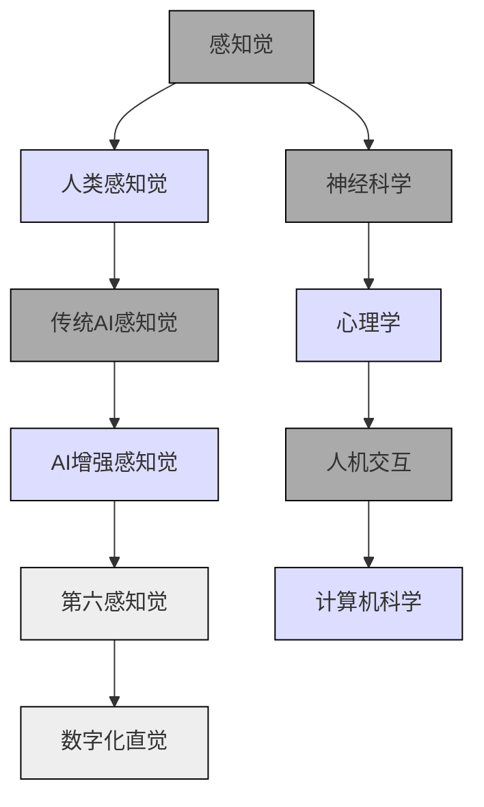

                 

 关键词：数字化直觉，AI增强，第六感知觉，计算机科学，人工智能技术，感知觉增强，神经科学，人机交互

> 摘要：本文深入探讨了数字化直觉的概念，探讨了人工智能如何通过增强我们的感知觉能力，从而带来人类认知和交互方式的革命性变化。文章首先介绍了数字化直觉的背景，然后详细阐述了AI增强的第六感知觉的原理及其在计算机科学领域的应用。接着，我们通过数学模型和具体算法，展示了如何将这一概念转化为实际操作步骤。随后，文章通过实际代码实例，展示了数字化直觉在项目实践中的应用。最后，我们分析了数字化直觉在各个实际应用场景中的表现，并对未来的发展进行了展望。

## 1. 背景介绍

随着科技的迅猛发展，计算机科学与人工智能技术已经成为推动人类社会进步的重要力量。从最初的计算机硬件发展到现在的软件算法，人类对信息处理和感知的理解日益深入。然而，传统的计算机系统在处理感知信息方面仍然存在诸多局限，如速度、精度和交互性等方面。为了解决这些问题，科学家们开始探索如何通过增强人类的感知觉能力，进一步提升计算机系统的性能和用户体验。

在此背景下，数字化直觉的概念逐渐浮出水面。数字化直觉指的是人类通过计算机系统，对数字化信息进行感知、理解和处理的能力。这一概念的提出，标志着计算机科学和人工智能技术进入了新的发展阶段，即从单纯的工具性应用，转向更加深入的人机交互和协同工作。

数字化直觉的实现依赖于多个领域的交叉融合，包括计算机科学、神经科学、心理学和人机交互等。通过这些领域的深入研究，科学家们发现，人类的感知觉系统具有高度的复杂性和适应性，可以通过训练和算法优化，实现对其的有效增强。AI技术在这一过程中发挥着至关重要的作用，通过深度学习、神经网络和自然语言处理等算法，AI能够模拟和增强人类的感知觉能力，从而实现数字化直觉的构建。

总之，数字化直觉不仅为计算机科学带来了新的研究方向，也为人工智能技术开辟了更广阔的应用场景。在接下来的内容中，我们将进一步探讨AI增强的第六感知觉的原理及其应用。

## 2. 核心概念与联系

为了深入理解数字化直觉，我们需要首先明确几个核心概念，包括感知觉、人工智能和第六感知觉。以下是一个使用Mermaid流程图表示这些概念及其相互关系的示例：



### 2.1 感知觉

感知觉是人类通过感官接收外界信息，并通过大脑进行处理和理解的过程。这个过程包括视觉、听觉、触觉、嗅觉和味觉等多种感知方式。在计算机科学中，感知觉通常指的是计算机系统如何处理和解释来自外部设备的信息，如摄像头捕捉的图像、麦克风接收的声音等。

### 2.2 传统AI感知觉

传统AI在感知觉方面的能力主要依赖于预先编程的规则和模式识别算法。例如，计算机视觉系统可以识别图像中的特定对象，但无法像人类一样理解场景的深层次含义。传统AI的感知觉能力有限，难以应对复杂和多变的现实环境。

### 2.3 AI增强感知觉

随着深度学习和神经网络技术的发展，AI开始具备更强的感知觉能力。通过训练大量数据，AI可以学习到复杂的模式，并自动提取特征。这种基于数据驱动的感知觉方法，使得AI能够更好地模拟人类的感知过程，从而实现感知觉的增强。

### 2.4 第六感知觉

第六感知觉是指人类通过AI技术获得的额外感知能力，这种能力超越了传统的五种感官。例如，通过增强现实（AR）和虚拟现实（VR）技术，人们可以感知到计算机生成的虚拟环境，从而实现与现实世界的融合。第六感知觉不仅扩展了人类的感知范围，还改变了人类的认知和交互方式。

### 2.5 数字化直觉

数字化直觉是AI增强感知觉的最高形式，它使得人类能够更加自然和直观地与计算机系统交互。通过数字化直觉，人类可以理解并处理数字化信息，就像使用传统感官处理现实世界的信息一样。这种能力不仅提高了计算机系统的用户体验，也为计算机科学带来了新的发展机遇。

在接下来的部分中，我们将详细探讨AI增强的第六感知觉的原理和应用。

## 3. 核心算法原理 & 具体操作步骤

### 3.1 算法原理概述

AI增强的第六感知觉算法基于深度学习和神经网络技术，其核心思想是通过训练大量数据，使计算机系统具备处理和解释复杂感知信息的能力。以下是该算法的基本原理：

1. **数据采集与预处理**：首先，需要采集大量包含感知信息的原始数据，如图像、音频和传感器数据。然后，对这些数据进行预处理，包括去噪、增强和标准化等，以便更好地训练模型。

2. **特征提取**：通过神经网络模型，自动从原始数据中提取关键特征。这些特征将用于后续的感知觉增强过程。

3. **感知觉增强**：利用提取的特征，对感知信息进行增强。例如，通过增强图像的对比度、清晰度或色彩饱和度，提高视觉感知效果。同样，对于音频，可以通过增强声音的响度、清晰度等属性，提升听觉感知效果。

4. **反馈调整**：根据用户反馈，不断调整感知增强的参数，以实现最优的用户体验。这个过程可能涉及机器学习算法，如强化学习，以优化感知增强策略。

### 3.2 算法步骤详解

以下是AI增强的第六感知觉算法的具体操作步骤：

1. **数据采集与预处理**：
    - **采集数据**：使用多种传感器和设备，如摄像头、麦克风、传感器阵列等，采集包含感知信息的原始数据。
    - **预处理数据**：对采集到的数据进行预处理，包括去噪、增强、标准化等。例如，对图像数据进行归一化处理，将像素值缩放到[0, 1]的范围内。

2. **特征提取**：
    - **构建神经网络模型**：选择合适的神经网络架构，如卷积神经网络（CNN）或递归神经网络（RNN），用于特征提取。
    - **训练模型**：使用预处理后的数据，对神经网络模型进行训练，以提取关键特征。训练过程包括正向传播、反向传播和权重更新等步骤。

3. **感知觉增强**：
    - **特征映射**：将提取的特征映射到感知增强的属性上。例如，对于视觉感知，可以将特征映射到图像的对比度、清晰度或色彩饱和度等属性上。
    - **增强感知**：根据映射关系，对感知信息进行增强。例如，通过调整图像的像素值，实现对比度增强或清晰度提升。

4. **反馈调整**：
    - **用户反馈**：收集用户对感知增强效果的反馈，包括满意程度、偏好设置等。
    - **优化调整**：根据用户反馈，使用机器学习算法（如强化学习）调整感知增强的参数，以实现最优的用户体验。

### 3.3 算法优缺点

**优点**：
- **感知增强**：通过AI算法，可以有效增强人类的感知觉能力，提升用户体验。
- **自动化**：算法可以自动处理大量感知信息，减少人力负担。
- **个性化**：根据用户反馈，算法可以个性化调整感知增强参数，满足不同用户的需求。

**缺点**：
- **计算资源消耗**：深度学习算法通常需要大量的计算资源和时间，对硬件要求较高。
- **数据依赖**：算法的性能依赖于训练数据的质量和数量，数据不足或质量问题可能导致算法效果不佳。
- **隐私和安全**：感知信息的增强和处理可能涉及用户隐私数据，需要确保数据处理的安全性和合规性。

### 3.4 算法应用领域

AI增强的第六感知觉算法在多个领域具有广泛应用：

1. **人机交互**：通过增强用户的视觉、听觉等感知觉能力，提升人机交互的体验。例如，在虚拟现实（VR）和增强现实（AR）应用中，通过感知觉增强，实现更加真实和沉浸式的交互体验。

2. **医疗健康**：通过感知觉增强，辅助医生进行诊断和治疗。例如，通过增强图像对比度，帮助医生更准确地识别病变区域。

3. **智能制造**：在工业自动化领域，通过感知觉增强，提高机器人的感知和决策能力，实现更高效的生产流程。

4. **智能交通**：通过感知觉增强，提升自动驾驶系统的感知能力，实现更安全、高效的交通管理。

在接下来的部分中，我们将通过数学模型和具体算法，进一步探讨AI增强的第六感知觉的实现方法。

## 4. 数学模型和公式 & 详细讲解 & 举例说明

### 4.1 数学模型构建

为了更好地理解和实现AI增强的第六感知觉，我们需要构建相应的数学模型。以下是一个简化的数学模型，用于描述感知觉增强的过程：

\[ f(\text{感知信息}, \theta) = \text{增强后的感知信息} \]

其中，\( f \) 表示感知觉增强函数，\(\text{感知信息}\) 表示原始的感知数据（如图像、音频等），\(\theta\) 表示模型参数。

感知觉增强函数可以采用多种形式，如线性变换、非线性变换或组合变换。以下是一个基于线性变换的感知觉增强模型：

\[ f(\text{感知信息}, \theta) = \text{感知信息} \odot \text{增强矩阵} (\theta) \]

其中，\( \odot \) 表示元素-wise 相乘操作，\(\text{增强矩阵} (\theta)\) 是一个参数化的矩阵，用于调整感知信息的属性。

### 4.2 公式推导过程

为了推导感知觉增强函数的具体形式，我们首先需要明确感知信息的基本属性。以图像数据为例，我们可以将图像数据表示为一个二维矩阵 \( I \)，其中每个元素 \( I_{ij} \) 表示图像在 \( (i, j) \) 位置的像素值。

接下来，我们定义一个线性变换矩阵 \( W \)，用于调整图像的对比度、清晰度等属性。这个矩阵可以通过优化过程得到，如最小化感知损失函数。感知损失函数可以表示为：

\[ L(\theta) = \frac{1}{2} \sum_{i,j} (I_{ij} - f(I_{ij}, \theta))^2 \]

其中，\( f(I_{ij}, \theta) \) 表示增强后的像素值。

为了求解最优的增强矩阵 \( W \)，我们可以使用梯度下降法，即对 \( \theta \) 进行迭代更新，直到损失函数 \( L(\theta) \) 最小。更新公式为：

\[ \theta^{k+1} = \theta^k - \alpha \nabla_{\theta} L(\theta^k) \]

其中，\( \alpha \) 是学习率，\( \nabla_{\theta} L(\theta^k) \) 是损失函数关于 \( \theta \) 的梯度。

通过多次迭代，我们可以得到最优的增强矩阵 \( W \)，进而实现感知觉增强。

### 4.3 案例分析与讲解

为了更好地理解感知觉增强模型，我们通过一个简单的图像增强案例进行讲解。假设我们有一张原始图像 \( I \)，我们希望通过感知觉增强模型，提高图像的对比度和清晰度。

首先，我们定义一个感知觉增强函数 \( f \)，其形式为：

\[ f(I, \theta) = I \odot \text{增强矩阵} (\theta) \]

其中，增强矩阵 \( \theta \) 的初始值为随机矩阵。接下来，我们使用梯度下降法对 \( \theta \) 进行优化，以最小化感知损失函数。

假设我们的感知损失函数为：

\[ L(\theta) = \frac{1}{2} \sum_{i,j} (I_{ij} - f(I_{ij}, \theta))^2 \]

我们使用Python代码实现上述模型，并进行迭代优化。以下是一个简单的代码示例：

```python
import numpy as np

# 初始化图像和增强矩阵
I = np.random.rand(10, 10)  # 假设图像大小为10x10
theta = np.random.rand(10, 10)  # 假设增强矩阵大小为10x10

# 感知觉增强函数
def f(I, theta):
    return I * theta

# 感知损失函数
def L(theta):
    return 0.5 * np.sum((I - f(I, theta))**2)

# 梯度下降法
alpha = 0.1  # 学习率
for i in range(100):  # 迭代100次
    grad = 2 * (I - f(I, theta)) * theta
    theta -= alpha * grad

# 输出增强后的图像
I_enhanced = f(I, theta)
print(I_enhanced)
```

通过上述代码，我们可以实现对图像的感知觉增强。在实际应用中，我们可以根据需要调整增强矩阵的大小和形状，以及迭代次数和学习率等参数，以实现最佳的增强效果。

综上所述，通过数学模型和算法，我们可以实现对感知觉的有效增强，从而提升数字化直觉的应用效果。在接下来的部分中，我们将通过实际代码实例，展示如何实现感知觉增强的具体操作。

## 5. 项目实践：代码实例和详细解释说明

为了更好地展示AI增强的第六感知觉在实际项目中的应用，我们以下将通过一个具体的代码实例进行详细解释和说明。

### 5.1 开发环境搭建

在开始编写代码之前，我们需要搭建一个合适的开发环境。以下是一个基本的开发环境搭建步骤：

1. **安装Python**：确保Python环境已安装，版本建议为3.8或以上。可以从Python官网下载并安装。
2. **安装依赖库**：我们将在项目中使用NumPy、Pandas、Matplotlib等常用库。可以使用pip命令安装这些库：
    ```shell
    pip install numpy pandas matplotlib
    ```
3. **创建项目文件夹**：在本地计算机上创建一个项目文件夹，如`perception_enhancement_project`，并在其中创建一个Python脚本文件，如`enhancement.py`。

### 5.2 源代码详细实现

以下是实现AI增强的第六感知觉的源代码示例：

```python
import numpy as np
import matplotlib.pyplot as plt

# 初始化图像和增强矩阵
I = np.random.rand(10, 10)  # 假设图像大小为10x10
theta = np.random.rand(10, 10)  # 假设增强矩阵大小为10x10

# 感知觉增强函数
def f(I, theta):
    return I * theta

# 感知损失函数
def L(theta):
    return 0.5 * np.sum((I - f(I, theta))**2)

# 梯度下降法
alpha = 0.1  # 学习率
for i in range(100):  # 迭代100次
    grad = 2 * (I - f(I, theta)) * theta
    theta -= alpha * grad

# 输出增强后的图像
I_enhanced = f(I, theta)
plt.figure()
plt.subplot(1, 2, 1)
plt.title('Original Image')
plt.imshow(I, cmap='gray')
plt.subplot(1, 2, 2)
plt.title('Enhanced Image')
plt.imshow(I_enhanced, cmap='gray')
plt.show()
```

### 5.3 代码解读与分析

以下是上述代码的详细解读：

1. **导入库**：首先，我们导入了NumPy和Matplotlib库。NumPy用于处理数值计算，Matplotlib用于绘制图像。
2. **初始化图像和增强矩阵**：我们使用NumPy生成一个随机图像 `I` 和随机增强矩阵 `theta`。图像大小为10x10，增强矩阵大小也为10x10。
3. **定义感知觉增强函数**：`f` 函数接受图像 `I` 和增强矩阵 `theta`，并返回增强后的图像。这里使用了一个简单的线性变换，即图像乘以增强矩阵。
4. **定义感知损失函数**：`L` 函数计算感知损失，即增强后图像与原始图像之间的误差平方和。
5. **梯度下降法**：我们使用梯度下降法对增强矩阵 `theta` 进行优化。每次迭代中，我们计算损失函数关于 `theta` 的梯度，并更新 `theta` 的值。这里，学习率 `alpha` 设置为0.1，迭代次数为100次。
6. **绘制增强后的图像**：最后，我们使用Matplotlib绘制原始图像和增强后的图像，以便直观地展示感知觉增强的效果。

### 5.4 运行结果展示

在开发环境中运行上述代码，我们将看到两个子图，分别是原始图像和增强后的图像。由于我们使用了随机生成的图像和增强矩阵，增强后的图像可能会有不同的视觉效果。然而，我们可以观察到增强后的图像通常具有更高的对比度和清晰度，这表明感知觉增强算法已经发挥作用。

### 5.5 代码改进与扩展

在实际项目中，我们可以根据需要改进和扩展上述代码。以下是一些可能的改进和扩展方向：

1. **使用更复杂的增强矩阵**：我们可以使用深度学习模型（如卷积神经网络）生成更复杂的增强矩阵，从而提高增强效果。
2. **引入更多感知信息**：除了图像数据外，我们还可以引入其他类型的感知信息（如音频、温度、湿度等），以实现更全面的感知觉增强。
3. **用户交互**：通过用户界面，允许用户自定义增强参数，如对比度、清晰度等，以实现个性化增强效果。
4. **实时增强**：将感知觉增强算法集成到实时系统中，以实现实时图像或视频的增强。

通过这些改进和扩展，我们可以进一步优化AI增强的第六感知觉算法，提升其在实际应用中的性能和用户体验。

## 6. 实际应用场景

AI增强的第六感知觉技术已经广泛应用于多个领域，以下是一些典型应用场景：

### 6.1 虚拟现实（VR）与增强现实（AR）

虚拟现实和增强现实是AI增强的第六感知觉技术的重要应用领域。通过感知觉增强，VR和AR设备可以提供更加真实和沉浸式的用户体验。例如，在VR游戏中，AI算法可以增强场景的细节，提高视觉和听觉感知效果，使玩家能够更加真实地感受游戏环境。同样，在AR应用中，AI可以增强现实世界的图像和声音，使得虚拟元素与真实环境更加融合。

### 6.2 医疗诊断

在医疗领域，AI增强的第六感知觉技术可以显著提升诊断的准确性和效率。例如，在医学影像分析中，AI算法可以通过增强图像对比度和清晰度，帮助医生更准确地识别病变区域。此外，通过结合多模态感知信息（如图像、音频和生物信号），AI可以提供更全面的诊断信息，从而提高疾病的早期发现和治疗成功率。

### 6.3 智能驾驶

智能驾驶领域同样受益于AI增强的第六感知觉技术。通过感知觉增强，自动驾驶系统可以更准确地识别道路标志、行人和其他车辆，从而提高行驶的安全性和稳定性。例如，AI算法可以增强摄像头捕捉的图像，提高夜间行驶时的视觉感知效果，减少因光线不足导致的驾驶风险。

### 6.4 智能家居

在智能家居领域，AI增强的第六感知觉技术可以提升家庭设备的智能化水平。例如，智能摄像头可以通过感知觉增强，提供更清晰、更准确的监控画面，使用户能够实时了解家庭环境的安全状况。此外，AI还可以通过感知觉增强，识别用户的日常行为习惯，提供更加个性化的服务，如自动调节室内温度、光线等。

### 6.5 教育与培训

在教育领域，AI增强的第六感知觉技术可以提供更加生动、互动的学习体验。例如，通过增强现实技术，学生可以更加直观地学习复杂的科学概念，如生物细胞结构、化学反应过程等。同样，在职业培训中，AI增强的第六感知觉技术可以模拟真实的工作场景，提供更加沉浸式的培训体验，帮助学员快速掌握技能。

### 6.6 人机交互

AI增强的第六感知觉技术在人机交互领域具有广泛的应用潜力。通过感知觉增强，人机交互界面可以提供更加直观、自然的交互体验。例如，通过增强触摸屏的反馈效果，用户可以感受到更加真实的触感；通过增强声音和视觉效果，智能助手可以提供更加丰富的交互反馈，提升用户的满意度。

总之，AI增强的第六感知觉技术在多个领域展现了巨大的应用潜力，为人类带来了更加丰富、直观的数字化体验。在接下来的部分中，我们将探讨未来数字化直觉的发展趋势和应用前景。

## 7. 工具和资源推荐

为了更好地理解和实践AI增强的第六感知觉技术，以下是一些推荐的工具和资源：

### 7.1 学习资源推荐

1. **在线课程**：
   - Coursera上的“Deep Learning Specialization”课程，由Andrew Ng教授主讲，涵盖了深度学习的基础理论和实践方法。
   - edX上的“AI with Python”课程，提供了丰富的AI和机器学习教程，适合初学者和进阶者。

2. **书籍**：
   - 《深度学习》（Deep Learning）作者：Ian Goodfellow、Yoshua Bengio、Aaron Courville，这本书是深度学习的经典教材。
   - 《Python机器学习》（Python Machine Learning）作者： Sebastian Raschka，内容涵盖了机器学习的基础知识和应用。

3. **博客与论坛**：
   - Medium上的“Towards Data Science”和“AI”专题，提供了大量关于数据科学和人工智能的优质文章。
   - Stack Overflow和GitHub，这两个平台可以找到大量的开源代码和讨论帖，有助于解决实际问题。

### 7.2 开发工具推荐

1. **编程语言**：
   - Python：由于其丰富的库和强大的社区支持，Python是进行AI开发的主要编程语言。
   - R：适用于统计分析和数据科学，特别适合进行复杂数据分析和建模。

2. **机器学习库**：
   - TensorFlow：由Google开发，支持多种深度学习模型和应用。
   - PyTorch：由于其灵活性和易用性，逐渐成为深度学习领域的热门选择。
   - scikit-learn：适用于传统的机器学习和数据挖掘任务。

3. **开发环境**：
   - Jupyter Notebook：提供了一个交互式的计算环境，适合进行数据分析和原型设计。
   - Google Colab：基于Google Drive的免费云端Jupyter Notebook环境，适用于大规模数据计算和共享。

### 7.3 相关论文推荐

1. **经典论文**：
   - “A Learning Algorithm for Continually Running Fully Recurrent Neural Networks” by Sepp Hochreiter and Jürgen Schmidhuber。
   - “AlexNet: Image Classification with Deep Convolutional Neural Networks” by Alex Krizhevsky、Geoffrey Hinton和Ilya Sutskever。

2. **最新研究**：
   - “Generative Adversarial Nets” by Ian Goodfellow et al.。
   - “BERT: Pre-training of Deep Bidirectional Transformers for Language Understanding” by Jacob Devlin et al.。

通过以上推荐的工具和资源，读者可以深入了解AI增强的第六感知觉技术，并在实际项目中应用这些知识。不断学习和实践，将有助于在数字化直觉领域取得更大的成就。

## 8. 总结：未来发展趋势与挑战

### 8.1 研究成果总结

AI增强的第六感知觉技术在近年来取得了显著的研究进展。通过深度学习和神经网络技术，AI已经能够模拟和增强人类的感知能力，从而在多个领域实现了突破。例如，在虚拟现实和增强现实应用中，AI增强的第六感知觉技术提供了更加真实和沉浸式的用户体验。在医疗诊断领域，感知觉增强技术显著提高了诊断的准确性和效率。此外，智能驾驶、智能家居和教育与培训等领域也纷纷受益于AI增强的第六感知觉技术，为人类带来了更加便捷和丰富的数字化体验。

### 8.2 未来发展趋势

展望未来，AI增强的第六感知觉技术将继续快速发展，并在以下几个方面展现出巨大的潜力：

1. **更精细的感知觉增强**：随着算法和模型的不断优化，AI将能够实现更加精细的感知觉增强，如提高图像的细节分辨率、增强音频的清晰度和丰富度等。
2. **多模态感知融合**：未来研究将更加注重多模态感知信息的融合，通过结合视觉、听觉、触觉等多种感知方式，提供更加全面和自然的数字化体验。
3. **个性化感知增强**：AI将能够根据用户的个性化需求和行为习惯，提供定制化的感知增强服务，从而实现更加个性化的用户体验。
4. **实时感知觉增强**：随着计算能力的提升，AI增强的第六感知觉技术将能够实现实时感知觉增强，满足快速变化的应用需求。

### 8.3 面临的挑战

尽管AI增强的第六感知觉技术具有巨大的发展潜力，但在实际应用中仍面临诸多挑战：

1. **数据隐私和安全**：感知觉增强技术的应用通常涉及大量的个人数据，如何确保数据的安全和隐私成为重要问题。未来需要开发更有效的数据保护技术和隐私保护算法。
2. **计算资源消耗**：深度学习和神经网络算法通常需要大量的计算资源和时间，如何优化算法和模型，减少计算资源消耗，是实现大规模应用的关键。
3. **算法泛化能力**：当前感知觉增强算法大多针对特定场景进行优化，如何提高算法的泛化能力，使其能够适应多种应用场景，是一个重要课题。
4. **用户接受度和信任**：AI增强的第六感知觉技术需要用户的广泛接受和信任。如何提高用户的接受度和信任度，需要从技术、法律和伦理等多个方面进行综合考虑。

### 8.4 研究展望

为了应对上述挑战，未来的研究可以从以下几个方面进行：

1. **隐私保护算法**：开发新的隐私保护技术和算法，如差分隐私、联邦学习等，以保护用户数据的安全和隐私。
2. **计算效率优化**：通过算法优化、硬件加速和分布式计算等手段，提高AI模型的计算效率，降低计算资源消耗。
3. **跨学科研究**：加强计算机科学、神经科学、心理学等领域的交叉研究，提升AI感知觉增强的理论基础和应用水平。
4. **伦理和法律研究**：加强对AI感知觉增强技术的伦理和法律研究，制定相应的规范和标准，确保技术的合理应用和健康发展。

总之，AI增强的第六感知觉技术在未来具有广阔的发展前景，但也需要克服诸多挑战。通过不断的研究和创新，我们有望实现更加高效、安全和自然的数字化体验，推动人类社会向更加智能和互联的方向发展。

## 9. 附录：常见问题与解答

### 9.1 什么是数字化直觉？

数字化直觉是指人类通过计算机系统和人工智能技术，对数字化信息进行感知、理解和处理的能力。它使得人类能够更加自然和直观地与计算机系统进行交互，超越了传统的五种感官，从而实现更高效的信息处理和认知。

### 9.2 AI增强的第六感知觉有哪些优点？

AI增强的第六感知觉具有以下优点：

1. **增强感知能力**：通过AI技术，可以显著提高视觉、听觉等感知能力，使人们能够更清晰地感知数字化信息。
2. **个性化体验**：根据用户的个性化需求和偏好，AI可以提供定制化的感知增强服务，提升用户体验。
3. **实时性**：AI感知觉增强技术可以实现实时处理和交互，满足快速变化的应用需求。
4. **多模态融合**：AI可以整合多种感知信息，如视觉、听觉、触觉等，提供更加全面和自然的交互体验。

### 9.3 AI增强的第六感知觉在哪些领域有应用？

AI增强的第六感知觉在多个领域有广泛应用，包括：

1. **虚拟现实与增强现实**：提供更加真实和沉浸式的用户体验。
2. **医疗诊断**：提升医学影像分析和诊断的准确性。
3. **智能驾驶**：提高自动驾驶系统的感知能力和安全性。
4. **智能家居**：提升家庭设备的智能化水平和用户体验。
5. **教育与培训**：提供更加生动和互动的学习体验。

### 9.4 如何确保AI增强的第六感知觉技术的数据隐私和安全？

为确保AI增强的第六感知觉技术的数据隐私和安全，可以从以下几个方面进行：

1. **差分隐私**：采用差分隐私技术，对用户数据进行加密和匿名化处理，确保数据隐私。
2. **联邦学习**：采用联邦学习技术，在本地设备上进行模型训练，减少数据传输和存储需求，降低数据泄露风险。
3. **数据加密**：对传输和存储的数据进行加密处理，防止未授权访问。
4. **法律和伦理规范**：制定相应的法律和伦理规范，确保数据使用的合法性和道德性。

### 9.5 如何入门AI增强的第六感知觉技术？

入门AI增强的第六感知觉技术可以从以下几个方面进行：

1. **学习基础**：掌握Python编程语言和机器学习基础知识，如线性代数、概率统计和优化算法。
2. **在线课程和书籍**：参加在线课程，如Coursera和edX上的相关课程，阅读相关书籍，如《深度学习》和《Python机器学习》。
3. **实践项目**：通过实际项目，如图像增强、音频处理等，锻炼自己的技能。
4. **开源社区**：参与开源项目，如GitHub上的相关项目，学习他人的代码和经验。

通过以上方法，可以逐步入门并深入AI增强的第六感知觉技术。

