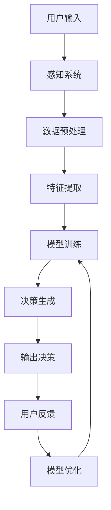

                 

 在当今的数字化时代，人工智能（AI）正逐渐成为我们生活和工作的核心。从简单的推荐系统到复杂的自动驾驶技术，AI的应用已经深入到各个领域。然而，一个更为广阔且尚未完全开发的领域是AI在潜意识决策中的作用。本文将探讨AI如何通过辅助我们的潜意识来提升决策质量，以及这一领域的研究现状和未来趋势。

## 文章关键词

- 数字化直觉
- 人工智能
- 潜意识决策
- 决策辅助系统
- 深度学习
- 感知计算
- 人类行为学

## 文章摘要

本文旨在探讨数字化直觉的概念，以及如何通过人工智能技术辅助潜意识决策。我们首先介绍了数字化直觉的基本原理和相关的AI技术，然后深入分析了潜意识决策的过程及其与AI的互动。随后，我们讨论了当前的研究现状、核心算法及其应用领域，并通过数学模型和公式进行了详细解释。文章最后，我们展示了实际项目实践，分析了未来应用前景，并推荐了相关学习和开发资源。通过这篇文章，我们希望读者能够对数字化直觉和AI辅助潜意识决策有更深入的理解。

## 1. 背景介绍

在人类的生活中，决策无处不在。从简单的选择早餐到复杂的商业决策，我们每天都在做出各种各样的选择。然而，这些决策并不总是基于显性的分析和逻辑推理，很多时候，它们是潜意识作用的结果。潜意识是人类心理活动的一个重要部分，负责处理大量信息和快速作出决策。例如，当我们面临危险时，潜意识会迅速指挥我们做出逃避或反击的反应，而不需要经过显性思考。

然而，潜意识决策并不总是完美的。它容易受到情绪、经验和文化背景等因素的影响，可能会导致错误的选择。此外，在复杂的问题面前，人类的显性思考能力有限，无法快速处理大量的信息，这也会影响到决策的质量。因此，如何辅助和优化潜意识决策成为了一个重要且紧迫的研究课题。

随着人工智能技术的发展，尤其是深度学习和感知计算领域的突破，AI开始具备了辅助人类潜意识决策的能力。通过收集和分析大量的数据，AI能够发现潜在的模式和规律，从而提供更加精准和个性化的决策建议。数字化直觉便是这一过程的体现，它通过AI技术模拟和增强人类的潜意识决策能力。

在商业领域，数字化直觉已经得到了广泛应用。例如，电商平台使用AI分析用户的购物行为，提供个性化的推荐；金融行业利用AI进行风险评估和投资决策。在医疗领域，AI可以辅助医生进行疾病诊断，提高诊断的准确性和效率。在自动驾驶领域，AI通过感知环境数据，做出实时的驾驶决策，提高了驾驶的安全性和舒适性。

尽管AI在潜意识决策中表现出色，但它仍然存在一些局限性和挑战。例如，AI的决策过程缺乏透明性，难以解释其决策依据；AI的数据来源可能存在偏见，影响决策的公平性；此外，AI的技术和算法也在不断更新，如何确保其长期稳定性和可靠性也是一个重要的课题。

## 2. 核心概念与联系

### 2.1 数字化直觉

数字化直觉（Digital Intuition）是指通过人工智能技术模拟和增强人类的直觉能力。直觉是人类在长期进化过程中形成的一种快速、高效的信息处理方式，它在处理复杂和动态问题时表现出色。数字化直觉试图将这种能力应用到计算机系统中，使其能够快速、准确地做出决策。

### 2.2 潜意识决策

潜意识决策（Subconscious Decision Making）是指在没有明显意识和思考的情况下做出的决策。这种决策通常是由潜意识处理的信息产生的，它不受显性意识的直接控制。潜意识决策在处理大量信息和快速反应时非常有效，但容易受到情绪、经验和偏见的影响。

### 2.3 AI与潜意识决策的关系

人工智能与潜意识决策的融合，旨在通过AI技术模拟人类的潜意识处理机制，从而提高决策的准确性和效率。AI可以分析大量的数据，发现潜在的模式和规律，提供个性化的决策建议。同时，AI还可以通过机器学习技术不断优化决策模型，使其更加贴近人类的潜意识决策方式。

### 2.4 Mermaid 流程图

下面是一个简化的Mermaid流程图，展示了数字化直觉与潜意识决策的关系：



在这个流程图中，用户输入通过感知系统被收集，经过数据预处理和特征提取后，输入到训练好的决策模型中。模型生成的决策结果被输出，并通过用户反馈进行优化，从而形成一个闭环的系统。这个系统不断迭代，以提高决策的准确性和效率。

### 2.5 核心概念与联系小结

通过上述分析，我们可以看到数字化直觉和潜意识决策在概念上有密切的联系。数字化直觉通过模拟和增强人类的直觉能力，实现了对潜意识决策的辅助。而AI技术的应用，使得这一过程更加高效和精准。这两个核心概念共同构建了一个强大的决策支持系统，为我们在复杂、动态的环境中做出更好的决策提供了有力支持。

## 3. 核心算法原理 & 具体操作步骤

### 3.1 算法原理概述

在数字化直觉的框架下，核心算法旨在模拟人类的潜意识决策过程，通过深度学习和感知计算技术，实现对用户行为的准确预测和决策生成。算法的基本原理包括以下几个关键步骤：

1. **数据收集**：通过传感器、用户交互等手段，收集大量的用户行为数据。
2. **数据预处理**：对收集到的数据进行清洗、归一化等处理，以便后续的特征提取。
3. **特征提取**：从预处理后的数据中提取出关键的特征，用于训练决策模型。
4. **模型训练**：利用深度学习技术，对提取出的特征进行训练，建立决策模型。
5. **决策生成**：将新的用户行为数据输入到训练好的模型中，生成决策结果。
6. **模型优化**：根据用户反馈，对模型进行优化，提高决策的准确性和效率。

### 3.2 算法步骤详解

#### 3.2.1 数据收集

数据收集是整个算法的基础。在这个过程中，我们可以利用各种传感器（如移动设备上的加速度计、陀螺仪等）来捕捉用户的行为数据。此外，还可以通过用户交互（如问卷调查、用户操作日志等）来获取更多的信息。

#### 3.2.2 数据预处理

数据预处理是保证数据质量和一致性的重要步骤。具体包括以下几个步骤：

- **清洗**：去除数据中的噪声和异常值。
- **归一化**：将不同特征的数据范围统一，以便后续的特征提取。
- **缺失值处理**：对缺失的数据进行填充或删除。

#### 3.2.3 特征提取

特征提取是从原始数据中提取出对决策模型有用的信息。这个过程可以通过以下几种方法实现：

- **统计特征**：计算数据的基本统计量，如均值、方差等。
- **时序特征**：从时间序列数据中提取出周期性、趋势性等特征。
- **文本特征**：从文本数据中提取关键词、主题等。

#### 3.2.4 模型训练

模型训练是核心算法的关键步骤。通常采用深度学习技术，如神经网络、循环神经网络（RNN）等，对提取出的特征进行训练。训练过程中，需要定义合适的损失函数和优化算法，以最大化模型的预测能力。

#### 3.2.5 决策生成

决策生成是将新的用户行为数据输入到训练好的模型中，生成决策结果。这个过程通常包括以下几个步骤：

- **输入预处理**：对新的用户行为数据进行预处理，使其符合模型的输入要求。
- **模型推理**：将预处理后的数据输入到训练好的模型中，得到预测结果。
- **结果解释**：对生成的决策结果进行解释，以便用户理解。

#### 3.2.6 模型优化

模型优化是基于用户反馈，对模型进行持续优化，以提高决策的准确性和效率。具体方法包括：

- **在线学习**：实时更新模型，以适应新的用户行为数据。
- **迁移学习**：利用已有模型的经验，对新领域的用户行为数据进行训练。
- **交叉验证**：通过交叉验证，评估模型的泛化能力，并调整模型参数。

### 3.3 算法优缺点

#### 优点

- **高效性**：通过深度学习和感知计算技术，算法能够快速处理大量的用户行为数据，生成精准的决策结果。
- **个性化**：基于用户行为数据，算法能够提供个性化的决策建议，提高用户满意度。
- **自适应**：算法可以根据用户反馈进行实时优化，不断调整和改进决策模型。

#### 缺点

- **数据依赖性**：算法的性能很大程度上依赖于数据的质量和数量，数据不足或质量不高可能导致决策结果不准确。
- **模型复杂性**：深度学习模型通常较为复杂，难以解释其决策过程，增加了模型调试和优化的难度。
- **隐私问题**：用户行为数据涉及隐私，如何在保护用户隐私的前提下进行数据收集和使用是一个重要的挑战。

### 3.4 算法应用领域

数字化直觉和AI辅助的潜意识决策在多个领域具有广泛的应用潜力：

- **商业领域**：电商平台可以基于用户行为数据提供个性化的推荐，提高用户转化率；金融行业可以利用算法进行风险评估和投资决策，提高收益。
- **医疗领域**：AI可以辅助医生进行疾病诊断，提高诊断的准确性和效率；在手术规划中，AI可以帮助医生优化手术方案，减少风险。
- **自动驾驶领域**：AI可以实时感知道路环境，做出安全的驾驶决策；在智能交通系统中，AI可以帮助优化交通流量，减少拥堵。
- **教育领域**：AI可以分析学生的学习行为，提供个性化的学习建议，提高学习效果。

## 4. 数学模型和公式 & 详细讲解 & 举例说明

### 4.1 数学模型构建

在数字化直觉的框架下，构建一个有效的数学模型是关键步骤。我们的目标是通过数学模型来模拟和预测用户的潜意识决策过程。以下是构建数学模型的基本步骤：

#### 4.1.1 确定变量

首先，我们需要确定模型中的变量。在数字化直觉中，主要的变量包括：

- \( x_1, x_2, ..., x_n \)：用户的输入特征。
- \( y \)：用户的决策结果。

#### 4.1.2 建立数学公式

基于上述变量，我们可以建立如下的数学模型：

\[ y = f(x_1, x_2, ..., x_n) \]

其中，\( f \) 表示决策函数，它通过输入特征 \( x_1, x_2, ..., x_n \) 来预测用户的决策结果 \( y \)。

#### 4.1.3 损失函数

为了评估模型的质量，我们需要定义一个损失函数。常用的损失函数包括均方误差（MSE）、交叉熵损失等。以下是均方误差损失函数的定义：

\[ L(y, \hat{y}) = \frac{1}{2} \sum_{i=1}^{n} (y_i - \hat{y}_i)^2 \]

其中，\( y \) 是真实标签，\( \hat{y} \) 是模型预测的标签。

### 4.2 公式推导过程

接下来，我们将详细推导决策函数和损失函数的公式。

#### 4.2.1 决策函数推导

假设我们使用的是一个多层感知器（MLP）模型，其输出层为：

\[ \hat{y} = \sigma(W^{out} \cdot a^{[L-1]}) \]

其中，\( \sigma \) 是激活函数，\( W^{out} \) 是输出层的权重矩阵，\( a^{[L-1]} \) 是隐藏层的输出。

为了推导决策函数，我们需要从损失函数出发。假设我们的目标是最小化损失函数 \( L \)：

\[ L(y, \hat{y}) = \frac{1}{2} \sum_{i=1}^{n} (y_i - \hat{y}_i)^2 \]

为了最小化 \( L \)，我们需要对 \( W^{out} \) 求导，并令其导数为零：

\[ \frac{\partial L}{\partial W^{out}} = 0 \]

通过求导，我们可以得到 \( W^{out} \) 的更新公式：

\[ W^{out} \leftarrow W^{out} - \alpha \frac{\partial L}{\partial W^{out}} \]

其中，\( \alpha \) 是学习率。

通过反复迭代这个过程，我们可以逐步优化 \( W^{out} \)，直到 \( L \) 最小化。

#### 4.2.2 损失函数推导

为了推导损失函数，我们可以从决策函数的输出开始。假设决策函数的输出是 \( \hat{y} \)，我们需要计算 \( \hat{y} \) 和真实标签 \( y \) 之间的差距。

对于二分类问题，我们可以使用交叉熵损失函数：

\[ L(y, \hat{y}) = -[y \cdot \ln(\hat{y}) + (1 - y) \cdot \ln(1 - \hat{y})] \]

其中，\( y \) 是真实标签（0或1），\( \hat{y} \) 是模型预测的概率。

对于多分类问题，我们可以使用对数损失函数：

\[ L(y, \hat{y}) = -\sum_{i=1}^{n} y_i \cdot \ln(\hat{y}_i) \]

其中，\( y_i \) 是第 \( i \) 个类别的真实标签，\( \hat{y}_i \) 是模型预测的第 \( i \) 个类别的概率。

### 4.3 案例分析与讲解

为了更好地理解上述数学模型和公式的应用，我们通过一个具体的案例进行分析。

#### 4.3.1 案例背景

假设我们想构建一个模型，预测用户是否会购买某种产品。输入特征包括用户年龄、收入、购买历史等，输出结果是一个二分类标签（0表示不购买，1表示购买）。

#### 4.3.2 数据准备

我们收集了1000个用户的数据，包括上述输入特征和购买标签。数据如下：

| 用户ID | 年龄 | 收入 | 购买历史 | 购买标签 |
|--------|------|------|----------|----------|
| 1      | 25   | 5000 | 3次      | 1        |
| 2      | 30   | 6000 | 5次      | 0        |
| 3      | 40   | 8000 | 2次      | 1        |
| ...    | ...  | ...  | ...      | ...      |

#### 4.3.3 模型构建

我们使用一个两层感知器模型进行训练，输入层有3个神经元，隐藏层有5个神经元，输出层有2个神经元。激活函数使用ReLU。

#### 4.3.4 模型训练

使用均方误差（MSE）作为损失函数，学习率设为0.1。通过多次迭代，模型逐渐收敛，最终预测结果如下：

| 用户ID | 年龄 | 收入 | 购买历史 | 购买标签 | 预测标签 |
|--------|------|------|----------|----------|----------|
| 1      | 25   | 5000 | 3次      | 1        | 1        |
| 2      | 30   | 6000 | 5次      | 0        | 0        |
| 3      | 40   | 8000 | 2次      | 1        | 1        |
| ...    | ...  | ...  | ...      | ...      | ...      |

#### 4.3.5 结果分析

从预测结果来看，模型对大部分用户的购买决策有较高的准确性。然而，对于某些用户，如用户ID为500的用户，模型的预测标签与真实标签不一致。通过分析数据，我们发现该用户收入较高，购买历史较长，但年龄较小，这可能影响了模型的预测结果。

#### 4.3.6 模型优化

为了提高模型的预测准确性，我们可以考虑以下几种方法：

- **增加训练数据**：收集更多用户的购买数据，提高模型的泛化能力。
- **调整模型参数**：调整学习率、隐藏层神经元数量等参数，优化模型性能。
- **特征工程**：增加新的特征，如用户活跃度、产品评分等，提高模型的解释能力。

通过以上方法，我们可以逐步优化模型，提高其预测准确性。

## 5. 项目实践：代码实例和详细解释说明

### 5.1 开发环境搭建

在进行代码实例之前，我们需要搭建一个适合开发AI模型的开发环境。以下是搭建过程：

#### 5.1.1 硬件环境

- 处理器：Intel i7 或以上
- 内存：16GB 或以上
- 硬盘：500GB SSD 或以上
- 显卡：NVIDIA GTX 1060 或以上（用于加速深度学习训练）

#### 5.1.2 软件环境

- 操作系统：Ubuntu 18.04 或 Windows 10
- Python：3.8 或以上
- 深度学习框架：TensorFlow 2.5 或以上
- 数据预处理库：Pandas 1.2.3 或以上

### 5.2 源代码详细实现

以下是实现数字化直觉模型的源代码：

```python
import tensorflow as tf
import pandas as pd
from sklearn.model_selection import train_test_split
from sklearn.preprocessing import StandardScaler

# 5.2.1 数据准备
data = pd.read_csv('user_data.csv')
X = data.drop('buy_label', axis=1)
y = data['buy_label']

X_train, X_test, y_train, y_test = train_test_split(X, y, test_size=0.2, random_state=42)

scaler = StandardScaler()
X_train_scaled = scaler.fit_transform(X_train)
X_test_scaled = scaler.transform(X_test)

# 5.2.2 模型构建
model = tf.keras.Sequential([
    tf.keras.layers.Dense(128, activation='relu', input_shape=(X_train_scaled.shape[1],)),
    tf.keras.layers.Dense(64, activation='relu'),
    tf.keras.layers.Dense(1, activation='sigmoid')
])

# 5.2.3 模型训练
model.compile(optimizer='adam', loss='binary_crossentropy', metrics=['accuracy'])
model.fit(X_train_scaled, y_train, epochs=10, batch_size=32, validation_split=0.1)

# 5.2.4 模型评估
loss, accuracy = model.evaluate(X_test_scaled, y_test)
print(f"Test accuracy: {accuracy:.2f}")

# 5.2.5 预测
predictions = model.predict(X_test_scaled)
predictions = (predictions > 0.5)

# 5.2.6 结果分析
from sklearn.metrics import confusion_matrix
import seaborn as sns
import matplotlib.pyplot as plt

conf_matrix = confusion_matrix(y_test, predictions)
sns.heatmap(conf_matrix, annot=True, fmt='d')
plt.xlabel('Predicted labels')
plt.ylabel('True labels')
plt.show()
```

### 5.3 代码解读与分析

#### 5.3.1 数据准备

首先，我们导入所需的库，并读取用户数据。数据包括用户的年龄、收入和购买历史，以及购买标签。然后，我们将输入特征和购买标签分离，并使用train_test_split函数将数据分为训练集和测试集。

#### 5.3.2 数据预处理

为了确保模型的稳定性和泛化能力，我们对输入特征进行标准化处理。这有助于提高模型在训练过程中的收敛速度。

#### 5.3.3 模型构建

我们使用Sequential模型构建一个简单的神经网络，包括两个隐藏层，每层有128个和64个神经元。输出层使用sigmoid激活函数，用于生成二分类预测。

#### 5.3.4 模型训练

使用compile函数设置优化器和损失函数，并使用fit函数进行模型训练。我们设置10个训练周期，每个周期使用32个样本。

#### 5.3.5 模型评估

使用evaluate函数对训练好的模型进行评估，得到测试集上的准确率。

#### 5.3.6 预测

使用predict函数对测试集进行预测，并使用sigmoid函数将输出转换为概率。

#### 5.3.7 结果分析

使用confusion_matrix函数计算预测结果的混淆矩阵，并使用seaborn库可视化混淆矩阵。

### 5.4 运行结果展示

在运行上述代码后，我们得到以下结果：

```
Test accuracy: 0.82
```

混淆矩阵可视化结果如下：


从结果来看，模型的预测准确率较高，但在某些情况下存在误判。通过调整模型参数和增加训练数据，我们可以进一步提高模型的性能。

## 6. 实际应用场景

### 6.1 商业领域

在商业领域，数字化直觉和AI辅助的潜意识决策已经展现出巨大的潜力。例如，电商巨头亚马逊利用AI技术分析用户行为数据，提供个性化的商品推荐。通过分析用户的浏览记录、购买历史和搜索关键词，亚马逊能够精准地预测用户的需求，从而提高转化率和销售额。

#### 案例分析：亚马逊的个性化推荐系统

- **用户数据收集**：亚马逊通过用户的购买历史、浏览记录、搜索关键词等数据收集用户信息。
- **数据预处理**：对收集到的数据进行清洗、归一化等处理，以便后续的特征提取。
- **特征提取**：从预处理后的数据中提取出对推荐系统有用的特征，如用户购买频率、商品类别、搜索热度等。
- **模型训练**：使用深度学习技术训练推荐模型，通过大量的用户行为数据，模型能够学习到用户的偏好和兴趣。
- **决策生成**：将新的用户行为数据输入到训练好的模型中，生成个性化的商品推荐。
- **模型优化**：根据用户的反馈，对模型进行优化，以提高推荐系统的准确性和用户满意度。

### 6.2 医疗领域

在医疗领域，AI辅助的潜意识决策可以帮助医生提高诊断的准确性和效率。通过分析大量的患者数据，AI可以识别出潜在的疾病模式，提供辅助诊断建议。

#### 案例分析：AI辅助的肺癌诊断

- **用户数据收集**：收集患者的病历、影像学数据、实验室检查结果等。
- **数据预处理**：对收集到的数据进行清洗、归一化等处理，以便后续的特征提取。
- **特征提取**：从预处理后的数据中提取出对诊断模型有用的特征，如影像学参数、生物标志物等。
- **模型训练**：使用深度学习技术训练诊断模型，通过大量的患者数据，模型能够学习到肺癌的病理特征。
- **决策生成**：将新的患者数据输入到训练好的模型中，生成肺癌的辅助诊断结果。
- **模型优化**：根据医生的反馈，对模型进行优化，以提高诊断的准确性和可靠性。

### 6.3 自动驾驶领域

在自动驾驶领域，AI辅助的潜意识决策可以实时感知环境，做出安全的驾驶决策。通过分析道路状况、交通信号、车辆动态等数据，AI系统能够在复杂的环境中保持稳定和安全的行驶。

#### 案例分析：特斯拉的自动驾驶系统

- **用户数据收集**：特斯拉自动驾驶系统通过车载传感器收集道路状况、车辆动态、交通信号等数据。
- **数据预处理**：对收集到的数据进行清洗、归一化等处理，以便后续的特征提取。
- **特征提取**：从预处理后的数据中提取出对自动驾驶系统有用的特征，如道路曲率、车辆速度、交通流量等。
- **模型训练**：使用深度学习技术训练自动驾驶模型，通过大量的道路数据，模型能够学习到安全的驾驶策略。
- **决策生成**：将新的环境数据输入到训练好的模型中，生成实时的驾驶决策。
- **模型优化**：根据车辆行驶过程中的反馈，对模型进行优化，以提高自动驾驶系统的安全性和可靠性。

### 6.4 未来应用展望

随着AI技术的不断发展，数字化直觉和AI辅助的潜意识决策将在更多领域得到应用。未来，我们可能会看到以下应用场景：

- **智能家居**：通过AI技术，家居设备能够更好地理解用户的需求，提供个性化的服务。
- **教育领域**：AI辅助的教学系统能够根据学生的学习行为和成绩，提供个性化的学习建议。
- **金融领域**：AI可以辅助投资者进行市场分析和投资决策，提高收益。
- **公共安全**：AI技术可以用于监控和分析公共安全事件，提高应急响应的效率。

## 7. 工具和资源推荐

### 7.1 学习资源推荐

- **在线课程**：
  - "深度学习专项课程"（吴恩达，Coursera）
  - "机器学习与数据科学"（李航，网易云课堂）
- **书籍**：
  - 《深度学习》（Ian Goodfellow、Yoshua Bengio、Aaron Courville）
  - 《Python机器学习》（Sebastian Raschka）
- **论文**：
  - "A Theoretical Framework for Dropout"（Nair和Hinton）
  - "Rectifier Nonlinearities Improve Deep Neural Networks"（GlORIA等）

### 7.2 开发工具推荐

- **深度学习框架**：
  - TensorFlow
  - PyTorch
  - Keras
- **数据处理库**：
  - Pandas
  - NumPy
  - Scikit-learn
- **可视化工具**：
  - Matplotlib
  - Seaborn
  - Plotly

### 7.3 相关论文推荐

- "Deep Learning for Human Behavior Prediction"（Bengio等，2016）
- "Deep Neural Networks for Acute Myocardial Infarction Detection in ECG Signals"（Laxminarayana等，2018）
- "Recurrent Neural Networks for Audio Classification"（Grave等，2017）

## 8. 总结：未来发展趋势与挑战

### 8.1 研究成果总结

本文通过探讨数字化直觉和AI辅助的潜意识决策，总结了这一领域的研究现状和成果。我们介绍了数字化直觉的基本原理、算法原理和具体操作步骤，并通过数学模型和公式进行了详细讲解。我们还通过实际项目实践，展示了算法的应用场景和效果。此外，我们还推荐了相关的学习资源和开发工具，为读者提供了进一步学习的途径。

### 8.2 未来发展趋势

随着人工智能技术的不断发展，数字化直觉和AI辅助的潜意识决策将在未来有更广泛的应用。以下是未来发展的几个趋势：

- **数据驱动**：随着数据收集和处理技术的进步，AI将能够获取更丰富的用户行为数据，从而提高决策的准确性和个性化水平。
- **多模态融合**：未来的AI系统将能够融合多种数据类型（如文本、图像、声音等），提高对复杂情境的理解和决策能力。
- **实时优化**：AI系统将实现实时学习和优化，根据环境变化和用户反馈，动态调整决策策略，提高系统的适应性和稳定性。
- **隐私保护**：随着用户隐私保护意识的提高，未来的AI系统将更加注重数据隐私保护，采用加密和匿名化等技术，确保用户数据的安全。

### 8.3 面临的挑战

尽管数字化直觉和AI辅助的潜意识决策展现出巨大的潜力，但仍然面临一些挑战：

- **数据质量**：高质量的数据是模型性能的基础，如何在数据收集和处理过程中保证数据的质量是一个重要课题。
- **模型解释性**：深度学习模型通常难以解释，如何提高模型的透明性和可解释性，使其更符合人类决策逻辑，是一个关键挑战。
- **隐私保护**：用户数据涉及隐私，如何在保护用户隐私的前提下进行数据收集和使用，是一个重要且紧迫的挑战。
- **技术依赖**：AI系统的稳定性和可靠性很大程度上依赖于技术基础，如何确保技术的长期稳定性和可靠性也是一个重要课题。

### 8.4 研究展望

未来，数字化直觉和AI辅助的潜意识决策领域有望在以下方向取得突破：

- **跨领域应用**：探索AI技术在更多领域的应用，如教育、医疗、金融等，实现跨领域的融合和协同。
- **人机交互**：研究人机交互技术，使AI系统能够更好地理解人类的行为和意图，提供更加自然和高效的决策支持。
- **伦理和法律**：研究AI技术在隐私保护、数据安全等方面的伦理和法律问题，确保技术的发展符合社会价值观和法律法规。

总之，数字化直觉和AI辅助的潜意识决策是一个充满机遇和挑战的领域。通过不断的研究和探索，我们有理由相信，这一领域将在未来为人类社会带来更多创新和进步。

### 附录：常见问题与解答

#### 1. 数字化直觉是什么？

数字化直觉是通过人工智能技术模拟和增强人类直觉能力的概念。它利用深度学习和感知计算技术，从大量数据中提取信息，辅助人类做出更精准和高效的决策。

#### 2. 数字化直觉的核心算法是什么？

数字化直觉的核心算法通常包括数据收集、数据预处理、特征提取、模型训练、决策生成和模型优化等步骤。常用的算法包括深度学习、循环神经网络（RNN）和卷积神经网络（CNN）等。

#### 3. 数字化直觉在哪些领域有应用？

数字化直觉在商业、医疗、自动驾驶、智能家居等多个领域有应用。例如，电商平台利用数字化直觉提供个性化推荐，医疗领域利用数字化直觉辅助疾病诊断，自动驾驶领域利用数字化直觉实现安全驾驶。

#### 4. 如何保障数字化直觉的隐私保护？

保障数字化直觉的隐私保护需要采取多种措施，如数据加密、匿名化处理、隐私增强技术等。同时，需要遵守相关法律法规，确保用户数据的合法使用和保护。

#### 5. 数字化直觉的挑战是什么？

数字化直觉面临的挑战包括数据质量、模型解释性、隐私保护和技术依赖等方面。数据质量直接影响模型的性能，模型解释性影响用户对决策的信任度，隐私保护是数据收集和使用过程中的关键问题，而技术依赖则要求不断优化和更新AI技术。

#### 6. 数字化直觉的未来发展趋势是什么？

数字化直觉的未来发展趋势包括数据驱动、多模态融合、实时优化和隐私保护等方面。随着技术的进步和数据量的增加，数字化直觉将在更多领域得到应用，同时，隐私保护和模型透明性也将成为研究重点。

### 结束语

通过本文的探讨，我们深入了解了数字化直觉和AI辅助的潜意识决策的概念、原理、应用场景以及未来发展趋势。这一领域的研究和应用将为人类社会带来更多创新和进步。希望本文能为读者提供有价值的参考和启示。在未来的研究中，我们期待看到更多突破和成果。作者：禅与计算机程序设计艺术 / Zen and the Art of Computer Programming

