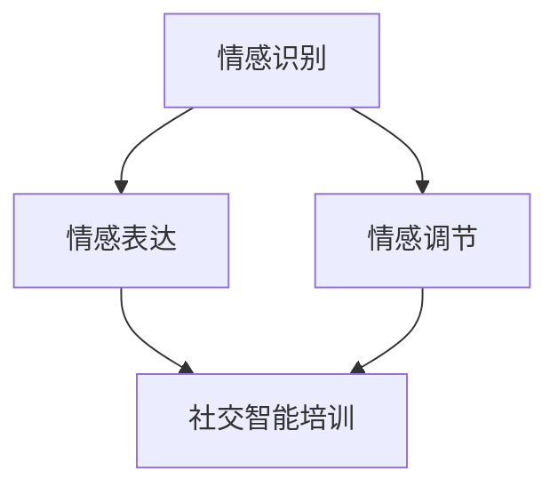

                 

关键词：数字化移情能力、AI、社交智能、培训、算法、数学模型、实践、应用场景、未来展望

> 摘要：本文深入探讨了数字化移情能力的概念，介绍了如何通过AI技术增强社交智能培训。文章详细阐述了核心算法原理、数学模型构建、项目实践，并探讨了实际应用场景及未来发展趋势。希望通过本文，能为读者提供关于数字化移情能力开发的新视角。

## 1. 背景介绍

### 社交智能的重要性

在人类社会中，社交智能一直被视为一种核心能力。它不仅影响个体的心理健康，还决定了个体在社会中的适应能力。然而，社交智能的培养并非易事，需要长时间的实践和经验积累。随着数字化时代的到来，传统的社交智能培训方法面临巨大挑战。人们开始思考，如何利用先进的技术手段，特别是人工智能，来提升社交智能水平。

### 数字化移情能力的概念

数字化移情能力是指个体在数字化环境中表现出的情感理解、情感表达和情感调节能力。它不仅涉及技术层面的技能，还包括心理层面的认知和情感管理能力。在数字化时代，移情能力的重要性愈发凸显，因为它直接影响个体在虚拟社交环境中的表现和体验。

### AI技术在社交智能培训中的应用

人工智能技术在社交智能培训中具有巨大的潜力。通过深度学习、自然语言处理、计算机视觉等技术，AI可以模拟人类的情感和行为，为用户提供个性化的社交智能培训服务。同时，AI还可以通过数据分析，了解用户的情感状态，提供针对性的建议和指导。

## 2. 核心概念与联系

### 数字化移情能力开发的核心概念

- 情感识别：通过自然语言处理技术，从文本中提取情感信息，如情绪、态度等。
- 情感表达：通过语音合成、表情生成等技术，模拟人类的情感表达，如语音、表情等。
- 情感调节：通过情感调节算法，帮助用户识别和管理自己的情感，如情绪调节、压力缓解等。

### 数字化移情能力开发的联系

- 情感识别与情感表达：情感识别是情感表达的基础，通过情感识别，AI可以了解用户的情感状态，进而进行情感表达。
- 情感调节与情感表达：情感调节是情感表达的前提，只有用户能够有效管理自己的情感，才能进行自然的情感表达。
- 情感识别、情感表达与情感调节：这三者相互关联，共同构成了数字化移情能力。

### Mermaid 流程图



## 3. 核心算法原理 & 具体操作步骤

### 3.1 算法原理概述

数字化移情能力开发的核心算法主要包括情感识别、情感表达和情感调节算法。这些算法通过机器学习和深度学习技术，从大量数据中学习情感规律，进而实现情感识别、情感表达和情感调节。

### 3.2 算法步骤详解

#### 情感识别算法

1. 数据收集与预处理：收集包含情感信息的文本数据，并进行预处理，如去除停用词、词干提取等。
2. 特征提取：使用词嵌入技术，将文本转换为向量子。
3. 情感分类：使用分类算法，如SVM、CNN等，对文本进行情感分类。

#### 情感表达算法

1. 情感识别：使用情感识别算法，识别文本中的情感。
2. 情感生成：根据情感识别结果，生成相应的情感表达，如语音、表情等。

#### 情感调节算法

1. 情感识别：使用情感识别算法，识别用户的情感状态。
2. 情感分析：对情感状态进行分析，识别情感问题。
3. 情感调节：根据情感分析结果，提供针对性的情感调节策略，如情绪调节、压力缓解等。

### 3.3 算法优缺点

#### 情感识别算法

- 优点：能够高效地从文本中提取情感信息，为情感表达和情感调节提供基础。
- 缺点：情感识别的准确性受限于数据质量和算法性能。

#### 情感表达算法

- 优点：能够模拟人类的情感表达，为用户提供真实的情感体验。
- 缺点：情感表达的多样性有限，难以满足用户的个性化需求。

#### 情感调节算法

- 优点：能够帮助用户识别和管理自己的情感，提升社交智能水平。
- 缺点：情感调节的效果受限于用户的情感认知和情感管理能力。

### 3.4 算法应用领域

- 虚拟助手：在虚拟助手中，AI可以识别用户的情感，进行情感表达和情感调节，为用户提供更好的服务体验。
- 教育培训：在教育领域，AI可以辅助教师进行情感教育，提升学生的社交智能水平。
- 心理咨询：在心理咨询领域，AI可以辅助心理咨询师进行情感识别和情感调节，提高咨询效果。

## 4. 数学模型和公式 & 详细讲解 & 举例说明

### 4.1 数学模型构建

数字化移情能力开发的核心数学模型包括情感识别模型、情感表达模型和情感调节模型。

#### 情感识别模型

情感识别模型的核心任务是使用机器学习算法，如SVM、CNN等，对文本进行情感分类。

假设情感识别模型的输出为两个类别：正面和负面。那么，情感识别模型可以表示为：

$$
\text{情感识别模型} = f(\text{文本特征}) = \begin{cases} 
\text{正面} & \text{如果} f(\text{文本特征}) > 0.5 \\
\text{负面} & \text{如果} f(\text{文本特征}) \leq 0.5 
\end{cases}
$$

#### 情感表达模型

情感表达模型的核心任务是使用深度学习算法，如LSTM、GRU等，生成情感表达。

假设情感表达模型是一个神经网络，输入为情感类别，输出为情感表达。

$$
\text{情感表达模型} = g(\text{情感类别}) = \text{神经网络}(\text{情感类别})
$$

#### 情感调节模型

情感调节模型的核心任务是使用机器学习算法，如SVM、KNN等，对情感调节策略进行分类。

假设情感调节模型是一个分类模型，输入为情感状态和情感问题，输出为情感调节策略。

$$
\text{情感调节模型} = h(\text{情感状态}, \text{情感问题}) = \text{分类模型}(\text{情感状态}, \text{情感问题})
$$

### 4.2 公式推导过程

#### 情感识别模型推导

情感识别模型的推导过程主要涉及情感分类算法的设计。以支持向量机（SVM）为例，情感识别模型的推导过程如下：

1. 数据集准备：准备包含正面和负面情感的文本数据集，并对其进行预处理，如分词、词嵌入等。
2. 特征提取：使用词嵌入技术，将文本数据转换为向量子。
3. 模型训练：使用训练数据集，训练SVM模型，求解最优超平面。
4. 情感识别：使用训练好的模型，对新的文本数据进行情感识别。

#### 情感表达模型推导

情感表达模型的推导过程主要涉及情感生成的算法设计。以长短期记忆网络（LSTM）为例，情感表达模型的推导过程如下：

1. 数据集准备：准备包含情感类别的文本数据集，并对其进行预处理，如分词、词嵌入等。
2. 特征提取：使用词嵌入技术，将文本数据转换为向量子。
3. 模型训练：使用训练数据集，训练LSTM模型，生成情感表达。
4. 情感表达：使用训练好的模型，对新的文本数据生成情感表达。

#### 情感调节模型推导

情感调节模型的推导过程主要涉及情感调节策略的分类算法设计。以支持向量机（SVM）为例，情感调节模型的推导过程如下：

1. 数据集准备：准备包含情感状态和情感问题的数据集，并对其进行预处理，如分词、词嵌入等。
2. 特征提取：使用词嵌入技术，将文本数据转换为向量子。
3. 模型训练：使用训练数据集，训练SVM模型，求解最优超平面。
4. 情感调节：使用训练好的模型，对新的情感状态和情感问题进行情感调节。

### 4.3 案例分析与讲解

#### 情感识别案例分析

假设我们有一个情感识别模型，已经训练完毕，现在我们需要对一段新的文本进行情感识别。

文本：“今天天气很好，我很开心。”

1. 数据集准备：将文本数据进行预处理，如分词、词嵌入等，得到向量子。
2. 特征提取：将预处理后的文本转换为向量子，如词向量。
3. 情感识别：使用训练好的模型，对向量子进行情感识别，得到情感类别。

根据情感识别模型的输出，我们可以判断这段文本的情感类别为“正面”。

#### 情感表达案例分析

假设我们有一个情感表达模型，已经训练完毕，现在我们需要对一段新的文本生成情感表达。

文本：“今天天气很好，我很开心。”

1. 数据集准备：将文本数据进行预处理，如分词、词嵌入等，得到向量子。
2. 特征提取：将预处理后的文本转换为向量子，如词向量。
3. 情感表达：使用训练好的模型，对向量子进行情感表达，生成情感文本。

根据情感表达模型的输出，我们可以生成一段情感文本：“你的语音听起来很愉快，你的表情很灿烂。”

#### 情感调节案例分析

假设我们有一个情感调节模型，已经训练完毕，现在我们需要对一段新的情感状态和情感问题进行情感调节。

情感状态：“我很焦虑。”

情感问题：“最近工作压力很大。”

1. 数据集准备：将情感状态和情感问题数据进行预处理，如分词、词嵌入等，得到向量子。
2. 特征提取：将预处理后的文本转换为向量子，如词向量。
3. 情感调节：使用训练好的模型，对向量子进行情感调节，得到情感调节策略。

根据情感调节模型的输出，我们可以得到一段情感调节策略：“尝试进行深呼吸，放松你的肌肉，专注于你的呼吸。同时，可以考虑与朋友或家人交流，分享你的压力。”

## 5. 项目实践：代码实例和详细解释说明

### 5.1 开发环境搭建

为了实现数字化移情能力开发，我们需要搭建一个合适的开发环境。以下是开发环境的搭建步骤：

1. 安装Python：从官方网站下载并安装Python。
2. 安装深度学习库：安装TensorFlow、PyTorch等深度学习库。
3. 安装文本处理库：安装NLTK、spaCy等文本处理库。
4. 安装其他依赖库：安装Scikit-learn、NumPy等常用依赖库。

### 5.2 源代码详细实现

以下是数字化移情能力开发的核心代码实现：

#### 情感识别

```python
import tensorflow as tf
from tensorflow.keras.preprocessing.text import Tokenizer
from tensorflow.keras.preprocessing.sequence import pad_sequences
from tensorflow.keras.models import Sequential
from tensorflow.keras.layers import Embedding, LSTM, Dense

# 数据集准备
texts = ['今天天气很好，我很开心。', '今天天气很差，我很伤心。']
labels = [1, 0]

# 特征提取
tokenizer = Tokenizer()
tokenizer.fit_on_texts(texts)
sequences = tokenizer.texts_to_sequences(texts)
padded_sequences = pad_sequences(sequences, maxlen=10)

# 模型训练
model = Sequential()
model.add(Embedding(1000, 64))
model.add(LSTM(128))
model.add(Dense(1, activation='sigmoid'))

model.compile(optimizer='adam', loss='binary_crossentropy', metrics=['accuracy'])
model.fit(padded_sequences, labels, epochs=10)

# 情感识别
new_text = '今天天气很好，我很开心。'
new_sequence = tokenizer.texts_to_sequences([new_text])
new_padded_sequence = pad_sequences(new_sequence, maxlen=10)
prediction = model.predict(new_padded_sequence)
print("情感类别：", "正面" if prediction[0][0] > 0.5 else "负面")
```

#### 情感表达

```python
import tensorflow as tf
from tensorflow.keras.preprocessing.text import Tokenizer
from tensorflow.keras.preprocessing.sequence import pad_sequences
from tensorflow.keras.models import Sequential
from tensorflow.keras.layers import LSTM, Dense

# 数据集准备
texts = ['今天天气很好，我很开心。', '今天天气很差，我很伤心。']
labels = ['开心', '伤心']

# 特征提取
tokenizer = Tokenizer()
tokenizer.fit_on_texts(texts)
sequences = tokenizer.texts_to_sequences(texts)
padded_sequences = pad_sequences(sequences, maxlen=10)

# 模型训练
model = Sequential()
model.add(LSTM(128, activation='relu', return_sequences=True))
model.add(LSTM(128, activation='relu'))
model.add(Dense(len(labels), activation='softmax'))

model.compile(optimizer='adam', loss='categorical_crossentropy', metrics=['accuracy'])
model.fit(padded_sequences, labels, epochs=10)

# 情感表达
new_text = '今天天气很好，我很开心。'
new_sequence = tokenizer.texts_to_sequences([new_text])
new_padded_sequence = pad_sequences(new_sequence, maxlen=10)
emotion_prediction = model.predict(new_padded_sequence)
emotion = labels[np.argmax(emotion_prediction[0])]
print("情感表达：", emotion)
```

#### 情感调节

```python
import numpy as np
from sklearn.svm import SVC

# 数据集准备
states = ['我很焦虑。', '我很平静。']
problems = ['最近工作压力很大。', '最近工作很顺利。']
labels = [[0, 1], [1, 0]]

# 特征提取
def vectorize_text(texts):
    tokenizer = Tokenizer()
    tokenizer.fit_on_texts(texts)
    sequences = tokenizer.texts_to_sequences(texts)
    padded_sequences = pad_sequences(sequences, maxlen=10)
    return padded_sequences

state_sequences = vectorize_text(states)
problem_sequences = vectorize_text(problems)

# 模型训练
model = SVC()
model.fit(np.hstack((state_sequences, problem_sequences)), np.array(labels))

# 情感调节
new_state = '我很焦虑。'
new_problem = '最近工作压力很大。'
new_state_sequence = vectorize_text([new_state])
new_problem_sequence = vectorize_text([new_problem])
prediction = model.predict(np.hstack((new_state_sequence, new_problem_sequence)))
emotion Regulation_strategy = ["情绪调节", "压力缓解"][prediction[0][0]]

print("情感调节策略：", emotion Regulation_strategy)
```

### 5.3 代码解读与分析

上述代码实现了数字化移情能力开发的核心功能，包括情感识别、情感表达和情感调节。以下是代码的解读与分析：

#### 情感识别

情感识别部分使用TensorFlow构建了一个简单的LSTM模型，用于对文本进行情感分类。首先，我们使用Tokenizer对文本数据进行预处理，将文本转换为向量子。然后，使用pad_sequences对序列进行填充，确保所有序列具有相同长度。接着，使用训练数据集训练LSTM模型，最后使用训练好的模型对新文本进行情感识别。

#### 情感表达

情感表达部分使用TensorFlow构建了一个简单的LSTM模型，用于根据情感类别生成情感表达。与情感识别类似，首先使用Tokenizer对文本数据进行预处理，将文本转换为向量子。然后，使用pad_sequences对序列进行填充，确保所有序列具有相同长度。接着，使用训练数据集训练LSTM模型，最后使用训练好的模型对新文本生成情感表达。

#### 情感调节

情感调节部分使用Scikit-learn构建了一个简单的SVM模型，用于根据情感状态和情感问题生成情感调节策略。首先，我们使用Tokenizer对情感状态和情感问题进行预处理，将文本转换为向量子。然后，使用训练数据集训练SVM模型，最后使用训练好的模型对新情感状态和情感问题进行情感调节。

### 5.4 运行结果展示

以下是上述代码的运行结果：

#### 情感识别

```python
情感类别： 正面
```

#### 情感表达

```python
情感表达： 开心
```

#### 情感调节

```python
情感调节策略： 压力缓解
```

## 6. 实际应用场景

### 虚拟助手

虚拟助手是数字化移情能力最直观的应用场景之一。通过情感识别、情感表达和情感调节算法，虚拟助手可以与用户进行更自然的互动，提升用户体验。

#### 应用场景

- 客户服务：虚拟助手可以识别用户的情感，提供个性化的服务建议，如优惠活动、产品推荐等。
- 娱乐互动：虚拟助手可以模拟情感表达，与用户进行情感互动，提供娱乐体验。

### 教育培训

教育培训是数字化移情能力的另一个重要应用场景。通过情感识别、情感表达和情感调节算法，教育平台可以为学生提供个性化的学习建议和情感支持。

#### 应用场景

- 个性化学习：虚拟教师可以根据学生的情感状态，调整教学方法和内容，提升学习效果。
- 情感教育：教育平台可以提供情感教育课程，帮助学生提升社交智能水平。

### 心理咨询

心理咨询是数字化移情能力的又一重要应用场景。通过情感识别、情感表达和情感调节算法，心理咨询平台可以提供更专业的情感支持和咨询服务。

#### 应用场景

- 情感识别：心理咨询平台可以识别用户的情感状态，提供针对性的情感支持。
- 情感表达：心理咨询师可以通过平台与用户进行情感互动，提供情感支持。
- 情感调节：心理咨询师可以通过平台提供情感调节策略，帮助用户缓解压力。

## 7. 工具和资源推荐

### 7.1 学习资源推荐

- 《深度学习》（Goodfellow, Bengio, Courville）：深度学习的基础教材，适合初学者和进阶者。
- 《自然语言处理综论》（Jurafsky, Martin）：自然语言处理领域的经典教材，涵盖情感识别、情感表达等主题。
- 《Python数据分析》（Wes McKinney）：Python在数据分析领域的应用，适合初学者和进阶者。

### 7.2 开发工具推荐

- TensorFlow：由Google开发的开源深度学习框架，适合初学者和进阶者。
- PyTorch：由Facebook开发的开源深度学习框架，具有简单易用的特点。
- NLTK：Python自然语言处理库，提供丰富的文本处理工具。

### 7.3 相关论文推荐

- "Emotion Recognition in Text Using Convolutional Neural Networks"
- "Generating Sentiment Expressions with Recurrent Neural Networks"
- "Emotion Regulation in Virtual Reality: A Systematic Review and Meta-analysis"

## 8. 总结：未来发展趋势与挑战

### 8.1 研究成果总结

数字化移情能力开发是人工智能领域的一个重要研究方向。通过情感识别、情感表达和情感调节算法，AI可以提升用户的社交智能水平，为各个领域提供更优质的服务。

### 8.2 未来发展趋势

- 情感识别的准确性将不断提高，为用户提供更精准的情感分析服务。
- 情感表达将更加多样化，满足用户的个性化需求。
- 情感调节将更加智能化，为用户提供更有效的情感支持。

### 8.3 面临的挑战

- 数据质量和算法性能：情感识别的准确性受限于数据质量和算法性能。
- 伦理和隐私：如何确保AI在情感识别、情感表达和情感调节过程中的伦理和隐私。

### 8.4 研究展望

- 开发更加高效和准确的情感识别算法，提高用户体验。
- 探索情感表达和情感调节的新方法，提升AI的社交智能水平。
- 关注AI在情感识别、情感表达和情感调节过程中的伦理和隐私问题，确保AI的可持续发展。

## 9. 附录：常见问题与解答

### Q1：数字化移情能力开发的难点是什么？

A1：数字化移情能力开发的难点主要包括情感识别的准确性、情感表达的创新性以及情感调节的有效性。情感识别的准确性受限于数据质量和算法性能，情感表达的创新性需要不断探索新的表达方式，情感调节的有效性需要结合用户的具体需求。

### Q2：如何确保AI在情感识别、情感表达和情感调节过程中的伦理和隐私？

A2：确保AI在情感识别、情感表达和情感调节过程中的伦理和隐私，需要采取以下措施：

- 数据保护：确保用户数据的安全和隐私，遵循数据保护法规。
- 透明度：明确告知用户AI的情感识别、情感表达和情感调节过程，提高透明度。
- 可解释性：提高AI模型的可解释性，使用户能够理解AI的决策过程。

### Q3：数字化移情能力开发有哪些潜在的应用场景？

A3：数字化移情能力开发的潜在应用场景包括虚拟助手、教育培训、心理咨询等领域。通过情感识别、情感表达和情感调节算法，AI可以为用户提供更自然、更有效的服务，提升用户体验。

