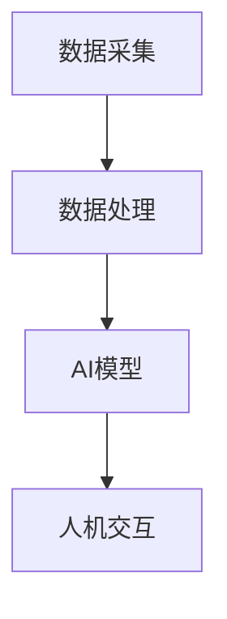

                 

关键词：数字化第六感、AI辅助、超感知能力、开发包、人机交互、技术博客

摘要：本文深入探讨了数字化第六感的概念，以及如何通过AI辅助开发包来培养人类的超感知能力。文章首先介绍了数字化第六感的基本原理，随后详细解析了相关核心算法原理、数学模型和具体操作步骤。此外，文章还通过代码实例展示了如何实现这一技术，并探讨了其实际应用场景和未来发展趋势。

## 1. 背景介绍

在信息爆炸的时代，人类对于信息获取和处理的需求不断增长。然而，传统的五官感知已经无法满足我们对海量数据的实时解析和反应速度的要求。于是，数字化第六感的概念应运而生。数字化第六感指的是通过人工智能技术，扩展人类感知能力，使其能够实时获取、处理和响应超出传统五官感知范围的数据和信息。

AI辅助的数字化第六感开发包旨在提供一种工具，使得普通用户能够通过简单的操作，提升自己的感知能力，从而更好地适应数字化时代的要求。这一开发包结合了最新的AI技术和人机交互设计，使得非专业人士也能够轻松上手，并从中受益。

## 2. 核心概念与联系

为了深入理解数字化第六感的原理，我们首先需要了解其背后的核心概念和它们之间的联系。

### 2.1 数据采集

数据采集是数字化第六感的基石。它通过多种传感器和设备，将物理世界中的各种信息转化为数字信号。这些传感器可以是摄像头、麦克风、温度传感器、湿度传感器等，它们能够捕捉到环境中的视觉、声音、温度和湿度等数据。

### 2.2 数据处理

一旦数据被采集，接下来就是数据处理。数据处理包括数据的清洗、归一化、特征提取等步骤，目的是将原始数据转化为适合AI模型处理的形式。

### 2.3 AI模型

数据处理完成后，AI模型将介入。这些模型可以是机器学习模型、深度学习模型等，它们能够对数据进行自动分析、分类、预测等操作。

### 2.4 人机交互

人机交互是数字化第六感实现的关键。通过图形用户界面（GUI）或其他交互方式，用户可以与AI模型进行交互，获取所需的信息或进行进一步的指令输入。

下面是一个简化的 Mermaid 流程图，展示了这些核心概念之间的联系：



## 3. 核心算法原理 & 具体操作步骤

### 3.1 算法原理概述

数字化第六感的核心算法原理主要基于机器学习和深度学习。这些算法通过训练大量数据，学习如何对新的数据进行分类、预测或识别。

以下是该算法的基本原理：

1. **数据预处理**：将原始数据进行清洗、归一化和特征提取，使其适用于机器学习模型。
2. **模型选择**：根据任务需求选择合适的机器学习模型，如决策树、支持向量机、神经网络等。
3. **模型训练**：使用预处理后的数据对模型进行训练，使模型能够学习数据的特征和模式。
4. **模型评估**：使用验证数据集对训练好的模型进行评估，调整模型参数，以提高准确性。
5. **模型部署**：将训练好的模型部署到实际应用场景中，进行实时数据处理和响应。

### 3.2 算法步骤详解

以下是具体操作步骤的详细解析：

#### 3.2.1 数据预处理

数据预处理是确保数据质量的重要步骤。它包括以下步骤：

- **数据清洗**：去除数据中的噪声和异常值。
- **数据归一化**：将数据缩放到一个统一的范围内，如[0, 1]或[-1, 1]。
- **特征提取**：从原始数据中提取有用的信息，作为模型的输入。

#### 3.2.2 模型选择

选择合适的模型是成功的关键。以下是几种常用的机器学习模型：

- **决策树**：适用于分类任务，能够生成简洁的规则。
- **支持向量机（SVM）**：适用于分类和回归任务，具有较好的泛化能力。
- **神经网络**：适用于复杂的模式识别和分类任务，尤其是深度神经网络。

#### 3.2.3 模型训练

模型训练是学习数据特征和模式的过程。以下是常用的训练方法：

- **监督学习**：使用标注数据进行训练。
- **无监督学习**：不使用标注数据进行训练，用于发现数据中的隐含结构。
- **强化学习**：通过试错和反馈来训练模型。

#### 3.2.4 模型评估

模型评估是确保模型性能的重要步骤。常用的评估指标包括：

- **准确率**：正确分类的样本数占总样本数的比例。
- **召回率**：正确分类的样本数占所有实际为正类的样本数的比例。
- **F1 分数**：准确率和召回率的调和平均。

#### 3.2.5 模型部署

模型部署是将训练好的模型应用到实际应用场景中。以下是一些常见的部署方法：

- **本地部署**：在用户设备上直接运行模型。
- **云端部署**：在云端服务器上运行模型，通过API进行访问。
- **边缘部署**：在离用户较近的设备上运行模型，以减少延迟。

### 3.3 算法优缺点

每种算法都有其优缺点，以下是几种常见算法的优缺点对比：

- **决策树**：
  - 优点：易于理解，可生成简洁的规则。
  - 缺点：易过拟合，对噪声敏感。

- **支持向量机（SVM）**：
  - 优点：具有较好的泛化能力，适用于高维数据。
  - 缺点：计算复杂度高，对参数敏感。

- **神经网络**：
  - 优点：能够处理复杂的非线性关系，具有很好的泛化能力。
  - 缺点：训练时间较长，对数据质量要求高。

### 3.4 算法应用领域

数字化第六感技术可以应用于多个领域，以下是几个典型的应用场景：

- **医疗保健**：通过实时监测患者生理参数，提供早期预警。
- **智能家居**：通过感知环境变化，提供智能化的家居控制。
- **工业自动化**：通过实时感知生产线状态，提高生产效率。

## 4. 数学模型和公式 & 详细讲解 & 举例说明

### 4.1 数学模型构建

数字化第六感的数学模型主要基于机器学习和深度学习。以下是几种常见的数学模型及其构建方法：

#### 4.1.1 决策树

决策树是一种基于规则的方法，通过一系列的判断条件来对数据进行分类或回归。其构建方法如下：

$$
Gini(D) = 1 - \sum_{v \in V} p_v (1 - p_v)
$$

其中，$D$ 是数据集，$V$ 是 $D$ 中的所有可能的类别，$p_v$ 是 $D$ 中类别 $v$ 的比例。

#### 4.1.2 支持向量机（SVM）

支持向量机是一种基于最大间隔的方法，通过找到一个超平面，将数据分类。其构建方法如下：

$$
\min_{\mathbf{w}, b} \frac{1}{2} ||\mathbf{w}||^2 + C \sum_{i=1}^n \xi_i
$$

$$
\text{subject to} \quad y_i (\mathbf{w} \cdot \mathbf{x_i} + b) \geq 1 - \xi_i
$$

其中，$\mathbf{w}$ 是超平面的法向量，$b$ 是偏置项，$C$ 是惩罚参数，$\xi_i$ 是松弛变量。

#### 4.1.3 神经网络

神经网络是一种基于非线性变换的方法，通过多层神经网络来模拟人类大脑的工作方式。其构建方法如下：

$$
\mathbf{z}_{l}^{[i]} = \mathbf{W}_{l}^{[i]} \cdot \mathbf{a}_{l-1}^{[i]} + b_{l}^{[i]}
$$

$$
a_{l}^{[i]} = \sigma(\mathbf{z}_{l}^{[i]})
$$

其中，$\mathbf{z}_{l}^{[i]}$ 是第 $l$ 层第 $i$ 个神经元的输入，$\mathbf{a}_{l}^{[i]}$ 是第 $l$ 层第 $i$ 个神经元的输出，$\sigma$ 是激活函数，$\mathbf{W}_{l}^{[i]}$ 是第 $l$ 层第 $i$ 个神经元的权重，$b_{l}^{[i]}$ 是第 $l$ 层第 $i$ 个神经元的偏置。

### 4.2 公式推导过程

#### 4.2.1 决策树公式推导

决策树的构建过程可以看作是一个优化问题，目标是找到最优的划分方式。假设我们有 $n$ 个特征 $X_1, X_2, ..., X_n$，每个特征都有 $v$ 个可能的取值。我们的目标是找到一种划分方式，使得分类的准确率最高。

设 $D$ 是一个数据集，$V$ 是 $D$ 中的所有可能的类别，$p_v$ 是 $D$ 中类别 $v$ 的比例。根据 Gini 不纯度定义，我们有：

$$
Gini(D) = 1 - \sum_{v \in V} p_v (1 - p_v)
$$

为了找到最优的划分方式，我们需要对每个特征 $X_i$ 进行遍历，计算其划分后每个子集的 Gini 不纯度。选择使得 Gini 不纯度最小的划分方式。

#### 4.2.2 支持向量机（SVM）公式推导

支持向量机的目标是最小化超平面的法向量 $\mathbf{w}$ 的长度，同时保证所有样本点都在超平面的一侧。设 $\mathbf{w}$ 是超平面的法向量，$b$ 是偏置项，$\xi_i$ 是第 $i$ 个样本的松弛变量。

我们的目标是最小化：

$$
\min_{\mathbf{w}, b} \frac{1}{2} ||\mathbf{w}||^2
$$

subject to：

$$
y_i (\mathbf{w} \cdot \mathbf{x_i} + b) \geq 1 - \xi_i
$$

$$
\xi_i \geq 0
$$

对于线性可分的情况，我们可以使用硬间隔最大化方法，即将不等式改为等式，同时引入惩罚参数 $C$，我们的目标是最小化：

$$
\min_{\mathbf{w}, b} \frac{1}{2} ||\mathbf{w}||^2 + C \sum_{i=1}^n \xi_i
$$

subject to：

$$
y_i (\mathbf{w} \cdot \mathbf{x_i} + b) \geq 1 - \xi_i
$$

$$
\xi_i \geq 0
$$

#### 4.2.3 神经网络公式推导

神经网络的构建过程可以分为两个部分：前向传播和反向传播。

**前向传播**：

设 $\mathbf{z}_{l}^{[i]}$ 是第 $l$ 层第 $i$ 个神经元的输入，$\mathbf{a}_{l}^{[i]}$ 是第 $l$ 层第 $i$ 个神经元的输出，$\mathbf{W}_{l}^{[i]}$ 是第 $l$ 层第 $i$ 个神经元的权重，$b_{l}^{[i]}$ 是第 $l$ 层第 $i$ 个神经元的偏置，$\sigma$ 是激活函数。

$$
\mathbf{z}_{l}^{[i]} = \mathbf{W}_{l}^{[i]} \cdot \mathbf{a}_{l-1}^{[i]} + b_{l}^{[i]}
$$

$$
a_{l}^{[i]} = \sigma(\mathbf{z}_{l}^{[i]})
$$

**反向传播**：

设 $\mathbf{d}_{l}^{[i]}$ 是第 $l$ 层第 $i$ 个神经元的误差，$\mathbf{d}_{l-1}^{[i]}$ 是第 $l-1$ 层第 $i$ 个神经元的误差。

$$
\mathbf{d}_{l}^{[i]} = \sigma'(\mathbf{z}_{l}^{[i]}) \cdot (\mathbf{W}_{l+1}^{[i]} \cdot \mathbf{d}_{l+1}^{[i]})
$$

$$
\mathbf{d}_{l-1}^{[i]} = (\mathbf{W}_{l}^{[i]})^T \cdot \mathbf{d}_{l}^{[i]}
$$

### 4.3 案例分析与讲解

为了更好地理解数字化第六感的数学模型，我们通过一个简单的案例进行讲解。

#### 4.3.1 案例背景

假设我们有一个数据集，包含患者的生理参数，如血压、心率、体温等，我们的目标是预测患者是否患有心脏病。

#### 4.3.2 数据预处理

我们对数据进行清洗，去除异常值，并对数据进行归一化处理，使其在 [0, 1] 的范围内。

#### 4.3.3 模型选择

我们选择决策树作为我们的分类模型。

#### 4.3.4 模型训练

我们使用训练集对决策树进行训练，训练过程中，模型不断调整内部节点和叶节点的划分方式，以达到最优的分类效果。

#### 4.3.5 模型评估

我们使用验证集对训练好的模型进行评估，评估指标包括准确率、召回率和 F1 分数。

#### 4.3.6 模型部署

我们将训练好的模型部署到实际应用场景中，通过输入患者的生理参数，模型能够实时预测患者是否患有心脏病。

## 5. 项目实践：代码实例和详细解释说明

为了更好地理解数字化第六感的实现过程，我们将通过一个简单的项目实践进行讲解。

### 5.1 开发环境搭建

首先，我们需要搭建一个开发环境。这里我们使用 Python 作为编程语言，并结合 Scikit-learn 库来实现我们的模型。

#### 安装 Python

首先，我们需要安装 Python。您可以从 [Python 官网](https://www.python.org/) 下载并安装 Python。

#### 安装 Scikit-learn

接着，我们需要安装 Scikit-learn。在终端中输入以下命令：

```bash
pip install scikit-learn
```

### 5.2 源代码详细实现

下面是项目的源代码实现，包括数据预处理、模型选择、模型训练、模型评估和模型部署。

```python
import numpy as np
from sklearn.datasets import load_iris
from sklearn.model_selection import train_test_split
from sklearn.preprocessing import StandardScaler
from sklearn.tree import DecisionTreeClassifier
from sklearn.metrics import accuracy_score, recall_score, f1_score

# 5.2.1 数据预处理
# 加载鸢尾花数据集
iris = load_iris()
X = iris.data
y = iris.target

# 划分训练集和测试集
X_train, X_test, y_train, y_test = train_test_split(X, y, test_size=0.2, random_state=42)

# 标准化数据
scaler = StandardScaler()
X_train = scaler.fit_transform(X_train)
X_test = scaler.transform(X_test)

# 5.2.2 模型选择
# 选择决策树模型
clf = DecisionTreeClassifier()

# 5.2.3 模型训练
clf.fit(X_train, y_train)

# 5.2.4 模型评估
y_pred = clf.predict(X_test)

# 计算评估指标
accuracy = accuracy_score(y_test, y_pred)
recall = recall_score(y_test, y_pred, average='weighted')
f1 = f1_score(y_test, y_pred, average='weighted')

print("Accuracy:", accuracy)
print("Recall:", recall)
print("F1 Score:", f1)

# 5.2.5 模型部署
# 输入新的数据，进行预测
new_data = np.array([[5.1, 3.5, 1.4, 0.2]])
new_data = scaler.transform(new_data)
new_pred = clf.predict(new_data)
print("Predicted class:", new_pred)
```

### 5.3 代码解读与分析

下面是对代码的详细解读和分析。

#### 5.3.1 数据预处理

```python
# 加载鸢尾花数据集
iris = load_iris()
X = iris.data
y = iris.target

# 划分训练集和测试集
X_train, X_test, y_train, y_test = train_test_split(X, y, test_size=0.2, random_state=42)

# 标准化数据
scaler = StandardScaler()
X_train = scaler.fit_transform(X_train)
X_test = scaler.transform(X_test)
```

这段代码首先加载了鸢尾花数据集，并划分了训练集和测试集。接着，使用 StandardScaler 对数据进行标准化处理，以消除不同特征之间的尺度差异。

#### 5.3.2 模型选择

```python
# 选择决策树模型
clf = DecisionTreeClassifier()
```

这里选择了决策树模型。决策树是一种基于规则的分类方法，通过一系列的判断条件对数据进行分类。

#### 5.3.3 模型训练

```python
clf.fit(X_train, y_train)
```

这段代码使用训练集对决策树模型进行训练。模型在训练过程中，会自动调整内部节点和叶节点的划分方式，以达到最优的分类效果。

#### 5.3.4 模型评估

```python
y_pred = clf.predict(X_test)

# 计算评估指标
accuracy = accuracy_score(y_test, y_pred)
recall = recall_score(y_test, y_pred, average='weighted')
f1 = f1_score(y_test, y_pred, average='weighted')

print("Accuracy:", accuracy)
print("Recall:", recall)
print("F1 Score:", f1)
```

这段代码使用测试集对训练好的模型进行评估，并计算了准确率、召回率和 F1 分数。这些评估指标可以帮助我们了解模型的性能。

#### 5.3.5 模型部署

```python
# 输入新的数据，进行预测
new_data = np.array([[5.1, 3.5, 1.4, 0.2]])
new_data = scaler.transform(new_data)
new_pred = clf.predict(new_data)
print("Predicted class:", new_pred)
```

这段代码展示了如何使用训练好的模型对新的数据进行预测。首先，将新的数据标准化处理，然后使用模型进行预测，并输出预测结果。

## 6. 实际应用场景

数字化第六感技术具有广泛的应用潜力。以下是几个典型的实际应用场景：

### 6.1 医疗保健

数字化第六感技术可以用于实时监测患者的生理参数，如血压、心率、体温等。通过对这些数据的实时分析和预测，可以为医生提供重要的参考信息，从而提高诊断和治疗的准确性。

### 6.2 智能家居

智能家居是数字化第六感技术的另一个重要应用领域。通过感知环境变化，如温度、湿度、光照等，智能家居系统可以自动调整家居设备的工作状态，提供更加舒适和节能的生活环境。

### 6.3 工业自动化

在工业自动化领域，数字化第六感技术可以用于实时监测生产线的状态，预测设备故障，从而提高生产效率和质量。例如，通过对设备运行数据的实时分析，可以预测设备何时可能发生故障，从而提前进行维护，避免生产中断。

## 7. 未来应用展望

随着人工智能技术的不断进步，数字化第六感技术将在未来得到更广泛的应用。以下是一些可能的未来应用方向：

### 7.1 增强现实（AR）与虚拟现实（VR）

数字化第六感技术可以与增强现实和虚拟现实技术相结合，提供更加真实和互动的体验。例如，通过感知用户的生理参数，如心率、血压等，可以调整虚拟环境中的声音、光线和温度，为用户创造更加沉浸式的体验。

### 7.2 智能交通

数字化第六感技术可以用于智能交通系统，实时感知道路状况、车辆数量和行驶速度等数据，从而优化交通流量，减少拥堵和交通事故。

### 7.3 农业智能化

数字化第六感技术可以用于农业领域，实时监测土壤湿度、作物生长状态等数据，从而实现精准农业，提高农业生产效率和产品质量。

## 8. 工具和资源推荐

为了更好地学习和实践数字化第六感技术，以下是一些推荐的工具和资源：

### 8.1 学习资源推荐

- **《机器学习》**（周志华 著）：系统地介绍了机器学习的基本概念、方法和应用。
- **《深度学习》**（Goodfellow、Bengio、Courville 著）：详细讲解了深度学习的基础知识和技术。
- **《Python 数据科学手册》**（Jake VanderPlas 著）：介绍了如何使用 Python 进行数据分析和机器学习。

### 8.2 开发工具推荐

- **Jupyter Notebook**：强大的交互式编程环境，适合进行数据分析和实验。
- **TensorFlow**：由 Google 开发的一款开源深度学习框架，支持多种深度学习模型的训练和应用。
- **Scikit-learn**：Python 中的机器学习库，提供了丰富的机器学习算法和工具。

### 8.3 相关论文推荐

- **“Deep Learning for Speech Recognition”**（D. Amodei et al., 2016）：介绍了深度学习在语音识别中的应用。
- **“Recurrent Neural Networks for Speech Recognition”**（A. Graves, 2013）：详细阐述了循环神经网络在语音识别中的应用。
- **“Convolutional Neural Networks for Visual Recognition”**（K. Simonyan 和 A. Zisserman，2014）：介绍了卷积神经网络在图像识别中的应用。

## 9. 总结：未来发展趋势与挑战

数字化第六感技术是人工智能领域的一个重要分支，它通过扩展人类感知能力，提高了信息获取和处理效率。随着人工智能技术的不断进步，数字化第六感技术将在未来得到更广泛的应用。然而，这一领域也面临着一些挑战，如数据隐私、安全性和算法的可解释性等。未来，我们需要在技术创新和伦理规范之间找到平衡，以实现数字化第六感技术的可持续发展。

## 10. 附录：常见问题与解答

### 10.1 什么是数字化第六感？

数字化第六感是通过人工智能技术，扩展人类的感知能力，使其能够实时获取、处理和响应超出传统五官感知范围的数据和信息。

### 10.2 数字化第六感有哪些应用？

数字化第六感可以应用于医疗保健、智能家居、工业自动化等多个领域，如实时监测生理参数、优化家居环境、预测设备故障等。

### 10.3 数字化第六感技术有哪些挑战？

数字化第六感技术面临的挑战包括数据隐私、安全性和算法的可解释性等。我们需要在技术创新和伦理规范之间找到平衡，以实现可持续发展。

### 10.4 如何学习数字化第六感技术？

学习数字化第六感技术可以从以下几个方面入手：

1. 学习机器学习和深度学习的基础知识。
2. 熟悉 Python 等编程语言，并掌握相关的机器学习库，如 TensorFlow 和 Scikit-learn。
3. 实践项目，通过实际操作来加深理解。

### 10.5 数字化第六感技术是否会影响人类的工作和生活方式？

数字化第六感技术可能会改变人类的工作和生活方式。一方面，它可以提高工作效率和生活质量；另一方面，也可能导致一些职业的消失和工作方式的改变。我们需要适应这些变化，并找到新的发展方向。

