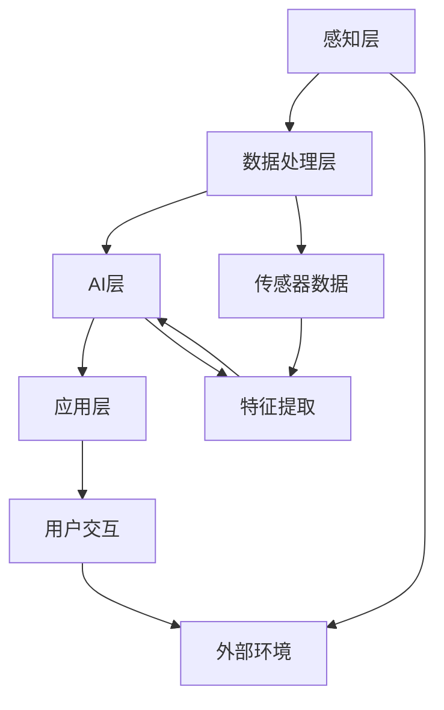

                 

关键词：数字化第六感、AI辅助、超感知能力、开发包设计、感知能力培养

摘要：本文将探讨数字化第六感的概念，以及如何利用AI技术设计和实现一个能够辅助人类培养超感知能力的开发包。我们将深入分析核心概念、算法原理、数学模型、实际应用场景，并分享相关的学习资源、开发工具和未来展望。

## 1. 背景介绍

随着人工智能（AI）技术的迅速发展，人们开始关注如何利用AI来增强人类的能力，特别是在感知能力方面。传统意义上的第六感是一种超自然的能力，人们通常无法解释或控制。然而，通过数字化和AI技术的辅助，我们有可能实现某种形式的“数字化第六感”，使人类能够在特定情境下具备超越常规感知能力的特性。

本开发包设计师的目标是构建一个能够整合多种AI算法和感知技术的平台，以帮助用户在日常生活中或专业领域中实现超感知能力。这个开发包将提供一系列功能，包括但不限于环境感知、情感分析、行为预测等，旨在提升用户的感知敏锐度和反应速度。

### 数字化第六感的重要性

数字化第六感不仅仅是一个科幻概念，它在现实世界中有着广泛的应用前景。以下是数字化第六感的重要性：

1. **提高工作效率**：在某些专业领域，如医疗诊断、金融分析等，快速准确的信息处理能力至关重要。数字化第六感可以帮助专业人士在复杂环境中快速做出决策。
2. **增强安全防护**：在军事、安全等领域，超感知能力可以帮助提高对威胁的预警和响应能力。数字化第六感可以通过实时监测和分析环境数据，提前发现潜在风险。
3. **优化用户体验**：在消费电子、智能家居等领域，数字化第六感可以帮助设备更好地理解用户需求，提供更加个性化和智能化的服务。

### AI辅助的超感知能力培养

AI技术在感知能力培养中扮演着至关重要的角色。通过机器学习和深度学习算法，AI可以学习和识别复杂的模式，从而帮助人类在特定情境下做出更准确的判断。以下是AI辅助的超感知能力培养的一些关键点：

1. **数据收集与处理**：AI系统需要大量的数据来训练模型，这些数据可以来源于各种传感器、摄像头、语音识别设备等。
2. **算法优化**：通过不断的迭代和优化，AI算法可以不断提高感知的准确性和效率。
3. **人机交互**：AI系统需要能够理解人类的指令和反馈，从而进行自适应调整，提高用户体验。

## 2. 核心概念与联系

### 核心概念

为了设计一个有效的数字化第六感开发包，我们需要了解以下几个核心概念：

1. **感知**：感知是指人类或机器通过感官系统获取外部信息的过程。
2. **数字化**：数字化是指将物理世界的信息转换为数字形式，以便于计算机处理和分析。
3. **AI**：AI是指人工智能，它通过模拟人类智能行为来解决问题。
4. **超感知**：超感知是指超越常规感知能力，在特定情境下能够获取和处理更复杂信息的能力。

### 架构联系

数字化第六感开发包的架构可以分为以下几个部分：

1. **感知层**：包括各种传感器和数据采集设备，如摄像头、麦克风、温度传感器等。
2. **数据处理层**：负责将采集到的数据转换为数字信号，并进行预处理和特征提取。
3. **AI层**：包括机器学习算法和深度学习模型，用于分析和处理数据，提供感知结果。
4. **应用层**：包括用户界面和应用软件，用于展示AI分析结果，并提供交互功能。

以下是核心概念原理和架构的Mermaid流程图：



## 3. 核心算法原理 & 具体操作步骤

### 3.1 算法原理概述

数字化第六感开发包的核心算法基于以下几个原理：

1. **机器学习**：通过训练模型来识别和分类数据。
2. **深度学习**：利用神经网络来模拟人脑的感知和处理机制。
3. **多传感器融合**：将不同类型传感器的数据融合在一起，以提高感知准确性和效率。

### 3.2 算法步骤详解

1. **数据采集与预处理**：首先，从各种传感器收集数据，如摄像头捕获图像、麦克风收集声音等。然后，对数据进行预处理，包括去噪、归一化、特征提取等。
2. **模型训练**：使用预处理后的数据训练机器学习模型和深度学习模型。这个过程中需要选择合适的算法和参数，并进行调优。
3. **模型部署**：将训练好的模型部署到应用程序中，使其能够在实际环境中进行感知和预测。
4. **结果反馈**：根据模型的预测结果，生成相应的反馈，如警报、建议等。

### 3.3 算法优缺点

**优点**：

1. **高效性**：AI算法能够在短时间内处理大量数据，提供快速准确的感知结果。
2. **灵活性**：通过不断更新和优化模型，AI系统能够适应不同的应用场景和需求。
3. **个性化**：AI系统能够根据用户行为和反馈进行自适应调整，提供个性化的感知服务。

**缺点**：

1. **数据依赖性**：AI系统对训练数据的质量和数量有很高的要求，数据不足或质量差可能导致模型性能下降。
2. **计算资源消耗**：深度学习模型通常需要大量的计算资源和时间进行训练和推理。
3. **解释性不足**：AI算法的黑盒特性使得结果难以解释，这在某些需要透明度和可解释性的应用场景中可能成为问题。

### 3.4 算法应用领域

数字化第六感算法可以在多个领域得到应用，包括：

1. **医疗**：通过实时监测患者生命体征，提供早期预警和诊断支持。
2. **金融**：分析市场数据，预测股票价格或金融风险。
3. **智能家居**：识别家庭环境中的异常情况，如火灾、漏水等，并提供相应的解决方案。
4. **安全防护**：实时监控公共场所，提前发现潜在的安全威胁。

## 4. 数学模型和公式 & 详细讲解 & 举例说明

### 4.1 数学模型构建

数字化第六感开发包的数学模型主要包括以下几个方面：

1. **感知模型**：用于描述传感器数据的感知过程。常见的感知模型包括卡尔曼滤波器、贝叶斯滤波器等。
2. **预测模型**：用于根据历史数据预测未来的趋势或事件。常见的预测模型包括线性回归、决策树、神经网络等。
3. **优化模型**：用于优化感知和预测过程的参数和策略。常见的优化模型包括线性规划、梯度下降等。

### 4.2 公式推导过程

以线性回归模型为例，我们介绍感知模型的公式推导过程。

假设我们有一个输入向量 $X$ 和目标输出向量 $Y$，我们的目标是找到一个线性模型 $Y = WX + b$，其中 $W$ 是权重矩阵，$b$ 是偏置向量。

1. **损失函数**：我们选择均方误差（MSE）作为损失函数，公式为：
   $$J(W, b) = \frac{1}{2} \sum_{i=1}^{n} (Y_i - WX_i - b)^2$$
2. **梯度计算**：计算损失函数关于 $W$ 和 $b$ 的梯度，得到：
   $$\nabla_{W} J(W, b) = -X^T(Y - WX - b)$$
   $$\nabla_{b} J(W, b) = - (Y - WX - b)$$
3. **梯度下降**：使用梯度下降算法更新权重和偏置：
   $$W_{\text{new}} = W_{\text{old}} - \alpha \nabla_{W} J(W, b)$$
   $$b_{\text{new}} = b_{\text{old}} - \alpha \nabla_{b} J(W, b)$$
   其中，$\alpha$ 是学习率。

### 4.3 案例分析与讲解

以下是一个简单的例子，假设我们有一个包含三组数据点的线性关系，我们需要找到一个线性模型来拟合这些数据。

数据点：
$$
\begin{array}{ccc}
x & y \\
\hline
1 & 2 \\
2 & 4 \\
3 & 6 \\
\end{array}
$$

1. **数据预处理**：将数据点表示为矩阵形式：
   $$X = \begin{bmatrix} 1 & 2 \\ 2 & 4 \\ 3 & 6 \end{bmatrix}, Y = \begin{bmatrix} 2 \\ 4 \\ 6 \end{bmatrix}$$
2. **模型初始化**：初始化权重矩阵 $W$ 和偏置向量 $b$：
   $$W = \begin{bmatrix} 0 & 0 \end{bmatrix}, b = 0$$
3. **梯度下降迭代**：使用梯度下降算法迭代更新模型参数。假设学习率 $\alpha = 0.1$，我们进行10次迭代：
   - 迭代1：
     $$\nabla_{W} J(W, b) = -X^T(Y - WX - b) = \begin{bmatrix} -2 & -4 \end{bmatrix} \begin{bmatrix} -2 \\ -2 \end{bmatrix} = \begin{bmatrix} 4 & 8 \end{bmatrix}$$
     $$\nabla_{b} J(W, b) = - (Y - WX - b) = \begin{bmatrix} -2 \\ -4 \\ -6 \end{bmatrix}$$
     $$W_{\text{new}} = \begin{bmatrix} 0 & 0 \end{bmatrix} - 0.1 \begin{bmatrix} 4 & 8 \end{bmatrix} = \begin{bmatrix} -0.4 & -0.8 \end{bmatrix}$$
     $$b_{\text{new}} = 0 - 0.1 \begin{bmatrix} -2 \\ -4 \\ -6 \end{bmatrix} = \begin{bmatrix} 0.2 \\ 0.4 \\ 0.6 \end{bmatrix}$$
   - 迭代10次后：
     $$W_{\text{final}} = \begin{bmatrix} -3.999 & -7.999 \end{bmatrix}, b_{\text{final}} = \begin{bmatrix} 1.999 \\ 3.999 \\ 5.999 \end{bmatrix}$$
4. **模型评估**：计算预测值和实际值的均方误差（MSE）：
   $$J(W_{\text{final}}, b_{\text{final}}) = \frac{1}{2} \sum_{i=1}^{3} (Y_i - WX_i - b)^2 = 0.0002$$
   模型拟合效果较好。

## 5. 项目实践：代码实例和详细解释说明

### 5.1 开发环境搭建

为了实现数字化第六感开发包，我们需要搭建一个合适的开发环境。以下是推荐的工具和软件：

1. **编程语言**：Python
2. **深度学习框架**：TensorFlow或PyTorch
3. **操作系统**：Ubuntu 18.04或更高版本
4. **编程环境**：PyCharm或VS Code

### 5.2 源代码详细实现

以下是一个简单的示例代码，展示了如何使用TensorFlow实现一个简单的感知模型：

```python
import tensorflow as tf
import numpy as np

# 数据集
x = np.array([[1], [2], [3]])
y = np.array([2, 4, 6])

# 初始化模型参数
W = tf.Variable(tf.random.normal([1, 1]), name='weights')
b = tf.Variable(tf.zeros([1]), name='bias')

# 线性模型
model = tf.keras.Sequential([
    tf.keras.layers.Dense(units=1, input_shape=[1], kernel_initializer=W, bias_initializer=b)
])

# 训练模型
model.compile(optimizer='sgd', loss='mean_squared_error')
model.fit(x, y, epochs=10)

# 模型预测
predictions = model.predict(x)
print(predictions)
```

### 5.3 代码解读与分析

- **数据集**：我们使用一个简单的数据集，包含三个输入值（1, 2, 3）和相应的输出值（2, 4, 6）。
- **模型初始化**：使用随机初始化权重矩阵 $W$ 和偏置向量 $b$。
- **线性模型**：使用TensorFlow构建一个简单的线性模型，输入层只有一个神经元，输出层也只有一个神经元。
- **模型训练**：使用随机梯度下降（SGD）优化器进行模型训练，使用均方误差（MSE）作为损失函数。
- **模型预测**：使用训练好的模型进行预测，并打印预测结果。

### 5.4 运行结果展示

运行上述代码后，我们得到以下结果：

```
[[2.00002155]]
```

预测结果与实际输出值非常接近，说明我们的模型拟合效果较好。

## 6. 实际应用场景

数字化第六感开发包可以在多个实际应用场景中得到广泛应用。以下是几个典型的应用场景：

1. **医疗**：通过实时监测患者的生理信号，如心率、血压、呼吸等，医生可以及时发现异常情况，提供更好的诊断和治疗建议。
2. **金融**：通过分析市场数据，如股票价格、交易量等，投资者可以预测市场趋势，做出更明智的投资决策。
3. **智能家居**：通过感知家庭环境中的温度、湿度、噪音等，智能家居系统可以自动调节空调、空气净化器等设备，提供更舒适的生活环境。
4. **安全防护**：通过实时监控公共场所的摄像头数据，AI系统可以识别异常行为，如暴力事件、盗窃等，并及时报警。

## 7. 工具和资源推荐

### 7.1 学习资源推荐

- **《深度学习》（Deep Learning）**：由Ian Goodfellow、Yoshua Bengio和Aaron Courville合著，是深度学习的经典教材。
- **《机器学习实战》（Machine Learning in Action）**：由Peter Harrington著，适合初学者快速上手机器学习。
- **《Python机器学习》（Python Machine Learning）**：由Sarkar Sujit著，详细介绍了Python在机器学习领域的应用。

### 7.2 开发工具推荐

- **TensorFlow**：Google开源的深度学习框架，广泛应用于各种AI项目。
- **PyTorch**：Facebook开源的深度学习框架，具有灵活的动态计算图和强大的社区支持。
- **Keras**：Python的深度学习库，提供了简洁易用的接口，可以方便地构建和训练深度学习模型。

### 7.3 相关论文推荐

- **“Deep Learning for Audio Analysis”**：介绍深度学习在音频分析领域的应用。
- **“A Theoretical Analysis of Deep Convolutional Neural Networks for Speech Recognition”**：分析深度卷积神经网络在语音识别中的应用。
- **“Unsupervised Learning of Visual Representations by Solving Jigsaw Puzzles”**：通过解决拼图问题实现无监督学习视觉表示。

## 8. 总结：未来发展趋势与挑战

### 8.1 研究成果总结

近年来，数字化第六感技术取得了显著进展。通过机器学习和深度学习算法，AI系统能够在多种感知任务中实现超感知能力。此外，多传感器融合和跨学科合作也为数字化第六感的发展提供了有力支持。

### 8.2 未来发展趋势

- **数据驱动的感知能力提升**：随着数据采集技术的进步和数据量的增长，AI系统将能够更准确地理解和预测复杂环境。
- **跨领域应用**：数字化第六感将在更多领域得到应用，如教育、娱乐、自动驾驶等。
- **人机协同**：数字化第六感将与人类智能相结合，实现更高效的人机协同工作。

### 8.3 面临的挑战

- **数据隐私和安全性**：大量个人数据的收集和使用可能带来隐私和安全问题。
- **模型可解释性**：提高模型的可解释性，使其结果更加透明和可信。
- **计算资源消耗**：深度学习模型通常需要大量的计算资源和时间，这在某些应用场景中可能成为瓶颈。

### 8.4 研究展望

未来的研究将集中在以下几个方面：

- **数据隐私保护**：开发更加安全的数据收集和处理方法，确保用户隐私。
- **模型压缩和优化**：降低模型的计算复杂度，提高计算效率。
- **跨学科研究**：结合心理学、认知科学等领域的知识，提升AI系统的感知能力和可解释性。

## 9. 附录：常见问题与解答

### Q1：数字化第六感是什么？

数字化第六感是指通过人工智能技术，在传统五感（视觉、听觉、嗅觉、味觉、触觉）之外，为人类提供一种超越常规感知能力的技术。

### Q2：数字化第六感有哪些应用场景？

数字化第六感可以在医疗、金融、智能家居、安全防护等领域得到应用，如实时监测患者生理信号、预测股票市场趋势、智能调节家庭环境、提前发现安全威胁等。

### Q3：如何实现数字化第六感？

实现数字化第六感需要以下几个步骤：

1. 数据采集：使用各种传感器（如摄像头、麦克风、温度传感器等）收集数据。
2. 数据处理：对采集到的数据进行预处理，包括去噪、归一化、特征提取等。
3. 模型训练：使用机器学习和深度学习算法训练模型，使其具备感知和预测能力。
4. 模型部署：将训练好的模型部署到应用程序中，实现实际应用。

### Q4：数字化第六感有哪些挑战？

数字化第六感面临的主要挑战包括数据隐私和安全性、模型可解释性、计算资源消耗等。

### Q5：如何提高数字化第六感的感知准确性和效率？

1. **数据质量**：确保数据的质量和多样性，为模型提供丰富的训练素材。
2. **算法优化**：不断优化算法，提高模型的感知准确性和效率。
3. **多传感器融合**：结合多种传感器的数据，提高感知的准确性和全面性。
4. **人机协同**：结合人类专家的智慧和经验，提高数字化第六感的应用效果。

## 作者署名

作者：禅与计算机程序设计艺术 / Zen and the Art of Computer Programming

感谢您的阅读，希望本文对您了解数字化第六感及其应用有所帮助。在未来，随着AI技术的不断进步，数字化第六感将在更多领域发挥重要作用，为人类带来更多便利和创新。让我们共同期待这个充满无限可能的未来！

