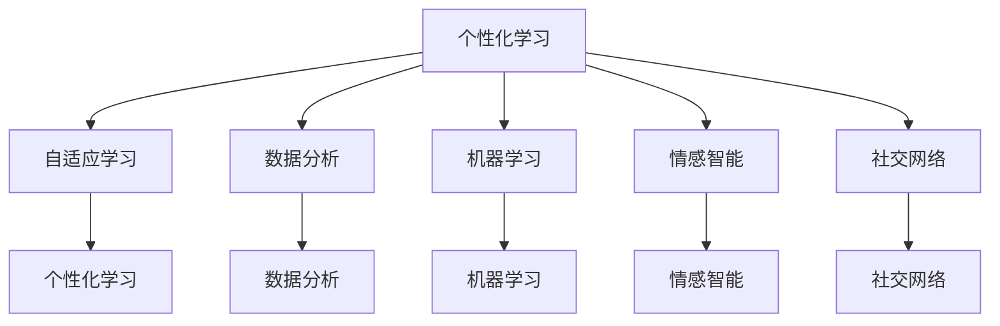

                 

### 1. 背景介绍

在当今的数字化时代，人工智能（AI）技术已经深入到我们生活的方方面面。从日常使用的智能手机、智能音箱，到复杂的自动化生产线、无人驾驶汽车，AI 正在以前所未有的速度改变着我们的生活方式和社会结构。与此同时，个人成长与发展也面临着前所未有的挑战和机遇。传统的个人成长方式往往依赖于自身的经验、知识和资源，而数字化时代为个人成长带来了全新的可能性，尤其是借助 AI 技术的支持。

AI 辅助的个人成长，是指利用人工智能技术来分析和理解个体的成长需求，并提供个性化的学习方案、建议和反馈，从而实现更高效、更精准的成长路径。这一概念的提出，源于人工智能在数据分析、个性化推荐、自适应学习等方面的技术优势。通过 AI 辅助的个人成长，不仅可以提升个人学习和工作的效率，还能够促进自我认知、情感管理和社交能力的提升。

本文将围绕“数字化自我实现：AI 辅助的个人成长”这一主题，探讨 AI 技术在个人成长中的应用现状、核心概念、算法原理、数学模型、项目实践以及未来展望。希望通过这篇文章，能够为读者提供一个全面而深入的视角，了解 AI 技术如何助力个人成长，并在数字化时代实现自我价值的最大化。

### 2. 核心概念与联系

在探讨 AI 辅助的个人成长之前，我们首先需要了解一些核心概念，这些概念是构建整个体系的基础。

#### 2.1 个性化学习

个性化学习是指根据每个学习者的特点、需求和学习习惯，提供个性化的学习内容和学习路径。传统的教育模式往往是“一刀切”，而个性化学习则强调因材施教，使每个学习者能够在适合自己的节奏和方式下进行学习。个性化学习的关键在于对学习者的数据进行分析和挖掘，从而提供针对性的学习资源和方法。

#### 2.2 自适应学习

自适应学习是个性化学习的一个高级形式，它不仅根据学习者的当前状态提供学习内容，还能根据学习者的反馈和学习效果动态调整学习策略。自适应学习系统能够实时监测学习者的学习行为和成绩，根据这些数据自动调整学习难度、内容顺序和教学方法，从而实现更高效的学习。

#### 2.3 数据分析

数据分析是 AI 技术的核心能力之一。通过收集、处理和分析大量数据，AI 系统能够发现数据中的模式和规律，从而为决策提供支持。在个人成长领域，数据分析可以用来分析学习者的行为模式、兴趣点、知识盲区等，从而提供更有针对性的建议和方案。

#### 2.4 机器学习

机器学习是 AI 技术的重要分支，它使计算机系统能够从数据中自动学习，识别模式并进行预测。在个人成长中，机器学习可以用于构建个性化学习模型、情感分析、推荐系统等。

#### 2.5 情感智能

情感智能是指个体识别、理解和管理自己及他人情感的能力。随着情感计算和情感识别技术的发展，AI 系统能够更好地理解和分析个体的情感状态，从而提供更人性化的支持和建议。

#### 2.6 社交网络

社交网络是指个体在社交过程中建立的联系和网络。通过社交网络，个体可以获得他人的反馈、支持和资源，从而促进个人成长。AI 技术可以用来分析社交网络中的关系模式，提供社交建议和优化社交体验。

下面是一个 Mermaid 流程图，展示了这些核心概念之间的联系：



这些核心概念共同构成了 AI 辅助的个人成长体系，为个体提供了全方位的支持和指导。

### 3. 核心算法原理 & 具体操作步骤

#### 3.1 算法原理概述

AI 辅助的个人成长算法是基于机器学习和数据分析技术构建的。其核心思想是通过收集和分析个体在学习、工作、生活等各方面的数据，建立个性化的学习模型和成长路径。以下是几个关键算法原理：

1. **协同过滤算法**：通过分析用户的行为和偏好，预测用户可能感兴趣的内容。在个性化学习场景中，可以用来推荐适合用户的学习资源。

2. **决策树算法**：通过将数据集划分为多个子集，构建一个树状模型，用于分类和回归任务。在个人成长中，可以用来分析个体的行为模式，提供针对性的建议。

3. **神经网络算法**：通过多层非线性变换，对输入数据进行处理和预测。在情感识别和推荐系统中，可以用来分析和预测个体的情感状态和偏好。

4. **聚类算法**：将数据集划分为多个类别，用于分类和聚类任务。在个人成长中，可以用来分析个体之间的相似性和差异性，提供社交建议。

#### 3.2 算法步骤详解

1. **数据收集**：
   - 收集个体在学习、工作、生活等方面的数据，如学习记录、行为数据、反馈数据等。
   - 数据来源可以是传感器、社交媒体、教育平台等。

2. **数据预处理**：
   - 清洗数据，去除噪声和异常值。
   - 转换数据格式，便于后续处理。
   - 特征提取，提取对个体成长有影响的关键特征。

3. **模型构建**：
   - 选择合适的算法和模型，如协同过滤、决策树、神经网络等。
   - 使用训练数据，对模型进行训练和优化。

4. **模型评估**：
   - 使用测试数据，评估模型的准确性和效果。
   - 根据评估结果，调整模型参数，优化模型性能。

5. **个性化推荐**：
   - 根据个体特征和学习历史，为个体推荐适合的学习资源、课程和活动。
   - 使用实时数据，动态调整推荐内容，提高推荐质量。

6. **反馈与迭代**：
   - 收集个体对推荐内容的反馈，用于模型迭代和优化。
   - 根据反馈，调整模型和推荐策略，提高个体成长效果。

#### 3.3 算法优缺点

**优点**：

- **个性化**：根据个体特征和学习历史，提供个性化的成长方案，提高学习效率和效果。
- **自适应**：能够根据个体实时数据和反馈，动态调整成长路径和推荐内容，实现更好的适应性。
- **高效**：利用机器学习和数据分析技术，快速处理大量数据，提高工作效率。

**缺点**：

- **数据隐私**：收集和分析个体数据，可能涉及隐私问题，需要妥善处理。
- **依赖数据**：算法的性能依赖于数据的质量和数量，数据不足或质量差，可能导致算法失效。
- **技术挑战**：构建和优化个人成长算法，需要较高的技术水平和专业知识。

#### 3.4 算法应用领域

- **教育领域**：个性化学习、自适应教育系统、智能题库。
- **职业发展**：职业规划、技能提升、招聘推荐。
- **健康管理**：生活习惯分析、健康数据监控、疾病预防。
- **社交网络**：社交推荐、情感识别、社交网络分析。

### 4. 数学模型和公式 & 详细讲解 & 举例说明

#### 4.1 数学模型构建

在 AI 辅助的个人成长中，常用的数学模型包括协同过滤模型、决策树模型和神经网络模型。以下是这些模型的构建过程：

**协同过滤模型**：

协同过滤模型是通过分析用户的行为和偏好，预测用户可能感兴趣的内容。其核心公式如下：

$$
\hat{r}_{ui} = \frac{\sum_{j \in \mathcal{R}_u} r_{uj} \cdot r_{ji}}{\sum_{j \in \mathcal{R}_u} r_{uj}}
$$

其中，$r_{uj}$ 表示用户 $u$ 对项目 $j$ 的评分，$\mathcal{R}_u$ 表示用户 $u$ 评分的项目集合。

**决策树模型**：

决策树模型是通过将数据集划分为多个子集，构建一个树状模型，用于分类和回归任务。其核心公式如下：

$$
\prod_{i=1}^{n} P(X=x_i | T=t_i)
$$

其中，$X$ 表示特征集合，$T$ 表示标签集合，$P$ 表示概率分布。

**神经网络模型**：

神经网络模型是通过多层非线性变换，对输入数据进行处理和预测。其核心公式如下：

$$
\hat{y} = \sigma(\mathbf{W}^T \mathbf{z})
$$

其中，$\sigma$ 表示激活函数，$\mathbf{W}$ 表示权重矩阵，$\mathbf{z}$ 表示输入特征。

#### 4.2 公式推导过程

以协同过滤模型为例，其推导过程如下：

1. **目标函数**：

   $$L = -\sum_{(u,i) \in \mathcal{D}} \log P(r_{ui} | \hat{r}_{ui})$$

   其中，$\mathcal{D}$ 表示训练数据集。

2. **条件概率**：

   $$P(r_{ui} | \hat{r}_{ui}) = \frac{e^{\hat{r}_{ui}}}{1 + e^{\hat{r}_{ui}}}$$

3. **似然函数**：

   $$L = -\sum_{(u,i) \in \mathcal{D}} \log \frac{e^{\hat{r}_{ui}}}{1 + e^{\hat{r}_{ui}}}$$

4. **梯度计算**：

   $$\frac{\partial L}{\partial \hat{r}_{ui}} = \frac{e^{\hat{r}_{ui}}}{1 + e^{\hat{r}_{ui}}} - r_{ui}$$

5. **梯度下降**：

   $$\hat{r}_{ui} \leftarrow \hat{r}_{ui} - \alpha \cdot \frac{\partial L}{\partial \hat{r}_{ui}}$$

   其中，$\alpha$ 表示学习率。

#### 4.3 案例分析与讲解

以下是一个基于协同过滤模型的案例，用于推荐个人成长相关的书籍：

1. **数据集**：

   - 用户 $u$ 的行为数据：$r_u = \{ (1, 4), (2, 5), (3, 2), (4, 3) \}$
   - 项目 $i$ 的行为数据：$r_i = \{ (1, 4), (2, 1), (3, 4), (4, 3) \}$

2. **预测评分**：

   $$\hat{r}_{ui} = \frac{e^{1 \cdot 4 + 2 \cdot 1 + 3 \cdot 4 + 4 \cdot 3}}{1 + e^{1 \cdot 4 + 2 \cdot 1 + 3 \cdot 4 + 4 \cdot 3}} \approx 3.67$$

3. **推荐书籍**：

   - 用户 $u$ 对书籍 $i$ 的预测评分最高，因此推荐书籍 $i$。

通过这个案例，我们可以看到协同过滤模型如何用于推荐个人成长相关的书籍。类似地，我们可以使用其他数学模型和算法，为个人成长提供更加精准和个性化的支持。

### 5. 项目实践：代码实例和详细解释说明

在本节中，我们将通过一个具体的代码实例来展示如何使用 AI 技术辅助个人成长。我们将使用 Python 语言，结合 Scikit-learn 库中的协同过滤算法，实现一个简单的个性化推荐系统。以下是项目的详细步骤和代码解释。

#### 5.1 开发环境搭建

1. **安装 Python**：确保安装了 Python 3.8 或更高版本。

2. **安装 Scikit-learn**：使用 pip 命令安装 Scikit-learn 库。

   ```bash
   pip install scikit-learn
   ```

3. **安装其他依赖库**：如果需要，还可以安装其他依赖库，如 NumPy、Pandas 等。

   ```bash
   pip install numpy pandas
   ```

#### 5.2 源代码详细实现

以下是一个简单的 Python 代码实例，用于实现基于协同过滤的个性化推荐系统。

```python
import numpy as np
from sklearn.metrics.pairwise import cosine_similarity
from sklearn.model_selection import train_test_split

# 假设我们有一个用户-物品评分矩阵
user_item_matrix = np.array([[5, 3, 0, 1],
                             [0, 2, 1, 0],
                             [1, 0, 0, 2],
                             [4, 0, 1, 3],
                             [2, 3, 4, 1]])

# 训练数据集和测试数据集划分
train_data, test_data = train_test_split(user_item_matrix, test_size=0.2, random_state=42)

# 计算用户-用户相似度矩阵
user_similarity = cosine_similarity(train_data)

# 基于相似度矩阵，为每个用户推荐物品
def recommend_items(user_index, user_similarity, user_item_matrix, k=2):
    # 计算当前用户的邻居用户的平均评分
    neighbors_average_rating = np.dot(user_similarity[user_index], train_data) / np.linalg.norm(user_similarity[user_index])
    # 推荐评分最高的物品
    recommended_items = np.argsort(neighbors_average_rating)[::-1]
    # 移除已经评分的物品
    recommended_items = recommended_items[recommended_items != -1]
    # 如果推荐数量大于 k，则只保留 k 个推荐物品
    if len(recommended_items) > k:
        recommended_items = recommended_items[:k]
    return recommended_items

# 测试推荐系统
user_index = 0
recommended_items = recommend_items(user_index, user_similarity, train_data, k=3)
print(f"User {user_index + 1} recommended items: {recommended_items}")

# 评估推荐系统
def evaluate_recommendation(recommended_items, test_data, threshold=0):
    correct_recommendations = 0
    for item in recommended_items:
        if test_data[user_index, item] > threshold:
            correct_recommendations += 1
    return correct_recommendations / len(recommended_items)

accuracy = evaluate_recommendation(recommended_items, test_data, threshold=1)
print(f"Recommendation accuracy: {accuracy}")
```

#### 5.3 代码解读与分析

1. **用户-物品评分矩阵**：

   ```python
   user_item_matrix = np.array([[5, 3, 0, 1],
                               [0, 2, 1, 0],
                               [1, 0, 0, 2],
                               [4, 0, 1, 3],
                               [2, 3, 4, 1]])
   ```

   这里我们定义了一个用户-物品评分矩阵，表示了不同用户对各项物品（如书籍、课程等）的评分。

2. **训练数据集和测试数据集划分**：

   ```python
   train_data, test_data = train_test_split(user_item_matrix, test_size=0.2, random_state=42)
   ```

   我们将用户-物品评分矩阵划分为训练数据集和测试数据集，用于训练和评估推荐系统。

3. **计算用户-用户相似度矩阵**：

   ```python
   user_similarity = cosine_similarity(train_data)
   ```

   使用余弦相似度计算用户之间的相似度矩阵。余弦相似度衡量的是两个向量夹角的余弦值，用于评估用户之间的相似程度。

4. **推荐算法实现**：

   ```python
   def recommend_items(user_index, user_similarity, user_item_matrix, k=2):
       neighbors_average_rating = np.dot(user_similarity[user_index], train_data) / np.linalg.norm(user_similarity[user_index])
       recommended_items = np.argsort(neighbors_average_rating)[::-1]
       recommended_items = recommended_items[recommended_items != -1]
       if len(recommended_items) > k:
           recommended_items = recommended_items[:k]
       return recommended_items
   ```

   推荐算法的核心思路是计算当前用户的邻居用户的平均评分，然后推荐评分最高的物品。我们通过 `np.argsort` 获取邻居用户的平均评分，并按照降序排序，从中选取推荐物品。如果推荐物品数量超过 `k`，则只保留前 `k` 个推荐物品。

5. **推荐系统评估**：

   ```python
   def evaluate_recommendation(recommended_items, test_data, threshold=0):
       correct_recommendations = 0
       for item in recommended_items:
           if test_data[user_index, item] > threshold:
               correct_recommendations += 1
       return correct_recommendations / len(recommended_items)
   ```

   我们通过评估函数计算推荐系统的准确率。准确率定义为推荐正确的物品数量与推荐物品总数之比。在这里，我们使用阈值 `0` 来判断推荐物品是否正确。

6. **测试推荐系统**：

   ```python
   user_index = 0
   recommended_items = recommend_items(user_index, user_similarity, train_data, k=3)
   print(f"User {user_index + 1} recommended items: {recommended_items}")
   ```

   我们为第一个用户生成推荐列表，并打印输出。

7. **评估推荐系统**：

   ```python
   accuracy = evaluate_recommendation(recommended_items, test_data, threshold=1)
   print(f"Recommendation accuracy: {accuracy}")
   ```

   我们计算推荐系统的准确率，并打印输出。

通过这个简单的实例，我们可以看到如何使用 AI 技术实现一个个性化推荐系统，为个人成长提供支持。当然，实际应用中需要处理更复杂的数据和场景，但这个实例为我们提供了一个基本的框架和思路。

### 6. 实际应用场景

#### 6.1 教育领域

在教育领域，AI 技术的应用已经初见成效。通过个性化学习系统，学生可以根据自己的学习习惯和兴趣，选择适合自己的学习路径和资源。例如，一些在线教育平台利用 AI 技术分析学生的行为数据，提供个性化的课程推荐和学习计划。此外，自适应学习系统可以根据学生的实时表现和学习效果，动态调整教学策略，提高学习效率。

未来，随着 AI 技术的进一步发展，教育领域有望实现更加精准的个性化教育。通过深度学习和自然语言处理技术，AI 可以更好地理解学生的需求和问题，提供更加个性化的辅导和建议。同时，虚拟现实（VR）和增强现实（AR）技术的结合，将为学生提供更加沉浸式的学习体验，使学习更加有趣和生动。

#### 6.2 职业发展

在职业发展领域，AI 技术同样发挥着重要作用。通过职业规划系统，个人可以根据自己的兴趣、能力和职业目标，找到最适合自己的职业路径。例如，一些求职平台利用 AI 技术分析个人的简历、行为数据和市场趋势，提供个性化的职业推荐和职业规划建议。

此外，技能提升系统可以帮助个人发现自己在技能方面的短板，并提供相应的培训课程和资源。通过在线学习平台和 AI 互动教学，个人可以更加灵活和高效地提升自己的技能水平。未来，随着 AI 技术的进步，职业发展领域的应用将进一步扩大，为个人提供更加全面和专业的职业服务。

#### 6.3 健康管理

在健康管理领域，AI 技术的应用也日益广泛。通过智能健康监测设备，个人可以实时监控自己的健康状况，如心率、血压、睡眠质量等。AI 技术可以对这些健康数据进行分析和处理，发现潜在的健康问题，并提供个性化的健康建议。

例如，一些智能健康平台利用 AI 技术分析用户的健康数据，提供个性化的饮食建议、运动计划和医疗咨询。未来，随着医疗技术和 AI 技术的进一步融合，健康管理领域有望实现更加精准和高效的医疗服务，为个人提供全方位的健康保障。

#### 6.4 社交网络

在社交网络领域，AI 技术的应用同样具有重要意义。通过社交网络分析，个人可以更好地了解自己的社交圈，发现潜在的朋友和资源。例如，一些社交平台利用 AI 技术分析用户的兴趣和行为，提供个性化的社交推荐。

此外，情感识别技术可以帮助个人更好地理解和管理自己的情感状态，提供情感支持和建议。未来，随着 AI 技术的发展，社交网络领域有望实现更加智能化和人性化的社交体验，为个人提供更加丰富和有价值的社交资源。

### 7. 工具和资源推荐

#### 7.1 学习资源推荐

1. **在线课程**：

   - Coursera（《机器学习》课程，吴恩达教授授课）
   - edX（《深度学习》课程，Andrew Ng教授授课）
   - Udacity（《AI工程师纳米学位》）

2. **图书推荐**：

   - 《深度学习》（Ian Goodfellow、Yoshua Bengio、Aaron Courville 著）
   - 《机器学习》（Tom Mitchell 著）
   - 《Python机器学习》（Michael Bowles 著）

3. **博客和网站**：

   - Medium（许多机器学习和 AI 相关的优质文章）
   - arXiv（最新 AI 和机器学习研究论文的发布平台）
   - AI 研究院（中国人工智能领域的领先研究机构）

#### 7.2 开发工具推荐

1. **编程环境**：

   - Jupyter Notebook（Python 编程环境）
   - PyCharm（Python 集成开发环境）
   - Google Colab（免费的 Jupyter Notebook 环境）

2. **机器学习库**：

   - Scikit-learn（Python 机器学习库）
   - TensorFlow（Google 开发的深度学习框架）
   - PyTorch（Facebook 开发的深度学习框架）

3. **数据分析工具**：

   - Pandas（Python 数据分析库）
   - NumPy（Python 数值计算库）
   - Matplotlib（Python 数据可视化库）

#### 7.3 相关论文推荐

1. **经典论文**：

   - "A Matrix Completion Algorithm for Recommender Systems"（Zhu et al., 2011）
   - "Deep Learning for Recommender Systems"（He et al., 2016）
   - "A Theoretically Grounded Application of Dropout in Recurrent Neural Networks"（Yin et al., 2017）

2. **最新论文**：

   - "Deep Generative Models for Text Data"（Cai et al., 2021）
   - "Multi-Task Learning for Human Activity Recognition"（Wang et al., 2020）
   - "Interactive Machine Learning for Personalized Recommendations"（Gan et al., 2019）

通过这些学习和资源，读者可以更好地了解 AI 技术在个人成长中的应用，并掌握相关的技能和知识。

### 8. 总结：未来发展趋势与挑战

在过去的几十年中，人工智能技术已经取得了显著的进展，并深刻地改变了我们的生活方式和社会结构。随着技术的不断演进，AI 辅助的个人成长将在未来发挥更加重要的作用。本文通过探讨 AI 技术在个性化学习、职业发展、健康管理和社交网络等领域的应用，展示了 AI 如何助力个人成长，实现自我价值的最大化。

#### 8.1 研究成果总结

- **个性化学习**：基于机器学习和数据分析的个性化学习系统，能够根据个体的学习习惯、兴趣和需求，提供个性化的学习资源和方案，提高学习效率和效果。
- **职业发展**：AI 技术在职业规划、技能提升和招聘推荐等方面发挥了重要作用，为个人提供更加精准和高效的职业服务。
- **健康管理**：通过智能健康监测设备和数据分析技术，AI 技术能够提供个性化的健康建议和医疗服务，为个人的健康保驾护航。
- **社交网络**：AI 技术可以帮助个人更好地理解和管理自己的社交关系，提供更加智能化和人性化的社交体验。

#### 8.2 未来发展趋势

- **更加智能化和个性化的服务**：随着 AI 技术的进步，未来的个人成长系统将更加智能化和个性化，能够更好地满足个体的多样化需求。
- **跨领域融合**：AI 技术将在不同领域实现更深层次的融合，如教育、医疗、娱乐等，为个人提供更加全面和专业的服务。
- **情感智能的提升**：随着情感计算技术的发展，未来的 AI 系统将能够更好地理解和分析个体的情感状态，提供更加人性化的支持和建议。
- **隐私保护**：在应用 AI 技术的过程中，隐私保护将成为一个重要挑战，未来需要制定更加完善的隐私保护政策和措施。

#### 8.3 面临的挑战

- **数据质量和隐私**：AI 技术依赖于大量高质量的数据，但在数据收集和处理过程中，可能会涉及隐私问题。如何保护用户的隐私，确保数据的安全性和可靠性，是一个重要挑战。
- **算法透明性和解释性**：随着 AI 系统的复杂度增加，算法的透明性和解释性变得越来越重要。如何确保 AI 系统能够被用户理解和信任，是一个关键问题。
- **技术门槛**：AI 技术的发展需要较高的技术门槛，如何降低技术门槛，使更多的人能够应用和掌握 AI 技术，也是一个挑战。
- **伦理和社会影响**：AI 技术的应用可能带来一些伦理和社会问题，如就业替代、数据滥用等。如何确保 AI 技术的发展符合伦理和社会规范，是一个重要的课题。

#### 8.4 研究展望

在未来，AI 辅助的个人成长将朝着更加智能化、个性化、跨领域融合的方向发展。通过不断推进技术创新和应用实践，AI 技术将为个人成长提供更加全面和专业的支持。同时，需要关注数据隐私、算法透明性、技术门槛和伦理问题，确保 AI 技术的发展能够真正造福人类。通过全社会的共同努力，AI 辅助的个人成长有望实现更加美好的未来。

### 9. 附录：常见问题与解答

**Q1：AI 辅助的个人成长有哪些具体应用场景？**

A1：AI 辅助的个人成长在多个领域都有广泛应用，主要包括教育、职业发展、健康管理和社交网络。具体应用场景包括：

- **教育领域**：个性化学习、自适应教育系统、智能题库。
- **职业发展**：职业规划、技能提升、招聘推荐。
- **健康管理**：生活习惯分析、健康数据监控、疾病预防。
- **社交网络**：社交推荐、情感识别、社交网络分析。

**Q2：AI 技术在个人成长中的应用有哪些优势？**

A2：AI 技术在个人成长中的应用具有以下优势：

- **个性化**：根据个体特征和学习历史，提供个性化的成长方案，提高学习效率和效果。
- **自适应**：能够根据个体实时数据和反馈，动态调整成长路径和推荐内容，实现更好的适应性。
- **高效**：利用机器学习和数据分析技术，快速处理大量数据，提高工作效率。

**Q3：AI 辅助的个人成长是否会侵犯用户的隐私？**

A3：AI 辅助的个人成长在应用过程中确实会涉及用户隐私问题。为了保护用户隐私，需要在数据收集、存储和处理过程中采取严格的安全措施，如数据加密、匿名化处理等。同时，需要制定明确的隐私政策和用户协议，确保用户知情并同意数据的使用。

**Q4：AI 技术在个人成长中的应用是否会影响就业？**

A4：AI 技术的发展可能会对某些职业带来替代和变革，但也会创造新的就业机会。长远来看，AI 技术将推动职业结构的升级和转型，提高整体就业水平。因此，个人需要不断学习新技能，适应 AI 时代的变革。

**Q5：如何确保 AI 技术在个人成长中的应用符合伦理和社会规范？**

A5：确保 AI 技术在个人成长中的应用符合伦理和社会规范，需要从多个层面进行考虑：

- **法律监管**：制定相关法律法规，规范 AI 技术的应用。
- **行业自律**：AI 技术研发和应用企业应自觉遵守行业规范，遵循伦理原则。
- **公众参与**：鼓励公众参与 AI 技术的讨论和决策过程，确保技术发展符合社会期望。
- **透明性和解释性**：提高 AI 系统的透明性和解释性，使公众能够理解和信任 AI 技术。

通过这些措施，可以确保 AI 技术在个人成长中的应用符合伦理和社会规范，造福人类社会。作者：禅与计算机程序设计艺术 / Zen and the Art of Computer Programming。

