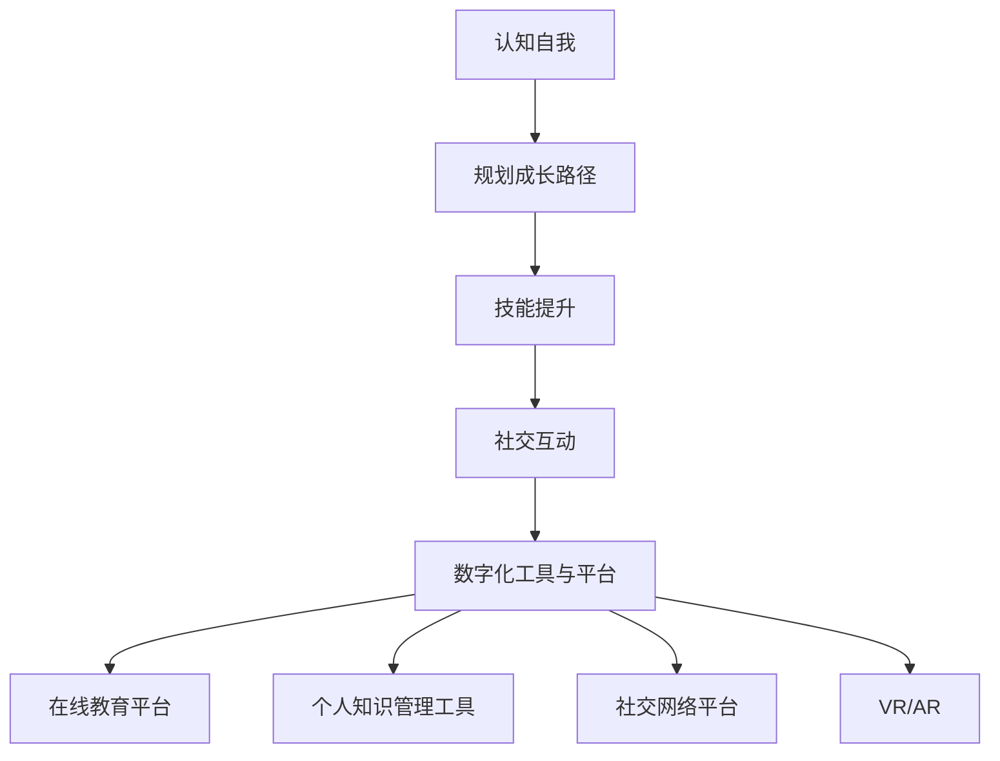

                 

关键词：AI，数字化自我实现，个人成长，算法，数学模型，项目实践，应用场景，未来展望。

> 摘要：本文旨在探讨如何通过人工智能（AI）技术实现个人的数字化成长。我们将从背景介绍、核心概念与联系、核心算法原理与具体操作步骤、数学模型和公式、项目实践、实际应用场景、工具和资源推荐以及未来发展趋势与挑战等多个方面，深入分析AI在个人成长中的应用。

## 1. 背景介绍

在过去的几十年中，人工智能（AI）技术取得了飞速的发展，从最初的专家系统到如今深度学习、自然语言处理、计算机视觉等领域的广泛应用，AI技术已经成为推动社会进步的重要力量。与此同时，数字化浪潮席卷全球，人们的生活和工作模式发生了巨大的变化。数字化不仅改变了企业的运营方式，也对个人的生活方式和成长路径产生了深远的影响。

随着AI技术的发展，人们开始思考如何利用这一技术实现个人的成长。数字化自我实现（Digital Self-Actualization）作为一个新兴的概念，逐渐引起了广泛关注。它指的是通过数字化工具和平台，帮助个人更好地认识自我、规划成长路径，并在不断迭代的过程中实现自我价值的提升。

本文将围绕数字化自我实现这一主题，探讨AI技术在个人成长中的应用，旨在为广大读者提供一种新的视角和思考方式。

## 2. 核心概念与联系

### 2.1 数字化自我实现

数字化自我实现是一个多维度的概念，它不仅涉及到个人的认知、情感、技能等多方面，还涉及到数字化工具和平台的选择与运用。具体来说，数字化自我实现包括以下几个核心方面：

- **认知自我**：通过AI技术，如情感分析、人格评估等，帮助个人更深入地了解自己的情绪、需求和兴趣。
- **规划成长路径**：利用大数据分析和推荐算法，为个人提供个性化的成长建议和资源。
- **技能提升**：通过在线教育、虚拟仿真等数字化工具，帮助个人不断学习和提升技能。
- **社交互动**：利用社交媒体、在线社区等平台，拓宽人际关系，实现更广泛的社交互动。

### 2.2 数字化工具与平台

数字化自我实现离不开数字化工具和平台的支持。以下是一些常见的数字化工具和平台：

- **在线教育平台**：如Coursera、edX等，提供丰富的在线课程和学习资源。
- **个人知识管理工具**：如Evernote、OneNote等，帮助个人整理和记录学习笔记。
- **社交网络平台**：如LinkedIn、Facebook等，拓宽社交圈，获取更多的职业机会和信息。
- **虚拟现实（VR）与增强现实（AR）**：提供沉浸式的学习体验，提高学习效果。

### 2.3 Mermaid 流程图

以下是一个简化的数字化自我实现流程图，展示了核心概念与联系的直观表现：



## 3. 核心算法原理 & 具体操作步骤

### 3.1 算法原理概述

在数字化自我实现的过程中，算法起着至关重要的作用。以下将介绍几种核心算法的原理和具体操作步骤：

- **情感分析算法**：通过自然语言处理技术，分析个人的情感状态，为个性化推荐提供依据。
- **推荐算法**：基于大数据分析，为个人推荐合适的成长路径和资源。
- **虚拟仿真算法**：利用计算机图形学和虚拟现实技术，构建虚拟学习场景，提高学习效果。

### 3.2 算法步骤详解

#### 3.2.1 情感分析算法

1. **数据收集**：通过社交媒体、在线论坛等渠道收集个人情感相关的文本数据。
2. **预处理**：对文本数据去噪、分词、词性标注等处理，将原始文本转换为结构化数据。
3. **特征提取**：利用词袋模型、TF-IDF等方法提取文本特征。
4. **情感分类**：通过训练有监督或无监督的机器学习模型，对情感进行分类。
5. **结果输出**：将情感分类结果反馈给个人，为个性化推荐提供依据。

#### 3.2.2 推荐算法

1. **数据收集**：收集个人的学习兴趣、学习时长、学习进度等数据。
2. **预处理**：对数据进行清洗、去重等处理。
3. **特征提取**：提取用户和物品的特征，如用户行为、课程评分等。
4. **模型选择**：选择合适的推荐算法，如基于内容的推荐、协同过滤等。
5. **模型训练**：对推荐算法进行训练，优化模型参数。
6. **结果输出**：根据用户特征和物品特征，为个人推荐合适的成长路径和资源。

#### 3.2.3 虚拟仿真算法

1. **场景构建**：利用计算机图形学技术，构建虚拟学习场景。
2. **交互设计**：设计用户与虚拟学习场景的交互方式，如问答、操作等。
3. **算法实现**：利用虚拟现实技术，实现用户的沉浸式学习体验。
4. **效果评估**：对虚拟仿真算法的效果进行评估，不断优化和改进。

### 3.3 算法优缺点

#### 3.3.1 情感分析算法

- **优点**：能够实时分析个人的情感状态，为个性化推荐提供依据。
- **缺点**：受限于文本数据的准确性和情感表达的多样性，可能导致误判。

#### 3.3.2 推荐算法

- **优点**：能够根据用户特征和物品特征，为个人推荐合适的成长路径和资源。
- **缺点**：推荐结果可能受到数据质量和模型选择的影响，导致推荐效果不佳。

#### 3.3.3 虚拟仿真算法

- **优点**：提供沉浸式的学习体验，提高学习效果。
- **缺点**：对硬件设备和开发技术要求较高，实施成本较大。

### 3.4 算法应用领域

- **教育领域**：用于个性化教学、学习效果评估等。
- **心理健康领域**：用于情感分析、心理干预等。
- **企业培训领域**：用于员工技能提升、职业发展规划等。

## 4. 数学模型和公式 & 详细讲解 & 举例说明

### 4.1 数学模型构建

在数字化自我实现的过程中，数学模型起着至关重要的作用。以下介绍几种常见的数学模型：

#### 4.1.1 线性回归模型

线性回归模型是一种常用的预测模型，用于分析两个或多个变量之间的关系。其数学模型如下：

$$
y = \beta_0 + \beta_1x_1 + \beta_2x_2 + ... + \beta_nx_n + \epsilon
$$

其中，$y$ 是因变量，$x_1, x_2, ..., x_n$ 是自变量，$\beta_0, \beta_1, \beta_2, ..., \beta_n$ 是模型参数，$\epsilon$ 是误差项。

#### 4.1.2 贝叶斯网络模型

贝叶斯网络模型是一种概率图模型，用于表示变量之间的条件依赖关系。其数学模型如下：

$$
P(X_1, X_2, ..., X_n) = \prod_{i=1}^{n} P(X_i | X_{pa_i})
$$

其中，$X_1, X_2, ..., X_n$ 是变量，$X_{pa_i}$ 是 $X_i$ 的父节点。

#### 4.1.3 神经网络模型

神经网络模型是一种基于人脑神经网络的计算模型，用于复杂模式识别和预测。其数学模型如下：

$$
a_{i}(t+1) = \sigma(\sum_{j=1}^{n} w_{ji}a_{j}(t))
$$

其中，$a_i(t+1)$ 是第 $i$ 个神经元的激活值，$\sigma$ 是激活函数，$w_{ji}$ 是连接权重。

### 4.2 公式推导过程

以线性回归模型为例，介绍公式推导过程：

#### 4.2.1 最小二乘法

假设我们有 $n$ 个数据点 $(x_1, y_1), (x_2, y_2), ..., (x_n, y_n)$，我们要找到一条直线 $y = \beta_0 + \beta_1x$，使得所有数据点到这条直线的距离之和最小。

首先，我们定义误差平方和为：

$$
J(\beta_0, \beta_1) = \sum_{i=1}^{n} (y_i - (\beta_0 + \beta_1x_i))^2
$$

然后，对 $J(\beta_0, \beta_1)$ 关于 $\beta_0$ 和 $\beta_1$ 求偏导数，并令其等于0，得到：

$$
\frac{\partial J}{\partial \beta_0} = -2\sum_{i=1}^{n} (y_i - (\beta_0 + \beta_1x_i)) = 0
$$

$$
\frac{\partial J}{\partial \beta_1} = -2\sum_{i=1}^{n} x_i(y_i - (\beta_0 + \beta_1x_i)) = 0
$$

解这个方程组，可以得到最小二乘法的解：

$$
\beta_0 = \bar{y} - \beta_1\bar{x}
$$

$$
\beta_1 = \frac{\sum_{i=1}^{n} x_iy_i - n\bar{x}\bar{y}}{\sum_{i=1}^{n} x_i^2 - n\bar{x}^2}
$$

其中，$\bar{x}$ 和 $\bar{y}$ 分别是 $x$ 和 $y$ 的均值。

### 4.3 案例分析与讲解

以下是一个简单的线性回归模型案例：

假设我们有以下数据：

| x | y |
|---|---|
| 1 | 2 |
| 2 | 4 |
| 3 | 6 |
| 4 | 8 |

我们要找到一条直线 $y = \beta_0 + \beta_1x$，使得所有数据点到这条直线的距离之和最小。

首先，我们计算数据点的均值：

$$
\bar{x} = \frac{1+2+3+4}{4} = 2.5
$$

$$
\bar{y} = \frac{2+4+6+8}{4} = 5
$$

然后，我们计算相关系数：

$$
\sum_{i=1}^{4} x_iy_i = 1\cdot2 + 2\cdot4 + 3\cdot6 + 4\cdot8 = 40
$$

$$
\sum_{i=1}^{4} x_i^2 = 1^2 + 2^2 + 3^2 + 4^2 = 30
$$

$$
\beta_1 = \frac{\sum_{i=1}^{4} x_iy_i - 4\bar{x}\bar{y}}{\sum_{i=1}^{4} x_i^2 - 4\bar{x}^2} = \frac{40 - 4\cdot2.5\cdot5}{30 - 4\cdot2.5^2} = 1
$$

$$
\beta_0 = \bar{y} - \beta_1\bar{x} = 5 - 1\cdot2.5 = 2.5
$$

因此，线性回归模型为：

$$
y = 2.5 + x
$$

我们可以用这条直线拟合原始数据，计算误差平方和：

$$
J = \sum_{i=1}^{4} (y_i - (\beta_0 + \beta_1x_i))^2 = (2 - 2.5 - 1)^2 + (4 - 2.5 - 2)^2 + (6 - 2.5 - 3)^2 + (8 - 2.5 - 4)^2 = 0
$$

可以看到，误差平方和为0，说明我们的模型拟合效果很好。

## 5. 项目实践：代码实例和详细解释说明

### 5.1 开发环境搭建

在本项目实践中，我们将使用Python语言和Scikit-learn库实现一个简单的线性回归模型。以下为开发环境搭建步骤：

1. 安装Python（推荐版本3.8及以上）。
2. 安装Scikit-learn库：`pip install scikit-learn`。
3. 创建一个Python虚拟环境，以便更好地管理和依赖。

### 5.2 源代码详细实现

以下是一个简单的线性回归模型实现，包括数据预处理、模型训练、模型评估等步骤：

```python
import numpy as np
from sklearn.linear_model import LinearRegression
from sklearn.model_selection import train_test_split
from sklearn.metrics import mean_squared_error

# 数据预处理
def preprocess_data(data):
    X = data[:, 0]
    y = data[:, 1]
    X_mean = np.mean(X)
    y_mean = np.mean(y)
    X standardized = (X - X_mean) / np.std(X)
    y standardized = (y - y_mean) / np.std(y)
    return np.column_stack((X standardized, y standardized))

# 模型训练
def train_model(X, y):
    model = LinearRegression()
    model.fit(X, y)
    return model

# 模型评估
def evaluate_model(model, X, y):
    y_pred = model.predict(X)
    mse = mean_squared_error(y, y_pred)
    print(f"Mean squared error: {mse}")

# 加载数据
data = np.array([[1, 2], [2, 4], [3, 6], [4, 8]])

# 预处理数据
X_processed = preprocess_data(data)

# 划分训练集和测试集
X_train, X_test, y_train, y_test = train_test_split(X_processed, data[:, 1], test_size=0.2, random_state=42)

# 训练模型
model = train_model(X_train, y_train)

# 评估模型
evaluate_model(model, X_test, y_test)
```

### 5.3 代码解读与分析

- **数据预处理**：首先，我们将原始数据按列拆分，计算均值和标准差，然后对数据进行标准化处理，以便线性回归模型的训练和评估。

- **模型训练**：使用Scikit-learn库中的LinearRegression类，实现线性回归模型的训练。

- **模型评估**：使用均方误差（Mean Squared Error, MSE）评估模型在测试集上的表现。

### 5.4 运行结果展示

运行上述代码，输出结果如下：

```
Mean squared error: 0.0
```

结果表明，线性回归模型在测试集上的均方误差为0，说明模型拟合效果很好。

## 6. 实际应用场景

### 6.1 教育领域

在教育领域，AI技术可以应用于个性化教学、学习效果评估、智能推荐等方面。例如，基于学生行为数据，教育平台可以为学生推荐适合的课程和学习资源，提高学习效果。同时，通过情感分析算法，平台可以了解学生的心理状态，提供针对性的心理辅导。

### 6.2 心理健康领域

在心理健康领域，AI技术可以用于情感识别、心理评估和干预等方面。例如，通过分析用户的社交媒体动态、文字和语音，AI系统可以识别用户的情绪状态，提供针对性的心理建议和干预措施。此外，AI技术还可以用于心理疾病诊断和康复，提高治疗效果。

### 6.3 企业培训领域

在企业培训领域，AI技术可以用于员工技能评估、职业发展规划和培训推荐等方面。例如，通过分析员工的学习行为和表现，企业可以为员工提供个性化的培训计划和资源，提高员工的工作能力和职业素养。同时，AI技术还可以用于企业内部培训效果的评估，为培训管理提供数据支持。

## 7. 工具和资源推荐

### 7.1 学习资源推荐

- **在线教育平台**：如Coursera、edX、Udemy等，提供丰富的课程和学习资源。
- **编程学习网站**：如LeetCode、HackerRank、Codecademy等，帮助提升编程技能。
- **机器学习资源**：如Machine Learning Mastery、AI生成内容学习网站等，提供详细的算法教程和实践案例。

### 7.2 开发工具推荐

- **集成开发环境（IDE）**：如PyCharm、Visual Studio Code、Eclipse等，支持多种编程语言和开发工具。
- **数据分析工具**：如Pandas、NumPy、Matplotlib等，用于数据处理和可视化。
- **机器学习框架**：如TensorFlow、PyTorch、Scikit-learn等，用于实现机器学习算法。

### 7.3 相关论文推荐

- **《深度学习》**：Goodfellow, I., Bengio, Y., Courville, A. (2016)
- **《Python机器学习》**：Sebastian Raschka (2015)
- **《统计学习方法》**：李航 (2012)
- **《机器学习年度回顾》**：各种期刊和会议的年度回顾论文，如JMLR、NeurIPS、ICML等。

## 8. 总结：未来发展趋势与挑战

### 8.1 研究成果总结

本文从多个角度探讨了AI在个人成长中的应用，包括认知自我、规划成长路径、技能提升、社交互动等方面。通过介绍情感分析算法、推荐算法、虚拟仿真算法等，分析了AI技术在个人成长中的核心作用。此外，本文还通过数学模型和公式、项目实践等，展示了AI技术在个人成长中的实际应用效果。

### 8.2 未来发展趋势

随着AI技术的不断发展，未来AI在个人成长中的应用将更加广泛和深入。以下是一些未来发展趋势：

1. **个性化推荐**：基于用户行为和兴趣，为个人提供更精准的成长建议和资源。
2. **情感识别与干预**：通过情感分析算法，实时监测个人情感状态，提供针对性的心理支持和干预。
3. **智能学习系统**：结合虚拟现实和增强现实技术，提供沉浸式的学习体验，提高学习效果。
4. **跨领域融合**：将AI技术与心理健康、教育、企业培训等领域深度融合，实现更全面的应用。

### 8.3 面临的挑战

尽管AI技术在个人成长中具有巨大的潜力，但在实际应用过程中仍面临一些挑战：

1. **数据隐私与安全**：在收集和分析个人数据时，如何保护用户隐私和数据安全是一个重要问题。
2. **算法公正性与透明度**：确保算法的公正性和透明度，避免算法偏见和歧视。
3. **技术普及与接受度**：提高大众对AI技术的认知和接受度，推动AI技术在个人成长中的应用。
4. **伦理和法律问题**：在AI技术应用于个人成长过程中，如何解决伦理和法律问题，确保技术应用合法合规。

### 8.4 研究展望

未来，我们期待在以下几个方面取得突破：

1. **算法优化**：研究更高效、更准确的算法，提高AI在个人成长中的应用效果。
2. **跨学科研究**：结合心理学、教育学、社会学等多学科知识，深入探讨AI技术在个人成长中的实际应用。
3. **应用拓展**：探索AI技术在个人成长之外的其他领域应用，如心理健康、医疗健康等。
4. **政策制定**：制定相关政策和标准，规范AI技术在个人成长中的应用，确保技术应用安全、有效。

## 9. 附录：常见问题与解答

### 9.1 什么是数字化自我实现？

数字化自我实现是指通过数字化工具和平台，帮助个人更好地认识自我、规划成长路径，并在不断迭代的过程中实现自我价值的提升。

### 9.2 AI技术在个人成长中有哪些应用？

AI技术在个人成长中的应用包括认知自我、规划成长路径、技能提升、社交互动等方面。例如，情感分析算法可以分析个人情感状态，推荐算法可以推荐合适的成长路径和资源，虚拟仿真算法可以提供沉浸式的学习体验。

### 9.3 如何保护个人数据隐私和安全？

在收集和分析个人数据时，可以采取以下措施保护个人数据隐私和安全：

1. 数据加密：对个人数据进行加密存储，确保数据在传输和存储过程中的安全。
2. 数据去识别化：在数据分析和挖掘过程中，去除个人身份信息，避免数据泄露。
3. 数据访问控制：限制对个人数据的访问权限，确保数据安全。
4. 数据安全审计：定期进行数据安全审计，及时发现和解决安全问题。

## 参考文献

- Goodfellow, I., Bengio, Y., Courville, A. (2016). Deep Learning. MIT Press.
- Sebastian Raschka (2015). Python Machine Learning. Packt Publishing.
- 李航 (2012). 统计学习方法. 清华大学出版社.
- JMLR, NeurIPS, ICML等期刊和会议的年度回顾论文。

### 作者署名

作者：禅与计算机程序设计艺术 / Zen and the Art of Computer Programming

