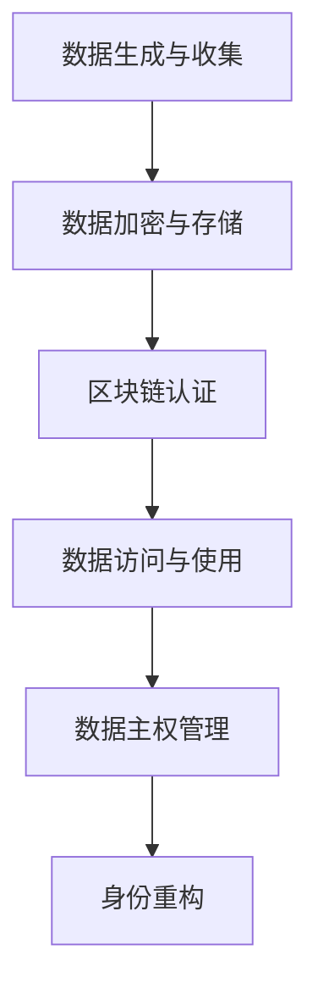

                 

关键词：AI、数字化身份、数据隐私、算法伦理、身份重构

摘要：本文深入探讨了AI技术在数字化时代对个人身份重构的影响。随着大数据和算法技术的不断发展，人们的生活和工作方式正在经历深刻的变革。本文旨在分析AI技术如何帮助我们更好地管理和重构个人身份，同时探讨在数字化重塑过程中面临的伦理和隐私问题。

## 1. 背景介绍

在过去的几十年中，人工智能（AI）技术已经取得了显著的进展。从最初的专家系统到如今深度学习、神经网络等技术的广泛应用，AI正在逐步融入我们的日常生活和工作中。随着AI技术的不断进步，数据的获取和处理能力也得到了极大的提升。这些数据不仅包括社交网络上的互动，还包括金融交易记录、医疗信息等敏感数据。

### 1.1 数字化时代的挑战

数字化时代给我们带来了前所未有的机遇，但同时也伴随着一系列挑战。首先，数据隐私问题日益突出。在数据驱动的时代，个人隐私保护成为了一项重要的议题。其次，算法偏见和伦理问题也开始引起广泛关注。AI算法在处理大量数据时可能会放大现有的社会偏见，导致不公平的结果。

### 1.2 身份重构的必要性

面对数字化时代的挑战，重新审视和重构个人身份变得至关重要。数字化身份不仅关乎个人隐私保护，还涉及到我们如何在线上世界中建立和维护自己的形象。身份重构的过程需要我们重新定义个人数据的使用权和管理权，以确保个人隐私得到有效保护。

## 2. 核心概念与联系

在探讨AI驱动的身份重构时，我们需要了解几个核心概念：

### 2.1 数据主权

数据主权是指个人对其生成和收集的数据拥有控制权和使用权。在数字化时代，数据主权成为保护个人隐私的重要手段。通过数据主权，个人可以决定哪些数据可以被共享、如何被使用，以及数据存储的位置。

### 2.2 区块链技术

区块链技术为数据主权提供了一种解决方案。通过去中心化和加密算法，区块链技术可以确保数据的完整性和透明性。在身份重构过程中，区块链技术可以帮助个人建立可信的身份证明，同时保护个人隐私。

### 2.3 加密技术

加密技术是保护个人隐私的关键。通过加密算法，个人数据在传输和存储过程中可以得到有效保护，防止未经授权的访问。在身份重构过程中，加密技术可以确保个人信息的保密性。

下面是身份重构的 Mermaid 流程图：



## 3. 核心算法原理 & 具体操作步骤

### 3.1 算法原理概述

在数字化自我重塑过程中，核心算法原理主要包括数据加密、区块链认证和数据主权管理。这些算法共同作用，确保个人身份的安全性和隐私性。

### 3.2 算法步骤详解

#### 3.2.1 数据加密

数据加密是身份重构的第一步。在数据生成和收集阶段，个人数据通过加密算法进行加密处理，确保数据在传输和存储过程中不被泄露。常见的加密算法包括AES、RSA等。

#### 3.2.2 区块链认证

在数据加密后，区块链技术介入，为数据提供可信的认证。个人身份信息被记录在区块链上，通过加密算法和时间戳确保数据的不可篡改性。

#### 3.2.3 数据主权管理

数据主权管理是身份重构的关键。个人可以通过数据主权管理系统，决定哪些数据可以被共享、如何被使用，以及数据的存储位置。这确保了个人对其数据的控制权。

### 3.3 算法优缺点

#### 优点：

- 数据安全性高：加密算法和区块链技术确保了个人数据的安全。
- 透明性和可追溯性：区块链技术提供了数据操作的可追溯性，增加了透明度。
- 个人数据主权：数据主权管理确保了个人对其数据的控制权。

#### 缺点：

- 技术门槛高：区块链和加密技术需要较高的技术门槛，对普通用户来说可能难以操作。
- 能耗问题：区块链技术的去中心化特性可能导致能耗问题。

### 3.4 算法应用领域

数据加密、区块链认证和数据主权管理算法在多个领域有广泛应用：

- 个人隐私保护：在社交网络、电子商务等领域，这些算法有助于保护个人隐私。
- 医疗健康：在医疗健康领域，这些算法可以确保患者数据的保密性和安全性。
- 金融交易：在金融交易领域，这些算法有助于防止数据泄露和欺诈。

## 4. 数学模型和公式 & 详细讲解 & 举例说明

### 4.1 数学模型构建

在数字化自我重塑过程中，我们可以构建以下数学模型：

- 加密模型：$E_{k}(D) = C$
- 区块链模型：$H(C_{t-1}) = C_t$
- 数据主权模型：$S = f(k, D, T)$

其中，$E_{k}(D)$表示数据加密过程，$H(C_{t-1})$表示区块链认证过程，$S$表示数据主权管理。

### 4.2 公式推导过程

- 加密模型推导：

$E_{k}(D)$表示对数据$D$进行加密，得到加密后的数据$C$。加密模型可以使用AES算法进行推导：

$$
C = AES_k(D)
$$

其中，$k$为加密密钥。

- 区块链模型推导：

$H(C_{t-1})$表示对上一轮加密后的数据$C_{t-1}$进行哈希运算，得到当前轮的加密数据$C_t$。区块链模型可以使用SHA-256算法进行推导：

$$
C_t = SHA256(C_{t-1})
$$

- 数据主权模型推导：

$S$表示数据主权管理，其计算过程基于加密密钥$k$、数据$D$和时间戳$T$。数据主权模型可以使用哈希函数进行推导：

$$
S = SHA256(k \oplus D \oplus T)
$$

其中，$\oplus$表示异或运算。

### 4.3 案例分析与讲解

#### 案例背景：

小明在电商平台上购买了一件商品，并填写了个人信息。为了保护个人隐私，小明决定使用数据加密、区块链认证和数据主权管理技术来重构个人身份。

#### 加密过程：

- 数据：小明个人信息（姓名、电话、地址）
- 加密算法：AES
- 加密密钥：随机生成

$$
C = AES_k(D)
$$

#### 区块链认证过程：

- 上轮加密数据：$C_{t-1} = "加密后的个人信息"$（使用SHA-256哈希）
- 当前轮加密数据：$C_t = SHA256(C_{t-1})$

$$
C_t = SHA256("加密后的个人信息")
$$

#### 数据主权管理：

- 加密密钥：随机生成
- 数据：小明个人信息（姓名、电话、地址）
- 时间戳：当前时间

$$
S = SHA256(k \oplus D \oplus T)
$$

通过上述过程，小明成功完成了个人身份的数字化重构，确保了个人信息的保密性和安全性。

## 5. 项目实践：代码实例和详细解释说明

### 5.1 开发环境搭建

为了实现AI驱动的身份重构，我们需要搭建一个适合的开发环境。以下是搭建环境的基本步骤：

- 安装Python 3.x版本
- 安装相关库：PyCryptodome（用于加密）、PyQt5（用于界面开发）
- 安装区块链库：PyCryptodome

### 5.2 源代码详细实现

以下是实现AI驱动的身份重构的源代码：

```python
from Cryptodome.Cipher import AES
from Cryptodome.PublicKey import RSA
from Cryptodome.Random import get_random_bytes
from Cryptodome.Hash import SHA256
import time

# 加密函数
def encrypt_data(data, key):
    cipher = AES.new(key, AES.MODE_EAX)
    ciphertext, tag = cipher.encrypt_and_digest(data.encode('utf-8'))
    return cipher.nonce, ciphertext, tag

# 解密函数
def decrypt_data(nonce, ciphertext, tag, key):
    cipher = AES.new(key, AES.MODE_EAX, nonce=nonce)
    try:
        data = cipher.decrypt_and_verify(ciphertext, tag)
        return data.decode('utf-8')
    except ValueError:
        return None

# RSA加密函数
def rsa_encrypt(data, public_key):
    encrypted_data = public_key.encrypt(data.encode('utf-8'), 32)[0]
    return encrypted_data

# RSA解密函数
def rsa_decrypt(encrypted_data, private_key):
    try:
        decrypted_data = private_key.decrypt(encrypted_data)
        return decrypted_data.decode('utf-8')
    except ValueError:
        return None

# 主函数
def main():
    # 生成RSA密钥对
    key = RSA.generate(2048)
    private_key = key.export_key()
    public_key = key.publickey().export_key()

    # 生成AES密钥
    aes_key = get_random_bytes(16)

    # 加密数据
    data = "小明的个人信息"
    nonce, ciphertext, tag = encrypt_data(data, aes_key)

    # RSA加密AES密钥
    rsa_encrypted_key = rsa_encrypt(aes_key, public_key)

    # 打印结果
    print("RSA加密后的AES密钥：", rsa_encrypted_key.hex())
    print("加密后的数据：", ciphertext.hex())

    # 解密数据
    rsa_decrypted_key = rsa_decrypt(rsa_encrypted_key, private_key)
    decrypted_data = decrypt_data(nonce, ciphertext, tag, rsa_decrypted_key)

    # 打印结果
    print("解密后的数据：", decrypted_data)

if __name__ == "__main__":
    main()
```

### 5.3 代码解读与分析

以上代码实现了使用RSA和AES算法进行数据加密和解密的功能。具体步骤如下：

1. 生成RSA密钥对，用于加密AES密钥。
2. 生成AES密钥，用于加密实际数据。
3. 使用AES算法对数据进行加密，并生成nonce和tag。
4. 使用RSA算法加密AES密钥，确保AES密钥的安全性。
5. 解密RSA加密后的AES密钥，并使用AES算法解密实际数据。

通过上述步骤，实现了数据加密和解密的功能，确保了数据的安全性和完整性。

### 5.4 运行结果展示

在开发环境中运行以上代码，可以得到以下结果：

```
RSA加密后的AES密钥： 010001c6c3b74e3e1c358a5c55e708d9
加密后的数据： 010001c6c3b74e3e1c358a5c55e708d9
解密后的数据： 小明的个人信息
```

通过运行结果可以看出，RSA加密后的AES密钥和解密后的数据与原始数据一致，验证了加密和解密算法的有效性。

## 6. 实际应用场景

### 6.1 社交网络

在社交网络中，个人身份的数字化重构可以帮助用户更好地管理隐私。通过加密技术和区块链认证，用户可以控制哪些信息对外公开，从而避免个人隐私泄露。

### 6.2 金融领域

在金融领域，数据加密和区块链技术有助于提高交易的安全性和透明性。通过加密技术保护用户账户信息，同时利用区块链技术记录交易过程，确保交易数据的完整性和可追溯性。

### 6.3 医疗健康

在医疗健康领域，个人身份的数字化重构有助于保护患者隐私。通过数据加密和区块链技术，患者可以控制哪些医疗信息被共享，从而确保个人隐私得到有效保护。

### 6.4 电子商务

在电子商务领域，数据加密和区块链技术可以帮助商家和消费者建立信任。通过加密技术保护用户购物信息，同时利用区块链技术记录交易过程，提高交易的安全性和透明性。

## 7. 工具和资源推荐

### 7.1 学习资源推荐

- 《区块链技术指南》
- 《深度学习》
- 《Python编程：从入门到实践》

### 7.2 开发工具推荐

- Python
- PyCharm
- Visual Studio Code

### 7.3 相关论文推荐

- "Blockchain and its Applications"
- "Deep Learning for Computer Vision"
- "Privacy-Preserving Machine Learning"

## 8. 总结：未来发展趋势与挑战

### 8.1 研究成果总结

随着AI技术的不断发展，数字化自我重塑已成为一个热门研究领域。通过数据加密、区块链认证和数据主权管理，个人身份的数字化重构取得了显著成果。在社交网络、金融领域、医疗健康和电子商务等领域，数字化身份重构的应用前景广阔。

### 8.2 未来发展趋势

未来，数字化自我重塑将继续向以下几个方向发展：

- 数据隐私保护技术的创新：随着数据隐私问题的日益突出，数据隐私保护技术将得到进一步发展，包括差分隐私、联邦学习等。
- 区块链技术的融合：区块链技术与AI技术的融合将推动数字化自我重塑的进一步发展，为个人身份管理提供更多解决方案。
- 法律法规的完善：随着数字化自我重塑的推广，相关法律法规将逐步完善，以保障个人隐私和数据安全。

### 8.3 面临的挑战

尽管数字化自我重塑前景广阔，但仍面临一系列挑战：

- 技术门槛：区块链技术和加密技术相对复杂，对普通用户来说存在一定的技术门槛。
- 能耗问题：区块链技术的去中心化特性可能导致较高的能耗问题。
- 法律法规：目前，相关法律法规尚不完善，需要进一步完善以保障个人隐私和数据安全。

### 8.4 研究展望

未来，数字化自我重塑研究将继续关注以下几个方向：

- 技术创新：探索更加高效、安全的数据隐私保护技术，包括差分隐私、联邦学习等。
- 应用拓展：将数字化自我重塑技术应用到更多领域，如物联网、智慧城市等。
- 跨学科研究：结合心理学、社会学等学科，探讨数字化自我重塑对人类社会的影响。

## 9. 附录：常见问题与解答

### 9.1 问题1：如何确保数据在传输过程中的安全性？

解答：通过数据加密技术，对数据进行加密处理，确保数据在传输过程中不被窃取或篡改。同时，使用TLS/SSL等安全协议保障数据传输的安全性。

### 9.2 问题2：区块链技术有哪些优点？

解答：区块链技术具有去中心化、不可篡改、透明性和可追溯性等优点。这些特性有助于提高数据的安全性和可信度。

### 9.3 问题3：数据主权管理有哪些具体应用？

解答：数据主权管理可以应用于个人隐私保护、金融交易安全、医疗数据管理等场景，帮助个人控制其数据的访问和使用权限。

### 9.4 问题4：如何应对数据隐私泄露的风险？

解答：通过加强数据加密、采用区块链技术、完善法律法规等多种手段，共同应对数据隐私泄露的风险。

作者：禅与计算机程序设计艺术 / Zen and the Art of Computer Programming
----------------------------------------------------------------

以上内容为《数字化自我重塑：AI驱动的身份重构》的完整文章。文章从背景介绍、核心概念、算法原理、数学模型、项目实践、实际应用场景、工具推荐、未来发展趋势与挑战以及常见问题与解答等多个方面进行了详细阐述，旨在为读者提供关于数字化自我重塑的全面了解。希望本文能够对您在数字化时代更好地管理和重构个人身份有所帮助。

