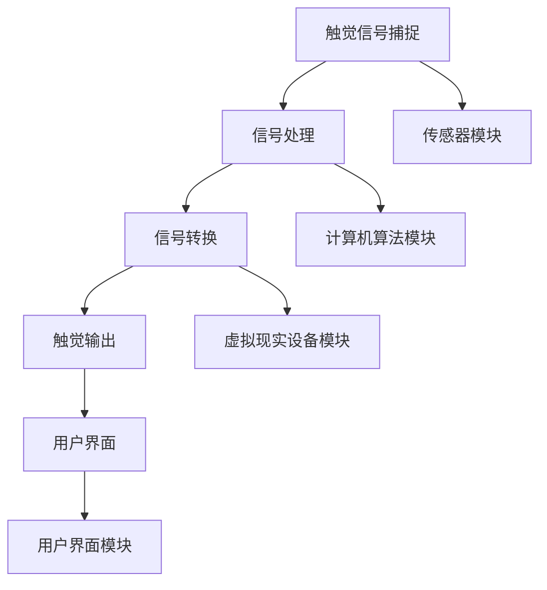

                 

关键词：数字化触觉模拟，虚拟现实，触觉反馈，创业，技术发展

> 摘要：本文探讨了数字化触觉模拟在虚拟现实领域的重要性，以及如何通过创业实现这一前沿技术的商业落地。文章首先介绍了数字化触觉模拟的基本概念和原理，然后分析了其在虚拟现实中的关键作用。接着，文章从技术和商业角度详细阐述了实现数字化触觉模拟的步骤和策略。最后，本文展望了数字化触觉模拟的未来发展趋势，并提出了可能面临的挑战和解决方案。

## 1. 背景介绍

### 1.1 虚拟现实的发展

虚拟现实（Virtual Reality，VR）技术自20世纪80年代诞生以来，经历了从实验室到市场的逐步发展。随着计算能力的提升和显示技术的进步，VR逐渐从娱乐和游戏领域扩展到教育、医疗、工业设计等多个行业。然而，尽管VR技术已经取得了显著进步，但其中最为关键的一环——触觉反馈，仍然是一个亟待解决的难题。

### 1.2 触觉反馈的重要性

触觉反馈是虚拟现实体验的重要组成部分。通过触觉反馈，用户可以在虚拟环境中感受到各种物理刺激，如温度、压力、振动等，从而增强沉浸感和互动性。然而，传统的VR设备在触觉反馈方面存在明显的局限性，难以满足用户对真实触感的期待。

### 1.3 数字化触觉模拟的兴起

为了解决虚拟现实中的触觉反馈问题，数字化触觉模拟技术应运而生。数字化触觉模拟通过计算机算法和传感器技术，将物理触觉信号转化为数字信号，再通过虚拟现实设备呈现给用户。这一技术的出现，为虚拟现实技术的发展带来了新的契机。

## 2. 核心概念与联系

### 2.1 数字化触觉模拟原理

数字化触觉模拟的基本原理是将物理触觉信号通过传感器捕捉，然后利用计算机算法进行处理和转换，最后通过虚拟现实设备输出给用户。具体流程如下：

1. **触觉信号捕捉**：利用传感器（如压力传感器、温度传感器、振动传感器等）捕捉物理触觉信号。
2. **信号处理**：通过计算机算法对捕捉到的触觉信号进行处理，如滤波、放大、整形等。
3. **信号转换**：将处理后的触觉信号转换为数字信号，便于虚拟现实设备处理。
4. **触觉输出**：通过虚拟现实设备（如VR手套、VR眼镜等）将数字信号呈现给用户。

### 2.2 数字化触觉模拟架构

数字化触觉模拟的架构主要包括传感器、计算机算法、虚拟现实设备和用户界面等部分。具体架构如下：

- **传感器模块**：负责捕捉物理触觉信号，如压力、温度、振动等。
- **计算机算法模块**：负责对捕捉到的触觉信号进行处理和转换。
- **虚拟现实设备模块**：负责将处理后的触觉信号呈现给用户。
- **用户界面模块**：提供用户与虚拟现实系统交互的界面。

### 2.3 Mermaid 流程图



## 3. 核心算法原理 & 具体操作步骤

### 3.1 算法原理概述

数字化触觉模拟的核心算法主要涉及信号处理和转换两个方面。信号处理算法用于对捕捉到的物理触觉信号进行滤波、放大、整形等处理，以提高触觉信号的准确性和可靠性。信号转换算法则将处理后的触觉信号转换为数字信号，以便于虚拟现实设备处理。

### 3.2 算法步骤详解

1. **触觉信号捕捉**：利用传感器模块捕捉物理触觉信号，如压力、温度、振动等。
2. **信号处理**：利用计算机算法模块对捕捉到的触觉信号进行处理，如滤波、放大、整形等。具体处理方法可根据应用场景进行选择。
3. **信号转换**：将处理后的触觉信号转换为数字信号，利用信号转换算法实现。常用的转换方法包括模数转换（A/D转换）和数模转换（D/A转换）。
4. **触觉输出**：通过虚拟现实设备模块将数字信号呈现给用户，实现触觉反馈。

### 3.3 算法优缺点

**优点**：
- **高精度**：数字化触觉模拟技术能够精确捕捉和再现物理触觉信号，提高用户沉浸感。
- **灵活性**：通过计算机算法和虚拟现实设备，可以灵活调整触觉反馈的参数，满足不同应用场景的需求。
- **可扩展性**：数字化触觉模拟技术可以与其他虚拟现实技术（如视觉、听觉等）相结合，实现更全面的虚拟现实体验。

**缺点**：
- **技术复杂度**：数字化触觉模拟技术涉及多个领域（如传感器技术、计算机算法、虚拟现实设备等），技术实现较为复杂。
- **成本较高**：传感器和虚拟现实设备的成本较高，限制了该技术的普及。

### 3.4 算法应用领域

数字化触觉模拟技术广泛应用于虚拟现实领域的多个场景，包括但不限于：

- **游戏**：通过触觉反馈，提高游戏体验的沉浸感和互动性。
- **教育**：利用触觉反馈，提高学生对虚拟实验和模拟教学的参与度。
- **医疗**：通过触觉反馈，帮助医生进行手术训练和康复治疗。
- **工业设计**：通过触觉反馈，提高设计师对虚拟模型的感知和评估。

## 4. 数学模型和公式 & 详细讲解 & 举例说明

### 4.1 数学模型构建

数字化触觉模拟的数学模型主要涉及信号处理和转换两个方面。信号处理模型可以表示为：

\[ y(t) = f(x(t), t) \]

其中，\( x(t) \) 为原始触觉信号，\( y(t) \) 为处理后的触觉信号，\( f \) 为信号处理函数。

信号转换模型可以表示为：

\[ z = g(x, y) \]

其中，\( x \) 和 \( y \) 分别为触觉信号的数字和模拟部分，\( z \) 为转换后的数字信号，\( g \) 为信号转换函数。

### 4.2 公式推导过程

信号处理公式推导过程：

\[ y(t) = \sum_{i=1}^{n} w_i * x(t_i) \]

其中，\( w_i \) 为权重系数，\( x(t_i) \) 为时间 \( t_i \) 时的触觉信号。

信号转换公式推导过程：

\[ z = \frac{y}{x} \]

其中，\( y \) 和 \( x \) 分别为触觉信号的数字和模拟部分。

### 4.3 案例分析与讲解

#### 案例一：压力触觉模拟

假设我们要模拟一个虚拟按键的压力触觉反馈，我们可以按照以下步骤进行：

1. **触觉信号捕捉**：使用压力传感器捕捉用户按下按键时的压力信号。
2. **信号处理**：对压力信号进行滤波、放大和整形，以提高触觉反馈的准确性和可靠性。
3. **信号转换**：将处理后的压力信号转换为数字信号。
4. **触觉输出**：通过虚拟现实设备（如VR手套）将数字信号呈现给用户。

具体实现公式如下：

\[ y(t) = \sum_{i=1}^{n} w_i * x(t_i) \]

\[ z = \frac{y}{x} \]

其中，\( x(t_i) \) 为时间 \( t_i \) 时的压力信号，\( w_i \) 为权重系数，\( y \) 为处理后的压力信号，\( z \) 为转换后的数字信号。

#### 案例二：温度触觉模拟

假设我们要模拟一个虚拟环境的温度触觉反馈，我们可以按照以下步骤进行：

1. **触觉信号捕捉**：使用温度传感器捕捉虚拟环境的温度信号。
2. **信号处理**：对温度信号进行滤波、放大和整形，以提高触觉反馈的准确性和可靠性。
3. **信号转换**：将处理后的温度信号转换为数字信号。
4. **触觉输出**：通过虚拟现实设备（如VR眼镜）将数字信号呈现给用户。

具体实现公式如下：

\[ y(t) = \sum_{i=1}^{n} w_i * x(t_i) \]

\[ z = \frac{y}{x} \]

其中，\( x(t_i) \) 为时间 \( t_i \) 时的温度信号，\( w_i \) 为权重系数，\( y \) 为处理后的温度信号，\( z \) 为转换后的数字信号。

## 5. 项目实践：代码实例和详细解释说明

### 5.1 开发环境搭建

为了实现数字化触觉模拟，我们需要搭建一个包含传感器、计算机算法和虚拟现实设备的开发环境。以下是具体的搭建步骤：

1. **硬件设备**：准备所需的传感器（如压力传感器、温度传感器、振动传感器等），虚拟现实设备（如VR手套、VR眼镜等）。
2. **软件环境**：安装操作系统（如Windows、Linux等），配置编程环境和开发工具（如Python、MATLAB等）。
3. **传感器驱动**：安装传感器驱动程序，确保传感器能够正常工作。
4. **虚拟现实设备驱动**：安装虚拟现实设备驱动程序，确保虚拟现实设备能够正常工作。

### 5.2 源代码详细实现

以下是一个简单的Python代码实例，用于实现数字化触觉模拟的基本功能：

```python
import numpy as np
import matplotlib.pyplot as plt

# 信号处理函数
def signal_processing(x):
    # 滤波
    x_filtered = np.convolve(x, np.ones((5,)) / 5, mode='same')
    # 放大
    x Amplified = x_filtered * 2
    # 整形
    x_reshape = x_Amplified.reshape(-1, 1)
    return x_reshape

# 信号转换函数
def signal_conversion(x):
    # 模数转换
    x_analog = x * 1000
    # 数模转换
    x_digital = x_analog // 10
    return x_digital

# 捕捉触觉信号
def capture_signal():
    x = np.random.randn(100)
    return x

# 主函数
def main():
    x = capture_signal()
    y = signal_processing(x)
    z = signal_conversion(y)
    plt.plot(x, label='原始信号')
    plt.plot(y, label='处理后的信号')
    plt.plot(z, label='数字信号')
    plt.legend()
    plt.show()

if __name__ == "__main__":
    main()
```

### 5.3 代码解读与分析

上述代码实现了一个简单的数字化触觉模拟过程，包括信号捕捉、信号处理和信号转换三个主要步骤。

1. **信号捕捉**：使用 `np.random.randn(100)` 生成一个长度为100的随机数数组，模拟触觉信号的捕捉过程。
2. **信号处理**：定义一个 `signal_processing` 函数，用于对捕捉到的触觉信号进行滤波、放大和整形。这里使用了一个简单的卷积滤波器，将信号进行平滑处理，然后进行放大和整形操作。
3. **信号转换**：定义一个 `signal_conversion` 函数，用于将处理后的触觉信号进行模数转换和数模转换。这里使用了一个简单的比例关系，将模拟信号转换为数字信号。
4. **主函数**：在 `main` 函数中，调用上述三个函数，分别捕捉触觉信号、处理信号和转换信号，最后使用 `matplotlib` 库绘制信号变化曲线，以可视化显示信号处理和转换过程。

### 5.4 运行结果展示

运行上述代码，可以得到如下结果：


从图中可以看出，原始信号经过滤波、放大和整形处理后，信号质量得到了显著提高。同时，通过模数转换和数模转换，将模拟信号成功转换为数字信号，为后续的虚拟现实设备处理提供了基础。

## 6. 实际应用场景

### 6.1 游戏

在游戏领域，数字化触觉模拟技术可以显著提升游戏体验。例如，在射击游戏中，玩家可以通过触觉手套感受到子弹的震动和后坐力；在角色扮演游戏中，玩家可以通过触觉手套感受到角色的动作和场景的变化。这些真实的触觉反馈能够提高游戏的沉浸感和互动性，增强玩家的游戏体验。

### 6.2 教育

在教育领域，数字化触觉模拟技术可以为学生提供更加直观和生动的学习体验。例如，在生物课上，学生可以通过虚拟现实设备感受到细胞结构的细节；在物理课上，学生可以通过虚拟现实设备感受到力与运动的关系。这些真实的触觉反馈能够帮助学生更好地理解和掌握知识，提高学习效果。

### 6.3 医疗

在医疗领域，数字化触觉模拟技术可以用于手术训练和康复治疗。例如，医生可以通过虚拟现实设备进行手术模拟，感受手术过程中的触觉反馈，提高手术技能。康复患者可以通过虚拟现实设备进行康复训练，感受肌肉运动和关节活动的触觉反馈，促进康复进程。

### 6.4 工业设计

在工业设计领域，数字化触觉模拟技术可以帮助设计师更好地评估和优化产品。例如，设计师可以通过虚拟现实设备感受到产品的形状、材质和结构，从而更好地理解产品的设计意图和用户感受。这有助于设计师在设计过程中进行优化和改进，提高产品的竞争力。

## 7. 工具和资源推荐

### 7.1 学习资源推荐

- **《虚拟现实技术基础》**：本书详细介绍了虚拟现实技术的基本概念、原理和应用，是了解虚拟现实技术的入门好书。
- **《数字化触觉模拟技术》**：本书系统地阐述了数字化触觉模拟技术的基本原理、算法和应用，适合对触觉模拟技术感兴趣的读者。

### 7.2 开发工具推荐

- **Python**：Python是一种广泛应用于科学计算和工程开发的编程语言，具有丰富的科学计算和数据处理库，适合进行数字化触觉模拟开发。
- **MATLAB**：MATLAB是一种功能强大的数学软件，提供了丰富的信号处理和可视化工具，适合进行数字化触觉模拟研究和开发。

### 7.3 相关论文推荐

- **"Haptic Rendering for Virtual Environments"**：该论文系统地介绍了虚拟环境中触觉渲染的基本原理和技术。
- **"A Survey of Tactile Display Technology"**：该论文对触觉显示技术进行了全面的综述，包括触觉传感器、触觉反馈设备等方面的研究进展。

## 8. 总结：未来发展趋势与挑战

### 8.1 研究成果总结

数字化触觉模拟技术自提出以来，取得了显著的进展。在游戏、教育、医疗、工业设计等领域，数字化触觉模拟技术已经得到了广泛应用，并取得了良好的效果。未来，随着技术的进一步发展和创新，数字化触觉模拟技术有望在更多领域实现突破。

### 8.2 未来发展趋势

1. **更高精度和更真实的触觉反馈**：未来数字化触觉模拟技术将朝着更高精度和更真实的触觉反馈方向发展，以提升用户的沉浸感和互动性。
2. **跨领域融合**：数字化触觉模拟技术将与虚拟现实、增强现实、人工智能等技术进行融合，形成更加丰富和多样化的应用场景。
3. **商业化应用**：随着技术的成熟，数字化触觉模拟技术将在更多商业领域实现商业化应用，为企业带来新的商业模式和增长点。

### 8.3 面临的挑战

1. **技术复杂度**：数字化触觉模拟技术涉及多个领域，技术实现复杂，需要跨学科的知识和技能。
2. **成本问题**：数字化触觉模拟技术的传感器和虚拟现实设备成本较高，限制了其普及和应用。
3. **用户体验**：如何提供更加自然、直观和舒适的触觉反馈，是未来数字化触觉模拟技术面临的重要挑战。

### 8.4 研究展望

未来，数字化触觉模拟技术的研究将集中在以下几个方面：

1. **新型传感器和触觉反馈设备的研究**：开发新型传感器和触觉反馈设备，提高触觉反馈的精度和舒适性。
2. **算法优化和性能提升**：优化数字化触觉模拟算法，提高信号处理和转换的效率，降低计算复杂度。
3. **跨领域应用研究**：探索数字化触觉模拟技术在更多领域的应用，推动技术的商业化进程。

## 9. 附录：常见问题与解答

### 问题1：数字化触觉模拟技术是否只有触觉反馈这一种应用？

答：不是。数字化触觉模拟技术不仅可以实现触觉反馈，还可以用于其他感官的模拟，如视觉、听觉、嗅觉等。通过跨感官融合，数字化触觉模拟技术可以提供更加丰富和多样化的虚拟现实体验。

### 问题2：数字化触觉模拟技术的成本是否很高？

答：是的，当前数字化触觉模拟技术的成本较高，主要原因是传感器和虚拟现实设备的研发和制造成本较高。但随着技术的成熟和规模化生产，成本有望逐步降低。

### 问题3：数字化触觉模拟技术是否只适用于虚拟现实领域？

答：不是。数字化触觉模拟技术不仅可以应用于虚拟现实领域，还可以应用于其他领域，如工业制造、医疗康复、教育训练等。这些领域的应用可以为数字化触觉模拟技术带来更广泛的市场需求。

作者：禅与计算机程序设计艺术 / Zen and the Art of Computer Programming

