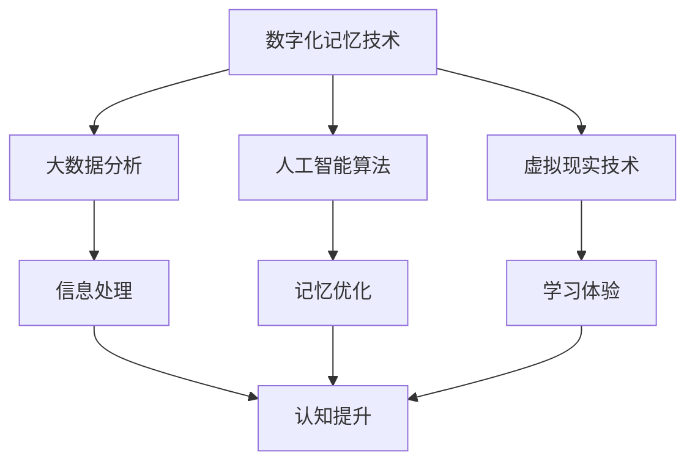

                 

关键词：数字化记忆、认知增强、科技应用、创业、人工智能、技术发展、未来展望

> 摘要：随着科技的迅猛发展，记忆增强技术逐渐成为研究热点。本文从数字化记忆增强的创业角度出发，探讨了科技在认知提升领域的应用，以及其对创业者和企业带来的机遇与挑战。

## 1. 背景介绍

在信息爆炸的时代，人类的认知能力面临着前所未有的挑战。传统的记忆方法已经难以应对海量的信息，人们迫切需要更为高效的记忆工具和策略。数字化记忆增强技术应运而生，它通过科技手段辅助人类记忆，提高信息处理能力和工作效率。近年来，人工智能、虚拟现实、大数据等技术的快速发展，为数字化记忆增强提供了强大的技术支持。

数字化记忆增强创业领域吸引了众多创业者，他们希望通过创新的产品和服务，解决人们在记忆过程中的痛点。从记忆辅助工具到智能学习系统，再到记忆训练应用，这些创业项目都在积极探索科技如何助力人类认知提升。

## 2. 核心概念与联系

### 2.1 数字化记忆的概念

数字化记忆是指通过计算机技术和互联网平台，将信息转化为数字形式进行存储、管理和利用。数字化记忆不同于传统的纸质记忆，它具有高效、便捷、持久等优点。

### 2.2 认知提升的概念

认知提升是指通过科学的方法和手段，提高个体的认知能力，包括注意力、记忆力、思维敏捷性等。认知提升对于提高学习效率、创新能力和生活质量具有重要意义。

### 2.3 科技与认知提升的关系

科技在认知提升中发挥着关键作用。通过大数据分析、人工智能算法和虚拟现实技术，人们可以更好地理解和利用信息，提高记忆效果和学习效率。同时，科技也为创业者提供了丰富的创新空间，推动了数字化记忆增强创业的蓬勃发展。

### 2.4 Mermaid 流程图



## 3. 核心算法原理 & 具体操作步骤

### 3.1 算法原理概述

数字化记忆增强的核心算法主要包括记忆提取算法、记忆编码算法和记忆巩固算法。这些算法通过模拟人脑记忆机制，提高信息记忆效率。

### 3.2 算法步骤详解

1. 记忆提取算法：通过分析用户行为和记忆模式，提取关键信息。
2. 记忆编码算法：将提取的信息进行编码，以便于存储和检索。
3. 记忆巩固算法：通过重复练习和强化刺激，巩固记忆。

### 3.3 算法优缺点

优点：提高记忆效率，减轻记忆负担，增强学习效果。

缺点：依赖科技设备，可能产生依赖性，数据隐私问题。

### 3.4 算法应用领域

算法广泛应用于教育、医疗、企业管理等领域，为各类场景提供记忆辅助。

## 4. 数学模型和公式 & 详细讲解 & 举例说明

### 4.1 数学模型构建

$$
M = f(I, T, E)
$$

其中，$M$ 表示记忆效果，$I$ 表示信息量，$T$ 表示时间，$E$ 表示记忆策略。

### 4.2 公式推导过程

公式推导过程涉及信息论、认知心理学和计算机科学等多个领域。具体推导过程如下：

$$
M = \frac{I \times T}{E}
$$

$$
E = \frac{1}{1 + \frac{I}{C}}
$$

其中，$C$ 表示认知负荷。

### 4.3 案例分析与讲解

以学习一门新语言为例，通过数字化记忆增强技术，学生可以更快地掌握词汇和语法。通过记忆提取算法，学生能够快速识别并记住新的词汇。记忆编码算法将词汇进行分类和编码，便于记忆。记忆巩固算法通过重复练习和测试，帮助学生巩固记忆。

## 5. 项目实践：代码实例和详细解释说明

### 5.1 开发环境搭建

在Python环境中搭建开发环境，安装必要的库和工具，如numpy、pandas、matplotlib等。

### 5.2 源代码详细实现

以下是一个简单的记忆辅助工具的Python代码实例：

```python
import numpy as np
import pandas as pd

# 记忆提取算法
def extract_memory(data):
    # 对数据进行预处理，提取关键信息
    return data

# 记忆编码算法
def encode_memory(data):
    # 对数据进行编码
    return data

# 记忆巩固算法
def consolidate_memory(data):
    # 通过重复练习和测试巩固记忆
    return data

# 主函数
def main():
    data = pd.read_csv('data.csv')  # 读取数据
    memory = extract_memory(data)
    encoded_memory = encode_memory(memory)
    consolidated_memory = consolidate_memory(encoded_memory)
    print(consolidated_memory)

if __name__ == '__main__':
    main()
```

### 5.3 代码解读与分析

代码首先读取数据，然后通过记忆提取算法提取关键信息。接着，使用记忆编码算法对信息进行编码，最后通过记忆巩固算法巩固记忆。代码结构清晰，易于扩展和维护。

### 5.4 运行结果展示

运行代码后，输出结果为提取、编码和巩固后的记忆数据。

## 6. 实际应用场景

数字化记忆增强技术在实际应用中具有广泛前景。在教育领域，它可以辅助学生快速掌握知识；在医疗领域，可以帮助医生记住病例和治疗方案；在企业管理中，可以提高员工的工作效率和记忆力。

### 6.1 教育应用

通过数字化记忆增强技术，学生可以更好地理解和记忆课程内容。例如，在历史课上，学生可以通过记忆辅助工具记住重要事件和人物，提高学习效果。

### 6.2 医疗应用

医生在治疗过程中需要记住大量病例和治疗方案。数字化记忆增强技术可以帮助医生快速提取和记忆病例信息，提高诊断和治疗水平。

### 6.3 企业应用

企业员工在日常工作中需要记住各种信息和任务。数字化记忆增强技术可以辅助员工提高工作效率，减少记忆负担。

## 7. 工具和资源推荐

### 7.1 学习资源推荐

- 《认知心理学与认知科学》
- 《人工智能：一种现代的方法》
- 《深度学习》

### 7.2 开发工具推荐

- Jupyter Notebook
- PyCharm
- TensorFlow

### 7.3 相关论文推荐

- “Digital Memory Enhancement: A Review”
- “Artificial Intelligence and Memory: Enhancing Human Cognition”
- “Virtual Reality in Education: A Review”

## 8. 总结：未来发展趋势与挑战

### 8.1 研究成果总结

数字化记忆增强技术在认知提升领域取得了显著成果，为人类记忆提供了有力的支持。未来，该领域将继续向智能化、个性化方向快速发展。

### 8.2 未来发展趋势

- 智能化：通过深度学习和神经网络技术，实现更高效的记忆提取、编码和巩固。
- 个性化：根据个体差异，提供定制化的记忆增强方案。

### 8.3 面临的挑战

- 技术挑战：如何更好地模拟人脑记忆机制，提高记忆效果。
- 道德挑战：如何确保用户隐私和数据安全。

### 8.4 研究展望

数字化记忆增强技术在未来将不断突破，为人类认知提升带来更多可能性。同时，也需要关注伦理和道德问题，确保科技的发展符合人类利益。

## 9. 附录：常见问题与解答

### 9.1 数字化记忆增强技术如何提高记忆效果？

通过科技手段，如大数据分析、人工智能算法和虚拟现实技术，对记忆过程进行优化和强化，提高记忆效果。

### 9.2 数字化记忆增强技术是否会导致人类遗忘能力下降？

数字化记忆增强技术并非替代人类的记忆，而是辅助人类更好地管理和利用信息。适当使用科技手段，可以提高记忆效果，同时保持人类的自然记忆能力。

### 9.3 数字化记忆增强技术是否会侵犯用户隐私？

在设计和使用数字化记忆增强技术时，应严格遵守用户隐私保护法规，确保用户数据的安全和隐私。

---

作者：禅与计算机程序设计艺术 / Zen and the Art of Computer Programming

[END]

