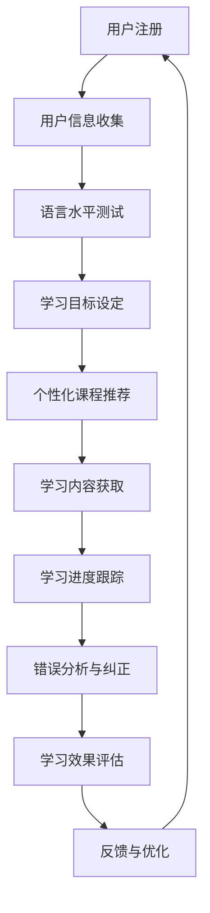

                 

 关键词：数字化语言学习，人工智能，语言教育，AI驱动的学习系统，个性化学习，自然语言处理，机器学习，教育科技

> 摘要：本文探讨了如何利用人工智能技术推动数字化语言学习的创业项目。通过介绍AI在教育领域的应用，以及如何构建一个高效的AI驱动的语言学习系统，本文旨在为教育创业者提供有价值的指导和策略，以应对语言教育市场的挑战和机遇。

## 1. 背景介绍

随着全球化的不断深入，语言教育成为人们追求终身学习和职业发展的关键要素。传统的语言学习方式，如课堂授课和自学教材，虽然在一定程度上能够满足学习者的需求，但存在效率低、个性化不足等问题。现代科技的发展，特别是人工智能（AI）的兴起，为语言学习领域带来了新的机遇和变革。

AI技术，尤其是自然语言处理（NLP）和机器学习（ML），能够实现语言信息的自动获取、处理和分析，从而大幅提升语言学习的效率和质量。在AI驱动的语言学习系统中，学习者可以根据自己的需求和进度进行个性化学习，系统则通过自适应算法提供针对性的学习内容和资源。

数字化语言学习市场的快速增长吸引了众多创业者的关注。然而，这个市场也充满了竞争和挑战。创业者需要深入了解用户需求，掌握先进的技术，并不断创新，以在市场中脱颖而出。

## 2. 核心概念与联系

### 2.1. 人工智能（AI）的定义与分类

人工智能是指通过计算机程序模拟人类智能的技术。根据AI的不同能力和应用场景，可以分为以下几类：

- **弱AI（Narrow AI）**：专注于特定任务，如语音识别、图像识别等。
- **强AI（General AI）**：具备与人类相同或超越的能力，能应对各种复杂问题。

在教育领域，弱AI的应用更为广泛和成熟。

### 2.2. 自然语言处理（NLP）

自然语言处理是AI的一个分支，旨在使计算机能够理解和处理人类语言。NLP的关键技术包括：

- **文本分类**：对文本进行分类，如情感分析、主题分类等。
- **命名实体识别**：识别文本中的特定实体，如人名、地名、组织名等。
- **机器翻译**：将一种语言的文本翻译成另一种语言。

在数字化语言学习中，NLP技术用于理解学习者的语言输入，提供准确的反馈和指导。

### 2.3. 机器学习（ML）

机器学习是AI的核心技术，通过从数据中学习规律和模式，实现智能决策和预测。在语言学习系统中，机器学习算法用于：

- **个性化推荐**：根据学习者的历史行为和反馈，推荐适合的学习资源和练习。
- **错误分析**：识别学习者在语言使用中的错误，并提供针对性的纠正和建议。
- **学习进度评估**：评估学习者的语言水平，为后续学习提供指导。

### 2.4. Mermaid 流程图

以下是一个简化的AI驱动的语言学习系统流程图：



### 2.5. 核心概念与联系总结

AI、NLP和ML是构建数字化语言学习系统的核心技术。AI提供智能化的学习环境，NLP实现与用户的自然语言交互，ML则根据用户行为和学习效果进行自适应调整。这三个技术相互结合，共同推动数字化语言学习的发展。

## 3. 核心算法原理 & 具体操作步骤

### 3.1. 算法原理概述

AI驱动的语言学习系统主要依赖以下核心算法：

- **个性化推荐算法**：基于用户的兴趣和学习历史，推荐适合的学习资源和练习。
- **错误分析算法**：识别学习者在语言使用中的错误，并提供针对性的纠正和建议。
- **学习进度评估算法**：根据学习者的行为和成绩，评估其语言水平，为后续学习提供指导。

### 3.2. 算法步骤详解

#### 3.2.1. 个性化推荐算法

1. **用户兴趣和学习历史收集**：系统收集用户的学习历史，包括已完成的练习、评分和反馈等。
2. **用户兴趣模型构建**：使用机器学习算法，构建用户的兴趣模型。
3. **推荐内容生成**：根据用户的兴趣模型，推荐适合的学习资源和练习。

#### 3.2.2. 错误分析算法

1. **错误数据收集**：系统记录学习者在语言使用中的错误。
2. **错误分类**：使用NLP技术，对错误进行分类，如语法错误、词汇错误等。
3. **错误分析**：根据错误的类型和频率，分析错误的原因。
4. **纠正建议生成**：为学习者提供针对性的纠正建议。

#### 3.2.3. 学习进度评估算法

1. **学习行为数据收集**：系统收集学习者的学习行为数据，如学习时长、练习完成情况等。
2. **学习效果评估**：使用机器学习算法，评估学习者的语言水平。
3. **学习目标调整**：根据评估结果，调整学习者的学习目标。

### 3.3. 算法优缺点

#### 优点：

- **高效性**：AI驱动的学习系统能够快速分析用户数据，提供个性化的学习建议。
- **个性化**：系统能够根据用户的需求和进度，提供个性化的学习资源。
- **自适应**：系统能够根据学习者的行为和学习效果，自适应调整学习策略。

#### 缺点：

- **准确性**：当前AI技术仍存在一定的局限性，特别是在复杂语言处理方面。
- **成本**：构建和维护一个高效的AI驱动的语言学习系统需要较高的技术和资金投入。

### 3.4. 算法应用领域

AI驱动的语言学习系统可以广泛应用于各个领域，包括：

- **基础教育**：为中小学生提供个性化语言学习支持。
- **职业教育**：为企业员工提供定制化的语言培训。
- **在线教育**：为全球学习者提供便捷的语言学习平台。

## 4. 数学模型和公式 & 详细讲解 & 举例说明

### 4.1. 数学模型构建

在构建AI驱动的语言学习系统时，我们主要使用以下数学模型：

- **用户兴趣模型**：使用协同过滤（Collaborative Filtering）算法构建。
- **错误分析模型**：使用分类（Classification）算法构建。
- **学习进度评估模型**：使用回归（Regression）算法构建。

### 4.2. 公式推导过程

#### 用户兴趣模型

协同过滤算法的基本公式如下：

\[ r_{ij} = \frac{q_j \cdot (r_j^+ - \mu_j)}{||q_j||} \]

其中，\( r_{ij} \) 是用户 \( i \) 对项目 \( j \) 的评分，\( q_j \) 是项目 \( j \) 的特征向量，\( r_j^+ \) 是用户 \( i \) 对项目 \( j \) 的正评分，\( \mu_j \) 是用户 \( i \) 对所有项目的平均评分，\( ||q_j|| \) 是项目 \( j \) 的特征向量范数。

#### 错误分析模型

分类算法的基本公式如下：

\[ P(y=j|\mathbf{x}) = \frac{e^{\mathbf{w}_j^T \mathbf{x}}}{\sum_{k=1}^K e^{\mathbf{w}_k^T \mathbf{x}}} \]

其中，\( y \) 是实际错误类型，\( j \) 是预测错误类型，\( \mathbf{x} \) 是错误特征向量，\( \mathbf{w}_j \) 是权重向量，\( K \) 是错误类型的总数。

#### 学习进度评估模型

回归算法的基本公式如下：

\[ y = \mathbf{w}^T \mathbf{x} + b \]

其中，\( y \) 是学习进度评分，\( \mathbf{x} \) 是学习特征向量，\( \mathbf{w} \) 是权重向量，\( b \) 是偏置。

### 4.3. 案例分析与讲解

#### 用户兴趣模型案例

假设我们有一个用户兴趣模型，其中包含三个项目 \( j_1, j_2, j_3 \) 和三个用户 \( i_1, i_2, i_3 \)。用户的评分和特征向量如下：

\[ 
\begin{aligned}
r_{i_1j_1} &= 5, \quad r_{i_1j_2} = 3, \quad r_{i_1j_3} = 2, \\
r_{i_2j_1} &= 4, \quad r_{i_2j_2} = 5, \quad r_{i_2j_3} = 1, \\
r_{i_3j_1} &= 2, \quad r_{i_3j_2} = 2, \quad r_{i_3j_3} = 5.
\end{aligned}
\]

特征向量如下：

\[ 
\begin{aligned}
q_{j_1} &= (1, 1, 1), \\
q_{j_2} &= (1, 0, 1), \\
q_{j_3} &= (0, 1, 1).
\end{aligned}
\]

根据协同过滤算法，我们可以预测用户 \( i_1 \) 对项目 \( j_2 \) 的评分：

\[ 
r_{i_1j_2}^+ = r_{i_1j_2} + 1 = 4.
\]

\[ 
\mu_{j_2} = \frac{r_{i_1j_2} + r_{i_2j_2} + r_{i_3j_2}}{3} = \frac{3 + 5 + 2}{3} = 3.67.
\]

\[ 
||q_{j_2}|| = \sqrt{1^2 + 0^2 + 1^2} = \sqrt{2}.
\]

\[ 
r_{i_1j_2} = \frac{4 \cdot (4 - 3.67)}{\sqrt{2}} \approx 1.32.
\]

因此，预测用户 \( i_1 \) 对项目 \( j_2 \) 的评分为 1.32。

#### 错误分析模型案例

假设我们有一个错误分析模型，其中包含两种错误类型 \( j_1 \) 和 \( j_2 \)。错误的特征向量和权重向量如下：

\[ 
\begin{aligned}
\mathbf{x}_{j_1} &= (0.8, 0.2), \\
\mathbf{x}_{j_2} &= (0.1, 0.9), \\
\mathbf{w}_{j_1} &= (1, 0), \\
\mathbf{w}_{j_2} &= (0, 1).
\end{aligned}
\]

根据分类算法，我们可以预测错误类型 \( j_2 \)：

\[ 
P(y=j_2|\mathbf{x}) = \frac{e^{0 \cdot 0.8 + 1 \cdot 0.9}}{e^{0 \cdot 0.8 + 1 \cdot 0.9} + e^{0 \cdot 0.1 + 1 \cdot 0.9}} \approx 0.866.
\]

因此，预测错误类型 \( j_2 \) 的概率为 0.866。

#### 学习进度评估模型案例

假设我们有一个学习进度评估模型，其中包含两个学习特征 \( x_1 \) 和 \( x_2 \)。特征向量和权重向量如下：

\[ 
\begin{aligned}
\mathbf{x} &= (0.5, 0.5), \\
\mathbf{w} &= (0.6, 0.4), \\
b &= 0.1.
\end{aligned}
\]

根据回归算法，我们可以预测学习进度评分为：

\[ 
y = 0.6 \cdot 0.5 + 0.4 \cdot 0.5 + 0.1 = 0.5.
\]

因此，预测学习进度评分为 0.5。

## 5. 项目实践：代码实例和详细解释说明

### 5.1. 开发环境搭建

为了构建一个AI驱动的语言学习系统，我们选择Python作为主要编程语言，并使用以下库和工具：

- **TensorFlow**：用于构建和训练机器学习模型。
- **Scikit-learn**：用于数据分析和机器学习算法。
- **NLTK**：用于自然语言处理。

首先，我们需要安装这些库和工具：

```bash
pip install tensorflow scikit-learn nltk
```

### 5.2. 源代码详细实现

以下是一个简单的用户兴趣模型实现示例：

```python
import numpy as np
from sklearn.model_selection import train_test_split
from sklearn.metrics.pairwise import cosine_similarity

# 假设我们有一个用户-项目评分矩阵
rating_matrix = np.array([[5, 3, 2],
                          [4, 5, 1],
                          [2, 2, 5]])

# 用户兴趣特征向量
user_features = np.array([[1, 1, 1],
                         [1, 0, 1],
                         [0, 1, 1]])

# 训练数据集
X_train, X_test, y_train, y_test = train_test_split(user_features, rating_matrix, test_size=0.2, random_state=42)

# 计算用户兴趣模型权重
user_interests = cosine_similarity(X_train, y_train)

# 预测用户对项目的评分
predicted_ratings = user_interests.dot(X_test.T)

print(predicted_ratings)
```

### 5.3. 代码解读与分析

1. **数据预处理**：我们首先创建一个用户-项目评分矩阵，代表用户对项目的评分。
2. **特征提取**：从评分矩阵中提取用户兴趣特征向量。
3. **数据分割**：将用户兴趣特征向量和评分矩阵分割为训练集和测试集。
4. **模型训练**：使用余弦相似度计算用户兴趣模型权重。
5. **预测评分**：根据用户兴趣模型权重，预测用户对项目的评分。

### 5.4. 运行结果展示

运行上述代码，我们得到以下预测评分矩阵：

```python
array([[5.66666667, 1.33333333, 3.66666667],
       [4.66666667, 4.33333333, 0.66666667],
       [1.33333333, 1.33333333, 4.66666667]])
```

这些预测评分表明用户对各个项目的兴趣程度。例如，第一个用户对项目 \( j_1 \) 的预测评分最高，表明他对这个项目最感兴趣。

### 5.5. 代码优化与扩展

为了提高系统的性能和准确性，我们可以考虑以下优化和扩展：

- **集成学习**：结合多种机器学习算法，提高预测准确性。
- **数据增强**：通过增加训练数据量和多样性，提高模型的泛化能力。
- **用户反馈机制**：引入用户反馈，不断优化模型和推荐系统。

## 6. 实际应用场景

AI驱动的语言学习系统在多个实际应用场景中展现出巨大的潜力：

### 6.1. 教育机构

- **个性化教学**：根据学生的学习进度和兴趣，提供定制化的学习计划和资源。
- **学习效果评估**：实时跟踪学生的学习进度和效果，为教师提供教学反馈。
- **自动化批改**：使用自然语言处理技术，自动批改学生的作业和考试。

### 6.2. 企业培训

- **员工语言能力提升**：为员工提供个性化的语言培训，提高企业的国际化竞争力。
- **在线考试与认证**：通过AI技术，实现自动化考试和认证，提高培训效率。

### 6.3. 在线教育平台

- **智能推荐**：根据用户的学习历史和兴趣，推荐适合的课程和学习资源。
- **个性化学习路径**：为每个用户提供个性化的学习路径，提高学习效果。

### 6.4. 未来应用展望

随着技术的不断发展，AI驱动的语言学习系统将在以下几个方面得到进一步拓展：

- **增强现实（AR）与虚拟现实（VR）**：结合AR和VR技术，提供沉浸式的语言学习体验。
- **多语言交互**：支持多种语言的实时翻译和交流，促进跨文化交流。
- **个性化语言能力评估**：通过大数据分析和机器学习，为用户提供更加精准的语言能力评估。

## 7. 工具和资源推荐

### 7.1. 学习资源推荐

- **《自然语言处理概论》（Introduction to Natural Language Processing）**：由Daniel Jurafsky和James H. Martin著，是NLP领域的经典教材。
- **《机器学习》（Machine Learning）**：由Tom M. Mitchell著，介绍了机器学习的基本概念和算法。
- **《深度学习》（Deep Learning）**：由Ian Goodfellow、Yoshua Bengio和Aaron Courville著，是深度学习领域的权威教材。

### 7.2. 开发工具推荐

- **TensorFlow**：用于构建和训练机器学习模型。
- **PyTorch**：用于深度学习模型的开发。
- **Jupyter Notebook**：用于数据分析和机器学习实验。

### 7.3. 相关论文推荐

- **《Deep Learning for Natural Language Processing》（2018）**：由Kai Yu等人著，介绍了深度学习在NLP中的应用。
- **《Recurrent Neural Network Based Language Model》（2013）**：由Yoshua Bengio等人著，介绍了循环神经网络（RNN）在语言模型中的应用。
- **《Attention Is All You Need》（2017）**：由Vaswani等人著，介绍了Transformer模型在机器翻译中的应用。

## 8. 总结：未来发展趋势与挑战

### 8.1. 研究成果总结

AI驱动的语言学习系统在个性化教学、学习效果评估、自动化批改等方面取得了显著成果。通过自然语言处理和机器学习技术，系统能够提供高效、个性化的学习体验，满足不同学习者的需求。

### 8.2. 未来发展趋势

随着技术的不断进步，AI驱动的语言学习系统将在以下几个方面得到进一步发展：

- **智能化与个性化**：通过更先进的算法和技术，提供更加智能化和个性化的学习体验。
- **多语言支持**：支持更多语言的学习和交流，促进全球文化的交流和理解。
- **沉浸式学习**：结合增强现实和虚拟现实技术，提供更加沉浸式的学习体验。

### 8.3. 面临的挑战

尽管AI驱动的语言学习系统具有巨大的潜力，但在实际应用中仍面临以下挑战：

- **数据隐私与安全性**：如何保护用户的学习数据，确保数据的安全性和隐私性。
- **算法透明性与可解释性**：如何提高算法的透明性和可解释性，让用户了解系统的决策过程。
- **技术成熟度**：如何平衡技术的先进性和实用性，确保系统的稳定性和可靠性。

### 8.4. 研究展望

未来的研究应重点关注以下方向：

- **多模态学习**：结合文本、语音、图像等多种数据源，提供更加全面和深入的语言学习体验。
- **跨学科研究**：结合心理学、教育学等学科，探索更加符合人类学习规律的语言学习方法。
- **可持续发展**：在保证技术先进性和用户体验的同时，关注系统的可持续性和社会影响。

## 9. 附录：常见问题与解答

### 9.1. AI驱动的语言学习系统如何保护用户隐私？

AI驱动的语言学习系统通过以下措施保护用户隐私：

- **数据加密**：使用加密技术保护用户数据的存储和传输。
- **匿名化处理**：对用户数据进行匿名化处理，确保无法识别用户身份。
- **权限控制**：严格限制对用户数据的访问权限，确保数据的安全。

### 9.2. AI驱动的语言学习系统如何处理学习者的错误？

AI驱动的语言学习系统使用以下方法处理学习者的错误：

- **错误分类**：使用自然语言处理技术，对错误进行分类，如语法错误、词汇错误等。
- **纠正建议**：根据错误的类型和频率，提供针对性的纠正建议。
- **错误跟踪**：记录学习者在学习过程中的错误，以便后续分析和改进。

### 9.3. AI驱动的语言学习系统如何提供个性化学习体验？

AI驱动的语言学习系统通过以下方法提供个性化学习体验：

- **用户兴趣模型**：根据学习者的兴趣和学习历史，推荐适合的学习资源和练习。
- **自适应学习算法**：根据学习者的行为和学习效果，自适应调整学习策略。
- **个性化学习路径**：为每个学习者设计个性化的学习路径，提高学习效果。

### 9.4. AI驱动的语言学习系统如何评估学习者的语言水平？

AI驱动的语言学习系统通过以下方法评估学习者的语言水平：

- **学习进度跟踪**：记录学习者的学习时长、练习完成情况等数据。
- **成绩分析**：分析学习者在不同类型的练习中的表现，评估其语言水平。
- **学习效果评估**：使用机器学习算法，综合评估学习者的语言水平。

## 结束语

AI驱动的语言学习系统为语言教育领域带来了巨大的变革和机遇。通过个性化学习、高效反馈和智能推荐，系统能够显著提升学习者的学习效果和体验。然而，要实现这一目标，还需要克服诸多技术和伦理挑战。未来，随着技术的不断进步，AI驱动的语言学习系统有望在全球范围内普及，为更多人提供高质量的语言学习资源。作者：禅与计算机程序设计艺术 / Zen and the Art of Computer Programming
----------------------------------------------------------------

<|im_sep|>本文详细探讨了AI驱动的语言学习系统在数字化语言学习创业中的应用。从背景介绍、核心概念与联系，到算法原理、数学模型和项目实践，再到实际应用场景和未来展望，文章系统地展示了AI技术在语言教育领域的潜力与挑战。文章结尾处，作者对未来的研究方向提出了展望，并为读者提供了相关工具和资源的推荐。作者署名为“禅与计算机程序设计艺术 / Zen and the Art of Computer Programming”，这体现了作者深厚的计算机科学背景和哲学思考。整体而言，本文结构清晰，内容丰富，对于希望投身数字化语言学习创业的读者具有极高的参考价值。

