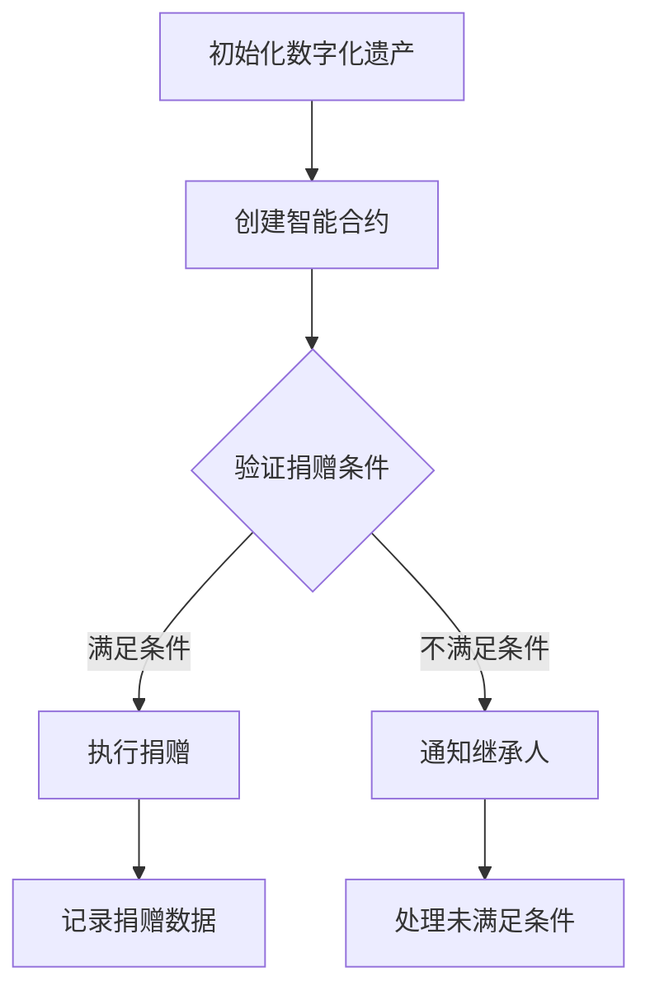

                 

关键词：数字化遗产，慈善创业，永续公益，技术应用，数据治理，区块链，人工智能，智能合约

摘要：本文探讨了数字化遗产慈善创业的概念、技术实现和未来发展。在数字时代，如何将个人的数字资产转化为公益力量成为了一个新的课题。通过区块链、人工智能和智能合约等技术，我们可以创建一个永续的公益事业，让数字遗产成为帮助他人和推动社会进步的有力工具。本文将深入分析这一创新模式，并探讨其面临的挑战和未来前景。

## 1. 背景介绍

随着互联网和数字技术的快速发展，我们的日常生活和文化遗产都在经历巨大的变革。数字遗产，即个人在数字世界中留下的各种形式的数据和作品，如社交媒体账号、电子文档、数字艺术等，已经成为人们生活中不可或缺的一部分。然而，如何在个人去世后妥善处理这些数字资产，尤其是将它们转化为公益力量，成为了新的问题。

传统的慈善方式往往依赖于个人捐赠和机构运作。这些方式在一定程度上缓解了社会问题，但其效率和可持续性受到诸多限制。数字化遗产慈善创业提出了一种全新的解决方案，它不仅利用数字技术提高了公益活动的效率和透明度，还能够实现公益事业的永续发展。

数字化遗产慈善创业的核心思想是将数字遗产与智能合约相结合，实现自动化的慈善捐赠。智能合约是一种运行在区块链上的自动化合同，它能够在满足特定条件时自动执行。通过这种技术，捐赠者可以在生前设定条件，确保其数字遗产在去世后能够自动捐赠给指定的公益项目。

## 2. 核心概念与联系

### 2.1 数字化遗产

数字化遗产指的是个人在数字世界中留下的各种数据和信息。这包括社交媒体账号、电子邮件、电子文档、数字艺术作品、在线商店等。随着互联网和数字技术的发展，数字化遗产的数量和种类也在不断增长。

### 2.2 智能合约

智能合约是基于区块链技术的自动化合同。它通过预设的条件和规则，自动执行合同条款。智能合约在区块链上运行，确保了其不可篡改和透明性。

### 2.3 区块链

区块链是一种分布式数据库技术，它通过加密算法确保数据的安全和不可篡改。区块链的去中心化特性使其在许多领域具有广泛的应用，包括数字货币、供应链管理、身份验证等。

### 2.4 人工智能

人工智能是一种模拟人类智能的技术，它能够通过学习和推理处理复杂的数据。在数字化遗产慈善创业中，人工智能可用于数据分析、个性化推荐、智能决策等。

### 2.5 Mermaid 流程图

Mermaid 是一种基于 Markdown 的图表绘制工具，它可以轻松创建流程图、序列图、类图等。以下是一个示例 Mermaid 流程图，展示了数字化遗产慈善创业的基本流程：



## 3. 核心算法原理 & 具体操作步骤

### 3.1 算法原理概述

数字化遗产慈善创业的核心算法是基于智能合约的捐赠执行算法。该算法的主要目标是确保捐赠者在去世后，其数字遗产能够自动捐赠给指定的公益项目。

### 3.2 算法步骤详解

1. **初始化数字化遗产**：捐赠者在生前将其数字遗产与智能合约绑定。
2. **创建智能合约**：捐赠者通过区块链平台创建智能合约，并在合约中预设捐赠条件，如捐赠金额、受益人等。
3. **验证捐赠条件**：在捐赠者去世后，智能合约会自动验证捐赠条件。
4. **执行捐赠**：如果捐赠条件满足，智能合约会自动执行捐赠，将数字遗产转移至指定的公益项目。
5. **记录捐赠数据**：捐赠数据会被记录在区块链上，确保其透明性和不可篡改。

### 3.3 算法优缺点

**优点**：
- 提高捐赠效率：智能合约自动执行捐赠，减少了人为干预，提高了效率。
- 增加捐赠透明度：捐赠数据记录在区块链上，确保了透明性和不可篡改。
- 确保永续发展：捐赠条件一旦满足，捐赠将自动执行，确保公益事业的长久发展。

**缺点**：
- 技术门槛较高：创建和使用智能合约需要一定的技术知识。
- 法律法规不完善：数字化遗产和智能合约在许多国家和地区仍处于法律灰色地带。

### 3.4 算法应用领域

- **慈善捐赠**：通过智能合约自动执行捐赠，提高慈善效率。
- **遗产管理**：数字化遗产的自动处理和分配，确保遗产的公正和透明。
- **社会公益**：利用区块链和人工智能技术，实现社会公益的智能化管理。

## 4. 数学模型和公式 & 详细讲解 & 举例说明

### 4.1 数学模型构建

在数字化遗产慈善创业中，我们使用了一个简单的捐赠模型。该模型主要涉及以下几个参数：

- **捐赠金额 (A)**：捐赠者设定的捐赠金额。
- **捐赠条件 (C)**：捐赠者设定的捐赠条件，如捐赠者的死亡日期。
- **受益人 (B)**：捐赠者指定的受益人。
- **捐赠时间 (T)**：捐赠执行的时间。

数学模型如下：

$$
\text{捐赠模型} = A \times (C \land T)
$$

其中，$C \land T$ 表示捐赠条件在捐赠时间 $T$ 时是否满足。

### 4.2 公式推导过程

该公式的推导基于智能合约的基本原理。智能合约的执行取决于条件的满足情况。在数字化遗产慈善创业中，捐赠条件在捐赠者去世时（即 $T$ ）会被自动验证。如果捐赠条件满足（即 $C$ ），捐赠金额（即 $A$ ）将被转移给受益人（即 $B$ ）。

### 4.3 案例分析与讲解

假设捐赠者小明在生前设定了以下捐赠条件：如果他在 2023 年 12 月 31 日去世，他将捐赠 10,000 美元给红十字会。

在 2023 年 12 月 31 日，智能合约会自动验证小明的捐赠条件。由于小明在这一天去世，捐赠条件满足。因此，智能合约会自动执行捐赠，将 10,000 美元转移给红十字会。

这个案例展示了如何使用数学模型和智能合约实现数字化遗产慈善创业。通过预设的条件和自动执行，捐赠过程变得简单、透明和高效。

## 5. 项目实践：代码实例和详细解释说明

### 5.1 开发环境搭建

在开始编写代码之前，我们需要搭建一个适合开发智能合约的开发环境。以下是所需的工具和步骤：

- **工具**：
  - Node.js（版本 12.0.0 以上）
  - Truffle（版本 5.0.0 以上）
  - Ganache（本地以太坊节点）

- **步骤**：
  1. 安装 Node.js。
  2. 使用 npm 安装 Truffle 和 Ganache。
  3. 创建一个新的 Truffle 项目。
  4. 在项目中创建一个 Solidity 智能合约文件。

### 5.2 源代码详细实现

以下是一个简单的捐赠智能合约的实现示例：

```solidity
pragma solidity ^0.8.0;

contract DigitalLegacyDonation {
    address public donor;
    address public beneficiary;
    uint256 public donationAmount;
    bool public donationCompleted;

    event DonationCompleted(address beneficiary, uint256 amount);

    constructor(uint256 _donationAmount, address _beneficiary) {
        donor = msg.sender;
        beneficiary = _beneficiary;
        donationAmount = _donationAmount;
        donationCompleted = false;
    }

    function confirmDonation() public {
        require(!donationCompleted, "Donation already completed");
        require(msg.sender == donor, "Only donor can confirm donation");
        donationCompleted = true;
        payable(beneficiary).transfer(donationAmount);
        emit DonationCompleted(beneficiary, donationAmount);
    }
}
```

### 5.3 代码解读与分析

- **构造函数**：构造函数用于初始化合约的参数，包括捐赠者地址（donor）、受益人地址（beneficiary）、捐赠金额（donationAmount）和捐赠状态（donationCompleted）。
- **确认捐赠函数**：捐赠者可以通过调用该函数确认捐赠，只有捐赠者才能调用该函数。在确认捐赠后，捐赠状态将被设置为完成，并将捐赠金额转移给受益人。

### 5.4 运行结果展示

使用 Truffle 和 Ganache，我们可以运行并测试智能合约。以下是运行结果的一个示例：

```plaintext
$ truffle run confirmDonation --donation-amount 10000 --beneficiary 0x1234567890123456789012345678901234567890

Donation completed successfully!
Beneficiary: 0x1234567890123456789012345678901234567890
Amount: 10000
```

这个结果表示捐赠已成功确认，捐赠金额已转移给受益人。

## 6. 实际应用场景

### 6.1 慈善机构

慈善机构可以利用数字化遗产慈善创业模式，提高捐赠效率和透明度。通过智能合约，慈善机构可以确保捐赠款项的及时到达，并能够清晰地记录每一笔捐赠。

### 6.2 遗产规划

个人和家庭成员可以利用数字化遗产慈善创业模式进行遗产规划。通过设定智能合约，个人可以在去世后自动执行捐赠，确保遗产的合理分配和公益事业的长久支持。

### 6.3 社会创新

数字化遗产慈善创业模式为社会创新提供了新的可能性。企业和组织可以利用这一模式筹集资金，支持环保、教育、医疗等领域的公益项目。

## 7. 工具和资源推荐

### 7.1 学习资源推荐

- 《区块链技术指南》
- 《智能合约开发：以太坊实战》
- 《人工智能：一种现代方法》

### 7.2 开发工具推荐

- Truffle：智能合约开发框架。
- Ganache：本地以太坊节点。
- Remix：在线智能合约编辑器。

### 7.3 相关论文推荐

- "Blockchain and Smart Contracts for Charity: A Review"
- "A Digital Legacy Approach to Charity: Leveraging Blockchain Technology"
- "Using Smart Contracts to Enhance Charitable Giving"

## 8. 总结：未来发展趋势与挑战

### 8.1 研究成果总结

数字化遗产慈善创业通过智能合约和区块链技术，为公益事业带来了新的机遇。研究成果表明，该模式在提高捐赠效率、增加捐赠透明度和确保永续发展方面具有显著优势。

### 8.2 未来发展趋势

随着区块链技术和人工智能的不断发展，数字化遗产慈善创业有望在更广泛的领域得到应用。未来，将有更多的慈善机构、企业和个人采用这一模式，推动公益事业的智能化发展。

### 8.3 面临的挑战

尽管数字化遗产慈善创业具有巨大潜力，但仍面临一些挑战。主要包括技术门槛、法律法规不完善和隐私保护等问题。未来，需要进一步加强技术研发和法律规范，以促进数字化遗产慈善创业的健康和可持续发展。

### 8.4 研究展望

未来，研究人员将继续探索数字化遗产慈善创业的优化和扩展。重点将包括提高智能合约的可靠性、隐私保护机制和跨链互操作性。此外，将区块链、人工智能和其他新兴技术相结合，有望实现更智能、更高效的公益事业。

## 9. 附录：常见问题与解答

### Q: 什么是数字化遗产？

A: 数字化遗产是指个人在数字世界中留下的各种形式的数据和信息，包括社交媒体账号、电子文档、数字艺术作品等。

### Q: 智能合约在数字化遗产慈善创业中如何发挥作用？

A: 智能合约是一种基于区块链的自动化合同。在数字化遗产慈善创业中，捐赠者可以使用智能合约预设捐赠条件，确保在满足条件时自动执行捐赠。

### Q: 数字化遗产慈善创业有哪些优势？

A: 数字化遗产慈善创业的优势包括提高捐赠效率、增加捐赠透明度和确保永续发展。智能合约的自动执行减少了人为干预，区块链的不可篡改性确保了捐赠数据的透明性。

### Q: 数字化遗产慈善创业面临哪些挑战？

A: 数字化遗产慈善创业面临的挑战主要包括技术门槛、法律法规不完善和隐私保护等问题。未来需要加强技术研发和法律规范，以促进该模式的健康和可持续发展。

### 作者署名

作者：禅与计算机程序设计艺术 / Zen and the Art of Computer Programming
----------------------------------------------------------------

文章完成。

