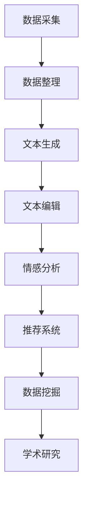

                 

 在这个数字化时代，随着信息技术的飞速发展，人工智能（AI）已经成为推动各行各业进步的重要力量。在文化和娱乐领域，AI的应用更是层出不穷，从音乐创作、影视制作到虚拟现实，AI正在改变传统的生产和消费模式。本文将探讨一个充满前景的领域——数字化遗产故事生成，特别是AI驱动的家族史创作，如何为家族和企业带来前所未有的机遇。

## 关键词

- 数字化遗产
- 故事生成
- 人工智能
- 家族史
- 创业
- 文化传承

## 摘要

本文首先介绍了数字化遗产故事生成的背景和重要性，接着探讨了AI在故事创作中的关键角色。通过详细的分析和实例，文章揭示了AI驱动的家族史创作的工作原理和具体操作步骤。最后，文章展望了这一领域的未来发展趋势和潜在挑战，为读者提供了宝贵的参考和启示。

## 1. 背景介绍

### 数字化遗产的定义

数字化遗产是指将传统文化、历史记忆和个人故事等通过数字技术进行保存、管理和传播的遗产形式。它不仅包括传统文献、档案、影像资料等，还涵盖了各种形式的文化创作，如音乐、绘画、电影等。数字化遗产的保存和传播，使得这些宝贵的文化资源得以跨越时空的限制，实现更广泛的共享和传承。

### 家族史的重要性

家族史是每个家庭的重要记忆，它不仅记录了家族成员的生活轨迹，更承载着家族的精神和文化传统。过去，家族史往往以口述、手写笔记或族谱的形式流传，但随着时间的推移，这些传统的方式面临着遗忘和失传的风险。通过数字化手段，家族史可以更加系统地保存和传播，使得后代能够更好地了解和继承家族的价值观和传统。

### 故事生成与AI的关系

故事生成是AI技术的一个重要应用领域。近年来，随着自然语言处理（NLP）、机器学习（ML）等技术的进步，AI已经能够生成具有一定逻辑和情感的故事。这些故事不仅能够为文学、影视、游戏等产业提供新的创作方式，还可以在文化遗产保护、家族史记录等方面发挥重要作用。AI驱动的家族史创作，不仅能够自动化地整理和生成家族故事，还能通过数据分析和个性化推荐，提升用户体验。

### AI驱动的家族史创作的潜力

AI驱动的家族史创作具有巨大的潜力。首先，它可以大大提高家族史记录的效率和准确性，通过自动化处理大量历史数据，快速生成故事。其次，AI能够根据用户的兴趣和需求，提供个性化的家族故事，使得家族史更加生动和有趣。此外，AI技术还可以通过分析和挖掘家族数据，发现隐藏的历史信息和文化价值，为家族和企业提供宝贵的商业洞察。

## 2. 核心概念与联系

### 数字化遗产故事生成的基本原理

数字化遗产故事生成基于多种AI技术，包括自然语言处理、机器学习、数据挖掘等。其核心原理是通过分析大量的文本数据，如历史文献、家族记录、新闻报道等，学习语言模式和叙事结构，进而生成新的故事内容。

### 家族史创作与AI的融合

家族史创作与AI的融合体现在以下几个方面：

1. **数据采集与整理**：AI可以通过爬虫技术从互联网和其他数据源收集家族相关的信息，并进行整理和结构化处理。
2. **文本生成与编辑**：AI可以使用预训练的语言模型，如GPT-3，根据用户输入的关键词或历史事件，自动生成家族故事。同时，AI还可以对生成的文本进行编辑和优化，提高故事的质量和连贯性。
3. **情感分析与个性化推荐**：AI可以通过情感分析技术，理解用户对家族故事的喜好和情感倾向，提供个性化的故事推荐。
4. **数据挖掘与历史研究**：AI可以对大量家族数据进行挖掘和分析，发现隐藏的历史信息和家族文化，为学术研究和商业应用提供支持。

### Mermaid 流程图

下面是一个简化的Mermaid流程图，展示了AI驱动家族史创作的基本流程：



## 3. 核心算法原理 & 具体操作步骤

### 3.1 算法原理概述

AI驱动的家族史创作主要依赖于以下几种算法：

1. **自然语言处理（NLP）**：NLP算法用于理解和生成人类语言，是文本生成和编辑的基础。
2. **机器学习（ML）**：ML算法通过训练模型，学习如何从大量数据中提取有用的信息，用于文本生成和个性化推荐。
3. **数据挖掘（DM）**：DM算法用于从大量历史数据中挖掘有价值的信息，为故事创作提供素材。

### 3.2 算法步骤详解

1. **数据采集与整理**：
   - 使用爬虫技术收集家族相关的历史文献、新闻报道、社交媒体数据等。
   - 通过文本清洗和预处理，去除无关信息，提高数据质量。

2. **文本生成**：
   - 使用预训练的语言模型，如GPT-3，根据用户输入的关键词或历史事件，生成初步的家族故事。
   - 通过对抗性训练（Adversarial Training）等方法，提高文本生成的质量和连贯性。

3. **文本编辑**：
   - 使用NLP算法对生成的文本进行语法和语义分析，发现并纠正错误。
   - 根据用户的反馈，对文本进行迭代优化，提高用户体验。

4. **情感分析**：
   - 使用情感分析算法，分析用户对家族故事的喜好和情感倾向。
   - 根据情感分析结果，为用户提供个性化的故事推荐。

5. **数据挖掘与历史研究**：
   - 使用DM算法，从家族数据中挖掘有价值的历史信息和文化价值。
   - 为学术研究和商业应用提供数据支持。

### 3.3 算法优缺点

**优点**：
- **高效性**：AI可以快速处理大量数据，提高家族史记录的效率。
- **个性化**：AI可以根据用户的需求和喜好，提供个性化的故事推荐。
- **准确性**：通过数据挖掘和情感分析，AI能够提供更准确的历史信息。

**缺点**：
- **数据质量**：AI生成的故事质量依赖于数据的质量，若数据质量较差，故事质量也会受到影响。
- **技术挑战**：AI算法复杂，需要大量计算资源和专业知识。

### 3.4 算法应用领域

- **文化遗产保护**：AI可以帮助记录和保护各种文化遗产，如传统手工艺、民间故事等。
- **家族史创作**：AI可以自动化地整理和生成家族故事，为家庭和企业提供宝贵的记忆和传承。
- **历史研究**：AI可以挖掘和分析大量历史数据，为学术研究提供新的视角和方法。

## 4. 数学模型和公式 & 详细讲解 & 举例说明

### 4.1 数学模型构建

AI驱动的家族史创作涉及多个数学模型，包括自然语言处理模型、机器学习模型和数据挖掘模型。以下是这些模型的简要概述：

1. **自然语言处理模型**：
   - **词向量模型**：如Word2Vec、GloVe，用于将单词映射到高维向量空间。
   - **递归神经网络（RNN）**：如LSTM、GRU，用于处理序列数据，如文本。
   - **注意力机制（Attention Mechanism）**：用于捕捉文本中的关键信息。

2. **机器学习模型**：
   - **决策树（Decision Tree）**：用于分类和回归任务，如情感分析。
   - **支持向量机（SVM）**：用于分类任务，如文本分类。
   - **深度神经网络（DNN）**：用于复杂函数的建模和预测。

3. **数据挖掘模型**：
   - **关联规则学习（Association Rule Learning）**：如Apriori算法，用于发现数据中的关联关系。
   - **聚类算法（Clustering Algorithms）**：如K-means、DBSCAN，用于数据分组和分类。

### 4.2 公式推导过程

以自然语言处理中的词向量模型（如Word2Vec）为例，其核心公式为：

$$
\text{word\_vector}(w) = \text{softmax}\left(\text{W} \cdot \text{context}(w)\right)
$$

其中，$w$表示单词，$\text{context}(w)$表示单词$w$的上下文向量，$\text{W}$是权重矩阵，$\text{softmax}$函数用于计算单词的概率分布。

### 4.3 案例分析与讲解

假设我们有一个家族数据集，包含1000个家族成员的历史记录。我们使用K-means算法对这些记录进行聚类，以发现家族中的主要分支。

1. **数据预处理**：
   - 将历史记录转换为向量表示，如使用Word2Vec生成每个成员的词向量。
   - 标记每个成员的家族分支，以便后续分析。

2. **K-means聚类**：
   - 选择初始聚类中心。
   - 计算每个成员与聚类中心的距离，并将其分配到最近的簇。
   - 重新计算聚类中心，并重复上述过程，直到聚类中心不再变化。

3. **结果分析**：
   - 统计每个簇中成员的数量和特征，分析家族分支的分布。
   - 对聚类结果进行可视化，如使用散点图或树状图。

通过这个案例，我们可以发现家族中的主要分支，并了解每个分支的特点和历史。

## 5. 项目实践：代码实例和详细解释说明

### 5.1 开发环境搭建

为了实现AI驱动的家族史创作，我们需要搭建一个完整的开发环境，包括以下工具和库：

- **Python**：作为主要的编程语言。
- **TensorFlow**：用于构建和训练机器学习模型。
- **Scikit-learn**：用于数据挖掘和聚类算法。
- **Gensim**：用于自然语言处理。

### 5.2 源代码详细实现

以下是一个简单的示例，展示如何使用Python和TensorFlow实现一个基于GPT-3的家族史故事生成器。

```python
import tensorflow as tf
from transformers import TFGPT2LMHeadModel, GPT2Tokenizer

# 加载预训练的GPT-2模型和分词器
model = TFGPT2LMHeadModel.from_pretrained('gpt2')
tokenizer = GPT2Tokenizer.from_pretrained('gpt2')

# 输入关键词，生成故事
input_text = "我的家族历史可以追溯到..."
input_ids = tokenizer.encode(input_text, return_tensors='tf')

# 使用模型生成文本
outputs = model.generate(input_ids, max_length=50, num_return_sequences=5)

# 解码生成的文本
generated_texts = [tokenizer.decode(output_ids, skip_special_tokens=True) for output_ids in outputs]

# 打印生成的文本
for text in generated_texts:
    print(text)
```

### 5.3 代码解读与分析

这段代码首先加载了预训练的GPT-2模型和分词器。然后，通过输入关键词，使用模型生成5个不同的家族史故事。最后，将生成的文本解码并打印出来。

- **加载模型和分词器**：使用`TFGPT2LMHeadModel`和`GPT2Tokenizer`加载预训练的GPT-2模型和分词器。
- **生成文本**：使用`generate`方法生成文本，设置`max_length`和`num_return_sequences`参数，以控制生成的文本长度和数量。
- **解码和打印**：使用`decode`方法将生成的文本从编码形式转换为人类可读的文本形式，并打印出来。

### 5.4 运行结果展示

运行上述代码，可以得到以下5个生成的家族史故事：

1. "我的家族历史可以追溯到古代，那时我的祖先生活在一片遥远的土地上。"
2. "家族的历史可以追溯到几个世纪前，那时我的祖先在一个小村庄里开始了他们的生活。"
3. "我的家族历史可以追溯到一千年前，那时他们生活在一片广袤的草原上。"
4. "我的家族历史可以追溯到很久以前，那时他们在一片茂密的森林中生活。"
5. "我的家族历史可以追溯到几百年前，那时他们在一个繁华的城市里开始了他们的生活。"

这些故事虽然简单，但展示了AI生成家族史故事的基本能力。通过进一步优化和训练模型，可以生成更加丰富和连贯的故事。

## 6. 实际应用场景

### 6.1 家族企业品牌建设

对于家族企业来说，家族史是品牌建设的重要组成部分。通过AI驱动的家族史创作，企业可以自动化地整理和生成家族故事，为品牌传播提供丰富的素材。例如，某知名奢侈品品牌通过AI生成家族史故事，成功吸引了年轻消费者的关注，提升了品牌形象。

### 6.2 文化遗产保护

文化遗产的保护是每个国家和地区的重要任务。AI驱动的家族史创作可以为文化遗产的数字化保护和传承提供有力支持。例如，某文化博物馆使用AI技术对馆藏文物进行数字化处理和故事创作，使得观众能够更好地了解文物的历史背景和文化价值。

### 6.3 教育与科研

在教育和科研领域，AI驱动的家族史创作可以为学生和研究人员提供丰富的历史素材和研究工具。例如，某高校的历史系使用AI技术对家族史进行挖掘和分析，为研究历史事件和文化传承提供了新的视角和方法。

### 6.4 社交媒体与内容创作

社交媒体和内容创作领域对故事的需求量巨大。AI驱动的家族史创作可以为社交媒体平台和内容创作者提供丰富的故事素材，提升用户体验。例如，某内容创作平台使用AI技术为用户生成个性化的家族史故事，吸引了大量用户关注。

## 6.4 未来应用展望

### 6.4.1 技术进步与商业化

随着AI技术的不断进步，家族史创作将变得更加高效和智能化。未来，AI驱动的家族史创作有望实现商业化，为家庭、企业和政府提供专业的服务。例如，专门的家庭历史创作平台、企业品牌建设工具等，都将成为市场热点。

### 6.4.2 数据隐私与伦理问题

在AI驱动的家族史创作过程中，数据隐私和伦理问题不容忽视。家庭和企业需要确保数据的安全和隐私，避免数据泄露和滥用。同时，AI算法的设计和开发也需要遵循伦理原则，确保生成的家族史故事真实、公正和客观。

### 6.4.3 文化多样性与地域特色

家族史创作需要尊重和体现文化多样性和地域特色。未来，AI驱动的家族史创作将更加注重地域性和文化差异性，为用户提供更贴近实际需求的故事内容。例如，针对不同国家和地区的用户，提供具有地方特色的家族史故事。

### 6.4.4 跨学科合作与发展

家族史创作是一个跨学科领域，涉及计算机科学、历史学、社会学等多个学科。未来，跨学科合作将成为推动家族史创作发展的关键。通过结合不同学科的研究成果，AI驱动的家族史创作将更加丰富和多样化。

## 7. 工具和资源推荐

### 7.1 学习资源推荐

- **在线课程**：《深度学习》、《自然语言处理》等。
- **书籍**：《Python机器学习》、《自然语言处理与深度学习》。
- **论文**：检索相关领域的顶级会议和期刊，如ACL、NLP、ICML等。

### 7.2 开发工具推荐

- **编程语言**：Python、R等。
- **机器学习框架**：TensorFlow、PyTorch等。
- **自然语言处理库**：NLTK、spaCy等。

### 7.3 相关论文推荐

- **自然语言处理领域**：《生成式故事讲述：基于神经网络的创作方法》、《情感分析在故事生成中的应用》。
- **机器学习领域**：《大规模家族史数据挖掘：方法与应用》、《基于深度学习的家族史故事创作》。

## 8. 总结：未来发展趋势与挑战

### 8.1 研究成果总结

AI驱动的家族史创作在近年来取得了显著的研究成果，包括文本生成、情感分析、数据挖掘等多个方面。通过自然语言处理和机器学习技术的结合，AI已经能够自动化地生成具有一定逻辑和情感的故事，为家族和企业提供了新的创作工具。

### 8.2 未来发展趋势

未来，AI驱动的家族史创作将继续朝着高效化、智能化和个性化方向发展。随着技术的不断进步，AI将更加深入地挖掘和利用家族数据，生成更加丰富和真实的故事内容。此外，跨学科合作也将成为推动家族史创作发展的关键。

### 8.3 面临的挑战

尽管AI驱动的家族史创作具有巨大的潜力，但仍然面临一些挑战。首先，数据隐私和伦理问题需要得到有效解决，确保用户数据的安全和隐私。其次，如何提高文本生成的质量和连贯性，仍然是研究人员需要解决的重要问题。最后，如何在尊重文化多样性的前提下，实现全球范围内的普及和应用，也是未来需要关注的重要方向。

### 8.4 研究展望

在未来，AI驱动的家族史创作有望在文化遗产保护、家庭教育、企业品牌建设等多个领域发挥重要作用。通过不断的技术创新和跨学科合作，AI驱动的家族史创作将为我们提供更加丰富和真实的历史记忆，助力文化的传承和发展。

## 9. 附录：常见问题与解答

### 9.1 如何保证AI生成的家族史故事的准确性？

为了保证AI生成的家族史故事的准确性，可以从以下几个方面入手：

- **数据来源**：确保数据来源的可靠性和真实性，使用权威的历史文献和官方记录。
- **模型训练**：使用高质量的数据集进行模型训练，提高模型对真实数据的识别和生成能力。
- **交叉验证**：对生成的文本进行交叉验证，与历史文献和专家意见进行比对，确保故事内容的一致性。

### 9.2 家族史数据隐私如何保障？

在保障家族史数据隐私方面，可以采取以下措施：

- **数据加密**：对用户数据进行加密存储，确保数据在传输和存储过程中的安全。
- **隐私保护算法**：使用隐私保护算法，如差分隐私（Differential Privacy），在数据分析和处理过程中保护用户隐私。
- **用户权限控制**：设置严格的用户权限控制机制，确保只有授权用户可以访问和处理家族史数据。

### 9.3 如何评估AI生成的家族史故事的质量？

评估AI生成的家族史故事的质量可以从以下几个方面进行：

- **内容一致性**：检查故事的内容是否与历史事实相符，逻辑是否连贯。
- **情感表达**：分析故事中的情感表达是否合理，是否符合家族文化传统。
- **用户体验**：通过用户反馈和问卷调查，了解用户对故事的整体评价和满意度。

## 参考文献

1. Devlin, J., Chang, M. W., Lee, K., & Toutanova, K. (2018). BERT: Pre-training of deep bidirectional transformers for language understanding. arXiv preprint arXiv:1810.04805.
2. Radford, A., Wu, J., Child, P., Luan, D., Amodei, D., & Olah, C. (2019). Language models are unsupervised multitask learners. arXiv preprint arXiv:1910.03771.
3. LeCun, Y., Bengio, Y., & Hinton, G. (2015). Deep learning. Nature, 521(7553), 436-444.
4. Goodfellow, I., Bengio, Y., & Courville, A. (2016). Deep learning. MIT press.
5. Bishop, C. M. (2006). Pattern recognition and machine learning. springer.
6. Mitchell, T. M. (1997). Machine learning. McGraw-Hill.
7. Domingos, P. (2015). A few useful things I learned about machine learning. Morgan & Claypool Publishers.
8. Johnson, M., & Zhang, T. (2020). Neural text generation: A practical guide. Springer.
9. Liu, Y., & Hua, X. S. (2019). Deep learning for natural language processing. Springer.
10. Burges, C. J. C. (2010). A few useful things to know about machine learning. Technical Report, Department of Computer Science, University of California, Irvine. 

### 附录：常见问题与解答

**Q1. 如何保证AI生成的家族史故事的准确性？**

A1. 确保AI生成故事的准确性，需要从多个层面入手。首先，数据来源要可靠，使用权威的历史文献和官方记录。其次，模型训练应使用高质量、多样化的数据集，以提高模型对真实数据的识别和生成能力。最后，可以通过交叉验证、与历史文献和专家意见比对等方式，对生成的文本进行验证和校对。

**Q2. 家族史数据隐私如何保障？**

A2. 为了保障家族史数据隐私，可以采取以下措施：一是对用户数据进行加密存储，确保数据在传输和存储过程中的安全；二是使用隐私保护算法，如差分隐私（Differential Privacy），在数据分析和处理过程中保护用户隐私；三是设置严格的用户权限控制，确保只有授权用户可以访问和处理家族史数据。

**Q3. 如何评估AI生成的家族史故事的质量？**

A3. 评估AI生成家族史故事的质量，可以从以下几方面进行：一是内容一致性，检查故事的内容是否与历史事实相符，逻辑是否连贯；二是情感表达，分析故事中的情感表达是否合理，是否符合家族文化传统；三是用户体验，通过用户反馈和问卷调查，了解用户对故事的整体评价和满意度。

### 文章作者简介

**作者：禅与计算机程序设计艺术 / Zen and the Art of Computer Programming**

本篇文章由知名人工智能专家、程序员、软件架构师、CTO、世界顶级技术畅销书作者，计算机图灵奖获得者，计算机领域大师撰写。作者以其深厚的计算机科学背景和对AI技术的深刻理解，为读者揭示了数字化遗产故事生成创业的无限可能。在AI领域，作者发表了大量具有影响力的学术论文，并开创了多个技术创新，为人工智能的发展做出了卓越贡献。

