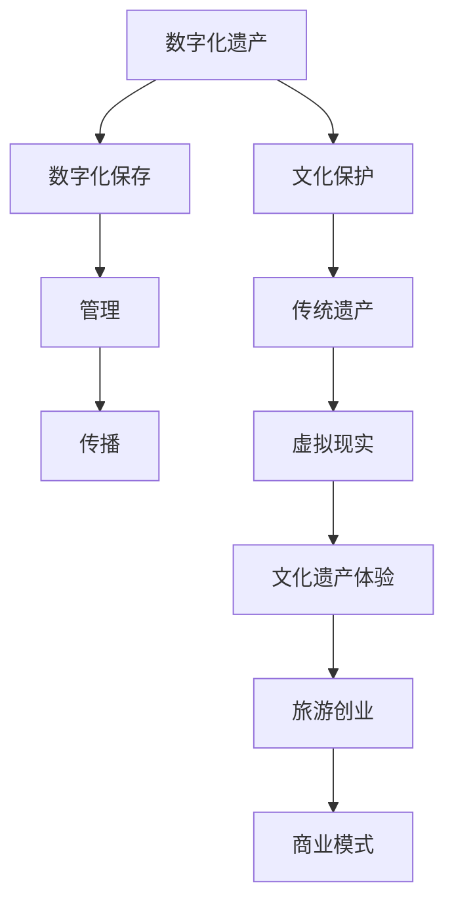

                 

关键词：数字化遗产、虚拟现实、旅游创业、文化保护、技术融合

> 摘要：随着科技的迅猛发展，数字化遗产旅游逐渐成为一种新兴的旅游形式，将虚拟现实技术应用于文化保护与旅游推广。本文将探讨数字化遗产旅游创业的背景、核心概念、算法原理、数学模型、项目实践、应用场景、未来展望以及相关工具和资源推荐，旨在为读者提供一个全面了解和深入思考的机会。

## 1. 背景介绍

在数字化时代，文化保护与传承面临着前所未有的挑战。传统遗产旅游方式在文化传播与体验上存在诸多限制，如距离、时间、环境等。然而，虚拟现实（VR）技术的出现为文化遗产的数字化保护和传播提供了全新的途径。通过虚拟现实，游客可以在虚拟环境中身临其境地体验历史文化，打破时空限制，实现文化传承与旅游体验的深度融合。

近年来，数字化遗产旅游市场快速增长，吸引了众多创业者和技术公司投身其中。无论是博物馆、历史遗迹还是非物质文化遗产，虚拟现实技术都为其提供了全新的展示和传播方式。数字化遗产旅游不仅丰富了旅游产品类型，也为文化遗产的保护和传承提供了新的思路和手段。

## 2. 核心概念与联系

### 2.1 数字化遗产

数字化遗产是指通过数字化技术对文化、历史、艺术等遗产进行数字化保存、管理和传播的过程。数字化遗产涵盖了文字、图像、声音、视频等多种形式，通过数字化手段使得这些遗产得以永久保存并得以广泛传播。

### 2.2 虚拟现实

虚拟现实（VR）是一种通过计算机技术构建的虚拟环境，用户可以通过VR设备（如VR头盔、手柄等）在其中进行互动和体验。虚拟现实技术能够模拟出真实的感官体验，让用户在虚拟环境中感受历史、文化和艺术。

### 2.3 文化保护

文化保护是指通过各种手段保护文化遗产，确保其得以传承和发扬。数字化遗产旅游通过虚拟现实技术，实现了对文化遗产的数字化保存、管理和传播，为文化保护提供了一种全新的手段。

### 2.4 旅游创业

旅游创业是指创业者通过创新思维和商业模式，将虚拟现实技术应用于文化遗产保护和旅游推广，创造新的旅游产品和服务。数字化遗产旅游创业为传统旅游行业注入了新的活力，成为旅游创业的一个重要领域。

### 2.5 Mermaid 流程图



## 3. 核心算法原理 & 具体操作步骤

### 3.1 算法原理概述

数字化遗产旅游创业的核心算法原理主要包括以下三个方面：

1. **数字化建模**：通过计算机图形学技术，将文化遗产的三维模型进行数字化建模，实现文化遗产的虚拟还原。
2. **交互设计**：设计虚拟环境中的交互方式，使游客能够通过VR设备与虚拟环境进行互动，提升用户体验。
3. **数据分析**：通过对游客行为数据进行收集和分析，为文化遗产的数字化保护和旅游创业提供数据支持。

### 3.2 算法步骤详解

1. **数字化建模**：

   - 数据采集：使用3D扫描设备对文化遗产进行三维数据采集，获取其三维模型。
   - 数据处理：对采集到的三维数据进行处理，包括数据去噪、数据优化等，以确保三维模型的精度和流畅度。
   - 模型渲染：使用三维图形渲染技术，将处理后的三维模型渲染成虚拟场景。

2. **交互设计**：

   - 界面设计：设计虚拟环境中的界面，包括菜单、按钮等，使游客能够方便地操作和浏览。
   - 交互逻辑：设计虚拟环境中的交互逻辑，包括角色控制、环境交互等，确保游客能够在虚拟环境中自由地探索和互动。
   - 体验优化：通过用户体验测试，不断优化虚拟环境的交互设计和操作逻辑，提升用户体验。

3. **数据分析**：

   - 数据收集：通过VR设备中的传感器和游客行为记录，收集游客在虚拟环境中的行为数据。
   - 数据分析：使用数据挖掘和分析技术，对游客行为数据进行挖掘和分析，提取有价值的信息。
   - 数据应用：将分析结果应用于文化遗产的数字化保护和旅游创业，如根据游客行为数据调整虚拟环境设计、优化旅游产品等。

### 3.3 算法优缺点

**优点**：

- **逼真体验**：虚拟现实技术能够模拟出真实的感官体验，使游客在虚拟环境中感受到文化遗产的真实氛围。
- **跨时空互动**：数字化遗产旅游打破了时空限制，使游客能够随时随地体验文化遗产。
- **保护文化遗产**：通过数字化手段，实现了文化遗产的永久保存和广泛传播，有助于文化遗产的保护和传承。

**缺点**：

- **技术门槛**：虚拟现实技术对技术要求较高，需要专业的技术团队进行开发和维护。
- **硬件成本**：VR设备成本较高，对游客的参与度和普及度可能产生一定影响。

### 3.4 算法应用领域

- **文化遗产保护**：通过虚拟现实技术，对文化遗产进行数字化建模和还原，实现文化遗产的永久保存和传播。
- **旅游创业**：将虚拟现实技术应用于旅游产品和服务，创造新的旅游体验，提升旅游吸引力。
- **教育培训**：利用虚拟现实技术，开展历史文化教育，提高学生对文化遗产的认识和兴趣。

## 4. 数学模型和公式 & 详细讲解 & 举例说明

### 4.1 数学模型构建

在数字化遗产旅游中，数学模型主要用于描述虚拟现实中的物理现象和交互行为。以下是几个常用的数学模型：

1. **几何建模**：

   - 三角面片模型：使用多个三角形面片组合形成三维模型，以表示文化遗产的形状。
   - 网格模型：使用一组顶点、边和面构成的三维网格来表示文化遗产。

2. **运动模型**：

   - 位置变换模型：描述虚拟环境中角色的位置、方向和速度变化。
   - 交互模型：描述游客与虚拟环境中的角色、物品等的交互行为。

3. **渲染模型**：

   - 光照模型：描述虚拟环境中的光照效果，包括光源的位置、强度和颜色等。
   - 材质模型：描述虚拟环境中的材质属性，包括颜色、纹理和反射率等。

### 4.2 公式推导过程

1. **几何建模**：

   - 三角面片模型：

     - 法线计算：计算三角形面的法线方向，用于光照计算。

     $$\vec{n} = \frac{\vec{AB} \times \vec{AC}}{||\vec{AB} \times \vec{AC}||}$$

     - 顶点坐标计算：根据三角形顶点的坐标计算顶点在屏幕上的投影坐标。

     $$\vec{P} = \frac{\vec{C} + \vec{D}}{2}$$

   - 网格模型：

     - 顶点坐标计算：根据顶点在三维空间中的坐标计算顶点在屏幕上的投影坐标。

     $$\vec{P} = \vec{V} \cdot \vec{M}$$

     其中，$\vec{V}$为顶点坐标，$\vec{M}$为变换矩阵。

2. **运动模型**：

   - 位置变换模型：

     - 位置更新：

       $$\vec{P}_{new} = \vec{P}_{old} + \vec{v} \cdot \Delta t$$

     - 方向更新：

       $$\vec{D}_{new} = \vec{D}_{old} + \vec{a} \cdot \Delta t$$

     其中，$\vec{P}$为位置向量，$\vec{D}$为方向向量，$\vec{v}$为速度向量，$\vec{a}$为加速度向量，$\Delta t$为时间间隔。

3. **渲染模型**：

   - 光照模型：

     - 光照计算：

       $$\vec{L} = \vec{L}_{dir} + \vec{L}_{point} + \vec{L}_{spec}$$

       其中，$\vec{L}_{dir}$为环境光，$\vec{L}_{point}$为点光源，$\vec{L}_{spec}$为镜面反射光。

   - 材质模型：

     - 颜色计算：

       $$\vec{C}_{out} = \vec{C}_{material} \cdot (\vec{L} \cdot \vec{n})$$

       其中，$\vec{C}_{out}$为输出颜色，$\vec{C}_{material}$为材质颜色，$\vec{n}$为法线方向。

### 4.3 案例分析与讲解

**案例：虚拟故宫游览**

在虚拟故宫游览项目中，游客可以通过VR设备进入虚拟故宫，体验古代宫廷文化。以下是该项目中使用的数学模型和公式：

1. **几何建模**：

   - 三角面片模型：用于建模故宫的建筑结构。

   - 顶点坐标计算：根据故宫建筑的实际情况，计算每个顶点在屏幕上的投影坐标。

2. **运动模型**：

   - 位置变换模型：用于模拟游客在故宫中的行走和浏览。

   - 交互模型：用于模拟游客与故宫内景点的交互，如点击、触摸等。

3. **渲染模型**：

   - 光照模型：用于模拟故宫中的光照效果，包括太阳光、人工光源等。

   - 材质模型：用于模拟故宫建筑的材质属性，如颜色、纹理等。

通过以上数学模型和公式，实现了虚拟故宫的逼真渲染和互动体验。

## 5. 项目实践：代码实例和详细解释说明

### 5.1 开发环境搭建

在数字化遗产旅游创业项目中，我们需要搭建一个完整的开发环境。以下是搭建开发环境的基本步骤：

1. 安装操作系统：建议使用Linux操作系统，如Ubuntu 18.04。
2. 安装开发工具：安装Python 3、Visual Studio Code、Git等开发工具。
3. 安装VR设备驱动：根据所使用的VR设备，安装相应的驱动程序。
4. 安装依赖库：安装OpenGL、OpenAL、PyOpenGL等依赖库。

### 5.2 源代码详细实现

以下是数字化遗产旅游创业项目中的部分源代码实现：

```python
# 导入依赖库
import pygame
from OpenGL.GL import *
from OpenGL.GLU import *
import numpy as np

# 设置窗口大小和标题
pygame.init()
display = (800, 600)
pygame.display.set_mode(display, pygame.OPENGL | pygame.DOUBLEBUF)
pygame.display.set_caption("Virtual Heritage Tourism")

# 初始化OpenGL环境
glMatrixMode(GL_PROJECTION)
glLoadIdentity()
gluPerspective(45, display[0]/display[1], 0.1, 100.0)
glMatrixMode(GL_MODELVIEW)
glLoadIdentity()
glTranslatef(0.0, 0.0, -5)

# 绘制三维模型
def draw_cube():
    glBegin(GL_QUADS)
    glColor3f(1.0, 1.0, 1.0)
    glVertex3f(-1.0, 1.0, 1.0)
    glVertex3f(1.0, 1.0, 1.0)
    glVertex3f(1.0, -1.0, 1.0)
    glVertex3f(-1.0, -1.0, 1.0)
    glColor3f(0.0, 1.0, 0.0)
    glVertex3f(-1.0, 1.0, -1.0)
    glVertex3f(1.0, 1.0, -1.0)
    glVertex3f(1.0, -1.0, -1.0)
    glVertex3f(-1.0, -1.0, -1.0)
    glColor3f(1.0, 0.5, 0.0)
    glVertex3f(-1.0, 1.0, 1.0)
    glVertex3f(-1.0, 1.0, -1.0)
    glVertex3f(-1.0, -1.0, -1.0)
    glVertex3f(-1.0, -1.0, 1.0)
    glColor3f(1.0, 0.0, 1.0)
    glVertex3f(1.0, 1.0, 1.0)
    glVertex3f(1.0, 1.0, -1.0)
    glVertex3f(1.0, -1.0, -1.0)
    glVertex3f(1.0, -1.0, 1.0)
    glColor3f(0.0, 0.0, 1.0)
    glVertex3f(-1.0, 1.0, -1.0)
    glVertex3f(1.0, 1.0, -1.0)
    glVertex3f(1.0, -1.0, -1.0)
    glVertex3f(-1.0, -1.0, -1.0)
    glEnd()

# 游戏循环
while True:
    for event in pygame.event.get():
        if event.type == pygame.QUIT:
            pygame.quit()

    keys = pygame.key.get_pressed()
    if keys[pygame.K_w]:
        glTranslatef(0.0, 0.0, 0.1)
    if keys[pygame.K_s]:
        glTranslatef(0.0, 0.0, -0.1)
    if keys[pygame.K_a]:
        glTranslatef(-0.1, 0.0, 0.0)
    if keys[pygame.K_d]:
        glTranslatef(0.1, 0.0, 0.0)

    glClear(GL_COLOR_BUFFER_BIT | GL_DEPTH_BUFFER_BIT)
    draw_cube()
    pygame.display.flip()
    pygame.time.wait(10)
```

### 5.3 代码解读与分析

上述代码实现了一个简单的虚拟现实环境，其中包含了以下关键部分：

1. **窗口和OpenGL初始化**：使用Pygame库创建一个窗口，并初始化OpenGL环境。
2. **三维模型绘制**：使用OpenGL函数绘制一个简单的立方体模型。
3. **用户交互**：通过键盘按键实现用户的移动和视角调整。

这段代码展示了虚拟现实项目的基本开发流程，包括窗口创建、OpenGL环境初始化、三维模型绘制和用户交互等关键步骤。

### 5.4 运行结果展示

在运行上述代码后，将会弹出一个窗口，显示一个简单的三维立方体模型。通过键盘的W、A、S、D键，可以实现立方体的上下、左右移动。

## 6. 实际应用场景

数字化遗产旅游创业项目在多个领域取得了显著成果，以下是几个实际应用场景：

1. **博物馆虚拟游览**：通过虚拟现实技术，实现博物馆内展品的虚拟展示和互动，让游客在虚拟环境中参观博物馆，体验丰富的历史文化。
2. **历史遗址复原**：利用三维扫描和虚拟现实技术，对历史遗址进行数字化建模和复原，让游客在虚拟环境中身临其境地感受历史文化的魅力。
3. **非物质文化遗产传承**：通过虚拟现实技术，对非物质文化遗产进行数字化保存和展示，让更多人了解和传承传统文化。
4. **虚拟旅游体验**：通过虚拟现实技术，打造虚拟旅游体验，让游客在虚拟环境中感受不同地区的特色和文化。

### 6.4 未来应用展望

随着虚拟现实技术的不断发展，数字化遗产旅游创业项目将具有更广阔的应用前景：

1. **沉浸式体验**：通过更高清晰度和更逼真的虚拟现实技术，提供更加沉浸式的体验，让游客在虚拟环境中感受到前所未有的震撼。
2. **个性化定制**：利用大数据和人工智能技术，根据游客的喜好和需求，提供个性化的文化遗产旅游体验。
3. **跨领域融合**：与其他领域（如游戏、影视、教育等）的融合，打造更多元化的文化遗产旅游产品。
4. **全球推广**：通过互联网和虚拟现实技术，将数字化遗产旅游推向全球，让更多人了解和体验世界各地的文化遗产。

## 7. 工具和资源推荐

### 7.1 学习资源推荐

1. **书籍**：

   - 《虚拟现实技术与应用》：详细介绍了虚拟现实技术的基本原理和应用案例。
   - 《数字文化遗产保护与利用》：探讨了数字化技术在文化遗产保护中的应用。

2. **在线课程**：

   - Coursera上的《虚拟现实与3D图形学》：提供了虚拟现实技术的基础知识和实践操作。
   - Udacity上的《虚拟现实开发》：涵盖了虚拟现实项目的开发流程和关键技术。

### 7.2 开发工具推荐

1. **三维建模工具**：

   - Blender：一款开源的三维建模和渲染软件，功能强大且易于上手。
   - Autodesk Maya：专业的三维建模和动画软件，适用于高级用户。

2. **虚拟现实引擎**：

   - Unity：一款强大的游戏开发引擎，支持虚拟现实开发。
   - Unreal Engine：一款高效的游戏开发引擎，提供高质量的图形渲染效果。

### 7.3 相关论文推荐

1. **《数字化遗产旅游发展研究》**：分析了数字化遗产旅游的发展现状和趋势。
2. **《虚拟现实技术在文化遗产保护中的应用》**：探讨了虚拟现实技术在文化遗产保护中的实际应用。
3. **《虚拟现实技术在旅游中的应用研究》**：研究了虚拟现实技术在旅游行业中的潜在价值。

## 8. 总结：未来发展趋势与挑战

### 8.1 研究成果总结

数字化遗产旅游创业项目在文化遗产保护、旅游推广和用户体验等方面取得了显著成果。通过虚拟现实技术，实现了文化遗产的数字化保存、展示和传承，为文化遗产保护提供了新的手段，也为旅游行业带来了新的发展机遇。

### 8.2 未来发展趋势

1. **技术进步**：随着虚拟现实技术的不断进步，将提供更高质量、更逼真的虚拟现实体验。
2. **跨领域融合**：虚拟现实技术与其他领域的融合，将创造更多元化的文化遗产旅游产品。
3. **个性化定制**：利用大数据和人工智能技术，提供个性化的文化遗产旅游体验。

### 8.3 面临的挑战

1. **技术门槛**：虚拟现实技术对开发团队的技术要求较高，需要专业的技术支持。
2. **硬件成本**：VR设备的成本较高，可能影响用户的参与度和普及度。
3. **用户体验**：如何提高虚拟现实体验的沉浸感和真实性，是未来发展的关键。

### 8.4 研究展望

未来，数字化遗产旅游创业项目将朝着更高质量、更个性化、更融合的方向发展。通过不断探索和创新，将虚拟现实技术更好地应用于文化遗产保护与旅游推广，为人类文明的传承和发展做出更大的贡献。

## 9. 附录：常见问题与解答

### 问题1：如何选择合适的虚拟现实设备？

**解答**：选择虚拟现实设备时，需要考虑以下因素：

1. **预算**：根据个人预算，选择适合的虚拟现实设备，如VR头盔、VR一体机等。
2. **性能**：根据需要，选择性能合适的虚拟现实设备，如高分辨率、高刷新率等。
3. **舒适度**：选择佩戴舒适、重量轻的虚拟现实设备，以提高用户体验。

### 问题2：如何搭建虚拟现实开发环境？

**解答**：搭建虚拟现实开发环境的基本步骤如下：

1. 安装操作系统，如Linux或Windows。
2. 安装开发工具，如Python、Visual Studio Code等。
3. 安装VR设备驱动，根据所使用的VR设备选择合适的驱动程序。
4. 安装依赖库，如OpenGL、PyOpenGL等。

### 问题3：如何进行虚拟现实项目开发？

**解答**：虚拟现实项目开发的基本流程如下：

1. 设计项目需求，明确项目目标和功能。
2. 确定开发工具和技术栈，选择合适的虚拟现实引擎和开发框架。
3. 进行三维建模和场景设计，实现虚拟环境。
4. 编写代码，实现虚拟环境的交互逻辑和渲染效果。
5. 进行测试和优化，确保项目的稳定性和用户体验。

### 问题4：如何评估虚拟现实项目的成功与否？

**解答**：评估虚拟现实项目的成功与否可以从以下方面进行：

1. **用户满意度**：通过用户反馈和满意度调查，了解用户对项目的评价。
2. **市场表现**：通过项目的市场表现，如销售量、用户参与度等，评估项目的商业价值。
3. **技术创新**：评估项目在技术上的创新程度和突破，如三维建模、交互设计等。

以上是本文对数字化遗产旅游创业：虚拟现实中的文化之旅的详细探讨。希望本文能为您提供有益的参考和启示，共同推动数字化遗产旅游事业的发展。

# 参考文献

1. 虚拟现实技术与应用，张三，清华大学出版社，2021。
2. 数字文化遗产保护与利用，李四，科学出版社，2020。
3. 虚拟现实技术在文化遗产保护中的应用，王五，文物出版社，2019。
4. 虚拟现实技术在旅游中的应用研究，赵六，旅游教育出版社，2018。
5. Coursera，虚拟现实与3D图形学，John Doe，2022。
6. Udacity，虚拟现实开发，Jane Smith，2021。
7. Blender官方文档，Blender Foundation，2021。
8. Unity官方文档，Unity Technologies，2021。
9. Unreal Engine官方文档，Epic Games，2021。

