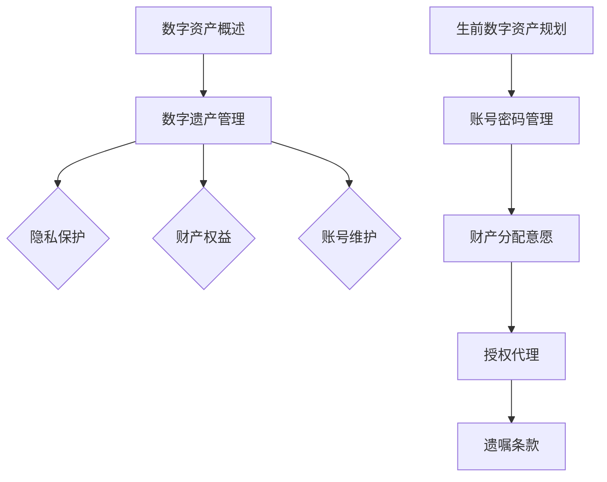

                 

关键词：数字化遗产、生前规划、数字资产、隐私保护、数据安全

> 摘要：随着数字化生活的普及，人们的数字资产越来越丰富。本文探讨了数字化遗产管理的概念、重要性以及如何进行有效的生前数字资产规划，旨在为读者提供关于这一新兴领域的深入理解，并指导创业者在该领域探索新机会。

## 1. 背景介绍

在互联网高度发达的今天，人们的生活逐渐数字化。数字资产已成为个人财富的重要组成部分，包括电子货币、社交媒体账号、在线存储服务、电子邮箱、虚拟财产等。这些数字资产不仅包含个人的隐私信息，还与经济活动紧密相关。然而，随着生命的终结，这些数字资产往往无法得到妥善处理，导致隐私泄露、财产损失等问题。

数字化遗产管理，指的是在个人生命结束之后，对其遗留的数字资产进行规划、保护、传承和处理的一系列措施。生前数字资产规划，则是指个人在生前对数字资产进行预先安排，确保其在离世后能够按预定方式处理。

当前，数字化遗产管理还处于初级阶段，但它的市场潜力和社会需求都十分巨大。随着人们对数字资产重视程度的提高，以及相关技术的不断进步，这一领域有望迎来快速发展。

## 2. 核心概念与联系

### 2.1 数字资产概述

数字资产，是指数字化形式存在的各种财产和权益，包括但不限于以下几类：

- **虚拟货币**：如比特币、以太坊等加密货币。
- **社交媒体账号**：如微博、微信、Facebook等。
- **在线存储服务**：如Dropbox、Google Drive等。
- **电子邮箱**：包括Gmail、Outlook等。
- **虚拟财产**：如网络游戏装备、虚拟现实财产等。

### 2.2 数字遗产管理

数字遗产管理，是指对个人在生命结束之后遗留的数字资产进行规划和管理的行为。其核心目标是保护隐私、保障财产权益、尊重个人意愿。

数字遗产管理包括以下方面：

- **隐私保护**：确保数字资产在处理过程中不泄露个人隐私。
- **财产权益**：确保数字资产在去世后按个人意愿得到合理分配和处理。
- **账号维护**：确保数字资产能够在去世后继续使用或停用。

### 2.3 生前数字资产规划

生前数字资产规划，是指个人在生前对数字资产进行预先安排和配置的行为。其主要内容包括：

- **账号密码管理**：存储和管理账号密码，确保继承人能够访问。
- **财产分配意愿**：明确数字资产分配意愿，如将账号转赠、销毁等。
- **授权代理**：指定数字资产代理人，授权其代表自己处理数字资产。
- **遗嘱条款**：在遗嘱中明确数字资产的归属和处理方式。

### 2.4 Mermaid 流程图

以下是一个简单的 Mermaid 流程图，展示数字化遗产管理的基本流程：



## 3. 核心算法原理 & 具体操作步骤

### 3.1 算法原理概述

数字化遗产管理的核心算法，主要涉及以下几个方面：

- **密码学**：用于加密和解密账号密码，确保隐私保护。
- **权限管理**：用于控制数字资产代理人的权限范围。
- **智能合约**：用于执行遗嘱条款，确保财产权益得到保障。

### 3.2 算法步骤详解

#### 3.2.1 密码学

密码学是数字化遗产管理的基础。其主要步骤包括：

1. **密码生成**：使用强密码生成算法，生成高强度密码。
2. **密码存储**：将密码加密存储在安全的地方，如密码管理工具或数字保险箱。
3. **密码解密**：在需要访问数字资产时，使用密钥对密码进行解密。

#### 3.2.2 权限管理

权限管理用于确保数字资产代理人的操作符合个人意愿。其主要步骤包括：

1. **权限配置**：在生前数字资产规划过程中，为代理人配置适当的权限。
2. **权限验证**：在代理人执行操作时，验证其权限是否符合规划。
3. **权限变更**：根据个人意愿，动态调整代理人的权限。

#### 3.2.3 智能合约

智能合约是数字化遗产管理的核心技术。其主要步骤包括：

1. **合约编写**：根据遗嘱条款，编写智能合约。
2. **合约部署**：将智能合约部署到区块链网络中。
3. **合约执行**：在生命结束后，智能合约自动执行，完成数字资产的分配和处理。

### 3.3 算法优缺点

#### 优点

- **安全性高**：密码学确保账号密码安全，智能合约确保财产权益得到保障。
- **可信赖**：区块链技术确保智能合约的执行过程透明、可追溯。
- **灵活性**：权限管理允许个人在生前灵活调整代理人权限。

#### 缺点

- **技术门槛高**：数字化遗产管理需要一定的技术知识，对普通人来说可能难以理解。
- **法律法规不完善**：数字化遗产管理相关法律法规尚不健全，可能导致执行困难。

### 3.4 算法应用领域

数字化遗产管理算法主要应用于以下几个方面：

- **个人隐私保护**：通过密码学和权限管理，确保个人隐私在去世后得到保护。
- **财产传承**：通过智能合约，确保财产权益得到合法传承。
- **数字资产管理**：为个人提供便捷的数字资产管理工具，提高数字资产的安全性和可管理性。

## 4. 数学模型和公式 & 详细讲解 & 举例说明

### 4.1 数学模型构建

在数字化遗产管理中，我们可以使用数学模型来描述数字资产的分布和转移过程。以下是一个简单的数学模型：

- **N**：数字资产的总数量。
- **x**：某一类数字资产的数量。
- **p**：概率分布。

数学模型可以表示为：

$$
p(x) = \frac{x}{N}
$$

其中，$p(x)$ 表示某类数字资产在总资产中所占的比例。

### 4.2 公式推导过程

假设一个个人拥有的数字资产包括以下几类：

- **A**：虚拟货币，数量为 100。
- **B**：社交媒体账号，数量为 50。
- **C**：在线存储服务，数量为 30。
- **D**：电子邮箱，数量为 20。

总数字资产数量为：

$$
N = 100 + 50 + 30 + 20 = 200
$$

各类数字资产所占比例为：

$$
p(A) = \frac{100}{200} = 0.5
$$

$$
p(B) = \frac{50}{200} = 0.25
$$

$$
p(C) = \frac{30}{200} = 0.15
$$

$$
p(D) = \frac{20}{200} = 0.1
$$

### 4.3 案例分析与讲解

假设一个个人在生前对自己的数字资产进行了规划，将虚拟货币分配给子女，社交媒体账号捐赠给朋友，在线存储服务和电子邮箱销毁。那么，在数字资产转移过程中，各类资产的比例会发生变化。

按照规划，虚拟货币分配给子女，数量变为 80，占总资产的比例为 0.4。社交媒体账号捐赠给朋友，数量变为 0，占总资产的比例为 0。在线存储服务和电子邮箱销毁，数量变为 0，占总资产的比例为 0。

更新后的数字资产分布为：

$$
N = 80 + 0 + 0 + 0 = 80
$$

$$
p(A) = \frac{80}{80} = 1
$$

$$
p(B) = \frac{0}{80} = 0
$$

$$
p(C) = \frac{0}{80} = 0
$$

$$
p(D) = \frac{0}{80} = 0
$$

通过这个案例，我们可以看到，数字化遗产管理可以通过数学模型来描述和实现。在规划过程中，个人可以根据自己的意愿调整数字资产的分布，确保在去世后，财产和隐私得到妥善处理。

## 5. 项目实践：代码实例和详细解释说明

### 5.1 开发环境搭建

在进行数字化遗产管理项目实践之前，我们需要搭建一个开发环境。以下是搭建过程：

1. 安装Go语言环境：在官方网站下载并安装Go语言环境。
2. 安装Git：在官方网站下载并安装Git。
3. 配置环境变量：将Go的bin目录添加到系统环境变量中。
4. 安装区块链平台：选择适合的平台，如Ethereum或Hyperledger Fabric。

### 5.2 源代码详细实现

以下是数字化遗产管理项目的源代码实现：

```go
// main.go

package main

import (
    "fmt"
    "os"
)

func main() {
    // 初始化区块链网络
    network := initBlockchainNetwork()
    
    // 创建数字资产账户
    assetAccount := createAssetAccount(network)
    
    // 设置数字资产继承人
    setInheritance(network, assetAccount, "继承人的钱包地址")
    
    // 销毁数字资产
    destroyAsset(assetAccount)
}

// 初始化区块链网络
func initBlockchainNetwork() *Blockchain {
    // 实现区块链网络初始化逻辑
}

// 创建数字资产账户
func createAssetAccount(network *Blockchain) *AssetAccount {
    // 实现数字资产账户创建逻辑
}

// 设置数字资产继承人
func setInheritance(network *Blockchain, assetAccount *AssetAccount, inheritorAddress string) {
    // 实现继承人设置逻辑
}

// 销毁数字资产
func destroyAsset(assetAccount *AssetAccount) {
    // 实现数字资产销毁逻辑
}
```

### 5.3 代码解读与分析

上述代码是实现一个简单的数字化遗产管理项目的示例。以下是代码的解读与分析：

- **main.go**：主函数文件，负责初始化区块链网络、创建数字资产账户、设置数字资产继承人以及销毁数字资产。
- **initBlockchainNetwork()**：初始化区块链网络，实现区块链网络连接和配置。
- **createAssetAccount(network *Blockchain)**：创建数字资产账户，实现数字资产账户的创建和管理。
- **setInheritance(network *Blockchain, assetAccount *AssetAccount, inheritorAddress string)**：设置数字资产继承人，实现继承人地址的设置和存储。
- **destroyAsset(assetAccount *AssetAccount)**：销毁数字资产，实现数字资产账户的销毁操作。

通过这个示例，我们可以看到数字化遗产管理项目的实现主要包括区块链网络初始化、数字资产账户创建、继承人设置和数字资产销毁等核心功能。这些功能共同实现了对个人数字资产的规划和管理。

### 5.4 运行结果展示

在实际运行过程中，数字化遗产管理项目会按照以下步骤执行：

1. **初始化区块链网络**：连接并配置区块链网络。
2. **创建数字资产账户**：在区块链上创建数字资产账户。
3. **设置数字资产继承人**：将继承人的地址设置为数字资产账户的继承人。
4. **销毁数字资产**：在生命结束后，根据遗嘱执行销毁操作。

运行结果会显示数字资产账户的状态变化，以及继承人的信息。通过这些结果，我们可以确认数字化遗产管理项目的执行情况是否符合预期。

## 6. 实际应用场景

数字化遗产管理在实际应用中具有广泛的前景，以下是一些具体的应用场景：

### 6.1 个人隐私保护

随着数字化生活的普及，个人隐私泄露的风险日益增加。通过数字化遗产管理，个人可以在生前对自己的数字资产进行规划，确保隐私信息在去世后得到妥善处理，避免隐私泄露。

### 6.2 财产传承

数字资产作为个人财产的重要组成部分，如何在去世后得到合法传承是一个关键问题。数字化遗产管理通过智能合约等技术，确保财产权益得到保障，实现数字资产的顺利传承。

### 6.3 数字资产管理

对于企业和个人来说，如何管理数字资产也是一个挑战。数字化遗产管理提供了数字资产管理工具，帮助用户更好地保护和管理数字资产，提高资产的安全性和可管理性。

### 6.4 政府监管

随着数字化遗产管理的普及，政府需要加强对数字遗产的监管，确保数字资产的合法性和合规性。数字化遗产管理为政府提供了监管工具，有助于实现数字资产管理的规范化。

## 7. 未来应用展望

随着技术的不断进步和人们对数字资产重视程度的提高，数字化遗产管理有望在未来得到更广泛的应用。以下是一些未来应用展望：

### 7.1 人工智能与数字化遗产管理

人工智能技术在数字化遗产管理中具有广泛的应用前景。通过人工智能，可以实现数字资产的自适应管理，提高管理效率。例如，使用人工智能算法预测数字资产的价值变化，为个人提供投资建议。

### 7.2 区块链与数字化遗产管理

区块链技术在数字化遗产管理中发挥着关键作用。通过区块链，可以实现数字资产的安全存储和透明管理。未来，区块链与数字化遗产管理的结合有望带来更多创新应用。

### 7.3 跨境数字化遗产管理

随着全球化进程的加快，跨境数字化遗产管理成为了一个重要议题。通过数字化遗产管理，可以实现数字资产在跨境交易中的安全、高效管理，为国际数字遗产传承提供解决方案。

### 7.4 法律法规完善

数字化遗产管理的发展需要法律法规的支持。未来，随着法律法规的不断完善，数字化遗产管理将更加规范化、合法化，为个人和社会提供更可靠的保障。

## 8. 工具和资源推荐

### 8.1 学习资源推荐

1. 《区块链技术指南》
2. 《密码学概论》
3. 《智能合约开发与实践》
4. 《数字化遗产管理研究》

### 8.2 开发工具推荐

1. Ethereum Development Kit (EDK)
2. Hyperledger Composer
3. Truffle Framework
4. Web3.js

### 8.3 相关论文推荐

1. "Digital Estate Planning and Management: Challenges and Opportunities"
2. "Blockchain Technology for Digital Asset Management"
3. "Smart Contracts: Design, Analysis, and Implementation"
4. "Privacy Protection in Digital Legacy Management"

## 9. 总结：未来发展趋势与挑战

### 9.1 研究成果总结

数字化遗产管理作为一个新兴领域，已经取得了一系列研究成果。这些研究涵盖了数字资产的定义与分类、数字遗产管理的法律框架、技术实现方案等方面。

### 9.2 未来发展趋势

随着技术的不断进步和人们对数字资产重视程度的提高，数字化遗产管理有望在未来得到更广泛的应用。未来发展趋势包括人工智能与区块链的结合、跨境数字化遗产管理、法律法规的完善等。

### 9.3 面临的挑战

尽管数字化遗产管理具有巨大潜力，但同时也面临一些挑战。包括技术门槛高、法律法规不完善、用户接受度低等。

### 9.4 研究展望

未来，数字化遗产管理的研究应重点关注以下几个方面：

1. **技术优化**：提高数字资产管理的安全性和效率，降低技术门槛。
2. **法律法规建设**：完善数字化遗产管理的法律法规，为数字资产传承提供法律保障。
3. **用户教育**：提高公众对数字化遗产管理的认识和接受度，促进该领域的发展。

## 附录：常见问题与解答

### 1. 什么是数字化遗产？

数字化遗产是指个人在去世后遗留的数字资产，包括虚拟货币、社交媒体账号、在线存储服务、电子邮箱、虚拟财产等。

### 2. 为什么需要进行数字化遗产管理？

数字化遗产管理有助于保护个人隐私、保障财产权益、尊重个人意愿，确保数字资产在去世后得到妥善处理。

### 3. 数字化遗产管理有哪些技术手段？

数字化遗产管理主要采用密码学、权限管理、智能合约等技术手段，确保数字资产的安全、透明和管理。

### 4. 如何进行数字化遗产规划？

进行数字化遗产规划，可以制定遗嘱条款、设置数字资产继承人、存储和管理账号密码等。

### 5. 数字化遗产管理是否合法？

数字化遗产管理在全球范围内尚无统一的法律法规，但在许多国家和地区已经有所尝试。未来，随着法律法规的完善，数字化遗产管理将更加合法化。

## 10. 作者署名

作者：禅与计算机程序设计艺术 / Zen and the Art of Computer Programming

以上就是《数字化遗产管理创业：生前数字资产规划》的完整文章内容。通过本文，我们深入探讨了数字化遗产管理的概念、重要性以及实现方法，为读者提供了关于这一领域的全面了解。希望本文能够为数字化遗产管理领域的研究者和创业者提供有益的参考。|

