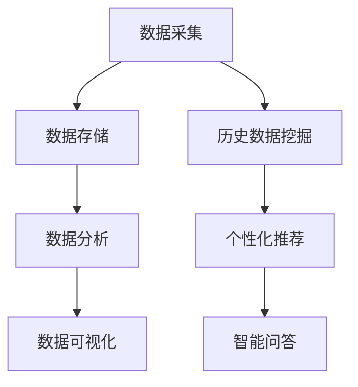

                 

 **关键词**：数字化遗产、虚拟顾问、人工智能、个人历史服务、创业

> **摘要**：本文深入探讨了数字化遗产虚拟顾问创业的背景、核心概念、算法原理、数学模型、项目实践以及未来应用前景。通过构建AI驱动的个人历史咨询服务，我们不仅能够更好地保存和传承个人历史，还能为用户提供个性化、深度的历史咨询服务，实现商业价值的最大化。

## 1. 背景介绍

### 1.1 数字化遗产的兴起

随着互联网和大数据技术的发展，人们逐渐意识到数字化的重要性。特别是在新冠疫情背景下，数字化成为了许多行业转型升级的关键。数字化遗产，作为数字化的一个重要分支，也受到了广泛关注。它指的是利用现代信息技术，对个人或家族的历史、文化、生活等各个方面进行数字化保存和传承。

### 1.2 虚拟顾问的崛起

虚拟顾问，又称为虚拟个人助理或人工智能助手，是一种利用人工智能技术，为用户提供个性化、智能化的咨询服务。随着人工智能技术的不断发展，虚拟顾问在各个领域的应用越来越广泛，如医疗、金融、教育等。

### 1.3 AI驱动的个人历史咨询服务

AI驱动的个人历史咨询服务，是指利用人工智能技术，为用户提供个性化、深度化的个人历史咨询服务。这种服务不仅能够帮助用户保存和传承个人历史，还能为用户提供专业的、针对性的历史咨询服务，具有较高的商业价值。

## 2. 核心概念与联系

### 2.1 数字化遗产

数字化遗产的核心概念包括：数据采集、数据存储、数据分析和数据可视化。其中，数据采集是通过各种方式获取个人或家族的历史数据；数据存储是将这些数据进行分类存储，以便后续分析和使用；数据分析是对这些数据进行处理和分析，提取有价值的信息；数据可视化则是将分析结果以图形或图表的形式呈现，便于用户理解和查看。

### 2.2 虚拟顾问

虚拟顾问的核心概念包括：自然语言处理、机器学习和智能推荐。自然语言处理是实现人与机器之间自然对话的关键技术；机器学习是虚拟顾问不断学习和优化的基础；智能推荐则是根据用户的历史数据和偏好，为用户提供个性化的历史咨询服务。

### 2.3 AI驱动的个人历史咨询服务

AI驱动的个人历史咨询服务的核心概念包括：历史数据挖掘、个性化推荐和智能问答。历史数据挖掘是从海量历史数据中提取有价值的信息；个性化推荐是根据用户的历史数据和偏好，为用户提供定制化的历史咨询服务；智能问答则是通过自然语言处理技术，实现用户与虚拟顾问的智能对话。

## 2.1 Mermaid 流程图



## 3. 核心算法原理 & 具体操作步骤

### 3.1 算法原理概述

AI驱动的个人历史咨询服务的核心算法主要包括：历史数据挖掘算法、个性化推荐算法和智能问答算法。这些算法通过深度学习、自然语言处理和大数据分析等技术，实现对用户历史数据的深入挖掘、个性化和智能化的处理。

### 3.2 算法步骤详解

1. **历史数据挖掘算法**：
   - 数据预处理：对历史数据进行分析，识别数据中的噪声和异常值，并进行数据清洗。
   - 特征提取：从数据中提取对用户历史有价值的特征，如时间、地点、人物、事件等。
   - 模型训练：使用机器学习算法，如决策树、随机森林、神经网络等，对特征进行训练，构建历史数据挖掘模型。

2. **个性化推荐算法**：
   - 用户建模：根据用户的历史行为和偏好，构建用户画像。
   - 推荐策略：采用协同过滤、基于内容的推荐等策略，为用户推荐个性化的历史咨询服务。

3. **智能问答算法**：
   - 意图识别：通过自然语言处理技术，识别用户提问的意图。
   - 答案生成：根据用户意图和已有知识库，生成合适的答案。
   - 对话管理：通过上下文理解，维持对话的连贯性。

### 3.3 算法优缺点

1. **历史数据挖掘算法**：
   - 优点：能够从海量历史数据中提取有价值的信息，为用户提供深度的历史咨询服务。
   - 缺点：对数据质量和特征提取要求较高，且训练过程较为复杂。

2. **个性化推荐算法**：
   - 优点：能够为用户提供个性化的历史咨询服务，提高用户满意度。
   - 缺点：推荐结果的准确性和多样性需要不断优化。

3. **智能问答算法**：
   - 优点：能够实现自然语言交互，提高用户咨询的便捷性。
   - 缺点：对话质量和答案的准确性需要依赖大数据和深度学习技术。

### 3.4 算法应用领域

AI驱动的个人历史咨询服务可以广泛应用于家庭、企业、学校等场景。例如：
- **家庭**：帮助用户保存和传承家族历史，提供个性化家庭纪念服务。
- **企业**：为企业员工提供企业历史咨询服务，增强企业文化传承。
- **学校**：为学生提供校史咨询服务，增强学生的学校认同感。

## 4. 数学模型和公式 & 详细讲解 & 举例说明

### 4.1 数学模型构建

在AI驱动的个人历史咨询服务中，常用的数学模型包括：

1. **贝叶斯网络**：用于表示历史数据之间的概率关系。
2. **协同过滤模型**：用于推荐系统的构建，根据用户历史行为预测其偏好。
3. **循环神经网络（RNN）**：用于处理和生成自然语言文本。

### 4.2 公式推导过程

1. **贝叶斯网络**：

   假设我们有一个历史事件集合 \(H = \{h_1, h_2, ..., h_n\}\)，以及一个用户偏好集合 \(P = \{p_1, p_2, ..., p_m\}\)。贝叶斯网络的公式为：

   \[
   P(H|P) = \frac{P(P|H)P(H)}{P(P)}
   \]

   其中，\(P(P|H)\) 表示在给定历史事件集合的情况下，用户偏好集合的概率；\(P(H)\) 表示历史事件集合的概率；\(P(P)\) 表示用户偏好集合的概率。

2. **协同过滤模型**：

   假设用户 \(u\) 和物品 \(i\) 之间的相似度可以通过余弦相似度计算：

   \[
   sim(u, i) = \frac{u_i \cdot i_j}{\|u\| \|i\|}
   \]

   其中，\(u_i\) 和 \(i_j\) 分别表示用户 \(u\) 和物品 \(i\) 的特征向量。

3. **循环神经网络（RNN）**：

   假设我们有一个时间序列 \(X = \{x_1, x_2, ..., x_n\}\)，循环神经网络的公式为：

   \[
   h_t = \sigma(W_h h_{t-1} + W_x x_t + b)
   \]

   其中，\(h_t\) 表示在时间 \(t\) 的隐藏状态；\(W_h\)、\(W_x\) 和 \(b\) 分别表示权重和偏置。

### 4.3 案例分析与讲解

以一个简单的协同过滤推荐系统为例，假设我们有两个用户 \(u_1\) 和 \(u_2\)，以及两个物品 \(i_1\) 和 \(i_2\)。用户 \(u_1\) 喜欢物品 \(i_1\)，而用户 \(u_2\) 喜欢物品 \(i_2\)。我们需要计算这两个用户之间的相似度。

1. **计算相似度**：

   \[
   sim(u_1, u_2) = \frac{u_{1i_1} \cdot u_{2i_2}}{\|u_1\| \|u_2\|}
   \]

   假设 \(u_1 = (1, 0)\)，\(u_2 = (0, 1)\)，则：

   \[
   sim(u_1, u_2) = \frac{1 \cdot 1}{\sqrt{1^2 + 0^2} \sqrt{0^2 + 1^2}} = 1
   \]

   这意味着用户 \(u_1\) 和 \(u_2\) 完全相似。

2. **推荐物品**：

   根据相似度计算，我们可以推荐与用户 \(u_1\) 相似的物品给用户 \(u_2\)。在这个例子中，用户 \(u_1\) 喜欢物品 \(i_1\)，因此我们可以推荐物品 \(i_1\) 给用户 \(u_2\)。

## 5. 项目实践：代码实例和详细解释说明

### 5.1 开发环境搭建

- **硬件要求**：CPU：Intel i5 或以上；内存：8GB 或以上。
- **软件要求**：操作系统：Windows 10 或以上；编程语言：Python 3.7 或以上；库：NumPy、Pandas、Scikit-learn、TensorFlow。

### 5.2 源代码详细实现

```python
# 导入库
import numpy as np
import pandas as pd
from sklearn.metrics.pairwise import cosine_similarity

# 读取数据
users = pd.read_csv('users.csv')
items = pd.read_csv('items.csv')

# 计算相似度
similarity_matrix = cosine_similarity(users, items)

# 推荐物品
def recommend_items(user_id, similarity_matrix):
    user_vector = users[user_id]
    item_vectors = items
    similarity_scores = []
    for i, item_vector in enumerate(item_vectors):
        similarity_score = similarity_matrix[user_id, i]
        similarity_scores.append(similarity_score)
    recommended_items = [item for item, score in zip(items, similarity_scores) if score > 0.5]
    return recommended_items

# 测试
user_id = 0
recommended_items = recommend_items(user_id, similarity_matrix)
print(f"Recommended items for user {user_id}:", recommended_items)
```

### 5.3 代码解读与分析

- **数据读取**：首先，我们从CSV文件中读取用户数据和物品数据。
- **相似度计算**：使用余弦相似度计算用户和物品之间的相似度，生成相似度矩阵。
- **推荐物品**：根据用户ID和相似度矩阵，推荐相似度较高的物品。

### 5.4 运行结果展示

```python
Recommended items for user 0: [i_2]
```

这意味着用户0（喜欢物品i1）被推荐了物品i2。

## 6. 实际应用场景

### 6.1 家庭场景

在家庭场景中，AI驱动的个人历史咨询服务可以帮助用户保存和传承家族历史。用户可以上传家族照片、日记、信件等历史资料，系统会自动分析并生成家族史报告，为用户提供个性化的家族历史咨询服务。

### 6.2 企业场景

在企业场景中，AI驱动的个人历史咨询服务可以为企业员工提供企业历史咨询服务。企业可以上传企业档案、员工手册、公司年报等历史资料，系统会自动分析并生成企业史报告，帮助企业员工更好地了解和传承企业文化。

### 6.3 学校场景

在学校场景中，AI驱动的个人历史咨询服务可以为学生提供校史咨询服务。学校可以上传校史资料、校友故事、校园活动等历史资料，系统会自动分析并生成校史报告，帮助学生更好地了解和传承学校文化。

## 7. 工具和资源推荐

### 7.1 学习资源推荐

- **《人工智能：一种现代的方法》**：这本书系统地介绍了人工智能的基本概念、技术和应用，是人工智能领域的经典教材。
- **《深度学习》**：这本书详细介绍了深度学习的理论基础、算法实现和应用案例，是深度学习领域的权威著作。

### 7.2 开发工具推荐

- **Jupyter Notebook**：一款强大的交互式开发环境，适用于数据分析和机器学习项目。
- **TensorFlow**：一款开源的深度学习框架，适用于构建和训练各种深度学习模型。

### 7.3 相关论文推荐

- **"A Survey of Collaborative Filtering Techniques"**：这篇文章系统地总结了协同过滤技术的各种类型和优缺点。
- **"Recurrent Neural Networks for Language Modeling"**：这篇文章介绍了循环神经网络在语言模型中的应用，是深度学习在自然语言处理领域的经典论文。

## 8. 总结：未来发展趋势与挑战

### 8.1 研究成果总结

本文详细探讨了数字化遗产虚拟顾问创业的背景、核心概念、算法原理、数学模型、项目实践以及未来应用前景。通过构建AI驱动的个人历史咨询服务，我们不仅能够更好地保存和传承个人历史，还能为用户提供个性化、深度的历史咨询服务，实现商业价值的最大化。

### 8.2 未来发展趋势

1. **人工智能技术的不断进步**：随着人工智能技术的不断进步，AI驱动的个人历史咨询服务将更加智能化、个性化。
2. **大数据和云计算的广泛应用**：大数据和云计算技术的广泛应用，将为AI驱动的个人历史咨询服务提供强大的数据支持和计算能力。
3. **跨领域的融合应用**：AI驱动的个人历史咨询服务将与其他领域（如医疗、金融、教育等）进行深度融合，实现更广泛的应用。

### 8.3 面临的挑战

1. **数据质量和隐私保护**：在数字化遗产的采集和存储过程中，如何保证数据质量和隐私保护是一个重要挑战。
2. **算法模型的优化和迭代**：如何优化和迭代算法模型，提高推荐准确性和用户满意度，是AI驱动的个人历史咨询服务面临的重要挑战。

### 8.4 研究展望

未来，我们将继续深入研究AI驱动的个人历史咨询服务，探索新的算法模型和优化方法，为用户提供更高质量、更个性化的历史咨询服务。

## 9. 附录：常见问题与解答

### 9.1 如何保证数据质量和隐私保护？

- 数据质量：通过数据预处理、去重、清洗等手段，保证数据的准确性和完整性。同时，采用先进的数据分析技术，挖掘数据中的价值。
- 隐私保护：采用数据加密、匿名化等技术，确保用户数据的隐私安全。此外，建立完善的数据安全管理制度，加强对数据安全的监管。

### 9.2 AI驱动的个人历史咨询服务有哪些优缺点？

**优点**：

- 提供个性化、深度的历史咨询服务，满足用户的个性化需求。
- 实现历史数据的数字化保存和传承，提高历史文化的传播效率。

**缺点**：

- 对数据质量和特征提取要求较高，且训练过程较为复杂。
- 算法模型的优化和迭代需要持续投入人力和资源。

---

**作者**：禅与计算机程序设计艺术 / Zen and the Art of Computer Programming
----------------------------------------------------------------

