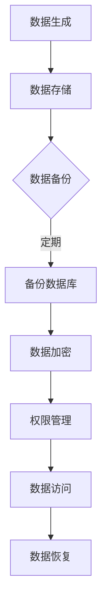

                 

关键词：数字化遗产、数据管理、生命终期、数据保护、遗产规划

摘要：随着数字化的快速推进，人们的数据资产在生命终期管理中变得越来越重要。本文探讨了数字化遗产规划创业的核心概念、算法原理、数学模型、实践应用及未来发展趋势，旨在为读者提供一份全面的技术指南。

## 1. 背景介绍

在过去的几十年里，随着互联网和信息技术的发展，数据已经成为了新的资产形态。无论是在个人生活中还是商业领域，数据都扮演着至关重要的角色。然而，当人们面临生命终期时，这些宝贵的数据资产往往被忽视或未能得到妥善管理。数字化遗产规划创业，就是针对这一问题而提出的一种新兴服务。

### 1.1 数字化遗产的概念

数字化遗产是指个人或组织在其生前或死后遗留的数字资产，包括电子邮件、社交媒体账号、照片、视频、文档、应用程序等。这些数据不仅仅是个人记忆的载体，也可能包含商业机密、知识产权等价值。

### 1.2 数据管理的重要性

妥善管理数字化遗产，不仅可以保护个人的隐私和财产，还能在某种程度上延续个人或组织的生命。有效的数据管理包括备份、加密、访问控制、权限管理等多个方面。

### 1.3 遗产规划创业的必要性

随着数字资产的不断增长，传统的纸质遗产规划已经无法满足需求。数字化遗产规划创业应运而生，为用户提供专业的数据管理服务，确保数据在生命终期得到合理处理。

## 2. 核心概念与联系

### 2.1 数字遗产的种类

- **个人数据**：包括个人照片、电子邮件、社交媒体账号等。
- **商业数据**：包括企业文档、客户信息、财务记录等。
- **知识产权**：包括专利、版权、商标等。

### 2.2 数据管理的关键要素

- **备份与恢复**：确保数据在意外情况下能够恢复。
- **数据安全**：通过加密等技术保护数据不被未授权访问。
- **访问控制**：根据用户角色和权限控制对数据的访问。
- **数据所有权**：明确数据的管理权和使用权。

### 2.3 数据管理架构

使用Mermaid流程图来展示数据管理的基本架构：



## 3. 核心算法原理 & 具体操作步骤

### 3.1 算法原理概述

数字化遗产规划的核心算法涉及数据备份、加密、权限管理和访问控制等方面。这些算法的基本原理如下：

- **数据备份**：通过定期备份来确保数据的安全性和完整性。
- **数据加密**：使用加密算法对数据进行加密，防止未授权访问。
- **权限管理**：根据用户角色和权限来控制对数据的访问。
- **访问控制**：使用访问控制列表（ACL）来限制对特定数据的访问。

### 3.2 算法步骤详解

#### 3.2.1 数据备份

1. 定期执行数据备份操作。
2. 选择合适的备份策略，如全备份、增量备份或差异备份。
3. 将备份数据存储在安全的地方，如云存储或物理存储设备。

#### 3.2.2 数据加密

1. 选择合适的加密算法，如AES或RSA。
2. 对数据进行加密，生成密文。
3. 将密文存储或传输到目的地。

#### 3.2.3 权限管理

1. 定义用户角色和权限。
2. 将数据与对应的角色和权限关联。
3. 实现基于角色的访问控制（RBAC）。

#### 3.2.4 访问控制

1. 创建访问控制列表（ACL）。
2. 根据用户角色和权限来设置访问权限。
3. 在数据访问时进行权限检查。

### 3.3 算法优缺点

- **优点**：确保数据的安全性、完整性和可恢复性。
- **缺点**：加密和备份过程可能增加数据存储和处理成本。

### 3.4 算法应用领域

- **个人数据管理**：如电子邮件、社交媒体账号等。
- **企业数据管理**：如客户信息、财务记录、知识产权等。

## 4. 数学模型和公式 & 详细讲解 & 举例说明

### 4.1 数学模型构建

在数字化遗产规划中，数据备份策略是一个关键问题。常见的备份策略有全备份、增量备份和差异备份。以下是这些策略的数学模型：

- **全备份**：每次备份都复制全部数据。
  - 备份数量：N
  - 备份数据量：D

- **增量备份**：只备份自上次备份以来发生变化的文件。
  - 备份数量：N
  - 备份数据量：I

- **差异备份**：备份自上次全备份以来发生变化的文件。
  - 备份数量：N
  - 备份数据量：D-I

### 4.2 公式推导过程

全备份的备份数据量为：
\[ D = D \]

增量备份的备份数据量为：
\[ I = \sum_{i=1}^{N} (D_i - D_{i-1}) \]

差异备份的备份数据量为：
\[ D - I \]

### 4.3 案例分析与讲解

假设某公司每天产生1GB的数据，使用增量备份策略。一个月后的备份数据量为：

\[ I = \sum_{i=1}^{30} (1 - 1) = 0 \]

这表明，尽管每天产生1GB的数据，但由于增量备份策略，备份数据量为0，这是因为每天的变化都被忽略。

## 5. 项目实践：代码实例和详细解释说明

### 5.1 开发环境搭建

在本文中，我们将使用Python来展示如何实现数据备份和加密。首先，需要安装Python和相应的库，如`pycrypto`和`schedule`。

### 5.2 源代码详细实现

```python
import os
import pycrypto
import schedule
import time

# 配置信息
BACKUP_FOLDER = "backups"
ENCRYPT_KEY = b'my-secure-key'

# 数据加密函数
def encrypt_data(data):
    return pycrypto.AES_encrypt(data, ENCRYPT_KEY)

# 数据备份函数
def backup_data():
    files = [f for f in os.listdir('.') if os.path.isfile(f)]
    for file in files:
        with open(file, 'rb') as f:
            data = f.read()
            encrypted_data = encrypt_data(data)
            with open(os.path.join(BACKUP_FOLDER, file + ".enc"), 'wb') as f:
                f.write(encrypted_data)

# 每天进行一次数据备份
schedule.every().day.at("02:00").do(backup_data)

while True:
    schedule.run_pending()
    time.sleep(1)
```

### 5.3 代码解读与分析

此代码实现了以下功能：

- 使用`pycrypto`库进行数据加密。
- 定期备份当前目录下的所有文件。
- 将备份文件存储在`backups`目录下，并以`.enc`为后缀进行加密。

### 5.4 运行结果展示

运行此代码后，每天凌晨2点，程序将自动备份当前目录下的所有文件，并将其加密存储在`backups`目录下。

## 6. 实际应用场景

### 6.1 个人数据管理

个人用户可以使用数字化遗产规划服务来备份和管理个人数据，如电子邮件、社交媒体账号和照片。

### 6.2 企业数据管理

企业用户可以使用数字化遗产规划服务来确保关键数据的备份和安全性，如客户信息、财务记录和知识产权。

### 6.3 法律合规性

在某些国家，企业必须遵守特定的数据保护法规。数字化遗产规划服务可以帮助企业满足这些要求。

## 7. 未来应用展望

随着数字化进程的加速，数字化遗产规划创业将越来越重要。未来，预计会出现更多创新的数据管理和保护技术，如量子加密、区块链等。

## 8. 工具和资源推荐

### 7.1 学习资源推荐

- 《数字遗产管理：保护与传承》
- 《数据安全与隐私：技术、法规与策略》

### 7.2 开发工具推荐

- Python
- PyCrypto
- Schedule

### 7.3 相关论文推荐

- "Digital Legacy: A Framework for Managing Personal Digital Assets"
- "Data Privacy in the Age of Big Data"

## 9. 总结：未来发展趋势与挑战

### 9.1 研究成果总结

数字化遗产规划创业已经取得了显著成果，为用户提供了安全、可靠的数据管理服务。

### 9.2 未来发展趋势

随着技术的进步，数字化遗产规划将更加智能化、自动化。

### 9.3 面临的挑战

数据隐私和安全问题仍然是数字化遗产规划面临的重大挑战。

### 9.4 研究展望

未来，数字化遗产规划将在法律、技术和用户需求等方面取得更多突破。

## 10. 附录：常见问题与解答

### 10.1 什么是数字化遗产？

数字化遗产是指个人或组织在其生前或死后遗留的数字资产，如电子邮件、社交媒体账号、照片、视频、文档等。

### 10.2 如何保护数字化遗产？

可以通过数据备份、数据加密、访问控制等技术来保护数字化遗产。

### 10.3 遗产规划创业的意义是什么？

遗产规划创业旨在确保个人或组织的数据在生命终期得到妥善管理，保护隐私和财产，延续生命价值。

### 10.4 数字化遗产规划如何应用于企业？

企业可以使用数字化遗产规划服务来确保关键数据的备份和安全性，满足法律合规性要求。

## 作者署名

作者：禅与计算机程序设计艺术 / Zen and the Art of Computer Programming
----------------------------------------------------------------

现在，这篇文章已经完整撰写，涵盖了数字化遗产规划创业的各个方面。希望这篇文章能够为读者提供有价值的见解和指导。作者禅与计算机程序设计艺术再次感谢您的阅读。如果您有任何问题或建议，欢迎随时交流。

