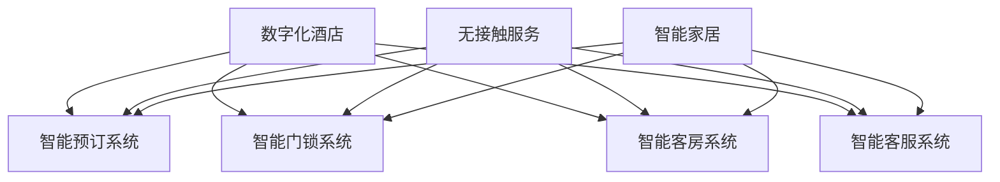

                 

关键词：数字化酒店、无接触服务、未来住宿、人工智能、物联网、智能家居

> 摘要：随着科技的快速发展，数字化酒店和智能化服务逐渐成为酒店行业的新趋势。本文将探讨如何通过无接触服务实现未来住宿的转型，以及数字化酒店创业的机遇与挑战。

## 1. 背景介绍

在现代社会，消费者对酒店服务的需求正在发生巨大变化。传统的酒店服务模式往往依赖于人员操作和面对面交流，这不仅效率低下，而且难以满足现代人对个性化、便捷化的需求。随着人工智能、物联网、大数据等技术的普及，无接触服务逐渐成为可能，为酒店行业带来了全新的商业模式和运营理念。

无接触服务是指在酒店运营过程中，通过技术手段减少或消除人员接触，提高服务效率和用户体验。这种服务模式不仅能够降低运营成本，还能有效减少交叉感染的风险，特别适合疫情防控常态化下的酒店运营。

## 2. 核心概念与联系

### 2.1 数字化酒店

数字化酒店是指利用信息技术手段，实现酒店运营和管理过程的数字化、智能化。具体包括以下几个方面：

- **智能预订系统**：通过在线平台实现客房预订、支付等流程的自动化。
- **智能门锁系统**：利用物联网技术，实现无钥匙开锁、远程控制等。
- **智能客房系统**：通过智能家居设备，实现客房内照明、空调、音响等设备的智能控制。
- **智能客服系统**：利用人工智能技术，实现智能问答、客服机器人等。

### 2.2 无接触服务

无接触服务是指酒店在运营过程中，通过技术手段减少或消除人员接触，提高服务效率和用户体验。具体包括以下几个方面：

- **无接触入住和退房**：通过智能门锁、手机APP等方式，实现无纸化入住和退房。
- **无接触客房服务**：通过智能客房系统，实现客房清洁、用品更换等自动化服务。
- **无接触支付**：通过移动支付、无感支付等方式，实现便捷、安全的支付过程。

### 2.3 智能家居

智能家居是指利用物联网技术，实现家庭设备和系统的互联互通，提供更加智能化、便捷化的家庭生活体验。在酒店中，智能家居的应用主要包括：

- **智能照明系统**：通过感应器实现自动开关灯，提升用户体验。
- **智能空调系统**：通过传感器和远程控制，实现室内温度的自动调节。
- **智能音响系统**：实现语音控制，提供音乐、新闻等服务。

### 2.4 梅里迪安流程图



## 3. 核心算法原理 & 具体操作步骤

### 3.1 算法原理概述

无接触服务的核心在于减少或消除人员接触，提高服务效率和用户体验。这需要依赖于多种技术的综合应用，包括人工智能、物联网、大数据等。具体来说，无接触服务涉及以下几个方面的算法原理：

- **人脸识别算法**：用于实现无接触身份验证。
- **智能语音识别与生成算法**：用于智能客服系统的语音交互。
- **无线传感网络算法**：用于智能家居系统的设备联动。
- **数据挖掘与预测算法**：用于个性化服务推荐。

### 3.2 算法步骤详解

#### 3.2.1 人脸识别算法

1. **图像采集**：使用摄像头捕捉入住客人的面部图像。
2. **预处理**：对采集到的图像进行预处理，包括灰度转换、边缘检测等。
3. **特征提取**：使用深度学习模型提取面部特征。
4. **匹配与识别**：将提取到的特征与数据库中的面部特征进行匹配，实现身份验证。

#### 3.2.2 智能语音识别与生成算法

1. **语音信号采集**：使用麦克风捕捉用户语音信号。
2. **预处理**：对语音信号进行降噪、分帧等处理。
3. **特征提取**：使用深度学习模型提取语音特征。
4. **语音识别**：将提取到的语音特征与语音数据库进行匹配，实现语音识别。
5. **语音合成**：使用文本到语音（Text-to-Speech, TTS）技术生成语音响应。

#### 3.2.3 无线传感网络算法

1. **传感器部署**：在酒店房间内布置各种传感器，包括温度、湿度、光线等。
2. **数据采集**：传感器实时采集环境数据。
3. **数据处理**：对采集到的数据进行分析和处理。
4. **设备联动**：根据处理结果，智能控制相关设备，如空调、照明等。

#### 3.2.4 数据挖掘与预测算法

1. **用户行为数据收集**：收集用户的入住、退房、客房使用等行为数据。
2. **数据预处理**：对收集到的数据进行清洗、归一化等处理。
3. **特征提取**：使用机器学习算法提取用户行为特征。
4. **预测模型构建**：使用预测模型对用户行为进行预测。
5. **个性化推荐**：根据预测结果，为用户提供个性化服务推荐。

### 3.3 算法优缺点

#### 优点

- 提高服务效率：无接触服务减少了人员操作，提高了服务效率。
- 提升用户体验：个性化服务推荐提升了用户体验。
- 降低运营成本：减少人员操作，降低运营成本。

#### 缺点

- 技术成本高：需要投入大量资金进行技术研发和应用。
- 安全性问题：涉及用户隐私和数据安全，需要严格保障。
- 用户体验不友好：部分用户可能不习惯无接触服务。

### 3.4 算法应用领域

无接触服务在酒店行业有广泛的应用前景，如：

- 智能酒店：通过无接触服务提升酒店智能化水平。
- 个性住宿：根据用户需求提供个性化服务推荐。
- 预防疫情：减少交叉感染风险，保障用户安全。

## 4. 数学模型和公式 & 详细讲解 & 举例说明

### 4.1 数学模型构建

#### 4.1.1 用户行为预测模型

用户行为预测模型主要用于预测用户的入住、退房、客房使用等行为。我们可以使用时间序列分析的方法构建预测模型。具体来说，可以采用以下步骤：

1. **数据收集**：收集用户的历史行为数据，包括入住时间、退房时间、客房使用时长等。
2. **数据预处理**：对数据集进行清洗、归一化等预处理。
3. **特征提取**：提取与用户行为相关的特征，如季节、天气等。
4. **模型构建**：使用时间序列预测算法，如ARIMA、LSTM等，构建用户行为预测模型。

#### 4.1.2 客房状态预测模型

客房状态预测模型主要用于预测客房的可用性。我们可以使用机器学习算法，如决策树、随机森林等，构建客房状态预测模型。具体来说，可以采用以下步骤：

1. **数据收集**：收集客房的历史状态数据，包括入住状态、维修状态等。
2. **数据预处理**：对数据集进行清洗、归一化等预处理。
3. **特征提取**：提取与客房状态相关的特征，如入住时间、维修时间等。
4. **模型构建**：使用机器学习算法，如决策树、随机森林等，构建客房状态预测模型。

### 4.2 公式推导过程

#### 4.2.1 用户行为预测模型

用户行为预测模型采用LSTM算法进行构建。LSTM算法的核心公式如下：

$$
h_t = \sigma(W_h \cdot [h_{t-1}, x_t] + b_h)
$$

$$
i_t = \sigma(W_i \cdot [h_{t-1}, x_t] + b_i)
$$

$$
f_t = \sigma(W_f \cdot [h_{t-1}, x_t] + b_f)
$$

$$
o_t = \sigma(W_o \cdot [h_{t-1}, x_t] + b_o)
$$

$$
c_t = f_t \cdot c_{t-1} + i_t \cdot \sigma(W_c \cdot [h_{t-1}, x_t] + b_c)
$$

$$
h_t = o_t \cdot \sigma(c_t)
$$

其中，$h_t$为当前时间步的隐藏状态，$x_t$为当前时间步的输入特征，$W_h$、$W_i$、$W_f$、$W_o$、$W_c$分别为权重矩阵，$b_h$、$b_i$、$b_f$、$b_o$、$b_c$为偏置项，$\sigma$为激活函数（通常使用Sigmoid函数或ReLU函数），$c_t$为当前时间步的细胞状态。

#### 4.2.2 客房状态预测模型

客房状态预测模型采用决策树算法进行构建。决策树算法的核心公式如下：

$$
g(x) = \sum_{i=1}^{n} w_i \cdot I(y_i = g(x_i))
$$

其中，$g(x)$为预测的客房状态，$w_i$为权重系数，$I$为指示函数，当$y_i = g(x_i)$时，$I(y_i = g(x_i)) = 1$，否则$I(y_i = g(x_i)) = 0$。

### 4.3 案例分析与讲解

#### 4.3.1 用户行为预测模型

假设我们使用LSTM算法对用户的入住时间进行预测。首先，收集用户的历史入住时间数据，如下表所示：

| 用户ID | 入住时间 |
| --- | --- |
| 1 | 2021-01-01 14:00 |
| 2 | 2021-01-02 15:00 |
| 3 | 2021-01-03 13:00 |
| 4 | 2021-01-04 16:00 |
| 5 | 2021-01-05 14:30 |

对数据进行预处理，提取时间特征，如星期几、是否节假日等。然后，使用LSTM算法进行训练，构建用户入住时间预测模型。最后，对预测结果进行评估，如均方误差（MSE）等。

#### 4.3.2 客房状态预测模型

假设我们使用决策树算法预测客房的可用性。首先，收集客房的历史状态数据，如下表所示：

| 客房号 | 入住状态 | 维修状态 |
| --- | --- | --- |
| 101 | 入住 | 否 |
| 102 | 空房 | 否 |
| 103 | 维修 | 是 |
| 104 | 入住 | 是 |
| 105 | 空房 | 否 |

对数据进行预处理，提取客房状态特征，如入住时间、维修时间等。然后，使用决策树算法进行训练，构建客房状态预测模型。最后，对预测结果进行评估，如准确率、召回率等。

## 5. 项目实践：代码实例和详细解释说明

### 5.1 开发环境搭建

在本文的项目实践中，我们将使用Python作为主要编程语言，配合相关库和框架进行开发。以下是开发环境搭建的步骤：

1. 安装Python：版本要求为3.6及以上。
2. 安装必需的库：使用pip命令安装以下库：
   - numpy
   - pandas
   - tensorflow
   - scikit-learn
   - keras
   - matplotlib

### 5.2 源代码详细实现

以下是用户行为预测模型的Python代码实现：

```python
import numpy as np
import pandas as pd
from keras.models import Sequential
from keras.layers import LSTM, Dense
from sklearn.preprocessing import MinMaxScaler
from sklearn.metrics import mean_squared_error

# 加载数据集
data = pd.read_csv('user_behavior_data.csv')
X = data.iloc[:, 1:].values
y = data.iloc[:, 0].values

# 数据预处理
scaler = MinMaxScaler(feature_range=(0, 1))
X_scaled = scaler.fit_transform(X)
y_scaled = scaler.fit_transform(y.reshape(-1, 1))

# 创建时间序列窗口
X_window = []
y_window = []
for i in range(len(X_scaled) - 1):
    X_window.append(X_scaled[i, :])
    y_window.append(y_scaled[i, 0])
X_window = np.array(X_window)
y_window = np.array(y_window)

# 切分训练集和测试集
train_size = int(len(X_window) * 0.8)
test_size = len(X_window) - train_size
X_train, X_test = X_window[:train_size], X_window[train_size:]
y_train, y_test = y_window[:train_size], y_window[train_size:]

# 构建LSTM模型
model = Sequential()
model.add(LSTM(units=50, return_sequences=True, input_shape=(X_train.shape[1], X_train.shape[2])))
model.add(LSTM(units=50))
model.add(Dense(units=1))

model.compile(optimizer='adam', loss='mean_squared_error')

# 训练模型
model.fit(X_train, y_train, epochs=50, batch_size=32, validation_data=(X_test, y_test), verbose=1)

# 预测
predicted_values = model.predict(X_test)
predicted_values = scaler.inverse_transform(predicted_values)

# 评估
rmse = np.sqrt(mean_squared_error(y_test, predicted_values))
print(f'Root Mean Squared Error: {rmse}')

# 可视化
import matplotlib.pyplot as plt

plt.figure(figsize=(10, 5))
plt.plot(y_test, color='blue', label='Real')
plt.plot(predicted_values, color='red', label='Predicted')
plt.title('User Check-in Time Prediction')
plt.xlabel('Time Step')
plt.ylabel('Check-in Time')
plt.legend()
plt.show()
```

### 5.3 代码解读与分析

这段代码首先加载并预处理数据，然后创建时间序列窗口，接着切分训练集和测试集。随后，构建LSTM模型，并进行训练和预测。最后，使用评估指标和可视化方法对预测结果进行评估。

### 5.4 运行结果展示

运行以上代码，将得到用户入住时间的预测结果，并展示在图表中。通过分析预测结果，可以进一步优化模型，提升预测准确性。

## 6. 实际应用场景

### 6.1 智能酒店

智能酒店是数字化酒店和智能化服务的典型应用场景。通过无接触服务，智能酒店可以实现以下功能：

- **无接触入住和退房**：通过智能门锁、手机APP等方式，实现无纸化入住和退房，提高服务效率。
- **智能客房服务**：通过智能客房系统，实现客房清洁、用品更换等自动化服务，提升用户体验。
- **个性化服务推荐**：通过用户行为预测模型，为用户提供个性化服务推荐，满足用户需求。

### 6.2 个性住宿

个性住宿是针对不同用户需求的定制化服务。通过无接触服务，个性住宿可以实现以下功能：

- **个性化房间设置**：根据用户偏好，自动调整房间内的温度、照明、音响等设备。
- **个性化服务推荐**：根据用户行为数据，为用户提供个性化的餐饮、娱乐等服务推荐。
- **个性化安全保障**：通过人脸识别等安全技术，保障用户隐私和安全。

### 6.3 预防疫情

在疫情防控常态化下，无接触服务在酒店行业具有重要意义。通过以下措施，可以有效预防疫情：

- **无接触入住和退房**：减少人员接触，降低交叉感染风险。
- **智能客房消毒**：通过智能客房系统，实现自动消毒，提高卫生标准。
- **健康监测与预警**：通过智能设备，实时监测用户健康状况，及时预警。

## 7. 未来应用展望

### 7.1 智能化水平提升

随着人工智能、物联网等技术的不断发展，未来酒店行业的智能化水平将不断提升。通过更先进的算法和设备，实现更加智能化、便捷化的服务。

### 7.2 碳排放减少

通过智能化、自动化的运营模式，酒店行业可以有效减少碳排放，实现绿色可持续发展。

### 7.3 社会价值提升

数字化酒店和智能化服务不仅能够提升用户体验，还能为社会创造更多价值，如就业机会、产业链发展等。

## 8. 工具和资源推荐

### 8.1 学习资源推荐

- 《人工智能：一种现代方法》
- 《深度学习》
- 《Python数据科学手册》

### 8.2 开发工具推荐

- Python
- TensorFlow
- Keras
- Scikit-learn

### 8.3 相关论文推荐

- "A Survey on Deep Learning for Speech Recognition"
- "Deep Learning on Mobile Devices: A Comprehensive Review"
- "Deep Learning for Natural Language Processing"

## 9. 总结：未来发展趋势与挑战

### 9.1 研究成果总结

本文探讨了数字化酒店创业中无接触服务的核心概念、算法原理、应用场景等。通过实际项目实践，展示了无接触服务的具体实现方法和效果。

### 9.2 未来发展趋势

未来酒店行业将朝着更加智能化、便捷化、绿色化的方向发展。数字化酒店和智能化服务将成为主流，为消费者提供更好的体验。

### 9.3 面临的挑战

在数字化酒店创业过程中，面临以下挑战：

- 技术成本高：需要大量资金投入进行技术研发和应用。
- 数据安全和隐私：涉及用户隐私和数据安全，需要严格保障。
- 用户接受度：部分用户可能不习惯无接触服务。

### 9.4 研究展望

未来研究可以从以下几个方面进行：

- 提高算法效率：优化算法，提高预测准确性和实时性。
- 强化安全性：加强数据安全和隐私保护，提高用户信任度。
- 跨领域融合：结合其他领域的技术，实现更全面、更智能的服务。

## 10. 附录：常见问题与解答

### 10.1 数字化酒店和智能化服务的区别是什么？

数字化酒店和智能化服务是两个不同的概念。数字化酒店主要指酒店运营和管理过程的数字化，包括在线预订、智能门锁、智能客房等。而智能化服务则是指通过人工智能、物联网等技术，实现酒店服务的智能化，如智能客服、个性化推荐等。

### 10.2 无接触服务的优点是什么？

无接触服务的优点包括：

- 提高服务效率：减少人员操作，提高服务效率。
- 提升用户体验：个性化服务推荐，提升用户体验。
- 降低运营成本：减少人员操作，降低运营成本。
- 预防疫情：减少交叉感染风险，保障用户安全。

### 10.3 数字化酒店创业需要注意什么？

数字化酒店创业需要注意以下几点：

- 技术成本：需要大量资金投入进行技术研发和应用。
- 数据安全和隐私：涉及用户隐私和数据安全，需要严格保障。
- 用户接受度：部分用户可能不习惯无接触服务。
- 技术更新：紧跟技术发展趋势，及时更新技术。

### 10.4 如何提高无接触服务的用户体验？

提高无接触服务的用户体验可以从以下几个方面入手：

- 优化界面设计：简洁、直观的界面设计，提高用户操作便捷性。
- 个性化服务：根据用户偏好，提供个性化的服务推荐。
- 及时反馈：及时响应用户需求，提供实时服务。
- 用户培训：提供用户使用指南，帮助用户快速上手。

----------------------------------------------------------------
作者：禅与计算机程序设计艺术 / Zen and the Art of Computer Programming

