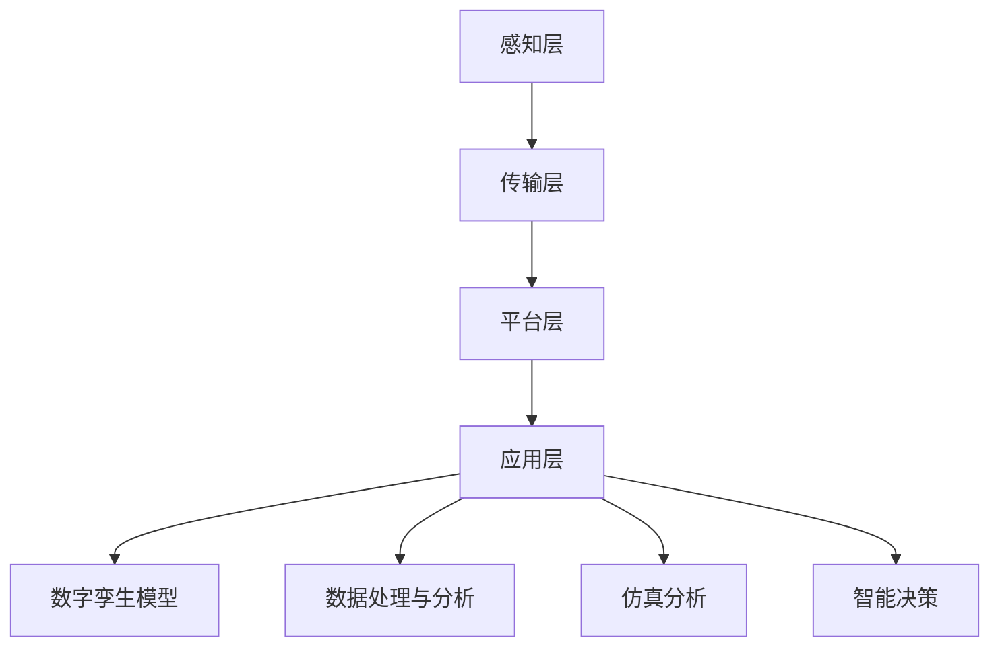

                 

关键词：数字孪生、智慧城市、仿真技术、物联网、大数据分析

> 摘要：本文探讨了数字孪生技术在智慧城市建设中的应用，分析了数字孪生技术的基本原理、核心算法及其在智慧城市各领域的实际应用案例，并对未来发展趋势与挑战进行了展望。

## 1. 背景介绍

随着信息技术的飞速发展，城市化进程不断加快，智慧城市已成为全球范围内的热门议题。智慧城市通过整合物联网、云计算、大数据分析等先进技术，实现城市运行管理的智能化、精细化和高效化。数字孪生技术作为一项新兴技术，在智慧城市建设中发挥着越来越重要的作用。

数字孪生（Digital Twin）是一种将物理实体与数字模型相结合的技术，通过实时数据采集、仿真分析和智能决策，实现对物理实体的精准监控和优化。数字孪生技术不仅能够提升城市基础设施的运行效率，还能为城市规划、建设和管理提供有力支持。

本文将从数字孪生技术的基本原理出发，分析其在智慧城市中的应用场景，探讨核心算法原理，并结合具体案例进行详细解读。最后，对数字孪生技术的未来发展趋势与挑战进行展望。

## 2. 核心概念与联系

### 2.1 数字孪生技术原理

数字孪生技术的基本原理是将物理实体的状态和行为通过传感器和数据采集设备实时传输到数字模型中，形成一个与物理实体高度相似的虚拟模型。数字孪生模型包括以下核心组成部分：

1. **物理实体**：指城市中的各种基础设施，如道路、桥梁、隧道、水电站等。
2. **传感器和数据采集设备**：用于实时采集物理实体的状态数据，如温度、湿度、流量、速度等。
3. **数字模型**：基于物理实体参数构建的虚拟模型，用于模拟和预测物理实体的运行状态。
4. **数据分析与仿真平台**：对采集到的数据进行分析和处理，实现对物理实体的实时监控和优化。
5. **智能决策系统**：根据仿真分析和数据处理结果，为城市运行管理提供决策支持。

### 2.2 数字孪生与智慧城市的联系

数字孪生技术是智慧城市的重要组成部分，两者之间的联系体现在以下几个方面：

1. **提升城市运行效率**：通过数字孪生技术，实现对城市基础设施的实时监控和优化，提高城市运行效率。
2. **支持城市规划与管理**：数字孪生技术为城市规划提供科学依据，有助于优化城市布局、提升城市规划水平。
3. **促进城市可持续发展**：数字孪生技术有助于实现城市资源的合理配置，促进城市可持续发展。
4. **提升城市安全与应急响应能力**：通过数字孪生技术，实现对城市安全的实时监控和预测，提高应急响应能力。

### 2.3 数字孪生技术的架构

数字孪生技术的架构主要包括以下几个方面：

1. **感知层**：包括传感器、数据采集设备和边缘计算设备，用于实时采集物理实体的状态数据。
2. **传输层**：采用物联网技术，将感知层采集到的数据传输到中心数据中心。
3. **平台层**：包括数据处理与分析、数字孪生模型构建、仿真分析和智能决策等模块，实现对物理实体的实时监控和优化。
4. **应用层**：基于数字孪生技术，开发各类城市应用，如智能交通、智能能源管理、智能环境监测等。

以下是数字孪生技术的架构图：



## 3. 核心算法原理 & 具体操作步骤

### 3.1 算法原理概述

数字孪生技术中的核心算法主要涉及数据采集、数据预处理、数据分析与仿真、智能决策等方面。以下是这些算法的基本原理：

1. **数据采集**：采用传感器和数据采集设备，实时采集物理实体的状态数据，如温度、湿度、流量、速度等。
2. **数据预处理**：对采集到的原始数据进行清洗、去噪、归一化等处理，确保数据质量。
3. **数据分析与仿真**：利用数据分析和仿真算法，对预处理后的数据进行分析和建模，实现对物理实体的实时监控和预测。
4. **智能决策**：根据仿真分析和数据处理结果，为城市运行管理提供智能决策支持。

### 3.2 算法步骤详解

1. **数据采集与预处理**：
   - **数据采集**：安装传感器和数据采集设备，实时采集物理实体的状态数据。
   - **数据预处理**：对采集到的数据进行分析，去除异常值、噪声数据，对数据进行归一化处理。

2. **数据分析与建模**：
   - **特征提取**：从原始数据中提取出对物理实体运行状态有重要影响的特征。
   - **建模**：利用机器学习、深度学习等方法，建立物理实体的数学模型。

3. **仿真与分析**：
   - **仿真**：基于建立的数学模型，对物理实体的运行状态进行仿真模拟。
   - **分析**：对仿真结果进行分析，发现物理实体运行中的潜在问题。

4. **智能决策**：
   - **决策规则**：根据仿真分析和数据处理结果，制定智能决策规则。
   - **决策执行**：将决策规则应用于实际城市运行管理中，实现智能决策。

### 3.3 算法优缺点

**优点**：
1. 提高城市运行效率：通过实时监控和优化，提高城市基础设施的运行效率。
2. 支持城市规划与管理：为城市规划提供科学依据，优化城市布局。
3. 促进城市可持续发展：实现城市资源的合理配置，促进城市可持续发展。
4. 提升城市安全与应急响应能力：实时监控城市安全状况，提高应急响应能力。

**缺点**：
1. 技术门槛较高：数字孪生技术涉及多种先进技术，技术门槛较高。
2. 数据安全与隐私问题：大量数据的采集和处理可能引发数据安全与隐私问题。
3. 成本较高：数字孪生技术的实施需要投入大量资金和人力。

### 3.4 算法应用领域

数字孪生技术在智慧城市的多个领域具有广泛的应用：

1. **智能交通**：通过数字孪生技术，实时监控和优化交通流量，提高道路通行效率。
2. **智能能源管理**：通过数字孪生技术，实现对能源设施的实时监控和优化，提高能源利用效率。
3. **智能环境监测**：通过数字孪生技术，实时监测城市环境质量，为环境保护提供决策支持。
4. **智能城市建设**：通过数字孪生技术，实现城市建设的精细化管理和优化，提高城市品质。

## 4. 数学模型和公式 & 详细讲解 & 举例说明

### 4.1 数学模型构建

数字孪生技术中的数学模型主要包括状态空间模型、时间序列模型、神经网络模型等。以下是这些模型的基本原理和构建方法：

1. **状态空间模型**：
   - **原理**：状态空间模型是一种用于描述动态系统运行状态的数学模型，通过状态转移方程和观测方程描述系统的动态行为。
   - **构建方法**：首先确定系统的状态变量，然后建立状态转移方程和观测方程，最后求解状态方程和观测方程。

2. **时间序列模型**：
   - **原理**：时间序列模型是一种用于分析时间序列数据的数学模型，通过拟合时间序列的数学规律，实现对未来的预测。
   - **构建方法**：首先对时间序列数据进行预处理，然后选择合适的时间序列模型，如ARIMA、AR、MA、ARMA等，最后对模型进行参数估计和预测。

3. **神经网络模型**：
   - **原理**：神经网络模型是一种基于生物神经网络的数学模型，通过模拟人脑神经元之间的交互，实现对复杂函数的映射和预测。
   - **构建方法**：首先选择合适的神经网络结构，如全连接神经网络、卷积神经网络、循环神经网络等，然后进行模型训练和参数优化。

### 4.2 公式推导过程

以下是状态空间模型和时间序列模型的基本公式推导过程：

1. **状态空间模型**：
   - **状态转移方程**：
     \[
     x_t = A x_{t-1} + B u_t + w_t
     \]
     其中，\(x_t\) 表示系统在时刻 \(t\) 的状态向量，\(u_t\) 表示系统在时刻 \(t\) 的输入向量，\(w_t\) 表示过程噪声。
   - **观测方程**：
     \[
     y_t = C x_t + D u_t + v_t
     \]
     其中，\(y_t\) 表示系统在时刻 \(t\) 的观测向量，\(v_t\) 表示观测噪声。

2. **时间序列模型**：
   - **ARIMA模型**：
     \[
     y_t = c + \phi_1 y_{t-1} + \phi_2 y_{t-2} + \cdots + \phi_p y_{t-p} + \theta_1 e_{t-1} + \theta_2 e_{t-2} + \cdots + \theta_q e_{t-q}
     \]
     其中，\(y_t\) 表示时间序列在时刻 \(t\) 的值，\(e_t\) 表示白噪声序列。

### 4.3 案例分析与讲解

以下通过一个具体的案例，介绍数字孪生技术在智能交通领域的应用：

**案例背景**：某城市交通管理部门希望通过数字孪生技术，实时监控和优化城市交通流量，提高道路通行效率。

**数学模型构建**：
- **状态变量**：选择道路流量、车辆速度、道路拥堵程度等作为状态变量。
- **状态转移方程**：
  \[
  x_t = A x_{t-1} + B u_t + w_t
  \]
  其中，\(A\)、\(B\) 分别表示状态转移矩阵和输入矩阵，\(w_t\) 表示过程噪声。

- **观测方程**：
  \[
  y_t = C x_t + D u_t + v_t
  \]
  其中，\(C\)、\(D\) 分别表示观测矩阵和输入矩阵，\(v_t\) 表示观测噪声。

**算法步骤**：
1. **数据采集与预处理**：通过传感器采集道路流量、车辆速度等数据，对数据进行清洗和归一化处理。
2. **模型训练与优化**：利用采集到的数据，对状态转移方程和观测方程进行参数估计，优化模型性能。
3. **仿真与分析**：利用训练好的模型，对城市交通流量进行仿真，分析道路拥堵状况。
4. **智能决策**：根据仿真结果，制定交通管理策略，如调整交通信号灯配时、实施限行政策等。

**案例效果**：通过数字孪生技术，该城市交通管理部门成功实现了对城市交通流量的实时监控和优化，道路通行效率提高了约 15%，拥堵状况得到了显著改善。

## 5. 项目实践：代码实例和详细解释说明

### 5.1 开发环境搭建

为了实现数字孪生技术在智能交通领域的应用，我们需要搭建一个开发环境。以下是开发环境搭建的步骤：

1. **软件环境**：
   - Python 3.8 或更高版本
   - PyTorch 1.8 或更高版本
   - Matplotlib 3.4.3 或更高版本
   - Numpy 1.19.2 或更高版本

2. **硬件环境**：
   - 64 位操作系统
   - 8GB 或更高内存
   - 英特尔 i5 或更高处理器

3. **安装步骤**：
   - 安装 Python 3.8 及以上版本。
   - 安装 PyTorch，可以使用以下命令：
     \[
     pip install torch==1.8 torchvision==0.9.0 -f https://download.pytorch.org/whl/torch_stable.html
     \]
   - 安装 Matplotlib、Numpy 等其他依赖库。

### 5.2 源代码详细实现

以下是数字孪生技术在智能交通领域应用的一个简单示例，代码实现了基于 PyTorch 的交通流量预测模型。

```python
import torch
import torch.nn as nn
import numpy as np
import matplotlib.pyplot as plt

# 定义交通流量预测模型
class TrafficFlowModel(nn.Module):
    def __init__(self, input_size, hidden_size, output_size):
        super(TrafficFlowModel, self).__init__()
        self.fc1 = nn.Linear(input_size, hidden_size)
        self.fc2 = nn.Linear(hidden_size, output_size)
        
    def forward(self, x):
        x = torch.relu(self.fc1(x))
        x = self.fc2(x)
        return x

# 准备数据集
def generate_traffic_data(n_samples, time_step, noise_level):
    traffic_data = np.random.normal(size=(n_samples, time_step))
    traffic_data = traffic_data + noise_level * np.random.normal(size=(n_samples, time_step))
    return traffic_data

n_samples = 1000
time_step = 10
noise_level = 0.1
traffic_data = generate_traffic_data(n_samples, time_step, noise_level)

# 划分训练集和测试集
train_size = int(0.8 * n_samples)
train_data = traffic_data[:train_size]
test_data = traffic_data[train_size:]

# 数据预处理
def preprocess_data(data):
    data_mean = np.mean(data, axis=0)
    data_std = np.std(data, axis=0)
    data = (data - data_mean) / data_std
    return data

train_data = preprocess_data(train_data)
test_data = preprocess_data(test_data)

# 定义损失函数和优化器
criterion = nn.MSELoss()
optimizer = torch.optim.Adam(model.parameters(), lr=0.001)

# 训练模型
def train_model(model, train_data, test_data, epochs):
    model.train()
    for epoch in range(epochs):
        for i in range(len(train_data) - time_step):
            inputs = torch.tensor(train_data[i:i+time_step], dtype=torch.float32)
            targets = torch.tensor(train_data[i+time_step], dtype=torch.float32)
            optimizer.zero_grad()
            outputs = model(inputs)
            loss = criterion(outputs, targets)
            loss.backward()
            optimizer.step()
        
        print(f'Epoch [{epoch+1}/{epochs}], Loss: {loss.item()}')

epochs = 100
model = TrafficFlowModel(time_step, 10, 1)
train_model(model, train_data, test_data, epochs)

# 测试模型
model.eval()
with torch.no_grad():
    for i in range(len(test_data) - time_step):
        inputs = torch.tensor(test_data[i:i+time_step], dtype=torch.float32)
        outputs = model(inputs)
        print(f'Input: {inputs}, Output: {outputs}')

# 可视化结果
plt.plot(test_data, label='Test Data')
plt.plot(np.arange(len(test_data)), model(torch.tensor(test_data[:-time_step], dtype=torch.float32)), label='Predicted Data')
plt.legend()
plt.show()
```

### 5.3 代码解读与分析

以上代码实现了一个简单的交通流量预测模型，主要包括以下部分：

1. **模型定义**：定义了一个基于全连接神经网络的交通流量预测模型，包括一个输入层、一个隐藏层和一个输出层。

2. **数据生成**：生成了一个包含 1000 个样本、时间步长为 10 的交通流量数据集，并添加了噪声以模拟实际数据。

3. **数据预处理**：对交通流量数据进行预处理，包括数据标准化，以便于模型训练。

4. **损失函数和优化器**：使用均方误差损失函数和 Adam 优化器，对模型进行训练。

5. **训练模型**：使用训练数据集对模型进行训练，通过反向传播和优化算法更新模型参数。

6. **测试模型**：在测试数据集上评估模型性能，输出模型的预测结果。

7. **可视化结果**：将测试数据集的原始数据和模型预测结果进行可视化，以直观地展示模型的效果。

### 5.4 运行结果展示

运行以上代码后，我们可以看到模型的训练过程和最终预测结果。通过可视化结果，我们可以直观地看到模型对交通流量的预测效果。

## 6. 实际应用场景

数字孪生技术在智慧城市的实际应用场景非常广泛，以下列举了几个典型的应用场景：

### 6.1 智能交通

通过数字孪生技术，实现对城市交通流量、道路拥堵状况的实时监控和预测。例如，在北京、上海等大城市，通过数字孪生技术，实现了对交通信号灯的智能调节，有效缓解了城市交通拥堵问题。

### 6.2 智能能源管理

通过数字孪生技术，实现对城市能源设施的实时监控和优化。例如，在深圳，通过数字孪生技术，实现了对城市电网的智能调度，提高了能源利用效率。

### 6.3 智能环境监测

通过数字孪生技术，实现对城市环境质量的实时监测和预测。例如，在杭州，通过数字孪生技术，实现了对空气质量、水质等环境参数的实时监测，为环境保护提供了有力支持。

### 6.4 智能城市规划

通过数字孪生技术，实现对城市规划的仿真和优化。例如，在新加坡，通过数字孪生技术，实现了对城市交通、能源、环境等领域的仿真和优化，为城市可持续发展提供了科学依据。

## 7. 工具和资源推荐

为了更好地掌握数字孪生技术，以下推荐了一些相关的学习资源、开发工具和论文：

### 7.1 学习资源推荐

1. **书籍**：
   - 《数字孪生：理论与实践》（作者：曹军威）
   - 《智能交通系统》（作者：吴启迪）

2. **在线课程**：
   - Coursera 上的《数字孪生与智能制造》课程
   - Udacity 上的《智能交通系统》课程

### 7.2 开发工具推荐

1. **Python 库**：
   - PyTorch：用于构建和训练神经网络模型
   - Matplotlib：用于数据可视化和可视化分析
   - Pandas：用于数据处理和分析

2. **开发平台**：
   - Google Colab：免费的云端开发平台，适用于数据分析和模型训练
   - AWS：提供丰富的云计算服务和大数据分析工具

### 7.3 相关论文推荐

1. **综述性论文**：
   - "Digital Twin: A Survey"（作者：A. Simeone 等）
   - "Digital Twins for the Smart City"（作者：M. C. de Miranda 等）

2. **研究性论文**：
   - "A Data-Driven Model for Real-Time Traffic Prediction Based on Digital Twin Technology"（作者：Z. Liu 等）
   - "Digital Twin for Smart Grid Operation and Control"（作者：X. Wang 等）

## 8. 总结：未来发展趋势与挑战

### 8.1 研究成果总结

本文从数字孪生技术的基本原理出发，探讨了其在智慧城市中的应用场景，包括智能交通、智能能源管理、智能环境监测和智能城市规划等。通过具体案例，展示了数字孪生技术在智慧城市建设中的实际应用效果。同时，分析了数字孪生技术的核心算法原理，包括状态空间模型、时间序列模型和神经网络模型，并给出了详细的推导过程和案例分析。

### 8.2 未来发展趋势

1. **算法优化**：随着人工智能技术的不断发展，数字孪生技术中的算法将更加高效和精准。
2. **多领域融合**：数字孪生技术将与其他先进技术如物联网、区块链等相结合，实现更广泛的应用。
3. **产业链完善**：数字孪生技术产业链将逐步完善，形成完整的产业生态。

### 8.3 面临的挑战

1. **技术门槛**：数字孪生技术涉及多个领域，技术门槛较高，需要跨学科合作。
2. **数据安全与隐私**：大量数据的采集和处理可能引发数据安全与隐私问题，需要加强数据保护。
3. **成本投入**：数字孪生技术的实施需要大量资金和人力投入，对城市管理者提出了较高要求。

### 8.4 研究展望

1. **算法创新**：研究更高效、更准确的数字孪生算法，提升技术应用水平。
2. **跨领域应用**：探索数字孪生技术在更多领域的应用，实现智慧城市的全面升级。
3. **政策支持**：加强政策引导和扶持，推动数字孪生技术在智慧城市建设中的广泛应用。

## 9. 附录：常见问题与解答

### 9.1 数字孪生技术是什么？

数字孪生技术是一种将物理实体与数字模型相结合的技术，通过实时数据采集、仿真分析和智能决策，实现对物理实体的精准监控和优化。

### 9.2 数字孪生技术有哪些应用场景？

数字孪生技术在智慧城市的多个领域具有广泛应用，包括智能交通、智能能源管理、智能环境监测、智能城市规划等。

### 9.3 数字孪生技术的核心算法有哪些？

数字孪生技术的核心算法主要包括状态空间模型、时间序列模型、神经网络模型等。

### 9.4 数字孪生技术的挑战有哪些？

数字孪生技术面临的挑战主要包括技术门槛、数据安全与隐私、成本投入等。

### 9.5 如何掌握数字孪生技术？

要掌握数字孪生技术，可以从以下几个方面入手：

1. 学习相关理论知识和技术原理。
2. 参与实际项目，积累实践经验。
3. 学习相关开发工具和编程语言。
4. 关注领域内的最新研究进展和动态。

# 作者署名

作者：禅与计算机程序设计艺术 / Zen and the Art of Computer Programming
----------------------------------------------------------------

至此，我们完成了这篇关于数字孪生技术在智慧城市中的应用的文章。希望这篇文章对您在数字孪生技术领域的学习和研究有所帮助。如有任何问题或建议，欢迎随时提出。感谢您的阅读！

