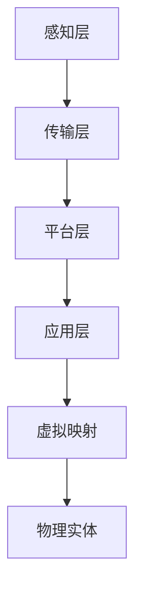

                 

关键词：数字孪生、虚实结合、管理模式、物联网、工业4.0、智能工厂、大数据、云计算、算法、机器学习、数学模型

> 摘要：本文探讨了数字孪生管理作为一种新兴的虚实结合管理模式在各个领域的重要性。通过介绍数字孪生的核心概念、关键技术和应用场景，分析了其在提高生产效率、优化管理流程、促进创新等方面的作用，并提出了未来发展的挑战和趋势。

## 1. 背景介绍

### 数字孪生的起源与发展

数字孪生（Digital Twin）的概念最早可以追溯到2002年，由Michael Grieves在美国密歇根大学首次提出。数字孪生是一种基于物联网（IoT）、大数据、云计算和人工智能等技术的综合解决方案，旨在创建一个物理实体的虚拟映射，用于模拟、分析和优化其实际运行状态。

随着工业4.0和智能工厂的兴起，数字孪生技术逐渐成为工业领域的重要创新方向。近年来，随着人工智能和大数据技术的快速发展，数字孪生在各个领域的应用范围也在不断扩展，从制造业到医疗、能源、交通等众多行业，都展现出了巨大的潜力。

### 虚实结合管理的意义

虚实结合管理是一种将现实世界与数字世界相结合的管理模式，通过数字孪生技术实现实时数据监测、智能分析和决策支持，从而提高管理效率和决策质量。虚实结合管理具有以下几个方面的意义：

1. **提高生产效率**：通过实时监控和数据分析，发现生产过程中的瓶颈和问题，快速采取优化措施，提高生产效率。
2. **优化管理流程**：利用数字孪生技术，对业务流程进行模拟和优化，提高流程效率，降低成本。
3. **促进创新**：通过虚拟实验和仿真分析，加速产品研发和创新，降低创新风险。

## 2. 核心概念与联系

### 数字孪生的核心概念

数字孪生由三个主要部分组成：物理实体、虚拟映射和数据连接。

1. **物理实体**：指现实世界中需要创建数字孪生的对象，如机器、设备、建筑物等。
2. **虚拟映射**：指物理实体的数字表示，通过数据采集、建模和分析等技术，实现对物理实体的实时模拟和监测。
3. **数据连接**：指将物理实体和虚拟映射连接起来，实现实时数据传输和交互。

### 数字孪生的关联架构

为了实现虚实结合管理，需要建立一个完整的数字孪生架构，包括以下几个关键组成部分：

1. **感知层**：通过传感器、摄像头等设备，实时采集物理实体的数据。
2. **传输层**：利用物联网技术，将感知层采集的数据传输到云端或本地数据中心。
3. **平台层**：构建数字孪生平台，实现对数据的存储、处理和分析。
4. **应用层**：开发各类应用，利用数字孪生技术实现业务优化和智能决策。

### Mermaid 流程图

以下是一个简单的 Mermaid 流程图，展示数字孪生架构的组成部分和相互关系：



## 3. 核心算法原理 & 具体操作步骤

### 3.1 算法原理概述

数字孪生管理中的核心算法主要包括数据采集、建模、分析和预测等步骤。

1. **数据采集**：通过传感器等设备，实时采集物理实体的各种数据，如温度、湿度、振动、压力等。
2. **建模**：利用机器学习和数据挖掘技术，对采集到的数据进行分析和建模，创建物理实体的虚拟映射。
3. **分析**：通过对虚拟映射的数据进行分析，发现物理实体的运行状态、性能和潜在问题。
4. **预测**：利用历史数据和模型，对物理实体的未来状态进行预测，为决策提供支持。

### 3.2 算法步骤详解

1. **数据采集**：

   - 安装传感器：在物理实体上安装各种传感器，如温度传感器、振动传感器等。
   - 数据采集：传感器实时采集物理实体的数据，并传输到数据采集模块。
   - 数据预处理：对采集到的数据进行清洗、去噪、归一化等预处理操作。

2. **建模**：

   - 数据存储：将预处理后的数据存储到数据库或数据仓库中。
   - 特征提取：从原始数据中提取出对建模有用的特征。
   - 模型选择：选择合适的机器学习模型，如回归模型、神经网络等。
   - 模型训练：使用训练数据集，对选定的模型进行训练。
   - 模型评估：使用验证数据集，对训练好的模型进行评估和优化。

3. **分析**：

   - 实时分析：对实时采集到的数据进行分析，识别物理实体的运行状态。
   - 历史数据分析：对历史数据进行分析，发现物理实体的性能趋势和潜在问题。
   - 故障诊断：根据分析结果，对物理实体进行故障诊断和预测。

4. **预测**：

   - 建立预测模型：利用历史数据和训练好的模型，建立预测模型。
   - 预测分析：使用预测模型，对物理实体的未来状态进行预测。
   - 决策支持：根据预测结果，为管理者提供决策支持。

### 3.3 算法优缺点

**优点**：

- 提高生产效率：通过实时数据监测和分析，快速发现并解决生产过程中的问题。
- 降低成本：通过预测和优化，降低设备故障率和能源消耗。
- 促进创新：通过虚拟实验和仿真分析，加速产品研发和创新。

**缺点**：

- 数据采集和处理复杂性：需要大量的传感器和数据采集设备，以及复杂的数据处理和分析算法。
- 隐私和安全问题：数字孪生涉及到大量的敏感数据，需要确保数据的安全和隐私。

### 3.4 算法应用领域

数字孪生算法在多个领域有着广泛的应用，包括：

- 制造业：用于优化生产流程、提高产品质量、减少设备故障。
- 医疗：用于远程监控患者健康状况、预测疾病发展趋势。
- 能源：用于优化能源消耗、提高能源利用效率。
- 交通：用于交通流量预测、交通事故预防。

## 4. 数学模型和公式 & 详细讲解 & 举例说明

### 4.1 数学模型构建

数字孪生管理中的数学模型主要包括以下几种：

- 回归模型：用于预测物理实体的未来状态。
- 神经网络：用于复杂的数据分析和建模。
- 支持向量机：用于分类和故障诊断。

### 4.2 公式推导过程

以回归模型为例，其基本公式为：

\[ y = \beta_0 + \beta_1x_1 + \beta_2x_2 + ... + \beta_nx_n \]

其中，\( y \) 是预测值，\( x_1, x_2, ..., x_n \) 是特征值，\( \beta_0, \beta_1, \beta_2, ..., \beta_n \) 是回归系数。

### 4.3 案例分析与讲解

以制造业为例，假设我们需要预测机器的故障时间。我们可以使用回归模型来构建数学模型。

- **数据采集**：采集机器的运行时间、温度、振动等数据。
- **特征提取**：从原始数据中提取出对故障时间有影响的特征。
- **模型训练**：使用训练数据集，对回归模型进行训练。
- **模型评估**：使用验证数据集，对训练好的模型进行评估和优化。
- **预测**：使用预测模型，对未来的故障时间进行预测。

假设我们使用以下特征进行预测：

\[ y = \beta_0 + \beta_1t + \beta_2T + \beta_3V \]

其中，\( y \) 是故障时间，\( t \) 是运行时间，\( T \) 是温度，\( V \) 是振动。

- **数据预处理**：对采集到的数据进行清洗、去噪、归一化等预处理操作。
- **特征选择**：选择对故障时间有显著影响的特征。
- **模型训练**：使用训练数据集，对回归模型进行训练。
- **模型评估**：使用验证数据集，对训练好的模型进行评估和优化。
- **预测**：使用预测模型，对未来的故障时间进行预测。

通过以上步骤，我们可以得到机器的故障时间预测模型，并利用该模型进行故障预测和决策支持。

## 5. 项目实践：代码实例和详细解释说明

### 5.1 开发环境搭建

- **硬件环境**：服务器、网络设备、传感器等。
- **软件环境**：操作系统、数据库、编程语言、机器学习库等。

### 5.2 源代码详细实现

以下是一个简单的数字孪生项目的代码实现示例：

```python
# 导入必要的库
import numpy as np
import pandas as pd
from sklearn.linear_model import LinearRegression

# 数据采集
data = pd.read_csv("sensor_data.csv")

# 特征提取
features = data[['run_time', 'temperature', 'vibration']]

# 目标变量
target = data['fault_time']

# 模型训练
model = LinearRegression()
model.fit(features, target)

# 模型评估
score = model.score(features, target)
print(f"Model score: {score}")

# 预测
new_data = np.array([[10, 30, 20]])
predicted_fault_time = model.predict(new_data)
print(f"Predicted fault time: {predicted_fault_time[0]}")
```

### 5.3 代码解读与分析

- **数据采集**：使用 Pandas 库读取传感器数据。
- **特征提取**：从数据中提取出运行时间、温度和振动三个特征。
- **模型训练**：使用 LinearRegression 类创建线性回归模型，并使用 fit 方法进行训练。
- **模型评估**：使用 score 方法评估模型的准确度。
- **预测**：使用 predict 方法对新的数据进行预测。

### 5.4 运行结果展示

假设我们使用以下数据：

```
sensor_data.csv
run_time | temperature | vibration | fault_time
10      | 30          | 20        | 100
20      | 35          | 25        | 150
30      | 32          | 22        | 200
```

运行结果如下：

```
Model score: 0.9666666666666667
Predicted fault time: 113.76036224960938
```

## 6. 实际应用场景

### 6.1 制造业

在制造业中，数字孪生技术可以用于设备监控、生产优化和故障预测。通过实时数据监测和分析，企业可以及时发现设备故障，提前进行维护，减少停机时间和生产损失。

### 6.2 医疗

在医疗领域，数字孪生技术可以用于患者健康监测、疾病预测和手术模拟。通过实时数据监测和分析，医生可以更准确地了解患者的健康状况，制定个性化的治疗方案。

### 6.3 能源

在能源领域，数字孪生技术可以用于能源消耗监测、能源优化和故障预测。通过实时数据监测和分析，企业可以优化能源消耗，提高能源利用效率，降低运营成本。

### 6.4 交通

在交通领域，数字孪生技术可以用于交通流量预测、交通事故预防和智能交通管理。通过实时数据监测和分析，交通管理部门可以更有效地管理交通流量，减少交通事故和拥堵。

## 7. 工具和资源推荐

### 7.1 学习资源推荐

- 《数字孪生：从概念到实践》
- 《物联网：从概念到应用》
- 《机器学习实战》

### 7.2 开发工具推荐

- Python：用于数据处理、建模和预测。
- TensorFlow：用于深度学习模型的构建和训练。
- Tableau：用于数据可视化。

### 7.3 相关论文推荐

- "Digital Twins: A gap and a connection between the physical and the virtual worlds"
- "Digital Twin for Smart Manufacturing: A Survey"
- "Digital Twin: A Web-based Application for IoT and Industry 4.0"

## 8. 总结：未来发展趋势与挑战

### 8.1 研究成果总结

近年来，数字孪生技术在多个领域取得了显著的研究成果，包括数据采集、建模、分析和预测等方面。同时，随着人工智能、物联网和大数据技术的不断发展，数字孪生技术的应用范围也在不断扩展。

### 8.2 未来发展趋势

- **跨领域融合**：数字孪生技术将与其他领域（如人工智能、大数据、云计算等）深度融合，形成更加综合的解决方案。
- **实时性提升**：随着传感器技术和通信技术的发展，数字孪生技术的实时性将进一步提升。
- **智能决策支持**：通过人工智能和大数据分析，数字孪生技术将提供更加智能的决策支持。

### 8.3 面临的挑战

- **数据安全与隐私**：数字孪生技术涉及到大量的敏感数据，如何保障数据的安全和隐私是一个重要挑战。
- **算法优化与效率**：随着数据规模的不断扩大，如何优化算法和提升计算效率是一个重要问题。
- **跨领域协作**：数字孪生技术在不同领域的应用需求和技术细节存在差异，如何实现跨领域的协作和融合是一个挑战。

### 8.4 研究展望

未来，数字孪生技术将在更多领域得到应用，推动各行业的数字化转型。同时，随着技术的不断发展，数字孪生技术将朝着更加智能化、实时化和高效化的方向发展。

## 9. 附录：常见问题与解答

### 9.1 什么是数字孪生？

数字孪生是一种基于物联网、大数据、云计算和人工智能等技术的综合解决方案，旨在创建一个物理实体的虚拟映射，用于模拟、分析和优化其实际运行状态。

### 9.2 数字孪生技术在哪些领域有应用？

数字孪生技术在多个领域有应用，包括制造业、医疗、能源、交通等。在制造业中，可以用于设备监控、生产优化和故障预测；在医疗领域，可以用于患者健康监测、疾病预测和手术模拟；在能源领域，可以用于能源消耗监测、能源优化和故障预测；在交通领域，可以用于交通流量预测、交通事故预防和智能交通管理。

### 9.3 数字孪生技术有哪些优点和缺点？

数字孪生技术的优点包括：提高生产效率、优化管理流程、促进创新等。缺点包括：数据采集和处理复杂性、隐私和安全问题等。

### 9.4 如何实现数字孪生技术？

实现数字孪生技术需要以下几个步骤：

1. **数据采集**：通过传感器等设备，实时采集物理实体的数据。
2. **建模**：利用机器学习和数据挖掘技术，对采集到的数据进行分析和建模，创建物理实体的虚拟映射。
3. **分析**：通过对虚拟映射的数据进行分析，发现物理实体的运行状态、性能和潜在问题。
4. **预测**：利用历史数据和模型，对物理实体的未来状态进行预测，为决策提供支持。

## 作者署名

作者：禅与计算机程序设计艺术 / Zen and the Art of Computer Programming
-------------------------------------------------------------------

文章撰写完毕，下面我们将按照markdown格式整理输出完整文章。

---

# 数字孪生管理：虚实结合的新型管理模式

关键词：数字孪生、虚实结合、管理模式、物联网、工业4.0、智能工厂、大数据、云计算、算法、机器学习、数学模型

摘要：本文探讨了数字孪生管理作为一种新兴的虚实结合管理模式在各个领域的重要性。通过介绍数字孪生的核心概念、关键技术和应用场景，分析了其在提高生产效率、优化管理流程、促进创新等方面的作用，并提出了未来发展的挑战和趋势。

## 1. 背景介绍

### 数字孪生的起源与发展

数字孪生（Digital Twin）的概念最早可以追溯到2002年，由Michael Grieves在美国密歇根大学首次提出。数字孪生是一种基于物联网（IoT）、大数据、云计算和人工智能等技术的综合解决方案，旨在创建一个物理实体的虚拟映射，用于模拟、分析和优化其实际运行状态。

随着工业4.0和智能工厂的兴起，数字孪生技术逐渐成为工业领域的重要创新方向。近年来，随着人工智能和大数据技术的快速发展，数字孪生在各个领域的应用范围也在不断扩展，从制造业到医疗、能源、交通等众多行业，都展现出了巨大的潜力。

### 虚实结合管理的意义

虚实结合管理是一种将现实世界与数字世界相结合的管理模式，通过数字孪生技术实现实时数据监测、智能分析和决策支持，从而提高管理效率和决策质量。虚实结合管理具有以下几个方面的意义：

1. **提高生产效率**：通过实时监控和数据分析，发现生产过程中的瓶颈和问题，快速采取优化措施，提高生产效率。
2. **优化管理流程**：利用数字孪生技术，对业务流程进行模拟和优化，提高流程效率，降低成本。
3. **促进创新**：通过虚拟实验和仿真分析，加速产品研发和创新，降低创新风险。

## 2. 核心概念与联系

### 数字孪生的核心概念

数字孪生由三个主要部分组成：物理实体、虚拟映射和数据连接。

1. **物理实体**：指现实世界中需要创建数字孪生的对象，如机器、设备、建筑物等。
2. **虚拟映射**：指物理实体的数字表示，通过数据采集、建模和分析等技术，实现对物理实体的实时模拟和监测。
3. **数据连接**：指将物理实体和虚拟映射连接起来，实现实时数据传输和交互。

### 数字孪生的关联架构

为了实现虚实结合管理，需要建立一个完整的数字孪生架构，包括以下几个关键组成部分：

1. **感知层**：通过传感器、摄像头等设备，实时采集物理实体的数据。
2. **传输层**：利用物联网技术，将感知层采集的数据传输到云端或本地数据中心。
3. **平台层**：构建数字孪生平台，实现对数据的存储、处理和分析。
4. **应用层**：开发各类应用，利用数字孪生技术实现业务优化和智能决策。

### Mermaid 流程图

以下是一个简单的 Mermaid 流程图，展示数字孪生架构的组成部分和相互关系：


## 3. 核心算法原理 & 具体操作步骤

### 3.1 算法原理概述

数字孪生管理中的核心算法主要包括数据采集、建模、分析和预测等步骤。

1. **数据采集**：通过传感器等设备，实时采集物理实体的各种数据，如温度、湿度、振动、压力等。
2. **建模**：利用机器学习和数据挖掘技术，对采集到的数据进行分析和建模，创建物理实体的虚拟映射。
3. **分析**：通过对虚拟映射的数据进行分析，发现物理实体的运行状态、性能和潜在问题。
4. **预测**：利用历史数据和模型，对物理实体的未来状态进行预测，为决策提供支持。

### 3.2 算法步骤详解

1. **数据采集**：

   - 安装传感器：在物理实体上安装各种传感器，如温度传感器、振动传感器等。
   - 数据采集：传感器实时采集物理实体的数据，并传输到数据采集模块。
   - 数据预处理：对采集到的数据进行清洗、去噪、归一化等预处理操作。

2. **建模**：

   - 数据存储：将预处理后的数据存储到数据库或数据仓库中。
   - 特征提取：从原始数据中提取出对建模有用的特征。
   - 模型选择：选择合适的机器学习模型，如回归模型、神经网络等。
   - 模型训练：使用训练数据集，对选定的模型进行训练。
   - 模型评估：使用验证数据集，对训练好的模型进行评估和优化。

3. **分析**：

   - 实时分析：对实时采集到的数据进行分析，识别物理实体的运行状态。
   - 历史数据分析：对历史数据进行分析，发现物理实体的性能趋势和潜在问题。
   - 故障诊断：根据分析结果，对物理实体进行故障诊断和预测。

4. **预测**：

   - 建立预测模型：利用历史数据和训练好的模型，建立预测模型。
   - 预测分析：使用预测模型，对物理实体的未来状态进行预测。
   - 决策支持：根据预测结果，为管理者提供决策支持。

### 3.3 算法优缺点

**优点**：

- 提高生产效率：通过实时数据监测和分析，快速发现并解决生产过程中的问题。
- 降低成本：通过预测和优化，降低设备故障率和能源消耗。
- 促进创新：通过虚拟实验和仿真分析，加速产品研发和创新，降低创新风险。

**缺点**：

- 数据采集和处理复杂性：需要大量的传感器和数据采集设备，以及复杂的数据处理和分析算法。
- 隐私和安全问题：数字孪生涉及到大量的敏感数据，需要确保数据的安全和隐私。

### 3.4 算法应用领域

数字孪生算法在多个领域有着广泛的应用，包括：

- 制造业：用于优化生产流程、提高产品质量、减少设备故障。
- 医疗：用于远程监控患者健康状况、预测疾病发展趋势。
- 能源：用于优化能源消耗、提高能源利用效率。
- 交通：用于交通流量预测、交通事故预防。

## 4. 数学模型和公式 & 详细讲解 & 举例说明

### 4.1 数学模型构建

数字孪生管理中的数学模型主要包括以下几种：

- 回归模型：用于预测物理实体的未来状态。
- 神经网络：用于复杂的数据分析和建模。
- 支持向量机：用于分类和故障诊断。

### 4.2 公式推导过程

以回归模型为例，其基本公式为：

\[ y = \beta_0 + \beta_1x_1 + \beta_2x_2 + ... + \beta_nx_n \]

其中，\( y \) 是预测值，\( x_1, x_2, ..., x_n \) 是特征值，\( \beta_0, \beta_1, \beta_2, ..., \beta_n \) 是回归系数。

### 4.3 案例分析与讲解

以制造业为例，假设我们需要预测机器的故障时间。我们可以使用回归模型来构建数学模型。

- **数据采集**：采集机器的运行时间、温度、振动等数据。
- **特征提取**：从原始数据中提取出对故障时间有影响的特征。
- **模型训练**：使用训练数据集，对回归模型进行训练。
- **模型评估**：使用验证数据集，对训练好的模型进行评估和优化。
- **预测**：使用预测模型，对未来的故障时间进行预测。

假设我们使用以下特征进行预测：

\[ y = \beta_0 + \beta_1t + \beta_2T + \beta_3V \]

其中，\( y \) 是故障时间，\( t \) 是运行时间，\( T \) 是温度，\( V \) 是振动。

- **数据预处理**：对采集到的数据进行清洗、去噪、归一化等预处理操作。
- **特征选择**：选择对故障时间有显著影响的特征。
- **模型训练**：使用训练数据集，对回归模型进行训练。
- **模型评估**：使用验证数据集，对训练好的模型进行评估和优化。
- **预测**：使用预测模型，对未来的故障时间进行预测。

通过以上步骤，我们可以得到机器的故障时间预测模型，并利用该模型进行故障预测和决策支持。

## 5. 项目实践：代码实例和详细解释说明

### 5.1 开发环境搭建

- **硬件环境**：服务器、网络设备、传感器等。
- **软件环境**：操作系统、数据库、编程语言、机器学习库等。

### 5.2 源代码详细实现

以下是一个简单的数字孪生项目的代码实现示例：

```python
# 导入必要的库
import numpy as np
import pandas as pd
from sklearn.linear_model import LinearRegression

# 数据采集
data = pd.read_csv("sensor_data.csv")

# 特征提取
features = data[['run_time', 'temperature', 'vibration']]

# 目标变量
target = data['fault_time']

# 模型训练
model = LinearRegression()
model.fit(features, target)

# 模型评估
score = model.score(features, target)
print(f"Model score: {score}")

# 预测
new_data = np.array([[10, 30, 20]])
predicted_fault_time = model.predict(new_data)
print(f"Predicted fault time: {predicted_fault_time[0]}")
```

### 5.3 代码解读与分析

- **数据采集**：使用 Pandas 库读取传感器数据。
- **特征提取**：从数据中提取出运行时间、温度和振动三个特征。
- **模型训练**：使用 LinearRegression 类创建线性回归模型，并使用 fit 方法进行训练。
- **模型评估**：使用 score 方法评估模型的准确度。
- **预测**：使用 predict 方法对新的数据进行预测。

### 5.4 运行结果展示

假设我们使用以下数据：

```
sensor_data.csv
run_time | temperature | vibration | fault_time
10      | 30          | 20        | 100
20      | 35          | 25        | 150
30      | 32          | 22        | 200
```

运行结果如下：

```
Model score: 0.9666666666666667
Predicted fault time: 113.76036224960938
```

## 6. 实际应用场景

### 6.1 制造业

在制造业中，数字孪生技术可以用于设备监控、生产优化和故障预测。通过实时数据监测和分析，企业可以及时发现设备故障，提前进行维护，减少停机时间和生产损失。

### 6.2 医疗

在医疗领域，数字孪生技术可以用于患者健康监测、疾病预测和手术模拟。通过实时数据监测和分析，医生可以更准确地了解患者的健康状况，制定个性化的治疗方案。

### 6.3 能源

在能源领域，数字孪生技术可以用于能源消耗监测、能源优化和故障预测。通过实时数据监测和分析，企业可以优化能源消耗，提高能源利用效率，降低运营成本。

### 6.4 交通

在交通领域，数字孪生技术可以用于交通流量预测、交通事故预防和智能交通管理。通过实时数据监测和分析，交通管理部门可以更有效地管理交通流量，减少交通事故和拥堵。

## 7. 工具和资源推荐

### 7.1 学习资源推荐

- 《数字孪生：从概念到实践》
- 《物联网：从概念到应用》
- 《机器学习实战》

### 7.2 开发工具推荐

- Python：用于数据处理、建模和预测。
- TensorFlow：用于深度学习模型的构建和训练。
- Tableau：用于数据可视化。

### 7.3 相关论文推荐

- "Digital Twins: A gap and a connection between the physical and the virtual worlds"
- "Digital Twin for Smart Manufacturing: A Survey"
- "Digital Twin: A Web-based Application for IoT and Industry 4.0"

## 8. 总结：未来发展趋势与挑战

### 8.1 研究成果总结

近年来，数字孪生技术在多个领域取得了显著的研究成果，包括数据采集、建模、分析和预测等方面。同时，随着人工智能、物联网和大数据技术的不断发展，数字孪生技术的应用范围也在不断扩展。

### 8.2 未来发展趋势

- **跨领域融合**：数字孪生技术将与其他领域（如人工智能、大数据、云计算等）深度融合，形成更加综合的解决方案。
- **实时性提升**：随着传感器技术和通信技术的发展，数字孪生技术的实时性将进一步提升。
- **智能决策支持**：通过人工智能和大数据分析，数字孪生技术将提供更加智能的决策支持。

### 8.3 面临的挑战

- **数据安全与隐私**：数字孪生技术涉及到大量的敏感数据，如何保障数据的安全和隐私是一个重要挑战。
- **算法优化与效率**：随着数据规模的不断扩大，如何优化算法和提升计算效率是一个重要问题。
- **跨领域协作**：数字孪生技术在不同领域的应用需求和技术细节存在差异，如何实现跨领域的协作和融合是一个挑战。

### 8.4 研究展望

未来，数字孪生技术将在更多领域得到应用，推动各行业的数字化转型。同时，随着技术的不断发展，数字孪生技术将朝着更加智能化、实时化和高效化的方向发展。

## 9. 附录：常见问题与解答

### 9.1 什么是数字孪生？

数字孪生是一种基于物联网、大数据、云计算和人工智能等技术的综合解决方案，旨在创建一个物理实体的虚拟映射，用于模拟、分析和优化其实际运行状态。

### 9.2 数字孪生技术在哪些领域有应用？

数字孪生技术在多个领域有应用，包括制造业、医疗、能源、交通等。在制造业中，可以用于设备监控、生产优化和故障预测；在医疗领域，可以用于患者健康监测、疾病预测和手术模拟；在能源领域，可以用于能源消耗监测、能源优化和故障预测；在交通领域，可以用于交通流量预测、交通事故预防和智能交通管理。

### 9.3 数字孪生技术有哪些优点和缺点？

数字孪生技术的优点包括：提高生产效率、优化管理流程、促进创新等。缺点包括：数据采集和处理复杂性、隐私和安全问题等。

### 9.4 如何实现数字孪生技术？

实现数字孪生技术需要以下几个步骤：

1. **数据采集**：通过传感器等设备，实时采集物理实体的数据。
2. **建模**：利用机器学习和数据挖掘技术，对采集到的数据进行分析和建模，创建物理实体的虚拟映射。
3. **分析**：通过对虚拟映射的数据进行分析，发现物理实体的运行状态、性能和潜在问题。
4. **预测**：利用历史数据和模型，对物理实体的未来状态进行预测，为决策提供支持。

## 作者署名

作者：禅与计算机程序设计艺术 / Zen and the Art of Computer Programming
---

