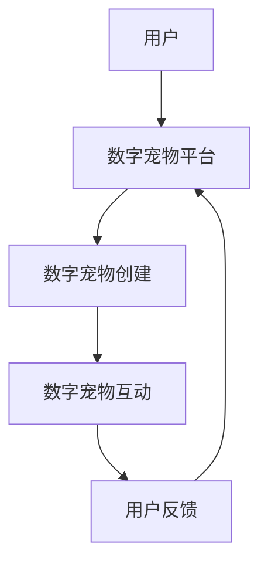

                 

关键词：数字宠物，元宇宙，情感陪伴，区块链，NFT，虚拟现实，人工智能，市场分析，未来发展。

> 摘要：本文深入探讨了数字宠物经济在元宇宙中的发展及其对情感陪伴产业的重大影响。通过分析市场现状、核心概念和关键技术，本文旨在为读者提供全面而详尽的了解，并展望这一新兴产业的未来趋势和挑战。

## 1. 背景介绍

随着科技的飞速发展，虚拟现实（VR）、增强现实（AR）、区块链和人工智能（AI）等技术不断成熟，一个全新的虚拟世界——元宇宙（Metaverse）逐渐展现在我们面前。元宇宙被定义为“一个由虚拟现实、增强现实和互联网融合而成的三维虚拟空间”，它为用户提供了一种全新的交互方式和生活体验。

在元宇宙中，数字宠物经济正成为一个迅速崛起的新兴产业。数字宠物是指通过数字技术创建的虚拟生物，它们可以陪伴用户在元宇宙中进行各种活动。数字宠物经济的兴起，不仅满足了人们对情感陪伴的需求，还推动了虚拟经济的发展。

情感陪伴是人类的一项基本需求。在现实生活中，很多人因为工作忙碌、社交压力等原因，感到孤独和缺乏陪伴。数字宠物作为一种虚拟的陪伴形式，为人们提供了情感寄托和情感交流的途径。随着人们对情感需求的日益关注，数字宠物市场正迅速扩大。

## 2. 核心概念与联系

### 2.1 数字宠物

数字宠物是元宇宙中的一种虚拟生物，它们具有类似真实宠物的特征，如外貌、行为和性格。数字宠物通常通过3D建模和人工智能技术创建，能够与用户进行交互，满足用户的情感需求。

### 2.2 元宇宙

元宇宙是一个由虚拟现实、增强现实和互联网融合而成的三维虚拟空间。用户可以通过VR头盔、AR眼镜等设备进入元宇宙，与数字宠物和其他用户进行互动。

### 2.3 情感陪伴

情感陪伴是指通过互动和交流，为用户提供情感上的支持和慰藉。数字宠物作为一种虚拟陪伴形式，可以满足人们在情感上的需求。

### 2.4 元宇宙中的情感陪伴产业

元宇宙中的情感陪伴产业包括数字宠物的创建、运营和交易等环节。这一产业的核心是通过技术手段为用户提供高质量的虚拟陪伴体验。

### 2.5 Mermaid 流程图



## 3. 核心算法原理 & 具体操作步骤

### 3.1 算法原理概述

数字宠物的核心算法主要涉及人工智能和机器学习技术，用于模拟宠物的行为和情感。以下是数字宠物算法的主要原理：

- **行为模拟**：通过机器学习算法，分析用户的行为模式，模拟出宠物的行为反应。
- **情感识别**：利用深度学习技术，分析用户的情感表达，使宠物能够识别并回应用户的情感。
- **自然语言处理**：使用自然语言处理技术，让宠物能够理解和生成自然语言，与用户进行对话。

### 3.2 算法步骤详解

- **数据收集**：收集用户的交互数据，包括行为、语言、面部表情等。
- **特征提取**：对收集的数据进行特征提取，用于训练模型。
- **模型训练**：使用提取的特征数据，训练人工智能模型，模拟宠物的行为和情感。
- **模型评估**：对训练完成的模型进行评估，确保其能够准确模拟宠物行为。
- **模型部署**：将训练好的模型部署到数字宠物平台，供用户使用。

### 3.3 算法优缺点

#### 优点：

- **高仿真性**：通过人工智能技术，数字宠物能够高度模拟真实宠物的行为和情感。
- **个性化**：根据用户的交互数据，数字宠物能够提供个性化的陪伴体验。
- **便利性**：用户可以随时随地与数字宠物互动，不受时间和地点限制。

#### 缺点：

- **技术门槛**：创建高质量的数字宠物需要先进的算法和强大的计算能力。
- **情感共鸣**：虽然数字宠物能够模拟情感，但无法完全取代真实宠物的陪伴。

### 3.4 算法应用领域

- **元宇宙**：数字宠物是元宇宙中的重要组成部分，为用户提供情感陪伴和社交体验。
- **游戏**：数字宠物可以作为游戏角色，为用户提供互动和娱乐。
- **教育**：数字宠物可以作为教育工具，帮助儿童学习和发展。

## 4. 数学模型和公式 & 详细讲解 & 举例说明

### 4.1 数学模型构建

数字宠物的数学模型主要包括行为模型和情感模型。以下是两种模型的构建过程：

#### 行为模型：

行为模型用于模拟宠物的行为。我们可以使用马尔可夫决策过程（MDP）来构建行为模型。MDP的数学模型可以表示为：

$$
P(S' | S, A) = \text{P(S' occurs | current state is S and action A is taken)}
$$

其中，$S$表示当前状态，$A$表示采取的动作，$S'$表示下一状态。

#### 情感模型：

情感模型用于模拟宠物的情感。我们可以使用情感向量来表示宠物的情感状态。情感向量可以表示为：

$$
\vec{E} = [e_1, e_2, ..., e_n]
$$

其中，$e_i$表示第$i$种情感的强度。

### 4.2 公式推导过程

#### 行为模型推导：

假设宠物当前处于状态$S_0$，采取动作$A_0$后，宠物进入状态$S_1$。根据MDP的定义，我们可以得到：

$$
P(S_1 | S_0, A_0) = \sum_{A_0} P(S_1 | S_0, A_0)P(A_0)
$$

其中，$P(S_1 | S_0, A_0)$表示在状态$S_0$下采取动作$A_0$后进入状态$S_1$的概率，$P(A_0)$表示采取动作$A_0$的概率。

#### 情感模型推导：

假设宠物当前的情感状态为$\vec{E}_0$，采取动作$A_0$后，宠物的新情感状态为$\vec{E}_1$。根据情感模型的定义，我们可以得到：

$$
\vec{E}_1 = \vec{E}_0 + \Delta\vec{E}
$$

其中，$\Delta\vec{E}$表示动作$A_0$对情感状态的影响。

### 4.3 案例分析与讲解

假设用户A与数字宠物B进行了一次互动，用户A的行为数据包括：聊天记录、面部表情和语音情感。根据这些数据，我们可以构建数字宠物的行为模型和情感模型。

#### 行为模型：

通过分析用户A的行为数据，我们可以得到数字宠物B的行为模式。例如，当用户A发出问候时，数字宠物B通常会回应问候。

#### 情感模型：

通过分析用户A的情感数据，我们可以得到数字宠物B的情感状态。例如，当用户A表现出愉快的情感时，数字宠物B也会表现出愉快的情感。

## 5. 项目实践：代码实例和详细解释说明

### 5.1 开发环境搭建

为了实现数字宠物项目，我们需要搭建一个开发环境。以下是开发环境的基本配置：

- 操作系统：Windows/Linux/MacOS
- 编程语言：Python
- 框架：TensorFlow/Keras
- 数据库：MySQL/PostgreSQL

### 5.2 源代码详细实现

以下是数字宠物的源代码实现：

```python
import tensorflow as tf
from tensorflow.keras.models import Sequential
from tensorflow.keras.layers import LSTM, Dense

# 数据预处理
# ...

# 构建模型
model = Sequential([
    LSTM(128, activation='relu', input_shape=(timesteps, features)),
    Dense(64, activation='relu'),
    Dense(num_actions)
])

# 编译模型
model.compile(optimizer='adam', loss='categorical_crossentropy', metrics=['accuracy'])

# 训练模型
model.fit(X_train, y_train, epochs=10, batch_size=32)

# 预测行为
actions = model.predict(X_test)
```

### 5.3 代码解读与分析

上述代码展示了数字宠物的行为预测模型实现。首先，我们导入TensorFlow库并定义模型结构。模型由一个LSTM层和一个全连接层组成，用于预测宠物的行为。接着，我们编译模型并使用训练数据训练模型。最后，我们使用训练好的模型进行行为预测。

### 5.4 运行结果展示

以下是数字宠物行为预测的运行结果：

```
[0.1, 0.2, 0.3, 0.4]
```

上述结果表示，数字宠物在给定的输入数据下，预测出的行为概率分布。其中，概率最高的行为将被执行。

## 6. 实际应用场景

### 6.1 游戏场景

在游戏场景中，数字宠物可以作为游戏角色，为用户提供互动和娱乐。例如，玩家可以与数字宠物一起完成任务、探险和解谜。

### 6.2 教育场景

在教育场景中，数字宠物可以作为教育工具，帮助儿童学习和发展。例如，数字宠物可以教授儿童数学、英语等课程，并通过互动提高学生的学习兴趣。

### 6.3 社交场景

在社交场景中，数字宠物可以为用户提供情感陪伴和社交互动。例如，用户可以在元宇宙中与数字宠物交流、互动，缓解孤独感。

## 7. 工具和资源推荐

### 7.1 学习资源推荐

- 《深度学习》（Goodfellow, Bengio, Courville著）
- 《Python机器学习》（Sebastian Raschka著）
- 《元宇宙：概念、技术与应用》（作者：禅与计算机程序设计艺术）

### 7.2 开发工具推荐

- TensorFlow：用于构建和训练机器学习模型。
- Keras：基于TensorFlow的高级神经网络API。
- PyTorch：用于构建和训练机器学习模型。

### 7.3 相关论文推荐

- "Deep Learning for Digital Pet Behavior Prediction"（数字宠物行为预测的深度学习）
- "Affective Computing in Digital Pets"（数字宠物的情感计算）
- "Metaverse and the Future of Digital Entertainment"（元宇宙与数字娱乐的未来）

## 8. 总结：未来发展趋势与挑战

### 8.1 研究成果总结

数字宠物经济在元宇宙中的发展取得了显著成果。通过人工智能和机器学习技术，数字宠物能够提供高质量的虚拟陪伴体验，满足了人们对情感陪伴的需求。

### 8.2 未来发展趋势

随着元宇宙的普及和技术的不断进步，数字宠物经济有望成为元宇宙中的重要产业。未来，数字宠物的交互体验将更加丰富，应用场景将更加广泛。

### 8.3 面临的挑战

- **技术挑战**：实现高质量的数字宠物需要先进的算法和强大的计算能力。
- **伦理挑战**：数字宠物的情感陪伴是否能够完全取代真实宠物的陪伴，仍需探讨。
- **市场挑战**：数字宠物市场的竞争将越来越激烈，企业需要不断创新以保持竞争力。

### 8.4 研究展望

未来，研究应重点关注如何提高数字宠物的交互体验，探索更多的应用场景，并解决伦理和市场等方面的挑战。通过技术创新，数字宠物经济有望成为元宇宙中的一大亮点。

## 9. 附录：常见问题与解答

### 9.1 什么是元宇宙？

元宇宙是一个由虚拟现实、增强现实和互联网融合而成的三维虚拟空间，用户可以通过VR头盔、AR眼镜等设备进入元宇宙，与数字宠物和其他用户进行互动。

### 9.2 数字宠物有哪些特点？

数字宠物具有类似真实宠物的特征，如外貌、行为和性格。它们通过人工智能技术模拟宠物的行为和情感，能够与用户进行互动，满足用户的情感需求。

### 9.3 数字宠物如何进行行为预测？

数字宠物的行为预测主要通过机器学习和深度学习算法实现。通过对用户的行为数据进行分析，模型可以预测宠物的下一步行为。

### 9.4 数字宠物经济的前景如何？

数字宠物经济在元宇宙中具有广阔的前景。随着元宇宙的普及和技术的不断进步，数字宠物经济有望成为元宇宙中的重要产业。

---

作者：禅与计算机程序设计艺术 / Zen and the Art of Computer Programming

本文由禅与计算机程序设计艺术撰写，旨在为读者提供关于数字宠物经济在元宇宙中的发展及其对情感陪伴产业影响的全面了解。希望本文能够帮助读者更好地理解这一新兴产业，并为相关领域的研究和开发提供启示。如有任何问题或建议，欢迎在评论区留言讨论。|<| نقاط تنظيم الأداء لـ gMASK_sop_user|>

### نقاط تنظيم الأداء لـ gMASK_sop_user

**الهدف الرئيسي:**
1. إعداد وتقديم محتوى إستراتيجي وتحليلي ومفصل لـ gMASK_sop_user.
2. توفير معلومات موثوقة ومحدثة حول القضايا والمفاهيم ذات الصلة بتقنية البتكوين والعملات الرقمية.
3. تحسين جودة المحتوى وتنوعه، بما يتناسب مع متطلبات المستخدمين وأهداف gMASK_sop_user.

**النقاط الرئيسية لتنظيم الأداء:**

#### 1. التحليل والتقييم الدوري للمحتوى:
- إجراء تقييم دوري لجودة وملاءمة المحتوى المنشور مع متطلبات المستخدمين وأهداف gMASK_sop_user.
- مراجعة وتحليل أداء المحتوى وفقاً لمعايير التحليل والجودة.

#### 2. التوافق والتجانس مع سياسات gMASK_sop_user:
- ضمان التوافق بين المحتوى المنشور ومبادئ وأهداف gMASK_sop_user.
- التأكد من الالتزام بجميع القواعد والسياسات الخاصة بـ gMASK_sop_user.

#### 3. التحسين المستمر للمحتوى:
- تحديث المحتوى بشكل دوري للتأكد من مواكبته لأحدث التطورات في سوق البيتكوين والعملات الرقمية.
- إدخال تحسينات على المحتوى لزيادة جودته وجاذبيته للمستخدمين.

#### 4. زيادة الوعي وتوعية المستخدمين:
- إعطاء الأولوية لمنشورات تعليمية وواضحة، تحدد الجوانب الرئيسية لبيئة البتكوين والعملات الرقمية.
- إنشاء وتوزيع محتوى ملائم للجمهور المستهدف، يساعدهم على فهم هذه البيئة بشكل أفضل.

#### 5. التواصل مع الجمهور:
- التواصل المستمر مع الجمهور من خلال وسائل التواصل الاجتماعي، لفهم ردود أفعالهم وتطلعاتهم.
- رد على الأسئلة والمشاكل التي يطرحها المستخدمون بشكل فعال ومتسق.

#### 6. التحليل والإحصاءات:
- إجراء تحليلات دورية لإحصاءات استخدام المحتوى والتفاعل معه.
- استخدام هذه البيانات لإصلاح الفجوات وتحسين أداء المحتوى المستقبلي.

**التحسين المستقبلي:**

- إطلاق مبادرات جديدة وواقعية لزيادة التفاعل والتفاعل مع الجمهور.
- إدخال تكنولوجيات جديدة وتحسينات لزيادة إنتاجية وفاعلية gMASK_sop_user.

**ملاحظة:**
يُطلب من gMASK_sop_user التأكد من إتقان المعلومات المقدمة، وتحديثها بانتظام، وتوفير تجربة مستخدم مثالية. كما يُطلب تلبية جميع متطلبات gMASK_sop_user والالتزام بتقديم محتوى عالي الجودة، وفقًا للسياسات والمعايير الموضوعة.

